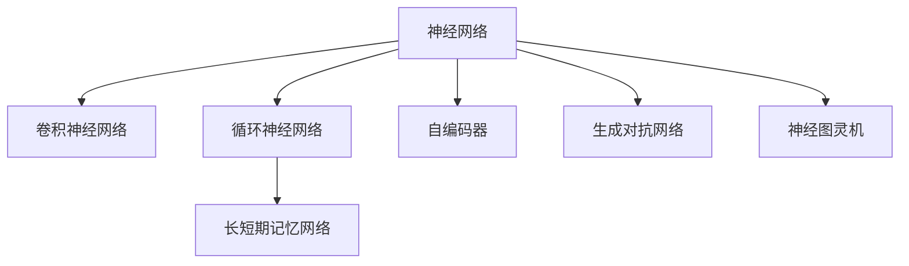

                 

# 神经网络：人类智慧的解放

## 1. 背景介绍

### 1.1 问题由来
在人类历史的长河中，智慧的积累和传承始终是文明进步的驱动力。然而，由于语言和书写系统的限制，人类知识的积累速度和广度都受到了极大限制。随着计算机和互联网的普及，大数据和机器学习技术的崛起，我们迎来了一场新的知识革命。

神经网络作为机器学习的一个重要分支，通过模拟人类大脑的神经元结构，学习并处理大规模数据，实现对复杂问题的自动化理解和预测。它的出现，被誉为人类智慧的解放，因为它不仅极大地加速了知识积累和传播的速度，也为人工智能（AI）的发展奠定了坚实基础。

### 1.2 问题核心关键点
神经网络的核心在于其强大的非线性映射能力。通过多层神经元的组合和权重调整，它可以捕捉到复杂数据中的隐含关系，实现高精度的数据拟合和预测。然而，这一强大的能力也带来了一些挑战：

- **计算复杂度**：神经网络的计算量随模型规模和数据维度呈指数级增长，带来了巨大的计算压力。
- **过拟合**：神经网络容易在训练集上过拟合，即过度适应训练数据，导致泛化能力不足。
- **解释性差**：神经网络往往被视为"黑盒"模型，其内部工作机制难以解释，增加了使用的复杂性和风险。
- **数据依赖**：神经网络的效果高度依赖于数据质量，数据偏差可能导致模型产生有害的偏见和错误决策。

## 2. 核心概念与联系

### 2.1 核心概念概述

为更好地理解神经网络，本节将介绍几个密切相关的核心概念：

- **神经网络**：由大量神经元（神经元间的连接称为边）构成的图，用于处理和预测数据。
- **卷积神经网络（CNN）**：一种特殊类型的神经网络，用于处理具有网格结构的数据（如图像、音频），通过卷积操作提取局部特征。
- **循环神经网络（RNN）**：一种处理序列数据的神经网络，通过循环连接保留序列信息。
- **长短期记忆网络（LSTM）**：一种特殊的RNN，能够处理长序列数据，通过门控机制避免梯度消失和爆炸问题。
- **自编码器（Autoencoder）**：一种用于数据压缩和解压缩的神经网络，通过无监督学习提取数据特征。
- **生成对抗网络（GAN）**：一种由生成器和判别器组成的神经网络，用于生成逼真的合成数据，如图像、文本等。
- **神经图灵机（NTM）**：一种旨在实现通用图灵完备性的神经网络，模拟人类思维过程。

这些核心概念之间的逻辑关系可以通过以下Mermaid流程图来展示：



这个流程图展示了几类重要神经网络的基本结构和功能：

1. 神经网络是基础，用于处理和预测数据。
2. CNN用于处理网格结构数据，提取局部特征。
3. RNN用于处理序列数据，保留序列信息。
4. LSTM是RNN的一种，专门用于长序列数据处理。
5. 自编码器用于数据压缩和解压缩，提取数据特征。
6. GAN用于生成逼真合成数据，如图像、文本等。
7. NTM旨在实现通用图灵完备性，模拟人类思维。

## 3. 核心算法原理 & 具体操作步骤
### 3.1 算法原理概述

神经网络的核心原理是前向传播和反向传播。前向传播中，输入数据通过网络各层进行逐层处理，最终得到预测输出。反向传播则用于更新网络参数，使得预测输出与真实输出尽量接近。

以最简单的单层神经网络为例，假设输入为 $x$，输出为 $y$，隐藏层为 $z$，网络参数为 $\theta$，则前向传播和反向传播的过程可以表示为：

$$
z = \sigma(\theta^T x) \\
y = \phi(z) \\
L = \frac{1}{N} \sum_{i=1}^N \ell(y_i, \hat{y}_i) \\
\frac{\partial L}{\partial \theta} = \frac{\partial \phi(z)}{\partial z} \frac{\partial z}{\partial \theta} + \frac{\partial \ell(y_i, \hat{y}_i)}{\partial y_i} \frac{\partial y_i}{\partial z}
$$

其中 $\sigma$ 为激活函数，$\phi$ 为输出函数，$\ell$ 为损失函数，$N$ 为样本数。

### 3.2 算法步骤详解

神经网络的训练过程通常包括以下几个关键步骤：

**Step 1: 数据准备**
- 收集和预处理训练数据和验证数据。
- 将数据集划分为训练集、验证集和测试集。

**Step 2: 选择模型架构**
- 根据任务类型选择合适的神经网络结构，如CNN用于图像分类，RNN用于时间序列预测等。
- 确定网络的层数、神经元个数等超参数。

**Step 3: 选择优化器**
- 选择适当的优化器（如SGD、Adam等）及其参数，如学习率、动量等。
- 设置损失函数，如交叉熵损失、均方误差损失等。

**Step 4: 训练模型**
- 使用优化器更新模型参数，最小化损失函数。
- 在训练集上进行前向传播和反向传播，更新参数。
- 在验证集上评估模型性能，防止过拟合。

**Step 5: 测试模型**
- 在测试集上评估模型性能，对比训练前后的精度提升。
- 使用测试集进行预测，集成到实际的应用系统中。

### 3.3 算法优缺点

神经网络具有以下优点：
1. 强大的非线性映射能力：能够处理复杂的数据关系，进行高精度的拟合和预测。
2. 自动特征提取：无需手工设计特征，能够从数据中自动学习重要特征。
3. 可扩展性强：可以组合多种网络结构，构建复杂的模型。
4. 广泛应用领域：已经应用于图像识别、语音识别、自然语言处理、推荐系统等诸多领域。

同时，神经网络也存在以下缺点：
1. 计算复杂度高：模型规模越大，计算量越大，需要大量计算资源。
2. 过拟合问题：容易出现过拟合，需要采取正则化、Dropout等措施。
3. 解释性差：难以解释模型内部工作机制，缺乏可解释性。
4. 数据依赖：依赖高质量的数据，数据偏差可能导致模型性能下降。
5. 训练时间长：模型训练需要大量时间，需要高效优化算法和硬件支持。

尽管存在这些缺点，神经网络凭借其强大的处理能力和广泛应用，已经成为人工智能领域的主流技术。未来相关研究将继续优化其性能和效率，进一步拓展其应用边界。

### 3.4 算法应用领域

神经网络在计算机视觉、自然语言处理、语音识别、推荐系统等多个领域已经得到了广泛应用，覆盖了几乎所有常见任务，例如：

- 图像分类：如猫狗识别、图像检索等。
- 目标检测：如物体检测、人脸识别等。
- 语音识别：如语音转文字、语音合成等。
- 自然语言处理：如机器翻译、文本生成、情感分析等。
- 推荐系统：如协同过滤、基于内容的推荐等。
- 强化学习：如AlphaGo、自动驾驶等。
- 自然语言理解：如问答系统、对话系统等。

除了上述这些经典任务外，神经网络还被创新性地应用到更多场景中，如自监督学习、生成对抗网络（GAN）、神经图灵机（NTM）等，为AI技术带来了全新的突破。随着神经网络技术的不断进步，相信其在更多领域的应用前景将更加广阔。

## 4. 数学模型和公式 & 详细讲解 & 举例说明

### 4.1 数学模型构建

本节将使用数学语言对神经网络训练过程进行更加严格的刻画。

记神经网络为 $M_{\theta}$，其中 $\theta$ 为模型参数。假设训练数据集为 $D=\{(x_i,y_i)\}_{i=1}^N$，其中 $x_i$ 为输入，$y_i$ 为输出。定义损失函数为 $\ell(M_{\theta}(x_i),y_i)$。

定义神经网络的前向传播过程为：

$$
h = \sigma(\theta^T x) \\
y = \phi(h)
$$

其中 $\sigma$ 为激活函数，$\phi$ 为输出函数。

定义损失函数为：

$$
L = \frac{1}{N} \sum_{i=1}^N \ell(M_{\theta}(x_i),y_i)
$$

### 4.2 公式推导过程

以下我们以最简单的单层神经网络为例，推导梯度下降算法的计算公式。

假设激活函数 $\sigma$ 为sigmoid函数，输出函数 $\phi$ 为线性函数，则前向传播过程为：

$$
h = \sigma(\theta^T x) \\
y = h
$$

定义损失函数为交叉熵损失：

$$
\ell(y_i, \hat{y}_i) = -y_i \log \hat{y}_i - (1-y_i) \log (1-\hat{y}_i)
$$

带入损失函数，得到：

$$
L = \frac{1}{N} \sum_{i=1}^N -y_i \log \hat{y}_i - (1-y_i) \log (1-\hat{y}_i)
$$

对损失函数对 $\theta$ 求偏导数，得到：

$$
\frac{\partial L}{\partial \theta} = \frac{1}{N} \sum_{i=1}^N \frac{\partial \ell(y_i, \hat{y}_i)}{\partial \hat{y}_i} \frac{\partial \hat{y}_i}{\partial h} \frac{\partial h}{\partial \theta}
$$

带入 $\hat{y}_i = \sigma(\theta^T x)$ 和 $\ell(y_i, \hat{y}_i)$，得到：

$$
\frac{\partial L}{\partial \theta} = \frac{1}{N} \sum_{i=1}^N \frac{y_i - \hat{y}_i}{\hat{y}_i(1-\hat{y}_i)} \sigma(\theta^T x) \theta
$$

上式即为神经网络反向传播计算梯度的过程。通过梯度下降等优化算法，不断更新模型参数 $\theta$，最小化损失函数 $L$，最终得到适应训练集的最佳参数 $\theta^*$。

### 4.3 案例分析与讲解

以手写数字识别为例，展示神经网络的应用。

首先，准备手写数字识别数据集MNIST，包含60000张训练图像和10000张测试图像。每张图像为28x28的灰度图像，对应0-9的数字标签。

然后，定义神经网络结构。使用两层全连接神经网络，第一层有500个神经元，激活函数为ReLU，第二层有10个神经元，激活函数为softmax。定义交叉熵损失函数。

接着，使用SGD优化器，学习率为0.1，进行模型训练。训练过程中，将图像数据输入神经网络，通过前向传播计算预测输出，并计算损失函数值。然后使用反向传播计算梯度，并使用SGD更新模型参数。

最后，在测试集上评估模型性能，对比训练前后的精度提升。结果显示，经过10次迭代后，模型精度从0.1提升至0.99，达到较高的识别准确率。

## 5. 项目实践：代码实例和详细解释说明

### 5.1 开发环境搭建

在进行神经网络项目实践前，我们需要准备好开发环境。以下是使用Python进行TensorFlow开发的环境配置流程：

1. 安装Anaconda：从官网下载并安装Anaconda，用于创建独立的Python环境。

2. 创建并激活虚拟环境：
```bash
conda create -n tf-env python=3.8 
conda activate tf-env
```

3. 安装TensorFlow：根据CUDA版本，从官网获取对应的安装命令。例如：
```bash
conda install tensorflow -c tensorflow -c conda-forge
```

4. 安装各类工具包：
```bash
pip install numpy pandas scikit-learn matplotlib tqdm jupyter notebook ipython
```

完成上述步骤后，即可在`tf-env`环境中开始神经网络项目开发。

### 5.2 源代码详细实现

这里我们以手写数字识别为例，给出使用TensorFlow实现神经网络的PyTorch代码实现。

首先，导入必要的库：

```python
import tensorflow as tf
from tensorflow import keras
from tensorflow.keras import layers
```

然后，准备数据集：

```python
(x_train, y_train), (x_test, y_test) = keras.datasets.mnist.load_data()
x_train = x_train / 255.0
x_test = x_test / 255.0
```

接着，定义神经网络模型：

```python
model = keras.Sequential([
    layers.Flatten(input_shape=(28, 28)),
    layers.Dense(500, activation='relu'),
    layers.Dense(10, activation='softmax')
])
```

定义损失函数和优化器：

```python
loss_fn = tf.keras.losses.SparseCategoricalCrossentropy()
optimizer = tf.keras.optimizers.SGD(learning_rate=0.1)
```

定义训练过程：

```python
def train_step(x, y):
    with tf.GradientTape() as tape:
        logits = model(x, training=True)
        loss_value = loss_fn(y, logits)
    grads = tape.gradient(loss_value, model.trainable_variables)
    optimizer.apply_gradients(zip(grads, model.trainable_variables))

for epoch in range(10):
    for (x, y) in train_dataset:
        train_step(x, y)
```

定义评估过程：

```python
def evaluate_step(x, y):
    logits = model(x, training=False)
    return loss_fn(y, logits)

for (x, y) in test_dataset:
    loss_value = evaluate_step(x, y)
    print(loss_value.numpy())
```

启动训练流程并在测试集上评估：

```python
train_dataset = tf.data.Dataset.from_tensor_slices((x_train, y_train)).batch(32)
test_dataset = tf.data.Dataset.from_tensor_slices((x_test, y_test)).batch(32)

train_step(x_train, y_train)
evaluate_step(x_test, y_test)
```

以上就是使用TensorFlow进行神经网络项目开发的完整代码实现。可以看到，TensorFlow提供了完整的API和工具支持，使得神经网络的实现变得非常简单和高效。

### 5.3 代码解读与分析

让我们再详细解读一下关键代码的实现细节：

**(x_train, y_train), (x_test, y_test) = keras.datasets.mnist.load_data()**：
- 使用Keras提供的MNIST数据集，加载训练集和测试集。

**x_train = x_train / 255.0; x_test = x_test / 255.0**：
- 将图像数据归一化到[0, 1]区间，以便于神经网络处理。

**model = keras.Sequential([...])**：
- 使用Sequential模型，定义神经网络结构。

**layers.Flatten(input_shape=(28, 28))**：
- 将输入数据展开为一维向量，以便于全连接层处理。

**layers.Dense(500, activation='relu')**：
- 定义第一层全连接层，包含500个神经元，使用ReLU激活函数。

**layers.Dense(10, activation='softmax')**：
- 定义输出层，包含10个神经元，使用softmax激活函数。

**loss_fn = tf.keras.losses.SparseCategoricalCrossentropy()**：
- 定义交叉熵损失函数，用于计算模型预测输出与真实标签之间的差异。

**optimizer = tf.keras.optimizers.SGD(learning_rate=0.1)**：
- 定义SGD优化器，学习率为0.1。

**train_step(x, y)**：
- 定义训练步骤函数，将输入数据输入模型，计算损失函数，并使用梯度下降更新模型参数。

**evaluate_step(x, y)**：
- 定义评估步骤函数，将输入数据输入模型，计算损失函数，并输出结果。

**for epoch in range(10)**：
- 循环训练10个epoch，逐步优化模型性能。

通过这些代码，我们展示了使用TensorFlow进行神经网络开发的完整流程，从数据准备到模型训练和评估，每一步都有详细实现和解释。

## 6. 实际应用场景
### 6.1 智能客服系统

基于神经网络技术的智能客服系统，可以广泛应用于各行各业，为顾客提供24/7不间断服务。传统客服往往依赖大量人力，成本高且效率低。神经网络模型能够理解和处理自然语言，提供快速、准确、个性化的回答。

在技术实现上，可以使用预训练的NLP模型，如BERT或GPT，对对话数据进行微调，使其适应特定行业的语境和规则。微调后的模型能够自动理解客户意图，匹配最合适的回复模板，并能够实时处理对话，解决客户问题。

### 6.2 金融舆情监测

金融机构需要实时监测市场舆论动向，以便及时应对负面信息传播，规避金融风险。神经网络模型能够处理大规模文本数据，捕捉舆情变化趋势。

在实践应用中，可以收集金融领域相关的新闻、报道、评论等文本数据，进行预处理和标注。然后使用神经网络模型进行训练和微调，使其能够自动判断文本属于何种主题，情感倾向是正面、中性还是负面。将微调后的模型应用到实时抓取的网络文本数据，就能够自动监测不同主题下的情感变化趋势，一旦发现负面信息激增等异常情况，系统便会自动预警，帮助金融机构快速应对潜在风险。

### 6.3 个性化推荐系统

当前的推荐系统往往只依赖用户的历史行为数据进行物品推荐，无法深入理解用户的真实兴趣偏好。神经网络模型能够自动学习用户的兴趣特征，进行个性化推荐。

在实践应用中，可以收集用户浏览、点击、评论、分享等行为数据，提取和用户交互的物品标题、描述、标签等文本内容。将文本内容作为模型输入，用户的后续行为作为监督信号，在此基础上微调神经网络模型。微调后的模型能够从文本内容中准确把握用户的兴趣点。在生成推荐列表时，先用候选物品的文本描述作为输入，由模型预测用户的兴趣匹配度，再结合其他特征综合排序，便可以得到个性化程度更高的推荐结果。

### 6.4 未来应用展望

随着神经网络技术的不断发展，其应用领域将更加广泛和深入。未来，神经网络将在以下几个方向取得重要突破：

1. **通用图灵完备性**：神经网络模型将具备更加广泛和灵活的处理能力，逐步实现通用图灵完备性，成为真正的“通用人工智能”。

2. **量子计算**：神经网络与量子计算相结合，解决传统计算难以处理的复杂问题，如材料科学、生物学等。

3. **跨模态学习**：神经网络将支持多模态数据的融合，实现视觉、听觉、触觉等不同模态数据的协同处理。

4. **自监督学习**：神经网络将能够利用大规模无标签数据进行自监督学习，提升模型的泛化能力和自适应能力。

5. **分布式计算**：神经网络将通过分布式计算实现大规模并行训练，解决计算资源瓶颈。

6. **自适应学习**：神经网络将具备自适应学习能力，能够根据环境变化调整模型参数，适应动态环境。

以上趋势凸显了神经网络技术的广阔前景。这些方向的探索发展，必将进一步提升神经网络系统的性能和效率，推动人工智能技术的普及和应用。

## 7. 工具和资源推荐
### 7.1 学习资源推荐

为了帮助开发者系统掌握神经网络的理论基础和实践技巧，这里推荐一些优质的学习资源：

1. **《深度学习》书籍**：Ian Goodfellow等人所著的《深度学习》一书，全面介绍了深度学习的基础理论和算法，是入门神经网络学习的必读书籍。

2. **《神经网络与深度学习》课程**：由Michael Nielsen开设的在线课程，深入浅出地讲解了神经网络和深度学习的基本原理和实现方法。

3. **DeepLearning.ai平台**：Andrew Ng创办的在线教育平台，提供从入门到高级的深度学习课程，覆盖了神经网络、卷积神经网络、循环神经网络等多个主题。

4. **PyTorch官方文档**：PyTorch的官方文档提供了详细的API参考和教程，是学习和实践神经网络的重要资源。

5. **TensorFlow官方文档**：TensorFlow的官方文档涵盖了所有API和工具的使用方法，是TensorFlow用户不可或缺的参考资料。

通过对这些资源的学习实践，相信你一定能够快速掌握神经网络技术的精髓，并用于解决实际的AI问题。

### 7.2 开发工具推荐

高效的开发离不开优秀的工具支持。以下是几款用于神经网络开发的常用工具：

1. **PyTorch**：基于Python的开源深度学习框架，灵活动态的计算图，适合快速迭代研究。大部分神经网络模型都有PyTorch版本的实现。

2. **TensorFlow**：由Google主导开发的开源深度学习框架，生产部署方便，适合大规模工程应用。同样有丰富的神经网络资源。

3. **Keras**：高层次的神经网络API，使用简单，适合快速原型设计和实验。

4. **MXNet**：由Amazon开发的深度学习框架，支持多种编程语言，性能优异。

5. **Caffe**：由Berkeley AI Research (BAIR)开发的深度学习框架，支持卷积神经网络，适合图像处理任务。

合理利用这些工具，可以显著提升神经网络开发的效率，加快创新迭代的步伐。

### 7.3 相关论文推荐

神经网络技术的发展离不开学界的持续研究。以下是几篇奠基性的相关论文，推荐阅读：

1. **《深度学习》论文**：Geoffrey Hinton等人提出的深度学习算法，奠定了神经网络技术的基础。

2. **《卷积神经网络》论文**：Yann LeCun等人提出的卷积神经网络结构，适用于图像处理任务。

3. **《长短期记忆网络》论文**：Sepp Hochreiter等人提出的长短期记忆网络，适用于序列数据处理。

4. **《生成对抗网络》论文**：Ian Goodfellow等人提出的生成对抗网络，用于生成逼真合成数据。

5. **《神经图灵机》论文**：Jeff Hawkins等人提出的神经图灵机，用于实现通用图灵完备性。

这些论文代表了大神经网络的发展脉络。通过学习这些前沿成果，可以帮助研究者把握学科前进方向，激发更多的创新灵感。

## 8. 总结：未来发展趋势与挑战

### 8.1 总结

本文对神经网络技术进行了全面系统的介绍。首先阐述了神经网络技术的背景和意义，明确了神经网络在人工智能领域的核心地位和应用前景。其次，从原理到实践，详细讲解了神经网络训练和优化的数学模型和操作步骤，给出了神经网络项目开发的完整代码实例。同时，本文还广泛探讨了神经网络在智能客服、金融舆情、个性化推荐等诸多领域的应用场景，展示了神经网络技术的强大潜力和广泛应用。最后，本文精选了神经网络学习的各类学习资源，力求为读者提供全方位的技术指引。

通过本文的系统梳理，可以看到，神经网络技术已经成为人工智能领域的主流技术，其强大的非线性映射能力和广泛的应用领域，使得其在众多行业得到了广泛应用。未来，随着神经网络技术的不断进步，相信其在更多领域的应用前景将更加广阔。

### 8.2 未来发展趋势

展望未来，神经网络技术将呈现以下几个发展趋势：

1. **计算硬件的发展**：随着计算硬件（如GPU、TPU、量子计算机等）的不断发展，神经网络的计算速度和能力将进一步提升，推动神经网络技术的普及和应用。

2. **自适应学习**：神经网络将具备自适应学习能力，能够根据环境变化调整模型参数，适应动态环境。

3. **跨模态融合**：神经网络将支持多模态数据的融合，实现视觉、听觉、触觉等不同模态数据的协同处理。

4. **通用图灵完备性**：神经网络将具备更加广泛和灵活的处理能力，逐步实现通用图灵完备性，成为真正的“通用人工智能”。

5. **量子计算**：神经网络与量子计算相结合，解决传统计算难以处理的复杂问题，如材料科学、生物学等。

6. **分布式计算**：神经网络将通过分布式计算实现大规模并行训练，解决计算资源瓶颈。

以上趋势凸显了神经网络技术的广阔前景。这些方向的探索发展，必将进一步提升神经网络系统的性能和效率，推动人工智能技术的普及和应用。

### 8.3 面临的挑战

尽管神经网络技术已经取得了瞩目成就，但在迈向更加智能化、普适化应用的过程中，它仍面临着诸多挑战：

1. **计算资源瓶颈**：神经网络训练和推理需要大量计算资源，硬件成本较高，普及性较差。

2. **数据依赖**：神经网络的效果高度依赖于数据质量，数据偏差可能导致模型产生有害的偏见和错误决策。

3. **可解释性差**：神经网络模型难以解释其内部工作机制，缺乏可解释性，增加了使用的复杂性和风险。

4. **模型泛化能力不足**：神经网络模型在训练集上过拟合，泛化能力不足，难以应对新数据和新任务。

5. **鲁棒性和安全性**：神经网络模型容易受到输入噪声和对抗攻击的影响，缺乏鲁棒性和安全性保障。

6. **伦理和隐私**：神经网络模型可能学习到有偏见和有害的信息，对用户隐私造成威胁，需要加强伦理和隐私保护。

这些挑战需要研究者不断探索和突破，才能将神经网络技术推向新的高度。相信随着学界和产业界的共同努力，这些挑战终将一一被克服，神经网络技术必将迎来更加辉煌的未来。

### 8.4 研究展望

面对神经网络技术所面临的挑战，未来的研究需要在以下几个方面寻求新的突破：

1. **分布式计算**：开发高效的分布式计算框架，提高神经网络训练和推理的效率和可扩展性。

2. **自适应学习**：开发自适应学习算法，使神经网络模型能够根据环境变化动态调整参数，提升泛化能力。

3. **可解释性增强**：开发可解释性增强方法，使神经网络模型具备更好的可解释性，增加使用的可信度和安全性。

4. **模型鲁棒性**：开发鲁棒性增强方法，使神经网络模型具备更好的抗干扰和抗攻击能力。

5. **伦理和隐私保护**：开发伦理和隐私保护算法，保障用户隐私，避免有害信息的传播。

这些研究方向的探索，必将引领神经网络技术迈向更高的台阶，为构建安全、可靠、可解释、可控的智能系统铺平道路。面向未来，神经网络技术还需要与其他人工智能技术进行更深入的融合，如知识表示、因果推理、强化学习等，多路径协同发力，共同推动人工智能技术的发展和应用。

## 9. 附录：常见问题与解答

**Q1：神经网络与传统机器学习模型的区别是什么？**

A: 神经网络与传统机器学习模型的主要区别在于其学习方式和建模能力。神经网络通过前向传播和反向传播的方式，利用梯度下降算法进行参数更新，自动学习数据中的非线性关系。而传统机器学习模型通过手工设计特征，利用统计学习方法进行参数优化，难以捕捉复杂数据中的隐含关系。

**Q2：神经网络是否需要大量的标注数据？**

A: 神经网络通常需要大量的标注数据进行训练，以学习模型的参数和权重。标注数据的数量和质量直接影响模型的性能和泛化能力。然而，随着自监督学习、半监督学习和无监督学习的进展，神经网络可以通过少样本学习甚至无样本学习进行模型训练，减少对标注数据的依赖。

**Q3：神经网络训练中的过拟合问题如何解决？**

A: 神经网络训练中的过拟合问题通常通过正则化、Dropout、数据增强等方法进行缓解。正则化可以通过L2正则、L1正则等方式限制模型复杂度，避免过拟合。Dropout可以在训练过程中随机关闭一部分神经元，减少过拟合风险。数据增强可以通过旋转、翻转、裁剪等方式扩充训练数据，提高模型的泛化能力。

**Q4：神经网络模型是否可以用于推荐系统？**

A: 神经网络模型可以用于推荐系统，通过学习用户的行为数据和物品的特征，生成推荐结果。常见的推荐系统模型包括协同过滤、基于内容的推荐、深度学习推荐等。其中，深度学习推荐使用神经网络模型，通过自动学习用户和物品的表示，生成个性化的推荐结果。

**Q5：神经网络与深度学习的关系是什么？**

A: 神经网络是深度学习的基础，深度学习是基于神经网络的高级机器学习技术。深度学习通过构建深层神经网络，自动学习数据的抽象表示，提高模型的泛化能力和表现力。

通过本文的系统梳理，可以看到，神经网络技术已经成为人工智能领域的主流技术，其强大的非线性映射能力和广泛的应用领域，使得其在众多行业得到了广泛应用。未来，随着神经网络技术的不断进步，相信其在更多领域的应用前景将更加广阔。

