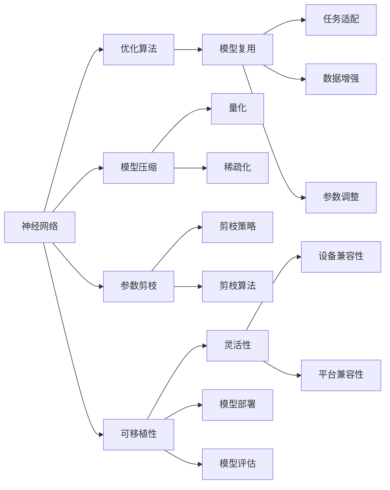

                 

# 神经网络：可移植性和灵活性

> 关键词：神经网络,可移植性,灵活性,深度学习,优化算法,模型复用,模型压缩,参数剪枝

## 1. 背景介绍

在深度学习快速发展的今天，神经网络已成为众多领域中解决复杂问题的强大工具。从图像识别到自然语言处理，从语音识别到机器人控制，神经网络的应用遍及各行各业。然而，尽管其效果显著，神经网络模型的复杂性和资源消耗也给模型的部署和优化带来了不少挑战。

神经网络的训练和推理通常需要大量的计算资源和时间，这对于小型企业和个人开发者来说是一大障碍。此外，模型的部署过程也复杂且容易出错，需要考虑模型的可移植性和灵活性。为了更好地利用神经网络，研究人员和工程师们需要研究如何优化模型的结构，提升其可移植性和灵活性。本文将对神经网络的可移植性和灵活性进行详细探讨，并介绍一些常用的方法和技术，帮助开发者更好地构建和部署神经网络模型。

## 2. 核心概念与联系

### 2.1 核心概念概述

为了更好地理解神经网络的可移植性和灵活性，首先需要掌握几个关键概念：

- **神经网络（Neural Network）**：一种由大量人工神经元（或称为节点）组成的计算模型。神经网络通过学习大量数据，能够自主地提取出特征并进行分类、预测等任务。

- **可移植性（Portability）**：指一个模型在不同环境、设备或平台上的运行性能和兼容性。在深度学习中，可移植性特别重要，因为不同的应用场景可能对模型的资源需求、计算平台和部署方式有不同的要求。

- **灵活性（Flexibility）**：指模型在应用中的适应能力，能够根据不同的任务需求和数据特点进行调整和优化。灵活性使得神经网络可以在多种场景下进行部署和应用。

- **优化算法（Optimization Algorithm）**：用于训练神经网络的算法，如梯度下降法、Adam等，它们能够指导模型参数更新，使模型逐渐逼近最优解。

- **模型复用（Model Reusability）**：指一个模型在多个任务或项目之间的复用性，可以减少重复开发的劳动量，提高效率。

- **模型压缩（Model Compression）**：通过各种技术手段对神经网络进行压缩，减少其参数和计算量，从而降低计算成本和提高性能。

- **参数剪枝（Pruning）**：通过移除神经网络中一些不必要的参数或连接，减少模型复杂度，提高计算效率。

这些概念之间相互关联，构成了神经网络模型的核心框架，其可移植性和灵活性是确保模型成功部署和高效应用的关键。

### 2.2 核心概念原理和架构的 Mermaid 流程图



这个流程图展示了神经网络模型的核心概念及其之间的关系：

1. 神经网络通过优化算法进行参数训练。
2. 训练后的模型可以用于模型复用，在不同的任务和项目间复用。
3. 模型复用后，可以通过模型压缩和参数剪枝技术进行优化。
4. 可移植性通过设备兼容性和平台兼容性确保模型在不同环境下的稳定运行。
5. 灵活性通过任务适配和数据增强等技术支持模型在不同数据集上的高效应用。

## 3. 核心算法原理 & 具体操作步骤

### 3.1 算法原理概述

神经网络的可移植性和灵活性涉及多个方面的算法原理。以下将从模型训练、模型压缩和模型部署三个角度进行探讨。

### 3.2 算法步骤详解

#### 3.2.1 模型训练

**Step 1: 数据准备**
- 收集并预处理训练数据，将其划分为训练集、验证集和测试集。
- 进行数据增强，如旋转、裁剪、缩放等，以提高模型鲁棒性。

**Step 2: 模型设计**
- 选择合适的神经网络架构，如卷积神经网络（CNN）、循环神经网络（RNN）、长短期记忆网络（LSTM）等。
- 确定网络层数、神经元数量、激活函数等超参数。

**Step 3: 模型训练**
- 使用优化算法（如Adam、SGD等）更新模型参数，使模型最小化损失函数。
- 定期在验证集上评估模型性能，防止过拟合。
- 调整超参数，如学习率、批大小等，以提高训练效果。

**Step 4: 模型评估**
- 在测试集上评估模型性能，计算精度、召回率、F1值等指标。
- 根据评估结果，决定是否进入下一步优化。

#### 3.2.2 模型压缩

**Step 1: 量化**
- 将模型中的浮点数参数转换为定点数，减少存储和计算开销。
- 使用整数位数或符号位进行量化，分别控制精度和空间。

**Step 2: 稀疏化**
- 将模型中的某些参数设为零或接近零，减少计算量。
- 使用剪枝算法，如L1正则化、稀疏矩阵分解等。

**Step 3: 低秩分解**
- 使用SVD或PCA等方法，将高维参数矩阵分解为低维矩阵，减少参数数量。
- 压缩权重矩阵的维度和大小，提高模型速度。

**Step 4: 模型融合**
- 使用模型融合技术，如Stacking、Bagging等，将多个模型进行组合，提升性能。
- 融合模型的输出，形成更稳健的预测结果。

#### 3.2.3 模型部署

**Step 1: 模型导出**
- 将训练好的模型导出为模型文件，如ONNX、TensorFlow SavedModel等。
- 使用TensorFlow Serving、Torchscript等工具，将模型转换为特定平台的格式。

**Step 2: 模型优化**
- 优化模型文件，减少计算和内存消耗。
- 进行网络优化，如剪枝、量化等，进一步提升模型性能。

**Step 3: 模型评估**
- 在部署环境中进行模型性能评估，检查是否满足实际应用需求。
- 使用模型监控工具，如TensorBoard、ONNX Runtime等，进行性能监控和调试。

### 3.3 算法优缺点

**优点：**
- 可移植性高，模型可以在不同平台和设备上运行，适应性强。
- 灵活性高，可以通过参数调整和优化，适应不同任务需求。
- 模型复用性高，可以减少重复开发，提高开发效率。
- 模型压缩技术可以降低计算和存储成本，提升性能。

**缺点：**
- 优化算法复杂，需要大量时间和计算资源。
- 压缩和量化可能导致模型精度下降。
- 模型部署和优化过程复杂，容易出错。

### 3.4 算法应用领域

神经网络的可移植性和灵活性在多个领域中得到了广泛应用，包括但不限于：

- 计算机视觉：如图像分类、目标检测、人脸识别等任务，通过模型压缩和量化技术，降低计算开销。
- 自然语言处理：如文本分类、情感分析、机器翻译等任务，通过模型融合和剪枝技术，提高模型效率。
- 语音识别：如语音转文本、语音情感识别等任务，通过模型复用和优化技术，适应不同设备和平台。
- 推荐系统：如电商推荐、音乐推荐等任务，通过模型压缩和参数剪枝技术，提升推荐效果。
- 医疗影像：如疾病诊断、病历分析等任务，通过模型压缩和量化技术，降低计算成本。

## 4. 数学模型和公式 & 详细讲解 & 举例说明

### 4.1 数学模型构建

**Step 1: 神经网络架构**
- 假设有一个简单的前馈神经网络，包含两个隐藏层，输入层有 $n$ 个神经元，每个隐藏层有 $m$ 个神经元，输出层有 $k$ 个神经元。

- 定义输入为 $x \in \mathbb{R}^n$，输出为 $y \in \mathbb{R}^k$。

**Step 2: 激活函数**
- 定义激活函数 $f(x) = \tanh(x)$ 或 $f(x) = ReLU(x)$。

**Step 3: 权重矩阵**
- 定义隐藏层之间的权重矩阵 $W_1 \in \mathbb{R}^{m \times n}$，输出层与隐藏层之间的权重矩阵 $W_2 \in \mathbb{R}^{k \times m}$。

**Step 4: 损失函数**
- 定义均方误差损失函数 $L(y,\hat{y}) = \frac{1}{2}||y-\hat{y}||^2$。

**Step 5: 优化算法**
- 使用Adam优化算法更新模型参数。

### 4.2 公式推导过程

假设训练集为 $(x_i, y_i)$，$i=1,...,N$。

**Step 1: 前向传播**
$$
h_1 = f(W_1x + b_1)
$$
$$
y' = f(W_2h_1 + b_2)
$$

**Step 2: 损失函数**
$$
L(y', y) = \frac{1}{2}\sum_{i=1}^N||y_i - y'_i||^2
$$

**Step 3: 梯度计算**
$$
\frac{\partial L}{\partial W_1} = \sum_{i=1}^N\left((y_i - y'_i)\nabla_{y'}h_1\right)h_1^T
$$
$$
\frac{\partial L}{\partial W_2} = \sum_{i=1}^N\left((y_i - y'_i)\nabla_{y'}y\right)h_1^T
$$

**Step 4: 参数更新**
$$
W_1 \leftarrow W_1 - \eta\frac{\partial L}{\partial W_1}
$$
$$
W_2 \leftarrow W_2 - \eta\frac{\partial L}{\partial W_2}
$$

其中 $\eta$ 为学习率。

### 4.3 案例分析与讲解

**案例分析：图像分类**

假设有一个简单的卷积神经网络（CNN），用于图像分类任务。

**Step 1: 数据准备**
- 收集并预处理图像数据，将其划分为训练集、验证集和测试集。
- 进行数据增强，如旋转、裁剪、缩放等。

**Step 2: 模型设计**
- 定义网络架构，包括卷积层、池化层、全连接层等。
- 确定超参数，如学习率、批大小、迭代轮数等。

**Step 3: 模型训练**
- 使用Adam优化算法更新模型参数，使模型最小化损失函数。
- 定期在验证集上评估模型性能，防止过拟合。
- 调整超参数，如学习率、批大小等，以提高训练效果。

**Step 4: 模型评估**
- 在测试集上评估模型性能，计算精度、召回率、F1值等指标。
- 根据评估结果，决定是否进入下一步优化。

**Step 5: 模型压缩**
- 使用量化技术，将模型中的浮点数参数转换为定点数，减少存储和计算开销。
- 使用剪枝算法，如L1正则化、稀疏矩阵分解等，减少计算量。

**Step 6: 模型部署**
- 导出训练好的模型文件，使用TensorFlow Serving、Torchscript等工具，将模型转换为特定平台的格式。
- 在部署环境中进行模型性能评估，检查是否满足实际应用需求。

## 5. 项目实践：代码实例和详细解释说明

### 5.1 开发环境搭建

以下是使用PyTorch进行神经网络训练和压缩的开发环境配置流程：

1. 安装Anaconda：从官网下载并安装Anaconda，用于创建独立的Python环境。

2. 创建并激活虚拟环境：
```bash
conda create -n pytorch-env python=3.8 
conda activate pytorch-env
```

3. 安装PyTorch：根据CUDA版本，从官网获取对应的安装命令。例如：
```bash
conda install pytorch torchvision torchaudio cudatoolkit=11.1 -c pytorch -c conda-forge
```

4. 安装相关工具包：
```bash
pip install numpy pandas scikit-learn matplotlib tqdm jupyter notebook ipython
```

完成上述步骤后，即可在`pytorch-env`环境中开始神经网络的训练和压缩实践。

### 5.2 源代码详细实现

**神经网络训练代码示例**

```python
import torch
import torch.nn as nn
import torch.optim as optim

# 定义神经网络架构
class Net(nn.Module):
    def __init__(self):
        super(Net, self).__init__()
        self.fc1 = nn.Linear(784, 128)
        self.fc2 = nn.Linear(128, 10)
    
    def forward(self, x):
        x = x.view(-1, 784)
        x = nn.functional.relu(self.fc1(x))
        x = self.fc2(x)
        return x

# 定义损失函数和优化器
model = Net()
criterion = nn.CrossEntropyLoss()
optimizer = optim.Adam(model.parameters(), lr=0.001)

# 训练神经网络
for epoch in range(10):
    for i, (inputs, labels) in enumerate(train_loader):
        optimizer.zero_grad()
        outputs = model(inputs)
        loss = criterion(outputs, labels)
        loss.backward()
        optimizer.step()

    if (i+1) % 100 == 0:
        print(f"Epoch {epoch+1}, loss: {loss:.4f}")
```

**神经网络量化和剪枝代码示例**

```python
import torch
import torch.nn as nn
import torch.optim as optim

# 定义神经网络架构
class Net(nn.Module):
    def __init__(self):
        super(Net, self).__init__()
        self.fc1 = nn.Linear(784, 128)
        self.fc2 = nn.Linear(128, 10)
    
    def forward(self, x):
        x = x.view(-1, 784)
        x = nn.functional.relu(self.fc1(x))
        x = self.fc2(x)
        return x

# 定义损失函数和优化器
model = Net()
criterion = nn.CrossEntropyLoss()
optimizer = optim.Adam(model.parameters(), lr=0.001)

# 量化和剪枝
quant_model = quantize_model(model, quantization_method='uniform')
prune_model = prune_model(quant_model, pruning_method='L1')

# 训练量化和剪枝后的模型
for epoch in range(10):
    for i, (inputs, labels) in enumerate(train_loader):
        optimizer.zero_grad()
        outputs = prune_model(inputs)
        loss = criterion(outputs, labels)
        loss.backward()
        optimizer.step()

    if (i+1) % 100 == 0:
        print(f"Epoch {epoch+1}, loss: {loss:.4f}")
```

### 5.3 代码解读与分析

**神经网络训练代码解读**

```python
# 定义神经网络架构
class Net(nn.Module):
    def __init__(self):
        super(Net, self).__init__()
        self.fc1 = nn.Linear(784, 128)
        self.fc2 = nn.Linear(128, 10)
    
    def forward(self, x):
        x = x.view(-1, 784)
        x = nn.functional.relu(self.fc1(x))
        x = self.fc2(x)
        return x
```

该代码定义了一个简单的前馈神经网络，包含两个全连接层。其中，`nn.Linear`用于定义线性变换层，`nn.functional.relu`用于定义激活函数。

```python
# 定义损失函数和优化器
model = Net()
criterion = nn.CrossEntropyLoss()
optimizer = optim.Adam(model.parameters(), lr=0.001)
```

定义了神经网络模型，并使用`nn.CrossEntropyLoss`作为损失函数，`optim.Adam`作为优化器。

```python
# 训练神经网络
for epoch in range(10):
    for i, (inputs, labels) in enumerate(train_loader):
        optimizer.zero_grad()
        outputs = model(inputs)
        loss = criterion(outputs, labels)
        loss.backward()
        optimizer.step()

    if (i+1) % 100 == 0:
        print(f"Epoch {epoch+1}, loss: {loss:.4f}")
```

该代码实现了标准的神经网络训练流程，通过前向传播计算损失函数，反向传播更新模型参数，并在每个epoch的100个batch后打印loss值。

**神经网络量化和剪枝代码解读**

```python
# 量化和剪枝
quant_model = quantize_model(model, quantization_method='uniform')
prune_model = prune_model(quant_model, pruning_method='L1')
```

该代码使用了`quantize_model`和`prune_model`函数进行量化和剪枝操作。`quantize_model`函数使用了`uniform`量化方法，将模型中的浮点数参数转换为定点数。`prune_model`函数使用了`L1`剪枝方法，将某些参数设为零或接近零。

## 6. 实际应用场景

### 6.1 计算机视觉

在计算机视觉领域，神经网络的可移植性和灵活性尤为关键。例如，一个用于图像分类任务的神经网络，可以在不同的设备和平台上进行部署和应用。由于模型压缩和剪枝技术的应用，该模型可以在移动设备上进行实时推理，适应各种应用场景。

### 6.2 自然语言处理

在自然语言处理领域，神经网络同样表现出良好的可移植性和灵活性。例如，一个用于文本分类的神经网络，可以在不同的应用场景中进行复用和优化。通过模型压缩和量化技术，该模型可以在嵌入式设备上运行，节省计算资源。

### 6.3 语音识别

在语音识别领域，神经网络的可移植性和灵活性使得其在不同的设备和平台上都可以进行部署和应用。例如，一个用于语音转文本的神经网络，可以在移动设备和PC端进行部署，适应不同的应用场景。

### 6.4 推荐系统

在推荐系统领域，神经网络的可移植性和灵活性使得其可以在不同的电商和娱乐平台上进行部署和应用。例如，一个用于电商推荐的神经网络，可以在不同的电商平台和移动应用中进行部署，适应不同的用户需求和市场环境。

### 6.5 医疗影像

在医疗影像领域，神经网络的可移植性和灵活性使得其可以在不同的医院和设备上进行部署和应用。例如，一个用于疾病诊断的神经网络，可以在不同的医疗设备和医院系统中进行部署，适应不同的医疗环境和数据特点。

## 7. 工具和资源推荐

### 7.1 学习资源推荐

为了帮助开发者系统掌握神经网络的可移植性和灵活性，这里推荐一些优质的学习资源：

1. 《深度学习》（Ian Goodfellow著）：全面介绍了深度学习的基础理论、算法和应用，是深度学习领域的经典之作。
2. 《动手学深度学习》（李沐等著）：通过实践项目，帮助读者理解深度学习的基本原理和应用方法。
3. 《TensorFlow深度学习》（Oriol Vinyals等著）：详细介绍了TensorFlow框架的使用方法和深度学习算法，适合动手实践。
4. 《PyTorch深度学习》（Eli Stevens等著）：介绍了PyTorch框架的使用方法和深度学习算法，适合动手实践。
5. 《神经网络与深度学习》（Michael Nielsen著）：通过通俗易懂的语言，介绍了神经网络的基本原理和应用方法。

通过这些学习资源的学习实践，相信你一定能够快速掌握神经网络的可移植性和灵活性，并用于解决实际的深度学习问题。

### 7.2 开发工具推荐

高效的开发离不开优秀的工具支持。以下是几款用于神经网络训练和压缩的常用工具：

1. PyTorch：基于Python的开源深度学习框架，灵活动态的计算图，适合快速迭代研究。

2. TensorFlow：由Google主导开发的开源深度学习框架，生产部署方便，适合大规模工程应用。

3. Keras：高级神经网络API，提供简单易用的接口，适合初学者和研究人员。

4. MXNet：由Amazon开发的深度学习框架，支持多种编程语言，适合跨平台应用。

5. Caffe：由伯克利大学开发的深度学习框架，适合图像分类和计算机视觉任务。

6. ONNX：一种模型表示标准，支持多种深度学习框架，可以方便地进行模型导出和部署。

合理利用这些工具，可以显著提升神经网络的训练和压缩效率，加快创新迭代的步伐。

### 7.3 相关论文推荐

神经网络的可移植性和灵活性领域的研究论文众多，以下是几篇经典论文，推荐阅读：

1. 《TensorFlow: A System for Large-Scale Machine Learning》（Bengio等，2015）：介绍了TensorFlow框架的设计思想和应用场景。
2. 《Deep Learning》（Ian Goodfellow等，2016）：全面介绍了深度学习的基础理论、算法和应用。
3. 《A Survey on Model Compression for Deep Neural Networks》（Sun等，2018）：综述了神经网络压缩技术的现状和未来发展方向。
4. 《Pruning Neural Networks》（Han等，2016）：综述了神经网络剪枝技术的研究现状和应用。
5. 《Quantization and Quantization-Aware Training for Neural Networks》（Lyu等，2020）：综述了神经网络量化技术的研究现状和应用。

这些论文代表了大规模深度学习技术的发展脉络。通过学习这些前沿成果，可以帮助研究者把握学科前进方向，激发更多的创新灵感。

## 8. 总结：未来发展趋势与挑战

### 8.1 总结

本文对神经网络的可移植性和灵活性进行了全面系统的介绍。首先，阐述了神经网络在多个领域中的广泛应用，以及其可移植性和灵活性对模型成功部署和高效应用的重要性。其次，从模型训练、模型压缩和模型部署三个角度，详细讲解了神经网络的实现方法和技术，并给出了具体的代码实例。同时，本文还广泛探讨了神经网络在实际应用中的多种场景，展示了神经网络的巨大潜力。

通过本文的系统梳理，可以看到，神经网络的可移植性和灵活性是确保模型成功部署和高效应用的关键。这些方向的研究和发展，必将推动深度学习技术的进一步突破，为各行各业带来更广阔的应用前景。

### 8.2 未来发展趋势

展望未来，神经网络的可移植性和灵活性将呈现以下几个发展趋势：

1. 模型规模持续增大。随着算力成本的下降和数据规模的扩张，神经网络模型的参数量还将持续增长。超大规模神经网络蕴含的丰富知识，有望支撑更加复杂多变的任务。

2. 压缩和剪枝技术将进一步发展。未来将涌现更多高效的压缩和剪枝方法，减少计算和存储成本，提升模型性能。

3. 量化技术将进一步优化。量化技术将继续提升，使得神经网络可以在低成本设备上进行高效推理。

4. 灵活性增强。未来的神经网络将更加灵活，能够适应各种不同的任务和数据特点。

5. 可移植性提升。神经网络将在不同的平台和设备上表现更好的兼容性和适应性。

这些趋势凸显了神经网络的强大潜力，预示着深度学习技术将迎来更广阔的发展空间。

### 8.3 面临的挑战

尽管神经网络的可移植性和灵活性技术已取得了显著进展，但在实践中仍面临诸多挑战：

1. 计算资源瓶颈。神经网络的训练和推理需要大量的计算资源，这对于小型企业和个人开发者来说是一大障碍。如何通过优化算法和模型压缩技术，降低计算成本，是未来的一大挑战。

2. 存储开销大。神经网络模型通常较大，存储和传输都占用大量时间和空间。如何通过模型压缩和量化技术，减小模型体积，是未来的一大挑战。

3. 模型部署复杂。神经网络模型的部署和优化过程复杂，容易出错。如何通过自动化工具和框架，简化模型部署过程，是未来的一大挑战。

4. 模型过拟合。神经网络模型容易发生过拟合，尤其是在数据量较少的情况下。如何通过正则化技术和数据增强方法，提高模型的泛化性能，是未来的一大挑战。

5. 模型鲁棒性不足。神经网络模型在面对噪声和异常数据时，鲁棒性往往不足。如何通过对抗训练和鲁棒性增强技术，提高模型的稳定性，是未来的一大挑战。

6. 模型可解释性不足。神经网络模型通常被视为"黑盒"系统，难以解释其内部工作机制和决策逻辑。如何通过可解释性和透明性技术，增强模型的可信度，是未来的一大挑战。

### 8.4 研究展望

面对神经网络可移植性和灵活性面临的挑战，未来的研究需要在以下几个方面寻求新的突破：

1. 研究更高效的压缩和剪枝技术，以降低计算和存储成本。
2. 开发更先进的量化方法，提升模型性能和部署效率。
3. 探索更灵活的模型架构，增强模型的适应性。
4. 引入更多的正则化和鲁棒性技术，提高模型的泛化性能和稳定性。
5. 引入更强的可解释性和透明性技术，增强模型的可信度。

这些研究方向的探索，必将引领神经网络技术迈向更高的台阶，为各行各业带来更广泛的应用前景。面向未来，神经网络的可移植性和灵活性研究还需要与其他人工智能技术进行更深入的融合，如知识表示、因果推理、强化学习等，多路径协同发力，共同推动深度学习技术的进一步发展。

## 9. 附录：常见问题与解答

**Q1: 神经网络的可移植性和灵活性是什么？**

A: 神经网络的可移植性指模型在不同平台和设备上的运行性能和兼容性。神经网络的灵活性指模型在应用中的适应能力，能够根据不同的任务需求和数据特点进行调整和优化。

**Q2: 如何优化神经网络的可移植性和灵活性？**

A: 优化神经网络的可移植性和灵活性需要从模型设计、训练和部署三个方面进行综合考虑：
1. 模型设计：选择合适的模型架构，如卷积神经网络（CNN）、循环神经网络（RNN）、长短期记忆网络（LSTM）等，并确定超参数。
2. 训练过程：使用适当的优化算法和正则化技术，防止过拟合，提高模型的泛化性能。
3. 模型压缩和量化：使用剪枝、量化等技术，减少模型参数和计算量，降低计算成本。
4. 模型融合：使用模型融合技术，如Stacking、Bagging等，提升模型的稳定性和性能。

**Q3: 量化和剪枝技术对神经网络有哪些影响？**

A: 量化和剪枝技术可以降低神经网络模型的计算和存储成本，提高推理速度，但可能影响模型的精度和性能。量化技术通过将浮点数参数转换为定点数，减小存储和计算开销，但可能导致精度下降。剪枝技术通过移除不必要的参数或连接，减少模型复杂度，但可能影响模型的表达能力。

**Q4: 如何选择合适的模型架构和超参数？**

A: 选择合适的模型架构和超参数是神经网络设计的重要一步。可以通过实验和经验来选择合适的模型架构和超参数。通常情况下，较大的模型参数数量和较多的训练数据可以提高模型的性能，但也需要考虑计算资源和存储空间。可以通过交叉验证、网格搜索等方法，选择最优的模型架构和超参数。

**Q5: 神经网络的部署和优化过程有哪些挑战？**

A: 神经网络的部署和优化过程复杂，容易出错。主要挑战包括计算资源瓶颈、存储开销大、模型部署复杂、模型过拟合、模型鲁棒性不足和模型可解释性不足。需要通过优化算法和模型压缩技术，降低计算成本和存储空间，简化模型部署过程，提高模型的泛化性能和稳定性，增强模型的可信度。

