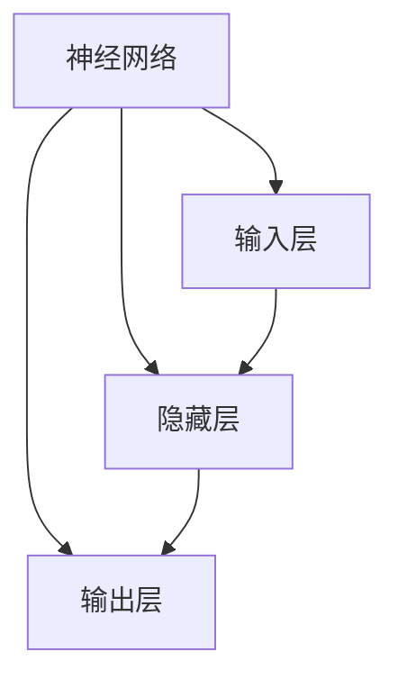
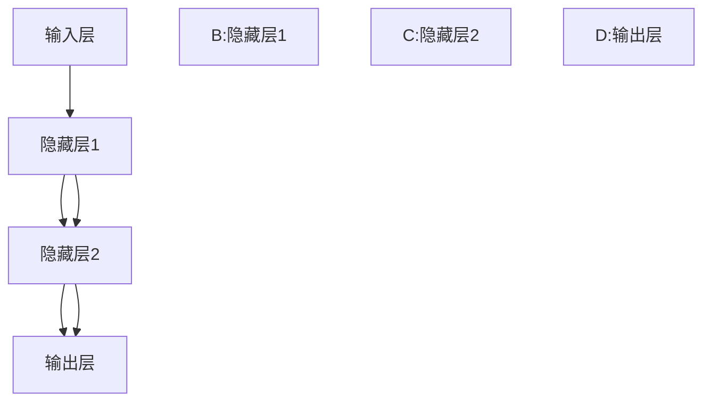
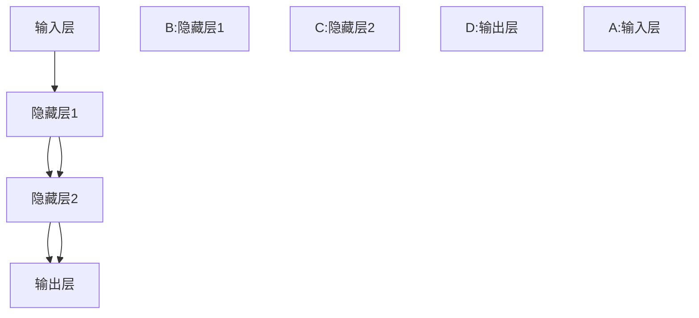

                 

# 神经网络：探索未知的领域

> 关键词：神经网络,深度学习,算法原理,数学模型,优化器,激活函数,反向传播,卷积神经网络,循环神经网络,深度强化学习

## 1. 背景介绍

### 1.1 问题由来
在人工智能领域，深度学习作为实现复杂模型任务的一种先进技术，被广泛应用。特别是在计算机视觉、自然语言处理等领域，深度学习模型取得了令人瞩目的成果。而神经网络作为深度学习的一种主要形式，其独特的模型结构和强大的学习能力，使其在处理复杂非线性问题时表现出色。本文将重点探讨神经网络，特别是深度神经网络的核心概念和算法原理，帮助读者深入理解这一强大的AI技术。

### 1.2 问题核心关键点
神经网络的应用范围非常广泛，涵盖了图像识别、语音识别、自然语言处理、游戏智能等多个领域。然而，神经网络的内部工作机制、模型结构以及训练方法等，对很多人来说仍然是一个谜团。本节将明确提出神经网络的核心关键点，并通过一个简单的流程图来帮助理解。



### 1.3 问题研究意义
理解神经网络的核心概念和算法原理，对于推动人工智能技术的发展，尤其是在实际应用中的部署和优化，具有重要意义。通过深入学习，可以更好地设计和使用神经网络模型，解决实际问题，加速人工智能技术的落地应用。

## 2. 核心概念与联系

### 2.1 核心概念概述

神经网络是一种仿生学的计算模型，模仿人类大脑的神经元工作原理。它由大量的人工神经元通过连接组成。神经网络的输入层接收外部信息，隐藏层进行数据处理，输出层提供最终结果。

**隐藏层**是神经网络的核心部分，包含多个神经元，每个神经元接收前一层神经元的输出，并结合自己的权重和激活函数，计算得到下一层的输入。

### 2.2 核心概念原理和架构的 Mermaid 流程图
神经网络的完整架构如图示：



### 2.3 核心概念之间的联系
神经网络中的数据流是从输入层经过隐藏层，最后到达输出层的。每个隐藏层会收到前一层的所有神经元的输出，并结合自身的权重和激活函数计算得到新的输出。这种层层传递、逐步抽象的过程，使得神经网络能够从大量数据中学习出复杂非线性模型。

## 3. 核心算法原理 & 具体操作步骤
### 3.1 算法原理概述

神经网络的核心算法原理主要体现在前向传播和反向传播两个部分。

前向传播是神经网络的预测过程，即从输入层开始，经过多个隐藏层，最终输出预测结果。反向传播则是通过计算预测误差，反向调整网络参数以最小化误差的过程。

### 3.2 算法步骤详解

1. **前向传播（Forward Propagation）**：
   - 将输入数据传入网络，计算每个隐藏层的输出，并传递到下一层。
   - 对于每个神经元，计算输入加权和加上偏置，通过激活函数得到输出。
   - 最终将输出层的结果作为模型的预测结果。

2. **损失函数（Loss Function）**：
   - 计算模型的预测结果与实际结果之间的误差，通常使用均方误差或交叉熵等。
   - 损失函数越小，模型的预测性能越好。

3. **反向传播（Backward Propagation）**：
   - 通过计算损失函数对每个神经元输出的梯度，反向传播误差到隐藏层。
   - 利用梯度下降等优化算法更新模型参数，最小化损失函数。
   - 通常采用随机梯度下降（SGD）或其变种算法，如Adam、RMSprop等。

### 3.3 算法优缺点

神经网络算法的优点包括：
- **处理复杂非线性问题**：神经网络能够学习非线性模型，适用于各种复杂数据处理任务。
- **自适应学习能力**：通过大量数据训练，神经网络能够适应不同场景下的数据分布。
- **并行计算**：神经网络的结构使其天然适合并行计算，能够高效利用多核CPU/GPU等计算资源。

缺点包括：
- **过拟合风险**：神经网络有较大的参数量，容易过拟合。
- **训练复杂度**：需要大量的标注数据和计算资源，训练过程复杂。
- **模型解释性差**：神经网络通常被视为"黑盒"模型，难以解释其内部机制和决策过程。

### 3.4 算法应用领域

神经网络在计算机视觉、自然语言处理、游戏智能等领域广泛应用。例如：
- 图像识别：卷积神经网络（CNN）能够有效地识别图像中的物体和特征。
- 语音识别：递归神经网络（RNN）能够处理时间序列数据，识别语音信号。
- 自然语言处理：长短时记忆网络（LSTM）能够处理文本序列，进行文本分类和情感分析。
- 游戏智能：深度强化学习结合神经网络，能够进行自学习游戏策略，取得优秀表现。

## 4. 数学模型和公式 & 详细讲解 & 举例说明

### 4.1 数学模型构建

神经网络可以视为一个映射函数 $f(x;\theta)$，其中 $x$ 是输入数据，$\theta$ 是模型参数。

前向传播的计算过程可以表示为：

$$
z^{(i)} = \sum_{j=1}^{n_i} x_jw_j + b_i
$$

$$
a^{(i)} = g(z^{(i)})
$$

其中 $z^{(i)}$ 是神经元 $i$ 的加权输入，$a^{(i)}$ 是神经元 $i$ 的激活输出，$g(z)$ 是激活函数，通常使用Sigmoid、ReLU等。

### 4.2 公式推导过程

以一个简单的三层神经网络为例，其前向传播和反向传播过程可以表示为：

**前向传播**：

$$
a^{(1)} = g(z^{(1)}) = g(\sum_{j=1}^{n_0} x_jw_j^{(1)} + b^{(1)})
$$

$$
a^{(2)} = g(z^{(2)}) = g(\sum_{j=1}^{n_1} a_j^{(1)}w_j^{(2)} + b^{(2)})
$$

$$
a^{(3)} = g(z^{(3)}) = g(\sum_{j=1}^{n_2} a_j^{(2)}w_j^{(3)} + b^{(3)})
$$

其中 $w_j$ 是神经元间的权重，$b$ 是偏置项。

**反向传播**：

$$
\frac{\partial L}{\partial w^{(l)}} = \frac{\partial L}{\partial z^{(l)}}\frac{\partial z^{(l)}}{\partial w^{(l)}}
$$

$$
\frac{\partial L}{\partial w^{(l)}} = \frac{\partial L}{\partial a^{(l)}}\frac{\partial a^{(l)}}{\partial z^{(l)}}\frac{\partial z^{(l)}}{\partial w^{(l)}}
$$

其中 $L$ 是损失函数。

### 4.3 案例分析与讲解

以MNIST手写数字识别为例，神经网络的结构如图：



前向传播计算：

$$
z^{(1)} = \sum_{j=1}^{784} x_jw_j^{(1)} + b^{(1)}
$$

$$
a^{(1)} = g(z^{(1)}) = g(z^{(1)})
$$

$$
z^{(2)} = \sum_{j=1}^{100} a_j^{(1)}w_j^{(2)} + b^{(2)}
$$

$$
a^{(2)} = g(z^{(2)}) = g(z^{(2)})
$$

$$
z^{(3)} = \sum_{j=1}^{10} a_j^{(2)}w_j^{(3)} + b^{(3)}
$$

$$
a^{(3)} = g(z^{(3)}) = g(z^{(3)})
$$

反向传播计算：

$$
\frac{\partial L}{\partial w^{(3)}} = \frac{\partial L}{\partial a^{(3)}}\frac{\partial a^{(3)}}{\partial z^{(3)}}\frac{\partial z^{(3)}}{\partial w^{(3)}}
$$

$$
\frac{\partial L}{\partial w^{(2)}} = \frac{\partial L}{\partial a^{(2)}}\frac{\partial a^{(2)}}{\partial z^{(2)}}\frac{\partial z^{(2)}}{\partial w^{(2)}}
$$

$$
\frac{\partial L}{\partial w^{(1)}} = \frac{\partial L}{\partial a^{(1)}}\frac{\partial a^{(1)}}{\partial z^{(1)}}\frac{\partial z^{(1)}}{\partial w^{(1)}}
$$

## 5. 项目实践：代码实例和详细解释说明

### 5.1 开发环境搭建

**Python环境**：
1. 安装Python 3.7+。
2. 使用Anaconda或Miniconda管理Python环境。

**深度学习框架**：
1. 安装TensorFlow 2.x或PyTorch 1.x。
2. 安装Keras作为高层次API。

**深度学习库**：
1. 安装NumPy、SciPy、Matplotlib、pandas等数据处理库。
2. 安装Tensorboard或Weights & Biases进行模型训练监控。

### 5.2 源代码详细实现

以下是一个使用Keras实现简单神经网络的代码示例：

```python
import tensorflow as tf
from tensorflow import keras

# 定义神经网络模型
model = keras.Sequential([
    keras.layers.Dense(64, activation='relu', input_shape=(784,)),
    keras.layers.Dense(10)
])

# 编译模型
model.compile(optimizer='adam', loss='categorical_crossentropy', metrics=['accuracy'])

# 训练模型
model.fit(x_train, y_train, epochs=10, validation_data=(x_test, y_test))
```

### 5.3 代码解读与分析

1. **Sequential模型**：使用keras.Sequential创建序列模型，定义了两个Dense层，第一个层有64个神经元，激活函数为ReLU，第二个层有10个神经元，输出softmax结果。
2. **编译模型**：使用adam优化器、交叉熵损失函数和准确率指标进行模型编译。
3. **训练模型**：使用fit方法训练模型，输入数据为x_train，标签为y_train，验证集为x_test和y_test，迭代10次。

### 5.4 运行结果展示

训练结束后，使用模型进行预测，并计算准确率：

```python
test_loss, test_acc = model.evaluate(x_test, y_test)
print('Test accuracy:', test_acc)
```

## 6. 实际应用场景

### 6.1 计算机视觉

神经网络在计算机视觉领域具有广泛的应用。例如，卷积神经网络（CNN）被用于图像分类、物体检测和图像生成。通过训练大量的图像数据，神经网络可以学习到图像的特征和模式，并进行高精度分类。

### 6.2 自然语言处理

在自然语言处理领域，神经网络主要用于文本分类、情感分析和机器翻译等任务。例如，使用循环神经网络（RNN）和长短时记忆网络（LSTM）进行文本生成和语言模型训练。

### 6.3 游戏智能

深度强化学习结合神经网络，使计算机能够在复杂的游戏环境中进行自我学习，如AlphaGo、OpenAI Gym等。

### 6.4 未来应用展望

未来，神经网络在更多领域的应用将更加广泛。例如，在医疗领域，神经网络可以用于医学图像诊断和疾病预测；在金融领域，神经网络可以用于风险评估和股票预测。

## 7. 工具和资源推荐

### 7.1 学习资源推荐

1. 《深度学习》（Ian Goodfellow、Yoshua Bengio、Aaron Courville著）：深度学习领域的经典教材，系统介绍了深度学习的基本原理和应用。
2. 《神经网络与深度学习》（Michael Nielsen著）：深入浅出地介绍了神经网络和深度学习的基础知识和算法原理。
3. 《动手学深度学习》：由深度学习专家开发的在线课程，包含大量实践案例和代码示例。
4. TensorFlow官方文档和教程：详细介绍了TensorFlow框架的使用和应用。
5. PyTorch官方文档和教程：详细介绍了PyTorch框架的使用和应用。

### 7.2 开发工具推荐

1. Jupyter Notebook：一个交互式的开发环境，支持Python代码的编写和执行。
2. TensorFlow、PyTorch等深度学习框架：提供丰富的API和模型库，方便进行模型构建和训练。
3. Keras：高层次的深度学习API，适合快速搭建神经网络模型。
4. Weights & Biases：用于模型训练和实验跟踪的工具，方便记录和分析实验结果。
5. Tensorboard：用于模型训练和监控的工具，方便可视化训练过程和结果。

### 7.3 相关论文推荐

1. A Few Useful Things to Know About Neural Network Optimization（J. Martens et al.）：介绍了深度学习中优化器的选择和使用技巧。
2. Deep Residual Learning for Image Recognition（Kaiming He et al.）：介绍了ResNet模型，并通过实验证明了其有效性。
3. Attention is All You Need（Ashish Vaswani et al.）：介绍了Transformer模型，推动了NLP领域的发展。
4. GANs Trained by a Two Time-Scale Update Rule Converge to the Fixed Points of Their Limiting Dynamics（Ian Goodfellow et al.）：介绍了GAN模型，并证明了其在图像生成中的表现。
5. Training RNNs with Long-Term Dependencies（Yoshua Bengio et al.）：介绍了RNN模型，并提出了LSTM网络，解决了长序列输入的问题。

## 8. 总结：未来发展趋势与挑战

### 8.1 研究成果总结

本文系统地介绍了神经网络的核心概念和算法原理，并通过一个简单的代码示例展示了如何构建和训练神经网络模型。通过对深度学习领域的学习资源、开发工具和相关论文的推荐，希望帮助读者更好地理解和应用神经网络。

### 8.2 未来发展趋势

1. **模型规模增大**：神经网络模型将继续朝着更大的规模和更高的复杂度发展，以适应更复杂的数据和任务。
2. **模型并行化**：随着计算资源的增加，神经网络的并行计算能力将得到进一步提升，推动深度学习技术的应用。
3. **无监督学习**：无监督学习将逐渐成为神经网络的重要研究方向，利用未标注数据进行模型训练和优化。
4. **跨领域应用**：神经网络将更多地应用于跨领域的多模态数据处理，如视觉、语音和文本的联合分析。

### 8.3 面临的挑战

1. **过拟合问题**：神经网络模型容易过拟合，特别是在数据量不足的情况下。
2. **计算资源消耗**：神经网络需要大量的计算资源，如何在资源有限的情况下优化模型性能。
3. **模型解释性**：神经网络的决策过程难以解释，如何提高模型的透明性和可解释性。

### 8.4 研究展望

未来，神经网络的研究将继续深入，探索新的模型结构、优化算法和应用场景。同时，如何在资源有限的情况下优化模型性能，提高模型的透明性和可解释性，也将成为重要的研究方向。

## 9. 附录：常见问题与解答

**Q1：什么是神经网络？**

A: 神经网络是一种仿生学的计算模型，通过大量的人工神经元通过连接组成，能够处理复杂非线性问题。

**Q2：神经网络有哪些常见的激活函数？**

A: 常见的激活函数包括Sigmoid、ReLU、Tanh等，不同类型的激活函数适用于不同的场景和任务。

**Q3：神经网络的反向传播算法是如何工作的？**

A: 反向传播算法通过计算损失函数对每个神经元输出的梯度，反向传播误差到隐藏层，利用梯度下降等优化算法更新模型参数。

**Q4：深度学习框架和工具有哪些？**

A: 深度学习框架包括TensorFlow、PyTorch等，工具包括Keras、Weights & Biases、Tensorboard等，这些工具大大简化了模型的构建和训练过程。

**Q5：神经网络有哪些重要的应用领域？**

A: 神经网络广泛应用于计算机视觉、自然语言处理、游戏智能等领域，推动了这些领域的技术进步。

作者：禅与计算机程序设计艺术 / Zen and the Art of Computer Programming

