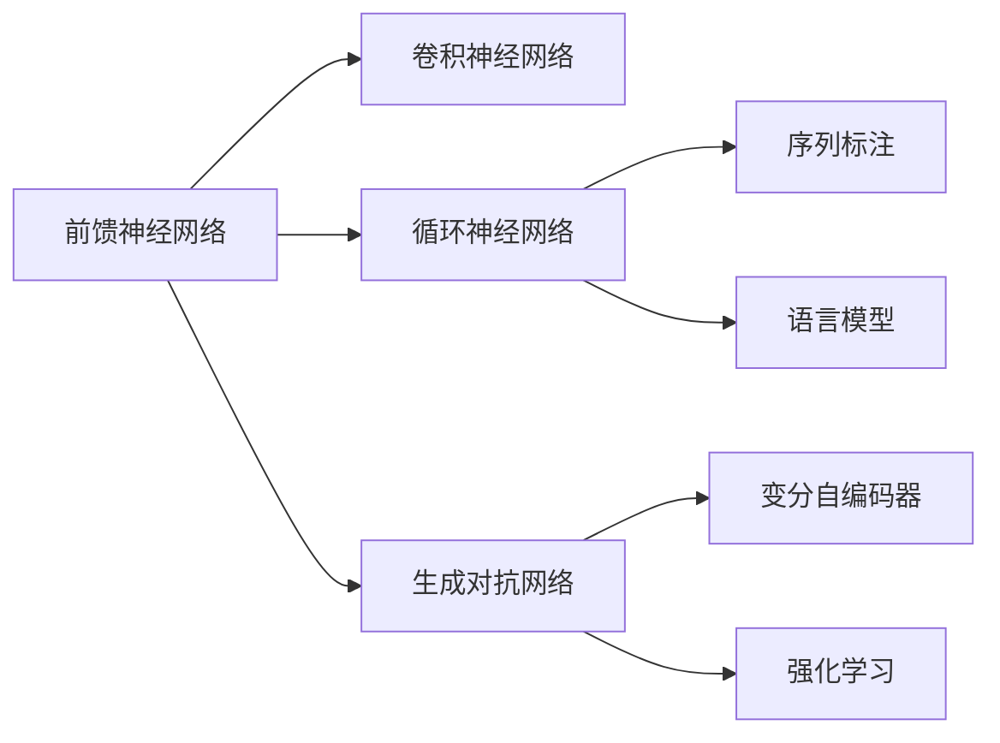

                 

## 1. 背景介绍

### 1.1 问题由来
自1940年代首次提出神经网络概念以来，人工智能领域已历经数十年的演进。其中，神经网络在模式识别、自然语言处理、计算机视觉等诸多领域，逐步展现出了卓越的性能和应用潜力。然而，神经网络的原理和特性依旧包含着许多未知和未解之谜。本文将围绕神经网络的核心概念与算法，从基础原理到实际应用，全面深入地探索神经网络领域的未知领域。

### 1.2 问题核心关键点
神经网络的核心概念包括前馈神经网络(Feedforward Neural Networks)、卷积神经网络(Convolutional Neural Networks)、循环神经网络(Recurrent Neural Networks)和生成对抗网络(Generative Adversarial Networks)等。这些网络结构的共同特征是通过多层次的非线性映射，从原始数据中提取高层次的特征，进而实现分类、回归、生成等多种任务。

神经网络的研究热点包括网络架构、激活函数、损失函数、优化算法、正则化技术、数据增强、模型融合、对抗训练和自动机器学习等。在实际应用中，还需要考虑计算资源、硬件平台、模型训练效率、推理速度、可解释性、隐私保护和伦理道德等诸多因素。

### 1.3 问题研究意义
探索神经网络的未知领域，对推动人工智能技术的进一步发展具有重要意义：

1. 增强模型性能。掌握神经网络的未知领域，可以更深入理解其工作原理，并指导模型结构的优化设计，进而提升模型在实际应用中的性能。
2. 拓展应用边界。了解神经网络的更多特性和应用场景，可以推动其向更多垂直领域渗透，如医疗、金融、教育等，为这些领域带来新的变革。
3. 优化工程实践。研究神经网络的未知领域，能够针对实际问题提出更有效的解决策略，提升模型训练和推理的效率和稳定性。
4. 强化伦理道德。掌握神经网络的特性和风险，能够在模型设计和使用中主动规避有害输出，确保人工智能技术的良性应用。
5. 推动理论创新。探索神经网络的未知领域，促进了算法和理论的进一步发展，为未来的人工智能研究提供了新的研究路径。

## 2. 核心概念与联系

### 2.1 核心概念概述

为了更好地理解神经网络，本文将介绍几个密切相关的核心概念：

- **前馈神经网络(Feedforward Neural Networks, FNNs)**：一种最简单的神经网络结构，各层之间不存在循环连接，信息只能从前向后传递。
- **卷积神经网络(Convolutional Neural Networks, CNNs)**：应用于图像和语音处理等任务，利用卷积层、池化层等结构提取局部特征。
- **循环神经网络(Recurrent Neural Networks, RNNs)**：处理序列数据，如时间序列、自然语言等，利用循环连接保存历史信息。
- **生成对抗网络(Generative Adversarial Networks, GANs)**：由生成器和判别器组成，通过对抗训练学习生成逼真的数据。

这些核心概念之间的逻辑关系可以通过以下Mermaid流程图来展示：



这个流程图展示了几类神经网络模型的核心概念及其之间的关系：

1. 前馈神经网络是所有神经网络结构的基础。
2. 卷积神经网络是图像处理和语音识别的主要结构。
3. 循环神经网络主要用于序列数据处理，如文本生成、时间序列预测等。
4. 生成对抗网络不仅用于生成任务，还在增强学习中发挥作用。
5. 变分自编码器和强化学习是深度学习的重要分支，具有重要的应用前景。

## 3. 核心算法原理 & 具体操作步骤
### 3.1 算法原理概述

神经网络的本质是通过多层非线性映射，从原始数据中提取高层次的特征，并最终实现特定的任务目标。其核心算法包括前向传播(Forward Propagation)和反向传播(Backpropagation)。

在前向传播阶段，数据从输入层输入，经过多个隐藏层后，最终输出结果。反向传播则根据输出结果与真实标签的误差，反向更新每个神经元的权重，使模型逐步逼近最优解。

### 3.2 算法步骤详解

神经网络的训练主要分为以下几个关键步骤：

**Step 1: 数据准备**
- 收集并预处理训练数据，划分为训练集、验证集和测试集。
- 对文本数据进行分词、向量化等预处理，转化为模型所需的输入格式。

**Step 2: 模型构建**
- 选择合适的神经网络结构，如FNN、CNN、RNN等。
- 定义网络层次结构，包括输入层、隐藏层、输出层和激活函数等。
- 设置网络的超参数，如学习率、批大小、迭代轮数等。

**Step 3: 前向传播**
- 将训练集数据分批次输入模型，通过前向传播计算损失函数。
- 在每个批次上，计算模型对样本的预测结果。

**Step 4: 反向传播**
- 计算预测结果与真实标签之间的误差，即损失函数。
- 根据链式法则，计算每个神经元的梯度，用于后续权重更新。

**Step 5: 参数更新**
- 根据梯度下降等优化算法，更新模型参数。
- 周期性在验证集上评估模型性能，根据性能指标决定是否提前停止训练。

**Step 6: 模型评估**
- 在测试集上评估训练好的模型，对比前后性能提升。
- 使用测试集数据对模型进行推理预测，集成到实际应用系统中。

### 3.3 算法优缺点

神经网络具有以下优点：

1. 强大的特征提取能力：能够自动学习到输入数据的特征表示，适用于各种非线性映射任务。
2. 高度的适应性：可以应用于图像、文本、语音等多种数据类型，泛化能力强。
3. 端到端的训练：端到端的学习方式，避免了传统方法需要手动提取特征的繁琐过程。
4. 鲁棒性较好：神经网络具备一定的鲁棒性，对输入噪声有一定容忍度。

同时，神经网络也存在以下局限：

1. 数据依赖性高：神经网络的性能很大程度上依赖于训练数据的质量和数量，且数据过拟合风险较大。
2. 计算资源消耗大：大规模神经网络对硬件资源要求较高，训练和推理速度较慢。
3. 可解释性不足：神经网络是一种"黑盒"模型，难以解释其内部决策逻辑，缺乏透明性。
4. 模型难以调试：神经网络结构复杂，调试难度大，调试过程需要丰富的经验。

尽管存在这些局限性，但神经网络作为机器学习的重要工具，其优点远远大于缺点。通过不断优化算法和结构，神经网络必将在更多领域发挥其独特价值。

### 3.4 算法应用领域

神经网络在多个领域展现了其强大的应用潜力，以下是几个典型应用场景：

- **图像处理**：通过卷积神经网络，实现图像分类、目标检测、图像生成等任务。
- **语音识别**：利用循环神经网络和卷积神经网络，实现语音识别、说话人识别、语音合成等任务。
- **自然语言处理**：通过循环神经网络、卷积神经网络和Transformer等结构，实现语言模型、机器翻译、文本生成等任务。
- **生物信息学**：在基因序列分析、蛋白质结构预测、药物发现等任务中，神经网络展现出了出色的性能。
- **游戏与模拟**：生成对抗网络在生成对抗训练中，被应用于游戏AI、模拟仿真等领域。
- **自动驾驶**：神经网络在图像处理、行为决策等任务中，被应用于自动驾驶技术中。

除了上述这些应用场景，神经网络还在时间序列预测、推荐系统、数据挖掘等领域大放异彩，推动了人工智能技术向更广泛的垂直领域渗透。

## 4. 数学模型和公式 & 详细讲解  
### 4.1 数学模型构建

神经网络的数学模型通常由以下几个部分构成：

- **输入层**：接收原始数据，将其转化为模型所需格式。
- **隐藏层**：对输入数据进行多层次的非线性映射，提取高层次特征。
- **输出层**：根据任务目标，输出模型预测结果。
- **激活函数**：对神经元的输出进行非线性映射，增强模型的表达能力。
- **损失函数**：衡量模型输出与真实标签之间的误差，指导参数更新。
- **优化算法**：如梯度下降、Adam等，用于最小化损失函数。

### 4.2 公式推导过程

以二分类任务为例，推导激活函数、损失函数和梯度计算公式。

设输入层数据为 $x \in \mathbb{R}^d$，输出层标签为 $y \in \{0,1\}$。定义激活函数为 $f_{\theta}(x)=\sigma(Wx+b)$，其中 $\sigma$ 为sigmoid函数，$W$ 和 $b$ 为隐藏层的权重和偏置。

**激活函数**
$$
\sigma(z) = \frac{1}{1+e^{-z}}
$$

**损失函数**：
设输出层的预测结果为 $\hat{y}=\sigma(z)$，其中 $z=W^Tx+b$。则二分类交叉熵损失函数定义为：
$$
L(\hat{y},y) = -y\log\hat{y}-(1-y)\log(1-\hat{y})
$$

**梯度计算**：
对损失函数求导，得到输出层权重和偏置的梯度：
$$
\frac{\partial L}{\partial W} = (y-\hat{y})\hat{y}(1-\hat{y})x^T
$$
$$
\frac{\partial L}{\partial b} = y-\hat{y}
$$

使用梯度下降等优化算法，不断更新模型参数，最小化损失函数，最终得到理想模型。

### 4.3 案例分析与讲解

在实践中，神经网络常常需要面对多种输入数据类型，如文本、图像、语音等。以文本分类为例，通过使用词嵌入技术将文本转化为向量，然后输入到神经网络中进行分类。

**词嵌入**：
使用one-hot编码将文本单词转化为向量，再通过预训练的词嵌入模型将其映射到低维向量空间。例如，使用GloVe、Word2Vec等预训练模型，将每个单词映射到一个固定长度的向量。

**文本分类模型**：
在输入层将文本转化为向量，通过多个隐藏层进行非线性映射，最后输出分类结果。例如，使用多层感知器(MLP)、卷积神经网络(CNN)、循环神经网络(RNN)等结构。

## 5. 项目实践：代码实例和详细解释说明
### 5.1 开发环境搭建

在进行神经网络项目实践前，我们需要准备好开发环境。以下是使用Python进行TensorFlow开发的环境配置流程：

1. 安装Anaconda：从官网下载并安装Anaconda，用于创建独立的Python环境。

2. 创建并激活虚拟环境：
```bash
conda create -n tf-env python=3.8 
conda activate tf-env
```

3. 安装TensorFlow：根据CUDA版本，从官网获取对应的安装命令。例如：
```bash
conda install tensorflow -c tensorflow -c conda-forge
```

4. 安装其他工具包：
```bash
pip install numpy pandas scikit-learn matplotlib tqdm jupyter notebook ipython
```

完成上述步骤后，即可在`tf-env`环境中开始神经网络项目的开发。

### 5.2 源代码详细实现

这里我们以一个简单的手写数字识别任务为例，使用TensorFlow实现神经网络模型。

```python
import tensorflow as tf
from tensorflow.keras.datasets import mnist
from tensorflow.keras.models import Sequential
from tensorflow.keras.layers import Dense, Flatten, Conv2D, MaxPooling2D

# 加载数据集
(x_train, y_train), (x_test, y_test) = mnist.load_data()

# 数据预处理
x_train = x_train.reshape(-1, 28, 28, 1).astype('float32') / 255.0
x_test = x_test.reshape(-1, 28, 28, 1).astype('float32') / 255.0

# 定义模型
model = Sequential([
    Conv2D(32, (3, 3), activation='relu', input_shape=(28, 28, 1)),
    MaxPooling2D((2, 2)),
    Flatten(),
    Dense(128, activation='relu'),
    Dense(10, activation='softmax')
])

# 编译模型
model.compile(optimizer='adam', loss='sparse_categorical_crossentropy', metrics=['accuracy'])

# 训练模型
model.fit(x_train, y_train, epochs=10, batch_size=64, validation_data=(x_test, y_test))

# 评估模型
model.evaluate(x_test, y_test)
```

以上代码实现了一个简单的卷积神经网络，用于识别手写数字图像。使用MNIST数据集进行训练和测试，可以看到在10个epoch后，模型能够达到较高的准确率。

### 5.3 代码解读与分析

让我们再详细解读一下关键代码的实现细节：

**数据预处理**：
- 将手写数字图像转化为灰度图像，并归一化到0-1之间。
- 将图像转化为固定大小的向量，输入到神经网络中。

**模型定义**：
- 使用Keras框架定义卷积神经网络结构，包括卷积层、池化层、全连接层等。
- 使用softmax激活函数进行多分类预测。

**模型编译**：
- 使用Adam优化器进行参数更新，交叉熵损失函数计算预测结果与真实标签之间的误差。

**模型训练**：
- 在训练集上循环迭代，使用batch大小为64的小批量随机梯度下降算法进行训练。
- 在每个epoch后，使用验证集评估模型性能。

**模型评估**：
- 在测试集上评估模型性能，计算准确率等指标。

可以看出，使用TensorFlow实现神经网络模型非常简单高效。通过调整模型结构、超参数等，可以很容易地实现复杂的神经网络模型，并进行训练和推理。

## 6. 实际应用场景
### 6.1 计算机视觉

神经网络在计算机视觉领域展现出了强大的应用潜力。通过卷积神经网络，可以高效地处理图像和视频数据，实现图像分类、目标检测、图像生成等任务。

在实践中，可以收集并标注大规模图像数据，通过卷积神经网络进行预训练，然后在下游任务上进行微调，以获得更好的性能。例如，在物体检测任务中，可以通过迁移学习的方法，将在大规模图像数据上预训练的神经网络，应用于特定类别的目标检测。

### 6.2 自然语言处理

神经网络在自然语言处理领域的应用广泛，包括语言模型、机器翻译、文本分类、情感分析等任务。通过循环神经网络和Transformer等结构，可以实现对语言数据的深度理解。

例如，在机器翻译任务中，使用Transformer网络进行端到端的训练，通过自监督预训练和大量监督数据微调，可以提升翻译质量。在文本分类任务中，使用循环神经网络进行文本分类，通过多层隐藏层提取高层次特征，实现分类任务。

### 6.3 语音识别

神经网络在语音识别领域的应用主要集中在声学建模和语言建模两个方面。使用卷积神经网络和循环神经网络，可以高效地处理音频信号，实现语音识别、说话人识别、语音合成等任务。

在实践中，可以通过收集和标注大量语音数据，进行自监督预训练，然后在下游任务上进行微调，以提升模型性能。例如，在语音识别任务中，使用卷积神经网络进行声学建模，使用循环神经网络进行语言建模，通过两者结合的方式，提升识别精度。

### 6.4 医疗影像分析

神经网络在医疗影像分析中具有重要的应用价值。通过卷积神经网络，可以对医学影像进行分类、分割和生成等任务。

在实践中，可以收集并标注大规模医疗影像数据，进行自监督预训练，然后在特定任务上进行微调。例如，在医学影像分类任务中，使用卷积神经网络进行影像分类，通过多层隐藏层提取高层次特征，实现分类任务。

### 6.5 金融风险预测

神经网络在金融风险预测中具有重要的应用价值。通过循环神经网络和长短期记忆网络(LSTM)，可以对时间序列数据进行分析和预测，实现金融风险预测、股票价格预测等任务。

在实践中，可以收集并标注大量金融时间序列数据，进行自监督预训练，然后在特定任务上进行微调。例如，在股票价格预测任务中，使用LSTM进行时间序列预测，通过多层隐藏层提取高层次特征，实现预测任务。

### 6.6 自动化驾驶

神经网络在自动化驾驶中具有重要的应用价值。通过卷积神经网络和循环神经网络，可以实现图像处理、行为决策等任务。

在实践中，可以收集并标注大量驾驶数据，进行自监督预训练，然后在特定任务上进行微调。例如，在行为决策任务中，使用卷积神经网络进行图像处理，使用循环神经网络进行行为决策，通过两者结合的方式，提升驾驶性能。

## 7. 工具和资源推荐
### 7.1 学习资源推荐

为了帮助开发者系统掌握神经网络的理论基础和实践技巧，这里推荐一些优质的学习资源：

1. 《深度学习》书籍：Ian Goodfellow等人所著，全面介绍了深度学习的理论基础和实践方法，是深度学习领域的经典教材。
2. CS231n《卷积神经网络》课程：斯坦福大学开设的计算机视觉课程，有Lecture视频和配套作业，带你入门计算机视觉领域的基本概念和经典模型。
3. CS224n《序列建模》课程：斯坦福大学开设的自然语言处理课程，有Lecture视频和配套作业，带你入门自然语言处理领域的基本概念和经典模型。
4. CS294T《深度学习理论》课程：加州大学伯克利分校开设的深度学习理论课程，涵盖深度学习中的核心概念和前沿研究。
5. TensorFlow官方文档：TensorFlow的官方文档，提供了丰富的API接口和样例代码，是学习TensorFlow的最佳资源。
6. PyTorch官方文档：PyTorch的官方文档，提供了丰富的API接口和样例代码，是学习PyTorch的最佳资源。

通过对这些资源的学习实践，相信你一定能够快速掌握神经网络的理论基础和实践技巧，并用于解决实际的深度学习问题。

### 7.2 开发工具推荐

高效的开发离不开优秀的工具支持。以下是几款用于神经网络开发的常用工具：

1. TensorFlow：由Google主导开发的开源深度学习框架，生产部署方便，适合大规模工程应用。
2. PyTorch：由Facebook主导开发的开源深度学习框架，灵活性高，适合快速迭代研究。
3. Keras：高层次的深度学习API，简单易用，适合快速原型开发。
4. JAX：由Google主导开发的自动微分库，支持动态计算图，可以高效实现复杂的神经网络结构。
5. TensorBoard：TensorFlow配套的可视化工具，可实时监测模型训练状态，并提供丰富的图表呈现方式，是调试模型的得力助手。
6. Weights & Biases：模型训练的实验跟踪工具，可以记录和可视化模型训练过程中的各项指标，方便对比和调优。

合理利用这些工具，可以显著提升神经网络开发的效率，加快创新迭代的步伐。

### 7.3 相关论文推荐

神经网络的研究发展源于学界的持续研究。以下是几篇奠基性的相关论文，推荐阅读：

1. **《深度学习》书籍**：Ian Goodfellow等人所著，全面介绍了深度学习的理论基础和实践方法，是深度学习领域的经典教材。
2. **《卷积神经网络》论文**：Alex Krizhevsky等人提出的卷积神经网络，首次在ImageNet大规模图像分类竞赛中取得优异成绩，奠定了深度学习在计算机视觉领域的基础。
3. **《循环神经网络》论文**：Sepp Hochreiter等人提出的循环神经网络，首次实现了对序列数据的深度建模，为自然语言处理和语音识别等任务奠定了基础。
4. **《Transformer》论文**：Ashish Vaswani等人提出的Transformer结构，极大地提升了自然语言处理的性能，成为NLP领域的主流结构。
5. **《生成对抗网络》论文**：Ian Goodfellow等人提出的生成对抗网络，通过对抗训练的方式生成逼真的数据，为图像生成、视频生成等任务提供了新的思路。

这些论文代表了大神经网络的研究进展，通过学习这些前沿成果，可以帮助研究者把握学科前进方向，激发更多的创新灵感。

## 8. 总结：未来发展趋势与挑战

### 8.1 总结

本文对神经网络的核心概念与算法进行了全面系统的介绍。首先阐述了神经网络的发展历史和背景，明确了其在工作原理、结构特性等方面的独特价值。其次，从基础理论到实际应用，详细讲解了神经网络的数学模型、训练方法、优化策略等关键内容，并给出了神经网络在实际应用中的典型案例。同时，本文还广泛探讨了神经网络的各类学习资源，力求为读者提供全方位的技术指引。

通过本文的系统梳理，可以看到，神经网络作为机器学习的重要工具，在图像处理、语音识别、自然语言处理、医疗影像分析、金融风险预测、自动化驾驶等多个领域展现了强大的应用潜力。然而，神经网络仍然存在诸多挑战，如数据依赖性高、计算资源消耗大、可解释性不足等问题，需要进一步研究解决。未来，神经网络将在更多领域拓展其应用边界，推动人工智能技术的进一步发展。

### 8.2 未来发展趋势

展望未来，神经网络的发展趋势主要体现在以下几个方面：

1. **大规模数据训练**：随着数据规模的不断扩大，大规模神经网络将得到进一步的发展。通过大规模数据训练，神经网络可以学习到更加复杂的特征表示，提升其在实际应用中的性能。
2. **自监督学习**：自监督学习是深度学习的重要研究方向，通过利用数据中的无标签信息进行训练，神经网络可以在无需标注数据的情况下，学习到丰富的特征表示。
3. **多模态融合**：神经网络正在向多模态方向发展，结合图像、语音、文本等多种数据源，实现更全面的信息建模。
4. **强化学习**：神经网络在强化学习领域得到了广泛应用，通过与环境的互动，学习最优决策策略，提升智能系统的自主性。
5. **模型压缩和加速**：随着神经网络结构复杂度的不断提升，模型压缩和加速技术将得到进一步发展，提升神经网络的计算效率和资源利用率。
6. **可解释性增强**：神经网络的透明性和可解释性问题，正在得到越来越多的关注。通过引入可视化技术、因果推理等方法，增强神经网络的可解释性，提升其应用可靠性。
7. **伦理和安全保障**：随着神经网络在各领域的应用普及，其伦理和安全问题也越来越重要。需要在模型设计和使用中，主动规避有害输出，确保系统的公平性和安全性。

### 8.3 面临的挑战

尽管神经网络在各个领域展现了强大的应用潜力，但在实际应用中仍面临诸多挑战：

1. **数据依赖性高**：神经网络的性能很大程度上依赖于训练数据的质量和数量，且数据过拟合风险较大。如何降低数据依赖性，提高模型的泛化能力，是一大挑战。
2. **计算资源消耗大**：大规模神经网络对硬件资源要求较高，训练和推理速度较慢。如何提高计算效率，优化资源利用，仍需进一步研究。
3. **可解释性不足**：神经网络是一种"黑盒"模型，难以解释其内部决策逻辑，缺乏透明性。如何增强神经网络的可解释性，提升其应用可靠性，仍需进一步研究。
4. **模型难以调试**：神经网络结构复杂，调试难度大，调试过程需要丰富的经验。如何降低模型调试难度，提升模型开发的效率，仍需进一步研究。
5. **伦理和安全问题**：神经网络在应用过程中，可能涉及数据隐私、有害输出等问题，如何保障系统的公平性和安全性，仍需进一步研究。

### 8.4 研究展望

面对神经网络所面临的挑战，未来的研究需要在以下几个方面寻求新的突破：

1. **自监督学习**：通过利用数据中的无标签信息进行训练，神经网络可以在无需标注数据的情况下，学习到丰富的特征表示，降低数据依赖性，提高模型的泛化能力。
2. **模型压缩和加速**：开发更加高效的模型压缩和加速技术，提升神经网络的计算效率和资源利用率，推动其在更多领域的应用。
3. **可解释性增强**：引入可视化技术、因果推理等方法，增强神经网络的可解释性，提升其应用可靠性。
4. **多模态融合**：结合图像、语音、文本等多种数据源，实现更全面的信息建模，提升神经网络的应用潜力。
5. **强化学习**：将神经网络应用于强化学习领域，通过与环境的互动，学习最优决策策略，提升智能系统的自主性。
6. **伦理和安全保障**：在模型设计和使用中，主动规避有害输出，确保系统的公平性和安全性，推动人工智能技术的良性应用。

这些研究方向将引领神经网络技术迈向更高的台阶，为构建智能系统提供新的思路和工具。

## 9. 附录：常见问题与解答

**Q1：神经网络是否适用于所有应用场景？**

A: 神经网络适用于大多数非线性映射任务，但对于某些特定场景，如结构化数据、因果关系明确的任务，可能需要结合其他方法进行优化。例如，在推荐系统中，神经网络结合协同过滤等算法，能够更好地处理结构化数据，提升推荐效果。

**Q2：如何选择神经网络的激活函数？**

A: 神经网络的激活函数具有重要的作用，可以根据任务特性选择适合的激活函数。例如，sigmoid函数适用于二分类任务，ReLU函数适用于大多数任务，tanh函数适用于非线性映射。此外，还可以通过实验选择最优激活函数，提升模型性能。

**Q3：神经网络是否适合处理时间序列数据？**

A: 神经网络对时间序列数据具有很好的处理能力，特别是循环神经网络、长短期记忆网络等结构。通过时间序列建模，神经网络可以学习到时间依赖关系，实现预测和分类等任务。

**Q4：如何提高神经网络的计算效率？**

A: 提高神经网络的计算效率可以从以下几个方面入手：
1. 使用更高效的优化算法，如Adam、Adafactor等。
2. 使用模型压缩技术，如权重剪枝、量化、低秩分解等。
3. 使用分布式计算，提升训练和推理速度。
4. 使用GPU/TPU等高性能设备，加速模型训练和推理。

**Q5：神经网络是否容易过拟合？**

A: 神经网络容易出现过拟合问题，尤其是在数据量较小的情况下。常见的缓解策略包括：
1. 数据增强：通过回译、近义替换等方式扩充训练集。
2. 正则化技术：使用L2正则、Dropout、Early Stopping等。
3. 对抗训练：引入对抗样本，提高模型鲁棒性。
4. 参数高效微调：只调整少量参数，减小过拟合风险。

这些策略往往需要根据具体任务和数据特点进行灵活组合。只有在数据、模型、训练、推理等各环节进行全面优化，才能最大限度地发挥神经网络的威力。

通过本文的系统梳理，可以看到，神经网络作为机器学习的重要工具，在多个领域展现了强大的应用潜力。然而，神经网络仍然存在诸多挑战，如数据依赖性高、计算资源消耗大、可解释性不足等问题，需要进一步研究解决。未来，神经网络将在更多领域拓展其应用边界，推动人工智能技术的进一步发展。

