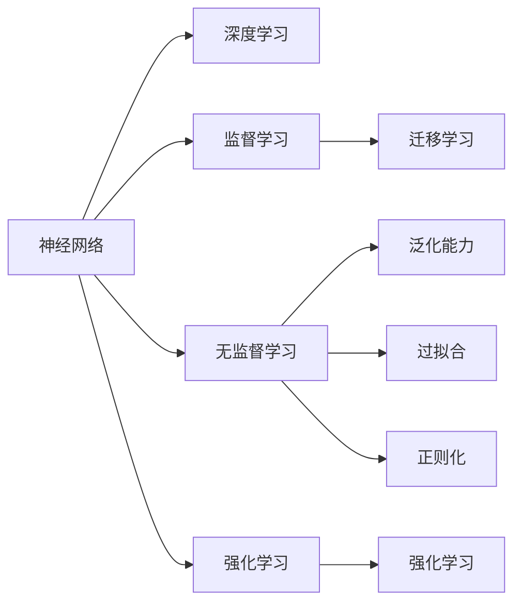

                 

## 1. 背景介绍

### 1.1 问题由来

神经网络作为深度学习技术的重要组成部分，在过去几十年中，为计算机视觉、自然语言处理、语音识别等领域的突破性进展奠定了基础。特别是在近年来，通过在图像、文本、语音等数据上的大规模预训练和微调，神经网络在处理复杂任务上展现了强大的能力。

神经网络的应用范围已经从学术研究拓展到工业应用，涉及医疗、金融、交通、娱乐等多个领域，为社会进步注入了新动能。例如，通过图像识别技术，医疗影像可以自动诊断疾病；自然语言处理技术可以辅助客服系统，提升用户体验；自动驾驶系统可以保障交通安全，减少交通事故；智能推荐系统可以个性化推荐商品，提升消费体验。

### 1.2 问题核心关键点

神经网络在推动社会进步方面的核心关键点主要体现在以下几个方面：

1. **数据驱动的决策**：神经网络通过学习海量数据，能够高效地从大量数据中提取特征，形成高精度的模型，支持数据驱动的决策，为各行各业带来了前所未有的效率提升和决策优化。

2. **泛化能力强**：神经网络能够学习到抽象的、通用的特征，具备较强的泛化能力，能够在新的数据上表现出良好的性能，为社会各领域带来了更广泛的适用性。

3. **自主学习能力**：神经网络通过不断优化自身模型参数，具有自主学习的能力，能够应对日益复杂和多变的数据环境，为解决社会问题提供了强大的技术支持。

4. **跨领域应用**：神经网络在计算机视觉、自然语言处理、语音识别等多个领域均有卓越表现，能够实现跨领域的融合应用，推动多个领域的协同发展。

5. **赋能产业升级**：神经网络技术的落地应用，能够有效赋能传统产业的数字化转型，提升生产效率，推动产业升级。

## 2. 核心概念与联系

### 2.1 核心概念概述

为了更好地理解神经网络在推动社会进步中的作用，本节将介绍几个核心概念及其之间的关系：

- **神经网络(Neural Networks)**：一种基于生物学神经元结构的计算模型，通过输入数据、模型参数和激活函数，实现数据的自动特征提取和分类。

- **深度学习(Deep Learning)**：以神经网络为核心，通过多层次的特征提取，实现对复杂模式的自动识别和学习。

- **监督学习(Supervised Learning)**：通过有标签的训练数据，训练模型进行分类或回归等任务，广泛应用于图像识别、语音识别等领域。

- **无监督学习(Unsupervised Learning)**：利用无标签数据进行训练，实现数据的聚类、降维等任务，适用于数据分析和探索性学习。

- **强化学习(Reinforcement Learning)**：通过与环境互动，模型根据奖励信号进行优化，广泛应用于机器人控制、游戏AI等领域。

- **迁移学习(Transfer Learning)**：将一个领域学到的知识迁移到另一个领域，减少新领域数据的需求，提升模型在新领域上的性能。

- **泛化能力(Generalization)**：模型在未见过的数据上仍能表现良好的能力，是评估模型性能的重要指标。

- **过拟合(Overfitting)**：模型在训练数据上表现优异，但在测试数据上表现较差的现象。

- **正则化(Regularization)**：通过引入正则项，限制模型的复杂度，防止过拟合。

这些核心概念之间存在着紧密的联系，通过学习和优化这些概念，神经网络在社会各领域的进步中发挥了重要作用。

### 2.2 核心概念原理和架构的 Mermaid 流程图



该流程图展示了神经网络的核心概念及其之间的关系：

1. **神经网络**是深度学习的基础，通过多层次的特征提取，实现复杂模式的识别。
2. **深度学习**通过神经网络的多层次结构，提升模型的表示能力。
3. **监督学习**和**无监督学习**分别利用标签数据和无标签数据，训练模型。
4. **强化学习**通过奖励信号，优化模型。
5. **迁移学习**通过知识迁移，提升模型在新领域的性能。
6. **泛化能力**是模型性能的关键指标，表明模型对新数据的适应能力。
7. **过拟合**和**正则化**是避免模型过拟合的重要手段。

## 3. 核心算法原理 & 具体操作步骤

### 3.1 算法原理概述

神经网络的算法原理主要基于生物学神经元的工作机制，通过多层非线性变换，实现数据的自动特征提取和分类。其核心步骤如下：

1. **输入层**：接受原始数据，将数据转化为适合神经网络处理的格式。
2. **隐藏层**：通过一系列非线性变换，逐步提取数据的高级特征。
3. **输出层**：根据任务需求，输出分类、回归等结果。

神经网络的训练过程主要包括两个步骤：前向传播和反向传播。

**前向传播**：将输入数据通过神经网络逐层传递，得到最终输出。

**反向传播**：根据输出结果与真实标签的误差，通过链式法则反向计算各层参数的梯度，更新模型参数，最小化损失函数。

### 3.2 算法步骤详解

以下是神经网络训练的具体操作步骤：

1. **数据准备**：收集和处理训练数据，将数据转化为神经网络所需的格式。
2. **模型构建**：定义神经网络的架构，包括输入层、隐藏层、输出层和激活函数等。
3. **损失函数选择**：选择合适的损失函数，如交叉熵损失、均方误差损失等。
4. **优化器选择**：选择合适的优化算法，如SGD、Adam等。
5. **训练流程**：将训练数据分批次输入模型，前向传播计算损失函数，反向传播更新模型参数，重复以上步骤直至收敛。
6. **模型评估**：在测试集上评估模型性能，使用准确率、精度、召回率等指标评估模型效果。

### 3.3 算法优缺点

神经网络具有以下优点：

1. **自动特征提取**：通过多层次的非线性变换，能够自动提取数据的高级特征。
2. **泛化能力强**：能够学习到数据的通用特征，适用于复杂模式识别和分类任务。
3. **端到端训练**：通过端到端训练，能够减少人工干预，提高模型效率。

同时，神经网络也存在一些缺点：

1. **计算资源消耗大**：由于参数量巨大，神经网络的训练和推理需要大量的计算资源。
2. **过拟合风险高**：神经网络参数量巨大，容易出现过拟合现象。
3. **模型可解释性差**：神经网络是一种黑盒模型，难以解释其内部决策过程。

### 3.4 算法应用领域

神经网络在各个领域都有广泛的应用，以下是几个典型案例：

- **计算机视觉**：用于图像分类、物体检测、人脸识别等任务，广泛应用于自动驾驶、安防监控、医疗影像分析等领域。
- **自然语言处理**：用于机器翻译、文本分类、情感分析等任务，广泛应用于智能客服、智能翻译、内容推荐等领域。
- **语音识别**：用于语音识别、语音合成、语音指令控制等任务，广泛应用于智能音箱、智能助手、语音控制等领域。
- **推荐系统**：用于商品推荐、新闻推荐、内容推荐等任务，广泛应用于电商、新闻、社交媒体等领域。
- **机器人控制**：用于机器人导航、操作、交互等任务，广泛应用于家庭服务、工业自动化、军事等领域。

## 4. 数学模型和公式 & 详细讲解 & 举例说明

### 4.1 数学模型构建

神经网络的数学模型通常由以下几个部分组成：

1. **输入层**：$x_1, x_2, ..., x_n$，代表输入数据的特征向量。
2. **隐藏层**：$\{h_1, h_2, ..., h_m\}$，通过激活函数进行非线性变换。
3. **输出层**：$y$，代表模型的输出结果。

### 4.2 公式推导过程

以最简单的全连接神经网络为例，其前向传播和反向传播公式如下：

**前向传播**：

$$
z_1 = W_1x + b_1 \\
h_1 = f(z_1) \\
z_2 = W_2h_1 + b_2 \\
h_2 = f(z_2) \\
y = W_3h_2 + b_3
$$

其中，$f$为激活函数，$W$为权重矩阵，$b$为偏置向量。

**反向传播**：

$$
\frac{\partial L}{\partial W_3} = \frac{\partial L}{\partial y} \frac{\partial y}{\partial h_2} \frac{\partial h_2}{\partial z_2} \frac{\partial z_2}{\partial W_2} \\
\frac{\partial L}{\partial b_3} = \frac{\partial L}{\partial y} \\
\frac{\partial L}{\partial W_2} = \frac{\partial L}{\partial z_2} \frac{\partial z_2}{\partial h_2} \frac{\partial h_2}{\partial z_1} \frac{\partial z_1}{\partial W_1} \\
\frac{\partial L}{\partial b_2} = \frac{\partial L}{\partial z_2} \\
\frac{\partial L}{\partial W_1} = \frac{\partial L}{\partial z_1} \frac{\partial z_1}{\partial h_1} \frac{\partial h_1}{\partial W_1} \\
\frac{\partial L}{\partial b_1} = \frac{\partial L}{\partial z_1}
$$

其中，$L$为损失函数。

### 4.3 案例分析与讲解

以图像分类任务为例，以下是基于神经网络的图像分类流程：

1. **数据准备**：收集并预处理图像数据，将图像转化为神经网络所需的格式。
2. **模型构建**：定义卷积神经网络（CNN）架构，包括卷积层、池化层、全连接层等。
3. **损失函数选择**：选择交叉熵损失函数。
4. **优化器选择**：选择Adam优化器。
5. **训练流程**：将图像数据分批次输入模型，前向传播计算损失函数，反向传播更新模型参数，重复以上步骤直至收敛。
6. **模型评估**：在测试集上评估模型性能，使用准确率、精度、召回率等指标评估模型效果。

## 5. 项目实践：代码实例和详细解释说明

### 5.1 开发环境搭建

在进行神经网络项目实践前，需要准备好开发环境。以下是使用Python进行PyTorch开发的环境配置流程：

1. 安装Anaconda：从官网下载并安装Anaconda，用于创建独立的Python环境。

2. 创建并激活虚拟环境：
```bash
conda create -n pytorch-env python=3.8 
conda activate pytorch-env
```

3. 安装PyTorch：根据CUDA版本，从官网获取对应的安装命令。例如：
```bash
conda install pytorch torchvision torchaudio cudatoolkit=11.1 -c pytorch -c conda-forge
```

4. 安装Transformers库：
```bash
pip install transformers
```

5. 安装各类工具包：
```bash
pip install numpy pandas scikit-learn matplotlib tqdm jupyter notebook ipython
```

完成上述步骤后，即可在`pytorch-env`环境中开始神经网络实践。

### 5.2 源代码详细实现

下面我们以图像分类任务为例，给出使用PyTorch进行神经网络训练的完整代码实现。

首先，定义数据处理函数：

```python
import torch
import torchvision
from torchvision import datasets, transforms

transform = transforms.Compose([
    transforms.ToTensor(),
    transforms.Normalize((0.5, 0.5, 0.5), (0.5, 0.5, 0.5))
])

train_dataset = datasets.CIFAR10(root='./data', train=True, download=True, transform=transform)
test_dataset = datasets.CIFAR10(root='./data', train=False, download=True, transform=transform)
```

然后，定义模型和损失函数：

```python
from torch import nn
from torch.nn import functional as F

class Net(nn.Module):
    def __init__(self):
        super(Net, self).__init__()
        self.conv1 = nn.Conv2d(3, 6, 5)
        self.pool = nn.MaxPool2d(2, 2)
        self.conv2 = nn.Conv2d(6, 16, 5)
        self.fc1 = nn.Linear(16 * 5 * 5, 120)
        self.fc2 = nn.Linear(120, 84)
        self.fc3 = nn.Linear(84, 10)

    def forward(self, x):
        x = self.pool(F.relu(self.conv1(x)))
        x = self.pool(F.relu(self.conv2(x)))
        x = x.view(-1, 16 * 5 * 5)
        x = F.relu(self.fc1(x))
        x = F.relu(self.fc2(x))
        x = self.fc3(x)
        return x

net = Net()
criterion = nn.CrossEntropyLoss()
```

接着，定义训练和评估函数：

```python
import torch.optim as optim

device = torch.device('cuda' if torch.cuda.is_available() else 'cpu')
net.to(device)

def train(epoch):
    net.train()
    train_loss = 0
    correct = 0
    total = 0
    for batch_idx, (data, target) in enumerate(train_loader):
        data, target = data.to(device), target.to(device)
        optimizer.zero_grad()
        output = net(data)
        loss = criterion(output, target)
        loss.backward()
        optimizer.step()
        train_loss += loss.item()
        _, predicted = output.max(1)
        total += target.size(0)
        correct += predicted.eq(target).sum().item()
        if (batch_idx+1) % 100 == 0:
            print('Train Epoch: {} [{}/{} ({:.0f}%)]\tLoss: {:.6f}\tAcc: {:.6f}'.format(
                epoch, (batch_idx + 1) * len(data), len(train_loader.dataset),
                100. * (batch_idx + 1) / len(train_loader), loss.item(), correct / total))

def test():
    net.eval()
    test_loss = 0
    correct = 0
    total = 0
    with torch.no_grad():
        for data, target in test_loader:
            data, target = data.to(device), target.to(device)
            output = net(data)
            loss = criterion(output, target)
            test_loss += loss.item()
            _, predicted = output.max(1)
            total += target.size(0)
            correct += predicted.eq(target).sum().item()

    print('Test set: Average loss: {:.4f}, Accuracy: {}/{} ({:.0f}%)\n'.format(
        test_loss / len(test_loader.dataset), correct, total, 100. * correct / total))
```

最后，启动训练流程并在测试集上评估：

```python
batch_size = 4
learning_rate = 0.001
test_batch_size = 1000

train_loader = torch.utils.data.DataLoader(train_dataset, batch_size=batch_size, shuffle=True)
test_loader = torch.utils.data.DataLoader(test_dataset, batch_size=test_batch_size, shuffle=False)

optimizer = optim.SGD(net.parameters(), lr=learning_rate, momentum=0.9)

for epoch in range(1, 10):
    train(epoch)
    test()
```

以上就是使用PyTorch进行图像分类任务训练的完整代码实现。可以看到，利用PyTorch的强大封装能力，我们能够快速构建神经网络模型并进行训练，极大地提高了开发效率。

### 5.3 代码解读与分析

让我们再详细解读一下关键代码的实现细节：

**数据处理函数**：
- `transform`：定义数据增强和归一化操作。
- `train_dataset`和`test_dataset`：加载CIFAR-10数据集，并进行预处理。

**模型定义**：
- `Net`类：定义了包含卷积层、池化层、全连接层的神经网络架构。
- `forward`方法：定义了神经网络的计算流程。

**训练和评估函数**：
- `train`函数：实现神经网络的训练过程，包括前向传播、反向传播和参数更新。
- `test`函数：实现神经网络的评估过程，包括计算损失和准确率。

**训练流程**：
- 定义训练和测试数据加载器。
- 定义优化器和损失函数。
- 在多个epoch内进行训练和测试，输出训练过程中的损失和准确率。

通过以上代码实例，我们展示了使用PyTorch进行神经网络训练的全流程，包括数据预处理、模型定义、训练和评估等步骤。开发者可以根据具体需求，进一步优化模型架构和训练策略，以提升模型性能。

## 6. 实际应用场景

### 6.1 智能推荐系统

神经网络在智能推荐系统中的应用非常广泛，通过学习用户的历史行为和偏好，能够精准推荐个性化商品或内容，提升用户体验。

在技术实现上，可以收集用户浏览、点击、评分等行为数据，构建用户-物品关联矩阵。将矩阵作为神经网络的输入，模型的输出为用户对物品的兴趣评分。在推荐时，根据评分排序选择推荐的物品，向用户展示。通过持续的反馈数据，不断优化模型，提升推荐效果。

### 6.2 自然语言处理

神经网络在自然语言处理(NLP)领域也有广泛应用，包括机器翻译、情感分析、文本生成等任务。通过学习语言数据，能够高效地进行自然语言理解和生成。

例如，在机器翻译任务中，可以使用序列到序列模型(Seq2Seq)，将源语言序列转换为目标语言序列。通过神经网络的前向传播和反向传播，最小化翻译误差，训练得到高精度的翻译模型。通过微调等技术，进一步提升模型在特定领域或任务上的表现。

### 6.3 医疗影像分析

神经网络在医疗影像分析领域也有重要应用，能够辅助医生进行疾病诊断和治疗方案选择。通过学习医学影像数据，能够自动提取影像特征，进行病灶定位和分类。

在技术实现上，可以收集大量的医学影像数据，将影像数据转换为神经网络所需的格式。通过卷积神经网络(CNN)等架构，训练得到高精度的影像分类模型。在临床应用中，医生可以通过输入影像数据，得到初步的诊断结果，辅助决策。

### 6.4 未来应用展望

随着神经网络技术的不断发展，未来将在更多领域得到应用，为社会进步注入新的动能。

1. **智慧城市**：通过神经网络技术，构建智能交通、智能安防、智能能源等智慧城市基础设施，提升城市管理效率和服务质量。

2. **自动驾驶**：通过神经网络技术，实现自动驾驶车辆的感知、决策和控制，提高交通安全和效率。

3. **智能制造**：通过神经网络技术，优化生产流程，提高生产效率和产品质量，推动工业4.0发展。

4. **智慧农业**：通过神经网络技术，优化农作物的种植、施肥、灌溉等管理，提高农业生产效率和资源利用率。

5. **个性化教育**：通过神经网络技术，实现个性化学习路径设计、学习效果评估，提升教育质量和效率。

6. **智能客服**：通过神经网络技术，构建智能客服系统，提升客户服务质量和效率。

以上应用场景展示了神经网络技术在各个领域的应用潜力，未来随着技术的不断进步，神经网络将在更多领域发挥更大的作用，推动社会的全面进步。

## 7. 工具和资源推荐

### 7.1 学习资源推荐

为了帮助开发者系统掌握神经网络技术的理论基础和实践技巧，这里推荐一些优质的学习资源：

1. 《深度学习》（Ian Goodfellow, Yoshua Bengio和Aaron Courville合著）：深度学习的经典教材，全面介绍了深度学习的基本概念和前沿技术。

2. 《神经网络与深度学习》（Michael Nielsen著）：深入浅出地介绍了神经网络和深度学习的原理和应用，适合初学者入门。

3. Coursera的深度学习课程：斯坦福大学Andrew Ng开设的深度学习课程，包含大规模视频讲座和实践项目，帮助学习者系统掌握深度学习技术。

4. arXiv上的最新论文：通过阅读最新研究论文，了解深度学习技术的最新进展和应用实践。

5. PyTorch官方文档：PyTorch的官方文档，提供了详细的API介绍和实践案例，适合开发者快速上手。

### 7.2 开发工具推荐

高效的开发离不开优秀的工具支持。以下是几款用于神经网络开发的常用工具：

1. PyTorch：基于Python的开源深度学习框架，支持动态计算图和丰富的张量操作，适合快速迭代研究。

2. TensorFlow：由Google主导开发的开源深度学习框架，支持静态计算图和分布式训练，适合大规模工程应用。

3. Keras：基于TensorFlow和Theano的高级API，提供了简单易用的深度学习模型定义接口，适合快速原型开发。

4. Jupyter Notebook：支持在Web浏览器中编写和执行Python代码的交互式开发环境，适合共享和协作开发。

5. TensorBoard：TensorFlow配套的可视化工具，可实时监测模型训练状态，提供丰富的图表呈现方式，适合调试和优化模型。

### 7.3 相关论文推荐

神经网络技术的发展源于学界的持续研究。以下是几篇奠基性的相关论文，推荐阅读：

1. AlexNet：深度卷积神经网络的奠基之作，推动了计算机视觉领域的突破。

2. ImageNet大规模视觉识别挑战赛（ILSVRC）：推动了深度学习在计算机视觉领域的广泛应用，是深度学习技术发展的里程碑。

3. AlphaGo：基于深度学习和强化学习的围棋AI，展示了神经网络在复杂决策问题上的潜力。

4. Transformer：提出了一种全新的神经网络架构，提升了自然语言处理的性能和效率。

5. GANs：生成对抗网络，通过两个神经网络的对抗训练，实现了高质量的图像生成和编辑。

这些论文代表了大神经网络技术的发展脉络。通过学习这些前沿成果，可以帮助研究者把握学科前进方向，激发更多的创新灵感。

## 8. 总结：未来发展趋势与挑战

### 8.1 总结

本文对神经网络技术在推动社会进步中的作用进行了全面系统的介绍。首先阐述了神经网络在数据驱动决策、泛化能力、自主学习能力等方面的优势，明确了神经网络在各个领域的应用潜力。其次，从原理到实践，详细讲解了神经网络的算法原理和具体操作步骤，给出了神经网络训练的完整代码实例。同时，本文还广泛探讨了神经网络在智能推荐系统、自然语言处理、医疗影像分析等多个领域的应用前景，展示了神经网络技术的广泛适用性。

通过本文的系统梳理，可以看到，神经网络技术在各个领域的应用潜力巨大，为社会进步注入了新的动能。未来随着技术的不断进步，神经网络将在更多领域得到应用，为社会带来更深远的影响。

### 8.2 未来发展趋势

展望未来，神经网络技术的发展趋势主要体现在以下几个方面：

1. **自监督学习**：通过自监督学习，利用无标签数据进行预训练，提升神经网络的表示能力。

2. **弱监督学习**：利用少量的弱标注数据进行微调，进一步提升神经网络在特定任务上的性能。

3. **神经网络与其它技术融合**：与强化学习、自然语言处理、知识图谱等技术融合，提升神经网络在复杂场景下的表现。

4. **神经网络优化**：通过算法优化、硬件加速、模型压缩等手段，提升神经网络的训练和推理效率。

5. **神经网络的可解释性**：通过可解释性技术，如可视化、因果推断等，增强神经网络模型的可解释性。

6. **神经网络的安全性和鲁棒性**：通过对抗训练、模型蒸馏等手段，提升神经网络的鲁棒性和安全性。

7. **神经网络的跨领域应用**：将神经网络技术应用于更多领域，推动各行各业的数字化转型。

以上趋势凸显了神经网络技术的广阔前景。这些方向的探索发展，必将进一步提升神经网络系统的性能和应用范围，为社会各领域带来更深远的影响。

### 8.3 面临的挑战

尽管神经网络技术已经取得了瞩目成就，但在迈向更加智能化、普适化应用的过程中，仍面临诸多挑战：

1. **计算资源消耗大**：由于神经网络参数量巨大，训练和推理需要大量的计算资源。如何优化模型和算法，降低计算成本，是重要的研究方向。

2. **过拟合风险高**：神经网络参数量巨大，容易出现过拟合现象。如何防止过拟合，提升模型的泛化能力，是重要的研究课题。

3. **模型可解释性差**：神经网络模型通常被视为黑盒模型，难以解释其内部决策过程。如何提升模型的可解释性，增强其可信度，是重要的研究方向。

4. **数据隐私与安全**：神经网络技术的应用需要大量的数据支持，如何保护数据隐私和网络安全，是重要的研究课题。

5. **模型偏见与公平性**：神经网络模型容易学习到数据中的偏见和歧视，如何消除模型偏见，提升公平性，是重要的研究课题。

6. **模型鲁棒性与鲁棒性**：神经网络模型在面对恶意攻击和噪声干扰时，容易产生错误决策。如何提升模型的鲁棒性，是重要的研究课题。

7. **模型部署与维护**：如何将神经网络模型部署到实际应用中，并保持其高性能和稳定性，是重要的研究课题。

### 8.4 研究展望

面对神经网络技术面临的挑战，未来的研究需要在以下几个方面寻求新的突破：

1. **自监督与弱监督学习**：通过自监督和弱监督学习，减少对标注数据的依赖，提升模型的泛化能力。

2. **模型压缩与优化**：通过模型压缩、量化等手段，降低计算成本，提升模型的效率和可维护性。

3. **模型蒸馏与迁移学习**：通过模型蒸馏和迁移学习，提升模型的鲁棒性和泛化能力，降低数据需求。

4. **跨领域知识融合**：将符号化的先验知识，如知识图谱、逻辑规则等，与神经网络模型进行融合，提升模型的表示能力。

5. **神经网络优化与加速**：通过算法优化、硬件加速等手段，提升神经网络的训练和推理效率。

6. **可解释性与公平性**：通过可解释性技术，如可视化、因果推断等，增强神经网络模型的可解释性。

7. **安全性与鲁棒性**：通过对抗训练、模型蒸馏等手段，提升神经网络模型的鲁棒性和安全性。

8. **模型部署与维护**：通过模型部署优化、自动化维护等手段，提升模型的可维护性和稳定性。

这些研究方向的探索，必将引领神经网络技术迈向更高的台阶，为社会各领域带来更深远的影响。

## 9. 附录：常见问题与解答

**Q1：神经网络在数据驱动决策中具有哪些优势？**

A: 神经网络在数据驱动决策中的优势主要体现在以下几个方面：

1. **自动特征提取**：神经网络能够自动学习数据的高级特征，无需手动设计特征提取方法。

2. **端到端训练**：神经网络通过端到端训练，能够直接从原始数据中学习到最优的决策模型，减少了人工干预。

3. **泛化能力强**：神经网络能够学习到数据的通用特征，适用于复杂模式识别和分类任务。

4. **适应性强**：神经网络能够在新的数据上快速适应，具有较强的泛化能力。

5. **可扩展性好**：神经网络可以通过增加层数和神经元数目，提升模型的表示能力，适应更复杂的任务。

**Q2：神经网络在实际应用中面临哪些挑战？**

A: 神经网络在实际应用中面临的挑战主要包括以下几个方面：

1. **计算资源消耗大**：由于神经网络参数量巨大，训练和推理需要大量的计算资源。

2. **过拟合风险高**：神经网络容易出现过拟合现象，尤其是在训练数据不足的情况下。

3. **模型可解释性差**：神经网络模型通常被视为黑盒模型，难以解释其内部决策过程。

4. **数据隐私与安全**：神经网络技术的应用需要大量的数据支持，如何保护数据隐私和网络安全，是重要的研究课题。

5. **模型偏见与公平性**：神经网络模型容易学习到数据中的偏见和歧视，如何消除模型偏见，提升公平性，是重要的研究课题。

6. **模型鲁棒性与鲁棒性**：神经网络模型在面对恶意攻击和噪声干扰时，容易产生错误决策。如何提升模型的鲁棒性，是重要的研究课题。

7. **模型部署与维护**：如何将神经网络模型部署到实际应用中，并保持其高性能和稳定性，是重要的研究课题。

**Q3：如何提高神经网络的训练效率？**

A: 提高神经网络的训练效率主要可以通过以下几个方面：

1. **模型压缩与优化**：通过模型压缩、量化等手段，降低计算成本，提升模型的效率和可维护性。

2. **分布式训练**：通过分布式训练，利用多台机器并行计算，加速模型训练。

3. **混合精度训练**：通过混合精度训练，使用16位或8位浮点数进行计算，提升计算效率。

4. **算法优化**：通过算法优化，如梯度累积、学习率调度等，提升训练效率。

5. **数据增强**：通过数据增强，扩充训练数据，提高模型的泛化能力。

6. **硬件加速**：通过硬件加速，如GPU、TPU等，提升模型训练和推理速度。

**Q4：神经网络在自然语言处理中的应用有哪些？**

A: 神经网络在自然语言处理(NLP)领域有广泛应用，以下是几个典型案例：

1. **机器翻译**：通过神经网络实现源语言序列到目标语言序列的自动翻译。

2. **文本分类**：通过神经网络对文本进行分类，如情感分析、主题分类等。

3. **情感分析**：通过神经网络对文本进行情感分析，判断文本的情感倾向。

4. **命名实体识别**：通过神经网络识别文本中的人名、地名、机构名等特定实体。

5. **机器阅读理解**：通过神经网络对文本进行阅读理解，回答自然语言问题。

6. **对话系统**：通过神经网络构建智能对话系统，与用户进行自然对话。

**Q5：如何提升神经网络的泛化能力？**

A: 提升神经网络的泛化能力主要可以通过以下几个方面：

1. **数据增强**：通过数据增强，扩充训练数据，提高模型的泛化能力。

2. **正则化**：通过正则化，如L2正则、Dropout等，防止模型过拟合。

3. **早停策略**：通过早停策略，避免模型在验证集上过拟合。

4. **模型压缩**：通过模型压缩，降低模型的复杂度，提升泛化能力。

5. **迁移学习**：通过迁移学习，将一个领域学到的知识迁移到另一个领域，提升模型的泛化能力。

6. **对抗训练**：通过对抗训练，提高模型的鲁棒性和泛化能力。

通过以上方法，可以有效地提升神经网络的泛化能力，使其在新的数据上表现更好。

---

作者：禅与计算机程序设计艺术 / Zen and the Art of Computer Programming

