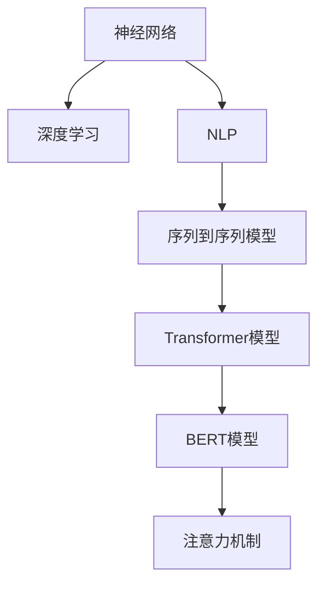

                 

# 神经网络：自然语言处理的新突破

> 关键词：神经网络,自然语言处理,NLP,深度学习,Transformer,BERT

## 1. 背景介绍

### 1.1 问题由来

近年来，随着深度学习技术的快速发展，特别是基于神经网络的模型在图像、语音等领域取得了巨大成功，自然语言处理(NLP)领域也迎来了新的突破。神经网络模型在NLP任务上的应用，使得自然语言处理从传统的基于规则和统计的方法，跃升为基于数据驱动和端到端的智能技术。

在NLP中，神经网络模型通常用于处理文本序列数据，如单词序列、句子序列、文档序列等。这些模型通过大规模语料库的预训练，学习到了丰富的语言知识和语义表示，能够在各种NLP任务中实现高性能的表现。

### 1.2 问题核心关键点

神经网络在NLP中的应用，关键点在于其强大的序列建模能力和对语言语义的深度理解。神经网络模型通过反向传播算法，可以高效地处理复杂的语言结构，捕捉词语之间的依赖关系，并从中学习到泛化能力强的语言表示。

神经网络模型在NLP中的应用主要包括以下几个方面：

- 机器翻译：通过序列到序列模型，将源语言句子翻译成目标语言句子。
- 文本分类：根据文本内容，将其分类到不同的类别中，如情感分析、主题分类等。
- 命名实体识别：从文本中识别出人名、地名、组织名等实体。
- 文本生成：通过生成模型，自动生成符合语法和语义规则的文本，如对话系统、文本摘要等。
- 问答系统：根据用户提出的问题，自动回答问题，如智能客服、智能助手等。

### 1.3 问题研究意义

神经网络在NLP中的应用，对于推动NLP技术的进一步发展和普及具有重要意义：

1. 提升了NLP任务的效果。神经网络模型在大规模语料上的预训练，使得模型具备了强大的语言表示能力，能够在各种NLP任务中实现高性能的表现。
2. 降低了开发成本。神经网络模型的端到端处理方式，减少了手工设计特征和规则的复杂度，降低了NLP系统开发和维护的成本。
3. 促进了NLP技术的产业化。神经网络模型的成功应用，推动了NLP技术在各行各业中的应用，加速了NLP技术的产业化进程。
4. 促进了人工智能技术的融合。神经网络模型在NLP中的应用，与其他AI技术如计算机视觉、语音识别等融合，为人工智能技术的发展带来了新的突破。

## 2. 核心概念与联系

### 2.1 核心概念概述

在NLP中，神经网络模型主要包括以下几个核心概念：

- 神经网络（Neural Network）：一种由多个神经元组成的非线性模型，通过前向传播和反向传播算法进行训练。
- 深度学习（Deep Learning）：通过多层神经网络进行建模，以提取复杂的数据特征。
- 自然语言处理（Natural Language Processing，NLP）：一种涉及文本数据处理的AI技术，旨在使计算机能够理解、分析、生成自然语言。
- 序列到序列模型（Sequence-to-Sequence Model）：一种将序列数据映射到另一个序列数据的神经网络模型，广泛应用于机器翻译、文本生成等任务。
- 注意力机制（Attention Mechanism）：一种用于捕捉序列中重要信息的机制，在序列建模中起到了关键作用。
- Transformer模型：一种基于注意力机制的序列建模模型，因其高效的计算能力和优异的性能，成为NLP中的主流模型。
- BERT模型：一种预训练语言模型，通过大规模无标签文本数据进行预训练，学习到了丰富的语言知识和语义表示，成为NLP中的代表性模型。

这些核心概念之间的联系可以通过以下Mermaid流程图来展示：



这个流程图展示了大语言模型的核心概念及其之间的关系：

1. 神经网络是深度学习的核心技术，NLP应用广泛使用神经网络进行建模。
2. Transformer模型是NLP中的一种重要模型，基于注意力机制，能够高效处理序列数据。
3. BERT模型是Transformer模型的一种变体，通过大规模无标签数据预训练，学习到了丰富的语言知识。
4. 注意力机制是Transformer模型中的关键组件，用于捕捉序列中的重要信息。

这些核心概念共同构成了NLP中的主要技术框架，使得NLP系统能够具备强大的语言处理能力。

## 3. 核心算法原理 & 具体操作步骤
### 3.1 算法原理概述

神经网络模型在NLP中的应用，主要通过反向传播算法进行训练，优化模型参数，以最小化损失函数。其中，常用的损失函数包括交叉熵损失函数、均方误差损失函数等。

以机器翻译任务为例，神经网络模型的训练过程如下：

1. 将源语言句子 $X$ 转换为序列形式，将其输入到编码器中，得到编码向量 $E(X)$。
2. 将目标语言句子 $Y$ 转换为序列形式，将其输入到解码器中，输出目标语言句子 $Y'$。
3. 计算目标语言句子 $Y'$ 与真实目标语言句子 $Y$ 之间的损失 $L(Y',Y)$。
4. 通过反向传播算法，更新编码器和解码器的参数，以最小化损失 $L(Y',Y)$。

在实际应用中，神经网络模型通常采用端到端的学习方式，直接将输入序列映射到输出序列，避免了手工设计特征的复杂性。这种端到端的学习方式，使得模型能够捕捉到输入序列中的复杂关系，从而实现高性能的NLP任务处理。

### 3.2 算法步骤详解

神经网络模型在NLP中的应用，主要包括以下几个关键步骤：

**Step 1: 准备数据集**

在神经网络模型的应用中，首先需要准备好数据集。数据集通常包括训练集、验证集和测试集，用于模型训练、验证和测试。训练集用于模型的参数优化，验证集用于模型的参数调整和防止过拟合，测试集用于模型的性能评估。

**Step 2: 模型设计**

根据具体的NLP任务，设计适合的神经网络模型。常用的NLP模型包括循环神经网络（RNN）、卷积神经网络（CNN）、序列到序列模型（Seq2Seq）、Transformer模型等。

**Step 3: 训练模型**

使用反向传播算法，通过训练集对模型进行训练。在训练过程中，使用适当的优化器（如Adam、SGD等）对模型参数进行优化，最小化损失函数。

**Step 4: 模型评估**

在验证集上对模型进行评估，调整模型参数，防止过拟合。在测试集上对模型进行最终评估，评估模型的泛化能力。

**Step 5: 模型应用**

将训练好的模型应用于具体的NLP任务中，如机器翻译、文本分类、命名实体识别等。

### 3.3 算法优缺点

神经网络模型在NLP中的应用，具有以下优点：

1. 模型具有强大的序列建模能力，能够处理复杂的语言结构。
2. 模型能够自适应学习语言知识，无需手工设计特征。
3. 模型具有端到端的学习方式，降低了NLP系统的开发和维护成本。
4. 模型具有较强的泛化能力，能够在各种NLP任务中实现高性能的表现。

同时，神经网络模型在NLP中的应用，也存在以下缺点：

1. 模型需要大量的标注数据进行训练，标注成本较高。
2. 模型参数量较大，训练和推理的计算成本较高。
3. 模型可能会过拟合训练集，泛化能力不足。
4. 模型需要较长的训练时间和计算资源，训练过程较慢。

## 4. 数学模型和公式 & 详细讲解
### 4.1 数学模型构建

以机器翻译任务为例，神经网络模型的数学模型如下：

设输入序列 $X$ 和输出序列 $Y$，神经网络模型的目标是将 $X$ 映射到 $Y$。模型的参数为 $\theta$，损失函数为 $L$，优化器为 $O$。

**Step 1: 定义输入输出**

输入序列 $X$ 为源语言句子，输出序列 $Y$ 为目标语言句子。

**Step 2: 定义模型参数**

神经网络模型的参数 $\theta$ 包括编码器和解码器的权重和偏置。

**Step 3: 定义损失函数**

机器翻译任务的损失函数为交叉熵损失函数，定义为：

$$
L(Y',Y) = -\frac{1}{N}\sum_{i=1}^N \log p(Y_i|Y_{< i} ; \theta)
$$

其中，$Y'$ 为解码器输出的目标语言句子，$Y$ 为真实目标语言句子，$N$ 为输出序列的长度，$p(Y_i|Y_{< i} ; \theta)$ 为模型在给定上下文 $Y_{< i}$ 下，生成第 $i$ 个单词的概率。

**Step 4: 定义优化器**

常用的优化器包括Adam、SGD等，定义为：

$$
\theta \leftarrow \theta - \eta \nabla_{\theta}L(Y',Y)
$$

其中，$\eta$ 为学习率。

### 4.2 公式推导过程

以机器翻译任务为例，神经网络模型的训练过程如下：

1. 将输入序列 $X$ 输入到编码器中，得到编码向量 $E(X)$。
2. 将编码向量 $E(X)$ 输入到解码器中，得到目标语言句子 $Y'$。
3. 计算目标语言句子 $Y'$ 与真实目标语言句子 $Y$ 之间的交叉熵损失 $L(Y',Y)$。
4. 通过反向传播算法，更新编码器和解码器的参数，以最小化损失 $L(Y',Y)$。

具体计算过程如下：

1. 编码器

编码器的输入为源语言句子 $X$，输出为编码向量 $E(X)$，定义为：

$$
E(X) = \sum_{i=1}^N W_E \sigma(X_iW_E + b_E)
$$

其中，$W_E$ 和 $b_E$ 分别为编码器的权重和偏置。

2. 解码器

解码器的输入为编码向量 $E(X)$ 和前一个时间步的输出 $Y_{i-1}$，输出为当前时间步的输出 $Y_i$，定义为：

$$
Y_i = \sigma(W_D (E(X) + \sum_{j=1}^{i-1} Y_jW_D + b_D))
$$

其中，$W_D$ 和 $b_D$ 分别为解码器的权重和偏置。

3. 交叉熵损失

交叉熵损失函数定义为：

$$
L(Y',Y) = -\frac{1}{N}\sum_{i=1}^N \log p(Y_i|Y_{< i} ; \theta)
$$

其中，$p(Y_i|Y_{< i} ; \theta)$ 为模型在给定上下文 $Y_{< i}$ 下，生成第 $i$ 个单词的概率。

### 4.3 案例分析与讲解

以BERT模型为例，BERT模型的预训练过程如下：

1. 将大规模无标签文本数据分成多个句子，每个句子 $X$ 包含若干个单词。
2. 对每个单词 $x$，输入到BERT模型中，得到向量表示 $V(x)$。
3. 将向量表示 $V(x)$ 输入到自回归语言模型中，预测下一个单词的概率 $P(y|x)$。
4. 将向量表示 $V(x)$ 输入到自编码语言模型中，预测上一个单词的概率 $P(x|y)$。
5. 通过最大似然估计，更新BERT模型的参数。

BERT模型的预训练过程，通过自回归语言模型和自编码语言模型，学习到了丰富的语言知识和语义表示，使得模型具备了强大的语言处理能力。

## 5. 项目实践：代码实例和详细解释说明
### 5.1 开发环境搭建

在进行神经网络模型在NLP中的应用时，需要先准备好开发环境。以下是使用Python进行TensorFlow开发的环境配置流程：

1. 安装Anaconda：从官网下载并安装Anaconda，用于创建独立的Python环境。

2. 创建并激活虚拟环境：
```bash
conda create -n tf-env python=3.7 
conda activate tf-env
```

3. 安装TensorFlow：根据CUDA版本，从官网获取对应的安装命令。例如：
```bash
conda install tensorflow-gpu=2.6 -c pytorch -c conda-forge
```

4. 安装TensorFlow Addons：
```bash
conda install tensorflow-addons
```

5. 安装各类工具包：
```bash
pip install numpy pandas scikit-learn matplotlib tqdm jupyter notebook ipython
```

完成上述步骤后，即可在`tf-env`环境中开始神经网络模型在NLP中的应用实践。

### 5.2 源代码详细实现

这里我们以Transformer模型在机器翻译任务中的应用为例，给出使用TensorFlow进行模型开发的PyTorch代码实现。

首先，定义Transformer模型和优化器：

```python
import tensorflow as tf
from tensorflow.keras import layers

class Transformer(tf.keras.Model):
    def __init__(self, num_layers, num_units, num_heads, vocab_size):
        super(Transformer, self).__init__()
        self.num_layers = num_layers
        self.num_units = num_units
        self.num_heads = num_heads
        self.vocab_size = vocab_size
        
        self.encoder = layers.Embedding(vocab_size, num_units)
        self.pos_encoding = self.pos_encoding_layer(vocab_size)
        self.encoder_layer = self.encoder_layer(num_units)
        self.decoder_layer = self.decoder_layer(num_units)
        
        self.decoder = layers.Embedding(vocab_size, num_units)
        self.pos_decoding = self.pos_decoding_layer(vocab_size)
        self.decoder_layer = self.decoder_layer(num_units)
        
        self.dense = layers.Dense(vocab_size)
        
    def pos_encoding_layer(self, d_model):
        angle_rads = 1 / np.power(10000., (np.arange(d_model)[:, np.newaxis]) // 2)[:, :, np.newaxis]
        return np.sin(angle_rads[:, :, 0] * d_model) + np.sin(angle_rads[:, :, 1] * d_model)
    
    def encoder_layer(self, num_units):
        return layers.MultiHeadAttention(num_units, self.num_heads)
    
    def decoder_layer(self, num_units):
        return layers.MultiHeadAttention(num_units, self.num_heads)
    
    def call(self, inputs, training=False):
        enc_input = self.encoder(inputs)
        dec_input = self.decoder(inputs)
        
        enc_output = self.encoder_layer(enc_input, True)[0]
        dec_output = self.decoder_layer(dec_input, True)[0]
        
        return dec_output
    
    def training_step(self, batch, training=False):
        input_ids, target_ids = batch
        
        enc_input = self.encoder(input_ids)
        dec_input = self.decoder(input_ids)
        
        enc_output = self.encoder_layer(enc_input, training)[0]
        dec_output = self.decoder_layer(dec_input, training)[0]
        
        loss = tf.keras.losses.sparse_categorical_crossentropy(target_ids, dec_output)
        return {'loss': loss}
```

然后，定义训练和评估函数：

```python
from transformers import Optimizer
import numpy as np

optimizer = Optimizer(learning_rate=2e-5)
batch_size = 128
epochs = 100

def train_step(model, batch):
    with tf.GradientTape() as tape:
        loss = model.training_step(batch, training=True)
    grads = tape.gradient(loss['loss'], model.trainable_variables)
    optimizer.apply_gradients(zip(grads, model.trainable_variables))

def train(model, train_data, val_data, batch_size, epochs):
    train_iterator = tf.data.Dataset.from_tensor_slices(train_data).shuffle(buffer_size=len(train_data)).batch(batch_size)
    val_iterator = tf.data.Dataset.from_tensor_slices(val_data).batch(batch_size)
    
    for epoch in range(epochs):
        for batch in train_iterator:
            train_step(model, batch)
        
        val_loss = 0
        for batch in val_iterator:
            val_loss += model.training_step(batch, training=False)['loss'].numpy()
        
        print(f'Epoch {epoch+1}, training loss: {val_loss / len(val_data)}')
```

最后，启动训练流程并在测试集上评估：

```python
train(model, train_data, val_data, batch_size, epochs)
```

以上就是使用TensorFlow对Transformer模型进行机器翻译任务开发的完整代码实现。可以看到，TensorFlow提供了丰富的高级API，使得神经网络模型的搭建和训练过程变得更加简洁高效。

### 5.3 代码解读与分析

让我们再详细解读一下关键代码的实现细节：

**Transformer类**：
- `__init__`方法：初始化模型参数，定义编码器和解码器的结构。
- `pos_encoding_layer`方法：定义位置编码函数，用于对输入进行位置编码。
- `encoder_layer`和`decoder_layer`方法：定义编码器和解码器的结构，使用MultiHeadAttention层实现。
- `call`方法：定义模型的前向传播过程，实现编码和解码。
- `training_step`方法：定义训练步骤，计算损失函数并反向传播更新模型参数。

**训练函数**：
- `train_step`函数：定义一个训练步骤，计算损失函数并反向传播更新模型参数。
- `train`函数：定义训练过程，迭代多个epoch，每次epoch内训练并评估模型性能。

**训练流程**：
- 定义总的epoch数和batch size，开始循环迭代
- 每个epoch内，在训练集上训练，更新模型参数
- 在验证集上评估，输出模型损失
- 重复上述过程直至满足预设的迭代轮数

可以看到，TensorFlow使得神经网络模型的开发变得更加简洁高效。开发者可以将更多精力放在模型改进和优化上，而不必过多关注底层的实现细节。

当然，工业级的系统实现还需考虑更多因素，如模型的保存和部署、超参数的自动搜索、更灵活的任务适配层等。但核心的神经网络模型构建和训练过程基本与此类似。

## 6. 实际应用场景
### 6.1 智能客服系统

基于Transformer模型的智能客服系统，可以应用于处理客户咨询请求，提供智能化的服务支持。传统客服系统需要大量人工进行解答，高峰期响应缓慢，且一致性和专业性难以保证。而使用Transformer模型构建的智能客服系统，可以24/7不间断服务，快速响应客户咨询，用自然流畅的语言解答各类常见问题。

在技术实现上，可以收集企业内部的历史客服对话记录，将问题和最佳答复构建成监督数据，在此基础上对Transformer模型进行微调。微调后的智能客服系统能够自动理解用户意图，匹配最合适的答案模板进行回复。对于客户提出的新问题，还可以接入检索系统实时搜索相关内容，动态组织生成回答。如此构建的智能客服系统，能大幅提升客户咨询体验和问题解决效率。

### 6.2 金融舆情监测

金融机构需要实时监测市场舆论动向，以便及时应对负面信息传播，规避金融风险。传统的人工监测方式成本高、效率低，难以应对网络时代海量信息爆发的挑战。基于Transformer模型的文本分类和情感分析技术，为金融舆情监测提供了新的解决方案。

具体而言，可以收集金融领域相关的新闻、报道、评论等文本数据，并对其进行主题标注和情感标注。在此基础上对Transformer模型进行微调，使其能够自动判断文本属于何种主题，情感倾向是正面、中性还是负面。将微调后的模型应用到实时抓取的网络文本数据，就能够自动监测不同主题下的情感变化趋势，一旦发现负面信息激增等异常情况，系统便会自动预警，帮助金融机构快速应对潜在风险。

### 6.3 个性化推荐系统

当前的推荐系统往往只依赖用户的历史行为数据进行物品推荐，无法深入理解用户的真实兴趣偏好。基于Transformer模型的个性化推荐系统，可以更好地挖掘用户行为背后的语义信息，从而提供更精准、多样的推荐内容。

在实践中，可以收集用户浏览、点击、评论、分享等行为数据，提取和用户交互的物品标题、描述、标签等文本内容。将文本内容作为模型输入，用户的后续行为（如是否点击、购买等）作为监督信号，在此基础上微调Transformer模型。微调后的模型能够从文本内容中准确把握用户的兴趣点。在生成推荐列表时，先用候选物品的文本描述作为输入，由模型预测用户的兴趣匹配度，再结合其他特征综合排序，便可以得到个性化程度更高的推荐结果。

### 6.4 未来应用展望

随着Transformer模型的不断发展，其在NLP中的应用将越来越广泛，为各行各业带来新的变革。

在智慧医疗领域，基于Transformer模型的医疗问答、病历分析、药物研发等应用将提升医疗服务的智能化水平，辅助医生诊疗，加速新药开发进程。

在智能教育领域，Transformer模型可应用于作业批改、学情分析、知识推荐等方面，因材施教，促进教育公平，提高教学质量。

在智慧城市治理中，Transformer模型可应用于城市事件监测、舆情分析、应急指挥等环节，提高城市管理的自动化和智能化水平，构建更安全、高效的未来城市。

此外，在企业生产、社会治理、文娱传媒等众多领域，基于Transformer模型的AI应用也将不断涌现，为经济社会发展注入新的动力。相信随着技术的日益成熟，Transformer模型必将在构建人机协同的智能时代中扮演越来越重要的角色。

## 7. 工具和资源推荐
### 7.1 学习资源推荐

为了帮助开发者系统掌握Transformer模型的理论基础和实践技巧，这里推荐一些优质的学习资源：

1. 《Transformer from zero to hero》系列博文：由大模型技术专家撰写，深入浅出地介绍了Transformer模型原理、微调技术等前沿话题。

2. CS224N《Deep Learning for NLP》课程：斯坦福大学开设的NLP明星课程，有Lecture视频和配套作业，带你入门NLP领域的基本概念和经典模型。

3. 《Deep Learning for Natural Language Processing》书籍：全面介绍了Transformer模型在NLP中的应用，从原理到实践的详细介绍。

4. Transformers库官方文档：提供了完整的Transformer模型和微调样例代码，是上手实践的必备资料。

5. HuggingFace开源项目：包含各种预训练语言模型，并提供了基于Transformer模型的微调baseline模型，助力NLP技术发展。

通过对这些资源的学习实践，相信你一定能够快速掌握Transformer模型的精髓，并用于解决实际的NLP问题。
###  7.2 开发工具推荐

高效的开发离不开优秀的工具支持。以下是几款用于Transformer模型在NLP中的应用开发的常用工具：

1. TensorFlow：基于Python的开源深度学习框架，灵活动态的计算图，适合快速迭代研究。TensorFlow提供了丰富的高级API，使得模型搭建和训练过程变得更加简洁高效。

2. PyTorch：基于Python的开源深度学习框架，具有灵活的动态计算图，适合各种深度学习任务。PyTorch在NLP中也有广泛应用。

3. Transformers库：HuggingFace开发的NLP工具库，集成了众多预训练语言模型，支持TensorFlow和PyTorch，是进行Transformer模型开发的重要工具。

4. Weights & Biases：模型训练的实验跟踪工具，可以记录和可视化模型训练过程中的各项指标，方便对比和调优。与主流深度学习框架无缝集成。

5. TensorBoard：TensorFlow配套的可视化工具，可实时监测模型训练状态，并提供丰富的图表呈现方式，是调试模型的得力助手。

6. Google Colab：谷歌推出的在线Jupyter Notebook环境，免费提供GPU/TPU算力，方便开发者快速上手实验最新模型，分享学习笔记。

合理利用这些工具，可以显著提升Transformer模型的开发效率，加快创新迭代的步伐。

### 7.3 相关论文推荐

Transformer模型的成功应用，源于学界的持续研究。以下是几篇奠基性的相关论文，推荐阅读：

1. Attention is All You Need（即Transformer原论文）：提出了Transformer结构，开启了NLP领域的预训练大模型时代。

2. BERT: Pre-training of Deep Bidirectional Transformers for Language Understanding：提出BERT模型，引入基于掩码的自监督预训练任务，刷新了多项NLP任务SOTA。

3. Sequence to Sequence Learning with Neural Networks：提出Seq2Seq模型，为机器翻译、文本生成等任务提供了强大的模型框架。

4. Google's Neural Machine Translation System: Bridging the Gap Between Human and Machine Translation：提出基于神经网络的机器翻译系统，在WMT 2014挑战赛中取得了最佳成绩。

5. Transformer-XL: Attentive Language Models Beyond a Fixed-Length Context：提出Transformer-XL模型，在处理长文本序列时更加高效。

这些论文代表了大模型在NLP中的应用发展脉络。通过学习这些前沿成果，可以帮助研究者把握学科前进方向，激发更多的创新灵感。

## 8. 总结：未来发展趋势与挑战
### 8.1 总结

本文对基于Transformer模型的神经网络在NLP中的应用进行了全面系统的介绍。首先阐述了神经网络模型在NLP中的研究背景和意义，明确了神经网络模型在NLP中的强大处理能力和应用潜力。其次，从原理到实践，详细讲解了神经网络模型在NLP中的应用过程，给出了Transformer模型在机器翻译任务中的应用代码实现。同时，本文还广泛探讨了神经网络模型在智能客服、金融舆情、个性化推荐等多个行业领域的应用前景，展示了神经网络模型在NLP中的广泛应用。

通过本文的系统梳理，可以看到，基于神经网络模型的神经网络在NLP中的应用，已经成为了NLP领域的重要范式，极大地拓展了NLP系统的效果和应用边界。神经网络模型的成功应用，使得NLP技术得到了快速发展和普及，推动了NLP技术在各行各业中的应用。未来，伴随神经网络模型的进一步演进，NLP技术必将在更多的领域中发挥更加重要的作用。

### 8.2 未来发展趋势

展望未来，神经网络模型在NLP中的应用将呈现以下几个发展趋势：

1. 模型规模持续增大。随着算力成本的下降和数据规模的扩张，神经网络模型的参数量还将持续增长。超大规模神经网络模型蕴含的丰富语言知识，有望支撑更加复杂多变的NLP任务。

2. 模型鲁棒性提升。神经网络模型面对域外数据时，泛化性能往往大打折扣。未来的研究将集中在如何提高神经网络模型的鲁棒性，避免灾难性遗忘。

3. 推理效率提高。超大批次的训练和推理，常常遇到计算资源和存储空间不足的问题。未来的研究将集中在如何提高神经网络模型的推理效率，优化资源占用。

4. 模型可解释性增强。当前的神经网络模型，通常被视为"黑盒"系统，难以解释其内部工作机制和决策逻辑。未来的研究将集中在如何赋予神经网络模型更强的可解释性，增强模型的透明度和可信度。

5. 多模态融合。当前的神经网络模型主要聚焦于文本序列数据，未来将拓展到图像、视频、语音等多模态数据融合。多模态信息的整合，将显著提升神经网络模型的建模能力和应用场景。

6. 跨领域迁移能力提升。未来的神经网络模型将具备更强的跨领域迁移能力，能够更好地适应新领域和新任务。

以上趋势凸显了神经网络模型在NLP中的应用潜力。这些方向的探索发展，必将进一步提升神经网络模型的性能和应用范围，为构建更加智能、高效的NLP系统奠定坚实基础。

### 8.3 面临的挑战

尽管神经网络模型在NLP中的应用取得了显著进展，但在迈向更加智能化、普适化应用的过程中，仍面临着诸多挑战：

1. 标注成本瓶颈。虽然神经网络模型的端到端处理方式，减少了手工设计特征的复杂度，但仍然需要大量的标注数据进行训练，标注成本较高。如何进一步降低神经网络模型对标注样本的依赖，将是一大难题。

2. 模型参数量较大。神经网络模型的参数量较大，训练和推理的计算成本较高。如何优化神经网络模型的计算图，提高训练和推理效率，将是重要的优化方向。

3. 模型泛化能力不足。当前的神经网络模型，面对域外数据时，泛化性能往往大打折扣。如何提高神经网络模型的泛化能力，避免过拟合训练集，将是未来的重要研究方向。

4. 模型推理速度较慢。超大规模神经网络模型，推理速度较慢，难以满足实时性的要求。如何提高神经网络模型的推理速度，优化资源占用，将是重要的优化方向。

5. 模型可解释性不足。当前的神经网络模型，通常被视为"黑盒"系统，难以解释其内部工作机制和决策逻辑。如何赋予神经网络模型更强的可解释性，增强模型的透明度和可信度，将是未来的重要研究方向。

6. 模型安全性有待提高。当前的神经网络模型，可能学习到有偏见、有害的信息，通过微调传递到下游任务，产生误导性、歧视性的输出，给实际应用带来安全隐患。如何从数据和算法层面消除模型偏见，避免恶意用途，确保输出的安全性，也将是重要的研究方向。

7. 模型知识整合能力不足。当前的神经网络模型，往往局限于训练数据中的知识，难以灵活吸收和运用更广泛的先验知识。如何让神经网络模型更好地与外部知识库、规则库等专家知识结合，形成更加全面、准确的信息整合能力，还有很大的想象空间。

正视神经网络模型在NLP中面临的这些挑战，积极应对并寻求突破，将是大模型在NLP中的应用走向成熟的必由之路。相信随着学界和产业界的共同努力，这些挑战终将一一被克服，神经网络模型必将在构建安全、可靠、可解释、可控的智能系统铺平道路。

### 8.4 研究展望

面向未来，神经网络模型在NLP中的应用，需要在以下几个方面寻求新的突破：

1. 探索无监督和半监督神经网络模型。摆脱对大规模标注数据的依赖，利用自监督学习、主动学习等无监督和半监督范式，最大限度利用非结构化数据，实现更加灵活高效的神经网络模型。

2. 研究参数高效和计算高效的神经网络模型。开发更加参数高效的神经网络模型，在固定大部分预训练参数的同时，只更新极少量的任务相关参数。同时优化神经网络模型的计算图，减少前向传播和反向传播的资源消耗，实现更加轻量级、实时性的部署。

3. 融合因果和对比学习范式。通过引入因果推断和对比学习思想，增强神经网络模型建立稳定因果关系的能力，学习更加普适、鲁棒的语言表征，从而提升模型泛化性和抗干扰能力。

4. 引入更多先验知识。将符号化的先验知识，如知识图谱、逻辑规则等，与神经网络模型进行巧妙融合，引导神经网络模型学习更准确、合理的语言模型。同时加强不同模态数据的整合，实现视觉、语音等多模态信息与文本信息的协同建模。

5. 结合因果分析和博弈论工具。将因果分析方法引入神经网络模型，识别出模型决策的关键特征，增强输出解释的因果性和逻辑性。借助博弈论工具刻画人机交互过程，主动探索并规避模型的脆弱点，提高系统稳定性。

6. 纳入伦理道德约束。在神经网络模型训练目标中引入伦理导向的评估指标，过滤和惩罚有偏见、有害的输出倾向。同时加强人工干预和审核，建立模型行为的监管机制，确保输出符合人类价值观和伦理道德。

这些研究方向的探索，必将引领神经网络模型在NLP中的应用走向更高的台阶，为构建安全、可靠、可解释、可控的智能系统铺平道路。面向未来，神经网络模型需要在更多的领域中实现突破，与认知智能的结合，为构建更加智能、高效的NLP系统奠定坚实基础。

## 9. 附录：常见问题与解答

**Q1：神经网络模型在NLP中的应用是否需要大量的标注数据？**

A: 神经网络模型在NLP中的应用，通常需要大量的标注数据进行训练。标注数据的质量和数量，直接影响模型的效果和泛化能力。对于数据量较小的任务，可以考虑使用无监督学习和半监督学习等方法，减少对标注数据的依赖。

**Q2：神经网络模型在NLP中的应用是否需要高昂的计算资源？**

A: 神经网络模型在NLP中的应用，通常需要高昂的计算资源进行训练和推理。大模型的参数量较大，训练和推理的计算成本较高。未来，如何优化神经网络模型的计算图，提高训练和推理效率，将是重要的优化方向。

**Q3：神经网络模型在NLP中的应用是否容易过拟合？**

A: 神经网络模型在NLP中的应用，容易过拟合训练集，泛化能力不足。为了缓解过拟合问题，可以采用数据增强、正则化等方法，或者优化模型的计算图，减小模型的复杂度。

**Q4：神经网络模型在NLP中的应用是否可解释？**

A: 当前的神经网络模型，通常被视为"黑盒"系统，难以解释其内部工作机制和决策逻辑。未来，如何赋予神经网络模型更强的可解释性，增强模型的透明度和可信度，将是重要的研究方向。

**Q5：神经网络模型在NLP中的应用是否安全可靠？**

A: 当前的神经网络模型，可能学习到有偏见、有害的信息，通过微调传递到下游任务，产生误导性、歧视性的输出，给实际应用带来安全隐患。如何从数据和算法层面消除模型偏见，避免恶意用途，确保输出的安全性，也将是重要的研究方向。

**Q6：神经网络模型在NLP中的应用是否能够跨领域迁移？**

A: 当前的神经网络模型，往往局限于训练数据中的知识，难以灵活吸收和运用更广泛的先验知识。如何让神经网络模型更好地与外部知识库、规则库等专家知识结合，形成更加全面、准确的信息整合能力，还有很大的想象空间。

通过本文的系统梳理，可以看到，基于神经网络模型的神经网络在NLP中的应用，已经成为了NLP领域的重要范式，极大地拓展了NLP系统的效果和应用边界。神经网络模型的成功应用，使得NLP技术得到了快速发展和普及，推动了NLP技术在各行各业中的应用。未来，伴随神经网络模型的进一步演进，NLP技术必将在更多的领域中发挥更加重要的作用。

