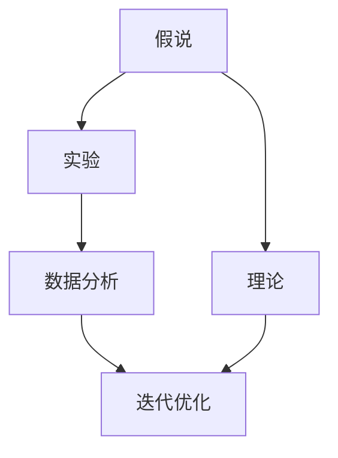
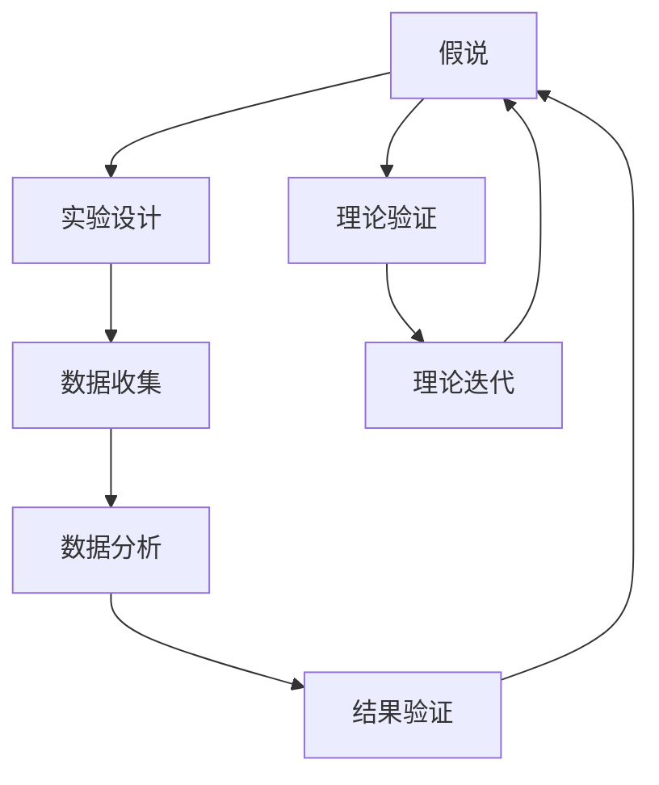

                 

# 科学方法论：从假说到验证

> 关键词：科学方法论, 假说, 验证, 理论, 实验, 数据分析, 迭代优化, 模型评估, 机器学习, 数据科学, 统计学

## 1. 背景介绍

在科技飞速发展的今天，数据和算法已成为驱动创新和进步的重要引擎。然而，如何从纷繁复杂的数据中提炼出有价值的知识，如何构建有效的模型和理论，如何评估和优化算法性能，成为了亟待解决的挑战。科学方法论提供了一套系统化的思路，帮助我们从假说到验证，逐步构建起可靠的理论和方法体系。本文将从科学方法论的基本框架出发，详细探讨从假说到验证的流程，并结合机器学习和数据科学的具体应用场景，给出实践中的典型范例。

## 2. 核心概念与联系

### 2.1 核心概念概述

科学方法论的核心概念主要包括：假说、理论、实验、数据分析和迭代优化。这些概念之间通过相互作用和反馈，形成一个完整的知识生产循环。

- **假说(Hypothesis)**：基于观察和先验知识提出的解释性假设，用于预测或解释未知现象。假说通常简明扼要，且具有可验证性。

- **理论(Theory)**：由一系列假说和证据支持的逻辑一致的系统化知识体系。理论不仅解释已知现象，还具备预测未知现象的能力。

- **实验(Experiment)**：按照设定的条件和方法，系统地测试假说的真实性。实验要求控制变量，重复操作以减小误差。

- **数据分析(Analysis)**：对实验数据进行统计和处理，验证假说的正确性。数据分析依赖于统计学和数据科学方法。

- **迭代优化(Iteration and Optimization)**：基于数据分析的结果，不断修正和优化假说和理论，形成一个持续改进的循环。

这些概念通过以下Mermaid流程图展示其相互关系：



科学方法论通过假说提出、实验验证、数据分析和迭代优化这四个环节，构建起系统化的知识发现和验证过程。

### 2.2 核心概念原理和架构的 Mermaid 流程图



这个流程图展示了假说提出、实验设计、数据收集、数据分析、结果验证和理论迭代这六个主要环节，形成一个完整的科学探索流程。

## 3. 核心算法原理 & 具体操作步骤

### 3.1 算法原理概述

科学方法论的应用不仅限于自然科学，在机器学习和数据科学领域同样有着广泛的应用。通过科学方法论，我们可以从数据中提取知识，构建模型，并持续优化算法，以满足实际应用需求。

以机器学习为例，科学方法论的应用主要分为以下几个步骤：

1. **问题定义**：明确需要解决的具体问题，如分类、回归、聚类等。
2. **数据准备**：收集和预处理数据，确保数据的准确性和可用性。
3. **模型选择**：根据问题的特点选择合适的机器学习模型。
4. **模型训练**：使用训练数据训练模型，调整模型参数以优化性能。
5. **模型验证**：在验证数据集上评估模型性能，确保模型泛化能力强。
6. **模型部署**：将训练好的模型应用于实际问题，收集反馈并进行优化。
7. **迭代优化**：根据实际应用中的反馈和新的数据，持续改进模型和算法。

### 3.2 算法步骤详解

**Step 1: 问题定义**

问题定义是科学方法论的基础，决定了后续的实验设计和数据分析方向。在机器学习中，问题定义通常包含以下几个方面：

- **问题类型**：是分类、回归、聚类还是其他问题类型。
- **数据特点**：输入数据的类型和特征，如文本、图像、时间序列等。
- **输出目标**：期望的输出结果类型，如分类标签、回归值、聚类簇等。
- **业务需求**：解决该问题对业务目标的贡献，如提升用户满意度、减少成本、增加收入等。

例如，一个典型的分类问题可以定义如下：给定一个包含多个特征的文本数据集，预测每个文本属于哪个类别（如垃圾邮件/非垃圾邮件）。

**Step 2: 数据准备**

数据准备是机器学习中的关键环节，数据的质量直接影响到模型的性能。数据准备通常包括以下步骤：

- **数据收集**：从不同渠道收集数据，确保数据的多样性和代表性。
- **数据清洗**：去除噪声、缺失值和异常值，确保数据的准确性。
- **数据预处理**：对数据进行标准化、归一化、特征工程等处理，提高数据可用性。
- **数据分割**：将数据集分为训练集、验证集和测试集，确保模型评估的公平性和可靠性。

**Step 3: 模型选择**

模型选择是机器学习中的核心步骤，直接影响模型的性能和泛化能力。在模型选择时，需要考虑以下几个因素：

- **模型复杂度**：模型的参数数量和计算复杂度。
- **模型性能**：模型的预测准确性和泛化能力。
- **模型适用性**：模型能否适应数据特点和问题类型。

例如，对于分类问题，常见的模型包括逻辑回归、决策树、随机森林、支持向量机、神经网络等。

**Step 4: 模型训练**

模型训练是机器学习中的关键环节，通过训练数据调整模型参数，优化模型性能。在模型训练时，需要考虑以下几个因素：

- **学习率**：控制模型参数更新的步长，影响训练速度和精度。
- **正则化**：防止模型过拟合，确保模型泛化能力强。
- **优化器**：选择合适的优化算法，如梯度下降、Adam等，提高训练效率。
- **超参数调优**：调整模型的超参数，如批量大小、迭代次数等，优化模型性能。

**Step 5: 模型验证**

模型验证是机器学习中的重要环节，通过验证数据集评估模型性能，确保模型泛化能力强。在模型验证时，需要考虑以下几个因素：

- **评估指标**：选择合适的评估指标，如准确率、召回率、F1分数等。
- **交叉验证**：使用交叉验证技术，评估模型的稳定性和可靠性。
- **模型调优**：根据验证结果调整模型参数，优化模型性能。

**Step 6: 模型部署**

模型部署是将训练好的模型应用于实际问题，收集反馈并进行优化。在模型部署时，需要考虑以下几个因素：

- **模型集成**：将多个模型集成，提高模型性能和鲁棒性。
- **应用场景**：根据实际应用场景，调整模型输出，满足业务需求。
- **数据实时更新**：收集新的数据，持续训练和优化模型。

**Step 7: 迭代优化**

迭代优化是机器学习中的持续改进过程，通过不断的模型训练和评估，优化模型性能。在迭代优化时，需要考虑以下几个因素：

- **反馈机制**：建立反馈机制，收集用户和系统的反馈，发现问题。
- **新数据获取**：持续收集新的数据，扩充训练集。
- **模型复用**：将已训练好的模型复用到其他问题中，提高效率。
- **算法创新**：探索新的算法和技术，提升模型性能。

### 3.3 算法优缺点

科学方法论在机器学习中的应用具有以下优点：

- **系统性**：通过系统化的流程，确保了机器学习项目的可靠性和稳定性。
- **可重复性**：通过标准化的实验和分析方法，确保了研究的可重复性和可靠性。
- **可解释性**：通过详细的实验记录和数据分析，提高了机器学习模型的可解释性和可理解性。
- **泛化能力强**：通过不断优化和验证，确保了模型具有良好的泛化能力和实际应用价值。

但科学方法论也存在一些缺点：

- **耗时较长**：从问题定义到模型部署和迭代优化，每个环节都需要大量时间和精力投入。
- **成本较高**：数据收集、模型训练和系统部署需要较高的计算资源和硬件设备。
- **依赖数据**：模型的性能依赖于数据的质量和多样性，数据不足或偏差会导致模型失效。

## 4. 数学模型和公式 & 详细讲解 & 举例说明

### 4.1 数学模型构建

在机器学习中，数学模型是问题描述和模型推导的基础。以分类问题为例，常见的数学模型包括逻辑回归、决策树、支持向量机等。

以逻辑回归模型为例，其数学模型可以表示为：

$$
P(y=1|x) = \sigma(\theta^T x)
$$

其中，$y$ 为分类标签，$x$ 为输入特征，$\theta$ 为模型参数，$\sigma$ 为sigmoid函数。

### 4.2 公式推导过程

以逻辑回归模型的训练为例，其最小化损失函数的过程如下：

1. **损失函数**：
   $$
   L(\theta) = -\frac{1}{N}\sum_{i=1}^N y_i \log\sigma(\theta^T x_i) + (1-y_i)\log(1-\sigma(\theta^T x_i))
   $$

2. **梯度下降**：
   $$
   \frac{\partial L(\theta)}{\partial \theta} = -\frac{1}{N}\sum_{i=1}^N (\frac{y_i}{\sigma(\theta^T x_i)}-\frac{1-y_i}{1-\sigma(\theta^T x_i)}) x_i
   $$

3. **模型优化**：
   $$
   \theta \leftarrow \theta - \eta \frac{\partial L(\theta)}{\partial \theta}
   $$

其中，$\eta$ 为学习率，$\sigma$ 为sigmoid函数。

### 4.3 案例分析与讲解

以文本分类问题为例，常用的模型包括朴素贝叶斯、支持向量机和深度神经网络等。以支持向量机为例，其数学模型可以表示为：

$$
f(x) = \sum_{i=1}^n \alpha_i y_i \langle x, x_i \rangle + b
$$

其中，$x$ 为输入特征，$\alpha_i$ 为模型参数，$y_i$ 为分类标签，$\langle x, x_i \rangle$ 为核函数。

支持向量机的训练过程如下：

1. **核函数选择**：根据数据特点选择合适的核函数，如线性核、多项式核、高斯核等。
2. **参数调优**：通过交叉验证等方法，调整模型参数，优化模型性能。
3. **模型评估**：使用测试集评估模型性能，确保模型泛化能力强。
4. **模型集成**：将多个模型集成，提高模型性能和鲁棒性。

## 5. 项目实践：代码实例和详细解释说明

### 5.1 开发环境搭建

在机器学习项目中，开发环境搭建是关键步骤。以下是使用Python进行Scikit-Learn开发的常见环境配置流程：

1. 安装Anaconda：从官网下载并安装Anaconda，用于创建独立的Python环境。

2. 创建并激活虚拟环境：
```bash
conda create -n ml-env python=3.8 
conda activate ml-env
```

3. 安装Scikit-Learn：
```bash
pip install scikit-learn
```

4. 安装其他相关工具包：
```bash
pip install numpy pandas matplotlib seaborn jupyter notebook ipython
```

完成上述步骤后，即可在`ml-env`环境中开始机器学习项目开发。

### 5.2 源代码详细实现

下面以朴素贝叶斯分类器为例，给出Scikit-Learn库的代码实现。

```python
from sklearn.naive_bayes import GaussianNB
from sklearn.model_selection import train_test_split
from sklearn.metrics import accuracy_score
from sklearn.datasets import load_iris

# 加载鸢尾花数据集
iris = load_iris()
X = iris.data
y = iris.target

# 数据分割
X_train, X_test, y_train, y_test = train_test_split(X, y, test_size=0.2, random_state=42)

# 创建朴素贝叶斯分类器
clf = GaussianNB()

# 训练模型
clf.fit(X_train, y_train)

# 预测结果
y_pred = clf.predict(X_test)

# 评估模型性能
print("Accuracy:", accuracy_score(y_test, y_pred))
```

这段代码实现了使用Scikit-Learn库进行朴素贝叶斯分类器的训练和评估过程。可以看到，使用Scikit-Learn进行机器学习项目开发，代码实现简洁高效，极大降低了开发难度。

### 5.3 代码解读与分析

让我们再详细解读一下关键代码的实现细节：

**train_test_split函数**：
- 用于数据集分割，将数据集分为训练集和测试集，比例为70%和30%。
- 参数说明：
  - `X_train`：训练集的特征
  - `X_test`：测试集的特征
  - `y_train`：训练集的标签
  - `y_test`：测试集的标签
  - `test_size`：测试集的比例，默认为0.25
  - `random_state`：随机种子，确保实验可重复

**GaussianNB类**：
- 创建朴素贝叶斯分类器对象，用于训练和预测。
- 实例化方法：`clf = GaussianNB()`

**fit方法**：
- 训练模型，调整模型参数，优化模型性能。
- 参数说明：
  - `X_train`：训练集的特征
  - `y_train`：训练集的标签

**predict方法**：
- 预测测试集标签。
- 参数说明：
  - `X_test`：测试集的特征

**accuracy_score函数**：
- 评估模型性能，计算准确率。
- 参数说明：
  - `y_test`：测试集的标签
  - `y_pred`：预测的标签

**打印输出**：
- 打印模型评估结果，显示准确率。
- `print("Accuracy:", accuracy_score(y_test, y_pred))`

## 6. 实际应用场景

### 6.1 金融风险评估

金融风险评估是金融领域的重要应用场景，通过机器学习模型对客户的信用评分和风险等级进行预测和评估。基于科学方法论的机器学习模型，可以高效地处理海量数据，分析客户行为，识别高风险客户，提升风险管理能力。

具体而言，可以收集客户的信用记录、交易历史、社交网络等数据，使用机器学习模型进行分类或回归，预测客户的违约概率和风险等级。通过不断的模型训练和评估，可以动态调整模型的参数和权重，优化风险评估的准确性和稳定性。

### 6.2 医疗诊断辅助

医疗诊断辅助是医疗领域的重要应用场景，通过机器学习模型对病人的症状和病历进行分析和预测，辅助医生进行诊断和治疗。基于科学方法论的机器学习模型，可以高效地处理医疗数据，分析病人的症状和病史，预测疾病类型和病情发展趋势。

具体而言，可以收集病人的症状、病史、实验室检查结果等数据，使用机器学习模型进行分类或回归，预测病人的疾病类型和病情发展趋势。通过不断的模型训练和评估，可以动态调整模型的参数和权重，优化诊断的准确性和稳定性。

### 6.3 智能推荐系统

智能推荐系统是电商、视频、新闻等领域的重要应用场景，通过机器学习模型对用户行为和偏好进行分析和预测，推荐用户可能感兴趣的商品、视频或新闻。基于科学方法论的机器学习模型，可以高效地处理用户数据，分析用户的兴趣和行为，推荐用户可能感兴趣的内容。

具体而言，可以收集用户的行为数据、兴趣偏好、社交网络等数据，使用机器学习模型进行协同过滤、内容推荐等算法，预测用户可能感兴趣的内容。通过不断的模型训练和评估，可以动态调整模型的参数和权重，优化推荐的准确性和多样性。

### 6.4 未来应用展望

随着机器学习和数据科学技术的不断进步，科学方法论的应用前景将更加广阔。未来，基于科学方法论的机器学习模型将在更多领域得到应用，为传统行业带来变革性影响。

在智慧城市治理中，基于机器学习的智能交通、智慧能源、智能安防等应用将大幅提升城市管理的智能化水平，构建更安全、高效、智能的城市环境。

在工业制造中，基于机器学习的质量控制、生产调度、设备维护等应用将提高生产效率，降低生产成本，推动制造业的数字化转型。

在教育领域，基于机器学习的个性化学习、智能辅导、智能评估等应用将提升教学质量和教育公平性，推动教育行业的创新发展。

## 7. 工具和资源推荐

### 7.1 学习资源推荐

为了帮助开发者系统掌握机器学习与数据科学的知识，以下是一些优质的学习资源：

1. **《机器学习》（周志华）**：国内经典的机器学习教材，系统介绍了机器学习的理论、算法和应用。
2. **Coursera机器学习课程**：由斯坦福大学Andrew Ng教授开设的机器学习课程，包含详细的视频讲解和作业练习。
3. **Kaggle竞赛平台**：提供大量的数据集和竞赛任务，帮助开发者实践和提升机器学习技能。
4. **Scikit-Learn官方文档**：提供丰富的Scikit-Learn库使用教程和案例，帮助开发者深入学习机器学习算法。
5. **GitHub机器学习项目**：包含各种机器学习项目代码，包括分类、回归、聚类等任务，帮助开发者学习和实践。

通过这些资源的学习，相信你一定能够快速掌握机器学习与数据科学的知识，并用于解决实际的机器学习问题。

### 7.2 开发工具推荐

在机器学习项目开发中，选择合适的工具可以提高开发效率，加速模型部署和迭代优化。以下是一些常用的开发工具：

1. **Jupyter Notebook**：轻量级的Python开发环境，支持代码、数据和可视化的整合，适合数据探索和模型验证。
2. **PyCharm**：功能强大的Python IDE，支持代码编辑、调试和测试，适合大规模项目开发。
3. **TensorFlow**：由Google主导的深度学习框架，支持分布式训练和推理，适合大规模数据处理。
4. **PyTorch**：由Facebook主导的深度学习框架，支持动态计算图和高效推理，适合研究型项目开发。
5. **Scikit-Learn**：Python机器学习库，提供丰富的机器学习算法和工具，适合应用开发。

合理利用这些工具，可以显著提升机器学习项目的开发效率，加速模型部署和迭代优化。

### 7.3 相关论文推荐

机器学习和数据科学的发展源于学界的持续研究。以下是几篇奠基性的相关论文，推荐阅读：

1. **支持向量机（Vapnik & Chu）**：提出支持向量机算法，通过最大化分类边界，优化分类器的泛化能力。
2. **随机森林（Breiman）**：提出随机森林算法，通过集成多个决策树，提高模型的准确性和鲁棒性。
3. **朴素贝叶斯（Ross）**：提出朴素贝叶斯算法，基于贝叶斯定理，高效处理分类问题。
4. **深度学习（Goodfellow et al.）**：介绍深度神经网络的结构和训练方法，推动机器学习在图像、语音、自然语言处理等领域的应用。
5. **强化学习（Sutton & Barto）**：介绍强化学习算法，通过奖惩机制，优化智能体在环境中的决策能力。

这些论文代表了大数据时代机器学习与数据科学的发展脉络，通过学习这些前沿成果，可以帮助研究者把握学科前进方向，激发更多的创新灵感。

## 8. 总结：未来发展趋势与挑战

### 8.1 总结

本文对科学方法论在机器学习和数据科学领域的应用进行了全面系统的介绍。首先阐述了科学方法论的基本框架和核心概念，明确了从假说到验证的科学探索过程。其次，从理论到实践，详细讲解了机器学习项目的开发流程，并结合具体应用场景，给出了代码实现和模型评估的详细解释。最后，对机器学习和数据科学的发展趋势和面临的挑战进行了系统探讨，提出了未来研究方向和突破点。

通过本文的系统梳理，可以看到，科学方法论是机器学习和数据科学研究的重要工具，其系统性、可重复性和可解释性为数据驱动的创新提供了坚实的基础。未来，随着数据科学和机器学习技术的不断发展，科学方法论的应用前景将更加广阔，推动人工智能技术在更多领域落地应用，促进人类认知智能的进步。

### 8.2 未来发展趋势

展望未来，科学方法论在机器学习和数据科学中的应用将呈现以下几个发展趋势：

1. **自动化和智能化**：随着人工智能技术的不断进步，机器学习项目将更多依赖自动化和智能化工具，提高开发效率和模型性能。例如，自动数据清洗、自动特征工程、自动模型优化等。

2. **跨领域融合**：随着数据和应用场景的不断扩展，机器学习和数据科学将与其他技术领域深度融合，推动知识生产和技术创新的全面突破。例如，与物联网、区块链、生物信息学等领域的结合，将拓展机器学习和数据科学的应用范围和深度。

3. **可解释性和可理解性**：随着应用场景对模型透明度的要求越来越高，机器学习和数据科学将更加注重模型的可解释性和可理解性，增强用户和系统的信任度。例如，通过特征重要性分析、模型可视化等方法，提高模型的可解释性。

4. **联邦学习和隐私保护**：随着数据隐私和安全性的要求越来越高，机器学习和数据科学将更多采用联邦学习等技术，保护用户数据隐私，实现跨设备或跨机构的数据协同和模型优化。

5. **跨模态信息融合**：随着多模态数据的应用场景不断增加，机器学习和数据科学将更多采用跨模态信息融合技术，提高模型的感知能力和泛化能力。例如，将文本、图像、语音等多模态数据进行融合，提高模型的感知能力和泛化能力。

以上趋势凸显了机器学习和数据科学技术的广阔前景。这些方向的探索发展，将进一步提升机器学习和数据科学技术的性能和应用范围，推动人工智能技术向更加智能和普适化的方向发展。

### 8.3 面临的挑战

尽管机器学习和数据科学技术已经取得了瞩目成就，但在迈向更加智能化、普适化应用的过程中，它仍面临诸多挑战：

1. **数据质量和多样性**：随着数据量的不断增加，数据质量和多样性成为制约机器学习和数据科学技术发展的瓶颈。如何获取高质量、多样性的数据，是一个亟待解决的问题。

2. **模型泛化能力**：机器学习和数据科学模型在实际应用中的泛化能力不足，面对新场景和新数据，模型性能容易出现波动。如何提高模型的泛化能力，是一个重要挑战。

3. **计算资源消耗**：机器学习和数据科学模型的计算资源消耗较高，尤其是深度学习模型，需要高性能计算设备和海量数据支持。如何降低计算资源消耗，提高模型效率，是一个重要问题。

4. **模型可解释性**：机器学习和数据科学模型往往被视为"黑盒"系统，难以解释其内部工作机制和决策逻辑。如何赋予模型更强的可解释性，是一个重要问题。

5. **数据隐私和安全**：随着数据隐私和安全性的要求越来越高，如何在保护用户隐私的同时，实现数据共享和模型优化，是一个重要挑战。

6. **伦理和社会影响**：机器学习和数据科学模型的应用可能会带来伦理和社会影响，如算法偏见、模型公平性等问题。如何构建公平、透明的模型，是一个重要问题。

正视机器学习和数据科学面临的这些挑战，积极应对并寻求突破，将是大数据时代知识生产和技术创新的重要保障。相信随着学界和产业界的共同努力，这些挑战终将一一被克服，机器学习和数据科学技术将为社会带来更多福祉。

### 8.4 研究展望

面向未来，机器学习和数据科学技术的研究方向和突破点主要集中在以下几个方面：

1. **自动化和智能化**：探索自动化和智能化的机器学习工具，提高开发效率和模型性能，如自动化数据清洗、特征工程、模型优化等。

2. **跨领域融合**：推动机器学习和数据科学技术与其他技术领域的深度融合，拓展知识生产和技术创新的广度和深度，如与物联网、区块链、生物信息学等领域的结合。

3. **可解释性和可理解性**：增强机器学习和数据科学模型的可解释性和可理解性，提高用户和系统的信任度，如通过特征重要性分析、模型可视化等方法，提高模型的可解释性。

4. **联邦学习和隐私保护**：推动联邦学习等技术的发展，保护用户数据隐私，实现跨设备或跨机构的数据协同和模型优化。

5. **跨模态信息融合**：探索跨模态信息融合技术，提高模型的感知能力和泛化能力，如将文本、图像、语音等多模态数据进行融合，提高模型的感知能力和泛化能力。

6. **模型泛化能力和效率**：提高机器学习和数据科学模型的泛化能力和效率，如使用迁移学习、自监督学习等技术，提升模型泛化能力和计算效率。

7. **伦理和社会影响**：构建公平、透明的机器学习和数据科学模型，避免算法偏见、模型公平性等问题，推动人工智能技术的健康发展。

这些研究方向和突破点将引领机器学习和数据科学技术的不断进步，推动人工智能技术在更多领域落地应用，促进人类认知智能的进步。

## 9. 附录：常见问题与解答

**Q1：科学方法论是否适用于所有领域？**

A: 科学方法论不仅适用于自然科学领域，在工程、金融、医疗、教育等众多领域同样有着广泛的应用。其系统性的研究流程和方法论，可以适用于各种复杂系统的探索和优化。

**Q2：科学方法论的核心是什么？**

A: 科学方法论的核心在于系统化的研究流程和方法论，通过假说提出、实验设计、数据分析和迭代优化，不断提升模型的准确性和稳定性。其核心要素包括问题定义、数据准备、模型选择、模型训练、模型验证和迭代优化等环节。

**Q3：科学方法论的局限性是什么？**

A: 科学方法论的局限性主要在于其数据驱动的本质，数据质量和多样性成为制约其应用的重要因素。如何获取高质量、多样性的数据，是科学方法论应用中的一个重要挑战。

**Q4：科学方法论在机器学习中的应用如何？**

A: 科学方法论在机器学习中的应用主要体现在以下几个方面：问题定义、数据准备、模型选择、模型训练、模型验证和迭代优化。通过系统化的研究流程和方法论，科学方法论可以提升机器学习模型的准确性和稳定性，推动机器学习技术的进步。

**Q5：科学方法论的未来发展方向是什么？**

A: 科学方法论的未来发展方向主要集中在自动化和智能化、跨领域融合、可解释性和可理解性、联邦学习和隐私保护、跨模态信息融合、模型泛化能力和效率、伦理和社会影响等方向。这些方向将推动科学方法论的不断进步，拓展其应用范围和深度。

总之，科学方法论是机器学习和数据科学研究的重要工具，其系统性、可重复性和可解释性为数据驱动的创新提供了坚实的基础。未来，随着数据科学和机器学习技术的不断发展，科学方法论的应用前景将更加广阔，推动人工智能技术在更多领域落地应用，促进人类认知智能的进步。

