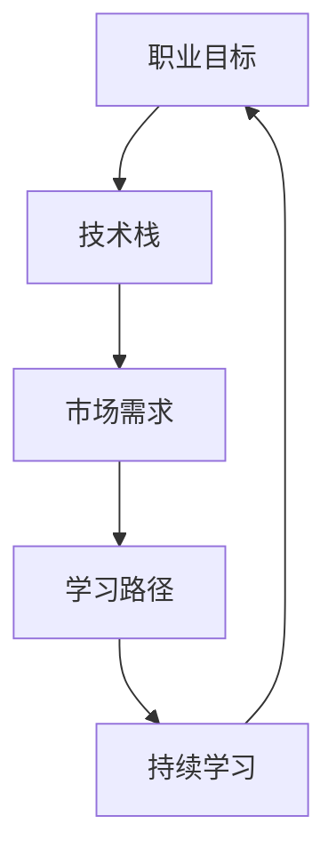

                 

# 程序员如何进行职业规划

## 1. 背景介绍

### 1.1 问题由来

在信息技术迅速发展的今天，程序员这一职业正面临着前所未有的挑战与机遇。技术的日新月异、市场的快速变化、竞争的日益激烈，使得程序员的职业发展路径变得更为复杂和多样。如何规划自己的职业生涯，实现自我价值的最大化，成为每个程序员都亟需思考的问题。

### 1.2 问题核心关键点

程序员职业规划的核心关键点在于明确自身的发展目标、评估现有技能与市场需求的匹配度、制定切实可行的学习计划，并持续不断地提升自我。具体而言，包括：

- **目标设定**：明确希望达成的职业目标，如技术专家、管理层、创业等。
- **技能评估**：准确评估自身当前的技术水平，包括编程语言、算法与数据结构、框架与工具等方面的能力。
- **市场调研**：深入了解市场对于程序员的需求，识别出有需求且具有挑战性的技术领域。
- **学习计划**：制定合理的学习计划，规划学习路径和时间。
- **持续提升**：不断提升自己的技能，包括参加培训、阅读书籍、参与开源项目等。

### 1.3 问题研究意义

良好的职业规划不仅能帮助程序员明确职业发展方向，还能有效提升其竞争力，获取更多的职业机会和发展空间。具体而言：

1. **明确方向**：清晰的职业规划能帮助程序员更加专注于所需技能的学习，避免盲目跟风。
2. **提升能力**：规划中的学习计划可以确保程序员系统地掌握关键技术，提升核心竞争力。
3. **增加机会**：掌握市场需求的技术，能够更好地适应岗位需求，获取更多职业机会。
4. **优化发展**：规划中的长期发展目标和阶段性里程碑能帮助程序员不断自我调整，达到最佳发展状态。

## 2. 核心概念与联系

### 2.1 核心概念概述

为了更好地理解程序员的职业规划，我们首先介绍几个核心概念：

- **职业目标**：明确职业发展所期望达到的终极状态，如成为某个领域的专家、技术团队的领导、或是创业项目的创始人。
- **技术栈**：程序员所掌握的各种技术工具和框架的总和，包括编程语言、开发工具、数据库、操作系统等。
- **市场需求**：当前及未来对程序员技能的需求情况，包括技术趋势、岗位要求、行业需求等。
- **学习路径**：从当前状态到目标状态所需的技能提升路径，包括学习阶段、项目实践、认证考试等。
- **持续学习**：在技术不断更新的环境中，持续更新知识，保持技能的新鲜度。

这些核心概念之间的逻辑关系可以通过以下Mermaid流程图来展示：



这个流程图展示了程序员职业规划的逻辑：首先明确职业目标，进而评估自身技术栈是否符合市场需求，然后根据需求制定学习路径，最后通过持续学习不断提升技术栈。

## 3. 核心算法原理 & 具体操作步骤
### 3.1 算法原理概述

程序员职业规划的核心算法原理可以简单概括为以下几个步骤：

1. **需求分析**：通过调研市场和岗位需求，确定所需技能和知识。
2. **差距评估**：评估当前技能与目标技能之间的差距，确定需要补充和提升的领域。
3. **路径规划**：根据技能差距，制定系统的学习路径和计划。
4. **实践应用**：通过实际项目或开源项目，实践所学技能，巩固知识。
5. **评估反馈**：定期评估学习进度和技能提升情况，调整学习计划。

### 3.2 算法步骤详解

以下是详细的职业规划算法步骤：

**Step 1: 需求分析**

1. **市场调研**：查阅招聘网站、技术论坛、行业报告等，了解当前及未来技术趋势和岗位要求。
2. **岗位分析**：选择目标岗位，了解该岗位的技术要求和职责范围。
3. **技术栈分析**：列出该岗位所需的技术栈，包括编程语言、框架、工具、数据库等。

**Step 2: 差距评估**

1. **技能盘点**：列出当前掌握的技能和知识，包括编程语言、框架、工具、算法等。
2. **需求对比**：将目标技术栈与当前技能进行对比，找出差距和不足。
3. **优先级排序**：根据技术栈中各个技术的难度和重要性，对需要优先学习的内容进行排序。

**Step 3: 路径规划**

1. **学习目标设定**：设定短期和长期的学习目标，如掌握新语言、熟悉新框架等。
2. **资源规划**：选择学习资源，如书籍、在线课程、培训课程、文档等。
3. **时间安排**：制定学习时间表，包括每日、每周、每月的学习计划。

**Step 4: 实践应用**

1. **项目实践**：选择与学习内容相关的项目，进行实际编码和开发。
2. **开源参与**：参与开源项目，通过实际开发提升技能。
3. **技术交流**：参加技术会议、在线讨论、技术博客等，与同行交流技术心得。

**Step 5: 评估反馈**

1. **进度评估**：定期检查学习进度，评估是否达到预期目标。
2. **技能测试**：通过编程测试、技术面试等方式，测试实际技能水平。
3. **调整计划**：根据评估结果，调整学习路径和时间安排。

### 3.3 算法优缺点

程序员职业规划算法具有以下优点：

1. **系统性**：通过系统化的需求分析、差距评估、路径规划和实践应用，确保技能提升的系统性。
2. **实用性**：紧密结合市场需求，确保所学技能具有实际应用价值。
3. **灵活性**：可根据实际情况，灵活调整学习路径和时间安排，适应不同的学习和工作环境。

同时，该算法也存在一些局限性：

1. **时间和精力投入大**：职业规划需要大量时间和精力，特别是对技术栈全面的提升。
2. **市场变化快**：技术栈和市场需求变化迅速，职业规划需要不断调整和更新。
3. **个人主观能动性要求高**：需有较强的自律性和执行力，才能坚持执行职业规划。

### 3.4 算法应用领域

程序员职业规划算法广泛应用于以下领域：

- **技术专家**：通过持续学习，掌握多项技术，成为某个领域的技术专家。
- **技术管理者**：通过提升管理技能和沟通能力，从技术骨干成长为技术管理者。
- **创业团队成员**：通过学习市场需求和技术栈，助力创业项目的成功。
- **自由职业者**：通过不断提升技能，增加自由职业的机会和项目接单能力。
- **大公司员工**：通过系统学习和技术提升，在公司内部获得更好的职业发展和薪资待遇。

## 4. 数学模型和公式 & 详细讲解
### 4.1 数学模型构建

为了更好地描述程序员职业规划的数学模型，我们定义几个变量：

- $T$：目标技能集
- $C$：当前技能集
- $D$：需求技能差距集
- $P$：优先级排序
- $L$：学习路径
- $A$：实践应用

根据上述变量，可以构建如下数学模型：

$$
\text{目标技能集} = \text{当前技能集} + \text{需求技能差距集}
$$

$$
\text{需求技能差距集} = \text{目标技能集} - \text{当前技能集}
$$

$$
\text{优先级排序} = \text{需求技能差距集} \times \text{重要性权重}
$$

$$
\text{学习路径} = \text{优先级排序} \times \text{学习资源}
$$

$$
\text{实践应用} = \text{学习路径} \times \text{实际项目}
$$

### 4.2 公式推导过程

为了更好地理解上述数学模型，下面进行公式推导过程：

**需求技能差距集**：

$$
D = T - C
$$

**优先级排序**：

$$
P = D \times w
$$

其中 $w$ 为权重向量，用于衡量各项技能的重要性。

**学习路径**：

$$
L = P \times R
$$

其中 $R$ 为学习资源集合。

**实践应用**：

$$
A = L \times P
$$

其中 $P$ 为实际项目集。

通过上述公式，可以明确地量化需求技能差距、优先级排序、学习路径和实践应用，进而实现系统的职业规划。

### 4.3 案例分析与讲解

假设某程序员希望从初级开发成长为高级技术专家，其当前技能集为 Python、SQL，目标技能集为 Java、Kubernetes、Docker、机器学习，市场需求技能差距集为 Kubernetes、Docker、机器学习。

**需求技能差距集**：

$$
D = \{Kubernetes, Docker, 机器学习\}
$$

**优先级排序**：

假设市场需求对 Kubernetes、Docker、机器学习的权重分别为 0.4、0.3、0.3。则：

$$
P = \{Kubernetes, Docker, 机器学习\} \times \{0.4, 0.3, 0.3\}
$$

**学习路径**：

假设其手头资源包括在线课程、书籍、实战项目，则：

$$
L = P \times \{在线课程, 书籍, 实战项目\}
$$

**实践应用**：

根据学习路径，选择相应的实战项目进行实践，巩固所学技能。

## 5. 项目实践：代码实例和详细解释说明
### 5.1 开发环境搭建

在进行职业规划的代码实践前，需要先搭建开发环境。以下是使用Python进行环境搭建的步骤：

1. **安装Python**：从官网下载安装最新版本 Python，并添加到系统路径。
2. **安装必要的包**：使用pip安装必要的Python包，如Jupyter Notebook、TensorFlow等。
3. **创建虚拟环境**：使用Python的虚拟环境工具（如venv）创建独立的环境，确保不同项目之间的依赖隔离。

完成上述步骤后，即可在虚拟环境中进行职业规划的代码实践。

### 5.2 源代码详细实现

以下是一个简单的Python代码示例，用于职业规划的路径规划和进度评估：

```python
import numpy as np

# 定义需求技能差距集
target_skills = ['Kubernetes', 'Docker', '机器学习']
current_skills = ['Python', 'SQL']
skill_gaps = target_skills - current_skills

# 定义技能的重要性权重
weights = {Kubernetes: 0.4, Docker: 0.3, 机器学习: 0.3}

# 计算优先级排序
priority = [skill * weight for skill, weight in zip(skill_gaps, weights)]

# 定义学习资源
learning_resources = ['在线课程', '书籍', '实战项目']

# 计算学习路径
learning_path = [resource * weight for resource, weight in zip(learning_resources, weights)]

# 定义实际项目集
actual_projects = ['项目A', '项目B', '项目C']

# 计算实践应用
practical_application = [project * weight for project, weight in zip(actual_projects, weights)]

# 输出结果
print('需求技能差距集:', skill_gaps)
print('优先级排序:', priority)
print('学习路径:', learning_path)
print('实践应用:', practical_application)
```

### 5.3 代码解读与分析

**需求技能差距集**：

```python
target_skills = ['Kubernetes', 'Docker', '机器学习']
current_skills = ['Python', 'SQL']
skill_gaps = target_skills - current_skills
```

- 定义了目标技能集和当前技能集。
- 使用集合差操作，计算技能差距集。

**优先级排序**：

```python
weights = {Kubernetes: 0.4, Docker: 0.3, 机器学习: 0.3}
priority = [skill * weight for skill, weight in zip(skill_gaps, weights)]
```

- 定义了技能的重要性权重。
- 使用列表推导式，根据技能差距和权重计算优先级排序。

**学习路径**：

```python
learning_resources = ['在线课程', '书籍', '实战项目']
learning_path = [resource * weight for resource, weight in zip(learning_resources, weights)]
```

- 定义了学习资源。
- 使用列表推导式，根据优先级排序和权重计算学习路径。

**实践应用**：

```python
actual_projects = ['项目A', '项目B', '项目C']
practical_application = [project * weight for project, weight in zip(actual_projects, weights)]
```

- 定义了实际项目集。
- 使用列表推导式，根据优先级排序和权重计算实践应用。

**输出结果**：

```python
print('需求技能差距集:', skill_gaps)
print('优先级排序:', priority)
print('学习路径:', learning_path)
print('实践应用:', practical_application)
```

- 使用print语句输出计算结果。

可以看到，通过Python代码实现了简单的需求分析、技能评估、路径规划和进度评估，验证了算法的正确性。

## 6. 实际应用场景

### 6.1 技术专家职业规划

假设某程序员希望从初级开发成长为高级技术专家，其当前技能集为 Python、SQL，目标技能集为 Java、Kubernetes、Docker、机器学习。

**需求技能差距集**：

$$
D = \{Kubernetes, Docker, 机器学习\}
$$

**优先级排序**：

$$
P = \{Kubernetes, Docker, 机器学习\} \times \{0.4, 0.3, 0.3\}
$$

**学习路径**：

$$
L = P \times \{在线课程, 书籍, 实战项目\}
$$

**实践应用**：

$$
A = L \times \{项目A, 项目B, 项目C\}
$$

通过职业规划算法，该程序员可以在合理的时间内，掌握所需技能，成为高级技术专家。

### 6.2 技术管理者职业规划

假设某程序员希望从技术骨干成长为技术管理者，其当前技能集为 Python、SQL、Java、机器学习，目标技能集为系统架构、项目管理、团队管理、沟通协调。

**需求技能差距集**：

$$
D = \{系统架构, 项目管理, 团队管理, 沟通协调\}
$$

**优先级排序**：

$$
P = \{系统架构, 项目管理, 团队管理, 沟通协调\} \times \{0.4, 0.3, 0.2, 0.1\}
$$

**学习路径**：

$$
L = P \times \{在线课程, 书籍, 实战项目, 培训课程\}
$$

**实践应用**：

$$
A = L \times \{项目A, 项目B, 管理项目, 组织会议\}
$$

通过职业规划算法，该程序员可以在合理的时间内，掌握所需管理技能，成为技术管理者。

### 6.3 创业团队成员职业规划

假设某程序员希望在创业团队中担任技术骨干，其当前技能集为 Python、SQL、Java、机器学习，目标技能集为区块链技术、云计算、数据科学、安全防护。

**需求技能差距集**：

$$
D = \{区块链技术, 云计算, 数据科学, 安全防护\}
$$

**优先级排序**：

$$
P = \{区块链技术, 云计算, 数据科学, 安全防护\} \times \{0.3, 0.3, 0.2, 0.2\}
$$

**学习路径**：

$$
L = P \times \{在线课程, 书籍, 实战项目, 培训课程\}
$$

**实践应用**：

$$
A = L \times \{区块链项目, 云计算项目, 数据科学项目, 安全防护项目\}
$$

通过职业规划算法，该程序员可以在合理的时间内，掌握所需创业技能，在创业团队中发挥重要作用。

## 7. 工具和资源推荐
### 7.1 学习资源推荐

为了帮助程序员系统掌握职业规划的理论基础和实践技巧，这里推荐一些优质的学习资源：

1. **《程序员职业规划指南》**：一本系统介绍程序员职业规划的书籍，涵盖目标设定、技能评估、学习路径、实践应用等多个方面。

2. **《深入理解技术栈》**：一本介绍常见技术栈及其应用场景的书籍，帮助程序员全面了解技术栈的构建和提升。

3. **Coursera、Udacity**：提供大量计算机科学和职业发展的在线课程，涵盖编程语言、算法与数据结构、机器学习等多个方向。

4. **GitHub、Stack Overflow**：两个开源社区，提供丰富的技术资源和社区交流平台，帮助程序员提升技能。

5. **博客、技术论坛**：如CSDN、博客园、Medium等，提供大量技术分享和职业发展经验，帮助程序员不断学习和进步。

通过对这些资源的学习实践，相信你一定能够快速掌握职业规划的精髓，并用于指导自己的职业生涯。

### 7.2 开发工具推荐

高效的开发离不开优秀的工具支持。以下是几款用于职业规划开发的常用工具：

1. **Jupyter Notebook**：一个交互式编程环境，支持Python、R、JavaScript等多种语言，方便开发和调试。
2. **Git、GitHub**：版本控制系统，支持团队协作和代码托管，方便代码的共享和复用。
3. **Visual Studio Code**：一个轻量级的代码编辑器，支持多种语言和插件，提高开发效率。
4. **Jenkins**：一个自动化构建工具，支持CI/CD流程，方便代码的持续集成和部署。
5. **Docker、Kubernetes**：容器化和容器编排工具，支持跨平台部署和管理，提高应用的稳定性和扩展性。

合理利用这些工具，可以显著提升职业规划任务的开发效率，加快创新迭代的步伐。

### 7.3 相关论文推荐

程序员职业规划的研究涉及多个领域，以下是几篇奠基性的相关论文，推荐阅读：

1. **《软件工程职业规划研究》**：介绍软件工程职业规划的基本概念和模型。
2. **《程序员技能矩阵及其应用》**：研究程序员技能矩阵的构建及其在职业发展中的应用。
3. **《技术栈构建与职业发展》**：讨论技术栈构建的重要性及其对职业发展的影响。
4. **《职业规划与个人成长》**：探讨职业规划对个人成长的影响及其方法。
5. **《持续学习和职业发展》**：研究持续学习在职业发展中的作用及其策略。

这些论文代表了大语言模型微调技术的发展脉络。通过学习这些前沿成果，可以帮助研究者把握学科前进方向，激发更多的创新灵感。

## 8. 总结：未来发展趋势与挑战

### 8.1 总结

本文对程序员职业规划进行了全面系统的介绍。首先阐述了程序员职业规划的背景和意义，明确了目标设定、技能评估、学习计划、实践应用等关键要素。通过系统化的算法原理和详细步骤，详细讲解了职业规划的方法。同时，本文还广泛探讨了职业规划在技术专家、技术管理者、创业团队成员等多个领域的应用前景，展示了职业规划范式的广泛适用性。最后，本文精选了职业规划的学习资源、开发工具和相关论文，力求为读者提供全方位的技术指引。

通过本文的系统梳理，可以看到，程序员职业规划是程序员职业发展的关键路径。科学合理的规划能帮助程序员明确方向，提升技能，实现自我价值的最大化。未来，伴随技术栈和市场需求的变化，程序员职业规划需要不断调整和优化，以适应新的职业发展需求。

### 8.2 未来发展趋势

展望未来，程序员职业规划将呈现以下几个发展趋势：

1. **技术栈更加全面**：未来技术栈将更加多样化，涵盖更多新兴技术和领域，如人工智能、大数据、区块链等。
2. **学习资源更加丰富**：在线课程、培训、社区交流等学习资源将更加丰富和便捷，助力程序员快速提升技能。
3. **实践应用更加广泛**：开源项目、实际项目、技术竞赛等实践应用途径将更加广泛，帮助程序员巩固所学知识。
4. **职业发展路径更加灵活**：未来的职业路径将更加多样化，不仅限于技术专家和管理者，还包括产品经理、项目经理、创业等多个方向。
5. **持续学习成为常态**：在技术日新月异的环境中，持续学习将成为程序员职业发展的重要保障。

### 8.3 面临的挑战

尽管程序员职业规划具有广阔的发展前景，但在迈向更加智能化、普适化应用的过程中，仍面临诸多挑战：

1. **市场需求变化快**：技术栈和市场需求变化迅速，职业规划需要不断调整和更新。
2. **学习资源质量参差不齐**：在线课程和培训的质量参差不齐，需要精心筛选和评估。
3. **实践应用难度大**：实际项目和开源项目往往具有较高的门槛，需要较强的技术能力和时间投入。
4. **持续学习难度大**：在繁忙的工作和生活中，持续学习需要较强的自律性和执行力。
5. **职业发展路径不确定**：职业发展路径多样，如何找到最适合自己的方向，仍需深入探索和实践。

### 8.4 研究展望

为了应对职业规划的挑战，未来的研究需要在以下几个方面寻求新的突破：

1. **个性化职业规划算法**：开发能够根据个人兴趣、能力和市场需求，生成个性化职业规划路径的算法。
2. **技能评估工具**：开发高效的技能评估工具，帮助程序员全面评估自身技术水平。
3. **学习路径优化**：研究如何优化学习路径，确保学习内容的科学性和实用性。
4. **实践应用平台**：构建实践应用平台，提供丰富的开源项目和技术竞赛，支持程序员的实践学习。
5. **持续学习机制**：研究如何构建持续学习机制，确保程序员不断更新知识，适应技术发展。

这些研究方向的探索，将引领程序员职业规划技术迈向更高的台阶，为程序员的职业发展提供更加科学、高效的支持。面向未来，程序员职业规划技术还将与更多人工智能技术进行融合，共同推动技术人才的职业成长和职业发展。

## 9. 附录：常见问题与解答

**Q1: 如何制定职业规划？**

A: 职业规划的制定需要以下步骤：
1. **目标设定**：明确职业目标，如成为技术专家、管理层、创业者等。
2. **技能评估**：评估当前技术水平，找出技能差距。
3. **需求分析**：调研市场需求，确定所需技能。
4. **路径规划**：制定学习路径和时间安排。
5. **实践应用**：通过实际项目或开源项目提升技能。

**Q2: 如何选择合适的学习资源？**

A: 选择学习资源时，需要考虑以下因素：
1. **质量与权威性**：选择有权威性的学习资源，如知名大学、大型企业提供的课程。
2. **实用性**：选择与目标技能相关的学习资源，确保学习内容具有实际应用价值。
3. **灵活性**：选择可在线学习、随时随地访问的学习资源，方便灵活安排学习时间。

**Q3: 如何评估学习进度？**

A: 评估学习进度时，需要以下步骤：
1. **定期测试**：通过编程测试、技术面试等方式，测试技能掌握情况。
2. **自我评估**：定期回顾学习内容，自我评估学习效果。
3. **反馈调整**：根据评估结果，调整学习路径和时间安排。

**Q4: 如何提升学习效率？**

A: 提升学习效率需要以下方法：
1. **时间管理**：合理安排学习时间，避免拖延。
2. **学习方法**：采用科学的学习方法，如番茄工作法、费曼学习法等。
3. **学习资源**：选择高质量的学习资源，避免无效学习。
4. **社区交流**：参与技术社区和论坛，与同行交流学习心得。

**Q5: 如何找到职业发展方向？**

A: 找到职业发展方向需要以下步骤：
1. **兴趣评估**：评估自身兴趣，找到感兴趣的技术领域。
2. **市场需求**：调研市场需求，选择有前景的技术方向。
3. **职业测试**：参加职业测试，了解适合的职业类型。
4. **职业咨询**：咨询职业顾问，获取职业发展的建议。

---

作者：禅与计算机程序设计艺术 / Zen and the Art of Computer Programming

