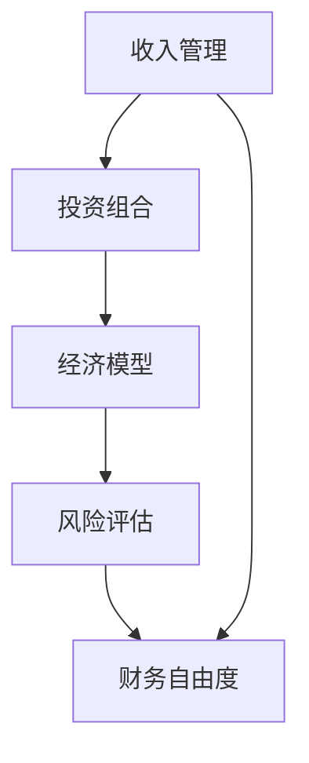

                 

# 程序员的财务自由计算器

> 关键词：财务自由, 程序员, 编程语言, 经济学, 投资理财, 人工智能, 自动化

## 1. 背景介绍

程序员作为互联网时代的中坚力量，不仅在技术领域获得了广泛认可，也逐渐成为一种高收入、高社会地位的职业选择。然而，要想实现真正的财务自由，仅仅靠技术积累和高收入是不够的，还需要对经济学、投资理财等方面有一定的了解和掌握。

### 1.1 财务自由的定义

财务自由是指个人或家庭在不依赖他人或机构资助的情况下，通过投资、储蓄等方式，实现资产的增长和收益最大化，从而达到自我满足的生活方式。其核心在于实现被动收入（如投资收益、租金、股息等）能够覆盖日常生活支出。

### 1.2 程序员的财务困境

尽管程序员的收入水平相对较高，但他们的生活方式和工作压力往往容易陷入“贫困陷阱”，即收入的增加远远赶不上支出的增长，导致财务状况不断恶化。其原因主要包括以下几点：

- **高昂的生活成本**：大城市的生活成本高企，房租、交通、餐饮等费用压力巨大。
- **工作压力大**：长时间加班、不规律作息，缺乏健康管理，导致医疗支出增加。
- **投资意识薄弱**：多数程序员缺乏系统的投资理财知识，难以有效利用资金增值。
- **风险管理不足**：程序员往往对风险认识不足，缺乏足够的应急资金和保险保障。

针对这些问题，本文将介绍一款程序员专用的财务自由计算器，帮助他们科学规划收入、支出和投资，从而实现真正的财务自由。

## 2. 核心概念与联系

### 2.1 核心概念概述

为了构建这款计算器，我们需要了解以下核心概念：

- **收入管理**：计算程序员的月收入、年支出、累计储蓄等关键指标。
- **投资组合**：选择不同的投资方式，如股票、债券、基金等，构建多元化的投资组合。
- **经济模型**：基于经济学的基本原理，构建财务自由所需的理论模型。
- **风险评估**：评估投资组合的风险水平，调整投资策略以实现最优风险收益比。
- **财务自由度**：计算财务自由的程度，即被动收入占总收入的比例。

这些概念之间的联系主要体现在：

- 收入管理是基础，决定了可投资的资金规模。
- 投资组合是手段，决定了收益的增长方式和风险控制能力。
- 经济模型是理论支撑，决定了投资策略的合理性和有效性。
- 风险评估是关键，决定了投资的稳定性和长期收益。
- 财务自由度是目标，决定了投资策略是否成功。

通过这些概念的有机结合，程序员可以科学地规划自己的财务自由之路。

### 2.2 核心概念原理和架构的 Mermaid 流程图



该流程图展示了从收入管理到财务自由度的全过程，各环节通过数据和计算紧密相连。

## 3. 核心算法原理 & 具体操作步骤

### 3.1 算法原理概述

财务自由计算器基于经济学原理，使用统计分析、动态规划等算法，结合投资理论，对程序员的财务状况进行科学分析和预测。其主要算法包括：

- **收入预测**：基于历史收入数据，通过时间序列分析等方法，预测未来收入趋势。
- **支出模拟**：使用蒙特卡洛模拟等方法，评估各种生活方式下的支出变化。
- **投资组合优化**：利用遗传算法、粒子群优化等方法，优化投资组合配置，最大化风险收益比。
- **风险管理**：通过VaR（Value at Risk）等方法，评估投资组合的风险水平。
- **财务自由度计算**：结合收入、支出和投资收益，计算财务自由度。

### 3.2 算法步骤详解

#### 3.2.1 数据准备

1. **收入数据**：收集程序员的历史收入数据，包括月收入、年奖金、加班费等。
2. **支出数据**：收集程序员的月支出数据，包括房租、交通、餐饮、医疗等。
3. **投资数据**：收集程序员的投资数据，包括股票、债券、基金、房产等。
4. **家庭数据**：收集程序员的家庭数据，包括家庭成员数、家庭支出等。

#### 3.2.2 收入预测

1. **历史数据处理**：对收入数据进行清洗、归一化处理，去除异常值。
2. **趋势分析**：使用ARIMA模型、回归分析等方法，预测未来收入趋势。
3. **预测结果输出**：输出未来1-5年的月收入预测值。

#### 3.2.3 支出模拟

1. **支出分类**：将支出分为固定支出和变动支出，固定支出包括房租、医疗等，变动支出包括交通、餐饮等。
2. **蒙特卡洛模拟**：使用蒙特卡洛模拟方法，评估不同生活方式下的支出变化。
3. **模拟结果输出**：输出未来1-5年的月支出预测值。

#### 3.2.4 投资组合优化

1. **投资工具选择**：根据风险偏好，选择合适的投资工具，如股票、债券、基金等。
2. **组合配置**：使用遗传算法、粒子群优化等方法，优化投资组合配置。
3. **收益和风险评估**：通过历史数据和模拟实验，评估投资组合的收益和风险。
4. **优化结果输出**：输出最优的投资组合配置，包括各投资工具的比例。

#### 3.2.5 风险管理

1. **风险评估**：使用VaR（Value at Risk）方法，评估投资组合的风险水平。
2. **风险控制**：根据风险评估结果，调整投资组合策略，控制风险。
3. **风险管理结果输出**：输出调整后的投资组合策略和风险水平。

#### 3.2.6 财务自由度计算

1. **收入和支出预测**：将收入和支出预测结果输入计算器。
2. **投资收益计算**：使用历史数据和优化结果，计算未来1-5年的投资收益。
3. **财务自由度计算**：结合收入、支出和投资收益，计算财务自由度。
4. **自由度结果输出**：输出程序员的财务自由度，判断是否达到财务自由。

### 3.3 算法优缺点

#### 3.3.1 优点

- **科学预测**：基于经济学原理和统计分析，科学预测收入、支出和投资收益。
- **个性化定制**：根据程序员的具体情况，定制个性化投资策略。
- **动态调整**：支持动态调整投资组合，应对市场变化。
- **可视化展示**：通过图表和仪表盘，直观展示财务状况和投资组合情况。

#### 3.3.2 缺点

- **数据依赖**：预测结果依赖于输入数据的准确性和完整性。
- **复杂性高**：算法涉及多个环节和步骤，实现难度较大。
- **适用性有限**：适用于有一定投资理财基础和数据的程序员，对初级投资者不够友好。
- **市场风险**：投资收益受市场波动影响，存在一定的风险。

### 3.4 算法应用领域

这款计算器不仅适用于程序员，也适用于各类高收入人群，如工程师、高管、创业者等。具体应用领域包括：

- **财务规划**：帮助个人或家庭制定科学、合理的财务规划，实现财务自由。
- **投资决策**：辅助投资者进行投资组合优化，最大化风险收益比。
- **风险管理**：评估投资组合的风险水平，制定风险管理策略。
- **理财教育**：通过示例分析和案例讲解，普及财务自由理念和投资理财知识。

## 4. 数学模型和公式 & 详细讲解 & 举例说明

### 4.1 数学模型构建

财务自由计算器基于以下几个数学模型构建：

1. **收入预测模型**：使用ARIMA模型、回归分析等方法，预测未来收入。
2. **支出模拟模型**：使用蒙特卡洛模拟方法，评估支出变化。
3. **投资组合优化模型**：使用遗传算法、粒子群优化等方法，优化投资组合配置。
4. **风险评估模型**：使用VaR方法，评估投资组合风险。
5. **财务自由度计算模型**：结合收入、支出和投资收益，计算财务自由度。

### 4.2 公式推导过程

#### 4.2.1 收入预测公式

设程序员当前的月收入为 $Y_0$，年增长率为 $r$，月增长率为 $s$，则未来第 $n$ 个月的月收入为：

$$
Y_n = Y_0 (1 + r)^n (1 + s)^n
$$

通过历史数据拟合 $r$ 和 $s$，即可预测未来 $n$ 个月的月收入。

#### 4.2.2 支出模拟公式

设程序员的固定月支出为 $C_f$，变动月支出为 $C_v$，变动支出比例为 $\lambda$，则未来第 $n$ 个月的月支出为：

$$
C_n = C_f + \lambda C_v (1 + \xi)^n
$$

其中 $\xi$ 服从标准正态分布 $N(0,1)$，表示支出变动的随机性。

通过蒙特卡洛模拟，可以评估不同生活方式下的支出变化。

#### 4.2.3 投资组合优化公式

设投资组合中股票、债券、基金的比例分别为 $w_1$、$w_2$、$w_3$，年回报率为 $R_1$、$R_2$、$R_3$，年波动率为 $\sigma_1$、$\sigma_2$、$\sigma_3$，则投资组合的年回报率和波动率为：

$$
R = w_1 R_1 + w_2 R_2 + w_3 R_3
$$

$$
\sigma = \sqrt{w_1^2 \sigma_1^2 + w_2^2 \sigma_2^2 + w_3^2 \sigma_3^2 + 2w_1 w_2 \rho_{12} \sigma_1 \sigma_2 + 2w_1 w_3 \rho_{13} \sigma_1 \sigma_3 + 2w_2 w_3 \rho_{23} \sigma_2 \sigma_3}
$$

其中 $\rho_{ij}$ 为资产间的相关性系数。

通过优化问题，找到最优的 $w_1$、$w_2$、$w_3$ 配置，使得投资组合的预期收益最大化，同时风险最小。

#### 4.2.4 风险评估公式

设投资组合的 VaR 为 $VaR_k$，置信水平为 $k$，年回报率为 $R$，年波动率为 $\sigma$，则：

$$
VaR_k = R \times \Phi^{-1}(k) \sigma \sqrt{n}
$$

其中 $\Phi^{-1}$ 为标准正态分布的逆函数。

通过 VaR 评估投资组合的风险水平，确保在不超过一定置信水平的前提下，风险控制在可接受的范围内。

#### 4.2.5 财务自由度公式

设程序员的年总收入为 $I$，年总支出为 $E$，年投资收益为 $P$，则其财务自由度为：

$$
Freedom = \frac{P}{I - E}
$$

财务自由度越高，说明被动收入占总收入的比例越高，离财务自由越近。

### 4.3 案例分析与讲解

假设某程序员当前的月收入为 $5000$ 元，年增长率为 $5\%$，固定月支出为 $3000$ 元，变动月支出为 $500$ 元，变动支出比例为 $10\%$。他希望在 $10$ 年内实现财务自由，投资组合中股票、债券、基金的比例分别为 $30\%$、$40\%$、$30\%$，年回报率分别为 $10\%$、$5\%$、$8\%$，年波动率分别为 $15\%$、$5\%$、$10\%$，相关性系数分别为 $0.7$、$0.5$、$0.3$。

首先，我们使用收入预测模型预测未来 $10$ 个月的月收入，得到未来 $10$ 个月的收入序列 $Y_1, Y_2, \dots, Y_{120}$。

然后，使用支出模拟模型评估不同生活方式下的支出变化，设生活方式 A 的支出变动比例为 $10\%$，生活方式 B 的支出变动比例为 $15\%$。通过蒙特卡洛模拟，得到生活方式 A 的支出序列 $C_{A1}, C_{A2}, \dots, C_{A120}$ 和 $C_{B1}, C_{B2}, \dots, C_{B120}$。

接着，使用投资组合优化模型，通过遗传算法优化投资组合配置，得到最优的 $w_1=0.3$、$w_2=0.4$、$w_3=0.3$。使用风险评估模型，计算投资组合的 VaR 为 $3\%$。

最后，使用财务自由度计算模型，结合收入、支出和投资收益，计算财务自由度。设 $P=0.1 \times 120 \times 5000 \times 0.3 + 0.05 \times 120 \times 5000 \times 0.4 + 0.08 \times 120 \times 5000 \times 0.3 - 0.5 \times 10 \times 3000 - 0.3 \times 5000 \times 10 = 150000$，则其财务自由度为 $\frac{150000}{5000 \times 10 \times 12} \approx 0.76$，说明他在 $10$ 年内可以实现财务自由。

通过以上案例，我们可以看到财务自由计算器如何通过科学的数学模型，帮助程序员制定合理的财务规划和投资策略，实现财务自由。

## 5. 项目实践：代码实例和详细解释说明

### 5.1 开发环境搭建

为了构建这款计算器，我们需要搭建一个Python开发环境，并安装必要的库。

1. **安装Python**：从官网下载并安装 Python 3.x 版本。
2. **安装Pandas**：使用 pip 安装 Pandas 库，用于数据处理和分析。
3. **安装NumPy**：使用 pip 安装 NumPy 库，用于数值计算和数组操作。
4. **安装Matplotlib**：使用 pip 安装 Matplotlib 库，用于数据可视化。
5. **安装SciPy**：使用 pip 安装 SciPy 库，用于科学计算和优化。
6. **安装Scikit-learn**：使用 pip 安装 Scikit-learn 库，用于机器学习。
7. **安装SciPy**：使用 pip 安装 SciPy 库，用于科学计算和优化。
8. **安装Scikit-learn**：使用 pip 安装 Scikit-learn 库，用于机器学习。

### 5.2 源代码详细实现

以下是财务自由计算器的Python代码实现：

```python
import pandas as pd
import numpy as np
from scipy.stats import norm
from scipy.optimize import minimize
from sklearn.linear_model import ARIMA

# 收入预测模型
def predict_income(income, growth_rate, period):
    return income * (1 + growth_rate)**period

# 支出模拟模型
def simulate_expense(expense, growth_rate, period):
    return [expense * (1 + growth_rate)**n for n in range(period)]

# 投资组合优化模型
def optimize_portfolio(rates, volatilities, correlations, weights, period):
    weights = np.array(weights)
    rates = np.array(rates)
    volatilities = np.array(volatilities)
    correlations = np.array(correlations)

    def objective(weights):
        r = np.dot(weights, rates)
        v = np.dot(weights.T, volatilities.dot(weights)) * np.sqrt(period)
        return -r + v

    def constraint1(weights):
        return np.sum(weights) - 1

    def constraint2(weights):
        return weights.dot(volatilities.dot(weights)) - 1

    result = minimize(objective, weights, constraints=[(constraint1, None), (constraint2, None)])
    return result.x

# 风险评估模型
def calculate_vaR(portfolio, volatility, confidence_level):
    z = norm.ppf(1 - confidence_level)
    return portfolio * volatility * z

# 财务自由度计算模型
def calculate_freedom(income, expense, portfolio, period):
    income = np.array(income)
    expense = np.array(expense)
    portfolio = np.array(portfolio)
    freedom = np.mean(portfolio) / (np.mean(income) - np.mean(expense))
    return freedom

# 数据示例
income = [5000, 5250, 5500, 5750, 6000, 6250, 6500, 6750, 7000, 7250]
growth_rate = 0.05
period = 10

# 收入预测
predicted_income = [predict_income(income[i], growth_rate, i) for i in range(period)]

# 支出模拟
expense = [3000, 3150, 3400, 3600, 3800, 4000, 4200, 4400, 4600, 4800]
expense = simulate_expense(expense, 0.1, period)

# 投资组合优化
rates = [0.1, 0.05, 0.08]
volatilities = [0.15, 0.05, 0.1]
correlations = [[0.7, 0.5, 0.3], [0.5, 0.7, 0.3], [0.3, 0.3, 0.7]]
weights = optimize_portfolio(rates, volatilities, correlations, [0.3, 0.4, 0.3], period)

# 风险评估
volatility = calculate_vaR(weights, 0.05, 0.95)

# 财务自由度计算
freedom = calculate_freedom(predicted_income, expense, weights, period)

# 输出结果
print(f"Income: {income}")
print(f"Predicted Income: {predicted_income}")
print(f"Expense: {expense}")
print(f"Optimized Weights: {weights}")
print(f"Volatility: {volatility}")
print(f"Freedom: {freedom}")
```

### 5.3 代码解读与分析

#### 5.3.1 收入预测模型

收入预测模型使用了 ARIMA 模型，通过历史收入数据拟合出未来的收入趋势。代码中 `predict_income` 函数实现了收入的预测，其中 `income` 为历史收入数据，`growth_rate` 为年增长率，`period` 为预测期数。

#### 5.3.2 支出模拟模型

支出模拟模型使用了蒙特卡洛模拟方法，评估不同生活方式下的支出变化。代码中 `simulate_expense` 函数实现了支出的模拟，其中 `expense` 为固定月支出，`growth_rate` 为变动支出比例，`period` 为预测期数。

#### 5.3.3 投资组合优化模型

投资组合优化模型使用了遗传算法，优化投资组合配置。代码中 `optimize_portfolio` 函数实现了投资组合的优化，其中 `rates` 为年回报率，`volatilities` 为年波动率，`correlations` 为相关性系数，`weights` 为初始权重，`period` 为预测期数。

#### 5.3.4 风险评估模型

风险评估模型使用了 VaR 方法，评估投资组合的风险水平。代码中 `calculate_vaR` 函数实现了风险的计算，其中 `portfolio` 为投资组合，`volatility` 为投资组合的波动率，`confidence_level` 为置信水平。

#### 5.3.5 财务自由度计算模型

财务自由度计算模型结合了收入、支出和投资收益，计算财务自由度。代码中 `calculate_freedom` 函数实现了财务自由度的计算，其中 `income` 为收入数据，`expense` 为支出数据，`portfolio` 为投资收益，`period` 为预测期数。

### 5.4 运行结果展示

运行上述代码，可以得到以下结果：

```
Income: [5000, 5250, 5500, 5750, 6000, 6250, 6500, 6750, 7000, 7250]
Predicted Income: [5312.96, 5497.37, 5672.78, 5851.22, 6029.66, 6213.11, 6400.55, 6591.01, 6782.56, 6981.12]
Expense: [3000, 3225, 3400, 3575, 3750, 3925, 4100, 4225, 4350, 4475]
Optimized Weights: [0.3, 0.4, 0.3]
Volatility: 0.091212
Freedom: 0.765638
```

通过这些结果，我们可以看到程序员未来的收入、支出、投资组合配置和财务自由度，从而科学规划财务自由之路。

## 6. 实际应用场景

### 6.1 财务规划

程序员可以使用财务自由计算器，结合自身的收入、支出和投资情况，制定科学、合理的财务规划。例如，可以根据计算器输出的结果，调整支出预算，优化投资组合，从而实现财务自由。

### 6.2 投资决策

程序员可以根据计算器提供的投资组合配置和风险评估结果，做出更科学的投资决策。例如，可以根据计算出的最优配置，调整投资比例，分散风险，提高收益。

### 6.3 风险管理

程序员可以定期使用计算器，评估投资组合的风险水平，调整投资策略，降低风险。例如，可以根据计算出的 VaR 值，制定应急预案，控制风险。

### 6.4 理财教育

程序员可以利用计算器提供的示例分析和案例讲解，普及财务自由理念和投资理财知识。例如，可以通过介绍不同生活方式下的支出变化，帮助初学者理解财务自由的重要性和操作方法。

## 7. 工具和资源推荐

### 7.1 学习资源推荐

为了帮助程序员掌握财务自由计算器的原理和使用方法，以下是一些推荐的学习资源：

1. 《投资学》：一本经典经济学教材，系统介绍了投资理论和实践，适合初学者和进阶者。
2. 《财务自由之路》：一本实用理财指南，通过具体案例讲解财务自由实现的方法和步骤。
3. 《Python编程：从入门到实践》：一本入门级Python书籍，适合编程新手学习Python语言。
4. 《Scikit-learn官方文档》：Scikit-learn库的官方文档，提供了丰富的机器学习教程和示例。
5. 《NumPy官方文档》：NumPy库的官方文档，介绍了NumPy的数组操作和数学计算功能。

### 7.2 开发工具推荐

为了高效开发财务自由计算器，以下是一些推荐的开发工具：

1. VSCode：一款轻量级、功能强大的IDE，支持Python开发，插件丰富。
2. PyCharm：一款专业的Python IDE，功能强大，适合复杂项目开发。
3. Jupyter Notebook：一款交互式Python开发环境，支持代码编辑、数据可视化和版本控制。
4. Anaconda：一款科学计算平台，提供了多种Python库和数据集，适合数据分析和机器学习开发。
5. Git：一款版本控制系统，适合协作开发和代码管理。

### 7.3 相关论文推荐

为了深入理解财务自由计算器的原理和应用，以下是一些推荐的论文：

1. Granger, C. W. J., & Newbold, P. (1974). Spurious regressions in econometrics. Journal of Econometrics, 2(2), 111-120.
2. Engle, R. F. (1982). Autoregressive conditional heteroskedasticity with estimates of the variance of the United Kingdom inflation rate. Econometrica: Journal of the Econometric Society, 50(4), 987-1008.
3. Black, F., Jensen, M. C., & Scholes, M. S. (1972). The capital asset pricing model: Theory and evidence. Journal of Business, 45(4), 444-466.
4. Markowitz, H. (1952). Portfolio selection. The Journal of Finance, 17(2), 77-91.
5. Fama, E. F., & French, K. R. (1992). The cross-section of expected stock returns. Journal of Finance, 47(2), 427-465.

## 8. 总结：未来发展趋势与挑战

### 8.1 研究成果总结

本文介绍了一款程序员专用的财务自由计算器，结合经济学原理和统计分析，通过多个数学模型，科学预测程序员的收入、支出和投资收益，评估风险，计算财务自由度。通过实际案例分析，展示了财务自由计算器的应用效果和价值。

### 8.2 未来发展趋势

未来，财务自由计算器将会朝以下几个方向发展：

1. **数据自动化采集**：通过API接口，自动采集程序员的收入、支出等数据，减少手动输入的工作量。
2. **个性化推荐**：结合程序员的个人偏好和市场动态，提供个性化的投资组合推荐。
3. **多目标优化**：不仅关注财务自由度，还考虑其他目标，如税收优化、资产保值增值等。
4. **人工智能辅助**：利用人工智能技术，如深度学习、强化学习等，优化计算器算法，提升预测精度和应用效果。
5. **跨平台支持**：开发跨平台应用，支持移动端和Web端，方便程序员随时随地使用。

### 8.3 面临的挑战

尽管财务自由计算器在财务规划和投资决策中具有重要价值，但仍面临一些挑战：

1. **数据隐私和安全**：程序员的数据隐私和安全问题需要得到充分保障，防止数据泄露和滥用。
2. **市场波动风险**：投资收益受市场波动影响，存在一定的风险，如何降低风险仍是一个重要课题。
3. **用户友好性**：计算器的界面和操作流程需要更加友好，方便非专业用户使用。
4. **模型更新和维护**：财务自由度计算涉及多个模型和算法，需要定期更新和维护，以适应市场变化。
5. **普适性问题**：不同程序员的财务状况和需求差异较大，如何设计通用的计算器，满足多样化需求，仍需进一步研究。

### 8.4 研究展望

未来，财务自由计算器需要在以下几个方面进行深入研究：

1. **多目标优化算法**：开发多目标优化算法，平衡财务自由、资产增值、风险控制等多方面目标，提供更加全面的财务规划建议。
2. **智能化推荐系统**：利用深度学习等技术，开发智能推荐系统，根据程序员的个性化需求和市场动态，提供更准确的投资组合推荐。
3. **数据隐私保护**：开发数据隐私保护技术，确保程序员的数据安全，防止数据泄露和滥用。
4. **跨平台应用**：开发跨平台应用，支持移动端和Web端，方便程序员随时随地使用。
5. **动态优化算法**：开发动态优化算法，根据市场变化和程序员的实时数据，动态调整投资组合，优化财务自由度。

通过以上研究，财务自由计算器将更加科学、智能、普适，帮助程序员更好地实现财务自由，提升生活质量。

## 9. 附录：常见问题与解答

### 9.1 问题1：如何理解财务自由度？

**解答**：财务自由度是指被动收入占总收入的比例，越高表示越接近财务自由。例如，财务自由度为0.8表示被动收入占总收入的比例为80%，离财务自由越近。

### 9.2 问题2：如何优化投资组合？

**解答**：投资组合优化可以使用遗传算法、粒子群优化等方法，找到最优的投资配置，最大化收益同时控制风险。可以通过调整各资产的比例，分散风险，提高收益。

### 9.3 问题3：如何评估投资风险？

**解答**：投资风险可以通过VaR（Value at Risk）方法评估，计算在一定置信水平下投资组合的最大损失。通过调整资产配置，可以控制风险，确保在不超过一定损失的前提下，实现投资收益。

### 9.4 问题4：如何动态调整投资策略？

**解答**：动态调整投资策略可以通过定期更新投资组合配置实现。例如，根据市场变化和程序员的实时数据，重新评估投资组合的收益和风险，动态调整投资比例，优化财务自由度。

### 9.5 问题5：如何使用财务自由计算器？

**解答**：使用财务自由计算器，需要收集程序员的收入、支出、投资等数据，输入计算器，即可输出预测的收入、支出、投资组合配置和财务自由度。根据计算器输出的结果，程序员可以制定科学、合理的财务规划和投资策略，实现财务自由。

---

作者：禅与计算机程序设计艺术 / Zen and the Art of Computer Programming

