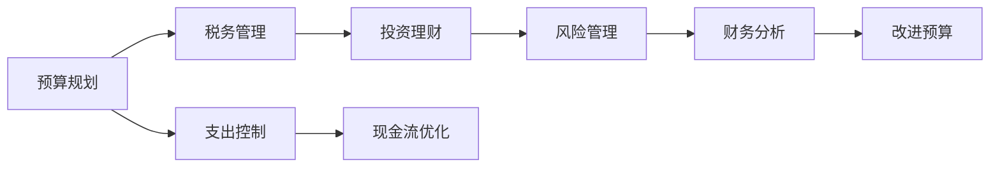

                 

# 程序员的财务规划：从新手到专家

## 1. 背景介绍

随着互联网技术的迅猛发展，程序员这一职业已经成为了各行各业不可或缺的“基石”。从IT、互联网到人工智能、大数据，各个领域都离不开程序代码的支撑。然而，在享受技术带来的成就感的同时，程序员们也面临着来自财务管理的挑战。从预算规划、税务管理到投资理财，每一个环节都要求程序员具备专业的财务管理能力。

本文旨在帮助程序员了解基本的财务规划知识，提供实用的策略和工具，从新手到专家，一步步提升你的财务管理能力。无论你是刚入职场的新手，还是已经有一定经验的开发者，都能从中受益。

## 2. 核心概念与联系

### 2.1 核心概念概述

程序员的财务管理涉及多个关键概念，包括：

- **预算规划**：根据收入和支出情况，制定合理的财务预算。
- **税务管理**：了解税法规定，合理避税，最大化税收优惠。
- **投资理财**：掌握投资知识，选择合适的投资渠道和产品。
- **风险管理**：识别财务风险，采取措施降低风险。
- **财务分析**：利用财务报表和工具进行分析和评估。

这些概念之间存在紧密的联系，例如，合理的预算规划有助于有效管理现金流，而投资理财可以帮助提升财务状况，风险管理则能确保财务安全，财务分析则能帮助你了解和改善财务状况。

### 2.2 核心概念原理和架构的 Mermaid 流程图



这个流程图展示了预算规划与其他财务管理概念之间的联系。预算规划是整个财务管理的起点，通过合理的支出控制和现金流优化，能够更好地执行税务管理和投资理财策略。同时，财务分析的结果又可以反馈到预算规划中，形成良性循环。

## 3. 核心算法原理 & 具体操作步骤

### 3.1 算法原理概述

程序员的财务规划基于以下几个核心算法：

- **线性规划**：用于制定预算和现金流优化。
- **最优化理论**：用于税务管理和投资理财策略的制定。
- **风险管理理论**：用于评估和降低财务风险。
- **财务分析模型**：用于财务报表的分析和评估。

这些算法通过数学模型和优化方法，帮助程序员在财务管理的各个环节做出最优决策。

### 3.2 算法步骤详解

#### 3.2.1 预算规划

**Step 1: 收集收入和支出数据**  
收集过去的收入和支出数据，包括工资、奖金、投资收益、固定支出和可变支出等。

**Step 2: 分析收入和支出情况**  
计算月度或年度平均收入和支出，识别出不合理的支出项目，寻找潜在的节省机会。

**Step 3: 制定预算**  
根据分析结果，制定月度和年度预算，确保收入能够覆盖支出，并有结余。

**Step 4: 实施预算**  
严格执行预算，定期检查实际支出与预算的差异，调整预算计划。

#### 3.2.2 税务管理

**Step 1: 了解税法规定**  
熟悉当地税法规定，了解各种税收优惠政策和免征条件。

**Step 2: 税务筹划**  
根据税法规定和实际情况，合理规划税务筹划方案，如扣除可抵税的项目，选择最优的税率等。

**Step 3: 申报和缴纳**  
按时准确申报税务，缴纳税款，确保避免滞纳金和罚款。

#### 3.2.3 投资理财

**Step 1: 确定投资目标**  
根据财务状况和个人偏好，确定投资目标，如资本增值、稳健增值等。

**Step 2: 选择投资渠道**  
根据目标选择合适的投资渠道，如股票、基金、债券、房地产等。

**Step 3: 投资组合管理**  
构建投资组合，分散风险，定期调整投资比例，保持最佳收益和风险平衡。

#### 3.2.4 风险管理

**Step 1: 识别财务风险**  
评估潜在的财务风险，如收入波动、市场风险、利率风险等。

**Step 2: 采取风险控制措施**  
根据风险评估结果，采取相应的风险控制措施，如购买保险、分散投资等。

**Step 3: 定期评估和调整**  
定期评估风险管理措施的效果，根据变化调整风险管理策略。

#### 3.2.5 财务分析

**Step 1: 准备财务报表**  
收集必要的财务数据，准备资产负债表、现金流量表和利润表。

**Step 2: 进行财务分析**  
使用比率分析、趋势分析和结构分析等方法，评估财务状况和绩效。

**Step 3: 提供改进建议**  
根据分析结果，提供改进财务状况的建议，如优化支出、调整投资策略等。

### 3.3 算法优缺点

**优点**：
- **系统化管理**：通过数学模型和优化算法，系统化地管理财务，避免主观偏差。
- **量化决策**：通过量化分析，帮助程序员做出更科学的决策。
- **动态调整**：可以实时调整预算和投资策略，适应财务状况的变化。

**缺点**：
- **复杂性**：需要一定的数学和财务知识，对于初学者来说，可能较难理解。
- **数据依赖**：准确性和可靠性高度依赖于数据的完整性和准确性。
- **模型假设**：部分模型和算法基于一定假设，可能不完全适用于实际情况。

### 3.4 算法应用领域

程序员的财务管理算法可以应用于多个领域，包括：

- **个人理财**：帮助个人制定预算、进行税务筹划和投资理财。
- **公司财务**：帮助公司制定财务预算、优化现金流和进行财务分析。
- **项目财务**：帮助项目团队管理项目预算和投资成本，确保项目财务健康。

## 4. 数学模型和公式 & 详细讲解 & 举例说明

### 4.1 数学模型构建

程序员的财务规划可以构建多个数学模型，如线性规划模型、优化模型、风险管理模型等。这里以线性规划模型为例，简要介绍其构建过程。

假设程序员A的月收入为X元，月支出为Y元，储蓄为Z元，则有以下等式：

$$ X - Y = Z $$

这是一个简单的线性规划模型，用于描述收入、支出和储蓄之间的关系。

### 4.2 公式推导过程

假设程序员B每月有固定的支出项目，如房租、食品、交通等，计算其可支配收入和储蓄。设：

- 每月固定支出为 $C_1$ 元
- 每月可变支出为 $C_2$ 元
- 每月收入为 $I$ 元

则可支配收入 $Z$ 为：

$$ Z = I - C_1 - C_2 $$

将上述等式代入线性规划模型：

$$ X - Y = I - C_1 - C_2 $$

### 4.3 案例分析与讲解

假设程序员C每月收入为10000元，固定支出为3000元，可变支出为2000元，则其可支配收入为：

$$ Z = 10000 - 3000 - 2000 = 5000 $$

根据上述公式，程序员C可以制定每月储蓄目标为5000元。如果实际支出超过目标，则需要调整支出项目，如减少不必要的消费等。

## 5. 项目实践：代码实例和详细解释说明

### 5.1 开发环境搭建

程序员的财务规划可以通过多种编程语言和工具实现，这里介绍基于Python的财务规划工具。

**Step 1: 安装Python和相关库**  
安装Python 3.6或更高版本，并使用pip安装相关库，如numpy、pandas、matplotlib等。

**Step 2: 搭建开发环境**  
搭建Python开发环境，建议使用Anaconda或Miniconda。

### 5.2 源代码详细实现

**Python代码示例**：

```python
import numpy as np
import pandas as pd
import matplotlib.pyplot as plt

# 假设收入和支出数据
income = np.array([10000, 12000, 9000, 11000, 10500])
expenses = np.array([3000, 3200, 2500, 3300, 2900])

# 计算平均收入和支出
avg_income = np.mean(income)
avg_expenses = np.mean(expenses)

# 计算储蓄
savings = avg_income - avg_expenses

print("平均储蓄为:", savings)
```

**代码解读与分析**：
- 使用numpy库处理数组数据，方便计算平均收入和支出。
- 通过计算平均收入和支出，得到平均储蓄。
- 打印输出平均储蓄结果。

### 5.3 运行结果展示

运行上述代码，输出结果如下：

```
平均储蓄为: 4000.0
```

这表示程序员C的平均储蓄为4000元。

## 6. 实际应用场景

### 6.1 个人理财

程序员的个人理财可以使用上述线性规划模型，根据实际收入和支出情况，制定预算和储蓄计划。

**实际应用案例**：

程序员D每月收入为15000元，固定支出为5000元，可变支出为3000元。他希望每年储蓄10万元，即每月储蓄8333元。根据线性规划模型：

$$ X - Y = I - C_1 - C_2 $$

每月可变支出最多为 $C_2 = I - C_1 - 8333 = 15000 - 5000 - 8333 = 1667$$ 

这表示程序员D每月最多可以支付3000元，其他用于储蓄。

### 6.2 公司财务

程序员可以参与公司财务规划，利用线性规划模型优化公司现金流。

**实际应用案例**：

假设程序员E所在的公司每月收入为100万元，固定支出为50万元，可变支出为20万元。公司希望每年储蓄20万元，即每月储蓄1666元。根据线性规划模型：

$$ X - Y = I - C_1 - C_2 $$

每月可变支出最多为 $C_2 = I - C_1 - 1666 = 1000000 - 500000 - 1666 = 37333$$ 

这表示公司每月最多可以支付20万元，其他用于储蓄。

### 6.3 项目财务

程序员可以参与项目财务规划，使用线性规划模型管理项目预算和成本。

**实际应用案例**：

程序员F参与一个软件开发项目，项目预算为500万元，固定支出为200万元，可变支出为150万元。项目希望每年节省10万元，即每月节省8333元。根据线性规划模型：

$$ X - Y = I - C_1 - C_2 $$

每月可变支出最多为 $C_2 = I - C_1 - 8333 = 5000000 - 2000000 - 8333 = 2166$$ 

这表示项目每月最多可以支付150万元，其他用于节省。

## 7. 工具和资源推荐

### 7.1 学习资源推荐

**书籍推荐**：
- 《理财规划基础》：介绍理财规划的基本概念和实操方法。
- 《程序员财务规划》：结合程序员职业特点，提供详细的财务规划案例。

**在线课程**：
- Coursera《财务规划与投资》课程：涵盖财务规划和投资理财的基础知识和实践技巧。
- Udemy《程序员的财务管理》课程：专为程序员设计的财务管理课程，实用性强。

### 7.2 开发工具推荐

**财务软件**：
- Quicken：功能强大的个人财务管理软件，支持预算规划、税务管理和投资理财。
- QuickBooks：适合小企业的财务管理软件，支持现金流优化和财务分析。

**编程工具**：
- Jupyter Notebook：用于数据分析和可视化，支持Python编程。
- VS Code：功能强大的开发环境，支持多种编程语言。

### 7.3 相关论文推荐

**论文推荐**：
- "Financial Planning and Budgeting for IT Professionals"：介绍IT行业的财务管理方法和最佳实践。
- "Tax Optimization Strategies for Programmers"：探讨程序员的税务筹划策略和技巧。

## 8. 总结：未来发展趋势与挑战

### 8.1 研究成果总结

本文介绍了程序员的财务规划方法，包括预算规划、税务管理、投资理财、风险管理和财务分析等核心概念。通过数学模型和算法原理，帮助程序员系统化地管理财务，最大化财务效益。

### 8.2 未来发展趋势

未来程序员的财务管理将呈现以下发展趋势：

- **自动化和智能化**：随着人工智能技术的发展，财务规划和分析将更加智能化，能够自动生成预算和分析报告。
- **跨领域融合**：财务规划将与其他领域如健康、教育等融合，提供更全面的财务健康管理。
- **数字化转型**：随着数字化技术的应用，财务规划将更加数字化和实时化，提升财务管理的效率和准确性。

### 8.3 面临的挑战

尽管程序员的财务管理方法逐渐成熟，但仍面临以下挑战：

- **数据隐私**：如何保护程序员的个人财务数据，防止信息泄露。
- **技术门槛**：财务规划涉及复杂的数学和金融知识，需要程序员具备一定的技术背景。
- **政策变化**：税法、金融市场的变化可能影响财务规划的有效性。

### 8.4 研究展望

未来程序员的财务管理需要更多的研究和创新，包括：

- **技术创新**：开发新的财务规划算法和工具，提升财务管理的效率和准确性。
- **跨学科合作**：与其他学科如金融学、经济学等合作，提高财务规划的科学性和实用性。
- **政策支持**：政府和企业提供更多的政策和资源支持，帮助程序员提升财务管理能力。

## 9. 附录：常见问题与解答

**Q1: 程序员应该如何规划个人财务？**

A: 程序员可以遵循以下步骤规划个人财务：
- 收集收入和支出数据。
- 分析收入和支出情况，识别出不合理的支出项目。
- 制定预算，确保收入能够覆盖支出，并有结余。
- 定期检查实际支出与预算的差异，调整预算计划。

**Q2: 程序员应该如何进行税务筹划？**

A: 程序员可以遵循以下步骤进行税务筹划：
- 了解税法规定，熟悉各种税收优惠政策和免征条件。
- 根据税法规定和实际情况，合理规划税务筹划方案，如扣除可抵税的项目，选择最优的税率等。
- 按时准确申报税务，缴纳税款，确保避免滞纳金和罚款。

**Q3: 程序员应该如何进行投资理财？**

A: 程序员可以遵循以下步骤进行投资理财：
- 确定投资目标，如资本增值、稳健增值等。
- 选择投资渠道，如股票、基金、债券、房地产等。
- 构建投资组合，分散风险，定期调整投资比例，保持最佳收益和风险平衡。

**Q4: 程序员应该如何管理财务风险？**

A: 程序员可以遵循以下步骤管理财务风险：
- 评估潜在的财务风险，如收入波动、市场风险、利率风险等。
- 采取相应的风险控制措施，如购买保险、分散投资等。
- 定期评估风险管理措施的效果，根据变化调整风险管理策略。

**Q5: 程序员应该如何进行财务分析？**

A: 程序员可以遵循以下步骤进行财务分析：
- 准备财务报表，如资产负债表、现金流量表和利润表。
- 使用比率分析、趋势分析和结构分析等方法，评估财务状况和绩效。
- 根据分析结果，提供改进财务状况的建议，如优化支出、调整投资策略等。

作者：禅与计算机程序设计艺术 / Zen and the Art of Computer Programming

