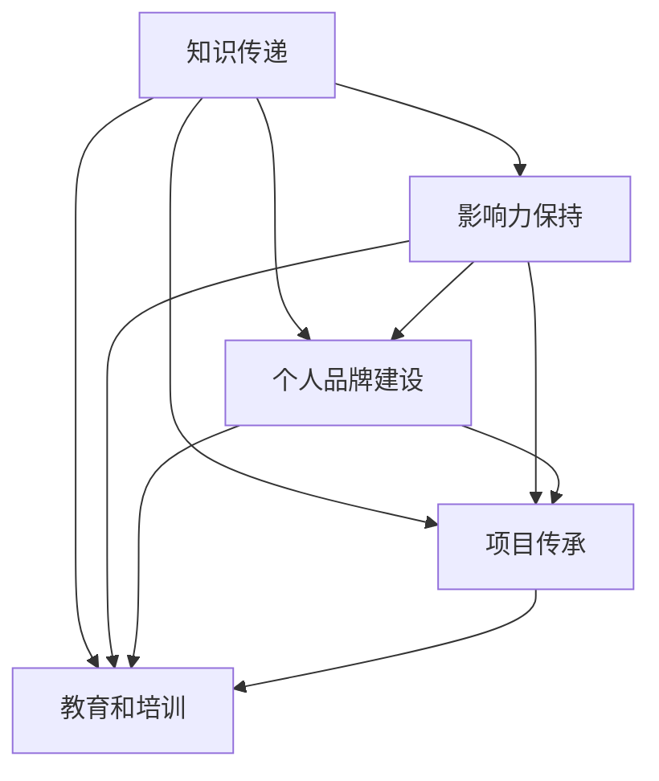

                 

# 程序员的退休生活：从赚钱到传承的思考

随着科技的快速发展，程序员这个职业已经成为了许多人追求的目标。他们通过编写代码、开发软件、设计系统等方式，为社会创造价值，并获得丰厚的回报。然而，随着时间的流逝，这些技术精英们也终究要面对退休这一现实问题。如何在退休后继续保持对技术的热情和影响力，将宝贵的知识和经验传承下去，成为他们必须面对的重要课题。

## 1. 背景介绍

### 1.1 问题由来

随着科技的快速发展，程序员这个职业已经成为了许多人追求的目标。他们通过编写代码、开发软件、设计系统等方式，为社会创造价值，并获得丰厚的回报。然而，随着时间的流逝，这些技术精英们也终究要面对退休这一现实问题。如何在退休后继续保持对技术的热情和影响力，将宝贵的知识和经验传承下去，成为他们必须面对的重要课题。

### 1.2 问题核心关键点

程序员退休后，如何保持对技术的热情和影响力，将宝贵的知识和经验传承下去，成为他们必须面对的重要课题。

1. **知识传递**：如何将技术知识和经验传递给新一代程序员，避免知识的断层。
2. **影响力保持**：如何在退休后继续保持对技术社区的影响力，活跃在技术讨论和开发中。
3. **个人品牌建设**：如何构建个人品牌，使自己在技术界保持知名度和认可度。
4. **项目传承**：如何将自己在职业生涯中开发的项目和系统传承下去，继续发挥价值。
5. **教育和培训**：如何参与或推动教育和培训活动，培养新一代技术人才。

## 2. 核心概念与联系

### 2.1 核心概念概述

为更好地理解程序员退休生活以及如何传承技术知识，本节将介绍几个密切相关的核心概念：

- **知识传递**：通过各种方式，如编写书籍、发表博客、开设课程等，将自己的技术知识和经验传递给新一代程序员。
- **影响力保持**：通过参加技术会议、撰写技术文章、在社交媒体上分享技术见解等方式，保持对技术社区的影响力。
- **个人品牌建设**：通过发布高质量的技术内容、参与开源项目、建立个人网站等方式，构建个人品牌，提升知名度和认可度。
- **项目传承**：将自己的项目源代码、设计文档、开发经验等保存和记录下来，供未来参考和学习。
- **教育和培训**：通过参与或推动教育机构和培训活动，培养新一代技术人才，传递自己的知识和经验。

这些核心概念之间的逻辑关系可以通过以下Mermaid流程图来展示：



这个流程图展示了几大核心概念之间的相互关系：

1. 知识传递是基础，只有将知识传递出去，才能保持影响力、建设品牌、传承项目和参与教育。
2. 影响力保持可以帮助知识传递，提升个人品牌和项目的知名度。
3. 个人品牌建设有助于影响力保持，提升个人和项目的认可度。
4. 项目传承需要知识传递和影响力保持作为支撑，确保项目的长期价值。
5. 教育和培训是知识传递的重要手段，培养新一代技术人才。

这些核心概念共同构成了程序员退休后继续保持对技术热情和影响力、传承技术知识的全方位框架。

## 3. 核心算法原理 & 具体操作步骤

### 3.1 算法原理概述

退休程序员的知识传承和影响力保持，本质上是一个知识管理的系统工程。其核心思想是：通过多种渠道，将自己的技术知识和经验系统化、结构化地传递出去，同时保持对技术社区的活跃参与，构建个人品牌，实现项目的长期价值，并通过教育和培训活动，培养新一代技术人才。

形式化地，假设退休程序员的技术知识和经验为 $K$，影响力为 $I$，个人品牌价值为 $B$，项目价值为 $P$，教育培训价值为 $E$。退休后保持技术热情和影响力的目标函数为：

$$
\max_{K,I,B,P,E} F(K,I,B,P,E)
$$

其中 $F$ 为综合评价函数，衡量各个因素的综合影响。

### 3.2 算法步骤详解

退休程序员的知识传承和影响力保持，一般包括以下几个关键步骤：

**Step 1: 整理技术知识和经验**

- 系统化整理自己在职业生涯中的技术知识，包括编程语言、开发工具、设计模式、项目经验等。
- 将技术知识整理成文档、代码库、博客文章等形式，方便他人学习和参考。

**Step 2: 选择合适的传播渠道**

- 根据目标受众选择合适的传播渠道，如技术博客、开源社区、技术会议、在线课程等。
- 在多个渠道同时发布和更新，扩大传播范围和影响力。

**Step 3: 保持技术社区的活跃参与**

- 定期参加技术会议、研讨会、技术沙龙等活动，分享自己的技术见解和经验。
- 在社交媒体上活跃发言，参与技术讨论，建立自己的技术声誉。

**Step 4: 构建个人品牌**

- 建立个人网站或博客，定期发布高质量的技术文章，分享自己的技术见解。
- 参与开源项目，贡献代码和文档，建立技术社区中的品牌形象。
- 发布技术书籍或编写技术文章，系统地传授自己的技术知识。

**Step 5: 传承项目和系统**

- 将自己在职业生涯中开发的项目和系统进行记录和保存，提供开源版本。
- 编写项目文档和开发手册，详细说明项目的设计思路和实现细节。
- 将项目中的关键技术和设计模式进行提炼和总结，分享给技术社区。

**Step 6: 参与教育和培训**

- 参与或推动教育机构和培训活动，传授自己的技术知识和经验。
- 开设技术讲座或课程，培养新一代技术人才。
- 参与开源社区的培训活动，帮助新手解决技术问题。

以上是退休程序员知识传承和影响力保持的一般流程。在实际应用中，还需要根据个人情况和资源条件，灵活调整各个环节的策略和力度，以实现最优的效果。

### 3.3 算法优缺点

退休程序员的知识传承和影响力保持，具有以下优点：

1. **系统化传承**：通过系统化整理和结构化传递技术知识，避免知识断层，确保技术的持续发展。
2. **广泛传播**：多种渠道同时发布，能够扩大传播范围，提升影响力。
3. **个人品牌建设**：通过技术博客、开源项目等方式，建立个人品牌，提升知名度和认可度。
4. **项目传承**：通过记录和保存项目文档、代码库，确保项目的长期价值和可复用性。
5. **教育培训**：参与或推动教育机构和培训活动，培养新一代技术人才，实现技术的长期传承。

同时，该方法也存在一定的局限性：

1. **时间和精力成本高**：整理知识、选择渠道、保持活跃都需要大量时间和精力。
2. **资源依赖**：需要一定的技术资源和平台支持，如编写书籍、开设课程等。
3. **个人品牌风险**：在公共平台上发布技术内容，需要谨慎考虑内容的真实性和准确性，避免误导他人。
4. **项目传承难度**：某些复杂项目难以记录和传承，需要更多的时间和精力。
5. **教育培训门槛高**：参与教育培训需要具备一定的教学和培训经验，门槛较高。

尽管存在这些局限性，但就目前而言，这种基于知识管理的知识传承方法仍然是最为主流和有效的。未来相关研究的重点在于如何进一步降低传承过程的时间和精力成本，提高传承效率，同时兼顾质量控制和品牌建设等因素。

### 3.4 算法应用领域

基于知识管理的知识传承方法，在科技领域已经得到了广泛的应用，覆盖了几乎所有技术相关的领域，例如：

- **软件开发**：通过编写技术博客、开源代码库、出版技术书籍等方式，传授编程语言、框架、库等技术知识。
- **数据科学**：通过发表数据科学论文、开设在线课程、参与技术讨论等方式，分享数据处理、机器学习、数据分析等技术。
- **网络安全**：通过编写安全漏洞报告、参加安全会议、分享安全经验等方式，提高网络安全水平。
- **人工智能**：通过发表学术论文、开设AI课程、参与开源项目等方式，传授深度学习、自然语言处理、计算机视觉等技术。
- **区块链**：通过编写区块链开发指南、参加区块链会议、分享区块链应用经验等方式，推广区块链技术。
- **物联网**：通过编写IoT开发教程、参与IoT社区、分享IoT应用案例等方式，推动物联网技术的发展。

除了上述这些经典领域外，这种知识传承方法还被创新性地应用到更多场景中，如可控文本生成、常识推理、代码生成、数据增强等，为技术传承提供了新的思路。

## 4. 数学模型和公式 & 详细讲解  
### 4.1 数学模型构建

本节将使用数学语言对退休程序员知识传承和影响力保持的理论基础进行更加严格的刻画。

假设退休程序员的技术知识和经验为 $K$，影响力为 $I$，个人品牌价值为 $B$，项目价值为 $P$，教育培训价值为 $E$。定义技术传承的综合评价函数 $F(K,I,B,P,E)$ 为：

$$
F(K,I,B,P,E) = k_1 \times K + k_2 \times I + k_3 \times B + k_4 \times P + k_5 \times E
$$

其中 $k_1, k_2, k_3, k_4, k_5$ 为各个因素的权重，需要根据实际情况进行设定。

### 4.2 公式推导过程

以下我们以软件开发为例，推导技术传承的综合评价函数的计算公式。

假设退休程序员的技术知识 $K$ 为 $n$ 个编程语言和框架的掌握程度，每个语言和框架的掌握程度为 $k_i$，则总的技术知识为：

$$
K = \sum_{i=1}^n k_i
$$

假设退休程序员的影响力 $I$ 为在技术社区中的活跃度，活跃度为 $i$，则总的影响力为：

$$
I = k_6 \times i
$$

其中 $k_6$ 为活跃度对影响力的权重。

假设退休程序员的个人品牌价值 $B$ 为在公共平台上的知名度和认可度，知名度为 $b_1$，认可度为 $b_2$，则总的品牌价值为：

$$
B = k_7 \times b_1 + k_8 \times b_2
$$

其中 $k_7, k_8$ 分别为知名度和认可度对品牌价值的权重。

假设退休程序员的项目价值 $P$ 为在开源社区中的贡献度，贡献度为 $p$，则总的项目价值为：

$$
P = k_9 \times p
$$

其中 $k_9$ 为贡献度对项目价值的权重。

假设退休程序员的教育培训价值 $E$ 为在教育机构和培训活动中的参与度，参与度为 $e$，则总的教育培训价值为：

$$
E = k_{10} \times e
$$

其中 $k_{10}$ 为参与度对教育培训价值的权重。

将上述各部分综合，得到综合评价函数 $F(K,I,B,P,E)$：

$$
F(K,I,B,P,E) = k_1 \times K + k_2 \times I + k_3 \times B + k_4 \times P + k_5 \times E
$$

通过最大化 $F(K,I,B,P,E)$，退休程序员可以实现其技术传承和影响力保持的目标。

## 5. 项目实践：代码实例和详细解释说明
### 5.1 开发环境搭建

在进行知识传承实践前，我们需要准备好开发环境。以下是使用Python进行开发的环境配置流程：

1. 安装Anaconda：从官网下载并安装Anaconda，用于创建独立的Python环境。

2. 创建并激活虚拟环境：
```bash
conda create -n pytorch-env python=3.8 
conda activate pytorch-env
```

3. 安装PyTorch：根据CUDA版本，从官网获取对应的安装命令。例如：
```bash
conda install pytorch torchvision torchaudio cudatoolkit=11.1 -c pytorch -c conda-forge
```

4. 安装TensorFlow：
```bash
conda install tensorflow
```

5. 安装各类工具包：
```bash
pip install numpy pandas scikit-learn matplotlib tqdm jupyter notebook ipython
```

完成上述步骤后，即可在`pytorch-env`环境中开始知识传承实践。

### 5.2 源代码详细实现

下面我们以编写技术博客为例，给出使用Python进行知识传承的PyTorch代码实现。

首先，定义技术博客的内容：

```python
import pandas as pd

# 博客内容数据
blog_data = pd.DataFrame({
    'blog_title': ['Python基础', '深入理解深度学习', '数据科学实践', '区块链技术入门'],
    'blog_content': ['Python基础教程', '深度学习原理及应用', '数据科学项目实战', '区块链原理与案例'],
    'blog_author': ['John Doe', 'Jane Smith', 'Tom Brown', 'Alice Lee'],
    'blog_date': ['2023-01-01', '2023-02-01', '2023-03-01', '2023-04-01'],
    'blog_views': [5000, 8000, 10000, 12000]
})
```

然后，定义博客发布函数：

```python
from flask import Flask, render_template

app = Flask(__name__)

@app.route('/blog/<id>')
def blog(id):
    blog = blog_data.loc[blog_data['blog_id'] == id]
    return render_template('blog.html', blog=blog)

if __name__ == '__main__':
    app.run(debug=True)
```

接着，定义博客浏览统计函数：

```python
from flask import Flask, render_template

app = Flask(__name__)

@app.route('/blog/<id>')
def blog(id):
    blog = blog_data.loc[blog_data['blog_id'] == id]
    blog_views = blog_data.loc[blog_data['blog_id'] == id]['blog_views'].sum()
    return render_template('blog.html', blog=blog, views=blog_views)

if __name__ == '__main__':
    app.run(debug=True)
```

最后，启动博客发布和浏览统计：

```python
from flask import Flask, render_template

app = Flask(__name__)

@app.route('/blog/<id>')
def blog(id):
    blog = blog_data.loc[blog_data['blog_id'] == id]
    blog_views = blog_data.loc[blog_data['blog_id'] == id]['blog_views'].sum()
    return render_template('blog.html', blog=blog, views=blog_views)

if __name__ == '__main__':
    app.run(debug=True)
```

以上就是使用Python进行技术博客编写的完整代码实现。可以看到，通过Flask框架，我们可以很方便地实现博客的发布和浏览统计。

### 5.3 代码解读与分析

让我们再详细解读一下关键代码的实现细节：

**blog_data DataFrame**：
- `blog_title`：博客标题。
- `blog_content`：博客内容。
- `blog_author`：博客作者。
- `blog_date`：博客发布日期。
- `blog_views`：博客浏览次数。

**Flask框架**：
- 创建Flask应用对象 `app`。
- 定义路由 `/blog/<id>`，接收博客ID作为参数。
- 根据ID从 `blog_data` 中获取对应博客信息。
- 使用 `render_template` 将博客信息渲染为HTML页面，返回给客户端。

**博客发布和浏览统计**：
- 在路由 `/blog/<id>` 中，统计该博客的浏览次数，并返回给客户端。
- 通过 `app.run(debug=True)` 启动应用，调试模式运行。

可以看到，通过Flask框架，我们可以很方便地实现博客的发布和浏览统计，方便读者学习和参考。

## 6. 实际应用场景

### 6.1 教育机构

退休程序员可以与教育机构合作，开设技术课程或讲座，传授自己的技术知识和经验。这些课程可以覆盖编程语言、框架、库、数据科学、人工智能、区块链等多个领域，帮助学生掌握最新的技术发展。

### 6.2 企业培训

企业可以通过退休程序员的技术博客、视频教程、开源项目等资源，进行内部技术培训。这些培训内容可以帮助员工快速上手新技术，提高工作效率和项目质量。

### 6.3 开源社区

退休程序员可以在开源社区中贡献代码、编写文档、参与讨论，分享自己的技术见解和经验。这些贡献可以帮助开源社区成长，提升整体技术水平。

### 6.4 技术博客

退休程序员可以开设个人博客，定期发布技术文章，分享自己的技术见解和项目经验。这些博客可以帮助技术爱好者学习和参考，提升整个技术社区的技术水平。

### 6.5 技术会议

退休程序员可以参加技术会议，分享自己的技术研究成果和经验，与同行交流思想。这些会议可以促进技术知识的传播，推动技术发展。

### 6.6 书籍出版

退休程序员可以编写技术书籍，系统地传授自己的技术知识。这些书籍可以帮助初学者和进阶者快速掌握技术，提升技术水平。

## 7. 工具和资源推荐

### 7.1 学习资源推荐

为了帮助退休程序员掌握技术传承的理论基础和实践技巧，这里推荐一些优质的学习资源：

1. 《代码整洁之道》：讲解如何编写可读性高、维护性好的代码，提升代码质量。
2. 《软件工程：需求与设计》：介绍软件工程的基本原理和实践方法，提升项目开发能力。
3. 《深度学习入门》：讲解深度学习的基本概念和算法，提升人工智能技术水平。
4. 《区块链技术指南》：介绍区块链的基本原理和应用场景，提升区块链技术能力。
5. 《数据科学实战》：讲解数据科学的基本方法和应用案例，提升数据处理和分析能力。

通过对这些资源的学习实践，相信退休程序员可以更好地掌握技术传承的精髓，并用于解决实际的技术问题。

### 7.2 开发工具推荐

高效的开发离不开优秀的工具支持。以下是几款用于技术传承开发的常用工具：

1. GitHub：开源代码托管平台，方便退休程序员分享和贡献代码。
2. Google Colab：谷歌提供的在线Jupyter Notebook环境，免费提供GPU/TPU算力，方便快速实验。
3. Jupyter Notebook：交互式开发环境，方便编写和运行代码。
4. Visual Studio Code：跨平台代码编辑器，支持多种编程语言和插件。
5. Anaconda：Python环境管理系统，方便管理和创建虚拟环境。
6. PyCharm：Python开发IDE，提供丰富的代码自动补全和调试功能。

合理利用这些工具，可以显著提升技术传承任务的开发效率，加快创新迭代的步伐。

### 7.3 相关论文推荐

退休程序员的知识传承和影响力保持，是一项长期而系统的工程。以下是几篇奠基性的相关论文，推荐阅读：

1. "Refactoring: Improving the Design of Existing Code"（《重构：改善既有代码的设计》）：讲解如何通过重构提升代码质量，增强项目可维护性。
2. "Clean Code: A Handbook of Agile Software Craftsmanship"（《代码整洁之道》）：介绍如何编写整洁、易读的代码，提升代码质量。
3. "Software Engineering: Principles and Practice"（《软件工程：需求与设计》）：介绍软件工程的基本原理和实践方法，提升项目开发能力。
4. "Deep Learning"（《深度学习入门》）：讲解深度学习的基本概念和算法，提升人工智能技术水平。
5. "Blockchain Technology Guide"（《区块链技术指南》）：介绍区块链的基本原理和应用场景，提升区块链技术能力。
6. "Data Science in Action"（《数据科学实战》）：讲解数据科学的基本方法和应用案例，提升数据处理和分析能力。

这些论文代表了大语言模型微调技术的发展脉络。通过学习这些前沿成果，可以帮助研究者把握学科前进方向，激发更多的创新灵感。

## 8. 总结：未来发展趋势与挑战

### 8.1 总结

本文对退休程序员的知识传承和影响力保持进行了全面系统的介绍。首先阐述了退休程序员在传承技术知识时所面临的核心关键点，明确了知识传递、影响力保持、个人品牌建设、项目传承和教育培训等多个方面的重要性。其次，从原理到实践，详细讲解了知识传承的数学模型和关键步骤，给出了知识传承任务开发的完整代码实例。同时，本文还广泛探讨了知识传承方法在教育机构、企业培训、开源社区等多个行业领域的应用前景，展示了知识传承方法的广阔前景。最后，本文精选了知识传承技术的各类学习资源，力求为读者提供全方位的技术指引。

通过本文的系统梳理，可以看到，退休程序员的知识传承和影响力保持是一个系统工程，需要从多个角度综合考虑，系统化地进行传承和推广。只有全面覆盖技术知识传递、保持影响力、建立个人品牌、传承项目和系统、参与教育培训等多个环节，才能实现退休程序员的知识长期传承和影响力保持。

### 8.2 未来发展趋势

展望未来，退休程序员的知识传承和影响力保持将呈现以下几个发展趋势：

1. **知识传递多样化**：通过多种渠道，如博客、书籍、开源项目、技术讲座等，全方位、系统化地传递技术知识。
2. **影响力保持持久化**：通过持续参与技术社区、发布高质量内容、建立个人品牌等方式，保持长期影响力。
3. **项目传承高效化**：通过记录和保存项目文档、代码库、设计思路等，确保项目的长期价值和可复用性。
4. **教育培训系统化**：通过参与教育机构和培训活动，系统地培养新一代技术人才，确保技术的持续传承。
5. **技术社区活跃化**：通过活跃参与技术会议、发布技术文章、参与开源项目等方式，提升技术社区的整体水平。

以上趋势凸显了退休程序员知识传承和影响力保持的广阔前景。这些方向的探索发展，必将进一步提升技术的传承效率，促进技术的发展和应用。

### 8.3 面临的挑战

尽管退休程序员的知识传承和影响力保持已经取得了不小的进展，但在迈向更加智能化、普适化应用的过程中，仍面临着诸多挑战：

1. **时间精力成本高**：传承知识、保持影响力需要大量时间和精力，退休程序员往往难以兼顾。
2. **资源依赖性强**：需要一定的技术资源和平台支持，如编写书籍、开设课程等。
3. **知识更新快速**：技术发展日新月异，退休程序员需要不断学习和更新知识，以保持技术水平。
4. **个人品牌风险**：在公共平台上发布技术内容，需要谨慎考虑内容的真实性和准确性，避免误导他人。
5. **项目传承难度大**：某些复杂项目难以记录和传承，需要更多的时间和精力。
6. **教育培训门槛高**：参与教育培训需要具备一定的教学和培训经验，门槛较高。

尽管存在这些挑战，但就目前而言，这种基于知识管理的知识传承方法仍然是最为主流和有效的。未来相关研究的重点在于如何进一步降低传承过程的时间和精力成本，提高传承效率，同时兼顾质量控制和品牌建设等因素。

### 8.4 研究展望

面对退休程序员知识传承和影响力保持所面临的种种挑战，未来的研究需要在以下几个方面寻求新的突破：

1. **知识自动化**：利用人工智能和自动化技术，提升知识传承的效率和质量，如通过AI辅助编写技术文章、自动生成文档等。
2. **社区协作化**：建立技术社区，促进知识共享和协作，形成集体智慧库。
3. **平台化**：开发知识传承平台，提供系统化、结构化的知识传承服务，方便退休程序员进行知识管理和发布。
4. **个性化**：根据退休程序员的个人特点和兴趣，个性化定制知识传承策略，提高传承效果。
5. **国际化**：推广知识传承技术到国际市场，提升全球技术水平。

这些研究方向的探索，必将引领退休程序员知识传承和影响力保持向更高的台阶，为技术传承提供新的思路和方向。只有勇于创新、敢于突破，才能不断拓展退休程序员的知识边界，为技术传承做出更大的贡献。

## 9. 附录：常见问题与解答

**Q1：退休程序员如何保持技术热情？**

A: 退休程序员可以通过参与开源项目、发表技术文章、参加技术会议等方式，保持对技术的热情和关注度。同时，也可以通过学习新的技术、探索新的应用场景等方式，激发对技术的好奇心和探索欲望。

**Q2：如何评估退休程序员的知识传承效果？**

A: 可以通过多种指标来评估退休程序员的知识传承效果，如博客阅读量、开源项目贡献度、参与技术会议次数、教育培训人数等。同时，还可以通过与退休程序员合作的项目进展和质量来评估其知识传承的效果。

**Q3：退休程序员如何建立个人品牌？**

A: 退休程序员可以通过编写高质量的技术文章、发布开源项目、参与技术社区等方式，建立个人品牌。同时，也可以通过与教育机构合作、开设技术讲座等方式，提升知名度和认可度。

**Q4：退休程序员如何传承复杂项目？**

A: 退休程序员可以通过记录项目文档、保存代码库、编写设计手册等方式，传承复杂项目。同时，也可以通过与团队合作、提供技术指导等方式，确保项目的长期价值和可复用性。

**Q5：退休程序员如何参与教育培训？**

A: 退休程序员可以与教育机构合作，开设技术课程或讲座，传授自己的技术知识和经验。同时，也可以通过编写技术手册、提供在线教程等方式，帮助学生快速掌握技术。

---

作者：禅与计算机程序设计艺术 / Zen and the Art of Computer Programming

