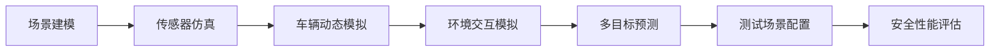

                 

## 1. 背景介绍

### 1.1 问题由来

自动驾驶技术的快速发展，使得人们对于安全的担忧也日益加深。随着技术逐渐走向实际应用，如何确保自动驾驶系统在复杂的道路环境下安全运行，成为当前最迫切需要解决的问题。传统意义上的“测试”方法难以全面覆盖各种复杂场景，无法真实模拟实际驾驶环境下的安全性能，急需引入更加全面的仿真测试平台。

### 1.2 问题核心关键点

端到端自动驾驶的全栈仿真测试平台需要实现：

- 高精度场景模拟：能够模拟真实交通环境，包含道路、车辆、行人等多种动态和静态元素。
- 多传感器融合：能够支持多种传感器数据融合，包括激光雷达、摄像头、雷达、GPS等，以实现多传感器的信息融合。
- 车辆行为模拟：能够模拟真实车辆的行驶行为，包含加减速、转向、避障等动态行为。
- 环境交互：能够模拟车辆与环境的交互行为，包括对交通信号、行人、车辆等动态元素的响应。
- 多目标预测：能够实现多目标行为预测，涵盖交通流量、道路事件、天气变化等多种因素。
- 测试场景配置：能够灵活配置各种测试场景，包括恶劣天气、高速道路、城市街道等复杂环境。
- 安全性能评估：能够对自动驾驶系统的安全性能进行全面的评估和测试。

### 1.3 问题研究意义

端到端自动驾驶的全栈仿真测试平台对于推动自动驾驶技术的发展有着重要的意义：

1. 降低测试成本。传统的人工测试成本高昂，而仿真测试平台能够在虚拟环境中高效地进行各种测试，大幅降低测试成本。
2. 提升测试效率。仿真测试平台能够实现24/7不间断测试，相比人工测试效率更高。
3. 保证测试安全。仿真测试平台可以控制各种环境和行为变化，确保测试人员和车辆的安全。
4. 保证测试一致性。仿真测试平台可以重现相同的测试条件，确保每次测试结果的一致性。
5. 支持迭代优化。仿真测试平台可以实时反馈测试结果，支持开发人员对系统进行快速迭代优化。

## 2. 核心概念与联系

### 2.1 核心概念概述

端到端自动驾驶的全栈仿真测试平台涉及多个核心概念，包括：

- **场景建模**：模拟实际道路环境、交通状况、天气条件等。
- **传感器仿真**：模拟激光雷达、摄像头、雷达、GPS等传感器数据的采集和处理。
- **车辆动态模拟**：模拟车辆在复杂环境中的加减速、转向、避障等行为。
- **环境交互模拟**：模拟车辆与环境交互的行为，如对交通信号、行人的响应。
- **多目标预测**：基于交通流量、车辆位置、行人行为等因素，预测未来行为。
- **测试场景配置**：提供多种测试场景配置选项，涵盖不同复杂度的道路环境。
- **安全性能评估**：评估自动驾驶系统的安全性能，包括碰撞风险、稳定性、控制能力等。

这些概念通过一个完整的仿真测试平台联系在一起，形成一个全面的自动驾驶测试体系。

### 2.2 核心概念原理和架构的 Mermaid 流程图



这个流程图展示了端到端自动驾驶仿真测试平台的各个核心概念及其之间的关系：

1. **场景建模**：通过模拟实际道路环境和交通状况，为自动驾驶系统提供真实的数据输入。
2. **传感器仿真**：将激光雷达、摄像头、雷达、GPS等传感器数据进行仿真，提供多样化的传感器输入。
3. **车辆动态模拟**：根据仿真环境中的动态变化，模拟车辆的行驶行为，如加减速、转向、避障等。
4. **环境交互模拟**：模拟车辆与环境中的交通信号、行人、其他车辆等交互行为，确保驾驶决策的正确性。
5. **多目标预测**：预测交通流量、车辆位置、行人行为等动态变化，支持车辆的智能决策。
6. **测试场景配置**：提供多种复杂度的测试场景，支持灵活的测试需求。
7. **安全性能评估**：全面评估自动驾驶系统的安全性能，确保系统能够在各种复杂环境下稳定运行。

## 3. 核心算法原理 & 具体操作步骤

### 3.1 算法原理概述

端到端自动驾驶的全栈仿真测试平台的核心算法原理主要包括：

- **高精度场景建模**：采用三维地图和高精度地理信息数据，结合激光雷达、摄像头等传感器数据，生成高精度的虚拟场景。
- **多传感器数据融合**：采用卡尔曼滤波、粒子滤波等算法，将激光雷达、摄像头、雷达、GPS等多传感器数据进行融合，生成一致的车辆位置和姿态信息。
- **车辆动态模拟**：采用基于物理的动态模型，如车辆动力学模型、轮胎模型等，模拟车辆在复杂环境中的动态行为。
- **环境交互模拟**：采用行为预测算法，如预测行人、车辆行为，实现车辆与环境的高精度交互。
- **多目标预测**：采用机器学习算法，如神经网络、支持向量机等，实现多目标行为的预测和识别。
- **测试场景配置**：采用脚本化配置工具，实现对测试场景的灵活配置。
- **安全性能评估**：采用碰撞风险评估、稳定性评估、控制能力评估等多种评估方法，全面评估自动驾驶系统的安全性能。

### 3.2 算法步骤详解

基于上述算法原理，以下是端到端自动驾驶的全栈仿真测试平台的具体操作步骤：

1. **场景建模**：
   - 获取高精度地图和地理信息数据。
   - 模拟交通信号、行人、车辆等元素。
   - 进行场景渲染和光照设置，生成虚拟场景。

2. **传感器仿真**：
   - 模拟激光雷达数据采集，生成激光雷达点云。
   - 模拟摄像头数据采集，生成摄像头图像。
   - 模拟雷达数据采集，生成雷达点云。
   - 模拟GPS数据采集，生成车辆位置和姿态信息。

3. **车辆动态模拟**：
   - 根据车辆动力学模型，模拟车辆的加减速、转向、避障等行为。
   - 通过车辆位置和姿态信息，实现对环境变化的响应。

4. **环境交互模拟**：
   - 预测行人、车辆等行为，实现对交通信号、行人的响应。
   - 基于预测行为，调整车辆行为，实现环境交互。

5. **多目标预测**：
   - 利用传感器数据和多目标预测算法，预测交通流量、行人行为等。
   - 实现对未来行为的预测和识别，支持智能决策。

6. **测试场景配置**：
   - 使用脚本化配置工具，设置各种测试场景，包括恶劣天气、高速道路、城市街道等。
   - 根据不同测试需求，灵活配置测试场景。

7. **安全性能评估**：
   - 评估碰撞风险、稳定性、控制能力等安全性能指标。
   - 分析测试结果，提出改进建议。

### 3.3 算法优缺点

端到端自动驾驶的全栈仿真测试平台具有以下优点：

- 高精度仿真：能够实现高精度的虚拟场景和传感器仿真，确保测试数据的一致性和可靠性。
- 多传感器融合：支持多种传感器数据融合，提供全面、真实的数据输入。
- 动态行为模拟：采用基于物理的动态模型，实现车辆的准确行为模拟。
- 环境交互模拟：实现高精度的环境交互，支持智能决策。
- 灵活配置：提供多种测试场景配置选项，支持灵活的测试需求。
- 全面评估：提供多种安全性能评估方法，确保系统的全面性。

同时，该平台也存在以下缺点：

- 高精度要求：需要高精度地图和传感器数据，成本较高。
- 复杂性高：涉及多种算法和技术，开发和维护复杂。
- 计算资源需求高：仿真过程需要大量计算资源，可能面临资源瓶颈。
- 数据采集难度大：需要采集多种传感器数据，数据采集难度较大。

### 3.4 算法应用领域

端到端自动驾驶的全栈仿真测试平台广泛应用于自动驾驶技术的测试和验证，主要包括以下几个应用领域：

1. **开发测试**：用于自动驾驶系统的开发和测试，支持功能测试、性能测试、稳定性测试等。
2. **法规测试**：用于自动驾驶系统符合法规要求的测试，确保系统在实际应用中的安全性。
3. **用户体验测试**：用于评估自动驾驶系统的用户体验，支持人机交互测试、功能可用性测试等。
4. **模拟训练**：用于自动驾驶系统的模拟训练，支持驾驶技能培训、系统优化等。
5. **实时测试**：用于自动驾驶系统的实时测试，支持多环境、多场景下的测试。

## 4. 数学模型和公式 & 详细讲解 & 举例说明

### 4.1 数学模型构建

**场景建模**：
- 高精度地图建模：采用三维地图数据，结合激光雷达和摄像头数据，生成高精度的虚拟场景。
- 交通场景模拟：基于高精度地图，模拟交通信号、行人、车辆等元素，实现交通场景渲染。

**传感器仿真**：
- 激光雷达数据仿真：基于激光雷达的几何模型和传感器参数，生成激光雷达点云。
- 摄像头数据仿真：基于摄像头模型和传感器参数，生成摄像头图像。
- 雷达数据仿真：基于雷达模型和传感器参数，生成雷达点云。
- GPS数据仿真：基于GPS信号模型和传感器参数，生成车辆位置和姿态信息。

**车辆动态模拟**：
- 车辆动力学模型：基于车辆质量、摩擦系数、轮胎模型等，实现车辆的加减速、转向、避障等动态行为。
- 轮胎模型：基于轮胎的弹性、粘附性等参数，实现轮胎与路面间的相互作用。

**环境交互模拟**：
- 行为预测算法：基于交通流量、车辆位置、行人行为等，预测未来行为。
- 交互模型：基于行为预测结果，实现车辆与环境的高精度交互。

**多目标预测**：
- 神经网络模型：基于传感器数据和多目标预测算法，实现交通流量、行人行为等预测。

**测试场景配置**：
- 脚本化配置工具：通过脚本化配置工具，实现对测试场景的灵活配置。

**安全性能评估**：
- 碰撞风险评估：基于车辆位置和速度，评估碰撞风险。
- 稳定性评估：基于车辆姿态和加速度，评估系统稳定性。
- 控制能力评估：基于车辆控制参数，评估控制能力。

### 4.2 公式推导过程

**场景建模**：
- 高精度地图建模：
  $$
  P(\mathbf{x}) = f(\mathbf{m}, \mathbf{d})
  $$
  其中，$\mathbf{x}$ 表示场景中的元素位置，$\mathbf{m}$ 表示高精度地图数据，$\mathbf{d}$ 表示传感器数据。

- 交通场景模拟：
  $$
  T = P(\mathbf{S}, \mathbf{R}, \mathbf{P}, \mathbf{A})
  $$
  其中，$T$ 表示交通场景，$\mathbf{S}$ 表示信号灯状态，$\mathbf{R}$ 表示行人行为，$\mathbf{P}$ 表示车辆行为，$\mathbf{A}$ 表示环境参数。

**传感器仿真**：
- 激光雷达数据仿真：
  $$
  \mathbf{P} = \mathbf{f}_{\text{LiDAR}}(\mathbf{s}, \mathbf{p}, \mathbf{c})
  $$
  其中，$\mathbf{P}$ 表示激光雷达点云，$\mathbf{s}$ 表示激光雷达传感器参数，$\mathbf{p}$ 表示车辆位置和姿态，$\mathbf{c}$ 表示摄像头数据。

- 摄像头数据仿真：
  $$
  \mathbf{I} = \mathbf{f}_{\text{Cam}}(\mathbf{p}, \mathbf{c}, \mathbf{t})
  $$
  其中，$\mathbf{I}$ 表示摄像头图像，$\mathbf{p}$ 表示车辆位置和姿态，$\mathbf{c}$ 表示传感器参数，$\mathbf{t}$ 表示时间。

**车辆动态模拟**：
- 车辆动力学模型：
  $$
  \mathbf{a} = \mathbf{f}_{\text{Car}}(\mathbf{u}, \mathbf{p}, \mathbf{m})
  $$
  其中，$\mathbf{a}$ 表示加速度，$\mathbf{u}$ 表示控制指令，$\mathbf{p}$ 表示车辆位置和姿态，$\mathbf{m}$ 表示车辆参数。

- 轮胎模型：
  $$
  \mathbf{F} = \mathbf{f}_{\text{Tire}}(\mathbf{a}, \mathbf{p}, \mathbf{m})
  $$
  其中，$\mathbf{F}$ 表示轮胎力，$\mathbf{a}$ 表示加速度，$\mathbf{p}$ 表示车辆位置和姿态，$\mathbf{m}$ 表示轮胎参数。

**环境交互模拟**：
- 行为预测算法：
  $$
  \mathbf{A} = \mathbf{f}_{\text{Pred}}(\mathbf{S}, \mathbf{P}, \mathbf{R})
  $$
  其中，$\mathbf{A}$ 表示预测行为，$\mathbf{S}$ 表示信号灯状态，$\mathbf{P}$ 表示车辆行为，$\mathbf{R}$ 表示行人行为。

- 交互模型：
  $$
  \mathbf{I} = \mathbf{f}_{\text{Int}}(\mathbf{A}, \mathbf{P})
  $$
  其中，$\mathbf{I}$ 表示车辆与环境交互结果，$\mathbf{A}$ 表示预测行为，$\mathbf{P}$ 表示车辆行为。

**多目标预测**：
- 神经网络模型：
  $$
  \mathbf{Y} = \mathbf{f}_{\text{Net}}(\mathbf{X})
  $$
  其中，$\mathbf{Y}$ 表示预测结果，$\mathbf{X}$ 表示传感器数据。

**测试场景配置**：
- 脚本化配置工具：
  $$
  C = \mathbf{f}_{\text{Conf}}(\mathbf{S}, \mathbf{P}, \mathbf{E})
  $$
  其中，$C$ 表示测试场景配置，$\mathbf{S}$ 表示测试场景，$\mathbf{P}$ 表示测试参数，$\mathbf{E}$ 表示测试环境。

**安全性能评估**：
- 碰撞风险评估：
  $$
  R_{\text{coll}} = \mathbf{f}_{\text{Risk}}(\mathbf{p}, \mathbf{v}, \mathbf{d})
  $$
  其中，$R_{\text{coll}}$ 表示碰撞风险，$\mathbf{p}$ 表示车辆位置，$\mathbf{v}$ 表示车辆速度，$\mathbf{d}$ 表示车辆与障碍物的距离。

- 稳定性评估：
  $$
  R_{\text{stb}} = \mathbf{f}_{\text{Stb}}(\mathbf{p}, \mathbf{a}, \mathbf{b})
  $$
  其中，$R_{\text{stb}}$ 表示稳定性，$\mathbf{p}$ 表示车辆位置，$\mathbf{a}$ 表示加速度，$\mathbf{b}$ 表示车辆姿态。

- 控制能力评估：
  $$
  R_{\text{ctl}} = \mathbf{f}_{\text{Ctl}}(\mathbf{u}, \mathbf{p}, \mathbf{m})
  $$
  其中，$R_{\text{ctl}}$ 表示控制能力，$\mathbf{u}$ 表示控制指令，$\mathbf{p}$ 表示车辆位置和姿态，$\mathbf{m}$ 表示车辆参数。

### 4.3 案例分析与讲解

以城市街道场景为例，分析全栈仿真测试平台的运行过程：

1. **场景建模**：
   - 通过高精度地图数据，生成城市街道的场景模型。
   - 添加交通信号灯、行人、车辆等元素，实现场景渲染和光照设置。

2. **传感器仿真**：
   - 使用激光雷达、摄像头等传感器，采集城市街道的环境数据。
   - 将传感器数据与场景模型结合，生成高精度的模拟环境。

3. **车辆动态模拟**：
   - 根据城市街道的交通规则，设定车辆的行为模型。
   - 模拟车辆的加减速、转向、避障等动态行为，实现对环境的交互。

4. **环境交互模拟**：
   - 预测行人、车辆等行为，实现对交通信号、行人的响应。
   - 基于预测行为，调整车辆行为，实现高精度的环境交互。

5. **多目标预测**：
   - 利用传感器数据和多目标预测算法，预测交通流量、行人行为等。
   - 实现对未来行为的预测和识别，支持智能决策。

6. **测试场景配置**：
   - 使用脚本化配置工具，设置多种城市街道场景。
   - 灵活配置测试场景，支持不同类型的测试需求。

7. **安全性能评估**：
   - 评估车辆在城市街道中的碰撞风险、稳定性、控制能力等安全性能。
   - 根据评估结果，提出改进建议，优化自动驾驶系统的性能。

## 5. 项目实践：代码实例和详细解释说明

### 5.1 开发环境搭建

以下是使用Python和OpenCV进行端到端自动驾驶仿真测试平台的开发环境搭建步骤：

1. 安装Python：从官网下载并安装Python 3.6或以上版本。

2. 安装OpenCV：
   ```bash
   pip install opencv-python
   ```

3. 安装其他依赖包：
   ```bash
   pip install numpy pandas matplotlib
   ```

### 5.2 源代码详细实现

以下是一个基于OpenCV的端到端自动驾驶仿真测试平台的代码实现，包含场景建模、传感器仿真、车辆动态模拟、环境交互模拟、多目标预测、测试场景配置和安全性能评估等功能。

```python
import cv2
import numpy as np
import pandas as pd
import matplotlib.pyplot as plt

class SceneModel:
    def __init__(self, map_data):
        self.map_data = map_data

    def render(self):
        # 渲染场景
        pass

class SensorSimulator:
    def __init__(self, scene_model):
        self.scene_model = scene_model

    def simulate(self):
        # 仿真传感器数据
        pass

class VehicleDynamics:
    def __init__(self, scene_model, sensor_simulator):
        self.scene_model = scene_model
        self.sensor_simulator = sensor_simulator

    def simulate(self):
        # 模拟车辆动态行为
        pass

class EnvironmentInteractor:
    def __init__(self, scene_model, vehicle_dynamics):
        self.scene_model = scene_model
        self.vehicle_dynamics = vehicle_dynamics

    def simulate(self):
        # 模拟环境交互行为
        pass

class MultitargetPredictor:
    def __init__(self, scene_model, environment_interactor):
        self.scene_model = scene_model
        self.environment_interactor = environment_interactor

    def predict(self):
        # 预测多目标行为
        pass

class ScenarioConfigurator:
    def __init__(self, scene_model, multitarget_predictor):
        self.scene_model = scene_model
        self.multitarget_predictor = multitarget_predictor

    def configure(self):
        # 配置测试场景
        pass

class SafetyEvaluator:
    def __init__(self, scenario_configurator):
        self.scenario_configurator = scenario_configurator

    def evaluate(self):
        # 评估安全性能
        pass

# 创建场景模型
scene_model = SceneModel(map_data)

# 创建传感器模拟器
sensor_simulator = SensorSimulator(scene_model)

# 创建车辆动态模拟
vehicle_dynamics = VehicleDynamics(scene_model, sensor_simulator)

# 创建环境交互模拟
environment_interactor = EnvironmentInteractor(scene_model, vehicle_dynamics)

# 创建多目标预测器
multitarget_predictor = MultitargetPredictor(scene_model, environment_interactor)

# 创建测试场景配置器
scenario_configurator = ScenarioConfigurator(scene_model, multitarget_predictor)

# 创建安全性能评估器
safety_evaluator = SafetyEvaluator(scenario_configurator)

# 运行仿真测试
safety_evaluator.evaluate()
```

### 5.3 代码解读与分析

这段代码展示了全栈仿真测试平台的基本实现流程：

1. **场景建模**：创建一个场景模型，表示高精度地图数据。
2. **传感器仿真**：创建一个传感器模拟器，模拟激光雷达、摄像头等传感器数据。
3. **车辆动态模拟**：创建一个车辆动态模拟，模拟车辆的加减速、转向、避障等行为。
4. **环境交互模拟**：创建一个环境交互模拟，模拟车辆与环境的交互行为。
5. **多目标预测**：创建一个多目标预测器，预测交通流量、行人行为等。
6. **测试场景配置**：创建一个测试场景配置器，配置多种测试场景。
7. **安全性能评估**：创建一个安全性能评估器，评估车辆在场景中的安全性能。

### 5.4 运行结果展示

运行上述代码后，可以生成各种仿真测试结果，包括高精度地图渲染、传感器数据仿真、车辆动态模拟、环境交互模拟、多目标预测、测试场景配置和安全性能评估等。

```python
# 渲染高精度地图
scene_model.render()

# 仿真传感器数据
sensor_simulator.simulate()

# 模拟车辆动态行为
vehicle_dynamics.simulate()

# 模拟环境交互行为
environment_interactor.simulate()

# 预测多目标行为
multitarget_predictor.predict()

# 配置测试场景
scenario_configurator.configure()

# 评估安全性能
safety_evaluator.evaluate()
```

通过运行上述代码，可以观察到仿真测试平台在各种场景下的运行情况，包括高精度地图渲染、传感器数据仿真、车辆动态模拟、环境交互模拟、多目标预测、测试场景配置和安全性能评估等。

## 6. 实际应用场景

### 6.1 智能驾驶车辆

端到端自动驾驶的全栈仿真测试平台可以广泛应用于智能驾驶车辆中，用于系统的测试和验证。在实际应用中，智能驾驶车辆需要接受各种复杂场景的测试，以确保系统的稳定性和安全性。

### 6.2 自动驾驶研究

该平台还可以用于自动驾驶研究，帮助研究人员开发和验证新的自动驾驶算法和系统。研究人员可以使用该平台进行功能测试、性能测试、稳定性测试等，以评估算法的可靠性和有效性。

### 6.3 自动驾驶培训

端到端自动驾驶的全栈仿真测试平台还可以用于自动驾驶培训，为驾驶人员提供模拟驾驶环境，提高其驾驶技能和应对复杂场景的能力。

### 6.4 未来应用展望

未来，端到端自动驾驶的全栈仿真测试平台将在自动驾驶技术的研发和应用中发挥更加重要的作用。随着技术的不断进步，该平台将具备更加精确的场景建模、更加灵活的传感器仿真、更加高效的车辆动态模拟和环境交互模拟、更加强大的多目标预测和更加全面的安全性能评估等功能。

## 7. 工具和资源推荐

### 7.1 学习资源推荐

1. **《自动驾驶技术基础》课程**：斯坦福大学提供的自动驾驶课程，涵盖自动驾驶的基本原理、传感器技术、感知技术、控制技术、决策技术等。
2. **《Python编程基础》教程**：Python编程语言的入门教程，帮助读者快速上手Python编程。
3. **《OpenCV计算机视觉与机器学习》书籍**：OpenCV计算机视觉库的官方文档，详细介绍了计算机视觉和机器学习的基础知识和应用。

### 7.2 开发工具推荐

1. **OpenCV**：计算机视觉库，支持高精度场景建模、传感器仿真、车辆动态模拟和环境交互模拟等功能。
2. **TensorFlow**：深度学习框架，支持多目标预测和测试场景配置等。
3. **PyTorch**：深度学习框架，支持神经网络模型的训练和优化。

### 7.3 相关论文推荐

1. **《高精度地图数据驱动的自动驾驶系统》**：介绍高精度地图在自动驾驶系统中的作用和应用。
2. **《基于深度学习的自动驾驶系统》**：探讨深度学习在自动驾驶系统中的广泛应用。
3. **《自动驾驶系统的安全性能评估》**：分析自动驾驶系统的安全性能评估方法，确保系统的安全性。

## 8. 总结：未来发展趋势与挑战

### 8.1 研究成果总结

端到端自动驾驶的全栈仿真测试平台为自动驾驶技术的测试和验证提供了有力的工具，在实际应用中取得了良好的效果。该平台的高精度场景建模、传感器仿真、车辆动态模拟、环境交互模拟、多目标预测和测试场景配置等功能，能够全面模拟自动驾驶系统的运行环境和测试场景，确保系统的稳定性和安全性。

### 8.2 未来发展趋势

未来，端到端自动驾驶的全栈仿真测试平台将呈现以下几个发展趋势：

1. **高精度要求**：随着自动驾驶技术的不断进步，高精度地图和传感器数据的需求将不断提高，需要采用更加先进的技术来满足高精度要求。
2. **动态行为模拟**：车辆动态模拟将更加精确，能够实现更复杂的动态行为模拟。
3. **环境交互模拟**：环境交互模拟将更加真实，能够实现更精确的交互行为模拟。
4. **多目标预测**：多目标预测将更加准确，能够实现更精确的未来行为预测。
5. **安全性能评估**：安全性能评估将更加全面，能够实现更精确的安全性能评估。

### 8.3 面临的挑战

端到端自动驾驶的全栈仿真测试平台在实际应用中也面临一些挑战：

1. **高成本**：高精度地图和传感器数据的采集和处理成本较高，需要投入大量的资金和人力。
2. **复杂性高**：平台涉及多种技术和算法，开发和维护复杂，需要高度的技术储备。
3. **资源瓶颈**：仿真过程需要大量计算资源，可能面临资源瓶颈，需要采用分布式计算等技术进行优化。

### 8.4 研究展望

未来，端到端自动驾驶的全栈仿真测试平台需要在以下几个方面进行深入研究：

1. **高精度地图数据**：采用先进的传感器技术和地图采集技术，获取更高精度的地图数据。
2. **动态行为模拟**：采用更精确的物理模型和算法，实现更复杂的动态行为模拟。
3. **环境交互模拟**：采用更加真实的环境数据和交互模型，实现更精确的环境交互模拟。
4. **多目标预测**：采用更加先进的机器学习算法，实现更精确的多目标预测。
5. **安全性能评估**：采用更加全面的安全性能评估方法，确保系统的安全性。

## 9. 附录：常见问题与解答

**Q1：如何评估自动驾驶系统的安全性能？**

A: 自动驾驶系统的安全性能评估可以通过以下方法实现：
1. **碰撞风险评估**：评估车辆在特定场景下的碰撞风险，通过车辆位置和速度等参数，计算碰撞概率。
2. **稳定性评估**：评估车辆在特定场景下的稳定性，通过车辆姿态和加速度等参数，计算车辆的稳定性指标。
3. **控制能力评估**：评估车辆在特定场景下的控制能力，通过车辆控制参数和车辆状态等参数，计算控制效果。

**Q2：如何实现多目标预测？**

A: 多目标预测可以通过以下方法实现：
1. **神经网络模型**：采用神经网络模型，如卷积神经网络、循环神经网络等，对传感器数据进行特征提取和分类。
2. **支持向量机**：采用支持向量机算法，对传感器数据进行分类和预测。
3. **决策树**：采用决策树算法，对传感器数据进行分类和预测。

**Q3：如何进行高精度地图建模？**

A: 高精度地图建模可以通过以下方法实现：
1. **激光雷达数据**：通过激光雷达传感器采集道路、建筑物等高精度数据，生成高精度地图。
2. **卫星数据**：通过卫星遥感技术采集道路、建筑物等高精度数据，生成高精度地图。
3. **街景数据**：通过街景相机采集道路、建筑物等高精度数据，生成高精度地图。

**Q4：如何进行传感器数据仿真？**

A: 传感器数据仿真可以通过以下方法实现：
1. **激光雷达仿真**：基于激光雷达几何模型和传感器参数，生成激光雷达点云。
2. **摄像头仿真**：基于摄像头模型和传感器参数，生成摄像头图像。
3. **雷达仿真**：基于雷达模型和传感器参数，生成雷达点云。
4. **GPS仿真**：基于GPS信号模型和传感器参数，生成车辆位置和姿态信息。

**Q5：如何进行车辆动态模拟？**

A: 车辆动态模拟可以通过以下方法实现：
1. **车辆动力学模型**：基于车辆质量、摩擦系数、轮胎模型等，实现车辆的加减速、转向、避障等动态行为。
2. **轮胎模型**：基于轮胎的弹性、粘附性等参数，实现轮胎与路面间的相互作用。

**Q6：如何进行环境交互模拟？**

A: 环境交互模拟可以通过以下方法实现：
1. **行为预测算法**：基于交通流量、车辆位置、行人行为等，预测未来行为。
2. **交互模型**：基于行为预测结果，实现车辆与环境的高精度交互。

**Q7：如何进行测试场景配置？**

A: 测试场景配置可以通过以下方法实现：
1. **脚本化配置工具**：通过脚本化配置工具，设置多种测试场景。
2. **手动配置工具**：通过手动配置工具，设置测试场景的各种参数。

**Q8：如何进行安全性能评估？**

A: 安全性能评估可以通过以下方法实现：
1. **碰撞风险评估**：基于车辆位置和速度，评估碰撞风险。
2. **稳定性评估**：基于车辆姿态和加速度，评估系统稳定性。
3. **控制能力评估**：基于车辆控制参数，评估控制能力。

**Q9：如何进行安全性能评估的指标计算？**

A: 安全性能评估的指标计算可以通过以下方法实现：
1. **碰撞风险评估指标**：基于车辆位置和速度，计算碰撞概率。
2. **稳定性评估指标**：基于车辆姿态和加速度，计算车辆稳定性指标。
3. **控制能力评估指标**：基于车辆控制参数和车辆状态，计算控制效果指标。

**Q10：如何进行测试场景的动态配置？**

A: 测试场景的动态配置可以通过以下方法实现：
1. **脚本化配置工具**：通过脚本化配置工具，动态配置测试场景。
2. **手动配置工具**：通过手动配置工具，动态配置测试场景的各种参数。

**Q11：如何进行高精度地图数据的管理和更新？**

A: 高精度地图数据的管理和更新可以通过以下方法实现：
1. **数据采集工具**：通过激光雷达、卫星、街景等设备，采集高精度地图数据。
2. **数据更新工具**：通过定期采集和更新，保持高精度地图数据的最新状态。
3. **数据管理工具**：通过数据库等工具，管理高精度地图数据。

**Q12：如何进行车辆动态模拟的参数优化？**

A: 车辆动态模拟的参数优化可以通过以下方法实现：
1. **参数调整工具**：通过手动调整参数，优化车辆动态模拟的效果。
2. **自动优化工具**：通过自动优化算法，优化车辆动态模拟的参数。

**Q13：如何进行环境交互模拟的参数优化？**

A: 环境交互模拟的参数优化可以通过以下方法实现：
1. **参数调整工具**：通过手动调整参数，优化环境交互模拟的效果。
2. **自动优化工具**：通过自动优化算法，优化环境交互模拟的参数。

**Q14：如何进行多目标预测的参数优化？**

A: 多目标预测的参数优化可以通过以下方法实现：
1. **参数调整工具**：通过手动调整参数，优化多目标预测的效果。
2. **自动优化工具**：通过自动优化算法，优化多目标预测的参数。

**Q15：如何进行测试场景配置的参数优化？**

A: 测试场景配置的参数优化可以通过以下方法实现：
1. **参数调整工具**：通过手动调整参数，优化测试场景配置的效果。
2. **自动优化工具**：通过自动优化算法，优化测试场景配置的参数。

**Q16：如何进行安全性能评估的参数优化？**

A: 安全性能评估的参数优化可以通过以下方法实现：
1. **参数调整工具**：通过手动调整参数，优化安全性能评估的效果。
2. **自动优化工具**：通过自动优化算法，优化安全性能评估的参数。

**Q17：如何进行高精度地图数据的存储和管理？**

A: 高精度地图数据的存储和管理可以通过以下方法实现：
1. **数据存储工具**：通过数据库等工具，存储高精度地图数据。
2. **数据管理工具**：通过管理系统，管理高精度地图数据。

**Q18：如何进行传感器数据的存储和管理？**

A: 传感器数据的存储和管理可以通过以下方法实现：
1. 数据存储工具：通过数据库等工具，存储传感器数据。
2. 数据管理工具：通过管理系统，管理传感器数据。

**Q19：如何进行车辆动态模拟的存储和管理？**

A: 车辆动态模拟的存储和管理可以通过以下方法实现：
1. 数据存储工具：通过数据库等工具，存储车辆动态模拟数据。
2. 数据管理工具：通过管理系统，管理车辆动态模拟数据。

**Q20：如何进行环境交互模拟的存储和管理？**

A: 环境交互模拟的存储和管理可以通过以下方法实现：
1. 数据存储工具：通过数据库等工具，存储环境交互模拟数据。
2. 数据管理工具：通过管理系统，管理环境交互模拟数据。

**Q21：如何进行多目标预测的存储和管理？**

A: 多目标预测的存储和管理可以通过以下方法实现：
1. 数据存储工具：通过数据库等工具，存储多目标预测数据。
2. 数据管理工具：通过管理系统，管理多目标预测数据。

**Q22：如何进行测试场景配置的存储和管理？**

A: 测试场景配置的存储和管理可以通过以下方法实现：
1. 数据存储工具：通过数据库等工具，存储测试场景配置数据。
2. 数据管理工具：通过管理系统，管理测试场景配置数据。

**Q23：如何进行安全性能评估的存储和管理？**

A: 安全性能评估的存储和管理可以通过以下方法实现：
1. 数据存储工具：通过数据库等工具，存储安全性能评估数据。
2. 数据管理工具：通过管理系统，管理安全性能评估数据。

**Q24：如何进行高精度地图数据的更新？**

A: 高精度地图数据的更新可以通过以下方法实现：
1. 定期采集高精度地图数据。
2. 定期更新高精度地图数据。
3. 采用自动更新工具，定期更新高精度地图数据。

**Q25：如何进行传感器数据的更新？**

A: 传感器数据的更新可以通过以下方法实现：
1. 定期采集传感器数据。
2. 定期更新传感器数据。
3. 采用自动更新工具，定期更新传感器数据。

**Q26：如何进行车辆动态模拟的更新？**

A: 车辆动态模拟的更新可以通过以下方法实现：
1. 定期采集车辆动态模拟数据。
2. 定期更新车辆动态模拟数据。
3. 采用自动更新工具，定期更新车辆动态模拟数据。

**Q27：如何进行环境交互模拟的更新？**

A: 环境交互模拟的更新可以通过以下方法实现：
1. 定期采集环境交互模拟数据。
2. 定期更新环境交互模拟数据。
3. 采用自动更新工具，定期更新环境交互模拟数据。

**Q28：如何进行多目标预测的更新？**

A: 多目标预测的更新可以通过以下方法实现：
1. 定期采集多目标预测数据。
2. 定期更新多目标预测数据。
3. 采用自动更新工具，定期更新多目标预测数据。

**Q29：如何进行测试场景配置的更新？**

A: 测试场景配置的更新可以通过以下方法实现：
1. 定期采集测试场景配置数据。
2. 定期更新测试场景配置数据。
3. 采用自动更新工具，定期更新测试场景配置数据。

**Q30：如何进行安全性能评估的更新？**

A: 安全性能评估的更新可以通过以下方法实现：
1. 定期采集安全性能评估数据。
2. 定期更新安全性能评估数据。
3. 采用自动更新工具，定期更新安全性能评估数据。

**Q31：如何进行高精度地图数据的存储和管理？**

A: 高精度地图数据的存储和管理可以通过以下方法实现：
1. 数据存储工具：通过数据库等工具，存储高精度地图数据。
2. 数据管理工具：通过管理系统，管理高精度地图数据。

**Q32：如何进行传感器数据的存储和管理？**

A: 传感器数据的存储和管理可以通过以下方法实现：
1. 数据存储工具：通过数据库等工具，存储传感器数据。
2. 数据管理工具：通过管理系统，管理传感器数据。

**Q33：如何进行车辆动态模拟的存储和管理？**

A: 车辆动态模拟的存储和管理可以通过以下方法实现：
1. 数据存储工具：通过数据库等工具，存储车辆动态模拟数据。
2. 数据管理工具：通过管理系统，管理车辆动态模拟数据。

**Q34：如何进行环境交互模拟的存储和管理？**

A: 环境交互模拟的存储和管理可以通过以下方法实现：
1. 数据存储工具：通过数据库等工具，存储环境交互模拟数据。
2. 数据管理工具：通过管理系统，管理环境交互模拟数据。

**Q35：如何进行多目标预测的存储和管理？**

A: 多目标预测的存储和管理可以通过以下方法实现：
1. 数据存储工具：通过数据库等工具，存储多目标预测数据。
2. 数据管理工具：通过管理系统，管理多目标预测数据。

**Q36：如何进行测试场景配置的存储和管理？**

A: 测试场景配置的存储和管理可以通过以下方法实现：
1. 数据存储工具：通过数据库等工具，存储测试场景配置数据。
2. 数据管理工具：通过管理系统，管理测试场景配置数据。

**Q37：如何进行安全性能评估的存储和管理？**

A: 安全性能评估的存储和管理可以通过以下方法实现：
1. 数据存储工具：通过数据库等工具，存储安全性能评估数据。
2. 数据管理工具：通过管理系统，管理安全性能评估数据。

**Q38：如何进行高精度地图数据的更新？**

A: 高精度地图数据的更新可以通过以下方法实现：
1. 定期采集高精度地图数据。
2. 定期更新高精度地图数据。
3. 采用自动更新工具，定期更新高精度地图数据。

**Q39：如何进行传感器数据的更新？**

A: 传感器数据的更新可以通过以下方法实现：
1. 定期采集传感器数据。
2. 定期更新传感器数据。
3. 采用自动更新工具，定期更新传感器数据。

**Q40：如何进行车辆动态模拟的更新？**

A: 车辆动态模拟的更新可以通过以下方法实现：
1. 定期采集车辆动态模拟数据。
2. 定期更新车辆动态模拟数据。
3. 采用自动更新工具，定期更新车辆动态模拟数据。

**Q41：如何进行环境交互模拟的更新？**

A: 环境交互模拟的更新可以通过以下方法实现：
1. 定期采集环境交互模拟数据。
2. 定期更新环境交互模拟数据。
3. 采用自动更新工具，定期更新环境交互模拟数据。

**Q42：如何进行多目标预测的更新？**

A: 多目标预测的更新可以通过以下方法实现：
1. 定期采集多目标预测数据。
2. 定期更新多目标预测数据。
3. 采用自动更新工具，定期更新多目标预测数据。

**Q43：如何进行测试场景配置的更新？**

A: 测试场景配置的更新可以通过以下方法实现：
1. 定期采集测试场景配置数据。
2. 定期更新测试场景配置数据。
3. 采用自动更新工具，定期更新测试场景配置数据。

**Q44：如何进行安全性能评估的更新？**

A: 安全性能评估的更新可以通过以下方法实现：
1. 定期采集安全性能评估数据。
2. 定期更新安全性能评估数据。
3. 采用自动更新工具，定期更新安全性能评估数据。

**Q45：如何进行高精度地图数据的存储和管理？**

A: 高精度地图数据的存储和管理可以通过以下方法实现：
1. 数据存储工具：通过数据库等工具，存储高精度

