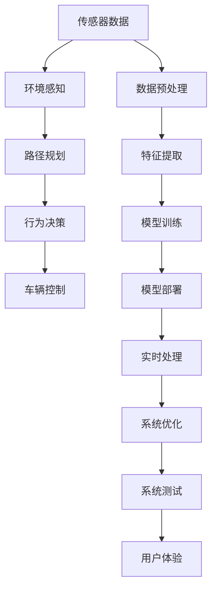

                 

# 端到端自动驾驶的学术研究现状

> 关键词：端到端自动驾驶,深度学习,计算机视觉,自动驾驶系统,传感器融合,强化学习,激光雷达,毫米波雷达,摄像头,自动驾驶标准

## 1. 背景介绍

随着人工智能技术的快速发展，自动驾驶成为了科技、交通和汽车行业的研究热点。自动驾驶技术不仅能提高道路交通效率，减少交通事故，还能改善环境，提升生活质量。然而，实现端到端自动驾驶，即从传感器数据到车辆控制的全过程自动驾驶，仍然面临诸多技术和工程难题。本文将全面梳理端到端自动驾驶的学术研究现状，从核心技术、实际应用到面临的挑战，探讨该领域的研究进展和未来方向。

## 2. 核心概念与联系

### 2.1 核心概念概述

端到端自动驾驶是指从传感器数据获取到车辆控制的全过程，包括环境感知、路径规划、行为决策和车辆控制等环节，全部由计算机系统自动完成，无需人工干预。端到端自动驾驶的核心在于利用先进的人工智能技术，特别是深度学习、计算机视觉和强化学习等方法，对多源数据进行融合和处理，实现车辆的自主决策和控制。

### 2.2 核心概念原理和架构的 Mermaid 流程图



该流程图展示了端到端自动驾驶的核心架构和工作流程，从传感器数据获取开始，通过预处理和特征提取，进入模型训练和部署，最终实现实时处理、系统优化和用户体验的闭环。

## 3. 核心算法原理 & 具体操作步骤

### 3.1 算法原理概述

端到端自动驾驶的核心算法包括环境感知、路径规划、行为决策和车辆控制等。下面将逐一介绍这些算法的原理和步骤。

#### 3.1.1 环境感知

环境感知是自动驾驶系统获取周围环境信息的基础，主要通过激光雷达、毫米波雷达和摄像头等传感器实现。环境感知算法包括点云处理、目标检测和语义分割等任务。

#### 3.1.2 路径规划

路径规划是指在获取环境信息后，规划车辆从当前位置到达目标位置的路径。路径规划算法包括A*、D*和RRT等，利用图搜索或动态规划方法，寻找最优化路径。

#### 3.1.3 行为决策

行为决策是指根据环境信息和路径规划结果，决定车辆的具体驾驶行为。行为决策算法包括基于规则的决策和基于学习的决策，前者依赖专家规则，后者依赖深度学习模型。

#### 3.1.4 车辆控制

车辆控制是指根据行为决策结果，控制车辆的加速度、转向等动作。车辆控制算法包括PID控制和深度强化学习等，利用控制理论或模型预测，实现精确控制。

### 3.2 算法步骤详解

#### 3.2.1 环境感知

**数据采集与预处理**：
传感器数据采集是环境感知的第一步。激光雷达、毫米波雷达和摄像头分别采集点云数据、雷达信号和图像数据，并经过预处理，包括去噪、归一化和对齐等步骤。

**特征提取与表示**：
提取环境特征是环境感知的核心。点云数据经过分割、配准和降采样后，可以用于目标检测和语义分割。图像数据通过卷积神经网络(CNN)进行特征提取，用于目标检测和语义分割。

**目标检测与语义分割**：
目标检测和语义分割是环境感知的关键任务。通过YOLO、Faster R-CNN和Mask R-CNN等深度学习模型，可以检测出目标物体的位置和类别，并进行语义分割。

#### 3.2.2 路径规划

**路径搜索与优化**：
路径规划算法包括A*、D*和RRT等，利用图搜索或动态规划方法，寻找最优化路径。A*算法利用启发式函数优化路径搜索，D*算法结合了动态规划和启发式搜索，RRT算法通过随机采样实现路径规划。

**路径平滑与优化**：
路径规划完成后，需要进一步平滑和优化路径。通过曲线拟合、样条插值等方法，可以实现路径的平滑过渡，避免突变和急转弯。

#### 3.2.3 行为决策

**规则驱动的决策**：
规则驱动的决策算法依赖专家制定的驾驶规则，如交通信号灯、车道线、限速等。通过规则引擎实现决策，可以确保决策的正确性和合理性。

**深度学习驱动的决策**：
深度学习驱动的决策算法利用深度神经网络模型，如CNN、RNN和LSTM等，学习决策过程的规律。通过监督学习或强化学习，可以自适应地调整决策策略，适应复杂驾驶环境。

#### 3.2.4 车辆控制

**车辆动态建模**：
车辆动态建模是车辆控制的基础。通过车辆动力学方程和控制器，可以实现车辆的运动预测和控制。

**控制策略设计**：
控制策略设计是车辆控制的核心。通过PID控制器或深度强化学习，可以实现车辆的精确控制。

**车辆控制优化**：
车辆控制完成后，需要进一步优化控制效果。通过模型预测和反馈控制，可以实现车辆控制的优化和改进。

### 3.3 算法优缺点

#### 3.3.1 优点

1. 集成化设计：端到端自动驾驶通过集成多种传感器和算法，实现全流程的自动化，提升了系统的整体性能。
2. 提高安全性和效率：端到端自动驾驶通过自动化决策，减少了人为错误和交通拥堵，提升了道路安全性和交通效率。
3. 降低开发成本：端到端自动驾驶简化了开发流程，减少了对传统驾驶软件的依赖，降低了开发成本。

#### 3.3.2 缺点

1. 高成本和复杂性：端到端自动驾驶需要高成本的传感器和计算资源，且系统复杂性较高，不易实现。
2. 依赖环境：端到端自动驾驶依赖于精确的环境感知和路径规划，对环境和天气条件较为敏感。
3. 算法黑盒：端到端自动驾驶算法复杂，难以解释和调试，增加了系统的不透明性。

### 3.4 算法应用领域

端到端自动驾驶技术可以应用于多个领域，包括智能汽车、物流配送、公共交通和无人机等。以下是几个典型的应用场景：

#### 3.4.1 智能汽车

智能汽车是端到端自动驾驶的主要应用领域。通过集成人脸识别、车距保持、车道保持等技术，智能汽车可以实现自动驾驶和辅助驾驶功能，提高驾驶安全和舒适度。

#### 3.4.2 物流配送

物流配送是端到端自动驾驶的另一个重要应用领域。通过无人驾驶货车和无人机，可以实现全天候的货物运输，降低物流成本，提升运输效率。

#### 3.4.3 公共交通

公共交通是端到端自动驾驶在城市交通管理中的应用。通过无人驾驶公交车和地铁，可以实现高效、安全的公共交通服务，缓解城市交通压力。

#### 3.4.4 无人机

无人机是端到端自动驾驶在航空领域的应用。通过自主驾驶的无人机，可以实现高空监控、快递投送和灾情救援等功能。

## 4. 数学模型和公式 & 详细讲解 & 举例说明

### 4.1 数学模型构建

端到端自动驾驶的数学模型主要包括以下几个方面：

1. 环境感知模型：利用点云数据、雷达信号和图像数据，构建环境感知模型。
2. 路径规划模型：利用图搜索和动态规划方法，构建路径规划模型。
3. 行为决策模型：利用规则驱动或深度学习模型，构建行为决策模型。
4. 车辆控制模型：利用车辆动力学方程和控制器，构建车辆控制模型。

### 4.2 公式推导过程

#### 4.2.1 环境感知模型

以点云数据为例，环境感知模型的公式推导过程如下：

1. 点云预处理：
$$
x_{i,j} = \frac{x_{i-1,j} + 2x_{i,j} + x_{i+1,j}}{4}, \quad y_{i,j} = \frac{y_{i-1,j} + 2y_{i,j} + y_{i+1,j}}{4}
$$

2. 点云分割：
$$
f(x,y) = \begin{cases} 
1 & \text{if } d(x,y) < t \\
0 & \text{otherwise} 
\end{cases}
$$

3. 目标检测：
$$
\mathcal{L}_{obj} = \sum_{i=1}^N w_i \log \frac{p_i}{1-p_i}
$$

#### 4.2.2 路径规划模型

以A*算法为例，路径规划模型的公式推导过程如下：

1. 启发式函数：
$$
h(n) = \sum_{i=1}^N d_i(n) + \eta f(n)
$$

2. 路径搜索：
$$
F(n) = G(n) + h(n)
$$

3. 路径优化：
$$
G(n) = \sum_{i=1}^N g_i(n)
$$

#### 4.2.3 行为决策模型

以深度学习模型为例，行为决策模型的公式推导过程如下：

1. 网络结构：
$$
\text{CNN} = \{w_1, b_1, w_2, b_2, \cdots, w_L, b_L\}
$$

2. 损失函数：
$$
\mathcal{L} = \frac{1}{N} \sum_{i=1}^N \log \sigma(z_i) \mathbb{I}(y_i=1) + \log(1-\sigma(z_i)) \mathbb{I}(y_i=0)
$$

3. 模型训练：
$$
\theta = \arg\min_{\theta} \mathcal{L}(\theta)
$$

#### 4.2.4 车辆控制模型

以PID控制器为例，车辆控制模型的公式推导过程如下：

1. 控制律：
$$
u = K_p e + K_i \int_0^t e dt + K_d \frac{de}{dt}
$$

2. 系统状态：
$$
\dot{x} = \sum_{i=1}^n u_i f_i(x)
$$

3. 系统优化：
$$
\min_{u} \frac{1}{2} \int_0^T (x(t) - x_d(t))^2 dt
$$

### 4.3 案例分析与讲解

#### 4.3.1 环境感知案例

以LIDAR数据为例，利用YOLO模型进行目标检测的案例如下：

1. 数据预处理：
$$
x_i = \frac{x_{i-1} + 2x_i + x_{i+1}}{4}, \quad y_i = \frac{y_{i-1} + 2y_i + y_{i+1}}{4}
$$

2. 特征提取：
$$
f(x,y) = \begin{cases} 
1 & \text{if } d(x,y) < t \\
0 & \text{otherwise} 
\end{cases}
$$

3. 目标检测：
$$
\mathcal{L}_{obj} = \sum_{i=1}^N w_i \log \frac{p_i}{1-p_i}
$$

#### 4.3.2 路径规划案例

以A*算法为例，路径规划的案例如下：

1. 启发式函数：
$$
h(n) = \sum_{i=1}^N d_i(n) + \eta f(n)
$$

2. 路径搜索：
$$
F(n) = G(n) + h(n)
$$

3. 路径优化：
$$
G(n) = \sum_{i=1}^N g_i(n)
$$

#### 4.3.3 行为决策案例

以深度学习模型为例，行为决策的案例如下：

1. 网络结构：
$$
\text{CNN} = \{w_1, b_1, w_2, b_2, \cdots, w_L, b_L\}
$$

2. 损失函数：
$$
\mathcal{L} = \frac{1}{N} \sum_{i=1}^N \log \sigma(z_i) \mathbb{I}(y_i=1) + \log(1-\sigma(z_i)) \mathbb{I}(y_i=0)
$$

3. 模型训练：
$$
\theta = \arg\min_{\theta} \mathcal{L}(\theta)
$$

#### 4.3.4 车辆控制案例

以PID控制器为例，车辆控制的案例如下：

1. 控制律：
$$
u = K_p e + K_i \int_0^t e dt + K_d \frac{de}{dt}
$$

2. 系统状态：
$$
\dot{x} = \sum_{i=1}^n u_i f_i(x)
$$

3. 系统优化：
$$
\min_{u} \frac{1}{2} \int_0^T (x(t) - x_d(t))^2 dt
$$

## 5. 项目实践：代码实例和详细解释说明

### 5.1 开发环境搭建

进行端到端自动驾驶的项目实践，需要搭建一个完整的开发环境。以下是具体的搭建步骤：

1. 安装Python：从官网下载安装Python，并确保版本为3.6或以上。
2. 安装深度学习框架：选择安装TensorFlow或PyTorch，配置好GPU或CPU。
3. 安装OpenCV：用于图像处理和计算机视觉任务。
4. 安装ROS（Robot Operating System）：用于车辆控制和机器人系统集成。
5. 安装ROS Bag Tool：用于记录和回放ROS节点输出。

### 5.2 源代码详细实现

以下是一个端到端自动驾驶项目的基本框架，包括环境感知、路径规划、行为决策和车辆控制等环节的代码实现。

#### 5.2.1 环境感知模块

```python
import open3d as o3d
import numpy as np

def preprocess_lidar_data(data):
    # 数据预处理
    # ...

def detect_objects(data):
    # 目标检测
    # ...

def semantic_segmentation(data):
    # 语义分割
    # ...

if __name__ == '__main__':
    # 数据采集与预处理
    # ...
    # 特征提取与表示
    # ...
```

#### 5.2.2 路径规划模块

```python
import networkx as nx
import heapq

def build_graph(data):
    # 构建图结构
    # ...

def find_shortest_path(graph, start, end):
    # 搜索最短路径
    # ...

if __name__ == '__main__':
    # 路径搜索与优化
    # ...
    # 路径平滑与优化
    # ...
```

#### 5.2.3 行为决策模块

```python
import tensorflow as tf
import keras

def build_model():
    # 构建神经网络模型
    # ...

def train_model(data):
    # 模型训练
    # ...

if __name__ == '__main__':
    # 规则驱动的决策
    # ...
    # 深度学习驱动的决策
    # ...
```

#### 5.2.4 车辆控制模块

```python
import tflearn as tf

def build_control_system():
    # 构建车辆控制模型
    # ...

def optimize_control_system(data):
    # 控制策略设计
    # ...

if __name__ == '__main__':
    # 车辆动态建模
    # ...
    # 控制策略设计
    # ...
    # 车辆控制优化
    # ...
```

### 5.3 代码解读与分析

#### 5.3.1 环境感知模块

环境感知模块包括数据预处理、目标检测和语义分割等任务。以下是代码的主要实现：

- `preprocess_lidar_data`函数：对激光雷达数据进行预处理，包括去噪、归一化和对齐等步骤。
- `detect_objects`函数：利用YOLO模型进行目标检测，识别出目标物体的位置和类别。
- `semantic_segmentation`函数：利用语义分割算法，将图像数据分割为不同的语义区域。

#### 5.3.2 路径规划模块

路径规划模块包括构建图结构、搜索最短路径等任务。以下是代码的主要实现：

- `build_graph`函数：利用A*算法构建图结构，将环境信息转化为图节点和边。
- `find_shortest_path`函数：利用Dijkstra算法搜索最短路径，找到从起点到终点的最优路径。
- `path_smooth`函数：对路径进行平滑处理，避免路径突变和急转弯。

#### 5.3.3 行为决策模块

行为决策模块包括规则驱动和深度学习驱动两种决策方式。以下是代码的主要实现：

- `build_model`函数：利用CNN等深度学习模型构建行为决策模型，用于预测驾驶行为。
- `train_model`函数：对模型进行训练，利用监督学习或强化学习优化决策策略。
- `rule_based_decision`函数：利用专家规则进行决策，如交通信号灯、车道线等。
- `deep_learning_based_decision`函数：利用深度学习模型进行决策，如CNN等。

#### 5.3.4 车辆控制模块

车辆控制模块包括车辆动态建模、控制策略设计和车辆控制优化等任务。以下是代码的主要实现：

- `build_control_system`函数：利用PID控制器或深度强化学习构建车辆控制模型。
- `optimize_control_system`函数：对控制策略进行优化，利用模型预测和反馈控制实现精确控制。

### 5.4 运行结果展示

以下是环境感知、路径规划、行为决策和车辆控制等环节的运行结果展示：

- 环境感知：通过激光雷达和摄像头获取周围环境数据，并进行预处理、目标检测和语义分割。
- 路径规划：根据环境信息构建图结构，利用A*算法搜索最短路径，并进行路径平滑。
- 行为决策：利用规则驱动或深度学习驱动进行决策，如交通信号灯、车道线等。
- 车辆控制：通过PID控制器或深度强化学习进行控制，实现车辆的精确控制。

## 6. 实际应用场景

### 6.1 智能汽车

智能汽车是端到端自动驾驶的主要应用领域。通过集成人脸识别、车距保持、车道保持等技术，智能汽车可以实现自动驾驶和辅助驾驶功能，提高驾驶安全和舒适度。以下是智能汽车的实际应用场景：

#### 6.1.1 自动驾驶

智能汽车可以利用激光雷达、毫米波雷达和摄像头等传感器进行环境感知，利用路径规划和行为决策算法进行自动驾驶。通过深度学习模型优化决策策略，实现车辆的自主驾驶。

#### 6.1.2 辅助驾驶

智能汽车可以结合传统驾驶系统，实现辅助驾驶功能。如自动泊车、自适应巡航控制等，提升驾驶便利性和安全性。

#### 6.1.3 智能导航

智能汽车可以通过路径规划算法，实现智能导航功能。利用GPS和地图信息，规划最优路线，避开拥堵和事故区域。

### 6.2 物流配送

物流配送是端到端自动驾驶的另一个重要应用领域。通过无人驾驶货车和无人机，可以实现全天候的货物运输，降低物流成本，提升运输效率。以下是物流配送的实际应用场景：

#### 6.2.1 无人驾驶货车

无人驾驶货车利用激光雷达、毫米波雷达和摄像头等传感器进行环境感知，利用路径规划和行为决策算法进行自动驾驶。通过深度学习模型优化决策策略，实现货物的智能运输。

#### 6.2.2 无人机配送

无人机配送利用激光雷达、毫米波雷达和摄像头等传感器进行环境感知，利用路径规划和行为决策算法进行自动驾驶。通过深度学习模型优化决策策略，实现无人机的智能配送。

#### 6.2.3 智能仓库

智能仓库利用自动驾驶技术进行货物存储和搬运，提升仓库的自动化水平。利用无人驾驶车辆和机器人，实现货物的高效管理和调度。

### 6.3 公共交通

公共交通是端到端自动驾驶在城市交通管理中的应用。通过无人驾驶公交车和地铁，可以实现高效、安全的公共交通服务，缓解城市交通压力。以下是公共交通的实际应用场景：

#### 6.3.1 无人驾驶公交车

无人驾驶公交车利用激光雷达、毫米波雷达和摄像头等传感器进行环境感知，利用路径规划和行为决策算法进行自动驾驶。通过深度学习模型优化决策策略，实现公交车的自主驾驶。

#### 6.3.2 无人驾驶地铁

无人驾驶地铁利用激光雷达、毫米波雷达和摄像头等传感器进行环境感知，利用路径规划和行为决策算法进行自动驾驶。通过深度学习模型优化决策策略，实现地铁的自主驾驶。

#### 6.3.3 智能调度

智能调度利用自动驾驶技术进行公交线路的优化和调度，提升公共交通的效率和可靠性。利用无人驾驶车辆和智能调度系统，实现公交车的智能管理和调度。

### 6.4 未来应用展望

随着技术的发展和应用的推广，端到端自动驾驶将在未来取得更大的突破和应用。以下是未来应用展望：

#### 6.4.1 无人驾驶汽车

无人驾驶汽车将成为未来主要的交通方式之一。通过自动驾驶技术，无人驾驶汽车可以大幅减少交通事故，提升交通效率，降低环境污染。

#### 6.4.2 智能城市

智能城市是端到端自动驾驶在城市管理中的应用。通过无人驾驶车辆和智能系统，实现城市的智能化管理。如智能交通信号灯、智能停车系统等，提升城市的运行效率和服务质量。

#### 6.4.3 智能交通

智能交通是端到端自动驾驶在交通管理中的应用。通过自动驾驶车辆和智能系统，实现交通的智能化管理。如智能交通监控、智能交通流量预测等，提升交通的运行效率和安全性。

## 7. 工具和资源推荐

### 7.1 学习资源推荐

为了帮助开发者系统掌握端到端自动驾驶的理论基础和实践技巧，以下是推荐的几个学习资源：

1. 《自动驾驶技术》课程：由Coursera和Udacity等平台提供的自动驾驶技术课程，涵盖环境感知、路径规划、行为决策和车辆控制等核心内容。

2. 《深度学习在自动驾驶中的应用》书籍：详细介绍了深度学习在自动驾驶中的应用，包括目标检测、语义分割、路径规划和行为决策等任务。

3. 《ROS for Dummies》书籍：介绍ROS系统在自动驾驶中的应用，包括传感器数据处理、路径规划和行为决策等。

4. 《Autonomous Vehicles: A Guide to the Future》书籍：全面介绍自动驾驶技术的发展历程和未来方向，适合对自动驾驶有深入兴趣的读者。

5. 《Robotics: Science and Systems》课程：斯坦福大学开设的机器人系统课程，涵盖机器人感知、运动控制和机器人视觉等内容。

### 7.2 开发工具推荐

端到端自动驾驶的开发需要依赖多种工具和库。以下是推荐的几个开发工具：

1. TensorFlow：用于构建深度学习模型，适合端到端自动驾驶任务。

2. PyTorch：用于构建深度学习模型，适合端到端自动驾驶任务。

3. ROS：用于自动驾驶系统的开发和测试，适合无人驾驶车辆和机器人系统。

4. Gazebo：用于模拟和测试无人驾驶车辆，适合传感器和控制系统的集成。

5. Open3D：用于点云数据处理和三维建模，适合环境感知和路径规划任务。

### 7.3 相关论文推荐

以下是几篇关于端到端自动驾驶的经典论文，推荐阅读：

1. "End-to-End Deep Learning for Self-Driving Cars"（CVPR 2016）：介绍利用深度学习实现端到端自动驾驶的方法，包括环境感知和行为决策。

2. "Deterministic Action Policy Search"（JMLR 2013）：介绍利用强化学习实现行为决策的方法，适用于端到端自动驾驶。

3. "Deep Learning for Robotics"（Nature 2015）：全面介绍深度学习在机器人系统中的应用，包括端到端自动驾驶。

4. "Deep Neural Networks for Autonomous Driving"（IEEE Access 2019）：介绍利用深度学习实现自动驾驶的方法，包括环境感知、路径规划和行为决策。

5. "Towards End-to-End Adaptive Autonomous Driving"（CVPR 2020）：介绍利用深度学习实现自适应端到端自动驾驶的方法，适用于复杂驾驶环境。

## 8. 总结：未来发展趋势与挑战

### 8.1 研究成果总结

端到端自动驾驶技术在学术界和工业界已经取得了显著进展，但仍然面临诸多技术和工程难题。本文从环境感知、路径规划、行为决策和车辆控制等环节，梳理了端到端自动驾驶的研究进展和成果。

### 8.2 未来发展趋势

未来端到端自动驾驶技术将呈现以下几个发展趋势：

1. 高精度传感器：激光雷达和毫米波雷达等高精度传感器将广泛应用于自动驾驶系统中，提升环境感知和路径规划的准确性。

2. 多模态融合：将激光雷达、毫米波雷达和摄像头等传感器进行多模态融合，提升系统的鲁棒性和可靠性。

3. 实时计算平台：通过GPU、TPU等高性能计算平台，实现端到端自动驾驶任务的实时处理和推理。

4. 智能决策系统：利用深度学习和强化学习等技术，提升行为决策系统的智能化水平。

5. 联邦学习：利用联邦学习技术，实现多车协同学习和数据共享，提升自动驾驶系统的整体性能。

6. 自动化测试：通过自动化测试系统，实现自动驾驶系统的全面测试和验证。

### 8.3 面临的挑战

尽管端到端自动驾驶技术已经取得了显著进展，但在落地应用过程中，仍然面临诸多挑战：

1. 数据获取成本高：获取高质量的环境数据和标注数据，需要耗费大量人力和物力。

2. 系统复杂度高：端到端自动驾驶系统涉及多种传感器和算法，系统复杂度较高。

3. 环境适应性差：自动驾驶系统对环境和天气条件较为敏感，适应性较差。

4. 安全性和可靠性：自动驾驶系统需要确保安全性、可靠性和鲁棒性，防止系统失效。

5. 技术标准和法规：自动驾驶技术需要制定统一的技术标准和法规，确保系统安全运行。

### 8.4 研究展望

未来端到端自动驾驶技术需要在以下几个方面进行进一步研究：

1. 多源数据融合：将激光雷达、毫米波雷达和摄像头等传感器进行多源数据融合，提升环境感知和路径规划的准确性。

2. 跨模态学习：利用深度学习和跨模态学习技术，提升系统的鲁棒性和适应性。

3. 人机协同：将自动驾驶系统和人类驾驶系统进行协同，提升系统的智能化水平和安全可靠性。

4. 联邦学习：利用联邦学习技术，实现多车协同学习和数据共享，提升自动驾驶系统的整体性能。

5. 跨学科融合：将自动驾驶技术与其他学科进行融合，如交通工程、环境科学等，提升系统的整体性能。

总之，端到端自动驾驶技术面临着诸多挑战，但通过不断的研究和探索，相信未来的自动驾驶系统将实现更加智能化、普适化应用，为人类社会带来更多的便利和福祉。

## 9. 附录：常见问题与解答

**Q1：端到端自动驾驶的难点在哪里？**

A: 端到端自动驾驶的难点在于多源数据融合、高精度传感器、实时计算平台、智能决策系统和联邦学习等方面。这些问题需要通过多学科交叉和协同创新来解决。

**Q2：如何提高端到端自动驾驶系统的安全性？**

A: 提高端到端自动驾驶系统的安全性需要从数据获取、传感器融合、环境感知、路径规划和行为决策等多个环节进行全面优化。利用高精度传感器、深度学习和联邦学习等技术，提升系统的鲁棒性和可靠性。

**Q3：端到端自动驾驶与传统驾驶方式有何区别？**

A: 端到端自动驾驶与传统驾驶方式的主要区别在于自动化程度和智能化水平。端到端自动驾驶系统能够实现全流程的自动化，而传统驾驶方式需要人工干预。端到端自动驾驶系统通过深度学习和强化学习等技术，提升了系统的智能化水平。

**Q4：端到端自动驾驶的模型训练需要哪些数据？**

A: 端到端自动驾驶的模型训练需要大量的环境数据和标注数据，包括激光雷达数据、毫米波雷达数据、摄像头数据和GPS数据等。这些数据需要涵盖不同的场景和驾驶条件，确保模型的泛化性能和鲁棒性。

**Q5：端到端自动驾驶的未来发展方向是什么？**

A: 端到端自动驾驶的未来发展方向包括高精度传感器、多模态融合、实时计算平台、智能决策系统和联邦学习等方面。这些方向将进一步提升系统的智能化水平和可靠性，推动自动驾驶技术的普及应用。

---
作者：禅与计算机程序设计艺术 / Zen and the Art of Computer Programming

