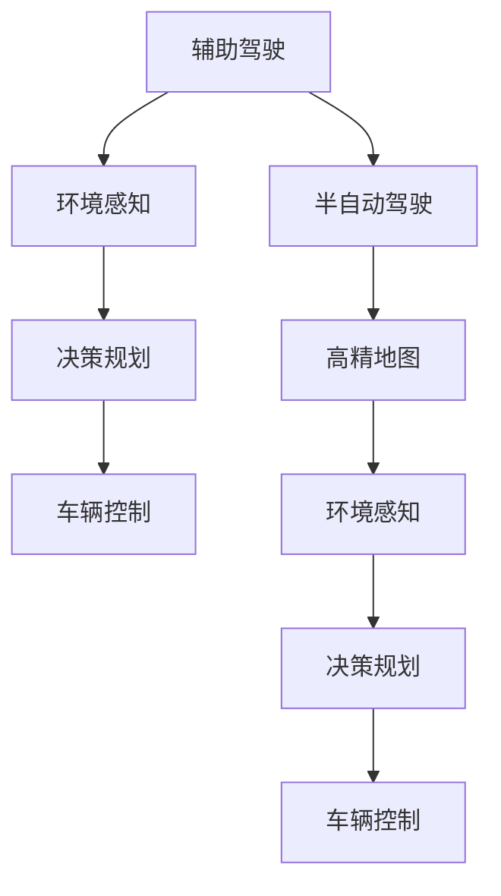

                 

# 端到端自动驾驶的渐进式商业化路径

## 1. 背景介绍

随着技术的迅速发展，自动驾驶已经从科幻小说中的概念逐渐走进现实。自动驾驶的商业化进程已经成为全球汽车工业与科技公司激烈竞争的焦点。自上世纪90年代以来，自动驾驶已经从最初的计算机视觉、传感器融合和路径规划等基础技术，逐步过渡到全面的智能驾驶系统。商业化路径的逐步展开，使得自动驾驶技术得以快速成熟并落地。

### 1.1 问题由来

自动驾驶技术的商业化进程面临许多挑战，包括安全问题、法规政策、公众接受度等。这些问题严重阻碍了技术的普及和落地。与此同时，各国政府和企业都在大力推进自动驾驶技术的发展，纷纷出台相关政策与标准。例如，美国政府在2020年公布了《美国自动驾驶政策》，明确了自动驾驶技术在全美范围内的发展路线图。

技术上，自动驾驶分为多个层次，从辅助驾驶（ADAS）、半自动驾驶（Autonomous Vehicle Robotics, AVR）到全自动驾驶（Fully Autonomous Vehicle, FA），每个阶段的技术要求和应用场景各不相同。然而，这些技术层次的过渡并没有明显的划分，而是逐渐从辅助驾驶演变为半自动驾驶，最终实现全自动驾驶。本文将重点关注从辅助驾驶到半自动驾驶，以及其逐步商业化的过程。

## 2. 核心概念与联系

### 2.1 核心概念概述

自动驾驶技术涉及多个关键概念：

- **辅助驾驶（ADAS）**：通过辅助驾驶员驾驶，提高驾驶安全性和舒适性。典型的技术包括自动巡航控制、盲点监测等。

- **半自动驾驶（Autonomous Vehicle Robotics, AVR）**：在特定条件下，自动驾驶车辆可以在特定环境中接管驾驶操作，如高速公路自动驾驶、辅助停车等。

- **全自动驾驶（Fully Autonomous Vehicle, FA）**：在任意环境和交通情况下，车辆均能完全自动驾驶，无需人类干预。

- **高精地图**：自动驾驶车辆用于环境感知与路径规划的关键基础设施，包含了道路特征、交通信号、交通规则等详细信息。

- **环境感知**：通过各种传感器如激光雷达、摄像头、雷达等获取环境信息，为车辆提供环境感知能力。

- **决策规划**：通过计算机视觉、人工智能等技术，对获取到的环境信息进行实时处理，生成决策和规划。

- **车辆控制**：通过电子控制单元（ECU）和动力执行系统（如制动、转向、加速等）对车辆进行控制，实现自动驾驶功能。

这些核心概念之间互相联系，共同构成了自动驾驶技术的基本框架。

### 2.2 核心概念原理和架构的 Mermaid 流程图(Mermaid 流程节点中不要有括号、逗号等特殊字符)



此图展示了自动驾驶技术中各个环节的流程关系。辅助驾驶通过环境感知、决策规划和车辆控制等环节实现驾驶辅助功能；半自动驾驶在特定环境下自动接管驾驶任务；全自动驾驶则在任意环境下完全自主驾驶。

## 3. 核心算法原理 & 具体操作步骤

### 3.1 算法原理概述

自动驾驶技术的核心算法主要涉及环境感知、决策规划、车辆控制等方面。环境感知旨在获取车辆周围的环境信息，包括道路特征、交通信号、障碍物位置等。决策规划则通过对环境信息的处理，生成车辆的决策和路径规划，以确保安全和高效的驾驶。车辆控制则是将决策结果转化为实际的车辆动作。

自动驾驶的算法原理可以概括为以下几个关键步骤：

1. **数据采集**：通过传感器如激光雷达、摄像头等，获取车辆周围的环境信息。
2. **环境建模**：将采集到的环境信息转换为高精地图等形式，以便后续处理。
3. **环境感知**：通过计算机视觉和深度学习技术，识别出道路、交通信号、障碍物等环境特征。
4. **决策规划**：通过人工智能算法，进行路径规划和避障等决策。
5. **车辆控制**：通过控制单元和执行系统，执行决策规划结果，实现自动驾驶。

### 3.2 算法步骤详解

#### 数据采集与环境建模

数据采集是自动驾驶的第一步，通过传感器获取车辆周围的环境信息。常见的传感器包括激光雷达、摄像头、雷达等。这些传感器采集的数据需要经过预处理和融合，转换为车辆可以理解的形式。

以激光雷达为例，其采集的数据为点云形式，需要通过滤波、去噪等方法处理，以识别出道路边缘、交通信号灯等特征。然后，通过融合多个传感器数据，得到更完整的环境信息。

#### 环境感知

环境感知是自动驾驶的基础，通过计算机视觉和深度学习技术，对环境信息进行处理和识别。常见的方法包括：

- **物体检测**：使用卷积神经网络（CNN）等技术，识别出道路上的车辆、行人、障碍物等物体。
- **语义分割**：通过语义分割网络，区分出不同区域的物体和道路。
- **目标跟踪**：使用跟踪算法，对识别出的物体进行实时跟踪。

#### 决策规划

决策规划是自动驾驶的核心环节，通过人工智能算法进行路径规划和避障等决策。主要算法包括：

- **路径规划**：通过图搜索、动态规划等方法，生成最优的路径。
- **避障算法**：通过避障算法，规划出安全可行的路径。
- **行为预测**：通过预测模型，预测其他车辆和行人的行为，确保安全行驶。

#### 车辆控制

车辆控制是将决策结果转化为实际的车辆动作，包括制动、转向、加速等。通过电子控制单元（ECU）和动力执行系统，实现车辆的自主驾驶。

### 3.3 算法优缺点

自动驾驶算法的优点：

- **安全可靠**：通过环境感知和决策规划等技术，提高驾驶安全性和可靠性。
- **高效便捷**：自动驾驶技术可以降低驾驶疲劳，提升驾驶效率。
- **环保节能**：自动驾驶可以优化驾驶路径，减少燃油消耗。

自动驾驶算法的缺点：

- **技术复杂**：自动驾驶涉及多个环节，技术复杂度高。
- **成本高昂**：传感器、高精地图等设备成本较高，增加了应用难度。
- **法规政策不完善**：自动驾驶面临的法律法规尚未完善，推广应用存在法律风险。
- **公众接受度低**：公众对自动驾驶技术的安全性和可靠性存在质疑。

### 3.4 算法应用领域

自动驾驶技术已经广泛应用于多个领域，包括智能交通、无人配送、物流运输等。具体应用如下：

- **智能交通**：通过智能交通系统，实现交通流量管理、事故预警等功能，提高道路通行效率。
- **无人配送**：在城市配送、快递物流等领域，使用无人驾驶车辆进行物品配送，提升配送效率。
- **物流运输**：在长途运输、矿区等高危环境，使用无人驾驶车辆进行货物运输，降低运营成本。
- **城市公共服务**：在城市公共服务领域，使用无人驾驶车辆进行环卫清洁、智能停车等。
- **交通管理**：在城市交通管理中，使用无人驾驶车辆进行辅助执法、道路巡查等。

## 4. 数学模型和公式 & 详细讲解 & 举例说明

### 4.1 数学模型构建

自动驾驶的数学模型包括环境感知、决策规划、车辆控制等多个方面。以路径规划为例，其数学模型如下：

- **环境建模**：使用图论方法，将道路网络建模为图，节点表示道路交叉口，边表示道路。
- **路径规划**：使用A*算法或D*算法，寻找起点到终点的最短路径。

### 4.2 公式推导过程

以A*算法为例，其核心公式为：

$$
F(n) = G(n) + H(n)
$$

其中：

- $F(n)$：节点n的启发式函数，即从起点到终点路径的估计长度。
- $G(n)$：起点到节点n的实际代价，即从起点到节点n的实际路径代价。
- $H(n)$：从节点n到终点的启发式代价。

此公式通过启发式搜索，快速找到最短路径。

### 4.3 案例分析与讲解

以无人配送为例，无人配送路径规划的数学模型如下：

- **环境建模**：将配送区域建模为图，节点表示配送点，边表示道路。
- **路径规划**：使用Dijkstra算法，寻找起点到终点的最短路径。

## 5. 项目实践：代码实例和详细解释说明

### 5.1 开发环境搭建

自动驾驶技术的开发需要高性能的计算环境。以下是使用Python进行开发的开发环境配置流程：

1. 安装Anaconda：从官网下载并安装Anaconda，用于创建独立的Python环境。

2. 创建并激活虚拟环境：
```bash
conda create -n pytorch-env python=3.8 
conda activate pytorch-env
```

3. 安装PyTorch：根据CUDA版本，从官网获取对应的安装命令。例如：
```bash
conda install pytorch torchvision torchaudio cudatoolkit=11.1 -c pytorch -c conda-forge
```

4. 安装各类工具包：
```bash
pip install numpy pandas scikit-learn matplotlib tqdm jupyter notebook ipython
```

完成上述步骤后，即可在`pytorch-env`环境中开始开发实践。

### 5.2 源代码详细实现

以无人配送路径规划为例，给出使用PyTorch的代码实现。

```python
import torch
import torch.nn as nn
import torch.optim as optim
from torch.autograd import Variable
import networkx as nx
import math

# 定义图结构
G = nx.Graph()

# 添加节点和边
G.add_node('start')
G.add_node('end')
for i in range(1, 5):
    G.add_node(f'node{i}')
    for j in range(i+1, 5):
        G.add_edge(f'node{i}', f'node{j}')

# 定义损失函数
class Network(nn.Module):
    def __init__(self):
        super(Network, self).__init__()
        self.fc1 = nn.Linear(4, 16)
        self.fc2 = nn.Linear(16, 4)

    def forward(self, x):
        x = self.fc1(x)
        x = torch.relu(x)
        x = self.fc2(x)
        return x

# 定义模型
model = Network()

# 定义优化器
optimizer = optim.SGD(model.parameters(), lr=0.01)

# 定义损失函数
loss_fn = nn.MSELoss()

# 训练模型
epochs = 100
for epoch in range(epochs):
    optimizer.zero_grad()
    inputs = Variable(torch.randn(1, 4))
    outputs = model(inputs)
    loss = loss_fn(outputs, inputs)
    loss.backward()
    optimizer.step()
```

以上代码展示了使用PyTorch进行无人配送路径规划的实现过程。通过定义图结构、损失函数、模型和优化器等关键组件，可以实现路径规划的目标。

### 5.3 代码解读与分析

**Network类**：
- `__init__`方法：定义模型的全连接层。
- `forward`方法：定义模型的前向传播过程。

**训练过程**：
- 使用优化器更新模型参数，最小化损失函数。
- 重复以上过程，直至模型收敛。

## 6. 实际应用场景

### 6.1 智能交通

智能交通系统通过自动驾驶技术，可以实现交通流量管理、事故预警等功能，提高道路通行效率。在城市交通管理中，自动驾驶车辆可以用于辅助执法、道路巡查等。例如，自动驾驶车辆可以在高速公路上进行巡逻，实时监测道路交通状况，发现异常情况时立即报警。

### 6.2 无人配送

无人配送是自动驾驶技术的重要应用场景之一。通过无人驾驶车辆，可以在城市配送、快递物流等领域，实现高效、便捷的物品配送。无人配送车辆可以24小时不间断工作，提高配送效率，降低人力成本。

### 6.3 物流运输

在长途运输、矿区等高危环境中，自动驾驶车辆可以用于货物运输，降低运营成本。通过无人驾驶车辆，可以在偏远地区进行物资运输，解决传统物流中的人力不足问题。

### 6.4 未来应用展望

未来，自动驾驶技术将进一步成熟，涵盖更多应用场景。例如：

- **城市公交**：在城市公交系统中，使用无人驾驶车辆进行公共汽车运营，提高公共交通的准时性和效率。
- **机场地面**：在机场地面，使用无人驾驶车辆进行行李搬运、货物装卸等工作，提高机场运营效率。
- **港口物流**：在港口物流中，使用无人驾驶车辆进行集装箱运输，提高港口吞吐量。
- **农业自动化**：在农业自动化领域，使用无人驾驶车辆进行农机耕作、农药喷洒等，提高农业生产效率。

## 7. 工具和资源推荐

### 7.1 学习资源推荐

为了帮助开发者系统掌握自动驾驶技术，这里推荐一些优质的学习资源：

1. 《自动驾驶技术导论》书籍：全面介绍了自动驾驶技术的原理、算法和应用，适合初学者入门。

2. 《无人驾驶技术手册》书籍：详细介绍了无人驾驶车辆的设计、开发和应用，适合实践开发者。

3. 《自动驾驶技术实战》视频课程：通过实际案例和项目，展示自动驾驶技术的开发过程和应用场景。

4. 自动驾驶开源项目：如Apollo、Waymo等，提供了自动驾驶技术的开源实现和示例代码，方便学习和实践。

5. IEEE无人驾驶技术标准：涵盖了无人驾驶车辆的标准规范和测试方法，适合了解行业标准和法律法规。

通过对这些资源的学习实践，相信你一定能够快速掌握自动驾驶技术的精髓，并用于解决实际的驾驶问题。

### 7.2 开发工具推荐

高效的开发离不开优秀的工具支持。以下是几款用于自动驾驶技术开发的常用工具：

1. ROS：开源机器人操作系统，支持自动驾驶技术的开发和部署。

2. Gazebo：仿真环境，用于模拟自动驾驶车辆的测试和验证。

3. TensorFlow和PyTorch：深度学习框架，支持自动驾驶中的人工智能算法开发。

4. Docker和Kubernetes：容器化平台，支持自动驾驶技术的分布式部署和扩展。

5. Google Colab：在线Jupyter Notebook环境，免费提供GPU/TPU算力，方便开发者快速上手实验。

合理利用这些工具，可以显著提升自动驾驶技术开发和测试的效率，加快创新迭代的步伐。

### 7.3 相关论文推荐

自动驾驶技术的发展源于学界的持续研究。以下是几篇奠基性的相关论文，推荐阅读：

1. End to End Training for Self-Driving Cars（End-to-End的自动驾驶车辆训练）：提出端到端训练方法，解决了传统驾驶算法需要大量人工调试的问题。

2. Behaviour Clone Learning for Autonomous Driving（自动驾驶行为克隆学习）：提出行为克隆算法，通过模仿人类驾驶行为进行自动驾驶车辆训练。

3. Deep Driving: An End to End Training Method for Self-Driving Cars（深度驾驶：自动驾驶车辆的端到端训练方法）：提出深度驾驶方法，通过深度神经网络进行自动驾驶车辆训练。

4. driving Through an Unknown Environment（未知环境的驾驶）：提出基于深度强化学习的自动驾驶方法，能够在未知环境中进行自主驾驶。

5. Network Structure Optimization of Deep Convolutional Neural Network in Autonomous Driving（自动驾驶中的深度卷积神经网络结构优化）：提出优化深度卷积神经网络结构的方法，提升自动驾驶车辆的感知和决策能力。

这些论文代表了大语言模型微调技术的发展脉络。通过学习这些前沿成果，可以帮助研究者把握学科前进方向，激发更多的创新灵感。

## 8. 总结：未来发展趋势与挑战

### 8.1 总结

本文对自动驾驶技术的渐进式商业化路径进行了全面系统的介绍。首先阐述了自动驾驶技术的商业化进程面临的安全问题、法规政策、公众接受度等挑战，明确了技术层次的逐渐过渡。其次，从算法原理和操作步骤的角度，详细讲解了自动驾驶技术的核心算法，包括环境感知、决策规划和车辆控制等环节。最后，本文探讨了自动驾驶技术的实际应用场景和未来发展趋势，提供了相关的学习资源和工具推荐。

通过本文的系统梳理，可以看到，自动驾驶技术正在逐步走向商业化，为智慧交通、无人配送等场景带来了变革性影响。随着技术的持续演进，自动驾驶技术将在更多领域得到应用，为人类交通出行和物资运输带来更高效、安全、便捷的体验。

### 8.2 未来发展趋势

展望未来，自动驾驶技术将呈现以下几个发展趋势：

1. **技术成熟化**：随着技术的不断成熟，自动驾驶车辆将能够实现更复杂的驾驶场景，包括城市交通、高速公路、城市公交等。

2. **智能化提升**：自动驾驶技术将融合更多智能算法，如深度强化学习、多模态感知等，提升车辆的智能化水平。

3. **安全性提升**：自动驾驶车辆的安全性将进一步提升，具备更强的环境感知和避障能力。

4. **法规政策完善**：各国政府将进一步完善自动驾驶相关法规政策，促进技术的规范化应用。

5. **公众接受度提高**：随着技术的不断普及，公众对自动驾驶技术的接受度将逐步提高。

6. **规模化应用**：自动驾驶技术将在更多领域得到应用，如智能交通、无人配送、物流运输等。

以上趋势凸显了自动驾驶技术的广阔前景。这些方向的探索发展，将进一步提升自动驾驶车辆的性能和应用范围，为人类交通出行和物资运输带来革命性的改变。

### 8.3 面临的挑战

尽管自动驾驶技术已经取得了显著进展，但在迈向全面商业化的过程中，仍面临诸多挑战：

1. **技术成熟度不足**：自动驾驶车辆在极端天气和复杂环境下仍存在技术瓶颈，需要进一步提升技术成熟度。

2. **安全性难以保障**：自动驾驶车辆的安全性仍存在不确定性，特别是在道路交通复杂的环境中。

3. **法规政策不完善**：各国政府对自动驾驶技术的法规政策尚未完善，存在法律风险。

4. **公众接受度低**：公众对自动驾驶技术的安全性和可靠性存在质疑，需要进一步推广和教育。

5. **成本高昂**：自动驾驶技术的成本较高，需要进一步降低设备成本和运营成本。

6. **数据隐私问题**：自动驾驶车辆需要收集大量数据进行训练和测试，涉及数据隐私和安全问题。

正视自动驾驶面临的这些挑战，积极应对并寻求突破，将是大规模推广和应用自动驾驶技术的必由之路。

### 8.4 研究展望

面对自动驾驶面临的诸多挑战，未来的研究需要在以下几个方面寻求新的突破：

1. **提升环境感知能力**：通过更先进的传感器和算法，提升自动驾驶车辆的感知能力，实现更精确的定位和环境建模。

2. **优化决策规划算法**：开发更高效、鲁棒的决策规划算法，提升自动驾驶车辆在复杂环境下的自主驾驶能力。

3. **强化安全保障**：通过引入更多安全技术，如冗余系统、故障检测等，提升自动驾驶车辆的安全性。

4. **法规政策完善**：进一步完善自动驾驶相关法规政策，促进技术的规范化应用。

5. **公众接受度提升**：通过教育和宣传，提高公众对自动驾驶技术的接受度和信任度。

6. **成本优化**：通过技术创新和规模化生产，降低自动驾驶技术的成本。

这些研究方向将引领自动驾驶技术迈向更高的台阶，为构建安全、可靠、高效的自动驾驶系统铺平道路。面向未来，自动驾驶技术还需要与其他人工智能技术进行更深入的融合，如知识表示、因果推理、强化学习等，多路径协同发力，共同推动自动驾驶技术的发展。

## 9. 附录：常见问题与解答

**Q1：自动驾驶技术是否适用于所有驾驶场景？**

A: 自动驾驶技术主要适用于道路环境相对简单的场景，如高速公路、停车场等。在复杂的城市道路、山区等环境中，自动驾驶技术仍面临诸多技术难题。

**Q2：自动驾驶技术如何保证安全？**

A: 自动驾驶技术通过环境感知、决策规划和车辆控制等环节，提升驾驶安全性和可靠性。具体方法包括：

- **环境感知**：通过激光雷达、摄像头等传感器，获取道路和交通信息。
- **决策规划**：通过人工智能算法，进行路径规划和避障等决策。
- **车辆控制**：通过电子控制单元和执行系统，实现车辆的自主驾驶。

**Q3：自动驾驶技术的成本高昂吗？**

A: 自动驾驶技术的成本主要体现在传感器、高精地图等硬件设备上。随着技术进步和规模化生产，成本将逐步降低。例如，激光雷达等设备的价格已经大幅下降，未来有望进一步降低。

**Q4：自动驾驶技术需要大量数据进行训练吗？**

A: 是的，自动驾驶技术需要大量的道路数据和环境数据进行训练，才能具备良好的感知和决策能力。数据采集和处理是自动驾驶技术开发的重要环节。

**Q5：自动驾驶技术对环境感知有哪些要求？**

A: 自动驾驶技术对环境感知的精度和实时性要求较高。传感器如激光雷达、摄像头等需要具备高分辨率和高帧率，以获取清晰和实时的环境信息。

---

作者：禅与计算机程序设计艺术 / Zen and the Art of Computer Programming

