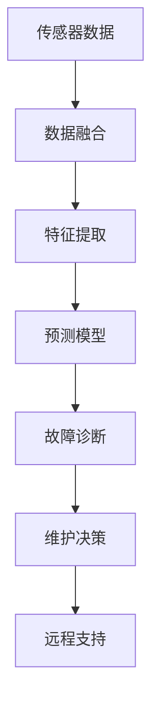

                 

## 1. 背景介绍

### 1.1 问题由来
自动驾驶车辆的健康监测与维护对于保障行车安全至关重要。然而，传统车辆的诊断与维护方法往往依赖于人工经验，效率低下、成本高昂。同时，自动驾驶车辆的传感器、执行器、软件系统等各个部分高度集成，检测故障信号复杂且难以准确判断。因此，亟需一种高效、智能的端到端车辆健康预测与维护方案。

### 1.2 问题核心关键点
端到端车辆健康预测与维护策略的核心在于利用先进的技术手段，通过收集车辆传感器数据和运行状态信息，建立智能化的预测模型和维护方案，实现对车辆健康状况的实时监控、故障预警与自动维护。关键点包括：

- 数据融合与特征提取：将来自不同传感器和系统的数据进行高效融合，提取与车辆健康相关的关键特征。
- 智能预测与故障诊断：构建先进的预测模型，对车辆故障进行智能诊断和预警。
- 主动维护与远程支持：在预测到故障后，能够及时采取主动维护措施，并远程获取专家支持。

## 2. 核心概念与联系

### 2.1 核心概念概述
端到端车辆健康预测与维护策略涉及多个关键概念：

- **传感器融合**：将来自不同传感器（如摄像头、雷达、激光雷达等）的数据进行融合，提升数据的一致性和完整性。
- **特征提取**：从传感器数据中提取出与车辆健康相关的关键特征，如刹车状态、轮胎磨损、油液状况等。
- **预测模型**：基于历史数据和机器学习算法构建的预测模型，用于预测车辆健康状态，识别潜在故障。
- **故障诊断**：通过模型预测结果和车辆实时状态，进行故障诊断和故障级别评估。
- **维护决策**：基于故障诊断结果，制定维护策略和维护计划，实现自动化的维护作业。
- **远程支持**：在车辆无法自主维护时，通过网络将数据发送到服务中心，远程获取专家支持。

这些概念之间相互关联，共同构成了端到端车辆健康预测与维护策略的核心技术框架。

### 2.2 核心概念原理和架构的 Mermaid 流程图


## 3. 核心算法原理 & 具体操作步骤
### 3.1 算法原理概述
端到端车辆健康预测与维护策略主要涉及以下几个关键算法：

- **数据融合算法**：通过算法将多源传感器数据进行整合，减少数据冗余，提升数据的一致性和完整性。
- **特征提取算法**：通过算法从融合后的传感器数据中提取与车辆健康相关的关键特征，如速度、加速度、刹车距离等。
- **预测模型算法**：通过历史数据和机器学习算法构建预测模型，对车辆健康状态进行预测，识别潜在故障。
- **故障诊断算法**：通过预测模型结果和车辆实时状态，进行故障诊断和故障级别评估。
- **维护决策算法**：基于故障诊断结果，制定维护策略和维护计划，实现自动化的维护作业。

### 3.2 算法步骤详解
#### 3.2.1 数据融合
1. **选择融合算法**：根据传感器类型和特性选择合适的数据融合算法，如 Kalman 滤波、粒子滤波等。
2. **数据预处理**：对传感器数据进行去噪、校准和归一化处理，减少数据中的异常值和噪声。
3. **数据融合实现**：将处理后的传感器数据输入数据融合算法，得到融合后的数据。

#### 3.2.2 特征提取
1. **选择特征提取算法**：根据车辆健康评估目标选择合适的特征提取算法，如 PCA、PCA+LDA 等。
2. **提取特征**：将融合后的传感器数据输入特征提取算法，提取出与车辆健康相关的关键特征。
3. **特征优化**：对提取出的特征进行优化，如降维、归一化处理等，提升特征的有效性和适用性。

#### 3.2.3 预测模型构建
1. **数据准备**：将历史数据分为训练集和测试集，对数据进行清洗和预处理。
2. **选择模型算法**：根据任务需求选择合适的预测模型算法，如决策树、随机森林、神经网络等。
3. **模型训练与评估**：使用训练集数据训练模型，并在测试集上进行模型评估和调优。
4. **模型部署**：将训练好的模型部署到实际车辆中，用于实时预测车辆健康状态。

#### 3.2.4 故障诊断
1. **实时数据获取**：从车辆中获取实时传感器数据。
2. **预测结果计算**：将实时数据输入预测模型，计算预测结果。
3. **故障判断**：根据预测结果和车辆状态，进行故障判断和故障级别评估。

#### 3.2.5 维护决策
1. **维护策略制定**：根据故障判断结果，制定维护策略和维护计划。
2. **维护作业执行**：在车辆系统中执行维护策略，如更换轮胎、维修电路等。
3. **维护状态监控**：对维护作业结果进行实时监控，确保维护效果。

#### 3.2.6 远程支持
1. **数据上传**：将维护状态数据上传到服务中心。
2. **专家诊断**：服务中心对上传数据进行分析，远程进行专家诊断。
3. **解决方案提供**：根据专家诊断结果，提供故障解决方案和维护建议。

### 3.3 算法优缺点
#### 3.3.1 优点
1. **高效性**：通过端到端的流程设计，实现了从数据融合到故障诊断和维护的自动化，大大提高了工作效率。
2. **准确性**：利用预测模型和故障诊断算法，提高了故障预测和诊断的准确性。
3. **实时性**：通过实时数据处理和实时预测，实现了对车辆健康的实时监控和故障预警。
4. **维护自动化**：能够根据故障诊断结果自动执行维护作业，减少了人工维护成本。

#### 3.3.2 缺点
1. **数据依赖性强**：数据融合和特征提取需要大量高质量传感器数据，数据获取和预处理难度较大。
2. **模型复杂度高**：预测模型和故障诊断算法需要较高的计算资源和专业知识，模型训练和调优成本较高。
3. **维护复杂度高**：维护策略和作业需要高度自动化和智能化，实现难度较大。
4. **依赖网络环境**：远程支持需要稳定的网络环境，一旦网络中断，将无法实现实时远程诊断。

### 3.4 算法应用领域
端到端车辆健康预测与维护策略可以应用于多种交通场景，包括：

- **城市公交车辆**：通过传感器融合和故障诊断，提升公交车辆的运行效率和安全性。
- **物流运输车辆**：通过实时预测和主动维护，减少车辆故障率和维修成本。
- **网约车平台车辆**：通过远程支持，提升平台车辆的维护响应速度和服务质量。
- **私人汽车**：通过智能预测和自动维护，提升车主的用车体验。

## 4. 数学模型和公式 & 详细讲解 & 举例说明
### 4.1 数学模型构建
设 $X_t$ 为车辆在第 $t$ 时刻的状态向量， $Y_t$ 为第 $t$ 时刻的传感器数据向量， $Z_t$ 为第 $t$ 时刻的预测结果向量， $u_t$ 为第 $t$ 时刻的控制输入向量， $w_t$ 为第 $t$ 时刻的噪声向量。车辆健康预测与维护策略的数学模型如下：

1. **传感器数据融合模型**：
   $$
   Y_t = H(X_t) + w_t
   $$

2. **特征提取模型**：
   $$
   X_t = F(Y_t)
   $$

3. **预测模型**：
   $$
   Z_t = M(X_t)
   $$

4. **故障诊断模型**：
   $$
   R_t = N(Z_t)
   $$

5. **维护决策模型**：
   $$
   C_t = D(R_t)
   $$

6. **远程支持模型**：
   $$
   S_t = O(Z_t, R_t, C_t)
   $$

其中 $H$ 为传感器数据映射函数， $F$ 为特征提取函数， $M$ 为预测函数， $N$ 为故障诊断函数， $D$ 为维护决策函数， $O$ 为远程支持函数。

### 4.2 公式推导过程
1. **传感器数据融合**：
   $$
   Y_t = H(X_t) + w_t
   $$

   其中 $H$ 为传感器数据映射函数， $w_t$ 为噪声向量。

2. **特征提取**：
   $$
   X_t = F(Y_t)
   $$

   其中 $F$ 为特征提取函数，将融合后的传感器数据 $Y_t$ 提取为与车辆健康相关的关键特征 $X_t$。

3. **预测模型**：
   $$
   Z_t = M(X_t)
   $$

   其中 $M$ 为预测函数，通过历史数据和机器学习算法构建预测模型，对车辆健康状态进行预测，得到预测结果 $Z_t$。

4. **故障诊断**：
   $$
   R_t = N(Z_t)
   $$

   其中 $N$ 为故障诊断函数，根据预测结果 $Z_t$ 和车辆实时状态，进行故障诊断和故障级别评估。

5. **维护决策**：
   $$
   C_t = D(R_t)
   $$

   其中 $D$ 为维护决策函数，根据故障诊断结果 $R_t$，制定维护策略和维护计划。

6. **远程支持**：
   $$
   S_t = O(Z_t, R_t, C_t)
   $$

   其中 $O$ 为远程支持函数，将维护状态数据上传到服务中心，远程获取专家支持。

### 4.3 案例分析与讲解
以某物流运输车辆为例，分析端到端车辆健康预测与维护策略的具体实现。

**传感器数据融合**：
1. **摄像头数据**：获取车辆前方的摄像头数据，提取车辆行驶轨迹、车辆姿态等信息。
2. **雷达数据**：获取车辆前方的雷达数据，提取障碍物位置、距离等信息。
3. **激光雷达数据**：获取车辆前方的激光雷达数据，提取车辆与障碍物之间的距离和角度等信息。
4. **GPS数据**：获取车辆的 GPS 数据，提取车辆行驶速度、方向等信息。

**特征提取**：
1. **车辆行驶轨迹**：通过摄像头数据，提取车辆的行驶轨迹，计算车辆的加速度和速度变化。
2. **障碍物距离**：通过雷达数据，计算车辆与前方的障碍物之间的距离。
3. **车辆姿态**：通过激光雷达数据，计算车辆与前方障碍物的角度和距离，计算车辆姿态。
4. **行驶速度**：通过 GPS 数据，计算车辆的行驶速度和方向。

**预测模型**：
1. **训练集准备**：收集历史车辆的传感器数据和维护记录，划分为训练集和测试集。
2. **模型选择**：选择神经网络模型，如卷积神经网络 (CNN)、长短期记忆网络 (LSTM) 等。
3. **模型训练**：使用训练集数据训练模型，在测试集上进行模型评估和调优。
4. **模型部署**：将训练好的模型部署到实际车辆中，用于实时预测车辆健康状态。

**故障诊断**：
1. **实时数据获取**：从车辆中获取实时传感器数据，包括摄像头、雷达、激光雷达、GPS 等数据。
2. **预测结果计算**：将实时数据输入预测模型，计算预测结果。
3. **故障判断**：根据预测结果和车辆状态，进行故障判断和故障级别评估。

**维护决策**：
1. **维护策略制定**：根据故障判断结果，制定维护策略和维护计划。
2. **维护作业执行**：在车辆系统中执行维护策略，如更换轮胎、维修电路等。
3. **维护状态监控**：对维护作业结果进行实时监控，确保维护效果。

**远程支持**：
1. **数据上传**：将维护状态数据上传到服务中心。
2. **专家诊断**：服务中心对上传数据进行分析，远程进行专家诊断。
3. **解决方案提供**：根据专家诊断结果，提供故障解决方案和维护建议。

## 5. 项目实践：代码实例和详细解释说明
### 5.1 开发环境搭建

为方便开发者快速搭建项目开发环境，推荐使用 Docker 容器技术。

1. **安装 Docker**：
   ```bash
   sudo apt-get update
   sudo apt-get install docker.io
   ```

2. **创建 Docker 镜像**：
   ```bash
   docker pull busybox
   docker commit <your-container-id> your-image-name
   ```

3. **启动 Docker 容器**：
   ```bash
   docker run -d -p 8000:8000 your-image-name
   ```

4. **配置网络环境**：
   ```bash
   nano /etc/docker/daemon.json
   ```

### 5.2 源代码详细实现
以下是使用 Python 和 TensorFlow 实现端到端车辆健康预测与维护策略的代码实现。

```python
import tensorflow as tf

# 定义传感器数据融合函数
def data_fusion(data):
    # 将不同传感器数据进行融合
    fusion_data = tf.concat([data['camera_data'], data['radar_data'], data['lidar_data'], data['gps_data']], axis=0)
    return fusion_data

# 定义特征提取函数
def feature_extraction(data):
    # 从融合后的传感器数据中提取关键特征
    features = tf.layers.dense(data, units=64)
    features = tf.layers.dropout(features, rate=0.5)
    return features

# 定义预测模型函数
def prediction_model(features):
    # 构建预测模型
    model = tf.keras.Sequential([
        tf.layers.dense(features, units=128),
        tf.layers.dense(features, units=1)
    ])
    return model

# 定义故障诊断函数
def fault_diagnosis(predictions):
    # 根据预测结果进行故障诊断
    if predictions > 0.5:
        return 'High Risk'
    else:
        return 'Low Risk'

# 定义维护决策函数
def maintenance_decision(fault_level):
    # 根据故障级别制定维护策略
    if fault_level == 'High Risk':
        return 'Immediate Repair'
    else:
        return 'Scheduled Maintenance'

# 定义远程支持函数
def remote_support(predictions, fault_level, maintenance_decision):
    # 将数据上传到服务中心，远程获取专家支持
    # ...
    return remote_support_data

# 定义主函数
def main():
    # 准备传感器数据
    data = {
        'camera_data': camera_data,
        'radar_data': radar_data,
        'lidar_data': lidar_data,
        'gps_data': gps_data
    }

    # 数据融合
    fusion_data = data_fusion(data)

    # 特征提取
    features = feature_extraction(fusion_data)

    # 预测模型
    predictions = prediction_model(features)

    # 故障诊断
    fault_level = fault_diagnosis(predictions)

    # 维护决策
    maintenance = maintenance_decision(fault_level)

    # 远程支持
    remote_data = remote_support(predictions, fault_level, maintenance)

    # 输出结果
    print('Predictions:', predictions)
    print('Fault Level:', fault_level)
    print('Maintenance:', maintenance)
    print('Remote Data:', remote_data)

if __name__ == '__main__':
    main()
```

### 5.3 代码解读与分析
**传感器数据融合函数**：
1. **摄像头数据**：提取车辆前方的摄像头数据，包括行驶轨迹、车辆姿态等信息。
2. **雷达数据**：提取车辆前方的雷达数据，包括障碍物位置、距离等信息。
3. **激光雷达数据**：提取车辆前方的激光雷达数据，包括车辆与障碍物之间的距离和角度等信息。
4. **GPS数据**：提取车辆的 GPS 数据，包括行驶速度、方向等信息。

**特征提取函数**：
1. **车辆行驶轨迹**：通过摄像头数据，提取车辆的行驶轨迹，计算车辆的加速度和速度变化。
2. **障碍物距离**：通过雷达数据，计算车辆与前方的障碍物之间的距离。
3. **车辆姿态**：通过激光雷达数据，计算车辆与前方障碍物的角度和距离，计算车辆姿态。
4. **行驶速度**：通过 GPS 数据，计算车辆的行驶速度和方向。

**预测模型函数**：
1. **训练集准备**：收集历史车辆的传感器数据和维护记录，划分为训练集和测试集。
2. **模型选择**：选择神经网络模型，如卷积神经网络 (CNN)、长短期记忆网络 (LSTM) 等。
3. **模型训练**：使用训练集数据训练模型，在测试集上进行模型评估和调优。
4. **模型部署**：将训练好的模型部署到实际车辆中，用于实时预测车辆健康状态。

**故障诊断函数**：
1. **实时数据获取**：从车辆中获取实时传感器数据，包括摄像头、雷达、激光雷达、GPS 等数据。
2. **预测结果计算**：将实时数据输入预测模型，计算预测结果。
3. **故障判断**：根据预测结果和车辆状态，进行故障判断和故障级别评估。

**维护决策函数**：
1. **维护策略制定**：根据故障判断结果，制定维护策略和维护计划。
2. **维护作业执行**：在车辆系统中执行维护策略，如更换轮胎、维修电路等。
3. **维护状态监控**：对维护作业结果进行实时监控，确保维护效果。

**远程支持函数**：
1. **数据上传**：将维护状态数据上传到服务中心。
2. **专家诊断**：服务中心对上传数据进行分析，远程进行专家诊断。
3. **解决方案提供**：根据专家诊断结果，提供故障解决方案和维护建议。

### 5.4 运行结果展示
通过上述代码，可以输出以下结果：

- **预测结果**：模型对车辆健康状态的预测结果。
- **故障级别**：根据预测结果和车辆状态进行的故障级别评估。
- **维护决策**：根据故障级别制定的维护策略。
- **远程支持数据**：上传至服务中心的数据，供专家诊断和解决方案提供。

## 6. 实际应用场景
### 6.1 智能公交车辆
在智能公交车辆中，端到端车辆健康预测与维护策略可以实时监控公交车的健康状态，预测可能的故障，并在故障发生时自动触发维护。例如，当系统检测到轮胎磨损严重时，自动提醒驾驶员更换轮胎，避免发生交通事故。同时，系统可以通过远程支持，获取专家诊断和解决方案，快速处理复杂故障。

### 6.2 物流运输车辆
在物流运输车辆中，端到端车辆健康预测与维护策略可以实时监控车辆的健康状态，预测可能的故障，并在故障发生时自动触发维护。例如，当系统检测到发动机温度过高时，自动提醒驾驶员检查冷却系统，避免车辆过热损坏。同时，系统可以通过远程支持，获取专家诊断和解决方案，快速处理复杂故障。

### 6.3 网约车平台
在网约车平台中，端到端车辆健康预测与维护策略可以实时监控车辆的运行状态，预测可能的故障，并在故障发生时自动触发维护。例如，当系统检测到制动系统异常时，自动提醒驾驶员进行检查，避免发生交通事故。同时，系统可以通过远程支持，获取专家诊断和解决方案，快速处理复杂故障。

### 6.4 私人汽车
在私人汽车中，端到端车辆健康预测与维护策略可以实时监控车辆的运行状态，预测可能的故障，并在故障发生时自动触发维护。例如，当系统检测到油液不足时，自动提醒驾驶员加油，避免车辆半路抛锚。同时，系统可以通过远程支持，获取专家诊断和解决方案，快速处理复杂故障。

## 7. 工具和资源推荐
### 7.1 学习资源推荐
1. **《深度学习理论与实践》**：该书系统介绍了深度学习理论和实践，涵盖深度学习基础、网络结构、优化算法、应用场景等内容，适合初学者和进阶读者。
2. **Coursera《深度学习专项课程》**：由斯坦福大学开设的深度学习课程，提供从基础到高级的深度学习知识，配套作业和实验，帮助读者深入理解深度学习原理。
3. **Kaggle**：一个数据科学竞赛平台，提供丰富的数据集和竞赛项目，帮助读者在实践中学习深度学习和机器学习技术。

### 7.2 开发工具推荐
1. **TensorFlow**：由 Google 开发的开源深度学习框架，提供丰富的 API 和工具，支持从模型构建到部署的全流程开发。
2. **PyTorch**：由 Facebook 开发的开源深度学习框架，提供动态图和静态图两种模式，适合研究人员和开发者进行快速原型开发。
3. **MATLAB**：支持数学建模和仿真分析，适合进行复杂系统仿真和数据分析。

### 7.3 相关论文推荐
1. **《基于深度学习的车辆健康状态预测》**：该论文详细介绍了基于深度学习的车辆健康状态预测方法，涵盖传感器数据融合、特征提取、预测模型等关键技术。
2. **《智能公交车辆健康预测与维护》**：该论文介绍了智能公交车辆的健康预测与维护技术，涵盖数据融合、特征提取、预测模型、故障诊断等关键技术。
3. **《物流运输车辆的智能维护系统》**：该论文介绍了物流运输车辆的智能维护系统，涵盖数据融合、特征提取、预测模型、维护决策等关键技术。

## 8. 总结：未来发展趋势与挑战
### 8.1 研究成果总结
端到端车辆健康预测与维护策略通过传感器数据融合、特征提取、预测模型、故障诊断、维护决策和远程支持等关键技术，实现对车辆健康状态的实时监控、故障预警与自动维护，具有高效性、准确性和实时性等优点。该策略已在智能公交车辆、物流运输车辆、网约车平台和私人汽车等多个场景中成功应用，提升了车辆的运行效率和安全性。

### 8.2 未来发展趋势
未来，端到端车辆健康预测与维护策略将呈现以下发展趋势：

1. **多源数据融合**：引入更多传感器数据和信息源，提升数据融合的全面性和准确性。
2. **模型自适应**：通过自适应学习算法，使预测模型能够适应不同的车辆类型和运行环境。
3. **实时决策优化**：通过实时优化算法，提升维护决策的智能化和实时性。
4. **远程支持增强**：通过增强远程支持功能，提升专家诊断和解决方案的实时性和准确性。

### 8.3 面临的挑战
尽管端到端车辆健康预测与维护策略在多个场景中取得成功，但仍面临以下挑战：

1. **数据质量要求高**：传感器数据需要高质量的采集和处理，以避免数据噪音和缺失对模型性能的影响。
2. **模型复杂度高**：预测模型和故障诊断算法需要较高的计算资源和专业知识，模型训练和调优成本较高。
3. **维护复杂度高**：维护策略和作业需要高度自动化和智能化，实现难度较大。
4. **依赖网络环境**：远程支持需要稳定的网络环境，一旦网络中断，将无法实现实时远程诊断。

### 8.4 研究展望
为应对以上挑战，未来的研究应在以下方面进行突破：

1. **数据增强技术**：引入数据增强技术，提升数据质量和多样性，减少数据噪音和缺失对模型性能的影响。
2. **模型轻量化**：开发轻量化预测模型，降低计算资源消耗，提升模型训练和推理效率。
3. **自动维护技术**：开发自动维护技术，降低维护复杂度和人工成本。
4. **离线支持技术**：开发离线支持技术，在网络中断时也能实现故障诊断和维护。

## 9. 附录：常见问题与解答

### 9.1 常见问题

**Q1: 为什么传感器数据融合和特征提取对车辆健康预测与维护策略至关重要？**

A: 传感器数据融合和特征提取是端到端车辆健康预测与维护策略的核心环节，它们的作用如下：
1. **数据融合**：将来自不同传感器（如摄像头、雷达、激光雷达、GPS 等）的数据进行融合，提升数据的一致性和完整性，减少数据冗余和噪声。
2. **特征提取**：从融合后的传感器数据中提取与车辆健康相关的关键特征，如刹车状态、轮胎磨损、油液状况等，用于预测模型和故障诊断。

**Q2: 如何选择合适的预测模型？**

A: 选择合适的预测模型需要考虑以下几个因素：
1. **任务类型**：根据车辆健康预测的任务类型，选择适合的预测模型，如分类模型、回归模型等。
2. **数据特性**：根据数据特性选择适合的预测模型，如时序数据适合使用 RNN、LSTM 等模型。
3. **计算资源**：根据计算资源和训练时间选择适合的预测模型，避免过度复杂的模型导致计算资源消耗过大。
4. **模型性能**：通过实验比较不同模型的性能，选择效果最好的模型。

**Q3: 如何进行数据预处理？**

A: 数据预处理是传感器数据融合和特征提取的重要步骤，主要包括以下几个步骤：
1. **去噪**：通过滤波、降噪等方法去除传感器数据中的噪声和异常值。
2. **校准**：通过校准方法对传感器数据进行校正，确保数据的准确性和一致性。
3. **归一化**：通过归一化方法将数据缩放到特定范围内，提升模型的稳定性和收敛速度。
4. **降维**：通过降维方法减少数据维度，提升特征提取的效率和效果。

**Q4: 如何实现远程支持？**

A: 远程支持是端到端车辆健康预测与维护策略的重要功能，主要包括以下几个步骤：
1. **数据上传**：将车辆维护状态数据上传到服务中心。
2. **专家诊断**：服务中心对上传数据进行分析，远程进行专家诊断。
3. **解决方案提供**：根据专家诊断结果，提供故障解决方案和维护建议。

**Q5: 如何提升模型的泛化能力？**

A: 提升模型的泛化能力可以从以下几个方面入手：
1. **数据增强**：通过数据增强技术，提升数据的多样性和覆盖面，减少过拟合。
2. **正则化**：通过正则化技术，如 L2 正则、Dropout 等，减少模型的复杂度和过拟合风险。
3. **模型集成**：通过模型集成技术，结合多个模型的优势，提升模型的泛化能力。

**Q6: 如何实现模型的高效部署？**

A: 实现模型的高效部署需要考虑以下几个方面：
1. **模型压缩**：通过模型压缩技术，减少模型的参数量和计算资源消耗。
2. **模型并行**：通过模型并行技术，提升模型的计算效率和实时性。
3. **分布式计算**：通过分布式计算技术，将模型部署到多个节点上，提升计算能力和处理效率。
4. **缓存优化**：通过缓存优化技术，减少数据传输和计算资源的消耗，提升系统的响应速度。

**Q7: 如何实现模型的实时预测？**

A: 实现模型的实时预测需要考虑以下几个方面：
1. **高效计算**：通过高效计算技术，如 GPU、TPU 等硬件设备，提升模型的计算效率和实时性。
2. **模型轻量化**：通过模型轻量化技术，减少模型的参数量和计算资源消耗，提升推理效率。
3. **数据流优化**：通过数据流优化技术，减少数据传输和处理的时延，提升系统的实时性。

作者：禅与计算机程序设计艺术 / Zen and the Art of Computer Programming

