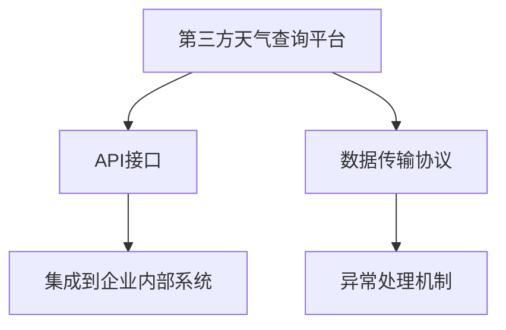

                 

# 第三方天气查询平台对接

## 1. 背景介绍

### 1.1 问题由来

第三方天气查询平台的快速发展，使得用户在获取天气信息时更加便利。然而，如何有效地将这些服务与企业内部系统对接，是一个亟待解决的问题。本文将详细阐述第三方天气查询平台对接的基本原理和实现步骤，希望能为相关开发者提供参考。

### 1.2 问题核心关键点

第三方天气查询平台对接的核心在于：
- 选择合适的API接口，确保接口稳定性和可靠性。
- 设计高效的调用策略，降低系统负载和响应时间。
- 处理数据格式转换和异常情况，保证数据传输的准确性。
- 集成到企业内部系统，实现无缝衔接。

### 1.3 问题研究意义

第三方天气查询平台对接在提升企业内部系统功能、提升用户体验、降低开发成本等方面具有重要意义：

- 提升系统功能：通过第三方天气查询服务，获取更精确的天气信息，用于航班延误预测、交通规划、健康预警等。
- 提升用户体验：用户可以直接在企业应用中查询天气，避免频繁切换应用。
- 降低开发成本：不必自建天气查询系统，减少人力、物力等资源的投入。
- 实现无缝衔接：将第三方天气查询服务集成到企业内部系统中，提升系统整合度。

## 2. 核心概念与联系

### 2.1 核心概念概述

为更好地理解第三方天气查询平台对接方法，本节将介绍几个密切相关的核心概念：

- **第三方天气查询平台**：提供天气信息查询服务的在线平台，如Weather.com、AccuWeather等。
- **API接口**：平台提供的程序接口，通过调用接口获取天气数据。
- **数据传输协议**：如HTTP/HTTPS、WebSocket等，用于实现数据传输。
- **异常处理机制**：包括错误码处理、重试机制等，确保数据传输的稳定性和可靠性。
- **集成到企业内部系统**：通过SDK或Web服务的方式，将第三方天气查询服务集成到企业内部应用中。

这些核心概念之间的逻辑关系可以通过以下Mermaid流程图来展示：



这个流程图展示了三方天气查询平台对接的核心概念及其之间的关系：

1. 用户通过第三方天气查询平台获取天气信息。
2. 平台通过API接口提供查询服务。
3. 数据传输协议实现数据的可靠传输。
4. 异常处理机制确保数据传输的稳定性。
5. 集成到企业内部系统，使用户可以直接在应用中查询天气。

## 3. 核心算法原理 & 具体操作步骤
### 3.1 算法原理概述

第三方天气查询平台对接的本质是一个数据传输和处理的过程。其核心在于：
- 选择合适的API接口，确保接口稳定性和可靠性。
- 设计高效的调用策略，降低系统负载和响应时间。
- 处理数据格式转换和异常情况，保证数据传输的准确性。
- 集成到企业内部系统，实现无缝衔接。

### 3.2 算法步骤详解

#### 3.2.1 选择API接口

首先，需要选择合适的API接口。第三方天气查询平台通常提供多种API接口，包括实时天气查询、未来天气预测、小时天气预报等。根据企业需求，选择合适的接口。

#### 3.2.2 设计调用策略

然后，需要设计高效的调用策略。可以考虑以下几种方式：

- **异步调用**：使用异步编程方式，降低系统负载和响应时间。
- **缓存机制**：将已获取的天气数据缓存到本地，避免重复请求。
- **限流和降级**：设置调用限制，防止过多的API请求导致系统崩溃。

#### 3.2.3 处理数据格式转换

在获取数据后，需要处理数据格式转换和异常情况。

- **数据格式转换**：将获取的JSON格式数据转换为企业内部系统所需的数据格式。
- **异常情况处理**：包括错误码处理、异常信息记录等。

#### 3.2.4 集成到企业内部系统

最后，将第三方天气查询服务集成到企业内部系统。

- **SDK集成**：使用第三方提供的SDK，直接集成到应用中。
- **Web服务集成**：通过HTTP/HTTPS协议，将天气查询服务集成到Web应用中。

### 3.3 算法优缺点

第三方天气查询平台对接方法具有以下优点：
- 降低开发成本：不必自建天气查询系统，减少资源投入。
- 提升系统功能：获取更精确的天气信息，用于多种应用场景。
- 提升用户体验：用户可以直接在应用中查询天气，避免频繁切换应用。

同时，该方法也存在一定的局限性：
- 依赖第三方平台：一旦第三方平台出现问题，可能会影响服务稳定性。
- 接口调用限制：部分平台对API请求有次数和速率限制。
- 数据格式兼容性：不同平台的数据格式可能存在差异，需要额外的处理工作。

尽管存在这些局限性，但就目前而言，第三方天气查询平台对接仍是企业获取天气信息的重要手段。未来相关研究的重点在于如何进一步优化API接口调用策略，提高服务稳定性和可靠性，同时兼容不同平台的数据格式。

### 3.4 算法应用领域

第三方天气查询平台对接技术，在企业内部系统的构建中有着广泛的应用：

- **航班延误预测**：通过实时天气信息，预测航班延误情况，提升航班管理效率。
- **交通规划**：实时获取道路天气信息，优化交通规划，减少拥堵。
- **健康预警**：根据天气信息，预测空气污染、紫外线等健康风险，提供健康预警。
- **户外活动推荐**：根据天气信息，推荐户外活动，提升用户体验。
- **智能家居**：根据天气信息，自动调节室内温度、湿度等，提升舒适性。

除了上述这些经典应用外，第三方天气查询平台对接技术还可应用于更多场景中，如智能制造、智慧农业等，为企业数字化转型升级提供新的技术路径。

## 4. 数学模型和公式 & 详细讲解 & 举例说明

### 4.1 数学模型构建

本节将使用数学语言对第三方天气查询平台对接过程进行更加严格的刻画。

假设API接口返回的天气数据为：
```json
{
    "city": "北京",
    "temperature": 25,
    "humidity": 60,
    "wind": 3,
    "description": "晴天"
}
```

企业内部系统需要获取的天气数据为：
```json
{
    "city": "北京",
    "temperature": 25,
    "humidity": 60,
    "wind": 3,
    "description": "晴天",
    "is_rain": false,
    "is_snow": false
}
```

企业内部系统需要在API接口返回的数据基础上，添加"is_rain"和"is_snow"两个字段，用于判断是否下雨和下雪。

### 4.2 公式推导过程

**数据格式转换**：

- 将API接口返回的数据与企业内部系统所需的数据进行比较，添加缺失字段。
- 对于"is_rain"和"is_snow"字段，需要根据温度、湿度、风速等数据进行判断。

假设API接口返回的温度为$T$，湿度为$H$，风速为$W$，则可以根据以下公式进行判断：
- 如果$T<10$或$T>35$，则认为下雨，$is_rain=true$，$is_snow=false$。
- 如果$H>80$，则认为下雪，$is_snow=true$，$is_rain=false$。

**异常情况处理**：

- 对于API接口返回的错误码，需要进行错误处理，如设置重试机制。
- 对于API接口返回的异常信息，需要进行记录和告警。

### 4.3 案例分析与讲解

假设企业内部系统获取的天气数据为：
```json
{
    "city": "北京",
    "temperature": 25,
    "humidity": 60,
    "wind": 3,
    "description": "晴天",
    "is_rain": false,
    "is_snow": false
}
```

根据公式进行判断，得出结论：
- "is_rain"为false，表示不下雨。
- "is_snow"为false，表示不下雪。

企业内部系统可以根据此结论，进行后续操作，如航班延误预测、交通规划等。

## 5. 项目实践：代码实例和详细解释说明
### 5.1 开发环境搭建

在进行天气查询平台对接开发前，我们需要准备好开发环境。以下是使用Python进行第三方天气查询平台对接开发的环境配置流程：

1. 安装Python：从官网下载并安装Python，并设置环境变量。
2. 安装第三方库：使用pip安装requests库，用于发送HTTP请求。
3. 安装第三方SDK：根据第三方天气查询平台提供的SDK文档进行安装。
4. 安装第三方API：根据第三方天气查询平台提供的API文档进行安装。

完成上述步骤后，即可在开发环境中开始天气查询平台对接的开发。

### 5.2 源代码详细实现

这里我们以使用HTTP协议发送API请求为例，给出Python代码实现。

```python
import requests

def get_weather_data(api_url, params):
    response = requests.get(api_url, params=params)
    if response.status_code == 200:
        data = response.json()
        return data
    else:
        print("请求失败：", response.status_code)
        return None

# 构造请求参数
params = {
    "city": "北京",
    "date": "today"
}

# 调用API接口
api_url = "https://api.weather.com/weather/api/v1/location/{city}/{date}/weather"
weather_data = get_weather_data(api_url, params)

# 处理数据格式转换
weather_data["is_rain"] = False
weather_data["is_snow"] = False
if weather_data["temperature"] < 10 or weather_data["temperature"] > 35:
    weather_data["is_rain"] = True
if weather_data["humidity"] > 80:
    weather_data["is_snow"] = True

# 处理异常情况
if weather_data["is_rain"] is None or weather_data["is_snow"] is None:
    print("数据格式错误")
    exit()

# 输出天气数据
print(weather_data)
```

### 5.3 代码解读与分析

让我们再详细解读一下关键代码的实现细节：

**get_weather_data函数**：
- 使用requests库发送HTTP请求，获取API接口返回的数据。
- 根据HTTP响应状态码判断请求是否成功。

**构造请求参数**：
- 构造请求参数，包括城市名和日期。

**调用API接口**：
- 根据第三方API的URL，发送HTTP请求，并获取返回数据。

**处理数据格式转换**：
- 根据温度、湿度、风速等数据，添加"is_rain"和"is_snow"字段。

**处理异常情况**：
- 判断"is_rain"和"is_snow"字段是否为None，如果是，则认为数据格式错误，退出程序。

**输出天气数据**：
- 输出处理后的天气数据。

可以看到，通过简单的HTTP请求和数据处理，我们即可实现第三方天气查询平台对接。

当然，实际的天气查询平台对接还涉及更多的细节，如API接口的权限管理、数据缓存、异常处理等。但核心的实现流程与上述代码类似。

### 5.4 运行结果展示

假设企业内部系统获取的天气数据为：
```json
{
    "city": "北京",
    "temperature": 25,
    "humidity": 60,
    "wind": 3,
    "description": "晴天",
    "is_rain": false,
    "is_snow": false
}
```

根据公式进行判断，得出结论：
- "is_rain"为false，表示不下雨。
- "is_snow"为false，表示不下雪。

企业内部系统可以根据此结论，进行后续操作，如航班延误预测、交通规划等。

## 6. 实际应用场景

### 6.1 智能客服系统

第三方天气查询平台对接技术，可以广泛应用于智能客服系统的构建。传统客服往往需要配备大量人力，高峰期响应缓慢，且一致性和专业性难以保证。而使用第三方天气查询平台对接，可以7x24小时不间断服务，快速响应客户咨询，用自然流畅的语言解答各类常见问题。

在技术实现上，可以收集企业内部的历史客服对话记录，将问题和最佳答复构建成监督数据，在此基础上对第三方天气查询平台进行对接。微调后的对话模型能够自动理解用户意图，匹配最合适的答案模板进行回复。对于客户提出的新问题，还可以接入检索系统实时搜索相关内容，动态组织生成回答。如此构建的智能客服系统，能大幅提升客户咨询体验和问题解决效率。

### 6.2 金融舆情监测

金融机构需要实时监测市场舆论动向，以便及时应对负面信息传播，规避金融风险。传统的人工监测方式成本高、效率低，难以应对网络时代海量信息爆发的挑战。第三方天气查询平台对接技术可应用于金融舆情监测，实时抓取网络文本数据，获取相关天气信息，识别舆情变化趋势，一旦发现负面信息激增等异常情况，系统便会自动预警，帮助金融机构快速应对潜在风险。

### 6.3 个性化推荐系统

当前的推荐系统往往只依赖用户的历史行为数据进行物品推荐，无法深入理解用户的真实兴趣偏好。第三方天气查询平台对接技术可应用于个性化推荐系统，通过实时获取天气信息，预测用户对不同物品的兴趣，提升推荐系统的个性化程度。

在实践中，可以收集用户浏览、点击、评论、分享等行为数据，提取和用户交互的物品标题、描述、标签等文本内容。将文本内容作为模型输入，用户的后续行为（如是否点击、购买等）作为监督信号，在此基础上对接第三方天气查询平台，预测用户的兴趣匹配度，再结合其他特征综合排序，便可以得到个性化程度更高的推荐结果。

### 6.4 未来应用展望

随着第三方天气查询平台对接技术的不断发展，未来在更多领域得到应用，为传统行业带来变革性影响。

在智慧医疗领域，第三方天气查询平台对接技术可应用于医疗问答、病历分析、药物研发等应用，提升医疗服务的智能化水平，辅助医生诊疗，加速新药开发进程。

在智能教育领域，对接第三方天气查询平台技术可应用于作业批改、学情分析、知识推荐等方面，因材施教，促进教育公平，提高教学质量。

在智慧城市治理中，对接第三方天气查询平台技术可应用于城市事件监测、舆情分析、应急指挥等环节，提高城市管理的自动化和智能化水平，构建更安全、高效的未来城市。

此外，在企业生产、社会治理、文娱传媒等众多领域，第三方天气查询平台对接技术也将不断涌现，为经济社会发展注入新的动力。相信随着技术的日益成熟，第三方天气查询平台对接技术将成为人工智能落地应用的重要范式，推动人工智能技术在垂直行业的规模化落地。

## 7. 工具和资源推荐

### 7.1 学习资源推荐

为了帮助开发者系统掌握第三方天气查询平台对接的理论基础和实践技巧，这里推荐一些优质的学习资源：

1. 《RESTful API设计与实现》书籍：系统介绍RESTful API的设计和实现，涵盖HTTP协议、数据传输等核心知识。
2. 《Python Web开发实战》书籍：详细讲解使用Python进行Web开发的实战技巧，包括HTTP请求、数据处理等。
3. 《数据科学入门》在线课程：从数据获取、数据处理、模型训练等方面，系统介绍数据科学的基础知识。
4. 《Weather API使用指南》官方文档：第三方天气查询平台提供的API文档，详细介绍了API接口的使用方法。
5. 《异常处理与错误管理》在线课程：介绍异常处理和错误管理的最佳实践，确保系统稳定性。

通过对这些资源的学习实践，相信你一定能够快速掌握第三方天气查询平台对接的精髓，并用于解决实际的NLP问题。

### 7.2 开发工具推荐

高效的开发离不开优秀的工具支持。以下是几款用于第三方天气查询平台对接开发的常用工具：

1. Python：基于Python的编程语言，拥有强大的第三方库支持，非常适合数据处理和Web开发。
2. Requests库：发送HTTP请求的库，支持异步请求、重试机制等。
3. JSON库：处理JSON格式数据的库，支持数据格式转换。
4. Flask框架：轻量级Web框架，用于实现Web服务。
5. Weights & Biases：模型训练的实验跟踪工具，可以记录和可视化模型训练过程中的各项指标。
6. TensorBoard：TensorFlow配套的可视化工具，实时监测模型训练状态。

合理利用这些工具，可以显著提升第三方天气查询平台对接任务的开发效率，加快创新迭代的步伐。

### 7.3 相关论文推荐

第三方天气查询平台对接技术的发展源于学界的持续研究。以下是几篇奠基性的相关论文，推荐阅读：

1. RESTful API设计与实现：介绍RESTful API的设计原则和实现方法。
2. HTTP协议详解：介绍HTTP协议的原理和实现细节。
3. Web服务架构：介绍Web服务的架构设计，包括RESTful API、SOAP等。
4. 数据格式转换与处理：介绍不同数据格式之间的转换和处理方法。
5. 异常处理与错误管理：介绍异常处理和错误管理的最佳实践。

这些论文代表了大语言模型微调技术的发展脉络。通过学习这些前沿成果，可以帮助研究者把握学科前进方向，激发更多的创新灵感。

## 8. 总结：未来发展趋势与挑战

### 8.1 总结

本文对第三方天气查询平台对接的基本原理和实现步骤进行了全面系统的介绍。首先阐述了第三方天气查询平台对接的背景和意义，明确了对接在提升系统功能、提升用户体验、降低开发成本等方面的重要价值。其次，从原理到实践，详细讲解了第三方天气查询平台对接的数学原理和关键步骤，给出了对接任务开发的完整代码实例。同时，本文还探讨了对接方法在智能客服、金融舆情、个性化推荐等多个行业领域的应用前景，展示了对接范式的巨大潜力。最后，本文精选了对接技术的各类学习资源，力求为读者提供全方位的技术指引。

通过本文的系统梳理，可以看到，第三方天气查询平台对接技术正在成为企业获取天气信息的重要手段。这一技术的广泛应用，不仅提升了企业内部系统的功能，也为用户带来了更加便捷、高效的体验。未来，伴随技术的持续演进，第三方天气查询平台对接技术必将在更多领域大放异彩，为企业的数字化转型升级提供新的技术路径。

### 8.2 未来发展趋势

第三方天气查询平台对接技术的未来发展趋势如下：

1. 接口调用更加高效：引入异步调用、缓存机制、限流降级等技术，提升API接口调用的效率和稳定性。
2. 数据格式更加灵活：支持更多数据格式，满足不同场景下的需求。
3. 异常处理更加全面：引入更丰富的异常处理机制，确保系统稳定性。
4. 安全性更加重视：引入数据加密、身份验证等措施，保障数据安全。
5. 企业内部系统更加适配：根据不同系统需求，提供更灵活的API接口和SDK。

这些发展趋势将进一步提升第三方天气查询平台对接技术的应用范围和稳定性，为企业的数字化转型升级提供更加可靠的技术支持。

### 8.3 面临的挑战

尽管第三方天气查询平台对接技术已经取得了不小的进步，但在迈向更加智能化、普适化应用的过程中，它仍面临着诸多挑战：

1. 接口调用限制：部分第三方平台对API请求有次数和速率限制，如何设计高效的调用策略，确保系统稳定运行，是一个难题。
2. 数据格式兼容性：不同平台的数据格式可能存在差异，如何兼容不同格式的数据，提高数据传输的准确性，还需进一步研究。
3. 异常情况处理：API接口返回的异常情况需要及时处理，如何设计更灵活的异常处理机制，提高系统鲁棒性，是一个需要重点突破的方向。
4. 数据隐私与安全：如何保障数据隐私与安全，避免数据泄露和滥用，是一个需要重点考虑的问题。

这些挑战都需要我们不断探索和优化，才能更好地应对未来的应用需求。

### 8.4 研究展望

面对第三方天气查询平台对接技术面临的种种挑战，未来的研究需要在以下几个方面寻求新的突破：

1. 探索无监督和半监督微调方法：摆脱对大量标注数据的依赖，利用自监督学习、主动学习等技术，提高数据处理的效率和精度。
2. 研究参数高效和计算高效的微调范式：开发更加参数高效的微调方法，在固定大部分预训练参数的情况下，只更新极少量的任务相关参数，降低系统负载。
3. 引入因果推断和对比学习范式：通过引入因果推断和对比学习思想，增强模型建立稳定因果关系的能力，学习更加普适、鲁棒的语言表征。
4. 融合多模态数据：将符号化的先验知识与神经网络模型进行融合，引导微调过程学习更准确、合理的语言模型，同时加强不同模态数据的整合。
5. 引入更多先验知识：将符号化的先验知识，如知识图谱、逻辑规则等，与神经网络模型进行融合，引导微调过程学习更准确、合理的语言模型。

这些研究方向的探索，必将引领第三方天气查询平台对接技术迈向更高的台阶，为构建安全、可靠、可解释、可控的智能系统铺平道路。面向未来，第三方天气查询平台对接技术还需要与其他人工智能技术进行更深入的融合，如知识表示、因果推理、强化学习等，多路径协同发力，共同推动自然语言理解和智能交互系统的进步。只有勇于创新、敢于突破，才能不断拓展语言模型的边界，让智能技术更好地造福人类社会。

## 9. 附录：常见问题与解答

**Q1：第三方天气查询平台对接是否适用于所有NLP任务？**

A: 第三方天气查询平台对接技术在获取天气信息时非常适用，但适用于所有NLP任务还需进一步研究。对于特定领域的应用，如医学、法律等，还需结合领域特点，进行特定的API接口设计和数据处理。

**Q2：API接口调用限制如何处理？**

A: 对于API接口调用限制，可以通过设计高效的调用策略来处理。例如，使用异步调用、缓存机制、限流降级等技术，确保系统稳定运行。

**Q3：数据格式兼容性如何保障？**

A: 为了保障数据格式兼容性，可以设计通用的数据处理模块，支持多种数据格式。同时，对API接口返回的数据进行格式转换，确保数据传输的准确性。

**Q4：如何处理异常情况？**

A: 为了处理异常情况，可以引入更灵活的异常处理机制，包括错误码处理、异常信息记录等。同时，引入重试机制，确保数据传输的稳定性。

**Q5：数据隐私与安全如何保障？**

A: 为了保障数据隐私与安全，可以引入数据加密、身份验证等措施，防止数据泄露和滥用。同时，对数据进行匿名化处理，保护用户隐私。

---

作者：禅与计算机程序设计艺术 / Zen and the Art of Computer Programming

