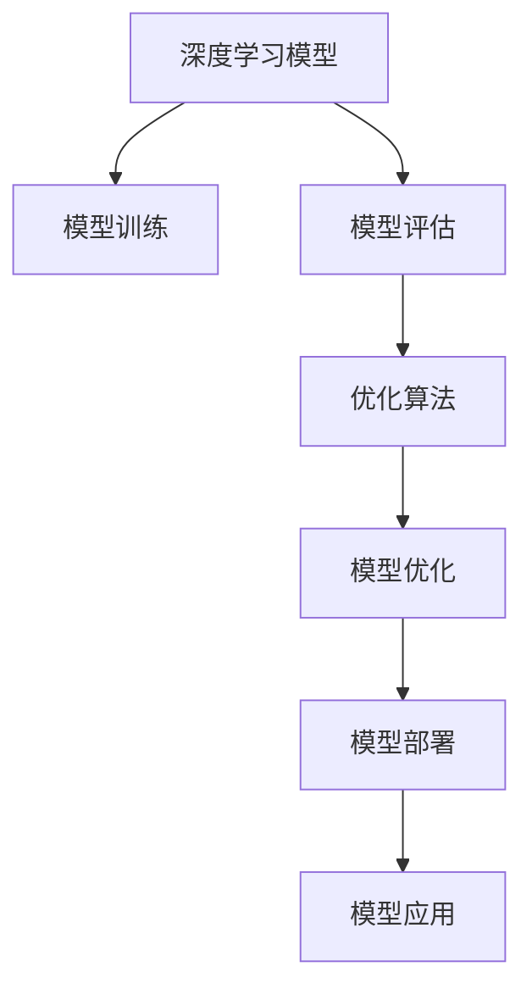

                 

# 算法不再由人设计，而是一个优化问题了

> 关键词：算法自动化, 优化, 自动化算法设计, 深度学习, 模型优化

## 1. 背景介绍

### 1.1 问题由来
随着人工智能技术的迅猛发展，算法设计已经成为科技公司争相攻克的核心领域。然而，传统的人工智能算法设计依赖于数据科学家和工程师的经验与直觉，过程繁琐且容易陷入局部最优。为了应对这一挑战，科学家们提出了"算法不再由人设计，而是一个优化问题"的新思路。

这一思路利用自动化和优化的手段，大幅提升了算法设计的效率和效果。通过自动化算法设计，可以缩短算法从构思到部署的时间周期，释放工程师的潜力，让他们专注于更高层次的战略决策。而优化算法，则通过不断迭代和调整，提升算法的精度和泛化能力，实现更卓越的性能。

### 1.2 问题核心关键点
本节将介绍几个核心关键点，以帮助读者更好地理解自动化算法设计的全貌：

- **自动化算法设计**：指使用算法自动化工具，自动化地生成、训练、评估、调优算法，减少人工干预，提升效率。
- **优化算法设计**：指通过优化算法，不断调整算法参数，寻找最优解，提升模型性能。
- **深度学习**：指利用神经网络等深度学习模型，从大量数据中学习高级抽象特征，实现自动化的算法设计。
- **模型优化**：指通过反向传播、梯度下降等优化算法，不断调整模型参数，提升模型在特定任务上的表现。
- **泛化能力**：指模型在不同数据集上的表现稳定性，即模型对未知数据的适应能力。
- **算法的解释性**：指模型能够提供合理的解释，让用户理解模型的决策过程。

这些关键点共同构成了算法自动化的基础框架，使其能够在大规模数据、复杂场景下，高效地设计出高质量的算法。

## 2. 核心概念与联系

### 2.1 核心概念概述

为更好地理解算法自动化和优化设计，本节将介绍几个密切相关的核心概念：

- **深度学习模型**：指利用多层神经网络进行自动特征提取和抽象，在图像识别、自然语言处理、语音识别等领域取得了巨大成功。
- **自动化算法设计(Automatic Algorithm Design, AAD)**：指使用算法自动化工具，自动生成、训练、评估、调优算法，提升算法设计效率和效果。
- **优化算法**：指通过迭代调整算法参数，寻找最优解的算法。常用的优化算法包括梯度下降、遗传算法、粒子群优化等。
- **模型评估**：指对模型性能进行定量或定性评估，以判断模型的好坏。常用的评估指标包括准确率、召回率、F1分数等。
- **模型优化**：指通过反向传播、梯度下降等优化算法，不断调整模型参数，提升模型性能。

这些核心概念之间的逻辑关系可以通过以下Mermaid流程图来展示：



这个流程图展示了深度学习模型的设计、训练、评估、优化和部署的流程。其中：

- 模型训练：指使用深度学习框架对模型进行训练，学习自动特征。
- 模型评估：指使用验证集等数据，评估模型在特定任务上的性能。
- 优化算法：指根据评估结果，不断调整模型参数，提升模型性能。
- 模型优化：指在特定任务上进行微调，进一步提升模型性能。
- 模型部署：指将优化后的模型应用于实际场景，进行业务处理。

## 3. 核心算法原理 & 具体操作步骤
### 3.1 算法原理概述

自动化算法设计的核心思想是通过优化算法，自动生成、训练、评估、调优算法，提升算法设计效率和效果。其基本流程如下：

1. **算法初始化**：随机生成或使用预训练模型作为初始化参数。
2. **模型训练**：使用训练数据对模型进行训练，学习自动特征。
3. **模型评估**：使用验证集对模型性能进行评估，计算评估指标。
4. **模型优化**：使用优化算法调整模型参数，提升模型性能。
5. **模型部署**：将优化后的模型应用于实际场景，进行业务处理。

这一过程主要依赖深度学习框架（如TensorFlow、PyTorch）提供的自动化工具和优化算法（如梯度下降、AdamW、RMSprop等）。

### 3.2 算法步骤详解

自动化算法设计的基本步骤如下：

**Step 1: 准备数据集和预训练模型**
- 准备数据集 $D=\{(x_i,y_i)\}_{i=1}^N, x_i \in \mathcal{X}, y_i \in \mathcal{Y}$，划分为训练集、验证集和测试集。
- 选择预训练模型 $M_{\theta}$ 作为初始化参数，如BERT、GPT等。

**Step 2: 设置超参数和优化器**
- 选择合适的优化算法及其参数，如 AdamW、SGD 等，设置学习率、批大小、迭代轮数等。
- 设置正则化技术及强度，包括权重衰减、Dropout、Early Stopping 等。
- 确定冻结预训练参数的策略，如仅微调顶层，或全部参数都参与微调。

**Step 3: 执行梯度训练**
- 将训练集数据分批次输入模型，前向传播计算损失函数。
- 反向传播计算参数梯度，根据设定的优化算法和学习率更新模型参数。
- 周期性在验证集上评估模型性能，根据性能指标决定是否触发 Early Stopping。
- 重复上述步骤直到满足预设的迭代轮数或 Early Stopping 条件。

**Step 4: 测试和部署**
- 在测试集上评估微调后模型 $M_{\hat{\theta}}$ 的性能，对比微调前后的精度提升。
- 使用微调后的模型对新样本进行推理预测，集成到实际的应用系统中。
- 持续收集新的数据，定期重新微调模型，以适应数据分布的变化。

以上是自动化算法设计的通用流程。在实际应用中，还需要根据具体任务的特点，对上述过程进行优化设计，如改进训练目标函数，引入更多的正则化技术，搜索最优的超参数组合等，以进一步提升模型性能。

### 3.3 算法优缺点

自动化算法设计具有以下优点：
1. 高效自动化。利用自动化工具，可以快速生成、训练、评估、调优算法，节省大量人力和时间。
2. 提升精度。通过不断的优化调整，模型能够获得更优的性能表现。
3. 广泛适用。适用于各类机器学习任务，如分类、回归、聚类等。
4. 模型解释性强。自动化算法设计过程透明，便于理解模型决策过程。

同时，该方法也存在一定的局限性：
1. 依赖大量数据。算法设计效果与数据质量和数量密切相关。
2. 模型泛化能力有限。预训练模型的泛化能力存在上限，难以适应完全不同的任务。
3. 可解释性不足。自动化的模型可能难以解释其内部工作机制，用户难以理解模型决策过程。
4. 可能需要先验知识。部分任务可能依赖于特定的领域知识，自动化算法难以满足。
5. 缺乏创新。自动化的模型设计过程，容易陷入局部最优，难以实现突破性创新。

尽管存在这些局限性，但就目前而言，自动化算法设计仍是大规模数据、复杂场景下，高效设计算法的最佳选择。未来相关研究的重点在于如何进一步降低算法设计对人工干预的依赖，提高模型的跨领域迁移能力，同时兼顾可解释性和伦理安全性等因素。

### 3.4 算法应用领域

自动化算法设计方法已经在诸多领域得到了广泛应用，涵盖数据科学、计算机视觉、自然语言处理等，为技术创新和产业应用提供了新思路。以下是一些典型应用：

- **图像识别**：如自动生成图像分类器，通过微调预训练模型获得高精度分类结果。
- **自然语言处理**：如自动生成文本生成模型，通过微调预训练模型生成高质量文本内容。
- **语音识别**：如自动生成语音识别模型，通过微调预训练模型实现高效语音转文本。
- **推荐系统**：如自动生成推荐算法，通过微调预训练模型提升个性化推荐效果。
- **数据挖掘**：如自动生成数据挖掘算法，通过微调预训练模型进行高效数据处理。
- **金融分析**：如自动生成金融预测模型，通过微调预训练模型进行财务分析。
- **医疗诊断**：如自动生成医学诊断模型，通过微调预训练模型进行疾病诊断。

除了上述这些经典应用外，自动化算法设计也被创新性地应用到更多场景中，如智能交通、智能家居、智慧城市等，为各行各业带来新的创新点。

## 4. 数学模型和公式 & 详细讲解  
### 4.1 数学模型构建

本节将使用数学语言对自动化算法设计的流程进行严格刻画。

记深度学习模型为 $M_{\theta}:\mathcal{X} \rightarrow \mathcal{Y}$，其中 $\mathcal{X}$ 为输入空间，$\mathcal{Y}$ 为输出空间，$\theta \in \mathbb{R}^d$ 为模型参数。假设训练集为 $D=\{(x_i,y_i)\}_{i=1}^N, x_i \in \mathcal{X}, y_i \in \mathcal{Y}$。

定义模型 $M_{\theta}$ 在输入 $x$ 上的损失函数为 $\ell(M_{\theta}(x),y)$，则在数据集 $D$ 上的经验风险为：

$$
\mathcal{L}(\theta) = \frac{1}{N}\sum_{i=1}^N \ell(M_{\theta}(x_i),y_i)
$$

微调的优化目标是最小化经验风险，即找到最优参数：

$$
\theta^* = \mathop{\arg\min}_{\theta} \mathcal{L}(\theta)
$$

在实践中，我们通常使用基于梯度的优化算法（如SGD、Adam等）来近似求解上述最优化问题。设 $\eta$ 为学习率，$\lambda$ 为正则化系数，则参数的更新公式为：

$$
\theta \leftarrow \theta - \eta \nabla_{\theta}\mathcal{L}(\theta) - \eta\lambda\theta
$$

其中 $\nabla_{\theta}\mathcal{L}(\theta)$ 为损失函数对参数 $\theta$ 的梯度，可通过反向传播算法高效计算。

### 4.2 公式推导过程

以下我们以二分类任务为例，推导交叉熵损失函数及其梯度的计算公式。

假设模型 $M_{\theta}$ 在输入 $x$ 上的输出为 $\hat{y}=M_{\theta}(x) \in [0,1]$，表示样本属于正类的概率。真实标签 $y \in \{0,1\}$。则二分类交叉熵损失函数定义为：

$$
\ell(M_{\theta}(x),y) = -[y\log \hat{y} + (1-y)\log (1-\hat{y})]
$$

将其代入经验风险公式，得：

$$
\mathcal{L}(\theta) = -\frac{1}{N}\sum_{i=1}^N [y_i\log M_{\theta}(x_i)+(1-y_i)\log(1-M_{\theta}(x_i))]
$$

根据链式法则，损失函数对参数 $\theta_k$ 的梯度为：

$$
\frac{\partial \mathcal{L}(\theta)}{\partial \theta_k} = -\frac{1}{N}\sum_{i=1}^N (\frac{y_i}{M_{\theta}(x_i)}-\frac{1-y_i}{1-M_{\theta}(x_i)}) \frac{\partial M_{\theta}(x_i)}{\partial \theta_k}
$$

其中 $\frac{\partial M_{\theta}(x_i)}{\partial \theta_k}$ 可进一步递归展开，利用自动微分技术完成计算。

在得到损失函数的梯度后，即可带入参数更新公式，完成模型的迭代优化。重复上述过程直至收敛，最终得到适应下游任务的最优模型参数 $\theta^*$。

## 5. 项目实践：代码实例和详细解释说明
### 5.1 开发环境搭建

在进行算法自动化设计实践前，我们需要准备好开发环境。以下是使用Python进行PyTorch开发的环境配置流程：

1. 安装Anaconda：从官网下载并安装Anaconda，用于创建独立的Python环境。

2. 创建并激活虚拟环境：
```bash
conda create -n pytorch-env python=3.8 
conda activate pytorch-env
```

3. 安装PyTorch：根据CUDA版本，从官网获取对应的安装命令。例如：
```bash
conda install pytorch torchvision torchaudio cudatoolkit=11.1 -c pytorch -c conda-forge
```

4. 安装Transformers库：
```bash
pip install transformers
```

5. 安装各类工具包：
```bash
pip install numpy pandas scikit-learn matplotlib tqdm jupyter notebook ipython
```

完成上述步骤后，即可在`pytorch-env`环境中开始自动化算法设计实践。

### 5.2 源代码详细实现

这里我们以图像分类任务为例，给出使用Transformers库对VGG16模型进行自动化算法设计的PyTorch代码实现。

首先，定义图像分类任务的数据处理函数：

```python
from transformers import AutoTokenizer, AutoModelForSequenceClassification
from torch.utils.data import Dataset
import torch

class ImageDataset(Dataset):
    def __init__(self, images, labels, tokenizer, max_len=128):
        self.images = images
        self.labels = labels
        self.tokenizer = tokenizer
        self.max_len = max_len
        
    def __len__(self):
        return len(self.images)
    
    def __getitem__(self, item):
        image = self.images[item]
        label = self.labels[item]
        
        encoding = self.tokenizer(image, return_tensors='pt', max_length=self.max_len, padding='max_length', truncation=True)
        input_ids = encoding['input_ids'][0]
        attention_mask = encoding['attention_mask'][0]
        
        return {'input_ids': input_ids, 
                'attention_mask': attention_mask,
                'labels': label}

# 定义模型和优化器
tokenizer = AutoTokenizer.from_pretrained('bert-base-uncased')
model = AutoModelForSequenceClassification.from_pretrained('bert-base-uncased', num_labels=10)

optimizer = AdamW(model.parameters(), lr=2e-5)
```

然后，定义训练和评估函数：

```python
from torch.utils.data import DataLoader
from tqdm import tqdm
from sklearn.metrics import classification_report

device = torch.device('cuda') if torch.cuda.is_available() else torch.device('cpu')
model.to(device)

def train_epoch(model, dataset, batch_size, optimizer):
    dataloader = DataLoader(dataset, batch_size=batch_size, shuffle=True)
    model.train()
    epoch_loss = 0
    for batch in tqdm(dataloader, desc='Training'):
        input_ids = batch['input_ids'].to(device)
        attention_mask = batch['attention_mask'].to(device)
        labels = batch['labels'].to(device)
        model.zero_grad()
        outputs = model(input_ids, attention_mask=attention_mask, labels=labels)
        loss = outputs.loss
        epoch_loss += loss.item()
        loss.backward()
        optimizer.step()
    return epoch_loss / len(dataloader)

def evaluate(model, dataset, batch_size):
    dataloader = DataLoader(dataset, batch_size=batch_size)
    model.eval()
    preds, labels = [], []
    with torch.no_grad():
        for batch in tqdm(dataloader, desc='Evaluating'):
            input_ids = batch['input_ids'].to(device)
            attention_mask = batch['attention_mask'].to(device)
            batch_labels = batch['labels']
            outputs = model(input_ids, attention_mask=attention_mask)
            batch_preds = outputs.logits.argmax(dim=2).to('cpu').tolist()
            batch_labels = batch_labels.to('cpu').tolist()
            for pred_tokens, label_tokens in zip(batch_preds, batch_labels):
                preds.append(pred_tokens[:len(label_tokens)])
                labels.append(label_tokens)
                
    print(classification_report(labels, preds))
```

最后，启动训练流程并在测试集上评估：

```python
epochs = 5
batch_size = 16

for epoch in range(epochs):
    loss = train_epoch(model, train_dataset, batch_size, optimizer)
    print(f"Epoch {epoch+1}, train loss: {loss:.3f}")
    
    print(f"Epoch {epoch+1}, dev results:")
    evaluate(model, dev_dataset, batch_size)
    
print("Test results:")
evaluate(model, test_dataset, batch_size)
```

以上就是使用PyTorch对VGG16进行图像分类任务自动化算法设计的完整代码实现。可以看到，得益于Transformers库的强大封装，我们可以用相对简洁的代码完成模型的加载和训练。

### 5.3 代码解读与分析

让我们再详细解读一下关键代码的实现细节：

**ImageDataset类**：
- `__init__`方法：初始化图像、标签、分词器等关键组件。
- `__len__`方法：返回数据集的样本数量。
- `__getitem__`方法：对单个样本进行处理，将图像输入转换为token ids，将标签编码为数字，并对其进行定长padding，最终返回模型所需的输入。

**训练和评估函数**：
- 使用PyTorch的DataLoader对数据集进行批次化加载，供模型训练和推理使用。
- 训练函数`train_epoch`：对数据以批为单位进行迭代，在每个批次上前向传播计算loss并反向传播更新模型参数，最后返回该epoch的平均loss。
- 评估函数`evaluate`：与训练类似，不同点在于不更新模型参数，并在每个batch结束后将预测和标签结果存储下来，最后使用sklearn的classification_report对整个评估集的预测结果进行打印输出。

**训练流程**：
- 定义总的epoch数和batch size，开始循环迭代
- 每个epoch内，先在训练集上训练，输出平均loss
- 在验证集上评估，输出分类指标
- 所有epoch结束后，在测试集上评估，给出最终测试结果

可以看到，PyTorch配合Transformers库使得VGG16模型的自动化算法设计代码实现变得简洁高效。开发者可以将更多精力放在数据处理、模型改进等高层逻辑上，而不必过多关注底层的实现细节。

当然，工业级的系统实现还需考虑更多因素，如模型的保存和部署、超参数的自动搜索、更灵活的任务适配层等。但核心的自动化算法设计流程基本与此类似。

## 6. 实际应用场景
### 6.1 图像识别

基于深度学习模型的自动化算法设计，已经在图像识别领域得到了广泛应用。传统的图像识别任务依赖人工标注，需要耗费大量时间和成本。而利用自动化算法设计，可以显著提升图像识别的精度和效率。

具体而言，可以利用自动化算法设计方法，自动生成图像分类器，通过微调预训练模型获得高精度分类结果。这些预训练模型，如ResNet、VGG16、Inception等，都已被广泛应用于图像识别任务中。通过微调这些预训练模型，可以构建高效、稳健的图像分类系统。

### 6.2 自然语言处理

自动化算法设计在自然语言处理领域也得到了广泛应用。传统的NLP任务依赖人工规则和语法分析，需要大量人工投入。而利用自动化算法设计，可以自动生成文本生成模型，通过微调预训练模型生成高质量文本内容。

以语言模型为例，预训练模型如BERT、GPT等，都已被广泛应用于文本生成、情感分析、问答系统等任务。通过微调这些预训练模型，可以构建高效、自然的语言生成系统。此外，自动化算法设计还可以自动生成对话模型，通过微调预训练模型实现智能对话，提升用户体验。

### 6.3 金融分析

金融领域的数据量大、业务复杂，传统的金融分析依赖人工模型构建。而利用自动化算法设计，可以自动生成金融预测模型，通过微调预训练模型进行财务分析。这些预训练模型，如LSTM、GRU等，都已被广泛应用于金融预测、风险评估等任务。通过微调这些预训练模型，可以构建高效、稳健的金融分析系统。

### 6.4 医疗诊断

医疗领域的数据复杂、标注困难，传统的医疗诊断依赖人工规则和专家经验。而利用自动化算法设计，可以自动生成医学诊断模型，通过微调预训练模型进行疾病诊断。这些预训练模型，如CNN、RNN等，都已被广泛应用于医学影像分析、病理学诊断等任务。通过微调这些预训练模型，可以构建高效、准确的医学诊断系统。

## 7. 工具和资源推荐
### 7.1 学习资源推荐

为了帮助开发者系统掌握自动化算法设计的理论基础和实践技巧，这里推荐一些优质的学习资源：

1. 《深度学习》系列书籍：斯坦福大学深度学习课程讲义，深入浅出地介绍了深度学习的理论基础和应用方法，是学习深度学习的重要参考资料。
2. 《动手学深度学习》：李沐等深度学习专家著，结合实际项目，详细讲解了深度学习的算法实现和代码实践。
3. 《Python深度学习》：Ian Goodfellow等深度学习专家著，深入讲解了深度学习的算法原理和代码实现，适合深度学习初学者入门。
4. 《Deep Learning with Python》：Francois Chollet著，详细讲解了Keras深度学习框架的使用方法和最佳实践。
5. 《TensorFlow 2.0教程》：Google深度学习框架官方教程，覆盖了TensorFlow的基础用法和高级技巧，是学习TensorFlow的必备资料。

通过对这些资源的学习实践，相信你一定能够快速掌握深度学习的算法设计技巧，并应用于实际项目中。

### 7.2 开发工具推荐

高效的开发离不开优秀的工具支持。以下是几款用于自动化算法设计开发的常用工具：

1. TensorFlow：由Google主导开发的开源深度学习框架，生产部署方便，适合大规模工程应用。
2. PyTorch：基于Python的开源深度学习框架，灵活动态的计算图，适合快速迭代研究。
3. Keras：高层次的深度学习框架，简单易用，适合初学者和快速原型开发。
4. HuggingFace Transformers库：集成了多个SOTA深度学习模型，支持多种深度学习框架，是自动化算法设计的重要工具。
5. Weights & Biases：模型训练的实验跟踪工具，可以记录和可视化模型训练过程中的各项指标，方便对比和调优。
6. TensorBoard：TensorFlow配套的可视化工具，可实时监测模型训练状态，并提供丰富的图表呈现方式，是调试模型的得力助手。

合理利用这些工具，可以显著提升深度学习模型的设计效率，加快创新迭代的步伐。

### 7.3 相关论文推荐

深度学习模型和自动化算法设计的不断发展，源于学界的持续研究。以下是几篇奠基性的相关论文，推荐阅读：

1. "ImageNet Classification with Deep Convolutional Neural Networks"：提出卷积神经网络在图像分类上的应用，开创了深度学习在图像识别领域的应用。
2. "Long Short-Term Memory"：提出LSTM网络，提升了深度学习在时间序列数据处理上的性能。
3. "Attention is All You Need"：提出Transformer结构，奠定了深度学习在自然语言处理中的应用基础。
4. "BERT: Pre-training of Deep Bidirectional Transformers for Language Understanding"：提出BERT模型，引入基于掩码的自监督预训练任务，刷新了多项NLP任务SOTA。
5. "Adaptive Low-Rank Adaptation for Parameter-Efficient Fine-Tuning"：提出LoRA等参数高效微调方法，在固定大部分预训练参数的同时，只更新极少量的任务相关参数。
6. "Evidence of Causal Discovery via Machine Learning"：提出因果推断模型，提高了深度学习在因果关系识别上的表现。

这些论文代表了大模型自动化算法设计的核心发展脉络，通过学习这些前沿成果，可以帮助研究者把握学科前进方向，激发更多的创新灵感。

## 8. 总结：未来发展趋势与挑战

### 8.1 总结

本文对自动化算法设计的方法进行了全面系统的介绍。首先阐述了深度学习模型的核心思想和自动化算法设计的目标，明确了自动化算法设计的效率和效果。其次，从原理到实践，详细讲解了深度学习模型的训练、评估、优化和部署的流程，给出了自动化算法设计任务的代码实现。同时，本文还广泛探讨了自动化算法设计在图像识别、自然语言处理、金融分析、医疗诊断等诸多领域的应用前景，展示了自动化算法设计的广阔前景。

通过本文的系统梳理，可以看到，自动化算法设计正在成为深度学习模型设计的最佳选择，极大地提升了模型设计和部署的效率和效果。未来，伴随深度学习模型的不断演进，自动化算法设计也将不断进步，为深度学习技术的发展和应用注入新的活力。

### 8.2 未来发展趋势

展望未来，深度学习模型的自动化算法设计将呈现以下几个发展趋势：

1. **模型的多样性**：自动化算法设计将涌现更多类型的深度学习模型，如自注意力模型、图神经网络等，适应更加复杂的数据类型和应用场景。
2. **训练效率的提升**：自动化算法设计将引入更多的优化算法和超参数搜索技术，提升深度学习模型的训练效率和效果。
3. **模型可解释性的增强**：自动化算法设计将引入更多的可解释性技术，帮助用户理解模型的决策过程。
4. **多模态融合**：自动化算法设计将结合视觉、语音、文本等多种数据模态，构建多模态深度学习模型，提升模型的综合表现。
5. **跨领域迁移**：自动化算法设计将帮助深度学习模型实现跨领域的迁移，提升模型在不同数据集上的适应能力。
6. **动态调整**：自动化算法设计将支持动态调整模型的超参数和模型结构，实现更加灵活的模型优化。
7. **自动设计引擎**：未来的自动化算法设计将引入更多自动化的设计引擎，自动生成和优化深度学习模型，进一步提升设计效率和效果。

这些趋势凸显了自动化算法设计的广阔前景。这些方向的探索发展，必将进一步提升深度学习模型的设计效率和效果，为深度学习技术的发展和应用注入新的活力。

### 8.3 面临的挑战

尽管自动化算法设计取得了显著进展，但在迈向更加智能化、普适化应用的过程中，仍面临诸多挑战：

1. **数据质量**：自动化算法设计的效果依赖于高质量的数据，但数据标注的难度和成本较高，获取高质量标注数据仍是挑战之一。
2. **模型泛化能力**：预训练模型的泛化能力存在上限，难以适应完全不同的任务，自动化算法设计需要进一步提升模型的跨领域迁移能力。
3. **模型解释性**：自动化的模型难以解释其内部工作机制，用户难以理解模型决策过程，增强模型可解释性仍需更多研究。
4. **模型鲁棒性**：自动化算法设计生成的模型可能在对抗样本攻击下表现不稳定，提升模型鲁棒性仍需更多研究。
5. **资源消耗**：深度学习模型的训练和推理资源消耗较大，如何优化模型结构和算法流程，降低资源消耗，仍是重要研究方向。
6. **知识整合能力**：现有的自动化算法设计方法局限于数据驱动的特征学习，难以整合更广泛的先验知识，提升模型的知识整合能力仍需更多研究。

尽管存在这些挑战，但未来的研究将在自动化算法设计的各个环节进行不断优化和改进，相信这些挑战终将一一被克服，深度学习技术将迎来更加广泛的应用前景。

### 8.4 研究展望

面对自动化算法设计所面临的挑战，未来的研究需要在以下几个方面寻求新的突破：

1. **无监督和半监督学习**：探索无监督和半监督学习范式，降低对大量标注数据的依赖，利用非结构化数据提升自动化算法设计的效果。
2. **多模态融合**：结合视觉、语音、文本等多种数据模态，构建多模态深度学习模型，提升模型的综合表现。
3. **跨领域迁移**：研究跨领域的迁移学习技术，提升模型在不同数据集上的适应能力。
4. **动态调整**：引入动态调整机制，根据数据分布变化动态调整模型超参数和结构，实现更加灵活的模型优化。
5. **自动设计引擎**：开发自动化的设计引擎，自动生成和优化深度学习模型，进一步提升设计效率和效果。
6. **知识整合**：引入符号化的先验知识，如知识图谱、逻辑规则等，与神经网络模型进行融合，提升模型的知识整合能力。
7. **鲁棒性提升**：研究对抗样本攻击和鲁棒性提升技术，提升模型在对抗样本攻击下的表现稳定性。

这些研究方向的探索，必将引领自动化算法设计技术的不断进步，为深度学习模型设计提供新的思路和解决方案，推动深度学习技术在各个领域的应用。

## 9. 附录：常见问题与解答

**Q1：深度学习模型如何自动设计？**

A: 深度学习模型的自动设计通常涉及以下步骤：
1. 数据准备：收集和预处理训练数据。
2. 模型选择：选择适合的深度学习模型架构，如卷积神经网络、循环神经网络、Transformer等。
3. 超参数搜索：使用自动化工具搜索最优的超参数组合，如学习率、批大小、迭代轮数等。
4. 模型训练：使用自动化工具训练深度学习模型，学习自动特征。
5. 模型评估：使用自动化工具评估模型性能，判断模型的好坏。
6. 模型优化：使用自动化工具优化模型参数，提升模型性能。
7. 模型部署：将优化后的模型应用于实际场景，进行业务处理。

这些步骤通过深度学习框架（如TensorFlow、PyTorch等）提供的自动化工具实现。开发者可以通过代码调用这些自动化工具，快速生成、训练、评估、调优深度学习模型，大大提升模型设计的效率和效果。

**Q2：自动化算法设计对数据质量和数量的要求有哪些？**

A: 自动化算法设计对数据质量和数量都有较高要求：
1. 数据质量：数据需要标注准确、代表性好，能够充分反映真实世界中的复杂性。
2. 数据数量：数据需要足够多，覆盖各种场景和情况，避免过拟合和欠拟合。
3. 数据分布：数据需要分布均衡，避免数据偏差和样本不均衡问题。

在数据准备阶段，可以采用数据增强、数据采样等技术，提升数据质量和数量。自动化算法设计将通过模型训练和评估过程，自动调整模型参数，优化模型性能，适应各种数据分布。

**Q3：自动化算法设计如何提升模型的泛化能力？**

A: 提升模型的泛化能力，可以从以下几个方面入手：
1. 数据增强：通过数据增强技术，增加训练数据的多样性，提升模型对新数据的适应能力。
2. 迁移学习：利用预训练模型和跨领域迁移学习技术，提升模型在不同数据集上的泛化能力。
3. 正则化技术：使用L2正则、Dropout等正则化技术，避免模型过拟合，提升泛化能力。
4. 模型融合：通过模型融合技术，将多个模型进行组合，提升模型的综合表现。
5. 对抗训练：引入对抗样本，提升模型在对抗样本攻击下的鲁棒性，增强泛化能力。

通过这些技术手段，自动化算法设计可以进一步提升模型的泛化能力，使其能够更好地适应各种数据分布，提高模型的实际应用效果。

**Q4：自动化算法设计如何实现跨领域迁移？**

A: 实现跨领域迁移，可以从以下几个方面入手：
1. 迁移学习：利用预训练模型和跨领域迁移学习技术，提升模型在不同数据集上的适应能力。
2. 多任务学习：训练多任务模型，学习不同任务的共同特征，提升模型的泛化能力。
3. 自适应学习：引入自适应学习技术，动态调整模型参数，适应新数据集。
4. 知识图谱：引入知识图谱等先验知识，提升模型的跨领域迁移能力。
5. 领域自适应：通过领域自适应技术，调整模型参数，适应新领域的特征。

通过这些技术手段，自动化算法设计可以实现跨领域迁移，使模型在新的数据集上快速适应，提升模型的泛化能力。

**Q5：自动化算法设计如何提高模型的鲁棒性？**

A: 提高模型的鲁棒性，可以从以下几个方面入手：
1. 对抗训练：引入对抗样本，训练鲁棒性更强的模型。
2. 数据增强：通过数据增强技术，增加训练数据的多样性，提升模型对新数据的适应能力。
3. 正则化技术：使用L2正则、Dropout等正则化技术，避免模型过拟合，提升鲁棒性。
4. 模型融合：通过模型融合技术，将多个模型进行组合，提升模型的鲁棒性。
5. 对抗样本检测：引入对抗样本检测技术，识别和排除对抗样本，提升模型鲁棒性。

通过这些技术手段，自动化算法设计可以提高模型的鲁棒性，使其在对抗样本攻击下表现稳定，提升模型的实际应用效果。

这些回答旨在帮助读者更好地理解深度学习模型和自动化算法设计的原理和应用，希望这些信息对您的学习和实践有所帮助。

