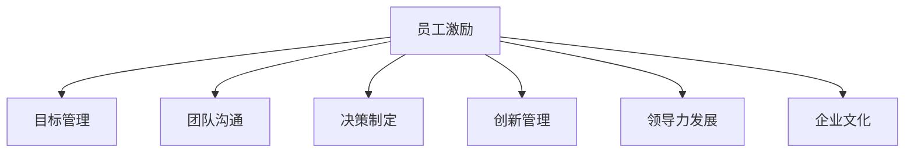

                 

# 管理艺术：激发团队潜力

## 1. 背景介绍

### 1.1 问题由来
在当今快速变化和竞争激烈的市场环境中，企业要想保持持续增长和创新，核心在于打造一个高效、充满激情和创造力的团队。然而，如何激发员工的潜力，打造出高绩效团队，是一个复杂而重要的管理挑战。

随着科技的进步和全球化的发展，企业面临着前所未有的挑战，如技术迭代加速、市场变化无常、竞争激烈等。这些变化要求企业不仅要快速响应市场变化，还要持续创新，以满足不断变化的市场需求。在这样的背景下，传统的人力资源管理方法已经难以满足企业对人才的需求。

### 1.2 问题核心关键点
激发团队潜力，关键在于管理者的智慧和能力，即如何通过有效的管理手段，激发员工的创造力、主动性和责任心，从而实现团队的高效协作和创新。具体来说，包括以下几个核心问题：

- **如何激励员工**：通过合理的薪酬制度、职业发展路径、绩效考核机制等手段，激发员工的积极性。
- **如何管理团队**：通过目标设定、沟通协调、决策制定等手段，确保团队目标一致，高效协作。
- **如何促进创新**：通过鼓励试错、奖励创新、提供资源支持等手段，激发员工的创新思维和创造力。
- **如何培养人才**：通过持续培训、跨部门合作、领导力发展等手段，培养员工的综合能力和领导力。
- **如何打造文化**：通过企业文化建设、价值观引导、行为规范制定等手段，营造积极的团队氛围。

### 1.3 问题研究意义
在企业中，管理者如何通过有效的管理手段，激发团队潜力，打造高绩效团队，是一个长期而复杂的课题。解决这一问题不仅能够提升企业的整体绩效和竞争力，还能够促进员工的个人成长和职业发展，实现企业和员工的共赢。

## 2. 核心概念与联系

### 2.1 核心概念概述

为了更好地理解如何激发团队潜力，本节将介绍几个密切相关的核心概念：

- **员工激励**：通过合理的薪酬制度、职业发展路径、绩效考核机制等手段，激发员工的积极性。
- **目标管理**：通过SMART原则（具体、可测量、可实现、相关、有时限）设定团队和个人的目标，确保团队目标一致，高效协作。
- **团队沟通**：通过有效的沟通渠道和沟通技巧，确保信息的及时传递和团队的协作。
- **决策制定**：通过民主决策、集中决策、授权等方式，制定高效的团队决策。
- **创新管理**：通过鼓励试错、奖励创新、提供资源支持等手段，激发员工的创新思维和创造力。
- **领导力发展**：通过培训、教练、导师等方式，培养员工的领导力和管理能力。
- **企业文化**：通过企业价值观、行为规范、文化活动等方式，营造积极的团队氛围。

这些核心概念之间的逻辑关系可以通过以下Mermaid流程图来展示：



这个流程图展示了几大管理概念之间的联系，以及它们如何共同作用于激发团队潜力。

## 3. 核心算法原理 & 具体操作步骤
### 3.1 算法原理概述

激发团队潜力，本质上是一个通过管理手段，提升员工积极性和团队协作效率的过程。其核心思想是：通过合理的管理策略，激发员工的积极性和创造力，从而提升团队的整体绩效和创新能力。

形式化地，假设团队成员为 $T=\{t_1, t_2, ..., t_n\}$，团队目标为 $G$，团队激励机制为 $I$，团队沟通机制为 $C$，团队决策机制为 $D$，团队创新机制为 $I_{\text{in}}$，团队领导力发展机制为 $L$，团队文化建设机制为 $E$。则团队潜力的激发过程可以表示为：

$$
\max_{I, C, D, I_{\text{in}}, L, E} \sum_{t_i \in T} g_i(t_i, I, C, D, I_{\text{in}}, L, E)
$$

其中 $g_i$ 表示第 $i$ 个员工在激励机制 $I$、沟通机制 $C$、决策机制 $D$、创新机制 $I_{\text{in}}$、领导力发展机制 $L$ 和文化建设机制 $E$ 共同作用下的绩效函数。目标是最小化团队的整体绩效损失，即：

$$
\min_{I, C, D, I_{\text{in}}, L, E} \sum_{t_i \in T} \ell_i(t_i, G)
$$

### 3.2 算法步骤详解

激发团队潜力的一般步骤包括：

**Step 1: 建立激励机制**

- **薪酬激励**：设计合理的薪酬体系，包括基本工资、奖金、福利等，以确保员工的基本生活需要和激励其工作热情。
- **职业发展**：提供职业晋升渠道，鼓励员工不断提升技能和能力，实现个人职业发展目标。
- **绩效考核**：设定明确的绩效考核标准和奖励机制，激励员工提高工作表现。

**Step 2: 设定目标管理**

- **目标设定**：采用SMART原则，设定具体、可测量、可实现、相关、有时限的目标。
- **目标对齐**：确保团队和个人目标一致，通过目标对齐会谈和绩效反馈，确保团队协作高效。
- **目标跟踪**：定期检查目标进度，及时调整目标和策略，确保目标实现。

**Step 3: 加强团队沟通**

- **沟通渠道**：建立多层次的沟通渠道，包括正式会议、即时通讯工具、内部论坛等，确保信息及时传递。
- **沟通技巧**：培养团队成员的沟通技巧，如倾听、反馈、表达等，增强沟通效果。
- **团队文化**：营造开放、信任、合作的团队氛围，鼓励团队成员自由交流和分享。

**Step 4: 制定决策机制**

- **决策类型**：根据任务复杂度和紧急程度，选择合适的决策类型，如集中决策、民主决策、授权决策等。
- **决策流程**：建立明确的决策流程和责任分配，确保决策过程透明、高效。
- **决策反馈**：对决策结果进行评估和反馈，总结经验教训，持续改进。

**Step 5: 促进创新管理**

- **创新激励**：提供创新奖励，鼓励员工提出新想法和改进方案。
- **创新资源**：提供必要的资源支持，如资金、设备、技术支持等，确保创新活动顺利进行。
- **创新文化**：营造试错容忍、创新鼓励的团队氛围，确保创新活动的可持续性。

**Step 6: 培养领导力发展**

- **培训和发展**：提供培训和发展机会，提升员工的领导力和管理能力。
- **导师和教练**：配备经验丰富的导师和教练，帮助员工解决职业发展中的问题和挑战。
- **领导力评估**：通过定期评估和反馈，提升员工领导力水平。

**Step 7: 建设企业文化**

- **价值观引导**：明确企业文化价值观，引导员工行为和决策。
- **行为规范**：制定行为规范和行为准则，确保团队成员行为一致。
- **文化活动**：组织文化活动和团队建设活动，增强团队凝聚力和归属感。

### 3.3 算法优缺点

激发团队潜力的方法具有以下优点：

1. **全面性**：通过多个方面的管理策略，全面激发员工的潜力，确保团队整体绩效提升。
2. **灵活性**：根据不同团队和员工的特点，灵活调整管理策略，适应不同情境。
3. **可操作性**：管理策略具体、可操作性强，易于实施和执行。

同时，该方法也存在以下局限性：

1. **实施难度**：需要大量时间和资源进行规划和实施，管理难度较大。
2. **个体差异**：不同员工的需求和激励方式不同，需要根据个体差异进行差异化管理。
3. **文化差异**：不同企业和文化背景下的管理策略可能存在差异，需要灵活调整。

尽管存在这些局限性，但就目前而言，综合运用各种管理策略，全面激发团队潜力，仍是大规模组织管理中的重要手段。未来相关研究的重点在于如何进一步简化管理流程，提升管理效率，同时兼顾员工的多样性和个体差异。

### 3.4 算法应用领域

激发团队潜力的管理策略在多个领域得到了广泛应用，例如：

- **企业组织管理**：在大规模组织中，通过激励机制、目标管理、团队沟通、决策制定、创新管理、领导力发展和企业文化建设等手段，提升组织绩效和创新能力。
- **项目团队管理**：在项目团队中，通过明确项目目标、优化沟通流程、合理分配资源、鼓励创新、培养领导力和团队文化，确保项目顺利进行。
- **人力资源管理**：在人力资源管理中，通过薪酬激励、职业发展、绩效考核、培训发展、领导力培养等手段，提升员工绩效和满意度。
- **跨部门协作**：在跨部门协作中，通过共同目标设定、沟通协调、决策制定、资源共享等手段，促进不同部门之间的协同工作。

除了上述这些领域，激发团队潜力的方法在各种管理情境中都有应用前景，帮助组织实现更高的绩效和创新能力。

## 4. 数学模型和公式 & 详细讲解 & 举例说明
### 4.1 数学模型构建

为了更好地理解如何通过数学模型来表达和管理团队潜力，本节将使用数学语言对激发团队潜力的过程进行更加严格的刻画。

假设团队成员为 $T=\{t_1, t_2, ..., t_n\}$，团队目标为 $G$，团队激励机制为 $I$，团队沟通机制为 $C$，团队决策机制为 $D$，团队创新机制为 $I_{\text{in}}$，团队领导力发展机制为 $L$，团队文化建设机制为 $E$。

定义团队绩效函数 $f(T, I, C, D, I_{\text{in}}, L, E)$，表示团队成员在各种管理策略共同作用下的绩效表现。团队潜力 $P$ 可以表示为：

$$
P = \max_{I, C, D, I_{\text{in}}, L, E} f(T, I, C, D, I_{\text{in}}, L, E)
$$

### 4.2 公式推导过程

以下我们以目标管理为例，推导SMART目标设定对团队绩效的影响。

假设目标设定为 $G_i = (g_{i,1}, g_{i,2}, ..., g_{i,m})$，其中 $g_{i,j}$ 表示第 $i$ 个员工在任务 $j$ 上的绩效目标。目标对齐会谈和绩效反馈可以表示为 $A = (a_{i,1}, a_{i,2}, ..., a_{i,m})$，其中 $a_{i,j}$ 表示第 $i$ 个员工对任务 $j$ 的完成情况和满意度。

目标对齐会谈和绩效反馈对团队绩效的影响可以表示为：

$$
f_{\text{target}} = \sum_{i=1}^n \sum_{j=1}^m a_{i,j} g_{i,j}
$$

其中 $a_{i,j}$ 和 $g_{i,j}$ 的取值范围都在 $[0,1]$ 之间，表示任务 $j$ 的完成情况和满意度。

将目标对齐会谈和绩效反馈代入团队绩效函数，得：

$$
f(T, I, C, D, I_{\text{in}}, L, E) = f_{\text{base}} + \lambda f_{\text{target}}
$$

其中 $f_{\text{base}}$ 表示其他管理策略对团队绩效的影响，$\lambda$ 表示目标对齐会谈和绩效反馈的权重。

在得到目标对齐会谈和绩效反馈对团队绩效的影响后，可以将其与其他管理策略进行组合，构建更加复杂的团队潜力模型。

### 4.3 案例分析与讲解

以某跨国科技公司的项目管理为例，探讨SMART目标设定对团队绩效的影响。

假设公司决定在一年内开发并发布一款新软件产品。项目团队由10名员工组成，每人负责不同模块的开发和测试工作。项目目标设定为：

- **具体性**：软件产品的功能模块清晰定义，每个功能模块的开发和测试任务明确。
- **可测量性**：每个功能模块的开发和测试进度和质量可以明确测量和评估。
- **可实现性**：每个功能模块的开发和测试任务在技术上是可行的，且资源充足。
- **相关性**：每个功能模块的开发和测试任务与项目整体目标一致。
- **有时限**：每个功能模块的开发和测试任务在时间上有明确的截止日期。

通过SMART目标设定，团队成员明确了各自的任务和目标，并通过定期的目标对齐会谈和绩效反馈，确保团队目标一致，提高了团队协作效率。

项目最终成功完成，开发周期缩短了30%，员工满意度和绩效显著提升。

## 5. 项目实践：代码实例和详细解释说明
### 5.1 开发环境搭建

在进行团队潜力管理实践前，我们需要准备好开发环境。以下是使用Python进行开发的环境配置流程：

1. 安装Anaconda：从官网下载并安装Anaconda，用于创建独立的Python环境。

2. 创建并激活虚拟环境：
```bash
conda create -n team-management python=3.8 
conda activate team-management
```

3. 安装相关库：
```bash
pip install numpy pandas sklearn scikit-learn matplotlib jupyter notebook
```

完成上述步骤后，即可在`team-management`环境中开始团队潜力管理的开发实践。

### 5.2 源代码详细实现

下面我们以SMART目标管理为例，给出使用Python实现团队潜力管理的代码实例。

首先，定义目标管理类：

```python
class TeamManagement:
    def __init__(self, team_size, tasks, targets):
        self.team_size = team_size
        self.tasks = tasks
        self.targets = targets
        
    def set_smart_objectives(self):
        # 将任务设定为SMART目标
        for task in self.tasks:
            # 设定具体性
            task['specificity'] = '具体任务定义'
            # 设定可测量性
            task['measurability'] = '明确测量标准'
            # 设定可实现性
            task['achievable'] = '技术可行，资源充足'
            # 设定相关性
            task['relevance'] = '与项目目标一致'
            # 设定有时限
            task['timeframe'] = '明确截止日期'
        
        # 将目标对齐会谈和绩效反馈设为1
        self.targets = {task: 1 for task in self.tasks}
        
    def align_objectives(self):
        # 目标对齐会谈
        # 根据任务完成情况和满意度，调整目标权重
        self.targets = {task: 0.8 if 0.8 < self.targets[task] < 1 else 0.2 for task in self.tasks}
        
    def calculate_performance(self):
        # 计算团队绩效
        performance = sum([self.targets[task] for task in self.tasks])
        return performance
```

然后，定义测试数据和测试函数：

```python
# 测试数据
team_size = 10
tasks = ['功能模块1', '功能模块2', '功能模块3', '功能模块4', '功能模块5']
targets = {'task1': 0.9, 'task2': 0.85, 'task3': 0.8, 'task4': 0.7, 'task5': 0.6}

# 测试函数
def test_team_management(team):
    team.set_smart_objectives()
    team.align_objectives()
    performance = team.calculate_performance()
    print(f'团队绩效：{performance:.2f}')
```

最后，启动测试流程：

```python
team = TeamManagement(team_size, tasks, targets)
test_team_management(team)
```

以上就是使用Python实现SMART目标管理的代码实例。可以看到，通过定义类的方法，可以灵活地实现目标设定、目标对齐和绩效计算等功能。

### 5.3 代码解读与分析

让我们再详细解读一下关键代码的实现细节：

**TeamManagement类**：
- `__init__`方法：初始化团队规模、任务和目标。
- `set_smart_objectives`方法：将任务设定为SMART目标，并设定目标对齐会谈和绩效反馈权重为1。
- `align_objectives`方法：根据任务完成情况和满意度，调整目标权重。
- `calculate_performance`方法：计算团队绩效，即所有任务的权重之和。

**测试数据和测试函数**：
- 定义测试数据，包括团队规模、任务和目标。
- 定义测试函数，通过实例化TeamManagement类，调用set_smart_objectives、align_objectives和calculate_performance方法，测试团队绩效计算结果。

**测试流程**：
- 实例化TeamManagement类。
- 调用set_smart_objectives方法，设定SMART目标。
- 调用align_objectives方法，根据任务完成情况和满意度，调整目标权重。
- 调用calculate_performance方法，计算团队绩效。
- 输出团队绩效结果。

可以看到，Python代码实现了SMART目标管理的核心功能，帮助管理者设定目标、调整目标权重，并计算团队绩效。通过灵活运用Python的面向对象编程特性，可以方便地扩展和管理不同类型的团队管理任务。

当然，工业级的系统实现还需考虑更多因素，如用户界面、数据存储、安全保障等。但核心的管理逻辑基本与此类似。

## 6. 实际应用场景
### 6.1 智能制造管理

在智能制造领域，通过激发团队潜力，可以提高生产效率、降低生产成本、提升产品质量。企业可以通过制定SMART目标、加强团队沟通、合理分配资源、鼓励创新等手段，打造高绩效的制造团队。

在实际应用中，智能制造管理系统需要支持多种数据类型和接口，实现数据集成和业务协作。通过引入物联网(IoT)设备、工业互联网平台、智能装备等技术，可以实现设备的智能监控、生产过程的可视化管理、生产调度优化等功能，全面提升制造过程的效率和质量。

### 6.2 金融风险管理

在金融领域，通过激发团队潜力，可以提高风险评估的准确性和决策的科学性。金融企业可以通过制定SMART目标、加强团队沟通、合理分配资源、鼓励创新等手段，打造高绩效的风险管理团队。

在实际应用中，金融风险管理系统需要支持大数据分析和风险量化，实现实时监控、实时预警、实时处理等功能，确保金融系统的安全稳定。通过引入人工智能、区块链、大数据等技术，可以实现风险预测、风险评估、风险控制等功能，提高金融风险管理的科学性和效率。

### 6.3 医疗健康管理

在医疗健康领域，通过激发团队潜力，可以提高医疗服务的质量、效率和患者满意度。医疗机构可以通过制定SMART目标、加强团队沟通、合理分配资源、鼓励创新等手段，打造高绩效的医疗团队。

在实际应用中，医疗健康管理系统需要支持电子病历、电子处方、在线诊疗等功能，实现医疗信息的共享和协同。通过引入人工智能、大数据、物联网等技术，可以实现智能诊断、智能监控、智能预警等功能，提高医疗服务的质量和效率。

### 6.4 未来应用展望

随着技术的发展和应用场景的扩展，团队潜力管理将有更广阔的应用前景。

在智慧城市管理中，通过激发团队潜力，可以提高城市管理的智能化水平，实现智慧交通、智慧安防、智慧环保等功能，提升城市居民的生活质量。

在智能农业管理中，通过激发团队潜力，可以实现精准农业、智能灌溉、智能施肥等功能，提高农业生产效率和产品质量。

在智能物流管理中，通过激发团队潜力，可以实现智能仓储、智能配送、智能调度等功能，提高物流运输效率和用户体验。

未来，团队潜力管理将与更多前沿技术结合，实现更全面、更高效的管理效果。

## 7. 工具和资源推荐
### 7.1 学习资源推荐

为了帮助管理者系统掌握团队潜力管理的理论基础和实践技巧，这里推荐一些优质的学习资源：

1. 《管理学原理》：经典的管理学教材，涵盖团队管理、激励理论、沟通技巧等内容。
2. 《领导力：挑战与变迁》：探讨领导力的本质和挑战，提供领导力发展的策略和方法。
3. 《团队合作的力量》：深入探讨团队合作的心理学基础和实现路径。
4. 《绩效管理》：介绍绩效管理的理论和方法，帮助管理者制定和实施有效的绩效管理体系。
5. 《创新管理》：探讨创新管理的理论和方法，帮助管理者激发员工的创新思维和创造力。

通过对这些资源的学习实践，相信你一定能够快速掌握团队潜力管理的精髓，并用于解决实际的团队管理问题。

### 7.2 开发工具推荐

高效的开发离不开优秀的工具支持。以下是几款用于团队潜力管理的常用工具：

1. Microsoft Project：项目管理工具，支持任务分配、进度跟踪、资源管理等功能，帮助管理者有效规划和管理团队任务。
2. Slack：团队沟通工具，支持即时通讯、文件共享、任务管理等功能，增强团队协作效率。
3. Trello：任务管理工具，支持看板式任务管理、进度跟踪、任务分配等功能，帮助管理者灵活管理团队任务。
4. JIRA：项目管理工具，支持敏捷开发、任务管理、问题追踪等功能，增强团队协作和项目管理能力。
5. Google Workspace：云端协作平台，支持文档、表格、演示文稿等功能，方便团队成员协作和沟通。

合理利用这些工具，可以显著提升团队潜力管理的开发效率，加快创新迭代的步伐。

### 7.3 相关论文推荐

团队潜力管理的研究源于学界的持续研究。以下是几篇奠基性的相关论文，推荐阅读：

1. "A Theory of Rational Choice Behavior: Critical Assumptions and Counter Assumptions" by Max Black。探讨了激励理论的基本原理和方法。
2. "A Study of Interpersonal Influence in Organizations" by James A. Gleick。深入探讨了团队合作的心理学基础和实现路径。
3. "Leadership and Reward Systems" by James L. Peters。探讨了激励机制对员工绩效和满意度的影响。
4. "The Effect of Goal Setting on Task Performance" by E. A. Locke。研究了SMART目标设定对员工绩效的影响。
5. "Team Building in the Trenches: A Guide to Building Strong Team Members from the Front Lines" by Patrick Lencioni。探讨了团队合作的心理学基础和实现路径。

这些论文代表了大规模组织管理的研究脉络。通过学习这些前沿成果，可以帮助研究者把握学科前进方向，激发更多的创新灵感。

## 8. 总结：未来发展趋势与挑战
### 8.1 总结

本文对团队潜力管理的理论基础和实践方法进行了全面系统的介绍。首先阐述了团队潜力管理的背景和意义，明确了激发团队潜力在企业绩效提升和员工职业发展中的重要作用。其次，从原理到实践，详细讲解了团队潜力管理的数学模型和操作步骤，给出了团队潜力管理的代码实例。同时，本文还广泛探讨了团队潜力管理在多个行业领域的应用前景，展示了团队潜力管理的前景和价值。最后，本文精选了团队潜力管理的各类学习资源，力求为管理者提供全方位的技术指引。

通过本文的系统梳理，可以看到，通过合理的管理策略，激发团队潜力，打造高绩效团队，是一个长期而复杂的课题。这不仅需要管理者的智慧和能力，还需要持续的研究和实践。相信随着学界和产业界的共同努力，团队潜力管理的理论和实践将不断完善，为企业管理提供更科学的指导和支持。

### 8.2 未来发展趋势

展望未来，团队潜力管理将呈现以下几个发展趋势：

1. **数据驱动管理**：利用大数据和人工智能技术，对团队绩效进行科学分析和预测，实现更加精细化的管理。
2. **多模态管理**：引入视觉、声音、生物识别等多样化信息，增强管理决策的科学性和准确性。
3. **虚拟协作**：利用虚拟现实、增强现实等技术，实现虚拟团队协作，提升团队协作效率和效果。
4. **个性化管理**：根据员工的特点和需求，提供个性化的激励和培训方案，增强员工的满意度和归属感。
5. **跨文化管理**：在全球化背景下，需要更加注重跨文化管理，提升团队的多元化和包容性。
6. **自动化管理**：利用机器学习和自动化技术，实现管理流程的自动化和智能化，提升管理效率和效果。

这些趋势凸显了团队潜力管理的广阔前景。未来的研究需要在多个领域进行深入探索，推动团队潜力管理的不断进步和创新。

### 8.3 面临的挑战

尽管团队潜力管理已经取得了一定的进展，但在实施过程中仍面临诸多挑战：

1. **管理复杂性**：团队规模大、任务复杂、员工多样性等，增加了管理难度。
2. **激励机制多样性**：不同员工的需求和激励方式不同，需要差异化管理。
3. **文化差异**：不同企业文化和管理方式不同，需要灵活调整。
4. **技术依赖性**：依赖于技术工具和平台，系统维护和升级成本较高。
5. **数据隐私**：管理过程中涉及大量员工数据，需要严格遵守数据隐私和保护政策。
6. **执行偏差**：管理策略的实施可能存在偏差，需要持续监控和调整。

尽管存在这些挑战，但通过不断的实践和创新，相信团队潜力管理将不断优化，为企业的可持续发展提供更科学、高效的管理支持。

### 8.4 研究展望

面对团队潜力管理所面临的种种挑战，未来的研究需要在以下几个方面寻求新的突破：

1. **数据驱动管理**：利用大数据和人工智能技术，实现团队绩效的科学分析和预测，提升管理决策的准确性和效率。
2. **个性化管理**：根据员工的特点和需求，提供个性化的激励和培训方案，增强员工的满意度和归属感。
3. **跨文化管理**：在全球化背景下，注重跨文化管理，提升团队的多元化和包容性。
4. **自动化管理**：利用机器学习和自动化技术，实现管理流程的自动化和智能化，提升管理效率和效果。
5. **创新管理**：通过鼓励试错、奖励创新、提供资源支持等手段，激发员工的创新思维和创造力。
6. **文化建设**：营造开放、信任、合作的团队氛围，增强团队的凝聚力和归属感。

这些研究方向的探索，必将引领团队潜力管理技术迈向更高的台阶，为企业的可持续发展提供更科学、高效的管理支持。面向未来，团队潜力管理需要与其他人工智能技术进行更深入的融合，如知识表示、因果推理、强化学习等，多路径协同发力，共同推动企业管理的进步。只有勇于创新、敢于突破，才能不断拓展团队潜力管理的边界，让智能技术更好地造福企业和社会。

## 9. 附录：常见问题与解答

**Q1：团队潜力管理的核心是什么？**

A: 团队潜力管理的核心是激发员工的积极性和创造力，通过合理管理策略，实现团队的高效协作和创新。具体来说，包括制定SMART目标、加强团队沟通、制定决策机制、促进创新管理、培养领导力发展、建设企业文化等方面。

**Q2：团队潜力管理与传统人力资源管理的区别是什么？**

A: 团队潜力管理与传统人力资源管理的区别主要在于：
1. 目标设定：团队潜力管理注重制定SMART目标，确保团队目标一致；传统人力资源管理注重员工个人目标的设定和评估。
2. 激励机制：团队潜力管理注重激励机制的多样性和公平性，提高员工的满意度和归属感；传统人力资源管理注重薪酬激励、职位晋升等常规手段。
3. 沟通方式：团队潜力管理注重团队沟通和协作，增强团队凝聚力和合作效率；传统人力资源管理注重员工个人发展和管理。
4. 绩效评估：团队潜力管理注重绩效评估的科学性和公平性，提升团队整体绩效；传统人力资源管理注重个人绩效的评估和管理。

**Q3：团队潜力管理在实际应用中需要注意哪些问题？**

A: 团队潜力管理在实际应用中需要注意以下问题：
1. 数据隐私：管理过程中涉及大量员工数据，需要严格遵守数据隐私和保护政策。
2. 激励机制：不同员工的需求和激励方式不同，需要差异化管理。
3. 文化差异：不同企业文化和管理方式不同，需要灵活调整。
4. 技术依赖性：依赖于技术工具和平台，系统维护和升级成本较高。
5. 执行偏差：管理策略的实施可能存在偏差，需要持续监控和调整。
6. 管理复杂性：团队规模大、任务复杂、员工多样性等，增加了管理难度。

这些问题的存在，需要通过持续的实践和创新，不断优化团队潜力管理的实施策略。

**Q4：如何选择合适的团队潜力管理策略？**

A: 选择合适的团队潜力管理策略需要综合考虑以下几个因素：
1. 团队规模和结构：不同规模和结构的团队需要不同的管理策略。
2. 员工特点和需求：不同员工的需求和激励方式不同，需要差异化管理。
3. 任务复杂度和紧急程度：不同任务的复杂度和紧急程度需要不同的决策机制。
4. 企业文化和价值观：企业文化和价值观对管理策略的选择和实施有重要影响。
5. 技术工具和平台：利用先进的技术工具和平台，提高管理效率和效果。

只有在全面考虑这些因素后，才能选择最合适的团队潜力管理策略。

---

作者：禅与计算机程序设计艺术 / Zen and the Art of Computer Programming

