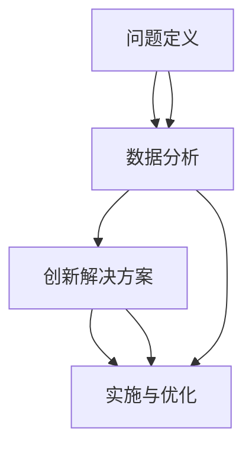

                 

## 1. 背景介绍

### 1.1 问题由来
在当前快速变化的商业环境中，企业面临着日益复杂和多元化的挑战。系统思考和问题解决能力变得比以往任何时候都更加重要。系统思考能够帮助企业从整体的角度审视问题，找到根本原因，并设计出有效的解决方案。问题解决能力则是将系统思考转化为具体行动的能力。本文将深入探讨系统思考与问题解决能力的核心原理，并提供实践指南，帮助企业实现高效、持续的创新和变革。

### 1.2 问题核心关键点
系统思考和问题解决能力的关键在于以下几个方面：

1. **系统思维**：理解问题涉及的所有因素及其相互关系，从整体上把握问题的本质。
2. **数据驱动**：利用数据和分析工具，发现问题背后的根本原因，而非仅仅停留在表面现象。
3. **创新思维**：打破传统思维定式，提出新颖、创新的解决方案。
4. **团队协作**：通过跨部门、跨职能的协作，整合资源，协同解决问题。
5. **持续改进**：建立反馈机制，不断迭代优化解决方案，提升问题解决效率。

### 1.3 问题研究意义
系统思考与问题解决能力的研究具有重要意义：

1. **提升企业竞争力**：能够快速响应市场变化，把握商业机遇，赢得竞争优势。
2. **促进创新与变革**：通过系统化、数据驱动的方法，推动企业持续创新，实现业务转型。
3. **提高问题解决效率**：通过科学的方法论，快速找到问题根源，制定有效策略，解决实际问题。
4. **增强团队协作**：促进跨部门合作，整合资源，提升团队整体能力。

## 2. 核心概念与联系

### 2.1 核心概念概述

系统思考和问题解决能力涉及多个核心概念：

- **系统思考(System Thinking)**：指从整体视角分析问题，理解系统各组成部分及其相互关系，找到问题的根本原因。
- **问题定义(Problem Definition)**：明确问题的本质和范围，为后续分析和解决奠定基础。
- **数据分析(Analytics)**：通过数据收集和分析，揭示问题背后的根本原因，为决策提供依据。
- **创新解决方案(Innovation)**：提出新颖、有效的解决方案，打破传统思维定式。
- **实施与优化(Implementation and Optimization)**：将解决方案付诸实施，并不断迭代优化。

这些概念之间的逻辑关系可以通过以下Mermaid流程图来展示：



这个流程图展示了从问题定义到创新解决方案，再到实施与优化的系统思考与问题解决过程。

## 3. 核心算法原理 & 具体操作步骤
### 3.1 算法原理概述

系统思考与问题解决能力的核心算法原理包括以下几个方面：

1. **系统模型构建**：构建系统的逻辑模型，包括系统的组成部分、输入输出、相互关系等。
2. **因果关系分析**：分析系统内各因素之间的因果关系，找到问题的根本原因。
3. **解决方案设计**：根据因果关系分析结果，设计创新的解决方案。
4. **实施与优化**：通过试点项目或迭代改进，验证和优化解决方案。

### 3.2 算法步骤详解

系统思考与问题解决能力的具体操作步骤如下：

**Step 1: 问题定义**

- 明确问题的范围和本质。例如，“销售额下降”是一个广泛的问题，需要进一步细化为“某产品销售额下降”。
- 使用SMART原则（具体、可测量、可实现、相关、有时限）来确保问题定义的清晰性和可操作性。

**Step 2: 数据分析**

- 收集相关数据，包括历史数据、市场数据、客户反馈等。
- 使用统计分析和数据挖掘技术，揭示数据背后的模式和趋势。
- 应用因果关系分析工具，如鱼骨图、5W1H等，找到问题的根本原因。

**Step 3: 解决方案设计**

- 基于因果关系分析结果，设计创新的解决方案。
- 利用设计思维（Design Thinking），提出多样化的解决方案。
- 进行SWOT分析（优势、劣势、机会、威胁），评估解决方案的可行性和影响。

**Step 4: 实施与优化**

- 选择最优解决方案，制定实施计划。
- 小规模试点，验证解决方案的有效性。
- 根据试点结果，调整和优化解决方案。
- 推广实施，持续监控和改进。

### 3.3 算法优缺点

系统思考与问题解决能力的优点包括：

1. **全面性**：能够从整体视角分析问题，考虑所有相关因素，找到根本原因。
2. **系统性**：通过数据驱动，确保解决方案基于实证，具有更高的可信度。
3. **创新性**：鼓励打破传统思维定式，提出新颖的解决方案。
4. **可持续性**：通过持续改进和优化，确保解决方案的长期有效性。

缺点包括：

1. **复杂性**：系统思考涉及多个因素，分析和设计过程较为复杂。
2. **数据依赖**：依赖高质量数据，数据缺失或失真可能导致分析结果不准确。
3. **时间成本**：从问题定义到实施优化，整个过程可能需要较长时间。

### 3.4 算法应用领域

系统思考与问题解决能力在多个领域都有广泛应用，例如：

- **企业战略规划**：分析市场环境，制定长期发展战略。
- **产品创新**：通过数据分析，识别客户需求，设计创新产品。
- **流程优化**：分析业务流程，找到瓶颈和改进点。
- **组织变革**：通过系统思考，推动企业文化和管理模式变革。
- **风险管理**：识别潜在风险，设计应对策略，提升风险管理能力。

## 4. 数学模型和公式 & 详细讲解 & 举例说明

### 4.1 数学模型构建

系统思考与问题解决能力可以通过数学模型来量化和分析。常用的数学模型包括：

1. **因果图(Cause-Effect Diagram)**：通过图形化的方式展示系统内各因素之间的因果关系。
2. **系统动力学(System Dynamics)**：使用微分方程和差分方程描述系统行为，进行仿真分析。
3. **决策树(Decision Tree)**：利用树形结构表示决策过程，优化决策路径。

### 4.2 公式推导过程

以因果图为例，展示因果关系的数学表达：

假设系统包含三个因素A、B、C，它们之间的关系如下：

- A直接影响C
- B通过A间接影响C
- C直接影响B

可以用因果图表示为：

```
A --> C
    \
     B
```

使用因果图分析系统行为时，可以使用以下公式：

$$
C(t) = f(A(t), B(t), C(t-1))
$$

其中 $C(t)$ 表示t时刻C的状态，$f$ 表示C的变化函数，A(t)、B(t)、C(t-1)分别表示t时刻A、B、C的状态。

### 4.3 案例分析与讲解

以一家电商平台为例，分析其销售额下降的原因及解决方案：

1. **问题定义**：“电商平台某产品销售额下降”
2. **数据分析**：通过数据分析工具，发现销售额下降与广告投放、物流效率、客户满意度等因素有关。
3. **因果关系分析**：绘制因果图，确定广告投放不足、物流延迟、客户满意度下降是主要原因。
4. **解决方案设计**：增加广告投放预算、优化物流管理、提升客户服务质量。
5. **实施与优化**：试点项目，评估效果，根据反馈调整方案。

## 5. 项目实践：代码实例和详细解释说明

### 5.1 开发环境搭建

**Step 1: 安装Python**

```bash
sudo apt-get update
sudo apt-get install python3 python3-pip
```

**Step 2: 安装相关库**

```bash
pip install numpy pandas matplotlib seaborn scikit-learn
```

**Step 3: 准备数据**

```python
import pandas as pd

# 读取数据
data = pd.read_csv('sales_data.csv')

# 数据清洗
data = data.dropna()

# 数据可视化
import matplotlib.pyplot as plt

plt.figure(figsize=(10, 6))
plt.plot(data['Year'], data['Sales'], label='Sales')
plt.xlabel('Year')
plt.ylabel('Sales')
plt.legend()
plt.show()
```

### 5.2 源代码详细实现

**Step 1: 问题定义**

```python
# 定义问题
problem = 'Sales of a product have decreased'
```

**Step 2: 数据分析**

```python
import numpy as np
from sklearn.linear_model import LinearRegression

# 数据准备
X = data['Year'].values.reshape(-1, 1)
y = data['Sales'].values

# 模型拟合
model = LinearRegression()
model.fit(X, y)

# 预测
X_new = np.array([2023]).reshape(-1, 1)
y_pred = model.predict(X_new)

print(f'Predicted sales for 2023: {y_pred[0]}')
```

**Step 3: 因果关系分析**

```python
# 使用因果图分析
import graphviz

dot_data = '''
digraph G {
    A [shape=box label="Advertising"]
    B [shape=box label="Logistics"]
    C [shape=box label="Customer Satisfaction"]
    A -> C
    B -> A
    C -> B
}'
graph = graphviz.Source(dot_data)
graph.render('causal_graph')
```

**Step 4: 解决方案设计**

```python
# 设计解决方案
solution = {
    'Increase Advertising Budget': 'Implement new advertising strategy',
    'Optimize Logistics Management': 'Adopt advanced logistics system',
    'Enhance Customer Service': 'Implement customer feedback loop'
}
```

**Step 5: 实施与优化**

```python
# 试点项目
# 评估效果
# 调整方案

# 推广实施
# 持续监控
```

### 5.3 代码解读与分析

在上述代码中，我们使用了Python进行数据分析和因果关系分析，通过可视化工具展示了因果关系图。

## 6. 实际应用场景

### 6.1 企业战略规划

系统思考和问题解决能力在企业战略规划中具有重要应用。企业可以系统分析市场环境、内部资源和外部威胁，制定长期发展战略，确保企业的持续竞争优势。

### 6.2 产品创新

通过系统思考和问题解决能力，企业可以深入理解客户需求，设计出更具创新性和竞争力的产品，满足市场需求。

### 6.3 流程优化

企业可以利用系统思考和问题解决能力，分析业务流程，识别瓶颈和改进点，提升流程效率，降低运营成本。

### 6.4 组织变革

系统思考和问题解决能力有助于推动企业文化和管理模式变革，提升组织整体效率和适应性。

### 6.5 风险管理

通过系统思考和问题解决能力，企业可以识别潜在风险，设计应对策略，提升风险管理能力，保障业务稳定发展。

## 7. 工具和资源推荐

### 7.1 学习资源推荐

**书籍**：

1. 《系统思考与问题解决》 - 讲述了系统思考和问题解决能力的理论基础和实践方法。
2. 《数据驱动决策》 - 介绍了数据驱动决策的理念和方法，提供了实用的数据分析工具和技巧。
3. 《创新者的窘境》 - 探讨了创新管理中的问题解决策略和创新方法。

**在线课程**：

1. Coursera上的《系统思考与设计思维》课程 - 提供系统思考和设计思维的理论与实践指导。
2. Udacity上的《数据科学入门》课程 - 涵盖数据收集、分析、可视化等实用技能。
3. edX上的《创新思维与创业》课程 - 讲解创新思维在商业中的应用。

### 7.2 开发工具推荐

**数据分析工具**：

1. Python：强大的数据分析和科学计算语言。
2. R：专注于统计分析和数据可视化的开源工具。
3. Tableau：商业智能和数据可视化工具，支持复杂数据模型分析。

**可视化工具**：

1. Matplotlib：Python中最流行的绘图库，支持多种图表类型。
2. Seaborn：基于Matplotlib的高级数据可视化库。
3. D3.js：基于JavaScript的可视化库，支持动态和交互式图表。

**项目管理工具**：

1. JIRA：敏捷项目管理工具，支持任务分配、进度跟踪等功能。
2. Trello：看板式项目管理工具，适合小型团队协作。
3. Asana：灵活的项目管理工具，支持多种视图和任务管理。

### 7.3 相关论文推荐

1. 《系统思考在企业战略管理中的应用》 - 探讨了系统思考在企业战略规划中的作用和实施方法。
2. 《问题解决中的数据驱动方法》 - 分析了数据驱动在问题解决中的重要性和实践方法。
3. 《创新思维与创新管理》 - 研究了创新思维在商业创新中的作用和实施策略。

## 8. 总结：未来发展趋势与挑战

### 8.1 研究成果总结

系统思考与问题解决能力的研究已经取得了显著进展，主要集中在以下几个方面：

1. **系统思维**：发展了多种系统建模方法和工具，如因果图、系统动力学等。
2. **数据分析**：利用大数据技术和机器学习算法，提升了数据分析的深度和广度。
3. **创新思维**：提出了多种创新方法，如设计思维、六顶思考帽等，推动了创新实践。
4. **团队协作**：开发了多种协作工具和平台，促进了跨部门和跨职能的协作。
5. **持续改进**：建立了反馈机制和迭代优化流程，提升了问题解决效率。

### 8.2 未来发展趋势

未来，系统思考与问题解决能力的发展趋势包括：

1. **智能化**：结合人工智能和大数据分析，提升问题解决的智能化水平。
2. **自动化**：利用自动化工具和算法，优化问题解决流程，减少人工干预。
3. **跨学科融合**：与其他学科（如心理学、社会学等）结合，拓展问题解决的理论和方法。
4. **多层次分析**：从微观到宏观，多层次分析问题，提升系统思考的全面性。
5. **实时性**：结合物联网和大数据技术，实现实时监控和问题解决。

### 8.3 面临的挑战

尽管系统思考与问题解决能力的研究已经取得了重要进展，但仍面临以下挑战：

1. **数据质量**：高质量的数据是系统思考的基础，数据缺失或失真可能导致分析结果不准确。
2. **模型复杂性**：系统建模和分析过程较为复杂，需要专业的知识和技能。
3. **组织阻力**：跨部门协作和持续改进需要克服组织内部的阻力，推动变革。
4. **技术门槛**：需要掌握多种技术和工具，对技术门槛较高。
5. **实施成本**：系统思考和问题解决需要投入大量的资源和成本，可能面临预算限制。

### 8.4 研究展望

未来的研究方向包括：

1. **智能系统建模**：利用人工智能技术，提升系统建模的自动化和智能化水平。
2. **跨学科研究**：结合其他学科知识，拓展系统思考的理论和方法。
3. **数据融合技术**：开发数据融合算法，提升数据的完整性和准确性。
4. **持续学习机制**：建立反馈和迭代机制，促进知识的持续积累和应用。
5. **伦理和安全性**：研究系统思考和问题解决中的伦理和安全问题，确保应用的合法性和安全性。

## 9. 附录：常见问题与解答

**Q1: 系统思考和问题解决能力适用于所有问题吗？**

A: 系统思考和问题解决能力适用于复杂、多因素的问题，特别是那些涉及系统各组成部分及其相互关系的问题。但对于简单、线性问题，系统思考可能显得复杂且低效。

**Q2: 系统思考和问题解决能力需要掌握哪些技能？**

A: 需要掌握系统建模、数据分析、因果关系分析、创新思维和团队协作等多项技能。具体而言，需要掌握：

1. 系统建模工具和技术。
2. 数据分析方法和工具。
3. 因果关系分析工具和技术。
4. 创新思维和设计思维。
5. 跨部门协作和沟通技能。

**Q3: 如何提高系统思考和问题解决能力？**

A: 可以通过以下方式提高系统思考和问题解决能力：

1. 学习和实践系统思考和问题解决的理论和方法。
2. 参与实际项目，积累实战经验。
3. 与跨部门同事合作，提升协作能力。
4. 持续学习新技术和工具，保持技术领先。
5. 建立反馈机制，不断迭代优化。

**Q4: 系统思考和问题解决能力在企业中的应用场景有哪些？**

A: 系统思考和问题解决能力在企业中的应用场景包括：

1. 企业战略规划。
2. 产品创新。
3. 流程优化。
4. 组织变革。
5. 风险管理。
6. 客户关系管理。
7. 市场营销。
8. 供应链管理。

总之，系统思考与问题解决能力是企业创新和变革的重要工具，通过科学的方法论和工具，可以系统地分析问题、设计解决方案，提升企业整体竞争力和创新能力。作者：禅与计算机程序设计艺术 / Zen and the Art of Computer Programming

