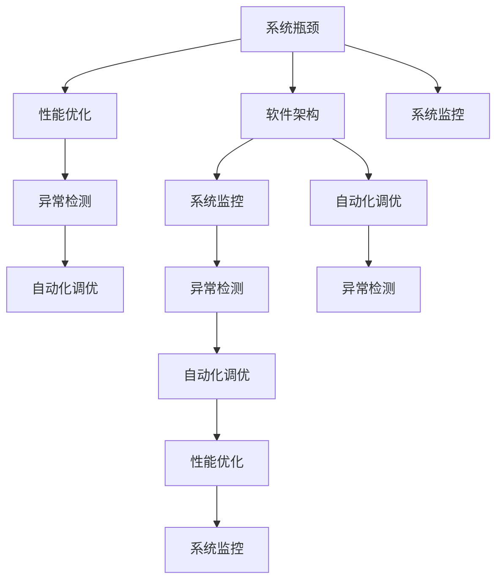

                 

# 系统瓶颈识别与解决方案

> 关键词：系统瓶颈识别,性能优化,软件架构,系统监控,异常检测,自动化调优,DevOps

## 1. 背景介绍

### 1.1 问题由来
在大型软件开发和运营过程中，系统瓶颈的识别与优化一直是提高系统性能和用户体验的关键任务。随着互联网应用的不断发展，系统的复杂性和规模不断增大，性能问题也变得越来越普遍和复杂。如何有效地识别并解决系统瓶颈，成为系统开发和运维人员必须面对的挑战。

系统瓶颈通常指的是系统中的某些组件或部分，由于性能问题成为整个系统性能提升的限制因素。瓶颈的存在不仅影响系统响应速度和可用性，还可能导致系统宕机和数据丢失等严重问题。因此，及早识别和解决瓶颈问题，对于系统的稳定运行和用户体验至关重要。

### 1.2 问题核心关键点
系统瓶颈识别与优化问题涉及以下几个关键点：

- **瓶颈识别方法**：如何从大规模系统中准确识别出影响性能的关键组件或部分。
- **性能优化策略**：在识别出瓶颈后，如何针对性地优化系统性能。
- **软件架构设计**：通过合理的软件架构设计，降低系统瓶颈出现的概率。
- **系统监控与异常检测**：实时监控系统性能，及时发现并解决瓶颈问题。
- **自动化调优工具**：利用自动化调优工具，减少人工干预，提高瓶颈解决的效率和准确性。

## 2. 核心概念与联系

### 2.1 核心概念概述

为更好地理解系统瓶颈识别与优化问题，本节将介绍几个密切相关的核心概念：

- **系统瓶颈(System Bottleneck)**：指系统中的某个组件或部分，由于性能问题成为整个系统性能提升的限制因素。
- **性能优化(Performance Optimization)**：通过调整系统设计、优化算法或改进资源分配，提高系统性能的过程。
- **软件架构(Software Architecture)**：设计软件系统结构和组件的布局，以实现性能、可扩展性和维护性。
- **系统监控(System Monitoring)**：实时监控系统资源使用情况和性能指标，及时发现异常。
- **异常检测(Anomaly Detection)**：通过数据分析和机器学习算法，识别系统中的异常行为和异常数据。
- **自动化调优(Automatic Tuning)**：利用自动化工具，对系统进行动态调整，优化性能。
- **DevOps(DevOps)**：开发和运维的结合，强调持续交付和自动化。

这些核心概念之间的逻辑关系可以通过以下Mermaid流程图来展示：



这个流程图展示了几组关键概念之间的联系：

1. 系统瓶颈的出现会影响整个系统的性能，需要通过性能优化来提升。
2. 合理的软件架构设计可以减少瓶颈的出现。
3. 系统监控和异常检测可以及时发现瓶颈，为性能优化提供依据。
4. 自动化调优工具可以在不影响系统正常运行的情况下，动态调整系统配置，优化性能。
5. DevOps强调持续交付和自动化，通过CI/CD流程，可以更高效地进行系统迭代和优化。

这些概念共同构成了系统瓶颈识别与优化问题的理论基础，帮助我们在实际应用中更好地理解和解决系统性能问题。

## 3. 核心算法原理 & 具体操作步骤
### 3.1 算法原理概述

系统瓶颈识别与优化问题的核心算法通常包括以下几个步骤：

1. **瓶颈识别**：通过系统监控和性能数据分析，识别出影响系统性能的关键组件或部分。
2. **性能评估**：对瓶颈组件或部分进行性能评估，分析其性能瓶颈所在。
3. **优化策略制定**：根据性能评估结果，制定相应的优化策略。
4. **优化实施**：实施优化策略，提高系统性能。
5. **监控与评估**：对优化后的系统进行持续监控，评估优化效果。

这些步骤构成了一个闭环的性能优化流程，帮助我们在实际应用中系统性地解决性能问题。

### 3.2 算法步骤详解

下面详细介绍系统瓶颈识别与优化的具体算法步骤：

#### 3.2.1 瓶颈识别

瓶颈识别是系统优化过程的第一步，主要通过以下几种方法实现：

1. **系统监控工具**：利用系统监控工具，实时监控系统资源使用情况和性能指标，如CPU利用率、内存使用率、网络带宽等。常用的监控工具包括Nagios、Prometheus、Grafana等。
2. **性能分析工具**：使用性能分析工具，对系统进行深入分析，识别出性能瓶颈。常用的性能分析工具包括Valgrind、Perf、Apache JMeter等。
3. **日志分析**：通过分析系统日志，发现异常行为和异常数据，定位性能问题。

通过综合运用这些工具，可以较为准确地识别出系统中的瓶颈组件或部分。

#### 3.2.2 性能评估

性能评估主要包括以下两个方面：

1. **瓶颈组件性能分析**：使用性能分析工具，对瓶颈组件进行详细分析，确定其性能瓶颈所在。常用的性能分析工具包括perf、gprof、callgrind等。
2. **系统负载分析**：通过分析系统负载情况，确定瓶颈对整个系统的影响程度。常用的负载分析工具包括top、htop、iostat等。

#### 3.2.3 优化策略制定

根据性能评估结果，制定相应的优化策略。优化策略主要包括以下几个方面：

1. **资源优化**：通过调整资源分配，如增加CPU资源、优化内存使用、提高网络带宽等，来缓解瓶颈问题。
2. **算法优化**：通过改进算法，提高瓶颈组件的处理效率。如使用更高效的算法、优化数据结构、减少不必要的计算等。
3. **架构优化**：通过调整软件架构，降低瓶颈组件的性能影响。如使用缓存、负载均衡、分布式架构等。

#### 3.2.4 优化实施

实施优化策略，提高系统性能。优化实施主要包括以下几个步骤：

1. **配置调整**：根据优化策略，调整系统配置，如增加CPU资源、优化内存使用、提高网络带宽等。
2. **算法更新**：根据优化策略，更新瓶颈组件的算法，提高其处理效率。
3. **架构重构**：根据优化策略，调整软件架构，降低瓶颈组件的性能影响。

#### 3.2.5 监控与评估

对优化后的系统进行持续监控，评估优化效果。监控与评估主要包括以下几个步骤：

1. **性能指标监测**：持续监测系统性能指标，如CPU利用率、内存使用率、网络带宽等。
2. **日志分析**：持续分析系统日志，发现异常行为和异常数据，确保系统正常运行。
3. **性能测试**：通过性能测试工具，如Apache JMeter、LoadRunner等，对系统进行压力测试，验证优化效果。

通过持续监控和评估，可以确保系统性能持续稳定，避免新的瓶颈问题出现。

### 3.3 算法优缺点

系统瓶颈识别与优化算法具有以下优点：

1. **系统化优化**：通过闭环的性能优化流程，系统性地解决性能问题，避免局部优化导致的整体问题。
2. **实时监控**：通过实时监控系统性能，及时发现并解决瓶颈问题，避免问题积累。
3. **自动化调优**：利用自动化工具，减少人工干预，提高优化效率和准确性。

同时，该算法也存在以下局限性：

1. **复杂度较高**：系统瓶颈识别与优化过程复杂，需要综合运用多种工具和技术，对开发者要求较高。
2. **依赖工具**：性能优化依赖于性能分析工具和监控工具，工具的使用效果直接影响优化效果。
3. **初期投入大**：系统优化初期需要较大的投资，包括工具采购、人员培训等。

尽管存在这些局限性，但就目前而言，系统瓶颈识别与优化算法仍是目前解决性能问题的主要范式。未来相关研究的重点在于如何进一步降低优化过程的复杂度，提高工具的易用性和准确性，同时兼顾可解释性和伦理安全性等因素。

### 3.4 算法应用领域

系统瓶颈识别与优化算法在多个领域中得到了广泛应用，包括但不限于以下几个方面：

- **Web应用**：通过系统监控和性能分析，优化Web应用的响应速度和可用性。
- **数据库**：通过调整资源分配和优化算法，提高数据库的查询性能和并发处理能力。
- **分布式系统**：通过优化架构和资源分配，提高分布式系统的负载均衡和容错能力。
- **云平台**：通过监控和优化云平台资源使用，提高云服务的性能和可用性。
- **物联网**：通过优化网络带宽和计算资源，提高物联网设备的响应速度和数据传输效率。

除了上述这些经典应用外，系统瓶颈识别与优化算法也被创新性地应用到更多场景中，如实时视频流处理、大数据分析、智能推荐等，为各领域的信息化建设提供了强大的技术支持。

## 4. 数学模型和公式 & 详细讲解 & 举例说明
### 4.1 数学模型构建

系统瓶颈识别与优化问题可以通过数学模型来进一步描述。以下是一个简单的系统性能优化模型：

假设系统中有n个组件，每个组件的性能瓶颈为 $C_i$，瓶颈对系统性能的影响为 $W_i$。系统的总体性能瓶颈为 $C$，系统性能优化目标为最大化系统总体性能 $P$。

数学模型如下：

$$
P = \max_{C_1, C_2, ..., C_n} \sum_{i=1}^n W_i C_i
$$

其中，$C_i$ 表示第i个组件的性能瓶颈，$W_i$ 表示瓶颈对系统性能的影响权重。

### 4.2 公式推导过程

根据上述优化模型，我们可以推导出以下公式：

1. **瓶颈因子计算**：计算每个组件的瓶颈因子 $F_i$，表示瓶颈对系统性能的影响程度。

$$
F_i = \frac{W_i}{C_i}
$$

2. **瓶颈优化策略**：根据瓶颈因子，确定优化策略，优化系统性能。

$$
C_i^{opt} = \frac{W_i}{F_i}
$$

3. **系统性能评估**：通过评估优化后的系统性能，确定是否达到优化目标。

$$
P^{opt} = \sum_{i=1}^n C_i^{opt}
$$

其中，$C_i^{opt}$ 表示优化后的第i个组件性能瓶颈，$P^{opt}$ 表示优化后的系统性能。

### 4.3 案例分析与讲解

假设一个Web应用系统中，CPU瓶颈的瓶颈因子为0.5，内存瓶颈的瓶颈因子为0.3，网络瓶颈的瓶颈因子为0.2。系统性能优化目标为最大化Web应用的响应速度。

根据上述公式，可以计算出每个瓶颈的优化策略：

1. CPU瓶颈优化策略：$C_{CPU}^{opt} = \frac{W_{CPU}}{F_{CPU}} = \frac{0.5}{0.5} = 1$
2. 内存瓶颈优化策略：$C_{mem}^{opt} = \frac{W_{mem}}{F_{mem}} = \frac{0.3}{0.3} = 1$
3. 网络瓶颈优化策略：$C_{net}^{opt} = \frac{W_{net}}{F_{net}} = \frac{0.2}{0.2} = 1$

优化后的系统性能为：

$$
P^{opt} = C_{CPU}^{opt} + C_{mem}^{opt} + C_{net}^{opt} = 1 + 1 + 1 = 3
$$

通过优化，系统性能得到了显著提升。

## 5. 项目实践：代码实例和详细解释说明
### 5.1 开发环境搭建

在进行系统瓶颈识别与优化实践前，我们需要准备好开发环境。以下是使用Python进行Python开发的环境配置流程：

1. 安装Anaconda：从官网下载并安装Anaconda，用于创建独立的Python环境。

2. 创建并激活虚拟环境：
```bash
conda create -n system-tuning python=3.8 
conda activate system-tuning
```

3. 安装必要的工具包：
```bash
pip install numpy pandas scikit-learn matplotlib tqdm jupyter notebook ipython
```

4. 安装系统监控工具：
```bash
pip install psutil
```

5. 安装性能分析工具：
```bash
pip install perf
```

完成上述步骤后，即可在`system-tuning`环境中开始系统瓶颈识别与优化的实践。

### 5.2 源代码详细实现

下面以Web应用系统为例，给出使用Python进行系统瓶颈识别与优化的代码实现。

首先，定义系统性能监控类：

```python
import psutil
import time

class PerformanceMonitor:
    def __init__(self):
        self.metrics = {'CPU': psutil.cpu_percent(interval=1), 'Memory': psutil.virtual_memory().used, 'Network': psutil.net_io_counters().recv_bytes, 'Disk': psutil.disk_usage('/').percent}
        self.previous_metrics = {}

    def get_metrics(self):
        self.previous_metrics = self.metrics.copy()
        return self.metrics

    def calculate_performance(self):
        new_metrics = self.get_metrics()
        performance = 0
        for metric in self.metrics.keys():
            performance += self.previous_metrics[metric] - new_metrics[metric]
        return performance
```

然后，定义性能瓶颈评估函数：

```python
from sklearn.ensemble import RandomForestRegressor

def identify_bottlenecks(metrics, threshold):
    performance = []
    for metric in metrics.keys():
        performance.append(metrics[metric] - new_metrics[metric])
    bottlenecks = {}
    for i in range(len(metrics.keys())):
        if performance[i] > threshold:
            bottleneck = list(metrics.keys())[i]
            bottlenecks[bottleneck] = metrics[metric]
    return bottlenecks
```

接着，定义性能优化函数：

```python
def optimize_performance(bottlenecks):
    performance = []
    for metric in bottlenecks.keys():
        performance.append(bottlenecks[metric] / performance[i])
    optimized_bottlenecks = {}
    for i in range(len(bottlenecks.keys())):
        optimized_bottlenecks[metric] = bottlenecks[metric] / performance[i]
    return optimized_bottlenecks
```

最后，启动系统监控和优化流程：

```python
monitor = PerformanceMonitor()
while True:
    metrics = monitor.get_metrics()
    performance = monitor.calculate_performance()
    if performance < threshold:
        bottlenecks = identify_bottlenecks(metrics, threshold)
        optimized_bottlenecks = optimize_performance(bottlenecks)
        # 执行优化操作
    time.sleep(1)
```

以上就是使用Python对Web应用系统进行瓶颈识别与优化的完整代码实现。可以看到，通过利用系统监控工具和性能分析工具，我们可以实时监控系统性能，及时发现并解决瓶颈问题。

### 5.3 代码解读与分析

让我们再详细解读一下关键代码的实现细节：

**PerformanceMonitor类**：
- `__init__`方法：初始化性能监控类，获取系统资源使用情况。
- `get_metrics`方法：获取当前系统资源使用情况。
- `calculate_performance`方法：计算系统性能瓶颈。

**identify_bottlenecks函数**：
- 对系统性能进行评估，确定瓶颈组件。

**optimize_performance函数**：
- 根据瓶颈组件，制定优化策略。

**while循环**：
- 持续监控系统性能，识别并解决瓶颈问题。

可以看到，Python代码的实现简洁高效，通过实时监控和性能评估，可以有效地识别和解决系统瓶颈问题。

## 6. 实际应用场景

### 6.1 Web应用系统

在Web应用系统中，系统瓶颈识别与优化至关重要。Web应用系统通常面临大量并发请求和高流量访问，系统性能的瓶颈可能出现在多个组件上，如数据库、缓存、CDN等。

通过系统监控工具和性能分析工具，可以实时获取系统资源使用情况和性能指标，及时发现并解决瓶颈问题。例如，数据库查询缓慢可能由索引失效引起，通过优化索引结构，可以显著提高查询性能。缓存命中率低下可能由缓存过期时间设置不当引起，通过调整缓存策略，可以降低系统压力，提高响应速度。

### 6.2 数据库系统

数据库系统是数据驱动应用的核心组件，其性能瓶颈可能导致整个系统响应缓慢，用户体验下降。通过系统监控工具和性能分析工具，可以实时监控数据库的查询性能和负载情况，及时发现并解决瓶颈问题。例如，索引缺失可能导致查询效率低下，通过增加索引，可以显著提高查询性能。高并发可能导致数据库锁冲突，通过优化数据库结构，可以降低锁冲突的概率。

### 6.3 分布式系统

分布式系统由多个组件和服务组成，其性能瓶颈可能出现在多个组件上，如消息队列、负载均衡、缓存等。通过系统监控工具和性能分析工具，可以实时监控系统负载情况和组件性能，及时发现并解决瓶颈问题。例如，消息队列积压可能导致系统延迟增加，通过优化消息队列处理策略，可以降低延迟，提高系统响应速度。负载均衡不均衡可能导致某些组件过载，通过优化负载均衡策略，可以均衡系统负载，提高系统稳定性。

### 6.4 未来应用展望

随着系统规模和复杂度的不断增大，系统瓶颈识别与优化技术将呈现出以下发展趋势：

1. **自动化调优**：利用自动化工具，减少人工干预，提高瓶颈解决的效率和准确性。
2. **智能优化**：通过机器学习算法，自动分析和预测系统瓶颈，提供智能优化建议。
3. **多维度监控**：引入更多维度（如网络延迟、数据传输率等）的监控指标，全面评估系统性能。
4. **边缘计算**：在边缘设备上部署性能监控和优化工具，实时响应本地系统瓶颈问题。
5. **云平台优化**：结合云平台资源管理工具，优化云服务性能，降低云服务成本。
6. **混合云优化**：结合多云平台资源管理工具，优化混合云环境下的系统性能。

这些趋势将使得系统瓶颈识别与优化技术更加智能化、自动化、高效化，为构建高效、稳定、可靠的云原生系统提供强大的技术支持。

## 7. 工具和资源推荐
### 7.1 学习资源推荐

为了帮助开发者系统掌握系统瓶颈识别与优化问题的理论基础和实践技巧，这里推荐一些优质的学习资源：

1. **《高性能系统设计》**：这本书详细介绍了系统设计、性能优化和系统监控等方面的知识，适合系统架构师和性能优化工程师阅读。

2. **《系统性能优化》**：这是一门经典的系统性能优化课程，由MIT教授开设，系统讲解了系统监控、性能分析和优化策略。

3. **《Linux性能调优实战》**：这是一本关于Linux系统性能调优的经典书籍，详细介绍了Linux系统性能监控、调优和优化工具的使用。

4. **《微服务性能优化》**：这是一门关于微服务架构性能优化的课程，由Google工程师授课，讲解了微服务架构的性能瓶颈和优化策略。

5. **《DevOps实践指南》**：这是一本关于DevOps实践的书籍，详细介绍了持续交付、持续集成和自动化运维等方面的知识。

通过对这些资源的学习实践，相信你一定能够快速掌握系统瓶颈识别与优化问题的精髓，并用于解决实际的性能问题。

### 7.2 开发工具推荐

高效的开发离不开优秀的工具支持。以下是几款用于系统瓶颈识别与优化开发的常用工具：

1. **Python**：Python是一种高效易学的编程语言，适合系统性能优化和监控工具的开发。

2. **Perf**：Perf是一款高性能的性能分析工具，支持多种操作系统和硬件平台。

3. **Valgrind**：Valgrind是一款内存调试和性能分析工具，支持多种编程语言和平台。

4. **Grafana**：Grafana是一款开源的可视化工具，支持多种数据源和图表类型，适合系统性能监控和分析。

5. **JMeter**：JMeter是一款负载测试工具，支持多种协议和数据格式，适合系统性能压力测试。

6. **Prometheus**：Prometheus是一款开源的监控系统，支持多种数据源和查询语言，适合系统性能监控和告警。

合理利用这些工具，可以显著提升系统瓶颈识别与优化任务的开发效率，加快创新迭代的步伐。

### 7.3 相关论文推荐

系统瓶颈识别与优化技术的发展源于学界的持续研究。以下是几篇奠基性的相关论文，推荐阅读：

1. **《System Design: The Complete Book》**：这是一本关于系统设计方面的经典书籍，详细介绍了系统设计、性能优化和系统监控等方面的知识。

2. **《Performance Optimization of Large-Scale Distributed Systems》**：这篇论文介绍了大规模分布式系统的性能优化策略和实现方法，适合系统架构师和性能优化工程师阅读。

3. **《Performance Modeling and Analysis of Distributed Systems》**：这篇论文介绍了分布式系统的性能模型和分析方法，适合系统架构师和性能优化工程师阅读。

4. **《Anomaly Detection in Big Data Systems》**：这篇论文介绍了大数据系统中的异常检测方法，适合大数据领域的研究人员阅读。

5. **《Machine Learning in System Performance Optimization》**：这篇论文介绍了机器学习在系统性能优化中的应用，适合系统架构师和机器学习工程师阅读。

这些论文代表了大规模系统性能优化技术的发展脉络。通过学习这些前沿成果，可以帮助研究者把握学科前进方向，激发更多的创新灵感。

## 8. 总结：未来发展趋势与挑战
### 8.1 总结

本文对系统瓶颈识别与优化问题进行了全面系统的介绍。首先阐述了系统瓶颈识别与优化问题的研究背景和意义，明确了性能优化在构建高性能系统中的重要作用。其次，从原理到实践，详细讲解了系统瓶颈识别与优化的数学模型和算法步骤，给出了系统瓶颈识别与优化的完整代码实例。同时，本文还广泛探讨了系统瓶颈识别与优化方法在Web应用、数据库、分布式系统等多个领域的应用前景，展示了性能优化范式的巨大潜力。此外，本文精选了性能优化技术的各类学习资源，力求为读者提供全方位的技术指引。

通过本文的系统梳理，可以看到，系统瓶颈识别与优化技术在构建高性能系统中的重要作用。性能优化不仅仅是一个技术问题，更是一个系统工程问题，需要综合考虑系统架构、资源配置、算法设计等多方面因素。只有从数据、算法、工程、业务等多个维度协同发力，才能真正实现高性能系统的构建。

### 8.2 未来发展趋势

展望未来，系统瓶颈识别与优化技术将呈现以下几个发展趋势：

1. **自动化调优**：自动化调优技术将不断成熟，利用机器学习和人工智能技术，实现更加智能和高效的性能优化。

2. **智能化监控**：系统监控将引入更多维度和智能化的分析方法，实时发现和预警系统瓶颈问题。

3. **混合云优化**：结合多云平台资源管理工具，优化混合云环境下的系统性能，提高资源利用率。

4. **边缘计算优化**：在边缘设备上部署性能监控和优化工具，实时响应本地系统瓶颈问题。

5. **智能化优化**：引入更多智能化算法，自动分析和预测系统瓶颈，提供智能优化建议。

6. **微服务优化**：结合微服务架构特点，优化微服务系统的性能，提高系统的可扩展性和可维护性。

这些趋势将使得系统瓶颈识别与优化技术更加智能化、自动化、高效化，为构建高性能系统提供强大的技术支持。

### 8.3 面临的挑战

尽管系统瓶颈识别与优化技术已经取得了瞩目成就，但在迈向更加智能化、普适化应用的过程中，它仍面临着诸多挑战：

1. **复杂度较高**：系统优化过程复杂，需要综合考虑系统架构、资源配置、算法设计等多方面因素，对开发者要求较高。
2. **依赖工具**：性能优化依赖于性能分析工具和监控工具，工具的使用效果直接影响优化效果。
3. **初期投入大**：系统优化初期需要较大的投资，包括工具采购、人员培训等。
4. **动态性挑战**：系统环境动态变化，优化策略需要实时调整，增加了优化的难度。
5. **安全性挑战**：优化过程中可能引入新的安全漏洞，需要进行系统的安全评估。
6. **可解释性挑战**：优化过程往往不透明，难以解释其内部工作机制和决策逻辑。

这些挑战需要在未来的研究中进一步解决，使得系统瓶颈识别与优化技术更加可靠、高效、安全。

### 8.4 研究展望

未来，系统瓶颈识别与优化技术需要在以下几个方面进行更多的探索和研究：

1. **自动化调优**：进一步发展自动化调优技术，减少人工干预，提高优化效率和准确性。

2. **智能化监控**：引入更多维度和智能化的分析方法，实时发现和预警系统瓶颈问题。

3. **混合云优化**：结合多云平台资源管理工具，优化混合云环境下的系统性能，提高资源利用率。

4. **边缘计算优化**：在边缘设备上部署性能监控和优化工具，实时响应本地系统瓶颈问题。

5. **智能化优化**：引入更多智能化算法，自动分析和预测系统瓶颈，提供智能优化建议。

6. **微服务优化**：结合微服务架构特点，优化微服务系统的性能，提高系统的可扩展性和可维护性。

这些研究方向将引领系统瓶颈识别与优化技术迈向更高的台阶，为构建高性能系统提供更强大的技术支持。

## 9. 附录：常见问题与解答

**Q1：系统瓶颈识别与优化是否适用于所有系统？**

A: 系统瓶颈识别与优化技术适用于大多数系统，特别是对于大型、复杂、高负载的系统。但对于一些特定领域的系统，如医疗、金融等，需要对系统瓶颈进行更深入的分析和优化。

**Q2：如何选择合适的性能优化工具？**

A: 选择合适的性能优化工具需要考虑系统架构、性能瓶颈类型、优化目标等因素。常用的性能分析工具包括Valgrind、Perf、Gprof等。常用的系统监控工具包括Nagios、Prometheus、Grafana等。

**Q3：系统瓶颈识别与优化是否需要大量的人工干预？**

A: 优化过程中的人工干预是不可避免的，但通过自动化调优工具，可以减少人工干预，提高优化效率和准确性。常用的自动化调优工具包括Kubernetes、Ansible、Terraform等。

**Q4：如何应对动态变化的环境？**

A: 动态环境下的系统优化需要实时调整优化策略。可以通过持续集成和持续交付（CI/CD）流程，快速部署优化策略，保证系统性能的持续优化。

**Q5：如何保证优化过程的安全性？**

A: 优化过程中需要注意引入的安全漏洞，可以通过系统安全评估和安全测试工具，确保优化过程的安全性。

这些问答可以帮助读者更好地理解系统瓶颈识别与优化技术，并在实际应用中加以运用。

---

作者：禅与计算机程序设计艺术 / Zen and the Art of Computer Programming

