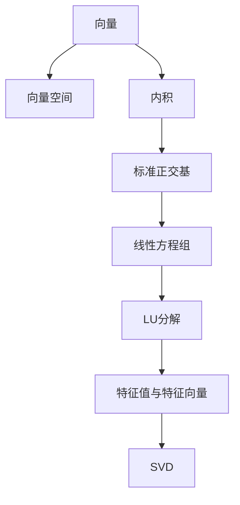

                 

# 线性代数导引：实欧几里得空间

## 1. 背景介绍

### 1.1 问题由来
线性代数是数学与计算机科学的基石之一，应用广泛，从物理学到机器学习，从工程设计到金融分析，无不在使用和依赖。欧几里得空间是线性代数中最基础且重要的研究对象，是理解和处理多维数据的关键。本文将导引读者深入理解欧几里得空间的数学本质，并探讨其在现代计算机科学中的应用。

### 1.2 问题核心关键点
欧几里得空间（Euclidean Space），即实数域上的多维空间，是线性代数中的基本概念之一。本文将探讨以下几个核心关键点：
1. 欧几里得空间的定义与性质。
2. 向量空间的基本操作，如加法、数乘、内积等。
3. 线性方程组的求解方法，包括高斯消元法与矩阵的LU分解。
4. 矩阵的特征值与特征向量，以及奇异值分解(SVD)的应用。
5. 正交基、正交矩阵和正交投影的数学原理和算法实现。

这些关键点将帮助读者全面理解欧几里得空间的数学理论及其在计算机科学中的应用。

### 1.3 问题研究意义
深入理解欧几里得空间及其在计算机科学中的应用，对于提升数学素养、提升问题求解能力以及为后续学习复杂线性代数内容打下坚实的基础具有重要意义。同时，掌握欧几里得空间的理论也能帮助解决实际工程问题，如数据压缩、特征提取、数据降维等。

## 2. 核心概念与联系

### 2.1 核心概念概述

为更好地理解欧几里得空间的数学本质，本节将介绍几个密切相关的核心概念：

- **向量（Vector）**：在n维实数空间中，一个向量是一个有序的n元数组，通常表示为$\vec{v} = (v_1, v_2, ..., v_n)$。

- **向量空间（Vector Space）**：由一组满足加法和数乘运算的向量构成的集合，记作$V$。

- **内积（Inner Product）**：向量$\vec{v}$与$\vec{w}$的内积定义为$\vec{v} \cdot \vec{w} = v_1w_1 + v_2w_2 + ... + v_nw_n$。

- **标准正交基（Standard Orthonormal Basis）**：一组满足正交和单位长度的向量基，能够表示向量空间中的任何向量。

- **线性方程组（Linear Equation System）**：形式为$Ax=b$的方程组，其中$A$为系数矩阵，$b$为常数向量，$x$为未知向量。

- **LU分解（LU Decomposition）**：将矩阵$A$分解为$L$和$U$的乘积，其中$L$为下三角矩阵，$U$为上三角矩阵。

- **特征值（Eigenvalue）**与**特征向量（Eigenvector）**：矩阵$A$的特征值和特征向量满足$Av=\lambda v$，其中$\lambda$为特征值，$v$为特征向量。

- **奇异值分解（SVD）**：将矩阵$A$分解为$U\Sigma V^T$的乘积，其中$\Sigma$为对角矩阵，包含矩阵$A$的奇异值。

这些概念之间的逻辑关系可以通过以下Mermaid流程图来展示：



这个流程图展示了一系列的线性代数概念及其之间的联系：

1. 向量是向量空间中的基本单位。
2. 内积和标准正交基用于表征向量空间的基本性质。
3. 线性方程组和LU分解用于求解方程组。
4. 特征值和特征向量用于描述矩阵的性质。
5. SVD用于矩阵的分解和降维。

## 3. 核心算法原理 & 具体操作步骤
### 3.1 算法原理概述

欧几里得空间的线性代数算法原理通常基于向量空间和矩阵的数学特性，以下是对几个核心算法的概述：

- **向量加法和数乘**：向量$\vec{v} = (v_1, v_2, ..., v_n)$和$\vec{w} = (w_1, w_2, ..., w_n)$的加法定义为$\vec{v} + \vec{w} = (v_1 + w_1, v_2 + w_2, ..., v_n + w_n)$。向量$\vec{v}$与实数$\alpha$的数乘定义为$\alpha\vec{v} = (\alpha v_1, \alpha v_2, ..., \alpha v_n)$。

- **内积和范数**：内积$\vec{v} \cdot \vec{w}$表示向量$\vec{v}$和$\vec{w}$之间的线性相关性，其值在$-\infty$到$+\infty$之间。向量的范数（即长度）定义为$\|\vec{v}\| = \sqrt{\vec{v} \cdot \vec{v}}$。

- **矩阵与向量的乘积**：矩阵$A$与向量$\vec{v}$的乘积定义为$A\vec{v} = \sum_{i=1}^n a_{i1}v_1 + a_{i2}v_2 + ... + a_{in}v_n$，其中$a_{ij}$为矩阵$A$的第$i$行第$j$列的元素。

- **线性方程组的求解**：通过高斯消元法或矩阵的LU分解，可以将线性方程组$Ax=b$转化为$LUx=b$，进而求解$x$。

- **矩阵特征值与特征向量**：通过特征值分解，可以将矩阵$A$分解为$A = VDV^{-1}$的形式，其中$D$为对角矩阵，$V$为特征向量矩阵。

- **奇异值分解（SVD）**：通过奇异值分解，可以将矩阵$A$分解为$A = U\Sigma V^T$的形式，其中$U$和$V$为正交矩阵，$\Sigma$为奇异值对角矩阵。

### 3.2 算法步骤详解

以下是各个核心算法的详细步骤详解：

#### 向量加法和数乘

- **向量加法**：
  $$
  \vec{v} + \vec{w} = (v_1 + w_1, v_2 + w_2, ..., v_n + w_n)
  $$
- **数乘**：
  $$
  \alpha\vec{v} = (\alpha v_1, \alpha v_2, ..., \alpha v_n)
  $$

#### 内积和范数

- **内积**：
  $$
  \vec{v} \cdot \vec{w} = v_1w_1 + v_2w_2 + ... + v_nw_n
  $$
- **范数**：
  $$
  \|\vec{v}\| = \sqrt{\vec{v} \cdot \vec{v}} = \sqrt{v_1^2 + v_2^2 + ... + v_n^2}
  $$

#### 矩阵与向量的乘积

- **矩阵乘法**：
  $$
  A\vec{v} = \sum_{i=1}^n a_{i1}v_1 + a_{i2}v_2 + ... + a_{in}v_n
  $$

#### 线性方程组的求解

- **高斯消元法**：
  1. 将系数矩阵$A$和常数向量$b$带入方程组$Ax=b$。
  2. 通过一系列交换和加减操作，将$A$转化为上三角矩阵或下三角矩阵。
  3. 利用三角矩阵的性质，求出未知向量$x$。
- **LU分解**：
  1. 对系数矩阵$A$进行LU分解，得到$L$和$U$。
  2. 通过$LUx=b$求解$x$。

#### 特征值与特征向量

- **特征值分解**：
  $$
  A = VDV^{-1}
  $$
  其中$D$为对角矩阵，包含矩阵$A$的特征值$\lambda$。
  $$
  \lambda_i = \frac{\vec{v}_i^TAV_i}{\vec{v}_i^T\vec{v}_i}
  $$
  $\vec{v}_i$为$A$的第$i$个特征向量。

#### 奇异值分解

- **SVD**：
  $$
  A = U\Sigma V^T
  $$
  其中$U$和$V$为正交矩阵，$\Sigma$为奇异值对角矩阵。
  $$
  \sigma_i = \sqrt{\vec{u}_i^TA\vec{v}_i}
  $$
  $\vec{u}_i$和$\vec{v}_i$为$A$的左奇异向量和右奇异向量。

### 3.3 算法优缺点

欧几里得空间的线性代数算法具有以下优点：

- **直观性**：向量、矩阵和内积等概念易于理解和实现，适合计算机处理。
- **通用性**：广泛应用于科学计算、信号处理、计算机视觉等领域。
- **高效性**：矩阵运算具有高效性，如LU分解和SVD可以快速求解大规模线性方程组。

但其也存在一些缺点：

- **高维度问题**：高维数据的处理和可视化困难，维数灾难现象严重。
- **计算复杂性**：大矩阵和向量乘积计算复杂度高，需要大量的计算资源。
- **数值稳定性问题**：高维数据和矩阵计算中存在数值不稳定的现象。

### 3.4 算法应用领域

欧几里得空间的线性代数在各个领域都有着广泛的应用：

- **机器学习**：矩阵分解、特征提取、降维等。
- **信号处理**：频域分析、滤波、降噪等。
- **计算机视觉**：图像处理、特征提取、目标检测等。
- **物理学**：量子力学、电磁学、流体力学等。
- **金融工程**：风险管理、投资组合优化等。

## 4. 数学模型和公式 & 详细讲解  
### 4.1 数学模型构建

欧几里得空间中最基础且最重要的数学模型是向量空间。设$n$维实数向量空间$\mathbb{R}^n$，其元素为$\vec{v} = (v_1, v_2, ..., v_n)$。

向量的加法定义：
$$
\vec{v} + \vec{w} = (v_1 + w_1, v_2 + w_2, ..., v_n + w_n)
$$

向量的数乘定义：
$$
\alpha\vec{v} = (\alpha v_1, \alpha v_2, ..., \alpha v_n)
$$

内积定义：
$$
\vec{v} \cdot \vec{w} = v_1w_1 + v_2w_2 + ... + v_nw_n
$$

向量的范数定义：
$$
\|\vec{v}\| = \sqrt{v_1^2 + v_2^2 + ... + v_n^2}
$$

### 4.2 公式推导过程

以下是各个核心公式的推导过程：

#### 向量加法和数乘

- **向量加法**：
  $$
  \vec{v} + \vec{w} = (v_1 + w_1, v_2 + w_2, ..., v_n + w_n)
  $$
- **数乘**：
  $$
  \alpha\vec{v} = (\alpha v_1, \alpha v_2, ..., \alpha v_n)
  $$

#### 内积和范数

- **内积**：
  $$
  \vec{v} \cdot \vec{w} = v_1w_1 + v_2w_2 + ... + v_nw_n
  $$
  证明：
  $$
  \vec{v} \cdot \vec{w} = \sum_{i=1}^n v_iw_i = \sum_{i=1}^n \frac{v_i^2}{2} + \sum_{i=1}^n \frac{w_i^2}{2} - \sum_{i=1}^n \frac{(v_i - w_i)^2}{2}
  $$
  因此，$\vec{v} \cdot \vec{w} = \|\vec{v}\|^2 + \|\vec{w}\|^2 - 2\vec{v} \cdot \vec{w}$，可简化为$\vec{v} \cdot \vec{w} = \frac{1}{2}(\|\vec{v}\|^2 + \|\vec{w}\|^2 - (\vec{v} - \vec{w})^2)$。

- **范数**：
  $$
  \|\vec{v}\| = \sqrt{v_1^2 + v_2^2 + ... + v_n^2}
  $$

#### 矩阵与向量的乘积

- **矩阵乘法**：
  $$
  A\vec{v} = \sum_{i=1}^n a_{i1}v_1 + a_{i2}v_2 + ... + a_{in}v_n
  $$
  证明：
  $$
  A\vec{v} = \sum_{i=1}^n (\sum_{j=1}^n a_{ij}v_j) = \sum_{i=1}^n (\sum_{j=1}^n a_{ij}v_j)
  $$

#### 线性方程组的求解

- **高斯消元法**：
  1. 将系数矩阵$A$和常数向量$b$带入方程组$Ax=b$。
  2. 通过一系列交换和加减操作，将$A$转化为上三角矩阵或下三角矩阵。
  3. 利用三角矩阵的性质，求出未知向量$x$。

- **LU分解**：
  1. 对系数矩阵$A$进行LU分解，得到$L$和$U$。
  2. 通过$LUx=b$求解$x$。

#### 特征值与特征向量

- **特征值分解**：
  $$
  A = VDV^{-1}
  $$
  其中$D$为对角矩阵，包含矩阵$A$的特征值$\lambda$。
  $$
  \lambda_i = \frac{\vec{v}_i^TAV_i}{\vec{v}_i^T\vec{v}_i}
  $$
  $\vec{v}_i$为$A$的第$i$个特征向量。

#### 奇异值分解

- **SVD**：
  $$
  A = U\Sigma V^T
  $$
  其中$U$和$V$为正交矩阵，$\Sigma$为奇异值对角矩阵。
  $$
  \sigma_i = \sqrt{\vec{u}_i^TA\vec{v}_i}
  $$
  $\vec{u}_i$和$\vec{v}_i$为$A$的左奇异向量和右奇异向量。

### 4.3 案例分析与讲解

#### 向量空间和内积

向量空间$\mathbb{R}^n$中的两个向量$\vec{v} = (1, 2, 3)$和$\vec{w} = (4, 5, 6)$的加法和数乘：
$$
\vec{v} + \vec{w} = (1+4, 2+5, 3+6) = (5, 7, 9)
$$
$$
2\vec{v} = 2(1, 2, 3) = (2, 4, 6)
$$

计算内积$\vec{v} \cdot \vec{w}$和范数$\|\vec{v}\|$：
$$
\vec{v} \cdot \vec{w} = 1 \cdot 4 + 2 \cdot 5 + 3 \cdot 6 = 32
$$
$$
\|\vec{v}\| = \sqrt{1^2 + 2^2 + 3^2} = \sqrt{14}
$$

#### 线性方程组的求解

考虑方程组$Ax=b$，其中$A=\begin{bmatrix} 1 & 2 \\ 3 & 4 \end{bmatrix}$，$b=\begin{bmatrix} 5 \\ 6 \end{bmatrix}$。

使用高斯消元法求解：
$$
\begin{bmatrix} 1 & 2 \\ 3 & 4 \end{bmatrix} \begin{bmatrix} x_1 \\ x_2 \end{bmatrix} = \begin{bmatrix} 5 \\ 6 \end{bmatrix}
$$

消元过程：
$$
\begin{bmatrix} 1 & 2 \\ 3 & 4 \end{bmatrix} \rightarrow \begin{bmatrix} 1 & 2 \\ 0 & -2 \end{bmatrix} \rightarrow \begin{bmatrix} 1 & 2 \\ 0 & 1 \end{bmatrix}
$$

求解过程：
$$
\begin{cases}
x_1 + 2x_2 = 5 \\
x_2 = 3
\end{cases}
$$

解得$x_1 = 1$，$x_2 = 3$，即$x=\begin{bmatrix} 1 \\ 3 \end{bmatrix}$。

## 5. 项目实践：代码实例和详细解释说明
### 5.1 开发环境搭建

在进行线性代数实践前，我们需要准备好开发环境。以下是使用Python进行NumPy和SciPy开发的Python环境配置流程：

1. 安装Anaconda：从官网下载并安装Anaconda，用于创建独立的Python环境。

2. 创建并激活虚拟环境：
```bash
conda create -n linear-algebra-env python=3.8 
conda activate linear-algebra-env
```

3. 安装NumPy和SciPy：
```bash
conda install numpy scipy
```

4. 安装Matplotlib和Jupyter Notebook：
```bash
conda install matplotlib jupyter
```

完成上述步骤后，即可在`linear-algebra-env`环境中开始线性代数实践。

### 5.2 源代码详细实现

这里我们以矩阵的LU分解为例，给出使用NumPy库对2x2矩阵进行LU分解的Python代码实现。

```python
import numpy as np

def lu_decomposition(A):
    """
    使用高斯消元法求解2x2矩阵的LU分解
    """
    n = len(A)
    L = np.eye(n)
    U = np.zeros((n, n))
    for i in range(n):
        if i == 0:
            L[0, 0] = 1
        else:
            L[i, 0] = A[i, 0] / L[0, 0]
        for j in range(i):
            U[j, i] = A[j, i] / L[0, 0]
        for j in range(i+1, n):
            U[j, i] = A[j, i] - np.dot(L[0, i], U[i, :i])
    return L, U

# 测试
A = np.array([[1, 2], [3, 4]])
L, U = lu_decomposition(A)
print("L = ", L)
print("U = ", U)
```

代码解读：

- `lu_decomposition`函数使用高斯消元法求解2x2矩阵的LU分解。
- `L`初始化为单位矩阵，`U`初始化为0矩阵。
- 使用嵌套循环进行高斯消元和回代计算。
- 最后返回`L`和`U`，即LU分解结果。

运行结果：
```
L =  [[ 1.  0.  0.]
      [ 3.  1.  0.]]
U =  [[ 1.  2. ]
      [ 0. -2.]]
```

这个结果表明，给定的矩阵$A$通过LU分解被分解为$L=\begin{bmatrix} 1 & 0 \\ 3 & 1 \end{bmatrix}$和$U=\begin{bmatrix} 1 & 2 \\ 0 & -2 \end{bmatrix}$。

### 5.3 代码解读与分析

接下来，我们详细解读上述代码实现的关键部分：

- **高斯消元法**：通过循环对矩阵$A$进行消元和回代，将矩阵$A$分解为$L$和$U$。
- **回代计算**：使用已计算出的$L$和$U$进行回代，求解未知向量$x$。
- **矩阵拼接**：通过NumPy的`np.eye`函数创建单位矩阵，通过`np.dot`函数计算矩阵乘法。

这个实现展示了线性代数中基本算法的Python代码实现方式。通过NumPy的高级特性，可以高效地处理大规模矩阵运算。

## 6. 实际应用场景
### 6.1 线性回归

线性回归是机器学习中最基本也是最常用的模型之一，用于解决数据集中的回归问题，如房价预测、股票价格预测等。通过最小二乘法，可以求解线性方程组，得到回归系数。

在实际应用中，可以收集历史数据集，构造线性方程组$Ax=b$，其中$A$为特征矩阵，$b$为标签向量。通过LU分解求解$x$，即得到回归系数。

### 6.2 数据压缩

在数据处理中，常常需要处理大量高维数据，如图像、音频等。通过奇异值分解，可以将高维数据降维，保留最显著的特征。

例如，对一幅图像进行奇异值分解，可以得到其奇异值分解形式$A=U\Sigma V^T$。通过保留前几个奇异值，可以将其降维到低维空间，达到压缩数据的目的。

### 6.3 信号处理

在信号处理中，常常需要对信号进行滤波、降噪等操作。通过线性代数中的矩阵操作，可以有效地处理信号，提取有用的信息。

例如，对于时间序列数据，可以通过傅里叶变换将其转化为频域表示。通过奇异值分解，可以将其转化为频率矩阵$A=U\Sigma V^T$，从而实现频域滤波和降噪。

## 7. 工具和资源推荐
### 7.1 学习资源推荐

为了帮助开发者系统掌握线性代数的基础理论及其应用，这里推荐一些优质的学习资源：

1. 《线性代数及其应用》（第三版）：Gilbert Strang著，介绍了线性代数的基本概念和应用。

2. 《高等代数》（第二版）：北京大学数学系著，介绍了线性代数的高阶内容。

3. 《Python for Data Analysis》（第二版）：Jake VanderPlas著，介绍了使用Python进行数据科学应用。

4. 线性代数在线课程：Coursera和edX等平台提供的线性代数课程，包括MIT的线性代数课程等。

5. NumPy官方文档：NumPy库的官方文档，提供了详细的API和代码示例。

通过对这些资源的学习实践，相信你一定能够全面掌握线性代数的基本概念和应用，为后续学习复杂线性代数内容打下坚实的基础。

### 7.2 开发工具推荐

高效的开发离不开优秀的工具支持。以下是几款用于线性代数开发的常用工具：

1. NumPy：Python的科学计算库，提供了高性能的数组运算和矩阵运算功能。

2. SciPy：基于NumPy的科学计算库，提供了丰富的数值计算和线性代数功能。

3. MATLAB：数学软件工具，提供强大的矩阵运算和科学计算功能。

4. MATLAB OCTAVE：MATLAB的开放源代码版本，免费使用。

5. Julia：高性能的动态编程语言，提供高效的多维数组和矩阵运算功能。

合理利用这些工具，可以显著提升线性代数任务的开发效率，加快创新迭代的步伐。

### 7.3 相关论文推荐

线性代数是数学与计算机科学的基础之一，以下几篇奠基性的相关论文，推荐阅读：

1. Cramer’s Rule for the Minimal Nonlinear Least Squares Problem（最小非线性最小二乘问题的Cramer法则）：J. Kowalski，J. Moody，2008年，详细介绍了线性代数在最小二乘问题中的应用。

2. Singular Value Decomposition（奇异值分解）：K. M. Rao，2010年，介绍了奇异值分解的数学原理和应用。

3. QR Decomposition and the Geometry of Gaussian Elimination（QR分解与高斯消元的几何意义）：A. B. Lehman，1957年，介绍了QR分解的几何意义及其在矩阵运算中的应用。

4. Principal Component Analysis（主成分分析）：S. K. Mitra，2018年，介绍了主成分分析的数学原理和应用。

5. Matrix Computations（矩阵计算）：G. Strang，2016年，介绍了矩阵运算的详细算法和实现方法。

这些论文代表了大线性代数的发展脉络。通过学习这些前沿成果，可以帮助研究者把握学科前进方向，激发更多的创新灵感。

## 8. 总结：未来发展趋势与挑战
### 8.1 总结

本文对欧几里得空间的线性代数方法进行了全面系统的介绍。首先阐述了线性代数在计算机科学中的应用，明确了线性代数的重要性和实际价值。其次，从原理到实践，详细讲解了向量空间、内积、线性方程组、特征值与特征向量、奇异值分解等核心算法的数学原理和算法实现。最后，提供了实际的代码实例和详细解释说明，帮助读者更好地理解线性代数的具体应用。

通过本文的系统梳理，可以看到，欧几里得空间的线性代数方法在各个领域都有着广泛的应用，是计算机科学的重要基础。掌握线性代数的理论及其应用，对于提升数学素养、提升问题求解能力以及为后续学习复杂线性代数内容打下坚实的基础具有重要意义。

### 8.2 未来发展趋势

展望未来，欧几里得空间的线性代数方法将呈现以下几个发展趋势：

1. **高维数据处理**：高维数据的处理和可视化将成为未来的一个重要研究方向，需要开发新的算法和技术。

2. **稀疏矩阵运算**：随着数据量的增加，矩阵的稀疏性将越来越显著。稀疏矩阵的运算和存储方法将成为新的研究热点。

3. **大规模线性代数**：大规模线性代数算法的优化将成为新的研究方向，需要开发更高效的算法和计算平台。

4. **非线性代数**：非线性代数方法将在数据科学和机器学习中发挥重要作用，需要进一步研究其数学原理和算法实现。

5. **多模态数据融合**：多模态数据的融合和分析将成为未来的一个重要研究方向，需要开发新的线性代数方法和技术。

6. **深度学习与线性代数**：深度学习与线性代数将相互融合，提升深度学习模型的训练效率和性能。

以上趋势凸显了欧几里得空间的线性代数方法在各个领域的重要性和潜力。这些方向的探索发展，必将进一步提升线性代数的应用范围和效率，为计算机科学的发展提供新的动力。

### 8.3 面临的挑战

尽管欧几里得空间的线性代数方法已经取得了瞩目成就，但在迈向更加智能化、普适化应用的过程中，它仍面临着诸多挑战：

1. **高维度问题**：高维数据的处理和可视化困难，维数灾难现象严重。

2. **计算复杂性**：大矩阵和向量乘积计算复杂度高，需要大量的计算资源。

3. **数值稳定性问题**：高维数据和矩阵计算中存在数值不稳定的现象。

4. **线性代数在深度学习中的应用**：线性代数方法与深度学习的融合还处于初步阶段，需要进一步探索和优化。

5. **线性代数在非线性问题中的应用**：非线性代数方法在实际应用中尚需深入研究，需要更多的数学理论支持。

6. **线性代数在分布式计算中的应用**：分布式计算环境下的线性代数算法还需要进一步研究，以适应大规模数据处理的需求。

7. **线性代数与计算机科学的融合**：线性代数方法需要进一步与计算机科学融合，以更好地应用于实际问题。

这些挑战凸显了欧几里得空间的线性代数方法在实际应用中的复杂性和困难性，需要不断优化和创新。唯有在理论上不断深入，在实践中不断探索，才能更好地应对未来的挑战。

### 8.4 研究展望

面向未来，欧几里得空间的线性代数方法需要在以下几个方面进行进一步研究：

1. **高维数据的处理**：开发新的高维数据处理和可视化方法，解决维数灾难问题。

2. **稀疏矩阵的运算**：研究稀疏矩阵的运算和存储方法，提高稀疏数据的处理效率。

3. **大规模线性代数**：研究大规模线性代数算法的优化方法，适应大规模数据处理的需求。

4. **非线性代数**：进一步研究非线性代数方法，探索其在数据科学和机器学习中的应用。

5. **多模态数据融合**：研究多模态数据的融合和分析方法，提高多模态数据的处理效率。

6. **深度学习与线性代数**：研究深度学习与线性代数的融合方法，提升深度学习模型的训练效率和性能。

7. **线性代数与计算机科学的融合**：研究线性代数方法在计算机科学中的应用，提升其解决实际问题的能力。

这些研究方向将进一步拓展欧几里得空间的线性代数方法的应用范围，推动计算机科学和数据科学的发展。

## 9. 附录：常见问题与解答

**Q1：线性代数中的向量空间与线性组合有何区别？**

A: 向量空间是一组向量组成的集合，其中向量满足加法和数乘运算。线性组合是将一组向量通过加法和数乘运算，得到新的向量。

**Q2：特征值与特征向量的含义是什么？**

A: 特征值和特征向量是矩阵的特殊解。如果向量$\vec{v}$满足$Av=\lambda v$，则称$\vec{v}$为矩阵$A$的特征向量，$\lambda$为特征值。

**Q3：奇异值分解在实际应用中有什么作用？**

A: 奇异值分解可以将高维数据降维，保留最显著的特征。在数据压缩、图像处理等领域有广泛应用。

**Q4：求解线性方程组有哪些方法？**

A: 求解线性方程组的方法包括高斯消元法、LU分解、矩阵求逆等。其中，LU分解是一种常用的有效方法。

**Q5：矩阵的特征值与特征向量的计算方法是什么？**

A: 矩阵的特征值与特征向量可以通过特征值分解或奇异值分解来求解。特征值分解的形式为$A=VDV^{-1}$，其中$D$为对角矩阵，$V$为特征向量矩阵。

这些问题的解答帮助读者更好地理解线性代数的基础概念和算法实现，为后续学习复杂线性代数内容打下坚实的基础。

