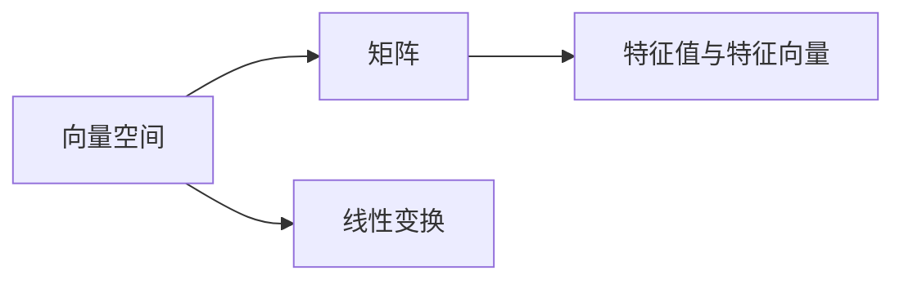

                 

# 线性代数导引：有限集与无限集

线性代数是数学中的核心分支之一，广泛应用于物理学、工程学、经济学等多个领域。本文旨在深入浅出地介绍线性代数中的有限集与无限集，探讨其在不同场景下的应用。

## 1. 背景介绍

### 1.1 问题由来

线性代数起源于几何学中的线性变换和矩阵运算，用于解决多元方程组和线性系统的求解问题。然而，随着计算机和算法的发展，线性代数已经延伸至更加广泛的领域，如数据分析、机器学习、信号处理等。

在实际应用中，数据往往以有限集和无限集的形式呈现。有限集通常指集合中元素数量可数，如向量、矩阵、标量等；无限集则表示集合中的元素不可数，如实数域、复数域等。本文将详细探讨有限集和无限集的概念及其在数据处理和计算中的应用。

## 2. 核心概念与联系

### 2.1 核心概念概述

为更好地理解有限集与无限集，本节将介绍几个密切相关的核心概念：

- 向量空间：指由一组线性独立的向量组成的集合，通常记为 $\mathbb{R}^n$ 或 $\mathbb{C}^n$，其中 $\mathbb{R}$ 和 $\mathbb{C}$ 分别表示实数域和复数域。
- 矩阵：由多个行向量组成的二维数组，可以表示为 $A = [a_{i,j}]_{m\times n}$，其中 $a_{i,j}$ 为元素。
- 线性变换：将向量空间中的向量映射到另一个向量空间的操作，通常记为 $T(v)$，其中 $v$ 为向量。
- 特征值与特征向量：对于矩阵 $A$，如果存在非零向量 $x$ 和标量 $\lambda$ 使得 $Ax = \lambda x$，则称 $\lambda$ 为 $A$ 的特征值，$x$ 为对应的特征向量。

这些核心概念之间的逻辑关系可以通过以下Mermaid流程图来展示：



这个流程图展示了几组核心概念之间的关联：

1. 向量空间是由矩阵组成的基础单元。
2. 矩阵是向量空间的线性表示。
3. 线性变换是矩阵对向量空间中向量进行映射的过程。
4. 特征值与特征向量揭示了矩阵对向量的影响关系。

这些概念共同构成了线性代数的基础框架，帮助我们理解向量空间和矩阵运算的数学本质。

## 3. 核心算法原理 & 具体操作步骤

### 3.1 算法原理概述

有限集和无限集在数学中有着不同的定义和性质。在实际应用中，通过矩阵运算和特征值分解等方法，可以有效地处理和分析有限集与无限集的数据。

有限集通常指集合中元素数量有限，如向量、矩阵等，可以通过计算其特征向量、特征值、奇异值分解等方法进行分析和处理。无限集则指元素数量无法计数，如实数域、复数域等，需要通过矩阵近似、奇异值截断等方法进行数值处理。

### 3.2 算法步骤详解

#### 3.2.1 有限集处理

1. **特征向量与特征值求解**：对于向量空间中的矩阵 $A$，可以使用特征值分解求解 $A$ 的特征值与特征向量。
   - **SVD分解**：对于矩阵 $A$，可以将其分解为三个矩阵的乘积 $A = U\Sigma V^T$，其中 $U$ 和 $V$ 为正交矩阵，$\Sigma$ 为对角矩阵。通过 SVD 分解，可以求解矩阵 $A$ 的特征值和特征向量。
   - **QR分解**：对于矩阵 $A$，可以将其分解为 $A = QR$，其中 $Q$ 为正交矩阵，$R$ 为上三角矩阵。通过 QR 分解，可以求解矩阵 $A$ 的特征值和特征向量。

2. **奇异值分解**：对于高维矩阵 $A$，可以通过奇异值分解 $A = U\Sigma V^T$ 来分解矩阵，其中 $U$ 和 $V$ 为正交矩阵，$\Sigma$ 为对角矩阵，对角线上的元素为矩阵 $A$ 的奇异值。奇异值分解可以用于降维、去噪等处理。

3. **最小二乘解**：对于线性方程组 $Ax = b$，可以通过最小二乘法求解 $x$，即求解 $x$ 使得 $||Ax - b||^2$ 最小。最小二乘法可以用于解决过拟合等问题。

#### 3.2.2 无限集处理

1. **矩阵近似**：对于无限集中的矩阵，可以将其分解为有限矩阵的近似。例如，对于实数域中的矩阵，可以使用截断奇异值分解（Truncated SVD）进行近似。

2. **奇异值截断**：对于高维矩阵，可以通过奇异值截断将其降维。即保留前 $k$ 个奇异值，忽略其余奇异值，得到近似矩阵。

3. **正交矩阵的构造**：对于无限集中的矩阵，可以通过构造正交矩阵进行近似。例如，QR 分解中构造的 $Q$ 矩阵即为正交矩阵。

### 3.3 算法优缺点

有限集和无限集处理算法各有优缺点：

1. **有限集处理的优点**：
   - 精确性高：有限集处理算法可以精确计算矩阵的特征值、特征向量等。
   - 可解释性强：有限集处理算法的结果可以直接解释矩阵的线性变换性质。

2. **有限集处理的缺点**：
   - 计算复杂度高：有限集处理算法通常需要计算矩阵的特征值、特征向量等，计算复杂度高。
   - 数据量限制：有限集处理算法只适用于数据量较小的矩阵，对于高维矩阵，计算复杂度会急剧上升。

3. **无限集处理的优点**：
   - 计算复杂度低：无限集处理算法通过矩阵近似和奇异值截断等方法，计算复杂度低。
   - 适用于高维矩阵：无限集处理算法可以处理高维矩阵，适用于大规模数据集。

4. **无限集处理的缺点**：
   - 精确性差：无限集处理算法通常只能近似计算矩阵的特征值、特征向量等，精确性较差。
   - 可解释性差：无限集处理算法的结果通常难以直接解释矩阵的线性变换性质。

### 3.4 算法应用领域

有限集和无限集处理算法在多个领域中得到广泛应用，例如：

- 信号处理：信号可以看作矩阵，通过奇异值分解和矩阵近似等方法，可以去除噪声，提高信号处理效果。
- 机器学习：在特征提取和模型训练中，矩阵和向量常常作为输入，通过特征值分解和奇异值截断等方法，可以提高模型的准确性和泛化能力。
- 计算机视觉：图像可以看作矩阵，通过奇异值分解和矩阵近似等方法，可以进行图像压缩、去噪等处理。
- 量子计算：量子态可以看作矩阵，通过奇异值分解和矩阵近似等方法，可以处理量子态的演化和测量问题。

## 4. 数学模型和公式 & 详细讲解 & 举例说明

### 4.1 数学模型构建

线性代数中，向量空间、矩阵、特征值与特征向量等概念构成了其核心模型。

对于矩阵 $A = [a_{i,j}]_{m\times n}$，其特征向量 $\mathbf{x} = [x_1, x_2, \dots, x_n]^T$ 和特征值 $\lambda$ 满足：

$$
A\mathbf{x} = \lambda\mathbf{x}
$$

特征向量 $\mathbf{x}$ 可以通过奇异值分解或 QR 分解求解。

### 4.2 公式推导过程

对于矩阵 $A$，其奇异值分解为 $A = U\Sigma V^T$，其中 $U$ 和 $V$ 为正交矩阵，$\Sigma$ 为对角矩阵，对角线上的元素为矩阵 $A$ 的奇异值 $\sigma_i$。

奇异值分解的过程如下：

1. **奇异值排序**：将矩阵 $A$ 的奇异值按照从大到小排序，记为 $\sigma_1 \geq \sigma_2 \geq \dots \geq \sigma_r$。
2. **构造正交矩阵**：通过 QR 分解或 SVD 分解，构造正交矩阵 $U$ 和 $V$，使得 $U^TU = I$ 和 $V^TV = I$。
3. **构造对角矩阵**：构造对角矩阵 $\Sigma$，使得 $\Sigma_{i,i} = \sigma_i$。
4. **构造近似矩阵**：将矩阵 $A$ 近似表示为 $A \approx U\Sigma V^T$。

### 4.3 案例分析与讲解

**案例1：矩阵近似**

对于高维矩阵 $A$，可以使用奇异值截断的方法进行近似。

例如，对于一个 $5\times 5$ 的矩阵 $A$，可以将其分解为 $A = U\Sigma V^T$，其中 $U$ 和 $V$ 为正交矩阵，$\Sigma$ 为对角矩阵。假设 $A$ 的奇异值从大到小排序为 $\sigma_1 = 10, \sigma_2 = 3, \sigma_3 = 0.1$，则可以保留前两个奇异值，忽略第三个奇异值，得到近似矩阵 $A' \approx U_1\Sigma_1 V_1^T$，其中 $U_1$ 和 $V_1$ 为 $U$ 和 $V$ 的前两个列向量。

**案例2：特征值与特征向量求解**

对于向量空间中的矩阵 $A$，可以使用特征值分解求解 $A$ 的特征值与特征向量。

例如，对于 $3\times 3$ 的矩阵 $A = \begin{bmatrix} 2 & 1 & 0 \\ 1 & 2 & 0 \\ 0 & 0 & 1 \end{bmatrix}$，可以使用特征值分解求解其特征值和特征向量。

通过计算得到 $A$ 的特征值为 $\lambda_1 = 3, \lambda_2 = 1, \lambda_3 = 0$，对应的特征向量为 $\mathbf{x}_1 = \begin{bmatrix} 1 \\ 1 \\ 0 \end{bmatrix}, \mathbf{x}_2 = \begin{bmatrix} 1 \\ 0 \\ 1 \end{bmatrix}, \mathbf{x}_3 = \begin{bmatrix} 0 \\ 1 \\ 0 \end{bmatrix}$。

## 5. 项目实践：代码实例和详细解释说明

### 5.1 开发环境搭建

在进行线性代数项目开发前，我们需要准备好开发环境。以下是使用Python进行NumPy开发的环境配置流程：

1. 安装Anaconda：从官网下载并安装Anaconda，用于创建独立的Python环境。

2. 创建并激活虚拟环境：
```bash
conda create -n lin-alg-env python=3.8 
conda activate lin-alg-env
```

3. 安装NumPy：
```bash
pip install numpy
```

4. 安装必要的工具包：
```bash
pip install matplotlib scikit-learn jupyter notebook ipython
```

完成上述步骤后，即可在`lin-alg-env`环境中开始线性代数项目开发。

### 5.2 源代码详细实现

下面我们以奇异值分解（SVD）和QR分解为例，给出使用NumPy进行线性代数计算的代码实现。

首先，导入NumPy库：

```python
import numpy as np
```

然后，定义一个 $3\times 3$ 的矩阵 $A$：

```python
A = np.array([[2, 1, 0],
              [1, 2, 0],
              [0, 0, 1]])
```

接着，进行奇异值分解：

```python
U, S, V = np.linalg.svd(A)
```

最后，输出分解结果：

```python
print("U =\n", U)
print("S =\n", S)
print("V =\n", V)
```

运行以上代码，即可输出矩阵 $A$ 的奇异值分解结果。

### 5.3 代码解读与分析

**奇异值分解过程**：

1. **奇异值排序**：使用NumPy的 `svd` 函数进行奇异值分解，返回矩阵 $U$、$S$ 和 $V$。
2. **构造近似矩阵**：根据奇异值排序结果，使用 `U`、$S$ 和 $V$ 构造近似矩阵 $A' \approx U\Sigma V^T$。

**QR分解过程**：

1. **QR分解**：使用NumPy的 `qr` 函数进行QR分解，返回矩阵 $Q$ 和 $R$。
2. **构造近似矩阵**：根据QR分解结果，构造近似矩阵 $A' \approx QR$。

需要注意的是，NumPy的奇异值分解和QR分解函数默认返回的是矩阵的列向量，因此需要进行转置操作。

## 6. 实际应用场景

### 6.1 数据压缩

数据压缩是线性代数在数据处理中的一个重要应用。通过奇异值截断，可以将高维数据矩阵压缩为低维近似矩阵，从而减少存储空间和计算资源消耗。

在实际应用中，可以使用奇异值截断对图像、音频、视频等高维数据进行压缩。例如，对于一个 $256\times 256$ 的彩色图像，可以将其分解为 $256\times 256 \times 3$ 的矩阵 $A$，然后使用奇异值截断保留前 $k$ 个奇异值，得到近似矩阵 $A' \approx U\Sigma V^T$。通过调整 $k$ 值，可以控制压缩比例，平衡压缩效果和计算复杂度。

### 6.2 推荐系统

推荐系统是线性代数在机器学习中的一个重要应用。通过奇异值分解，可以提取高维矩阵的特征，用于推荐算法中。

在推荐系统中，用户-物品评分矩阵可以表示为 $A_{m\times n}$，其中 $m$ 为用户数，$n$ 为物品数。通过奇异值分解，可以得到用户和物品的隐向量表示，用于计算用户对物品的评分。

### 6.3 信号处理

信号处理是线性代数在信号处理中的一个重要应用。通过奇异值分解和QR分解，可以对信号进行去噪、滤波等处理。

在信号处理中，信号可以表示为矩阵 $A$，其中 $A$ 的元素为信号的采样值。通过奇异值分解，可以去除信号中的噪声，得到干净的信号表示。例如，对于语音信号，可以使用奇异值分解进行降噪处理，提高语音质量。

## 7. 工具和资源推荐

### 7.1 学习资源推荐

为了帮助开发者系统掌握线性代数的原理和应用，这里推荐一些优质的学习资源：

1. 《线性代数及其应用》：一本经典的线性代数教材，详细讲解了线性代数的核心概念和应用。
2. MIT 线性代数课程：麻省理工学院开设的线性代数在线课程，讲解清晰，适合初学者。
3. 《Matrix Analysis》：一本深入讲解矩阵分析的书籍，适合进阶学习者。
4. Linear Algebra with Applications：一本应用导向的线性代数教材，讲解了线性代数的实际应用。
5. NumPy官方文档：NumPy库的官方文档，提供了丰富的线性代数函数和示例，适合快速上手。

通过对这些资源的学习实践，相信你一定能够系统掌握线性代数的精髓，并应用于实际问题解决中。

### 7.2 开发工具推荐

高效的开发离不开优秀的工具支持。以下是几款用于线性代数开发的常用工具：

1. NumPy：Python的科学计算库，提供了丰富的线性代数函数，适合快速迭代研究。
2. MATLAB：由MathWorks开发的数学计算软件，支持线性代数、优化、信号处理等众多领域。
3. Octave：一个开源的类MATLAB软件，支持线性代数、图像处理、信号处理等众多功能。
4. Mathematica：由Wolfram公司开发的数学计算软件，支持线性代数、微积分、符号计算等众多功能。
5. Jupyter Notebook：一个交互式的编程环境，支持Python、R等多种语言，适合数据科学和算法开发。

合理利用这些工具，可以显著提升线性代数开发和研究的效率，加速创新迭代的步伐。

### 7.3 相关论文推荐

线性代数在数学和计算机科学中有着广泛的研究，以下是几篇奠基性的相关论文，推荐阅读：

1. "Matrix Computations"：Lanczos和Kahan的著作，详细介绍了矩阵运算的实现方法和应用。
2. "Linear Algebra Done Right"：Sheldon Axler的著作，讲解了线性代数的核心概念和应用。
3. "The Matrix Calculus You Need for Deep Learning"：Pearson和Eberlein的论文，详细讲解了矩阵微积分在深度学习中的应用。
4. "Numerical Linear Algebra"：Vogel的著作，讲解了矩阵运算的数值稳定性和精度问题。
5. "Numerical Methods for Least Squares Problems"：Golub和Van Loan的著作，讲解了最小二乘问题的数值解法。

这些论文代表了线性代数领域的前沿进展，通过学习这些前沿成果，可以帮助研究者把握学科前进方向，激发更多的创新灵感。

## 8. 总结：未来发展趋势与挑战

### 8.1 总结

本文对线性代数中的有限集与无限集进行了全面系统的介绍。首先阐述了线性代数的基本概念和核心模型，明确了矩阵、特征值、奇异值等关键概念。其次，从原理到实践，详细讲解了奇异值分解、QR分解等有限集处理算法的实现步骤，以及矩阵近似、奇异值截断等无限集处理算法的应用场景。最后，介绍了线性代数在数据压缩、推荐系统、信号处理等多个领域的应用实例。

通过本文的系统梳理，可以看到，线性代数在数据处理和计算中有着广泛的应用前景。它可以高效处理高维矩阵和向量，提取数据中的特征，应用于推荐系统、信号处理等多个领域。未来，伴随算法的不断演进和工具的不断完善，线性代数必将在更多领域发挥更大的作用。

### 8.2 未来发展趋势

展望未来，线性代数的发展趋势将呈现以下几个方向：

1. **算法优化**：随着算法优化技术的不断进步，线性代数计算将变得更加高效和稳定。
2. **多模态融合**：线性代数将与其他数学工具，如微积分、概率论等，进行更深入的融合，形成更加全面的数学框架。
3. **分布式计算**：随着分布式计算技术的不断进步，线性代数计算将能够处理更大规模的数据集。
4. **深度学习融合**：线性代数将与深度学习技术进行更深入的融合，应用于图像处理、自然语言处理等更多领域。
5. **跨学科应用**：线性代数将在更多学科中得到应用，如经济学、工程学、物理学等，拓展其应用边界。

以上趋势凸显了线性代数在数学和计算机科学中的重要地位，其应用前景将更加广阔。

### 8.3 面临的挑战

尽管线性代数在数据处理和计算中具有重要地位，但在实际应用中仍面临诸多挑战：

1. **计算复杂度**：高维矩阵和向量计算的复杂度较高，计算资源消耗大。
2. **数据量大**：大规模数据集的线性代数计算需要大量的存储空间和计算资源。
3. **可解释性差**：线性代数计算的结果通常难以直接解释，需要额外的工具进行解释。
4. **数值稳定性**：线性代数计算中的数值稳定性问题需要特别注意，避免计算误差过大。

### 8.4 研究展望

面对线性代数面临的挑战，未来的研究需要在以下几个方面寻求新的突破：

1. **算法优化**：开发更加高效的线性代数算法，减少计算复杂度，降低资源消耗。
2. **多模态融合**：探索线性代数与其他数学工具的融合，形成更加全面的数学框架。
3. **分布式计算**：研究分布式线性代数计算技术，处理大规模数据集。
4. **深度学习融合**：探索线性代数与深度学习的融合，应用于更多领域。
5. **可解释性增强**：开发可解释性强的线性代数工具，提高计算结果的可解释性。

这些研究方向的探索，将推动线性代数技术向更高的台阶发展，为更多学科和领域的创新提供新的工具和方法。

## 9. 附录：常见问题与解答

**Q1：奇异值分解和QR分解的区别是什么？**

A: 奇异值分解（SVD）和QR分解都是矩阵分解的方法，但它们的应用场景和算法实现有所不同：

- 奇异值分解（SVD）：主要用于矩阵近似和去噪等任务，适用于高维矩阵的压缩和降维。
- QR分解：主要用于线性方程组求解和矩阵特征值的计算，适用于低维矩阵的线性变换分析。

**Q2：奇异值截断和奇异值分解的区别是什么？**

A: 奇异值截断（Truncated SVD）和奇异值分解（SVD）都是矩阵分解的方法，但它们的应用场景和算法实现有所不同：

- 奇异值截断（Truncated SVD）：主要用于矩阵近似和数据压缩等任务，适用于高维矩阵的压缩和降维。
- 奇异值分解（SVD）：主要用于矩阵特征值的求解和矩阵的特征向量分解，适用于矩阵的特征分析和线性变换分析。

**Q3：矩阵近似和奇异值截断的精度如何控制？**

A: 矩阵近似和奇异值截断的精度控制可以通过调整保留的奇异值数量来实现。一般来说，保留的奇异值越多，矩阵的近似越精确，但计算复杂度也越高。因此需要根据具体应用场景和计算资源进行平衡。

**Q4：奇异值分解的应用场景有哪些？**

A: 奇异值分解在多个领域中得到广泛应用，例如：

- 数据压缩：奇异值分解可以将高维数据矩阵压缩为低维近似矩阵，减少存储空间和计算资源消耗。
- 推荐系统：奇异值分解可以提取用户和物品的隐向量表示，用于推荐算法中。
- 信号处理：奇异值分解可以去除信号中的噪声，提高信号质量。
- 计算机视觉：奇异值分解可以用于图像压缩、去噪等处理。

**Q5：奇异值截断的应用场景有哪些？**

A: 奇异值截断在多个领域中得到广泛应用，例如：

- 数据压缩：奇异值截断可以将高维数据矩阵压缩为低维近似矩阵，减少存储空间和计算资源消耗。
- 图像处理：奇异值截断可以用于图像压缩、去噪等处理。
- 推荐系统：奇异值截断可以用于矩阵近似和推荐算法中的隐向量表示。
- 信号处理：奇异值截断可以用于信号压缩和去噪处理。

---

作者：禅与计算机程序设计艺术 / Zen and the Art of Computer Programming

