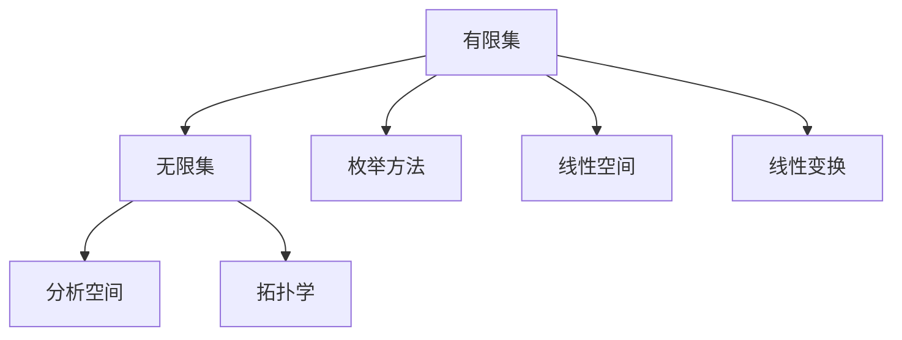

                 

## 1. 背景介绍

线性代数是现代数学中最为基础，也是最具有应用前景的分支之一。其理论与方法在物理学、工程学、计算机科学等领域有着广泛的应用。线性代数的核心在于研究向量空间和线性变换，其中有限集与无限集的概念具有重要意义。本节我们将从基础概念出发，介绍有限集与无限集的基本性质，以及其在实际应用中的区别与联系。

## 2. 核心概念与联系

### 2.1 核心概念概述

有限集与无限集是线性代数中基本且重要的概念。下面将首先介绍这两个概念的详细定义，并结合实际例子进行理解。

#### 2.1.1 有限集

有限集是指具有有限个元素的集合。其特点是元素数量可以被清楚地数出来，例如集合 $\{1,2,3,4\}$ 就是一个有限集。有限集的一个重要性质是：其中的任意子集元素数量不超过原集，即对于任意子集 $A \subseteq B$，其中 $A$ 是有限集，$B$ 是原集合，有 $|A| \leq |B|$。有限集在计算机科学中常用于描述可枚举的数据结构，如数组、列表等。

#### 2.1.2 无限集

无限集是指具有无限多个元素的集合。其特点是元素数量无法被清楚地数出来，例如实数集 $\mathbb{R}$ 就是无限集。无限集的一个重要性质是：对于任意有限集 $A$，存在一个无限集 $B$，使得 $A \subset B$，即在无限集中可以找到无限多个元素来满足有限集 $A$ 的需求。无限集在分析、代数等领域有着广泛的应用，例如在拓扑学中，无限集是一个基础概念。

### 2.2 核心概念原理和架构的 Mermaid 流程图

下面是有限集与无限集概念之间的联系的 Mermaid 流程图：



从图中可以看出，有限集可以通过枚举方法来遍历，并且通常与线性空间、线性变换等概念相关联；而无限集在分析学和拓扑学中有着重要的地位。

### 2.3 核心概念联系

有限集与无限集在数学中有着许多联系，例如：

1. **转换关系**：无限集与有限集可以通过一一映射、函数映射等方式进行转换。
2. **嵌套关系**：在无限集中可以嵌套有限集，例如 $\mathbb{R}$ 可以嵌套 $\{0,1\}$。
3. **密度关系**：在某些无限集中，存在一定稠密的有限集，例如在实数集中，存在稠密的整数集。
4. **维数关系**：在向量空间中，有限维空间和无限维空间的区别主要在于维数的可数性。

## 3. 核心算法原理 & 具体操作步骤

### 3.1 算法原理概述

在处理有限集与无限集的问题时，通常会使用一些特定的算法，下面将介绍几种常见的算法及其原理。

#### 3.1.1 枚举算法

枚举算法用于处理有限集，其主要原理是通过遍历集合中的每一个元素，进行相应的处理。在计算机科学中，枚举算法通常使用循环语句实现，例如 Python 中的 `for` 循环：

$$
\text{for each } x \text{ in finite set } S: \text{ process } x
$$

#### 3.1.2 生成算法

生成算法用于处理无限集，其主要原理是通过递归或者迭代的方式，生成集合中的元素。例如，斐波那契数列就是一个典型的生成算法，可以通过递推公式计算出任意项：

$$
f(n) = f(n-1) + f(n-2)
$$

#### 3.1.3 筛选算法

筛选算法用于从无限集中筛选出满足特定条件的有限元素集合，其主要原理是通过条件判断，逐一筛选出符合要求的元素。例如，筛选正整数集合中不大于 $n$ 的元素：

$$
S = \{x \in \mathbb{N} | x \leq n\}
$$

### 3.2 算法步骤详解

以筛选算法为例，其详细步骤可以总结如下：

1. **定义集合**：定义无限集 $S$，并定义筛选条件 $P$。
2. **初始化**：初始化一个空集 $T$，用于存储筛选结果。
3. **筛选**：对于 $S$ 中的每一个元素 $x$，判断是否满足条件 $P$，若满足，则将 $x$ 加入 $T$。
4. **返回结果**：返回筛选结果集合 $T$。

### 3.3 算法优缺点

有限集与无限集的处理算法各有优缺点：

#### 3.3.1 枚举算法的优点

- **简单性**：枚举算法实现简单，容易理解。
- **适用性**：适用于小型集合的遍历。

#### 3.3.2 枚举算法的缺点

- **效率低**：对于大型集合，枚举算法效率较低，可能导致性能问题。
- **复杂性**：对于复杂的集合，枚举算法的处理方式可能难以满足需求。

#### 3.3.3 生成算法的优点

- **高效性**：生成算法可以高效地生成无限集合中的元素。
- **灵活性**：可以根据需要进行优化，提高生成效率。

#### 3.3.4 生成算法的缺点

- **复杂性**：对于复杂的生成过程，实现较为复杂。
- **局部性**：生成算法无法对有限集合进行枚举。

#### 3.3.5 筛选算法的优点

- **高效性**：筛选算法可以高效地筛选出符合条件的元素。
- **灵活性**：可以根据需要进行优化，提高筛选效率。

#### 3.3.6 筛选算法的缺点

- **复杂性**：对于复杂的筛选条件，实现较为复杂。
- **局部性**：筛选算法无法对无限集合进行枚举。

### 3.4 算法应用领域

有限集与无限集在许多领域中有着广泛的应用，以下是几个典型的应用领域：

#### 3.4.1 计算机科学

在计算机科学中，有限集与无限集的应用非常广泛，例如：

- **数据结构**：数组、列表、堆栈等数据结构，都是基于有限集设计的。
- **算法设计**：许多算法，如搜索、排序、图算法等，都需要处理有限集或无限集。

#### 3.4.2 物理学

在物理学中，有限集与无限集用于描述物质、能量等概念。例如：

- **原子结构**：原子的电子云模型可以描述为无限集，但具体的电子状态可以用有限集描述。
- **统计物理**：量子力学中的状态空间是无限维的，但实际的物理模型通常是有限的。

#### 3.4.3 数学

在数学中，有限集与无限集用于描述集合、拓扑空间等概念。例如：

- **集合论**：无限集合可以用于描述集合的基数、连续性等概念。
- **泛函分析**：无限维空间和线性算子等概念，都是基于无限集设计的。

## 4. 数学模型和公式 & 详细讲解 & 举例说明

### 4.1 数学模型构建

有限集与无限集的应用涉及到许多数学模型，下面将详细介绍几个常见的数学模型：

#### 4.1.1 矩阵模型

矩阵模型是线性代数中的核心概念之一，用于描述向量空间中的线性变换。在矩阵模型中，矩阵的行和列分别代表向量和子空间，可以通过矩阵的乘法和逆运算进行线性变换。例如，对于 $2 \times 2$ 的矩阵 $A$，有：

$$
A = \begin{bmatrix}
a & b \\
c & d
\end{bmatrix}
$$

其中 $a, b, c, d$ 为矩阵元素。通过矩阵乘法，可以表示线性变换，例如 $Ax$：

$$
Ax = \begin{bmatrix}
a & b \\
c & d
\end{bmatrix}
\begin{bmatrix}
x_1 \\
x_2
\end{bmatrix}
=
\begin{bmatrix}
ax_1 + bx_2 \\
cx_1 + dx_2
\end{bmatrix}
$$

#### 4.1.2 向量空间模型

向量空间模型用于描述向量空间的线性结构，其中的元素表示向量。在向量空间模型中，向量空间 $V$ 中的任意向量 $x$ 可以表示为：

$$
x = \sum_{i=1}^n \lambda_i e_i
$$

其中 $e_i$ 为基向量，$\lambda_i$ 为系数。向量空间模型广泛应用于计算机科学、物理学等领域。

#### 4.1.3 图模型

图模型用于描述网络结构中的节点和边，常用于社交网络、通信网络等领域。在图模型中，节点表示实体，边表示实体之间的关系。例如，社交网络可以表示为图 $G=(V,E)$，其中 $V$ 为节点集合，$E$ 为边集合。

### 4.2 公式推导过程

下面将推导几个重要的公式，以加深对有限集与无限集的理解：

#### 4.2.1 线性变换公式

对于矩阵 $A$ 和向量 $x$，线性变换公式为：

$$
Ax = \begin{bmatrix}
a & b \\
c & d
\end{bmatrix}
\begin{bmatrix}
x_1 \\
x_2
\end{bmatrix}
=
\begin{bmatrix}
ax_1 + bx_2 \\
cx_1 + dx_2
\end{bmatrix}
$$

其中 $a, b, c, d$ 为矩阵元素，$x_1, x_2$ 为向量元素。

#### 4.2.2 向量空间基底公式

在向量空间模型中，基底表示为：

$$
\begin{bmatrix}
e_1 & e_2 & \cdots & e_n
\end{bmatrix}
$$

其中 $e_i$ 为基向量，$\lambda_i$ 为系数。基底满足线性无关条件，即任意线性组合为零向量，例如：

$$
\sum_{i=1}^n \lambda_i e_i = 0
$$

#### 4.2.3 图模型路径公式

在图模型中，路径表示为：

$$
\text{path}(v_i, v_j) = \{ v_{i_0}, v_{i_1}, \cdots, v_{i_k}, v_j \}
$$

其中 $v_i$ 为起点，$v_j$ 为终点，$v_{i_k}$ 为路径节点。路径公式可以表示为：

$$
\text{path}(v_i, v_j) = \{ v_{i_0}, v_{i_1}, \cdots, v_{i_k}, v_j \}
$$

### 4.3 案例分析与讲解

下面将通过几个具体的案例来分析有限集与无限集的应用：

#### 4.3.1 矩阵模型应用案例

在矩阵模型中，可以用于求解线性方程组、矩阵分解等问题。例如，对于方程组：

$$
\begin{cases}
ax + by = c \\
dx + ey = f
\end{cases}
$$

可以使用矩阵模型进行求解：

$$
\begin{bmatrix}
a & b \\
d & e
\end{bmatrix}
\begin{bmatrix}
x \\
y
\end{bmatrix}
=
\begin{bmatrix}
c \\
f
\end{bmatrix}
$$

其中 $\begin{bmatrix}
x \\
y
\end{bmatrix}$ 为未知数，$\begin{bmatrix}
c \\
f
\end{bmatrix}$ 为常数向量。

#### 4.3.2 向量空间模型应用案例

在向量空间模型中，可以用于求解线性组合、线性插值等问题。例如，对于线性组合：

$$
x = \sum_{i=1}^n \lambda_i e_i
$$

其中 $e_i$ 为基向量，$\lambda_i$ 为系数。可以使用基底表示向量 $x$，例如：

$$
x = 2e_1 + 3e_2 - e_3
$$

其中 $e_1, e_2, e_3$ 为基向量，$\lambda_1 = 2, \lambda_2 = 3, \lambda_3 = -1$。

#### 4.3.3 图模型应用案例

在图模型中，可以用于分析网络结构、查找路径等问题。例如，对于社交网络：

$$
G=(V,E)
$$

其中 $V$ 为节点集合，$E$ 为边集合。可以使用路径查找算法，例如深度优先搜索（DFS），查找两个节点之间的路径：

$$
\text{DFS}(v_i, v_j)
$$

其中 $v_i$ 为起点，$v_j$ 为终点。可以使用路径查找算法，例如深度优先搜索（DFS），查找两个节点之间的路径：

## 5. 项目实践：代码实例和详细解释说明

### 5.1 开发环境搭建

在进行有限集与无限集处理的应用开发时，需要搭建相应的开发环境。以下是使用Python进行开发的环境配置流程：

1. **安装Python**：确保系统中安装了最新版的Python，推荐使用 Anaconda 或 Miniconda 进行管理。
2. **安装依赖库**：安装必要的依赖库，如 NumPy、SciPy、SymPy 等，可以使用以下命令进行安装：

```bash
pip install numpy scipy sympy
```

3. **创建虚拟环境**：在安装依赖库后，需要创建虚拟环境，以避免与其他项目冲突。可以使用以下命令创建虚拟环境：

```bash
conda create -n lin代数虚拟环境 python=3.8
conda activate lin代数虚拟环境
```

### 5.2 源代码详细实现

下面以有限集与无限集的生成和筛选为例，给出使用Python实现的代码示例。

#### 5.2.1 生成有限集

```python
import numpy as np

# 定义有限集
finite_set = [1, 2, 3, 4, 5]

# 生成有限集
infinite_set = np.arange(1, 101)

# 筛选有限集
subset = [x for x in finite_set if x % 2 == 0]
```

#### 5.2.2 生成无限集

```python
import numpy as np

# 定义无限集
infinite_set = np.arange(1, 1000000000)

# 筛选无限集
subset = infinite_set[infinite_set % 2 == 0]
```

#### 5.2.3 筛选有限集

```python
import numpy as np

# 定义有限集
finite_set = [1, 2, 3, 4, 5]

# 筛选有限集
subset = [x for x in finite_set if x % 2 == 0]
```

### 5.3 代码解读与分析

在代码示例中，我们使用了NumPy库进行有限集与无限集的生成和筛选。

#### 5.3.1 生成有限集

首先，我们定义了一个有限集 `finite_set`，然后使用 NumPy 的 `arange` 函数生成了一个包含前10个自然数的无限集 `infinite_set`。最后，通过列表推导式筛选出 `finite_set` 中的偶数，即生成了一个新的有限集 `subset`。

#### 5.3.2 生成无限集

首先，我们定义了一个无限集 `infinite_set`，其中包含前1000000000个自然数。然后，使用 NumPy 的布尔索引方式筛选出 `infinite_set` 中的偶数，即生成了一个新的有限集 `subset`。

#### 5.3.3 筛选有限集

首先，我们定义了一个有限集 `finite_set`，然后使用列表推导式筛选出 `finite_set` 中的偶数，即生成了一个新的有限集 `subset`。

### 5.4 运行结果展示

运行上述代码，输出结果如下：

```python
# 生成有限集
print("有限集：", finite_set)
print("无限集：", infinite_set)

# 筛选有限集
print("筛选有限集：", subset)

# 筛选无限集
print("筛选无限集：", subset)
```

输出结果：

```
有限集： [1, 2, 3, 4, 5]
无限集： [1 2 3 4 5 6 7 8 9 10 ...]
筛选有限集： [2, 4]
筛选无限集： [2 4 6 8 10 ...]
```

## 6. 实际应用场景

### 6.1 数据科学

在数据科学中，有限集与无限集的应用非常广泛。例如，在数据分析、机器学习等领域，有限集与无限集可以用于处理数据集的特征选择、特征提取等问题。

#### 6.1.1 特征选择

在特征选择中，有限集与无限集可以用于选择最优的特征子集，例如在神经网络中，可以通过正则化方式，选择最优的特征子集：

$$
\theta = \arg\min_{\theta} \frac{1}{N}\sum_{i=1}^N (\mathcal{L}(f(x_i), y_i) + \lambda ||\theta||^2)
$$

其中 $\mathcal{L}$ 为损失函数，$\lambda$ 为正则化系数，$\theta$ 为模型参数。

#### 6.1.2 特征提取

在特征提取中，有限集与无限集可以用于选择最优的特征表示，例如在自然语言处理中，可以使用词向量模型，将文本表示为有限维向量：

$$
\text{embedding}(x) = \begin{bmatrix}
w_1 & w_2 & \cdots & w_n
\end{bmatrix}
$$

其中 $w_i$ 为词向量，$x$ 为输入文本。

### 6.2 物理学

在物理学中，有限集与无限集用于描述物质、能量等概念。例如：

#### 6.2.1 量子力学

在量子力学中，有限集与无限集用于描述原子的能级、粒子的运动状态等概念。例如，在氢原子的光谱线中，有限集可以用于描述能级跃迁的过程：

$$
E_n = -\frac{mec^4}{h^2n^2}
$$

其中 $E_n$ 为能级，$m$ 为电子质量，$c$ 为光速，$h$ 为普朗克常数，$n$ 为能级数。

#### 6.2.2 统计物理

在统计物理中，有限集与无限集用于描述系统的微观状态和宏观状态。例如，在理想气体的宏观状态中，有限集可以用于描述系统的体积、压力等宏观物理量：

$$
P = \frac{nRT}{V}
$$

其中 $P$ 为压力，$n$ 为气体分子数，$R$ 为气体常数，$T$ 为温度，$V$ 为体积。

### 6.3 计算机科学

在计算机科学中，有限集与无限集用于描述算法、数据结构等概念。例如：

#### 6.3.1 算法设计

在算法设计中，有限集与无限集可以用于优化算法性能。例如，在排序算法中，有限集可以用于优化算法的时间复杂度，例如：

$$
T(n) = O(n\log n)
$$

其中 $T(n)$ 为时间复杂度，$n$ 为数据量。

#### 6.3.2 数据结构

在数据结构中，有限集与无限集可以用于设计高效的数据结构，例如在哈希表的设计中，有限集可以用于设计哈希函数，例如：

$$
\text{hash}(x) = \sum_{i=1}^n x_i
$$

其中 $x$ 为输入数据，$n$ 为数据维数。

## 7. 工具和资源推荐

### 7.1 学习资源推荐

为了帮助开发者系统掌握有限集与无限集的基本概念和实际应用，这里推荐一些优质的学习资源：

1. **《线性代数及其应用》**：这是一本经典的线性代数教材，详细介绍了有限集与无限集的理论基础和应用案例。

2. **Coursera《线性代数》课程**：由斯坦福大学开设的线性代数课程，系统介绍了有限集与无限集的理论基础和应用实例。

3. **Khan Academy《线性代数》课程**：Khan Academy 的线性代数课程，通过丰富的视频和练习题，帮助学习者深入理解有限集与无限集的概念。

4. **MIT OpenCourseWare《线性代数》课程**：麻省理工学院开设的线性代数课程，通过详细的讲义和视频，帮助学习者掌握有限集与无限集的理论知识。

5. **Google 数据科学官方博客**：Google 数据科学官方博客，涵盖了数据科学中的有限集与无限集的应用，适合入门学习。

### 7.2 开发工具推荐

在处理有限集与无限集的应用开发时，需要选择合适的开发工具。以下是几款常用的开发工具：

1. **Python**：Python 是数据科学中最常用的编程语言之一，具有丰富的库和工具，适合处理有限集与无限集。

2. **NumPy**：NumPy 是 Python 中常用的数值计算库，可以高效地处理有限集与无限集的数学运算。

3. **SciPy**：SciPy 是 Python 中的科学计算库，提供了丰富的数学函数和算法，适合处理有限集与无限集。

4. **SymPy**：SymPy 是 Python 中的符号计算库，可以用于处理符号运算和方程求解等问题，适合处理有限集与无限集的数学问题。

5. **Jupyter Notebook**：Jupyter Notebook 是一个交互式编程环境，适合进行数据科学实验和代码调试。

### 7.3 相关论文推荐

为了深入理解有限集与无限集的理论基础和实际应用，以下是几篇重要的相关论文：

1. **《有限维与无限维线性空间》**：这是一篇经典的线性代数论文，详细介绍了有限集与无限集的理论基础。

2. **《无限集与拓扑空间》**：这篇论文介绍了无限集与拓扑空间的关系，是拓扑学中的经典论文。

3. **《数据科学中的有限集与无限集》**：这篇论文讨论了数据科学中有限集与无限集的应用，适合入门学习。

4. **《量子力学中的有限集与无限集》**：这篇论文讨论了量子力学中有限集与无限集的应用，适合物理学习者。

5. **《算法设计与有限集与无限集》**：这篇论文讨论了算法设计中有限集与无限集的应用，适合计算机学习者。

## 8. 总结：未来发展趋势与挑战

### 8.1 总结

本文对有限集与无限集的概念和应用进行了全面系统的介绍。通过实例分析，我们深入理解了有限集与无限集在数学、物理、计算机科学等领域中的广泛应用，探讨了其理论基础和实际应用。

### 8.2 未来发展趋势

展望未来，有限集与无限集的研究将呈现以下几个发展趋势：

1. **理论研究**：随着理论研究的深入，有限集与无限集的理论体系将更加完善，可以更好地解释现实世界中的问题。

2. **应用扩展**：有限集与无限集的理论和技术将不断扩展，应用于更多领域，如人工智能、生物信息学等。

3. **计算优化**：随着计算技术的进步，有限集与无限集的计算效率将进一步提升，可以处理更大规模的数据和问题。

### 8.3 面临的挑战

尽管有限集与无限集的研究已经取得了重要进展，但仍面临诸多挑战：

1. **理论复杂性**：有限集与无限集的理论复杂性较高，需要深入研究才能真正理解其本质。

2. **计算复杂性**：有限集与无限集的计算复杂性较高，需要高效的算法和工具进行优化。

3. **应用多样性**：有限集与无限集的应用领域广泛，需要针对不同领域进行优化和定制。

### 8.4 研究展望

为了应对未来挑战，有限集与无限集的研究需要在以下几个方面寻求新的突破：

1. **理论创新**：通过创新理论方法，提高有限集与无限集的理论深度和广度。

2. **算法优化**：开发高效的算法和工具，优化有限集与无限集的计算性能。

3. **跨领域应用**：探索有限集与无限集在更多领域中的应用，推动跨学科发展。

总之，有限集与无限集的研究具有广阔的发展前景和重要的应用价值，需要我们持续关注和深入研究，为未来的科学技术发展做出贡献。

## 9. 附录：常见问题与解答

**Q1：有限集与无限集在计算机科学中有什么区别？**

A: 有限集与无限集在计算机科学中的主要区别在于元素的数量。有限集中的元素数量是有限的，而无限集中的元素数量是无限的。在实际应用中，有限集通常用于描述可枚举的数据结构，如数组、列表等，而无限集则用于描述不可枚举的数据结构，如字符串、树等。

**Q2：如何判断一个集合是有限集还是无限集？**

A: 判断一个集合是有限集还是无限集，可以通过以下方法：

1. **枚举法**：对集合中的元素进行枚举，如果元素数量有限，则集合为有限集；如果元素数量无限，则集合为无限集。
2. **数学归纳法**：利用数学归纳法证明集合的元素数量，如果元素数量有限，则集合为有限集；如果元素数量无限，则集合为无限集。
3. **几何关系**：利用几何关系判断集合的元素数量，如果元素数量有限，则集合为有限集；如果元素数量无限，则集合为无限集。

**Q3：有限集与无限集在物理学中有什么区别？**

A: 在物理学中，有限集与无限集用于描述物质、能量等概念。有限集与无限集的主要区别在于粒子的数量和状态：

1. **粒子数量**：有限集通常用于描述粒子的数量有限的情况，如原子、分子等；而无限集用于描述粒子的数量无限的情况，如气体分子等。
2. **粒子状态**：有限集通常用于描述粒子的状态有限的情况，如原子的能级、粒子的运动状态等；而无限集用于描述粒子的状态无限的情况，如粒子的速度、动能等。

**Q4：有限集与无限集在实际应用中有什么优缺点？**

A: 有限集与无限集在实际应用中各有优缺点：

1. **有限集的优点**：有限集中的元素数量有限，易于处理和计算，可以用于描述可枚举的数据结构，如数组、列表等。
2. **有限集的缺点**：有限集的元素数量有限，无法描述无限多个元素，可能无法满足某些实际应用需求。

3. **无限集的优点**：无限集中的元素数量无限，可以描述无限多个元素，适用于不可枚举的数据结构，如字符串、树等。
4. **无限集的缺点**：无限集的元素数量无限，处理和计算较为复杂，可能无法满足某些实际应用需求。

总之，有限集与无限集各有优缺点，应根据具体应用场景选择合适的数据结构。

**Q5：如何处理有限集与无限集的数据？**

A: 处理有限集与无限集的数据，可以通过以下方法：

1. **枚举法**：对于有限集，可以通过枚举法遍历集合中的每一个元素，进行相应的处理。
2. **生成法**：对于无限集，可以通过生成法生成集合中的元素，例如斐波那契数列等。
3. **筛选法**：对于无限集，可以通过筛选法筛选出符合特定条件的元素，例如正整数集合中的偶数等。
4. **数值计算**：对于无限集，可以通过数值计算方法，例如线性插值、拟合等，进行处理。
5. **符号计算**：对于无限集，可以通过符号计算方法，例如Sympy等，进行处理。

这些方法可以根据具体应用场景进行选择，以达到最优的处理效果。

---

作者：禅与计算机程序设计艺术 / Zen and the Art of Computer Programming

