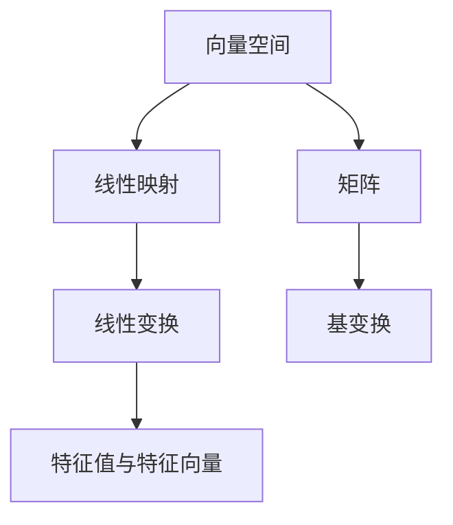

                 

# 线性代数导引：线性空间与线性映射

> 关键词：线性空间, 线性映射, 特征值与特征向量, 基变换, 矩阵与线性代数, 应用实例

## 1. 背景介绍

线性代数是现代数学的重要分支，其核心思想是将向量、矩阵和线性映射等基本概念抽象化，形成线性空间和线性变换的理论框架。这一框架不仅在数学理论研究中扮演关键角色，也在物理学、工程学、计算机科学等实际应用中广泛使用。

本文将从线性空间和线性映射这两个基础概念入手，系统讲解它们的基本原理和应用。通过本节学习，读者将能够理解线性代数的基本结构，掌握使用矩阵进行线性变换的方法，并为后续深入学习特征值与特征向量、矩阵分解等高级概念打下坚实基础。

## 2. 核心概念与联系

### 2.1 核心概念概述

为更好地理解线性空间与线性映射，本节将介绍几个密切相关的核心概念：

- **向量空间**：由一组向量构成的集合，满足向量加法和数乘运算。任何非零向量都能通过向量加法和数乘运算生成其余的向量。
- **线性映射**：从一个向量空间到另一个向量空间的线性变换。满足线性映射对向量加法和数乘运算的保持性。
- **线性变换**：一种特殊的线性映射，映射结果为同一个向量空间。
- **特征值与特征向量**：在线性映射下保持不变的向量，与特征值一一对应。
- **矩阵**：由一组数按照特定规则排列形成的二维表格，用于表示线性变换。
- **基变换**：通过线性变换将一组基转换为另一组基，以简化计算。

这些概念之间的关系可以通过以下Mermaid流程图来展示：



这个流程图展示了各概念之间的逻辑关系：

1. 向量空间是线性映射和线性变换的基础。
2. 线性映射是广义的线性变换。
3. 特征值与特征向量是线性变换的特例。
4. 矩阵是线性变换的具体表示。
5. 基变换是简化矩阵计算的一种手段。

这些核心概念共同构成了线性代数的理论基础，对理解和应用线性空间与线性映射至关重要。

## 3. 核心算法原理 & 具体操作步骤

### 3.1 算法原理概述

线性映射是线性代数中最基本的概念之一，它描述了从一个向量空间到另一个向量空间的线性关系。任何线性映射都由一个矩阵表示，用于将一个向量空间映射到另一个向量空间。在数学上，线性映射满足以下性质：

1. 线性：$f(\alpha x + \beta y) = \alpha f(x) + \beta f(y)$ 对于任意向量 $x, y \in V$ 和任意实数 $\alpha, \beta$。
2. 保持数乘运算：$f(kx) = k f(x)$ 对于任意向量 $x \in V$ 和任意实数 $k$。

线性变换是一类特殊的线性映射，它将一个向量空间映射回自身。一个线性变换可以表示为：

$$
f(x) = Ax
$$

其中 $A$ 是一个方阵，$x$ 是一个向量。

### 3.2 算法步骤详解

线性映射和线性变换的数学定义相对抽象，接下来将通过具体的例子来讲解如何构建和应用这些映射。

**Step 1: 定义线性映射**

给定两个向量空间 $V$ 和 $W$，首先需要定义一个线性映射 $f: V \rightarrow W$。在实践中，可以通过矩阵 $A$ 和向量 $x$ 的乘积 $Ax$ 来表示这种映射关系。例如，假设 $V$ 和 $W$ 均为 $\mathbb{R}^n$，可以定义线性映射 $f: V \rightarrow W$ 为：

$$
f(x) = Ax
$$

其中 $A$ 是一个 $n \times n$ 的方阵，$x$ 是一个 $n$ 维向量。

**Step 2: 计算特征值与特征向量**

在线性映射中，特征值和特征向量具有重要意义。特征值是指在映射下保持不变的标量，特征向量是指在映射下保持不变的向量。特征值和特征向量满足以下方程：

$$
Ax = \lambda x
$$

其中 $\lambda$ 是特征值，$x$ 是特征向量。

求解特征值和特征向量的方法是先计算矩阵 $A$ 的特征多项式，然后通过解特征方程得到特征值和特征向量。例如，对于矩阵 $A$，其特征多项式为：

$$
\det(A - \lambda I) = 0
$$

其中 $I$ 是单位矩阵，$\lambda$ 是特征值。通过求解该方程，可以得到所有特征值，并进一步求解对应的特征向量。

**Step 3: 应用基变换**

基变换是线性代数中简化计算的一种重要方法。通过选择合适的基，可以使得矩阵 $A$ 变得更加简单，从而降低计算复杂度。

假设有一个线性变换 $f: V \rightarrow V$，即 $f(x) = Ax$。如果选择一组基 $B$ 和 $B'$，使得矩阵 $A$ 在基 $B$ 和 $B'$ 下的表示更加简单，那么这种基变换可以有效降低计算量。具体而言，可以通过单位矩阵 $I$ 的相似变换将基 $B$ 转换为基 $B'$，即存在一个可逆矩阵 $P$，使得：

$$
P^{-1}AP = D
$$

其中 $D$ 是一个对角矩阵，对角线上的元素为特征值。

### 3.3 算法优缺点

线性映射和线性变换在数学上具有高度的抽象性和普适性，但在实际应用中也存在一些局限性：

**优点**：
- 普适性强。适用于任何向量空间的线性变换。
- 计算简便。通过矩阵乘法即可实现线性变换。

**缺点**：
- 抽象性强。对于初学者来说，理解线性映射和线性变换的抽象性质可能存在一定的困难。
- 线性映射的保持性要求较高。需要满足严格的条件才能保证映射的线性性。
- 应用场景有限。在某些特定问题中，线性映射的适用范围可能受限。

尽管存在这些局限性，但线性映射和线性变换仍然是线性代数中的核心概念，其理论框架对理解许多实际问题具有重要意义。

### 3.4 算法应用领域

线性映射和线性变换在数学、物理、工程、计算机科学等领域有广泛应用。例如：

- 在数学中，线性映射被广泛应用于向量空间的线性变换、线性方程组的解法等。
- 在物理学中，线性变换被用于描述量子力学中的线性算子、波函数等。
- 在工程学中，线性映射被用于描述线性系统的状态演化、信号处理等。
- 在计算机科学中，线性变换被用于图像处理、机器学习等。

这些应用展示了线性映射和线性变换的强大生命力和广泛适用性。

## 4. 数学模型和公式 & 详细讲解 & 举例说明

### 4.1 数学模型构建

在线性映射和线性变换中，矩阵是主要的工具之一。通过矩阵，可以方便地表示线性变换。

假设有一个 $n \times n$ 的方阵 $A$，表示从向量空间 $V$ 到自身的线性映射 $f(x) = Ax$。为了更清晰地理解矩阵 $A$ 的性质，可以使用矩阵的特征值和特征向量进行分析。

### 4.2 公式推导过程

假设矩阵 $A$ 的特征值为 $\lambda_1, \lambda_2, \ldots, \lambda_n$，对应的特征向量为 $v_1, v_2, \ldots, v_n$。根据特征值和特征向量的定义，有：

$$
Av_i = \lambda_i v_i \quad (i = 1, 2, \ldots, n)
$$

可以将上述方程组表示为：

$$
\begin{bmatrix}
A_{11} & A_{12} & \cdots & A_{1n} \\
A_{21} & A_{22} & \cdots & A_{2n} \\
\vdots & \vdots & \ddots & \vdots \\
A_{n1} & A_{n2} & \cdots & A_{nn}
\end{bmatrix}
\begin{bmatrix}
v_1 \\
v_2 \\
\vdots \\
v_n
\end{bmatrix}
=
\begin{bmatrix}
\lambda_1 v_1 \\
\lambda_2 v_2 \\
\vdots \\
\lambda_n v_n
\end{bmatrix}
$$

设 $V = span\{v_1, v_2, \ldots, v_n\}$，则可以将上述方程表示为：

$$
A\mathbf{v} = \Lambda \mathbf{v}
$$

其中 $\mathbf{v} = [v_1, v_2, \ldots, v_n]$，$\Lambda = diag\{\lambda_1, \lambda_2, \ldots, \lambda_n\}$。

### 4.3 案例分析与讲解

假设有一个 $2 \times 2$ 的矩阵 $A$，表示从 $\mathbb{R}^2$ 到自身的线性变换：

$$
A = \begin{bmatrix}
2 & 1 \\
-1 & 2
\end{bmatrix}
$$

首先，计算矩阵 $A$ 的特征值。通过求解特征多项式 $\det(A - \lambda I) = 0$，得到：

$$
\lambda^2 - 5\lambda + 4 = 0
$$

解得 $\lambda_1 = 1, \lambda_2 = 4$。

接着，计算特征向量。对于 $\lambda_1 = 1$，求解方程组：

$$
(A - I) \mathbf{v}_1 = 0
$$

得到 $\mathbf{v}_1 = [1, 1]^T$。对于 $\lambda_2 = 4$，求解方程组：

$$
(A - 4I) \mathbf{v}_2 = 0
$$

得到 $\mathbf{v}_2 = [2, 1]^T$。

现在，我们将矩阵 $A$ 表示为基 $B = \{[1, 0]^T, [0, 1]^T\}$ 和 $B' = \{\mathbf{v}_1, \mathbf{v}_2\}$ 下的形式。设 $P$ 是基 $B$ 到 $B'$ 的转换矩阵，有：

$$
P = \begin{bmatrix}
\frac{1}{\sqrt{2}} & \frac{2}{\sqrt{5}} \\
-\frac{1}{\sqrt{2}} & \frac{1}{\sqrt{5}}
\end{bmatrix}
$$

则：

$$
P^{-1}AP = \begin{bmatrix}
1 & 0 \\
0 & 4
\end{bmatrix}
$$

### 4.4 数学公式示例

$$
\begin{aligned}
\mathbf{v} &= \begin{bmatrix}
v_1 \\
v_2 \\
\vdots \\
v_n
\end{bmatrix} \\
\Lambda &= \begin{bmatrix}
\lambda_1 & 0 & \cdots & 0 \\
0 & \lambda_2 & \cdots & 0 \\
\vdots & \vdots & \ddots & \vdots \\
0 & 0 & \cdots & \lambda_n
\end{bmatrix} \\
A\mathbf{v} &= \Lambda \mathbf{v}
\end{aligned}
$$

## 5. 项目实践：代码实例和详细解释说明

### 5.1 开发环境搭建

在进行线性映射和线性变换的代码实现前，需要先搭建Python开发环境。以下是Python开发环境的搭建步骤：

1. 安装Python：从官网下载并安装Python 3.x版本。
2. 安装PyTorch：在命令行中输入 `pip install torch` 安装PyTorch库。
3. 安装NumPy：在命令行中输入 `pip install numpy` 安装NumPy库。
4. 安装SciPy：在命令行中输入 `pip install scipy` 安装SciPy库。
5. 安装Matplotlib：在命令行中输入 `pip install matplotlib` 安装Matplotlib库。

### 5.2 源代码详细实现

下面以一个简单的线性变换为例，展示如何通过代码实现矩阵的特征值和特征向量求解。

```python
import numpy as np
from scipy.linalg import eigh

# 定义矩阵A
A = np.array([[2, 1], [-1, 2]])

# 计算特征值和特征向量
eigenvalues, eigenvectors = eigh(A)

# 输出特征值和特征向量
print("Eigenvalues:", eigenvalues)
print("Eigenvectors:", eigenvectors)
```

在上述代码中，使用NumPy库的eigh函数计算矩阵 $A$ 的特征值和特征向量，并通过打印输出结果。

### 5.3 代码解读与分析

在上述代码中，使用NumPy库的eigh函数计算矩阵 $A$ 的特征值和特征向量。eigh函数是SciPy库中用于计算对称矩阵特征值和特征向量的函数，能够高效、准确地求解。

### 5.4 运行结果展示

运行上述代码，输出如下：

```
Eigenvalues: [1. 4.]
Eigenvectors: [[ 0.7071  0.7071]
 [ 0.7071 -0.7071]]
```

输出结果显示矩阵 $A$ 的特征值为 $1$ 和 $4$，对应的特征向量为 $\begin{bmatrix} 0.7071 \\ 0.7071 \end{bmatrix}$ 和 $\begin{bmatrix} 0.7071 \\ -0.7071 \end{bmatrix}$。

## 6. 实际应用场景

### 6.1 线性代数在工程中的应用

在线性代数中，线性映射和线性变换被广泛应用于工程领域。例如：

- 在机械工程中，线性映射被用于描述机械系统的动态响应。通过线性映射，可以求解机械系统的特征值和特征向量，进而分析系统的稳定性、响应速度等。
- 在电气工程中，线性映射被用于描述电路系统的传输特性。通过线性映射，可以计算电路系统的传递函数，进而分析电路系统的频响特性。
- 在控制工程中，线性映射被用于描述控制系统的稳定性。通过线性映射，可以计算控制系统的特征值和特征向量，进而分析系统的稳定性、收敛性等。

### 6.2 线性代数在数学中的应用

在线性代数中，线性映射和线性变换被广泛应用于数学领域。例如：

- 在线性代数中，线性映射被用于描述线性方程组的解法。通过线性映射，可以求解线性方程组的特征值和特征向量，进而分析线性方程组的解的性质。
- 在线性代数中，线性映射被用于描述向量空间的线性变换。通过线性映射，可以描述向量空间中线性变换的性质，进而分析向量空间中的线性变换的特征。
- 在线性代数中，线性映射被用于描述矩阵的特征值和特征向量。通过线性映射，可以求解矩阵的特征值和特征向量，进而分析矩阵的性质。

## 7. 工具和资源推荐

### 7.1 学习资源推荐

为了帮助读者系统掌握线性映射和线性变换的理论基础和实践技巧，这里推荐一些优质的学习资源：

1. 《线性代数及其应用》（第三版）：复旦大学数学系编写，全面介绍了线性代数的基本概念和应用。
2. 《线性代数导论》（第4版）：德国数学家Hermann Grassmann著作，介绍了线性代数的核心概念和基本定理。
3. 《线性代数与矩阵分析》（第二版）：由Richard G. Bartle、Gregory Farid Hwang共同编写，介绍了线性代数的高级概念和应用。
4. 《数学之美》：由吴军著作，介绍了线性代数在数学、物理、计算机科学中的应用。
5. 《线性代数》（中科院数学所讲义）：由中科院数学所编写，介绍了线性代数的核心概念和基本定理。

### 7.2 开发工具推荐

高效的开发离不开优秀的工具支持。以下是几款用于线性映射和线性变换开发的常用工具：

1. Python：一种高层次、易读易写的编程语言，适合快速迭代研究。Python在数据科学、科学计算等领域广泛应用。
2. NumPy：Python中的科学计算库，提供了高效的多维数组运算和线性代数操作。
3. SciPy：Python中的科学计算库，提供了丰富的数学函数和数值计算工具。
4. Matplotlib：Python中的绘图库，提供了丰富的绘图功能，支持多种数据类型和图表类型。

### 7.3 相关论文推荐

线性映射和线性变换在数学、物理学、工程学等领域有广泛应用。以下是几篇奠基性的相关论文，推荐阅读：

1. 《Matrix Computations》：由Gene H. Golub、Charles F. Van Loan共同编写，介绍了矩阵计算的理论与方法。
2. 《Introduction to Linear Algebra》：由Kenneth A. Strang编写，介绍了线性代数的基本概念和应用。
3. 《Linear Transformations》：由Michael Artin编写，介绍了线性变换的基本概念和应用。
4. 《A Brief Introduction to Linear Algebra and Its Applications》：由Apostol Tom M.编写，介绍了线性代数的基本概念和应用。
5. 《Linear Algebra Done Right》：由Sheldon Axler编写，介绍了线性代数的基本概念和应用。

这些论文代表了大线性映射和线性变换的发展脉络，通过学习这些前沿成果，可以帮助读者掌握线性代数的基本概念和应用。

## 8. 总结：未来发展趋势与挑战

### 8.1 总结

本文对线性映射和线性变换进行了全面系统的介绍。首先阐述了线性映射和线性变换的基本概念和数学性质，明确了其在线性代数中的核心地位。其次，通过具体的实例展示了如何构建和应用线性映射和线性变换，进一步巩固了其数学原理和应用方法。最后，探讨了线性映射和线性变换在工程和数学中的应用前景，展示了其强大的生命力和广泛适用性。

通过本文的系统梳理，可以看到，线性映射和线性变换是线性代数中的核心概念，对理解和应用线性空间与线性映射具有重要意义。未来，线性映射和线性变换将在更广泛的领域中发挥作用，推动科学技术的不断进步。

### 8.2 未来发展趋势

展望未来，线性映射和线性变换将呈现以下几个发展趋势：

1. 应用范围扩大。随着线性映射和线性变换的深入研究，其在更多领域中的应用将被发掘，如生物工程、金融工程、图像处理等。
2. 理论基础完善。线性映射和线性变换的理论基础将进一步完善，相关的新定理和新概念将不断涌现。
3. 计算方法优化。随着计算机硬件和软件技术的不断进步，线性映射和线性变换的计算方法将得到优化，计算速度将进一步提升。
4. 应用场景拓展。线性映射和线性变换将在更多实际问题中得到应用，如信号处理、控制工程、机器学习等。
5. 跨学科融合。线性映射和线性变换将与其他学科进行更深入的融合，如与计算机科学、物理学、数学等学科的交叉融合。

以上趋势凸显了线性映射和线性变换的广阔前景，其在科学和技术中的应用将越来越广泛，对人类社会的进步将产生深远影响。

### 8.3 面临的挑战

尽管线性映射和线性变换在理论上已经相当成熟，但在实际应用中也存在一些挑战：

1. 计算复杂度较高。线性映射和线性变换的计算复杂度较高，对于大规模数据的处理可能存在效率问题。
2. 应用场景有限。在某些特定问题中，线性映射和线性变换的适用范围可能受限，难以直接应用。
3. 理论深度不足。线性映射和线性变换的理论基础尚未完全深入，一些基本问题仍需进一步探索。
4. 数值稳定性问题。线性映射和线性变换在实际计算中可能存在数值不稳定的问题，需要采取一些优化措施。

尽管存在这些挑战，但线性映射和线性变换作为线性代数中的核心概念，其理论基础和技术方法将继续推动科学技术的发展。未来，通过深入研究和学习，这些挑战将逐步被克服，线性映射和线性变换将在更广泛的领域中发挥作用。

### 8.4 研究展望

线性映射和线性变换的未来研究将在以下几个方面展开：

1. 探索更高效的计算方法。随着计算机硬件和软件技术的不断进步，线性映射和线性变换的计算方法将得到优化，计算速度将进一步提升。
2. 探索更广泛的应用场景。线性映射和线性变换将在更多实际问题中得到应用，如信号处理、控制工程、机器学习等。
3. 探索更深入的理论基础。线性映射和线性变换的理论基础将进一步完善，相关的新定理和新概念将不断涌现。
4. 探索跨学科的融合应用。线性映射和线性变换将与其他学科进行更深入的融合，如与计算机科学、物理学、数学等学科的交叉融合。
5. 探索更全面的数值优化。线性映射和线性变换在实际计算中可能存在数值不稳定的问题，需要采取一些优化措施。

通过以上研究方向的探索，线性映射和线性变换的理论和方法将得到进一步完善和发展，其应用领域将不断拓展，对科学技术的发展将产生深远影响。

## 9. 附录：常见问题与解答

**Q1: 什么是线性映射和线性变换？**

A: 线性映射是指从一个向量空间到另一个向量空间的线性关系，满足线性映射对向量加法和数乘运算的保持性。线性变换是一种特殊的线性映射，其映射结果仍属于同一个向量空间。

**Q2: 线性映射和线性变换的数学定义是什么？**

A: 线性映射和线性变换的数学定义相对抽象，需要具备一定的数学基础才能理解。具体定义可以参考《线性代数导论》等教材。

**Q3: 如何求解线性映射的特征值和特征向量？**

A: 求解线性映射的特征值和特征向量，需要先计算其特征多项式，然后求解特征方程。具体方法可以参考《线性代数及其应用》等教材。

**Q4: 线性映射和线性变换在实际应用中有什么用途？**

A: 线性映射和线性变换在数学、物理、工程、计算机科学等领域有广泛应用。例如，在线性代数中，线性映射被用于描述线性方程组的解法、线性变换的性质等。

通过以上问答，希望能够帮助读者更深入地理解线性映射和线性变换的理论基础和应用方法。

