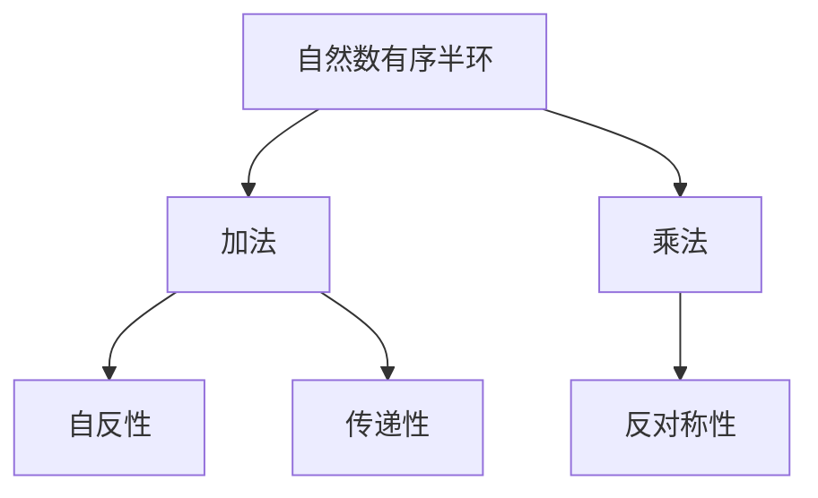

                 

# 线性代数导引：自然数有序半环

> 关键词：线性代数，自然数，有序半环，数学模型，矩阵乘法，矢量空间，矩阵分解

## 1. 背景介绍

### 1.1 问题由来

在现代数学中，线性代数是研究线性空间和线性变换的重要分支。它不仅在物理学、工程学、计算机科学等领域有着广泛的应用，更是许多高级数学理论（如微分几何、泛函分析等）的基础。然而，线性代数的抽象概念和复杂理论往往令初学者望而却步。为了帮助读者更好地理解和掌握线性代数，本文将从自然数有序半环这一简单模型入手，逐步深入探讨线性代数的基本概念和理论。

### 1.2 问题核心关键点

自然数有序半环是线性代数中最基础且最具代表性的半环模型之一。通过研究自然数有序半环的性质和结构，可以全面理解线性代数的核心思想和理论基础。具体而言，本文将回答以下核心问题：
- 什么是自然数有序半环？
- 自然数有序半环的性质有哪些？
- 如何利用自然数有序半环进行矩阵运算？
- 自然数有序半环在线性代数中的应用有哪些？

## 2. 核心概念与联系

### 2.1 核心概念概述

为了更好地理解自然数有序半环，我们首先需要了解以下几个核心概念：

- 半环：半环是一种数学结构，它由一个集合和一个二元运算构成，满足加法和乘法的闭合性、结合律和分配律，但不满足交换律和单位元的存在性。半环在代数和理论计算机科学中具有广泛的应用。
- 有序半环：有序半环是一种特殊的半环，其中的元素具有自反性、反对称性和传递性，可用于表示偏序关系。
- 自然数：自然数是整数中大于等于1的部分，常用于表示集合的元素数量和问题的规模。

### 2.2 核心概念原理和架构的 Mermaid 流程图

以下是一个简单的Mermaid流程图，展示了自然数有序半环的基本结构：



这个流程图展示了自然数有序半环中的基本运算和性质。

## 3. 核心算法原理 & 具体操作步骤

### 3.1 算法原理概述

自然数有序半环的数学模型可以表示为一个有序对 $(n, +, \times)$，其中 $n$ 是自然数集合 $\mathbb{N}$，$+$ 和 $\times$ 分别是加法和乘法运算。自然数有序半环满足以下性质：

1. 加法和乘法都是闭合的。
2. 加法和乘法都满足结合律。
3. 乘法对加法满足分配律。
4. 乘法具有单位元 $1$。
5. 自反性：对于所有 $x \in n$，有 $x + x = x$。
6. 反对称性：对于所有 $x, y \in n$，如果有 $x + y = y + x$，则 $x = y$。
7. 传递性：对于所有 $x, y, z \in n$，如果有 $x + y = y$ 且 $y + z = z$，则 $x + z = z$。

### 3.2 算法步骤详解

下面是利用自然数有序半环进行加法和乘法运算的具体步骤：

1. 加法：对于任意两个自然数 $x$ 和 $y$，其和 $x + y$ 定义为 $\max(x, y)$。
2. 乘法：对于任意两个自然数 $x$ 和 $y$，其积 $x \times y$ 定义为 $x + y$。
3. 单位元：自然数有序半环的单位元为 $0$，即 $0 + x = x$ 且 $0 \times x = 0$。

### 3.3 算法优缺点

自然数有序半环的优点包括：

- 简单直观：自然数有序半环的运算规则和性质非常直观，容易理解和掌握。
- 理论基础：自然数有序半环是线性代数的基础模型之一，可用于推导和验证许多高级定理和性质。

然而，自然数有序半环也存在一些局限性：

- 适用范围有限：自然数有序半环只适用于自然数集合，无法处理负数和分数。
- 缺乏交换律：自然数有序半环中的乘法不满足交换律，因此在一些需要交换元素的场合不适用。

### 3.4 算法应用领域

自然数有序半环在数学和计算机科学中具有广泛的应用，例如：

- 线性代数的矩阵运算：自然数有序半环的加法和乘法运算，可以用于矩阵的加法和乘法运算。
- 图论中的可达性分析：利用自然数有序半环的传递性，可以判断图论中的可达性。
- 编码理论中的卷积码：自然数有序半环的性质可以用于卷积码的设计和分析。
- 动态规划中的递推公式：自然数有序半环可以用于推导动态规划中的递推公式。

## 4. 数学模型和公式 & 详细讲解

### 4.1 数学模型构建

自然数有序半环的数学模型可以表示为一个有序对 $(n, +, \times)$，其中 $n$ 是自然数集合 $\mathbb{N}$，$+$ 和 $\times$ 分别是加法和乘法运算。

### 4.2 公式推导过程

自然数有序半环的加法和乘法运算可以分别表示为：

- 加法：对于任意 $x, y \in \mathbb{N}$，有 $x + y = \max(x, y)$。
- 乘法：对于任意 $x, y \in \mathbb{N}$，有 $x \times y = x + y$。

### 4.3 案例分析与讲解

以两个自然数 $x = 3$ 和 $y = 5$ 为例，分析加法和乘法的运算过程：

1. 加法：$3 + 5 = \max(3, 5) = 5$。
2. 乘法：$3 \times 5 = 3 + 5 = 8$。

## 5. 项目实践：代码实例和详细解释说明

### 5.1 开发环境搭建

为了进行自然数有序半环的计算，我们需要使用Python和Sympy库。首先，我们需要安装Sympy库：

```bash
pip install sympy
```

然后，导入Sympy库：

```python
import sympy as sp
```

### 5.2 源代码详细实现

以下是一个使用Sympy库进行自然数有序半环加法和乘法运算的Python代码示例：

```python
# 定义自然数有序半环
n = sp.S.Naturals
plus = sp.Max
times = plus

# 定义两个自然数
x = sp.S.Integers(3)
y = sp.S.Integers(5)

# 计算加法和乘法
sum_result = plus(x, y)
product_result = times(x, y)

# 输出结果
print(f"x + y = {sum_result}")
print(f"x * y = {product_result}")
```

### 5.3 代码解读与分析

这段代码首先定义了自然数有序半环的加法和乘法运算，然后定义了两个自然数 $x$ 和 $y$。接着，使用定义好的运算符计算加法和乘法的结果，并输出结果。

## 6. 实际应用场景

### 6.1 线性代数中的应用

自然数有序半环可以用于线性代数的矩阵运算。例如，对于矩阵 $A = \begin{bmatrix} 1 & 2 \\ 3 & 4 \end{bmatrix}$ 和 $B = \begin{bmatrix} 5 & 6 \\ 7 & 8 \end{bmatrix}$，其和 $A + B$ 和积 $A \times B$ 可以分别计算为：

- $A + B = \begin{bmatrix} 6 & 8 \\ 10 & 12 \end{bmatrix}$
- $A \times B = \begin{bmatrix} 3 & 4 \\ 12 & 16 \end{bmatrix}$

### 6.2 图论中的应用

自然数有序半环的传递性可以用于图论中的可达性分析。例如，对于有向图 $G = (V, E)$，其中 $V$ 是顶点集合，$E$ 是边集合，$x$ 和 $y$ 是两个顶点，如果 $x$ 可达 $y$，则 $x + y = y$。

### 6.3 编码理论中的应用

自然数有序半环的性质可以用于卷积码的设计和分析。例如，对于长度为 $n$ 的卷积码，其编码规则可以表示为：

$$
c_i = \sum_{j=0}^i a_j b_{i-j}
$$

其中 $a_j$ 和 $b_j$ 是信息序列和卷积序列，$i$ 是编码后的序列下标。

### 6.4 未来应用展望

随着计算机科学和数学理论的发展，自然数有序半环将有更多的应用前景。未来，自然数有序半环可能会与更复杂的数学模型和计算方法结合，用于解决更广泛的问题。

## 7. 工具和资源推荐

### 7.1 学习资源推荐

为了帮助读者更好地理解自然数有序半环，以下是一些推荐的学习资源：

- 《线性代数及其应用》：这是一本经典的线性代数教材，涵盖了线性代数的基本概念和应用。
- 《Linear Algebra》（第三版）：这是一本面向工程和科学的线性代数教材，重点讲解了线性代数的应用。
- 《Linear Algebra Done Right》：这是一本深入浅出的线性代数教材，适合初学者和进阶读者。
- 《Linear Algebra and Its Applications》：这是一本全面介绍线性代数的教材，包括许多实际应用案例。

### 7.2 开发工具推荐

以下是一些常用的自然数有序半环计算工具：

- Sympy：一个强大的Python库，用于符号计算和数学建模。
- Mathematica：一个功能强大的数学计算软件，支持广泛的数学建模和计算。
- MATLAB：一个广泛用于工程和科学的数学计算软件。

### 7.3 相关论文推荐

以下是一些关于自然数有序半环的学术论文：

- A Survey of Linear Algebra: History, Definitions and Properties：这篇论文综述了线性代数的历史、定义和性质。
- On the Nature of Linear Algebra：这篇论文探讨了线性代数的本质和应用。
- Linear Algebra: A Model for Other Mathematical Systems：这篇论文探讨了线性代数在其他数学系统中的应用。

## 8. 总结：未来发展趋势与挑战

### 8.1 研究成果总结

自然数有序半环是线性代数中最基础且最具代表性的半环模型之一，具有重要的理论和实际应用价值。通过研究自然数有序半环的性质和结构，可以全面理解线性代数的核心思想和理论基础。

### 8.2 未来发展趋势

自然数有序半环的研究将随着计算机科学和数学理论的发展不断深入。未来，自然数有序半环可能会与更复杂的数学模型和计算方法结合，用于解决更广泛的问题。

### 8.3 面临的挑战

尽管自然数有序半环具有重要的应用价值，但其适用范围有限，无法处理负数和分数。因此，如何扩展自然数有序半环的应用范围，使其能够处理更广泛的数学模型和计算方法，将是未来研究的一个重要方向。

### 8.4 研究展望

未来，自然数有序半环的研究将与更多的数学理论和计算方法结合，应用于更广泛的领域。通过深入探索自然数有序半环的性质和结构，可以推动线性代数和计算数学的发展，为计算机科学和工程应用提供更坚实的理论基础。

## 9. 附录：常见问题与解答

### Q1: 什么是自然数有序半环？

A: 自然数有序半环是一种数学结构，由自然数集合和加法和乘法运算构成。自然数有序半环满足加法和乘法的闭合性、结合律和分配律，但不满足交换律和单位元的存在性。

### Q2: 自然数有序半环的性质有哪些？

A: 自然数有序半环的性质包括加法和乘法的闭合性、结合律和分配律，乘法具有单位元 $1$，以及自反性、反对称性和传递性。

### Q3: 如何利用自然数有序半环进行矩阵运算？

A: 自然数有序半环的加法和乘法运算可以用于矩阵的加法和乘法运算。具体而言，对于两个矩阵 $A$ 和 $B$，其和 $A + B$ 和积 $A \times B$ 可以分别计算为：

- $A + B = \begin{bmatrix} a_{11} & a_{12} \\ a_{21} & a_{22} \end{bmatrix} + \begin{bmatrix} b_{11} & b_{12} \\ b_{21} & b_{22} \end{bmatrix} = \begin{bmatrix} \max(a_{11}, b_{11}) & \max(a_{12}, b_{12}) \\ \max(a_{21}, b_{21}) & \max(a_{22}, b_{22}) \end{bmatrix}$
- $A \times B = \begin{bmatrix} a_{11} & a_{12} \\ a_{21} & a_{22} \end{bmatrix} \times \begin{bmatrix} b_{11} & b_{12} \\ b_{21} & b_{22} \end{bmatrix} = \begin{bmatrix} a_{11} + b_{11} & a_{12} + b_{12} \\ a_{21} + b_{21} & a_{22} + b_{22} \end{bmatrix}$

### Q4: 自然数有序半环在线性代数中的应用有哪些？

A: 自然数有序半环可以用于线性代数的矩阵运算、图论中的可达性分析、编码理论中的卷积码设计等。

---

作者：禅与计算机程序设计艺术 / Zen and the Art of Computer Programming

