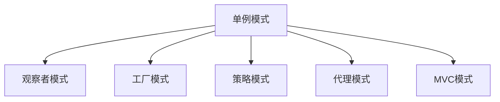

                 

## 1. 背景介绍

### 1.1 问题由来

在软件工程中，设计模式(Design Pattern)是一种解决常见问题的方法，它们是一套被广泛接受的最佳实践，可用于设计可扩展、可维护的软件系统。然而，随着技术的发展，我们常常发现经典的设计模式已无法应对当前复杂的系统需求。在这种情况下，我们需要反思和重新设计，以实现更加灵活、高效和可维护的软件系统。

### 1.2 问题核心关键点

本文聚焦于如何结合反思、工具使用和规划，综合运用设计模式来构建高质量的软件系统。具体而言，我们将讨论以下几个核心问题：

- 如何对经典设计模式进行反思和重构，以适应当前技术环境。
- 如何有效利用现有的开发工具来支持设计模式的实施。
- 如何进行整体系统规划，以确保设计模式能够在系统中协同工作。

通过回答这些问题，我们将提供一个全面且系统的方法论，以指导软件开发团队构建可靠、高效的软件系统。

## 2. 核心概念与联系

### 2.1 核心概念概述

为了更好地理解本文的主题，本节将介绍几个密切相关的核心概念：

- 设计模式(Design Patterns)：一系列被广泛接受的最佳实践，用于解决特定问题的通用设计方案。
- 单例模式(Singleton Pattern)：确保一个类只有一个实例，并提供全局访问点。
- 观察者模式(Observer Pattern)：多个对象订阅某个主题，当主题状态变化时，所有订阅者都会接收到通知。
- 工厂模式(Factory Pattern)：通过抽象接口和子类，根据不同的参数生成不同对象。
- 策略模式(Strategy Pattern)：通过策略接口和具体策略类，允许算法或行为灵活变化。
- 代理模式(Proxy Pattern)：为其他对象提供一种代理以控制对本对象的访问。
- MVC模式(Model-View-Controller)：将系统分为模型、视图和控制器三个部分，以分离内层表示和用户接口。

这些概念之间的逻辑关系可以通过以下Mermaid流程图来展示：



这个流程图展示了几类常见设计模式之间的联系：

- 单例模式和代理模式用于对象的生命周期管理。
- 观察者模式和MVC模式用于系统交互和事件响应。
- 工厂模式和策略模式用于对象的创建和行为的封装。

这些概念共同构成了软件设计的基础框架，使开发者能够设计出既可扩展又易于维护的软件系统。

## 3. 核心算法原理 & 具体操作步骤

### 3.1 算法原理概述

综合设计模式方法论的核心是结合反思、工具使用和规划，系统地应用设计模式来构建高质量的软件系统。其基本原理可以概括为：

1. **反思**：通过审视现有系统的设计和架构，识别出存在的缺陷和潜在问题，并提出改进建议。
2. **工具使用**：利用现有的开发工具和框架，支持设计模式的实施。
3. **规划**：进行整体系统规划，确保设计模式能够在系统中协同工作。

这些步骤相辅相成，共同构成了一个系统且有效的设计过程。

### 3.2 算法步骤详解

基于上述基本原理，综合设计模式方法论的具体步骤包括以下几个环节：

**Step 1: 系统分析与反思**

1. **需求分析**：了解项目需求和目标，确定系统的功能、性能和非功能性要求。
2. **现有系统评估**：分析现有系统的架构和设计，识别出潜在的缺陷和改进点。
3. **需求重构**：根据系统分析结果，重新定义系统的功能和结构。

**Step 2: 设计模式选择与定制**

1. **模式识别**：根据系统需求和重构后的设计，选择适合的设计模式。
2. **模式定制**：根据实际情况，对所选模式进行定制和修改。

**Step 3: 工具支持与实现**

1. **工具选择**：选择适合设计模式实施的开发工具和框架。
2. **工具配置**：配置工具，以满足设计模式的要求。
3. **实现细节**：编写代码实现设计模式，确保其正确性和可维护性。

**Step 4: 系统集成与优化**

1. **集成测试**：对系统进行集成测试，确保各设计模式协同工作。
2. **性能优化**：优化系统性能，确保其在实际使用中的高效性和稳定性。
3. **维护与迭代**：持续维护系统，根据反馈进行迭代改进。

### 3.3 算法优缺点

综合设计模式方法论具有以下优点：

1. **系统性**：通过系统地应用设计模式，能够保证系统整体的一致性和可维护性。
2. **灵活性**：设计模式提供了一套通用的解决方案，可以根据实际需求灵活调整。
3. **可复用性**：设计模式可以在多个项目中复用，提高开发效率和代码质量。

同时，该方法也存在一些局限性：

1. **学习成本高**：设计模式种类繁多，掌握和应用它们需要时间和精力。
2. **过度复杂化**：过度应用设计模式可能导致系统复杂化，增加开发和维护难度。
3. **缺乏创新**：过分依赖设计模式可能限制创新，限制了新技术的应用。

尽管存在这些局限性，但综合设计模式方法论仍是大规模软件开发的重要指导思想，尤其适用于复杂和大型系统。

### 3.4 算法应用领域

综合设计模式方法论在多个领域中都有广泛应用，包括但不限于：

- 金融软件：用于处理高频率交易和大规模数据的系统，需要高效、可扩展的设计。
- 医疗系统：处理敏感数据和复杂逻辑，需要安全、可维护的设计。
- 游戏开发：需要灵活、动态的游戏逻辑和用户体验管理。
- 企业应用：需要稳定、可靠的系统架构，支持大规模部署和维护。

这些领域中的设计模式应用，展示了综合设计模式方法论的广泛适用性和强大能力。

## 4. 数学模型和公式 & 详细讲解 & 举例说明

### 4.1 数学模型构建

在本节中，我们将使用数学语言对综合设计模式方法论进行更加严格的刻画。

记系统为 $S$，由多个模块组成，每个模块 $M_i$ 实现特定的功能。设 $D_i$ 为 $M_i$ 的设计模式集合，$P_i$ 为 $M_i$ 的策略模式集合。系统 $S$ 的设计模式集合为 $D$，策略模式集合为 $P$。设计模式 $D_i$ 与策略模式 $P_i$ 的关系为：

$$
D_i \cap P_i = \emptyset, \quad D \cup P = D_1 \cup D_2 \cup \cdots \cup D_n
$$

系统 $S$ 的设计模式和策略模式相互独立，且各自形成完整的系统架构。

### 4.2 公式推导过程

对于系统 $S$，其设计模式 $D$ 和策略模式 $P$ 的实现可以表示为：

$$
S = M_1 + M_2 + \cdots + M_n
$$

其中 $M_i$ 表示模块 $i$ 的设计模式和策略模式的组合。设 $M_i = (D_i, P_i)$，则系统 $S$ 可以表示为：

$$
S = (D_1, P_1) + (D_2, P_2) + \cdots + (D_n, P_n)
$$

在实践中，设计模式和策略模式的具体实现可以采用不同的编程语言和框架，但它们的设计原则和目标是一致的。例如，在Java中，可以使用Spring Framework来实现模块 $M_i$ 的设计模式和策略模式，具体实现可以表示为：

```java
@Component
public class Module implements DesignPattern {
    private Strategy strategy;
    
    @Autowired
    public Module(Strategy strategy) {
        this.strategy = strategy;
    }
    
    // 设计模式实现
    public void design() {
        // 设计模式的实现
    }
    
    // 策略模式实现
    public void strategy() {
        strategy.execute();
    }
}
```

### 4.3 案例分析与讲解

以下是一个简化的案例，展示如何综合应用设计模式来构建一个简单的电商系统：

**需求分析**：
- 需要支持用户注册、登录、商品浏览、购物车管理和订单处理。
- 系统需要高并发、高可扩展性和高可用性。

**系统分析与反思**：
- 现有系统采用单体架构，存在扩展性和维护性差的问题。
- 用户接口和业务逻辑耦合度高，难以灵活调整。

**设计模式选择与定制**：
- 采用MVC模式，将系统分为模型、视图和控制器三个部分。
- 采用单例模式管理数据库连接池。
- 采用工厂模式创建商品和订单对象。
- 采用观察者模式实现用户登录状态的实时通知。

**工具支持与实现**：
- 使用Spring Boot作为开发框架，提供MVC和依赖注入功能。
- 使用Spring Data JPA实现单例模式和工厂模式。
- 使用Spring Events实现观察者模式。

**系统集成与优化**：
- 对系统进行集成测试，确保各设计模式协同工作。
- 优化系统性能，减少响应时间，提高并发处理能力。
- 进行持续集成和持续部署，保证系统持续优化。

## 5. 项目实践：代码实例和详细解释说明

### 5.1 开发环境搭建

在进行设计模式实践前，我们需要准备好开发环境。以下是使用Java和Spring Boot开发的环境配置流程：

1. 安装JDK：从官网下载并安装Java Development Kit。
2. 安装Maven：从官网下载并安装Maven构建工具。
3. 创建Spring Boot项目：
```bash
mvn archetype:generate -DarchetypeArtifactId=spring-boot-sample
```
4. 配置开发环境：
```bash
mvn spring-boot:run
```

### 5.2 源代码详细实现

这里我们以电商系统为例，展示如何综合应用设计模式来构建系统。

**模块设计**：
- 用户模块：负责用户注册、登录、个人信息管理等功能。
- 商品模块：负责商品管理、库存更新、订单处理等功能。
- 购物车模块：负责购物车管理、结算、订单生成等功能。

**设计模式实现**：

**用户模块**：
```java
@Component
public class User implements Singleton {
    private static final User instance = new User();
    
    private User() {}
    
    public static User getInstance() {
        return instance;
    }
    
    @Autowired
    private UserService userService;
    
    // 用户注册
    public void register(User user) {
        userService.save(user);
    }
    
    // 用户登录
    public void login(User user) {
        User result = userService.findByUsernameAndPassword(user.getUsername(), user.getPassword());
        if (result != null) {
            // 登录成功
        } else {
            // 登录失败
        }
    }
}
```

**商品模块**：
```java
@Component
public class Product implements Factory {
    private static final List<Product> products = new ArrayList<>();
    
    private Product() {}
    
    @Override
    public Product create(String name, String description, BigDecimal price) {
        Product product = new Product();
        product.setName(name);
        product.setDescription(description);
        product.setPrice(price);
        products.add(product);
        return product;
    }
    
    // 商品浏览
    public void browse(Product product) {
        // 展示商品信息
    }
    
    // 库存更新
    public void updateStock(Product product, int amount) {
        product.setStock(product.getStock() - amount);
    }
    
    // 订单处理
    public void order(Product product, int amount) {
        updateStock(product, amount);
        // 处理订单
    }
}
```

**购物车模块**：
```java
@Component
public class ShoppingCart implements Observer {
    private List<Product> cartItems;
    
    @Autowired
    private User user;
    
    @Autowired
    private Product product;
    
    public ShoppingCart() {
        cartItems = new ArrayList<>();
    }
    
    // 添加商品
    public void addItem(Product product, int amount) {
        cartItems.add(new ShoppingItem(product, amount));
    }
    
    // 结算
    public void checkout() {
        // 生成订单
        // 支付
    }
    
    @Override
    public void update(User user) {
        // 用户登录状态变化
    }
}
```

**系统集成与优化**：

```java
@SpringBootApplication
public class Application {
    public static void main(String[] args) {
        SpringApplication.run(Application.class, args);
    }
}
```

### 5.3 代码解读与分析

让我们再详细解读一下关键代码的实现细节：

**Singleton类**：
- 实现单例模式，确保User对象只有一个实例。
- 通过静态内部类的方式实现单例。

**Factory接口**：
- 实现工厂模式，用于创建商品对象。
- 定义create方法，根据输入参数创建商品对象。

**Observer接口**：
- 实现观察者模式，用于订阅用户登录状态的变更。
- 定义update方法，当用户登录状态变化时，触发该方法。

**ShoppingItem类**：
- 用于表示购物车中的商品项，包含商品ID和数量。
- 实现 equals 和 hashCode 方法，以支持购物车中的商品项去重。

通过上述代码，我们可以看到综合设计模式方法论在实际应用中的具体实现。

## 6. 实际应用场景

### 6.1 智能家居系统

智能家居系统是一种集成了多种传感器、控制器和网络设备的复杂系统。通过综合应用设计模式，可以构建一个高效、可扩展且易于维护的智能家居解决方案。

**需求分析**：
- 需要支持多种传感器数据采集和处理。
- 需要实现设备控制和联动。
- 需要支持远程访问和控制。

**系统分析与反思**：
- 现有系统采用单体架构，存在扩展性和维护性差的问题。
- 传感器和控制器之间的通信协议不一致，难以统一管理。

**设计模式选择与定制**：
- 采用MVC模式，将系统分为模型、视图和控制器三个部分。
- 采用观察者模式实现传感器数据的实时通知。
- 采用策略模式实现设备控制和联动。

**工具支持与实现**：
- 使用Spring Boot作为开发框架，提供MVC和依赖注入功能。
- 使用Spring Events实现观察者模式。
- 使用Spring Bean实现策略模式。

**系统集成与优化**：
- 对系统进行集成测试，确保各设计模式协同工作。
- 优化系统性能，提高传感器数据的实时性和设备控制的可靠性。
- 进行持续集成和持续部署，保证系统持续优化。

### 6.2 金融交易系统

金融交易系统需要处理大量的交易数据和复杂的业务逻辑，需要高效、可扩展且安全的设计。

**需求分析**：
- 需要处理高频率交易和大规模数据。
- 需要支持复杂的业务逻辑和计算。
- 需要保证系统的安全性和可靠性。

**系统分析与反思**：
- 现有系统采用单体架构，存在扩展性和维护性差的问题。
- 系统缺乏有效的分布式处理机制。

**设计模式选择与定制**：
- 采用工厂模式创建交易订单和账户对象。
- 采用代理模式管理数据库连接和缓存。
- 采用策略模式实现复杂的交易算法和计算逻辑。

**工具支持与实现**：
- 使用Spring Boot作为开发框架，提供MVC和依赖注入功能。
- 使用Spring Data JPA实现工厂模式和代理模式。
- 使用Spring Expression Language实现策略模式。

**系统集成与优化**：
- 对系统进行集成测试，确保各设计模式协同工作。
- 优化系统性能，提高交易处理速度和并发处理能力。
- 进行持续集成和持续部署，保证系统持续优化。

### 6.3 物流配送系统

物流配送系统需要处理复杂的配送路线规划、车辆调度和订单管理等任务，需要高效、可扩展且灵活的设计。

**需求分析**：
- 需要支持复杂的配送路线规划和优化。
- 需要支持多车调度和订单管理。
- 需要支持实时监控和调度优化。

**系统分析与反思**：
- 现有系统采用单体架构，存在扩展性和维护性差的问题。
- 配送路线规划和车辆调度算法复杂。

**设计模式选择与定制**：
- 采用策略模式实现配送路线规划算法。
- 采用工厂模式创建配送车辆和订单对象。
- 采用观察者模式实现配送状态和异常事件的实时通知。

**工具支持与实现**：
- 使用Spring Boot作为开发框架，提供MVC和依赖注入功能。
- 使用Spring Expression Language实现策略模式。
- 使用Spring Data JPA实现工厂模式和观察者模式。

**系统集成与优化**：
- 对系统进行集成测试，确保各设计模式协同工作。
- 优化系统性能，提高配送路线规划和车辆调度的效率。
- 进行持续集成和持续部署，保证系统持续优化。

### 6.4 未来应用展望

随着设计模式技术的不断演进，未来的应用场景将更加广泛和多样化。以下是一些未来应用展望：

- 自动驾驶系统：通过综合应用设计模式，构建高效、安全的自动驾驶解决方案。
- 智能客服系统：通过综合应用设计模式，构建高效、可扩展的智能客服解决方案。
- 医疗诊断系统：通过综合应用设计模式，构建高效、可维护的医疗诊断解决方案。
- 智慧城市系统：通过综合应用设计模式，构建高效、可扩展的智慧城市解决方案。

这些应用场景展示了设计模式方法的广泛适用性和强大能力，未来设计模式将在更多领域中得到应用，为社会带来深远的影响。

## 7. 工具和资源推荐

### 7.1 学习资源推荐

为了帮助开发者系统掌握设计模式的方法论，这里推荐一些优质的学习资源：

1. 《设计模式：原则、模式、实践》书籍：由Erich Gamma等作者编写，是设计模式领域的经典著作，详细介绍了23种经典设计模式。
2. 《Spring in Action》书籍：由Craig Walls等作者编写，介绍了如何使用Spring框架实现设计模式。
3. 《UML面向对象建模》课程：由Coursera平台提供，详细介绍了如何使用UML建模语言描述和设计系统。
4. 《Java设计模式》博客：由Design Patterns in Java博客提供，详细介绍了Java中的设计模式实现。
5. GitHub设计模式项目：GitHub上汇集了大量设计模式的应用实例，可以作为学习和参考的资源。

通过对这些资源的学习实践，相信你一定能够全面掌握设计模式的方法论，并用于解决实际的系统设计问题。

### 7.2 开发工具推荐

高效的开发离不开优秀的工具支持。以下是几款用于设计模式开发的常用工具：

1. Spring Boot：基于Spring框架的开源开发框架，提供MVC、依赖注入和事务管理等功能。
2. Spring Data JPA：基于Spring Data的JPA实现，提供简单易用的数据库操作API。
3. Spring Expression Language：基于SpEL的表达式语言，用于实现策略模式和观察者模式。
4. IntelliJ IDEA：一款功能强大的Java开发工具，支持代码自动补全、调试和测试等功能。
5. Git：一款版本控制系统，支持多人协作和代码管理，是软件开发过程中不可或缺的工具。

合理利用这些工具，可以显著提升设计模式开发的效率和质量，加速创新迭代的步伐。

### 7.3 相关论文推荐

设计模式技术的发展源于学界的持续研究。以下是几篇奠基性的相关论文，推荐阅读：

1. Design Patterns: Elements of Reusable Object-Oriented Software：由Erich Gamma等作者编写，介绍了23种经典设计模式及其应用场景。
2. Head First Design Patterns：由Eric Freeman等作者编写，通过图解方式介绍设计模式，适合初学者阅读。
3. Object-Oriented Design Patterns：由Addison-Wesley出版社出版的经典书籍，详细介绍了设计模式的原理和应用。
4. Patterns in Software：由Gerald Weinberg等作者编写，讨论了软件设计和模式的哲学思想和实践方法。
5. Design Patterns in Agile Software Development：由Martin Fowler等作者编写，讨论了敏捷开发中设计模式的应用。

这些论文代表了大设计模式技术的发展脉络，通过学习这些前沿成果，可以帮助研究者把握学科前进方向，激发更多的创新灵感。

## 8. 总结：未来发展趋势与挑战

### 8.1 总结

本文对综合设计模式方法论进行了全面系统的介绍。首先阐述了设计模式在软件开发中的重要性和应用场景，明确了设计模式与反思、工具使用和规划之间的紧密联系。其次，从原理到实践，详细讲解了综合设计模式方法论的具体步骤，提供了完整的代码实现和案例分析。最后，讨论了设计模式在未来技术发展和应用中的前景和挑战。

通过本文的系统梳理，可以看到，综合设计模式方法论在构建高效、可扩展、可维护的软件系统方面具有重要的指导意义。它通过结合反思、工具使用和规划，系统地应用设计模式，能够在复杂和大型系统中发挥重要作用。未来，随着设计模式技术的不断演进，我们期待在更多领域中看到设计模式的应用，为社会带来更深刻的变革。

### 8.2 未来发展趋势

展望未来，设计模式技术将呈现以下几个发展趋势：

1. **融合更多新兴技术**：设计模式将与其他新兴技术如区块链、人工智能等进行深度融合，形成更加复杂的系统架构。
2. **实现自动化设计**：利用设计模式自动生成系统代码，提高开发效率和代码质量。
3. **支持更多编程语言**：设计模式将不再局限于Java等特定语言，支持更多编程语言和框架。
4. **拓展到软件工程全生命周期**：设计模式将贯穿软件开发的各个阶段，从需求分析到部署维护。
5. **支持无代码开发**：设计模式将与低代码/无代码平台结合，使非技术背景的开发者也能轻松构建复杂系统。

这些趋势凸显了设计模式技术的广阔前景，设计模式在未来的应用将更加广泛和深入。

### 8.3 面临的挑战

尽管设计模式技术已经取得了显著成就，但在向更高级别的系统设计演进过程中，它仍面临着诸多挑战：

1. **学习成本高**：设计模式种类繁多，掌握和应用它们需要时间和精力。
2. **过度复杂化**：过度应用设计模式可能导致系统复杂化，增加开发和维护难度。
3. **缺乏创新**：过分依赖设计模式可能限制创新，限制了新技术的应用。
4. **维护困难**：设计模式的应用可能会引入新的依赖和耦合，增加系统的维护难度。
5. **缺乏标准化**：设计模式的应用缺乏标准化，可能导致系统不一致和难于迁移。

尽管存在这些挑战，但设计模式方法论仍是大规模软件开发的重要指导思想，尤其适用于复杂和大型系统。未来需要进一步优化设计模式的应用方法，提高设计模式的实用性和可维护性。

### 8.4 研究展望

面对设计模式面临的这些挑战，未来的研究需要在以下几个方面寻求新的突破：

1. **简化设计模式的应用**：简化设计模式的使用方法，降低学习成本和复杂度。
2. **引入更多创新模式**：结合新兴技术和新设计理念，引入更多创新设计模式。
3. **支持无代码设计**：利用低代码/无代码平台，支持设计模式的自动生成和应用。
4. **进行标准化研究**：制定设计模式的行业标准，促进设计模式的规范化应用。
5. **进行跨领域应用研究**：拓展设计模式在更多领域的应用，如区块链、人工智能等。

这些研究方向的探索，必将引领设计模式技术迈向更高的台阶，为构建安全、可靠、可解释、可控的智能系统铺平道路。面向未来，设计模式需要与其他人工智能技术进行更深入的融合，多路径协同发力，共同推动自然语言理解和智能交互系统的进步。只有勇于创新、敢于突破，才能不断拓展设计模式的边界，让智能技术更好地造福人类社会。

## 9. 附录：常见问题与解答

**Q1：设计模式在微服务架构中如何应用？**

A: 在微服务架构中，设计模式可以用于解决跨服务通信、服务发现、服务治理等问题。例如，采用事件驱动架构，使用观察者模式实现服务之间的消息传递。采用注册和注销机制，使用工厂模式创建和管理服务实例。

**Q2：如何选择合适的设计模式？**

A: 选择设计模式时需要考虑系统的功能、性能和非功能性要求，以及现有系统的架构和设计。可以参考经典的23种设计模式，根据实际情况选择适合的设计模式。

**Q3：如何应对设计模式的复杂性？**

A: 设计模式可能会引入新的依赖和耦合，增加系统的复杂性。可以通过设计模式组合和复用，减少复杂性。同时，在设计模式应用时，需要进行充分的分析和评估，确保其有效性和可维护性。

**Q4：如何提高设计模式的可维护性？**

A: 设计模式应用时，需要考虑系统的可扩展性和可维护性。可以通过定期进行代码重构和优化，保持系统的健康和高效。同时，需要引入自动化测试和持续集成，确保设计模式应用的正确性和稳定性。

**Q5：设计模式如何支持敏捷开发？**

A: 设计模式可以支持敏捷开发中的快速迭代和灵活调整。可以通过设计模式实现快速原型设计和快速反馈。同时，设计模式也可以支持迭代式开发和持续集成，加速系统的开发和部署。

这些常见问题的解答，展示了设计模式在实际应用中的具体使用场景和解决方案。通过深入理解和灵活应用设计模式，我们可以构建高效、可扩展且易于维护的软件系统，实现更好的技术创新和应用效果。

