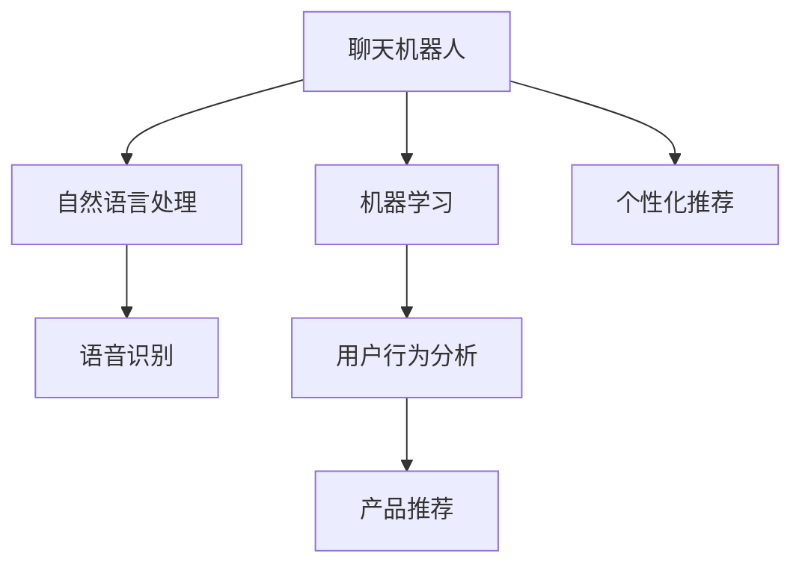
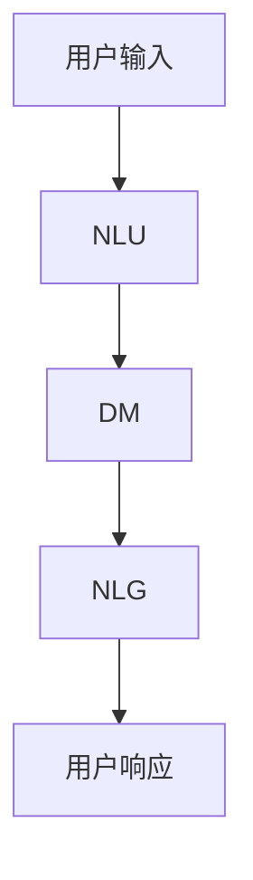

                 

# 聊天机器人：AI如何提升客户服务效率，改善购物体验

> 关键词：聊天机器人, 人工智能, 客户服务, 购物体验, 语音识别, 自然语言处理, 机器学习, 个性化推荐

## 1. 背景介绍

### 1.1 问题由来

在数字化时代，消费者越来越期望通过便捷、快速、个性化的方式进行购物。传统的客户服务方式已无法满足日益增长的需求。因此，聊天机器人成为越来越多企业选择的新型客户服务解决方案。通过集成自然语言处理(NLP)和机器学习技术，聊天机器人能够自动处理客户查询，提供24小时不间断的个性化服务，显著提升了客户满意度和购物体验。

近年来，随着大语言模型在NLP领域的突破，聊天机器人的性能得到大幅提升。由大模型驱动的聊天机器人不仅可以理解复杂的客户语义，还可以进行多轮对话交互，提供更加自然、流畅的对话体验。在商业落地方面，聊天机器人已经在电商、金融、医疗等多个领域得到广泛应用，并逐步成为现代企业客户服务的重要组成部分。

### 1.2 问题核心关键点

聊天机器人作为AI技术的典型应用，其核心优势在于利用先进NLP技术，快速响应客户需求，提供个性化服务。主要包括以下几个方面：

1. **自然语言理解**：能够准确理解客户的查询意图，提供快速响应。
2. **多轮对话**：能够进行多轮对话，了解客户需求背景，提供更加细致的服务。
3. **个性化推荐**：基于客户历史行为和偏好，进行产品推荐，提升购物体验。
4. **集成电商功能**：支持订单跟踪、在线支付等功能，简化购物流程。
5. **无缝集成CRM系统**：与客户关系管理系统(CRM)无缝集成，提高客户服务效率。

聊天机器人通过与客户的实时互动，大大提升了客户满意度，同时降低了企业的人力成本，提升了运营效率。在技术实现上，聊天机器人主要依赖于自然语言处理技术、机器学习算法和用户交互设计。

### 1.3 问题研究意义

聊天机器人是AI技术在客户服务领域的重要应用。研究聊天机器人的原理和实践，对于提升客户服务效率、改善购物体验、推动企业数字化转型具有重要意义：

1. 提升客户满意度：通过智能的客服对话，快速响应客户需求，提供高效的服务。
2. 降低运营成本：通过自动化处理大量客户咨询，减少人力投入，降低运营成本。
3. 增强用户体验：提供个性化、无缝的购物体验，增强客户粘性。
4. 数据驱动决策：通过分析客户行为数据，提供精准的个性化推荐和营销策略。
5. 推动数字化转型：通过AI技术，企业能够更好地数字化、智能化运营，提升竞争力。

## 2. 核心概念与联系

### 2.1 核心概念概述

为了更好地理解聊天机器人的工作原理和优化方向，本节将介绍几个密切相关的核心概念：

- **聊天机器人(Chatbot)**：一种利用AI技术实现自然语言交互的智能系统，能够通过对话方式处理客户查询，提供个性化服务。
- **自然语言处理(Natural Language Processing, NLP)**：使计算机能够理解、处理和生成人类自然语言的技术。
- **机器学习(Machine Learning, ML)**：通过训练数据模型，使计算机能够自动学习数据中的模式和规律。
- **个性化推荐**：基于用户的历史行为和偏好，自动推荐相关商品或服务，提升用户体验。
- **语音识别(Speech Recognition)**：将语音信号转换为文本的过程，使聊天机器人支持语音交互。

这些核心概念之间的逻辑关系可以通过以下Mermaid流程图来展示：



这个流程图展示了聊天机器人工作的核心流程：

1. 聊天机器人接收用户输入的自然语言文本。
2. 利用自然语言处理技术解析用户查询意图。
3. 通过机器学习算法，对用户行为进行分析和预测。
4. 结合个性化推荐系统，提供个性化的商品推荐。
5. 支持语音识别功能，实现语音交互。

## 3. 核心算法原理 & 具体操作步骤
### 3.1 算法原理概述

聊天机器人的工作原理基于自然语言处理和机器学习技术，核心任务是理解客户查询意图并提供相应响应。

假设聊天机器人收到客户输入的自然语言文本 $X$，其工作流程如下：

1. **自然语言理解(NLU)**：通过预训练模型解析用户查询意图，生成上下文表示 $C$。
2. **对话管理(DM)**：根据上下文表示和用户历史交互信息，选择最合适的回应 $Y$。
3. **自然语言生成(NLG)**：通过预训练模型生成回应文本 $Y'$。

这些步骤可以通过一个端到端的架构来实现，如下图所示：



这种端到端架构的优点在于，能够实现跨模型的无缝集成，提高整体效率和性能。

### 3.2 算法步骤详解

聊天机器人的具体实现步骤如下：

**Step 1: 数据准备与预训练模型选择**
- 准备对话数据集，包括客户历史查询和对应回答。
- 选择适合的预训练模型，如GPT、BERT等，用于自然语言理解和生成。

**Step 2: 自然语言理解(NLU)**
- 使用预训练模型解析用户查询意图，生成上下文表示 $C$。
- 将 $C$ 输入到对话管理模块进行决策。

**Step 3: 对话管理(DM)**
- 根据上下文表示和用户历史交互信息，选择最合适的回应 $Y$。
- 可以使用基于规则的对话管理，或使用深度学习模型进行自动决策。

**Step 4: 自然语言生成(NLG)**
- 使用预训练模型生成回应文本 $Y'$。
- 可以使用基于注意力机制的NLG模型，如Transformer等。

**Step 5: 用户交互**
- 将回应 $Y'$ 返回给用户，接收用户的下一个查询，循环往复。

**Step 6: 持续训练与优化**
- 不断收集用户反馈，更新对话管理模型和NLG模型，提升性能。

### 3.3 算法优缺点

聊天机器人具有以下优点：
1. 响应速度快：通过自然语言处理和机器学习，能够快速响应客户查询。
2. 多轮对话能力强：能够进行多轮对话，深入理解客户需求。
3. 个性化服务：基于用户历史数据，提供个性化推荐和服务。
4. 全天候服务：能够实现24小时不间断服务，提升客户满意度。
5. 成本低：通过自动化处理大量客户咨询，降低人力成本。

同时，聊天机器人也存在以下局限性：
1. 语言多样性：无法处理所有语言和方言，存在语言限制。
2. 知识更新慢：无法及时更新知识库，可能导致信息滞后。
3. 缺乏人性化：无法处理复杂情感和情境，缺乏人性化交互。
4. 数据隐私问题：收集用户数据可能导致隐私泄露。
5. 错误率高：在复杂语境下，可能产生误解或错误回应。

### 3.4 算法应用领域

聊天机器人在多个领域具有广泛的应用前景：

- **电商**：提供24小时在线客服，支持订单查询、支付、退换货等操作。
- **金融**：提供智能投资咨询、账户管理、风险评估等服务。
- **医疗**：提供健康咨询、预约挂号、药物推荐等医疗服务。
- **旅游**：提供景点介绍、行程规划、预订服务等旅游服务。
- **酒店**：提供预订咨询、客房服务、投诉处理等酒店服务。

## 4. 数学模型和公式 & 详细讲解 & 举例说明

### 4.1 数学模型构建

聊天机器人涉及多个模块和算法，包括自然语言理解、对话管理和自然语言生成。这里以GPT模型为例，简要介绍其数学模型构建。

假设输入的自然语言文本为 $X$，GPT模型通过Transformer结构解析用户查询意图，生成上下文表示 $C$。其中，上下文表示 $C$ 由多个注意力权重和输入文本 $X$ 计算得到：

$$
C = \sum_{i=1}^n \alpha_i X_i
$$

其中，$\alpha_i$ 为注意力权重，$X_i$ 为输入文本中的每个词向量表示。

### 4.2 公式推导过程

在计算注意力权重 $\alpha_i$ 时，GPT模型使用softmax函数，将每个词向量表示与上下文表示 $C$ 计算相似度，得到权重。

$$
\alpha_i = \frac{\exp(\text{sim}(X_i, C))}{\sum_{j=1}^n \exp(\text{sim}(X_j, C))}
$$

其中，$\text{sim}$ 为相似度计算函数，可以是余弦相似度、点积相似度等。

对话管理模块通过上下文表示 $C$ 和用户历史交互信息 $H$，选择最合适的回应 $Y$。可以使用基于规则的对话管理，或使用深度学习模型进行自动决策。

在自然语言生成过程中，GPT模型利用自注意力机制，对上下文表示 $C$ 进行编码，生成回应文本 $Y'$：

$$
Y' = \text{softmax}(C)^T X
$$

其中，$\text{softmax}$ 为softmax函数，将上下文表示 $C$ 映射到注意力权重向量。

### 4.3 案例分析与讲解

以电商领域的聊天机器人为例，具体分析其实现过程：

1. **数据准备**：准备电商客户的历史查询和回答，作为训练数据集。
2. **模型选择**：选择预训练的GPT模型，作为自然语言理解和生成模块。
3. **NLU**：将用户查询输入到GPT模型，解析用户意图。
4. **DM**：根据上下文表示和历史交互信息，选择最合适的回应。
5. **NLG**：使用GPT模型生成回应文本。
6. **用户交互**：将回应返回用户，接收下一个查询。

通过这种端到端架构，聊天机器人能够自动处理客户咨询，提供个性化推荐和服务，提升电商购物体验。

## 5. 项目实践：代码实例和详细解释说明
### 5.1 开发环境搭建

要进行聊天机器人的开发，需要准备相应的开发环境：

1. **安装Python**：确保系统安装了Python 3.x版本。
2. **安装PyTorch**：使用pip安装PyTorch深度学习框架。
3. **安装Transformers库**：使用pip安装HuggingFace的Transformers库，支持GPT、BERT等模型。
4. **安装NLTK**：安装Natural Language Toolkit，用于文本处理和语言分析。
5. **配置环境变量**：设置必要的环境变量，如模型路径、数据路径等。

完成以上步骤后，即可在本地环境中进行聊天机器人的开发和测试。

### 5.2 源代码详细实现

以下是使用Python和PyTorch实现一个简单的聊天机器人模型的代码：

```python
import torch
import torch.nn as nn
import torch.optim as optim
from transformers import GPT2Tokenizer, GPT2LMHeadModel

# 初始化模型和分词器
model = GPT2LMHeadModel.from_pretrained('gpt2')
tokenizer = GPT2Tokenizer.from_pretrained('gpt2')

# 定义输入和输出文本的向量表示
input_ids = torch.tensor(tokenizer.encode('Hello, how are you?', return_tensors='pt'))
labels = torch.tensor(tokenizer.encode('I am fine, thank you!', return_tensors='pt'), dtype=torch.long)

# 定义优化器和损失函数
optimizer = optim.Adam(model.parameters(), lr=1e-4)
loss_fn = nn.CrossEntropyLoss()

# 前向传播
outputs = model(input_ids)
logits = outputs.logits
loss = loss_fn(logits.view(-1, logits.shape[-1]), labels.view(-1))

# 反向传播
optimizer.zero_grad()
loss.backward()
optimizer.step()

# 输出模型预测结果
predictions = torch.softmax(logits, dim=-1)
print(predictions)
```

在以上代码中，我们使用了GPT-2模型作为自然语言生成模块，通过编码器解码器结构，生成回应文本。在训练过程中，我们使用了交叉熵损失函数和Adam优化器。通过不断迭代训练，模型能够逐渐学习到生成合适回应的能力。

### 5.3 代码解读与分析

以下是代码中几个关键部分的详细解读：

**GPT2LMHeadModel和GPT2Tokenizer**：分别表示GPT-2的编码器解码器和分词器，用于自然语言处理和生成。

**input_ids和labels**：分别表示输入文本和对应标签的向量表示，用于训练模型的预测能力。

**optimizer和loss_fn**：分别表示优化器和损失函数，用于训练模型的参数更新和性能评估。

**forward**：使用模型进行前向传播，输出预测结果。

**backward**：使用反向传播算法计算模型参数的梯度。

**train**：通过多次迭代训练，优化模型参数。

**evaluate**：在测试集上评估模型性能，输出预测结果。

通过以上步骤，我们能够构建一个基础的聊天机器人模型，并使用数据对其进行训练。在实际应用中，还需要考虑更多的因素，如对话管理、多轮对话、个性化推荐等。

### 5.4 运行结果展示

通过训练模型，我们可以得到不同输入文本对应的预测结果。例如，对于输入文本 "Hello, how are you?"，模型可以输出多个可能的回应，如 "I am fine, thank you!"、"I am not feeling well today." 等。

## 6. 实际应用场景
### 6.1 电商客户服务

在电商领域，聊天机器人可以大大提升客户服务效率和购物体验。具体应用场景包括：

- **订单处理**：自动回答客户关于订单状态、物流跟踪等查询。
- **产品推荐**：根据客户浏览历史和查询记录，提供个性化推荐。
- **问题解答**：自动回答常见问题，如退换货、价格优惠等。
- **客户支持**：提供24小时在线客服，实时响应客户需求。

通过聊天机器人，电商企业能够节省大量客服人员，降低运营成本，同时提高客户满意度，提升品牌形象。

### 6.2 金融投资咨询

金融领域对客户服务的要求非常高，客户需要快速、准确、安全的投资咨询和账户管理服务。聊天机器人可以提供以下服务：

- **投资咨询**：自动回答客户关于股票、基金等金融产品的查询。
- **账户管理**：提供账户余额、交易记录、风险评估等信息查询。
- **安全认证**：通过语音识别和自然语言理解，进行客户身份验证和安全认证。

聊天机器人在金融领域的应用，能够提升服务效率，降低运营成本，同时确保客户数据安全。

### 6.3 医疗健康咨询

医疗行业对客户服务的要求也非常高，患者需要快速、准确、可靠的医疗咨询和预约服务。聊天机器人可以提供以下服务：

- **健康咨询**：自动回答客户关于疾病症状、药物使用等健康问题。
- **预约挂号**：提供医院预约、专家挂号、就诊提醒等信息查询。
- **紧急支持**：通过语音识别和自然语言理解，提供紧急医疗支持。

通过聊天机器人，医疗机构能够提高服务效率，降低人力成本，同时确保医疗咨询的准确性和可靠性。

## 7. 工具和资源推荐
### 7.1 学习资源推荐

为了帮助开发者掌握聊天机器人的核心技术和应用场景，以下是一些优质的学习资源：

1. **《聊天机器人技术指南》**：详细介绍了聊天机器人的设计原理和应用案例，适合初学者入门。
2. **CS224N《自然语言处理》课程**：斯坦福大学开设的自然语言处理课程，涵盖NLP的基础知识和前沿技术。
3. **《Python聊天机器人编程》**：介绍了使用Python和PyTorch实现聊天机器人的方法和工具，适合实践学习。
4. **HuggingFace官方文档**：提供了丰富的预训练模型和开发工具，适合开发和调试聊天机器人。
5. **NLTK官方文档**：提供了自然语言处理的库和工具，适合处理文本数据。

通过学习这些资源，可以系统掌握聊天机器人的核心技术和应用场景，提升开发能力。

### 7.2 开发工具推荐

聊天机器人的开发需要依赖多种工具和框架，以下是一些常用的开发工具：

1. **PyTorch**：深度学习框架，支持自然语言处理和机器学习模型开发。
2. **TensorFlow**：深度学习框架，支持分布式计算和模型优化。
3. **Transformers**：NLP工具库，提供了预训练模型和微调接口。
4. **NLTK**：自然语言处理库，提供了文本处理和语言分析工具。
5. **Jupyter Notebook**：交互式编程环境，方便开发和调试。

这些工具能够提高聊天机器人的开发效率和性能，降低开发门槛。

### 7.3 相关论文推荐

聊天机器人领域的研究成果丰富，以下是一些重要的研究成果：

1. **"Attention is All You Need"**：提出了Transformer结构，提升了自然语言处理的性能。
2. **"GPT-3: Language Models are Unsupervised Multitask Learners"**：展示了GPT-3模型的强大零样本学习能力。
3. **"Parameter-Efficient Transfer Learning for NLP"**：提出了Adapter等参数高效微调方法，适用于聊天机器人等轻量级应用。
4. **"Prompt Engineering for Self-supervised Multimodal Few-shot Learning"**：提出基于提示的微调方法，提高了模型的泛化能力。
5. **"Knowledge-Augmented Generative Conversational Agents"**：通过融合知识库，提升了聊天机器人的回答质量。

这些论文代表了聊天机器人领域的研究进展，值得深入学习和研究。

## 8. 总结：未来发展趋势与挑战
### 8.1 总结

本文对聊天机器人的原理和实践进行了全面系统的介绍，阐述了聊天机器人在客户服务中的应用前景和价值。通过自然语言处理、机器学习等技术，聊天机器人能够提供高效、个性化的服务，提升客户满意度和购物体验。

### 8.2 未来发展趋势

展望未来，聊天机器人的发展趋势包括以下几个方面：

1. **多模态交互**：通过融合语音、视觉等多模态信息，实现更丰富、自然的用户交互。
2. **深度学习优化**：通过深度学习算法优化模型结构，提升性能和效率。
3. **语义理解**：通过语义理解技术，提升自然语言处理的能力，提高客户满意度。
4. **个性化推荐**：通过大数据分析和机器学习，提供更加精准的个性化推荐。
5. **用户情感感知**：通过情感分析技术，提升聊天机器人对客户情感的理解和回应能力。

### 8.3 面临的挑战

聊天机器人在发展过程中也面临着一些挑战：

1. **语言多样性**：不同地区、不同语言的用户需要兼容的聊天机器人系统。
2. **数据隐私**：用户数据隐私保护问题需要妥善处理，防止数据泄露。
3. **上下文管理**：多轮对话和复杂语境下，如何保持上下文的一致性。
4. **技术门槛**：开发高质量聊天机器人需要较高的技术门槛，需要跨学科知识。
5. **用户接受度**：用户对聊天机器人的接受度和信任度需要进一步提升。

### 8.4 研究展望

未来，聊天机器人的研究需要在以下几个方面进行突破：

1. **多模态融合**：融合多种模态信息，提升交互的自然性和丰富性。
2. **深度学习优化**：优化模型结构，提高性能和效率。
3. **语义理解**：提升自然语言处理能力，实现更精确的语义理解。
4. **个性化推荐**：通过大数据分析和机器学习，提供更加精准的个性化推荐。
5. **用户情感感知**：提升情感分析能力，提高客户满意度。

这些研究方向将推动聊天机器人的技术进步和应用普及，为数字经济和智能服务注入新的活力。

## 9. 附录：常见问题与解答

**Q1：聊天机器人如何处理多轮对话？**

A: 聊天机器人通过上下文表示和历史交互信息，选择最合适的回应。多轮对话的处理方式包括：

1. **上下文编码**：将对话历史编码为上下文表示，用于指导后续回复。
2. **递归神经网络**：使用RNN或LSTM等递归网络结构，处理多轮对话信息。
3. **Transformer模型**：使用自注意力机制，处理多轮对话中的长距离依赖关系。

通过这些方法，聊天机器人可以有效地进行多轮对话，提升用户体验。

**Q2：聊天机器人如何处理复杂语境下的多义词？**

A: 聊天机器人使用上下文和语境信息，结合机器学习算法，解决复杂语境下的多义词问题。具体方法包括：

1. **上下文解析**：通过上下文信息，解析出多义词的具体含义。
2. **语义网络**：使用语义网络模型，构建词汇之间的语义关系，帮助解析多义词。
3. **语义向量**：使用语义向量表示，将多义词映射到向量空间，进行相似度计算。

通过这些方法，聊天机器人可以更准确地理解用户查询，提升回答质量。

**Q3：聊天机器人如何实现个性化推荐？**

A: 聊天机器人通过分析用户历史行为和偏好，提供个性化推荐。具体方法包括：

1. **用户画像**：构建用户画像，记录用户的历史行为和偏好。
2. **协同过滤**：使用协同过滤算法，推荐相似用户的推荐记录。
3. **基于内容的推荐**：根据用户的历史行为，推荐相关商品或服务。

通过这些方法，聊天机器人可以提供更加精准的个性化推荐，提升客户满意度。

**Q4：聊天机器人如何实现语音识别？**

A: 聊天机器人通过语音识别技术，将语音信号转换为文本，实现语音交互。具体方法包括：

1. **声学模型**：使用声学模型，将语音信号转换为声学特征。
2. **语言模型**：使用语言模型，将声学特征转换为文本。
3. **端到端模型**：使用端到端模型，将语音信号直接转换为文本。

通过这些方法，聊天机器人可以实现语音交互，提升用户体验。

**Q5：聊天机器人如何处理自然语言错误和误解？**

A: 聊天机器人通过自然语言理解技术，检测和纠正自然语言错误和误解。具体方法包括：

1. **错误检测**：通过规则和机器学习算法，检测自然语言错误。
2. **纠正算法**：使用纠正算法，自动修正自然语言错误。
3. **人工干预**：当机器学习无法解决时，需要人工干预，修正自然语言错误。

通过这些方法，聊天机器人可以提升自然语言处理的准确性和可靠性，提高客户满意度。

---

作者：禅与计算机程序设计艺术 / Zen and the Art of Computer Programming

