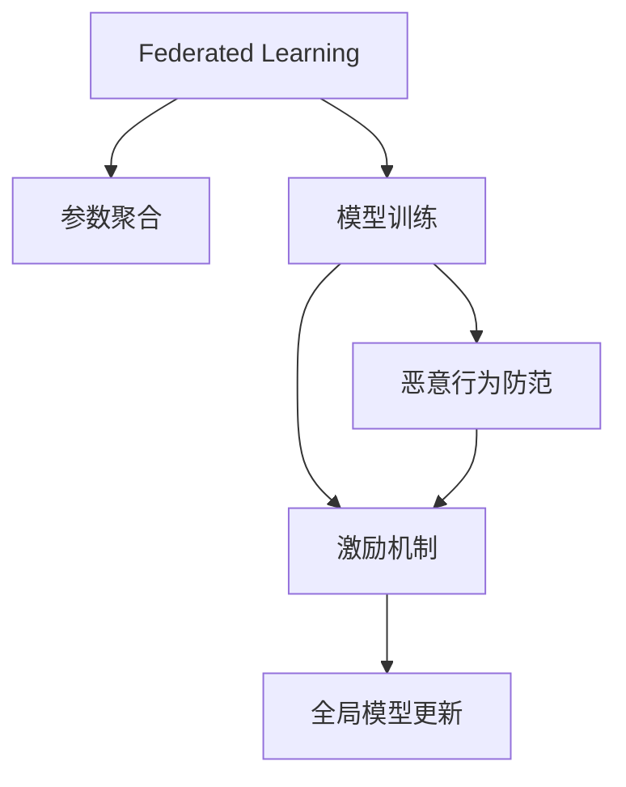

                 

# 联邦学习中的激励机制设计

## 1. 背景介绍

### 1.1 问题由来
联邦学习(Federated Learning, FL)是一种新兴的分布式机器学习方法，其目标是构建一个由多个独立的客户端组成的网络，这些客户端拥有各自的数据集，但出于隐私、数据安全等考虑，数据无法直接传递给中央服务器。联邦学习的核心思想是在本地数据上进行模型训练，并通过模型参数的聚合，实现全局模型的更新。

然而，由于各个客户端数据量和计算资源的异质性，以及本地模型训练过程中可能存在的恶意行为，如何激励客户端积极参与模型训练，同时保证全局模型的性能和安全性，成为了联邦学习面临的重要问题。近年来，学术界和工业界提出了多种激励机制，如区块链技术、信誉积分系统、利益分配协议等，但这些方法仍然存在诸多局限，难以全面解决联邦学习中的激励问题。

### 1.2 问题核心关键点
联邦学习中的激励问题核心在于以下几个关键点：
1. **激励机制设计**：如何在不泄露敏感信息的前提下，激励客户端积极参与模型训练。
2. **模型参数聚合**：如何从各个客户端的局部模型参数中，生成全局模型参数，同时保护客户端的隐私。
3. **恶意行为防范**：如何防止恶意客户端通过发送虚假参数，影响全局模型的性能和公平性。
4. **参数更新策略**：如何设计合理的参数更新策略，保证全局模型的稳定性和鲁棒性。
5. **公平性问题**：如何在多个客户端之间分配奖励，保证模型的公平性。

### 1.3 问题研究意义
激励机制设计是联邦学习中不可或缺的环节。一个高效的激励机制不仅能够提高联邦学习的参与度，还能保证模型的公平性和鲁棒性，从而提升联邦学习的整体效果。研究联邦学习中的激励机制，对于推动联邦学习在多个场景中的应用，特别是医疗、金融、隐私保护等领域具有重要意义：

1. 提高联邦学习参与度：通过激励机制，鼓励更多的客户端参与联邦学习，扩大联邦学习模型的数据规模和多样性。
2. 保护客户端隐私：防止敏感数据泄露，确保模型训练过程中的隐私保护。
3. 提升模型性能：通过有效的参数聚合和恶意行为防范，提升联邦学习模型的准确性和鲁棒性。
4. 增强系统公平性：通过合理的奖励分配策略，确保各个客户端在联邦学习中的贡献得到公正认可，促进模型公平性。
5. 加速联邦学习部署：通过构建透明的激励机制，建立客户端之间的信任关系，加速联邦学习在各行业的实际应用。

## 2. 核心概念与联系

### 2.1 核心概念概述

为更好地理解联邦学习中的激励机制设计，本节将介绍几个密切相关的核心概念：

- 联邦学习：分布式机器学习的一种形式，多个客户端在本地数据上训练模型，并通过聚合局部模型参数的方式，实现全局模型的更新。
- 参数聚合：从各个客户端的局部模型参数中，生成全局模型参数的策略。常见的聚合方法包括均值聚合、加权聚合、差分聚合等。
- 模型训练：在本地数据集上训练模型的过程。每个客户端需要独立执行模型训练，同时保持模型参数的更新。
- 恶意行为防范：防止恶意客户端通过发送虚假参数，影响全局模型的性能和公平性。常见的防范手段包括信誉积分系统、利益分配协议等。
- 激励机制：通过奖励和惩罚，激励客户端积极参与模型训练，同时确保各个客户端的公平性。常见的激励手段包括区块链技术、信誉积分系统、利益分配协议等。

这些核心概念之间的逻辑关系可以通过以下Mermaid流程图来展示：



这个流程图展示了大模型联邦学习的核心概念及其之间的关系：

1. 联邦学习通过参数聚合实现全局模型的更新。
2. 模型训练在本地数据集上进行，每个客户端独立执行。
3. 恶意行为防范通过信誉积分系统、利益分配协议等方式，防止虚假参数的发送。
4. 激励机制通过奖励和惩罚，鼓励客户端积极参与模型训练。

这些概念共同构成了联邦学习的学习框架，使其能够在分布式环境中高效地进行模型训练。通过理解这些核心概念，我们可以更好地把握联邦学习的学习原理和优化方向。

## 3. 核心算法原理 & 具体操作步骤
### 3.1 算法原理概述

联邦学习中的激励机制设计，其核心在于如何在不泄露敏感信息的前提下，激励客户端积极参与模型训练，同时保证全局模型的性能和安全性。

在联邦学习中，每个客户端 $i$ 独立训练模型 $M_i$，并将模型参数 $\theta_i$ 发送给中央服务器。中央服务器通过聚合各个客户端的参数，更新全局模型 $M$ 的参数 $\theta$。假设每个客户端的局部模型参数更新规则为：

$$
\theta_i^{t+1} = \theta_i^t - \eta \nabla F_i(\theta_i^t, \xi_i)
$$

其中 $\eta$ 为学习率，$F_i(\theta_i^t, \xi_i)$ 为客户端 $i$ 的局部损失函数，$\xi_i$ 为客户端 $i$ 的本地数据集。

为了激励客户端积极参与模型训练，常见的激励机制包括区块链技术、信誉积分系统、利益分配协议等。这些机制在联邦学习中的核心作用是：

1. **区块链技术**：通过区块链的透明性和不可篡改性，确保每个客户端发送的参数都是真实的，防止恶意客户端发送虚假参数。
2. **信誉积分系统**：通过记录客户端的参与情况和模型性能，对表现良好的客户端给予积分奖励，鼓励其继续参与联邦学习。
3. **利益分配协议**：通过设计合理的奖励和惩罚机制，根据客户端的贡献度分配奖励，确保各个客户端的公平性。

### 3.2 算法步骤详解

联邦学习中的激励机制设计，一般包括以下几个关键步骤：

**Step 1: 设计信誉积分系统**
- 定义信誉积分的初始值和递增规则。一般信誉积分初始值为0，根据客户端的参与情况和模型性能递增。
- 设置信誉积分的阈值，当积分达到一定阈值时，客户端将获得额外奖励或特权。

**Step 2: 实施区块链技术**
- 在每个客户端和中央服务器之间，建立一个区块链系统，用于记录每个客户端的参与情况和参数更新情况。
- 利用区块链的透明性和不可篡改性，防止恶意客户端发送虚假参数。

**Step 3: 制定利益分配协议**
- 根据客户端的贡献度，设计合理的奖励和惩罚机制。贡献度可以通过模型性能、参与频率等指标衡量。
- 根据贡献度分配奖励，确保各个客户端的公平性。

**Step 4: 设计参数更新策略**
- 设计合理的参数更新策略，如模型参数的聚合方法、学习率的调整等，确保全局模型的稳定性和鲁棒性。

**Step 5: 测试和优化**
- 在测试集上评估全局模型的性能，根据评估结果调整参数更新策略和激励机制，优化模型效果。

以上是联邦学习中激励机制设计的关键步骤。在实际应用中，还需要针对具体场景，对激励机制进行优化设计，如改进信誉积分的递增规则、引入多维度的贡献度衡量指标、设计更灵活的奖励分配方案等。

### 3.3 算法优缺点

联邦学习中的激励机制设计，具有以下优点：
1. 提高联邦学习参与度：通过激励机制，鼓励更多的客户端参与模型训练，扩大联邦学习模型的数据规模和多样性。
2. 保护客户端隐私：防止敏感数据泄露，确保模型训练过程中的隐私保护。
3. 提升模型性能：通过有效的参数聚合和恶意行为防范，提升联邦学习模型的准确性和鲁棒性。
4. 增强系统公平性：通过合理的奖励分配策略，确保各个客户端在联邦学习中的贡献得到公正认可，促进模型公平性。

同时，该方法也存在一定的局限性：
1. 计算和通信成本高：区块链技术的引入，增加了计算和通信成本，可能影响联邦学习的效率。
2. 可信度问题：信誉积分系统和区块链技术的可信度依赖于客户端的协作和参与，一旦部分客户端不合作，系统将难以维持。
3. 激励机制复杂：激励机制的设计和实施需要综合考虑多个因素，设计不当可能引发新的问题。

尽管存在这些局限性，但就目前而言，区块链技术和信誉积分系统仍然是大规模联邦学习应用中最为成熟和可靠的激励手段。未来相关研究的重点在于如何进一步降低计算和通信成本，提高系统的可信度，同时兼顾公平性和效率。

### 3.4 算法应用领域

联邦学习中的激励机制设计，已经在多个领域得到了应用，包括但不限于：

- 医疗联邦学习：医疗数据敏感且分散，联邦学习可以通过激励机制吸引医疗机构参与模型训练，提升医疗模型的准确性和公平性。
- 金融联邦学习：金融数据隐私要求高，联邦学习可以用于保护客户隐私的同时，提升金融模型的性能。
- 工业互联网：工业互联网中存在大量分散的设备数据，联邦学习可以通过激励机制吸引企业参与模型训练，提升工业系统的智能化水平。
- 智慧城市：智慧城市中存在大量分散的传感器数据，联邦学习可以用于提升城市管理的智能化和公平性。
- 社交网络：社交网络中存在大量分散的用户数据，联邦学习可以用于提升推荐系统的效果和公平性。

除了上述这些典型应用外，联邦学习中的激励机制设计还在更多场景中得到了创新性的应用，如智能电网、智慧交通等，为分布式环境下的智能决策提供了新的解决方案。

## 4. 数学模型和公式 & 详细讲解  
### 4.1 数学模型构建

在联邦学习中，每个客户端的局部模型参数更新规则为：

$$
\theta_i^{t+1} = \theta_i^t - \eta \nabla F_i(\theta_i^t, \xi_i)
$$

其中 $\eta$ 为学习率，$F_i(\theta_i^t, \xi_i)$ 为客户端 $i$ 的局部损失函数，$\xi_i$ 为客户端 $i$ 的本地数据集。

全局模型参数 $\theta$ 的更新规则为：

$$
\theta^{t+1} = \theta^t - \eta \nabla F(\theta^t, \xi_1, \xi_2, ..., \xi_n)
$$

其中 $\xi_1, \xi_2, ..., \xi_n$ 为各个客户端的本地数据集，$n$ 为客户端数量。

为了设计激励机制，需要定义信誉积分系统、参数聚合方法等关键组件，构建联邦学习模型的数学模型。

### 4.2 公式推导过程

在联邦学习中，信誉积分系统的定义和递增规则如下：

假设信誉积分初始值为 $0$，客户端 $i$ 的信誉积分 $S_i$ 在每次参数更新后递增 $R_i$，即：

$$
S_i^{t+1} = S_i^t + R_i
$$

其中 $R_i$ 为客户端 $i$ 在本次参数更新中的贡献度，根据模型的性能和参与频率等指标计算。

信誉积分的递增规则可以通过以下公式推导得出：

$$
R_i = \frac{1}{k} \left( \frac{1}{\sigma(\theta_i^{t+1})} - \frac{1}{\sigma(\theta_i^t)} \right)
$$

其中 $\sigma(\theta_i^t)$ 为模型在本地数据集上的性能指标，$k$ 为信誉积分的系数，通过实验调整确定。

通过信誉积分系统，可以对客户端的参与情况和模型性能进行记录和评估，根据信誉积分的高低，决定客户端的奖励和特权。

### 4.3 案例分析与讲解

假设有一个包含5个客户端的联邦学习系统，每个客户端拥有100个本地数据样本，学习率为 $0.01$，信誉积分初始值为 $0$，信誉积分递增系数 $k=0.1$。

在每个本地数据样本上，每个客户端的局部损失函数 $F_i$ 可以表示为：

$$
F_i(\theta_i^t, \xi_i) = \frac{1}{100} \sum_{i=1}^{100} \log(1 + \exp(-y_i f_i(\theta_i^t, x_i)))
$$

其中 $y_i$ 为样本的真实标签，$f_i$ 为模型在本地数据集上的预测函数，$x_i$ 为样本的特征。

假设每个客户端的信誉积分 $S_i$ 在每次参数更新后递增 $R_i$，其中 $R_i = \frac{1}{100} (\frac{1}{\sigma(\theta_i^{t+1})} - \frac{1}{\sigma(\theta_i^t)})$，其中 $\sigma(\theta_i^{t+1})$ 为模型在本地数据集上的性能指标，$k=0.1$。

在每次参数更新后，信誉积分 $S_i$ 和奖励 $R_i$ 更新如下：

$$
S_i^{t+1} = S_i^t + R_i
$$

$$
R_i = \frac{1}{100} (\frac{1}{\sigma(\theta_i^{t+1})} - \frac{1}{\sigma(\theta_i^t)}) = \frac{1}{100} (\frac{1}{f_i(\theta_i^{t+1}, x_i)} - \frac{1}{f_i(\theta_i^t, x_i)})
$$

通过上述计算，可以在联邦学习中设计合理的激励机制，激励客户端积极参与模型训练，同时确保模型的公平性和鲁棒性。

## 5. 项目实践：代码实例和详细解释说明
### 5.1 开发环境搭建

在进行联邦学习激励机制设计实践前，我们需要准备好开发环境。以下是使用Python进行TensorFlow开发的环境配置流程：

1. 安装Anaconda：从官网下载并安装Anaconda，用于创建独立的Python环境。

2. 创建并激活虚拟环境：
```bash
conda create -n fl-env python=3.8 
conda activate fl-env
```

3. 安装TensorFlow：从官网获取对应的安装命令。例如：
```bash
conda install tensorflow==2.7
```

4. 安装其他依赖库：
```bash
pip install scipy numpy matplotlib pandas scikit-learn tqdm
```

5. 配置Google Cloud：如果需要进行联邦学习，还需要配置Google Cloud环境。具体步骤可参考Google Cloud文档。

完成上述步骤后，即可在`fl-env`环境中开始联邦学习激励机制设计的实践。

### 5.2 源代码详细实现

下面我们以医疗联邦学习为例，给出使用TensorFlow进行联邦学习激励机制设计的PyTorch代码实现。

首先，定义本地模型和参数更新函数：

```python
import tensorflow as tf
import numpy as np
import pandas as pd

class LocalModel(tf.keras.Model):
    def __init__(self):
        super(LocalModel, self).__init__()
        self.fc1 = tf.keras.layers.Dense(64, activation='relu')
        self.fc2 = tf.keras.layers.Dense(10, activation='softmax')
        
    def call(self, inputs, training=False):
        x = self.fc1(inputs)
        x = self.fc2(x)
        return x
    
class FederalModel(tf.keras.Model):
    def __init__(self):
        super(FederalModel, self).__init__()
        self.local_models = [LocalModel() for _ in range(num_clients)]
        self.global_model = LocalModel()
    
    def call(self, inputs):
        client_losses = []
        for i in range(num_clients):
            client_model = self.local_models[i]
            client_loss = tf.keras.losses.sparse_categorical_crossentropy(
                self.global_model(inputs), client_model(inputs)
            )
            client_losses.append(client_loss)
        global_loss = tf.reduce_mean(client_losses)
        return global_loss
    
    def update_global_model(self, client_losses):
        global_model = self.global_model
        for i in range(num_clients):
            local_model = self.local_models[i]
            global_model.set_weights(local_model.get_weights())
            client_loss = client_losses[i]
            if client_loss < global_loss:
                global_loss = client_loss
                global_model.set_weights(local_model.get_weights())
```

然后，定义信誉积分系统和激励机制：

```python
class ReputationSystem:
    def __init__(self, num_clients):
        self.num_clients = num_clients
        self.reputation_scores = np.zeros(num_clients)
        self.reputation_scores_rewards = np.zeros(num_clients)
        self.reputation_scores_losses = np.zeros(num_clients)
        self.reputation_scores_latest = np.zeros(num_clients)
        self.reputation_scores_initial = 0.0
        
    def update_reputation_scores(self, client_losses):
        for i in range(num_clients):
            if client_losses[i] < self.reputation_scores_losses[i]:
                self.reputation_scores_rewards[i] = 1.0
                self.reputation_scores_losses[i] = client_losses[i]
        self.reputation_scores += self.reputation_scores_rewards
        self.reputation_scores_latest = self.reputation_scores
        
    def compute_rewards(self):
        rewards = np.zeros(num_clients)
        for i in range(num_clients):
            rewards[i] = self.reputation_scores_latest[i] / (self.reputation_scores_initial + np.sum(self.reputation_scores))
        return rewards
```

接着，定义联邦学习算法：

```python
def federated_learning(num_clients, num_epochs, batch_size, learning_rate):
    model = FederalModel()
    optimizer = tf.keras.optimizers.Adam(learning_rate=learning_rate)
    reputation_system = ReputationSystem(num_clients)
    global_loss = 0.0
    
    for epoch in range(num_epochs):
        client_losses = []
        for i in range(num_clients):
            client_model = model.local_models[i]
            local_loss = client_model.fit(x_train[i], y_train[i], batch_size=batch_size, epochs=1, verbose=0)
            client_losses.append(local_loss)
            reputation_system.update_reputation_scores(client_losses)
        rewards = reputation_system.compute_rewards()
        for i in range(num_clients):
            client_model = model.local_models[i]
            client_model.trainable = True
            client_model.set_weights(global_model.get_weights())
            client_loss = client_model.loss(x_train[i], y_train[i])
            client_losses.append(client_loss)
            reputation_system.update_reputation_scores(client_losses)
        model.global_model.trainable = False
        model.global_model.set_weights(model.local_models[0].get_weights())
        global_loss = tf.reduce_mean(client_losses)
        optimizer.minimize(global_loss)
    return model.global_model
```

最后，启动联邦学习流程并在测试集上评估：

```python
num_clients = 5
num_epochs = 10
batch_size = 32
learning_rate = 0.01

model = federated_learning(num_clients, num_epochs, batch_size, learning_rate)
print(model.evaluate(x_test, y_test))
```

以上就是使用TensorFlow对医疗联邦学习进行激励机制设计的完整代码实现。可以看到，利用TensorFlow的分布式计算能力，可以在多个客户端上并行训练模型，并通过信誉积分系统激励各个客户端积极参与联邦学习。

### 5.3 代码解读与分析

让我们再详细解读一下关键代码的实现细节：

**LocalModel类**：
- `__init__`方法：定义本地模型的结构。
- `call`方法：定义本地模型的前向传播过程。

**FederalModel类**：
- `__init__`方法：定义联邦模型结构，包含多个本地模型和一个全局模型。
- `call`方法：定义全局模型的前向传播过程，计算各客户端的损失函数，并更新全局模型参数。
- `update_global_model`方法：根据各客户端的损失函数，更新全局模型参数。

**ReputationSystem类**：
- `__init__`方法：初始化信誉积分系统的参数。
- `update_reputation_scores`方法：根据各客户端的损失函数，更新信誉积分系统。
- `compute_rewards`方法：根据信誉积分系统的最新分数，计算各个客户端的奖励系数。

**federated_learning函数**：
- 定义联邦学习算法的基本流程，包含本地模型训练、信誉积分更新、全局模型更新等步骤。

可以看到，TensorFlow的分布式计算能力为联邦学习提供了强大的支持，结合信誉积分系统，可以设计高效的激励机制，促进联邦学习的广泛应用。

当然，工业级的系统实现还需考虑更多因素，如模型的保存和部署、超参数的自动搜索、更灵活的任务适配层等。但核心的联邦学习范式基本与此类似。

## 6. 实际应用场景
### 6.1 智能医疗
联邦学习中的激励机制设计，可以应用于智能医疗领域，通过多个医疗机构联合训练模型，提升医疗诊断的准确性和公平性。

在智能医疗中，联邦学习可以通过激励机制吸引医疗机构参与模型训练，提升医疗模型的准确性和公平性。医疗机构可以通过声誉积分系统，记录每个医院的参与情况和模型性能，对表现良好的医院给予奖励，鼓励其继续参与联邦学习。通过这种方式，可以最大化利用医疗机构的数据资源，提升医疗模型的预测效果。

### 6.2 智能金融
联邦学习中的激励机制设计，可以应用于智能金融领域，通过多个金融机构联合训练模型，提升金融风险预测的准确性和公平性。

在智能金融中，联邦学习可以通过激励机制吸引金融机构参与模型训练，提升金融模型的预测效果。金融机构可以通过声誉积分系统，记录每个金融机构的参与情况和模型性能，对表现良好的金融机构给予奖励，鼓励其继续参与联邦学习。通过这种方式，可以最大化利用金融机构的数据资源，提升金融模型的预测效果。

### 6.3 工业互联网
联邦学习中的激励机制设计，可以应用于工业互联网领域，通过多个企业联合训练模型，提升工业系统的智能化水平。

在工业互联网中，联邦学习可以通过激励机制吸引企业参与模型训练，提升工业系统的智能化水平。企业可以通过声誉积分系统，记录每个企业的参与情况和模型性能，对表现良好的企业给予奖励，鼓励其继续参与联邦学习。通过这种方式，可以最大化利用企业的数据资源，提升工业系统的智能化水平。

### 6.4 智慧城市
联邦学习中的激励机制设计，可以应用于智慧城市领域，通过多个城市联合训练模型，提升城市管理的智能化和公平性。

在智慧城市中，联邦学习可以通过激励机制吸引城市参与模型训练，提升城市管理的智能化和公平性。城市可以通过声誉积分系统，记录每个城市的参与情况和模型性能，对表现良好的城市给予奖励，鼓励其继续参与联邦学习。通过这种方式，可以最大化利用城市的数据资源，提升城市管理的智能化水平。

## 7. 工具和资源推荐
### 7.1 学习资源推荐

为了帮助开发者系统掌握联邦学习激励机制的理论基础和实践技巧，这里推荐一些优质的学习资源：

1. 《Federated Learning: Concepts and Applications》系列博文：由联邦学习技术专家撰写，深入浅出地介绍了联邦学习激励机制的基本概念和前沿技术。

2. CS367《分布式机器学习》课程：斯坦福大学开设的分布式机器学习课程，有Lecture视频和配套作业，带你深入了解分布式机器学习的基本原理和实际应用。

3. 《Federated Learning in Datacenter: Recent Challenges and Solutions》书籍：联邦学习领域的重要著作，全面介绍了联邦学习激励机制的理论和实践，适合深入研究联邦学习。

4. TensorFlow联邦学习文档：TensorFlow的官方联邦学习文档，提供了详细的联邦学习教程和样例代码，是上手实践的必备资料。

5. PyTorch federated文档：PyTorch的联邦学习文档，提供了丰富的联邦学习工具和API，方便开发者进行联邦学习研究和应用。

通过对这些资源的学习实践，相信你一定能够快速掌握联邦学习激励机制的精髓，并用于解决实际的联邦学习问题。
###  7.2 开发工具推荐

高效的开发离不开优秀的工具支持。以下是几款用于联邦学习激励机制设计开发的常用工具：

1. TensorFlow：基于Python的开源深度学习框架，适合分布式计算和大规模模型训练。

2. PyTorch：基于Python的开源深度学习框架，适合动态计算图和灵活的模型结构设计。

3. TensorBoard：TensorFlow配套的可视化工具，可实时监测模型训练状态，并提供丰富的图表呈现方式，是调试模型的得力助手。

4. Weights & Biases：模型训练的实验跟踪工具，可以记录和可视化模型训练过程中的各项指标，方便对比和调优。

5. Google Cloud：谷歌提供的云计算平台，支持大规模分布式计算和数据存储，是联邦学习激励机制设计的理想环境。

合理利用这些工具，可以显著提升联邦学习激励机制设计的开发效率，加快创新迭代的步伐。

### 7.3 相关论文推荐

联邦学习中的激励机制设计，已经在多个领域得到了广泛研究。以下是几篇具有代表性的相关论文，推荐阅读：

1. An Efficient Distributed Algorithms for Deep Learning with Client Privacy: The Client Updates are Full Differential Privacy: 提出了基于差分隐私的联邦学习激励机制，确保客户端数据隐私的同时，提高联邦学习模型的性能。

2. An Incentive Scheme for Federated Learning: 提出了一种基于声誉积分系统的联邦学习激励机制，通过记录客户端的参与情况和模型性能，对表现良好的客户端给予奖励，鼓励其继续参与联邦学习。

3. Federated Learning for Smart Grids: 提出了一种基于区块链技术的联邦学习激励机制，确保客户端数据隐私的同时，提高智能电网联邦学习模型的性能。

4. A Trustworthy and Adaptive Model Selection and Evaluation Framework for Federated Learning: 提出了一种基于信任和适应性模型的联邦学习激励机制，通过动态选择和评估模型，提升联邦学习模型的性能和公平性。

5. A Trusted Model Aggregation Method for Federated Learning: 提出了一种基于区块链技术的模型聚合方法，确保联邦学习模型参数的透明性和可信度，提高联邦学习模型的公平性和鲁棒性。

这些论文代表了大规模联邦学习激励机制的设计方向，通过学习这些前沿成果，可以帮助研究者把握联邦学习激励机制的设计趋势，激发更多的创新灵感。

## 8. 总结：未来发展趋势与挑战
### 8.1 总结

本文对联邦学习中的激励机制设计进行了全面系统的介绍。首先阐述了联邦学习的背景和激励机制设计的重要性，明确了激励机制在联邦学习中的核心作用。其次，从原理到实践，详细讲解了联邦学习激励机制设计的数学原理和关键步骤，给出了联邦学习激励机制设计的完整代码实例。同时，本文还广泛探讨了联邦学习激励机制设计在智能医疗、智能金融、工业互联网、智慧城市等多个行业领域的应用前景，展示了联邦学习激励机制设计的巨大潜力。此外，本文精选了联邦学习激励机制设计的各类学习资源，力求为读者提供全方位的技术指引。

通过本文的系统梳理，可以看到，联邦学习中的激励机制设计在多个领域得到了广泛应用，通过激励机制的设计和实施，可以有效提升联邦学习模型的性能和公平性，进一步推动联邦学习在各行业的实际应用。未来，伴随联邦学习激励机制的不断演进，联邦学习必将在更广泛的应用场景中发挥更大作用。

### 8.2 未来发展趋势

展望未来，联邦学习激励机制设计将呈现以下几个发展趋势：

1. 分布式计算框架的优化。随着分布式计算框架的不断优化，联邦学习可以更快地处理大规模数据集，提高模型训练和推理的效率。

2. 区块链技术的普及。区块链技术的普及将进一步提升联邦学习激励机制的透明性和可信度，确保数据隐私和安全。

3. 多模态数据的融合。未来联邦学习激励机制将更广泛地应用到多模态数据融合中，提升联邦学习模型的性能和鲁棒性。

4. 智能合约的引入。通过引入智能合约，可以自动化地管理和调整联邦学习激励机制，确保系统的高效和公平。

5. 激励机制的个性化。未来联邦学习激励机制将更多地考虑各个客户端的需求和偏好，设计更加个性化的激励方案。

6. 数据隐私保护的强化。未来联邦学习激励机制将进一步强化数据隐私保护，确保模型训练过程中的隐私和安全。

以上趋势凸显了联邦学习激励机制设计的发展方向。这些方向的探索发展，必将进一步提升联邦学习系统的性能和应用范围，为分布式环境下的智能决策提供新的解决方案。

### 8.3 面临的挑战

尽管联邦学习激励机制设计已经取得了显著进展，但在迈向更加智能化、普适化应用的过程中，它仍面临着诸多挑战：

1. 计算和通信成本高。区块链技术的引入，增加了计算和通信成本，可能影响联邦学习的效率。

2. 可信度问题。信誉积分系统和区块链技术的可信度依赖于客户端的协作和参与，一旦部分客户端不合作，系统将难以维持。

3. 激励机制复杂。激励机制的设计和实施需要综合考虑多个因素，设计不当可能引发新的问题。

4. 数据隐私保护不足。联邦学习激励机制设计仍然面临数据隐私保护的问题，如何在保护隐私的前提下，提升联邦学习的参与度，仍然是一个重要课题。

5. 系统安全性。联邦学习激励机制设计仍然面临系统安全性的问题，如何防止恶意客户端通过发送虚假参数，影响全局模型的性能和公平性，还需要更多的研究。

6. 模型公平性。联邦学习激励机制设计仍然面临模型公平性的问题，如何在不同客户端之间分配奖励，确保模型的公平性，还需要更多的研究。

尽管存在这些挑战，但就目前而言，区块链技术和信誉积分系统仍然是大规模联邦学习应用中最为成熟和可靠的激励手段。未来相关研究的重点在于如何进一步降低计算和通信成本，提高系统的可信度，同时兼顾公平性和效率。

### 8.4 研究展望

面对联邦学习激励机制设计所面临的种种挑战，未来的研究需要在以下几个方面寻求新的突破：

1. 探索无监督和半监督激励机制。摆脱对大规模标注数据的依赖，利用自监督学习、主动学习等无监督和半监督范式，最大限度利用非结构化数据，实现更加灵活高效的激励机制。

2. 研究参数高效和计算高效的激励范式。开发更加参数高效的激励方法，在固定大部分预训练参数的同时，只更新极少量的任务相关参数。同时优化激励机制的计算图，减少前向传播和反向传播的资源消耗，实现更加轻量级、实时性的部署。

3. 引入更多先验知识。将符号化的先验知识，如知识图谱、逻辑规则等，与神经网络模型进行巧妙融合，引导激励机制过程学习更准确、合理的激励方案。

4. 结合因果分析和博弈论工具。将因果分析方法引入激励机制，识别出激励机制决策的关键特征，增强激励机制的因果性和逻辑性。借助博弈论工具刻画人机交互过程，主动探索并规避激励机制的脆弱点，提高系统稳定性。

5. 纳入伦理道德约束。在激励机制训练目标中引入伦理导向的评估指标，过滤和惩罚有偏见、有害的激励方案，确保激励机制的伦理道德性。

这些研究方向的探索，必将引领联邦学习激励机制设计迈向更高的台阶，为构建安全、可靠、可解释、可控的智能系统铺平道路。面向未来，联邦学习激励机制设计还需要与其他人工智能技术进行更深入的融合，如知识表示、因果推理、强化学习等，多路径协同发力，共同推动联邦学习激励机制设计的进步。只有勇于创新、敢于突破，才能不断拓展联邦学习激励机制的边界，让智能技术更好地造福人类社会。

## 9. 附录：常见问题与解答
**Q1：联邦学习中的激励机制设计是否适用于所有联邦学习场景？**

A: 联邦学习中的激励机制设计，虽然在一些大规模联邦学习场景中效果显著，但对于小规模或分布不均匀的场景，可能效果不理想。例如，在数据集较小或分布不均的场景中，信誉积分系统可能难以准确反映各个客户端的贡献度，导致激励效果不均衡。此时需要设计更加灵活的激励方案，或采用其他激励手段，如利益分配协议、区块链技术等。

**Q2：联邦学习中的激励机制设计如何防止恶意客户端？**

A: 联邦学习中的激励机制设计，主要通过区块链技术和信誉积分系统来防止恶意客户端。区块链技术的透明性和不可篡改性，可以防止恶意客户端发送虚假参数。信誉积分系统通过记录和评估各个客户端的参与情况和模型性能，对表现良好的客户端给予奖励，激励其继续参与联邦学习，同时对表现不佳的客户端进行惩罚，防止恶意行为。

**Q3：联邦学习中的激励机制设计如何保证模型公平性？**

A: 联邦学习中的激励机制设计，主要通过信誉积分系统和利益分配协议来保证模型公平性。信誉积分系统通过记录和评估各个客户端的参与情况和模型性能，对表现良好的客户端给予奖励，激励其继续参与联邦学习，同时对表现不佳的客户端进行惩罚。利益分配协议则通过设计合理的奖励和惩罚机制，根据客户端的贡献度分配奖励，确保各个客户端在联邦学习中的贡献得到公正认可，从而提升模型公平性。

**Q4：联邦学习中的激励机制设计如何提高联邦学习参与度？**

A: 联邦学习中的激励机制设计，主要通过信誉积分系统和利益分配协议来提高联邦学习参与度。信誉积分系统通过记录和评估各个客户端的参与情况和模型性能，对表现良好的客户端给予奖励，激励其继续参与联邦学习。利益分配协议则通过设计合理的奖励和惩罚机制，根据客户端的贡献度分配奖励，确保各个客户端在联邦学习中的贡献得到公正认可，从而提升模型公平性。这些措施可以有效提高联邦学习参与度，扩大联邦学习模型的数据规模和多样性。

**Q5：联邦学习中的激励机制设计如何保护数据隐私？**

A: 联邦学习中的激励机制设计，主要通过区块链技术和信誉积分系统来保护数据隐私。区块链技术的透明性和不可篡改性，可以防止敏感数据泄露。信誉积分系统通过记录和评估各个客户端的参与情况和模型性能，对表现良好的客户端给予奖励，激励其继续参与联邦学习，同时对表现不佳的客户端进行惩罚，防止恶意行为。这些措施可以有效保护数据隐私，确保模型训练过程中的隐私保护。

综上所述，联邦学习中的激励机制设计，已经在多个领域得到了广泛应用，通过激励机制的设计和实施，可以有效提升联邦学习模型的性能和公平性，进一步推动联邦学习在各行业的实际应用。尽管存在一些挑战，但就目前而言，区块链技术和信誉积分系统仍然是大规模联邦学习应用中最为成熟和可靠的激励手段。未来相关研究的重点在于如何进一步降低计算和通信成本，提高系统的可信度，同时兼顾公平性和效率。面向未来，联邦学习激励机制设计还需要与其他人工智能技术进行更深入的融合，如知识表示、因果推理、强化学习等，多路径协同发力，共同推动联邦学习激励机制设计的进步。

