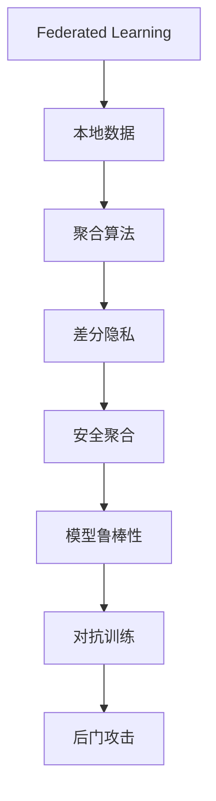

                 

# 联邦学习的隐私攻击与防御策略

在当今数据驱动的时代，数据隐私和安全已成为各大企业和科研机构共同关注的焦点。然而，随着人工智能和机器学习技术的不断进步，越来越多的数据隐私威胁不断浮现，尤其是分布式学习场景中的联邦学习(Federated Learning, FL)方法。本文将深入探讨联邦学习的隐私攻击手段，并提出一系列针对性的防御策略，以期保护参与方的数据隐私，推动联邦学习的广泛应用。

## 1. 背景介绍

### 1.1 问题由来
随着云计算和移动计算的普及，数据分散存储在多个独立的设备或节点上。为了充分利用分散的计算资源，同时保护数据隐私，联邦学习（Federated Learning, FL）应运而生。联邦学习是一种分布式学习算法，允许多个拥有私有数据的本地节点，在不共享数据的情况下，协同训练一个全局模型。

然而，联邦学习在提供数据隐私保护的同时，也面临着诸多安全威胁。攻击者可以透过各种方式侵犯联邦学习模型的安全性，威胁模型参数的安全性，甚至直接访问到敏感数据。这些隐私攻击手段严重影响联邦学习的可信度和普及率，亟需有效的防御策略应对。

### 1.2 问题核心关键点
本文聚焦于联邦学习的隐私攻击和防御方法，深入分析了联邦学习中的各种隐私威胁，并提出多种防御手段，以保障数据隐私，确保联邦学习的安全性。

## 2. 核心概念与联系

### 2.1 核心概念概述

为更好地理解联邦学习的隐私攻击和防御方法，本节将介绍几个密切相关的核心概念：

- **联邦学习(Federated Learning, FL)**：一种分布式机器学习算法，允许多个参与方在不共享本地数据的情况下，联合训练一个全局模型。参与方通过本地模型参数的聚合来更新全局模型，从而提升模型的性能。
- **本地数据**：各参与方拥有的私有数据，用于本地模型的训练。
- **聚合算法**：在联邦学习中，用于计算各参与方模型参数平均值的算法。
- **差分隐私(Differential Privacy, DP)**：一种隐私保护技术，通过在模型参数的添加噪声来限制模型对个体数据的敏感度，保证模型输出不受任何单个参与方数据的影响。
- **安全聚合**：一种保护模型参数安全传输和聚合的机制，防止攻击者窃取模型参数或通过聚合算法攻击模型。
- **模型鲁棒性**：指模型对于特定攻击的抵抗能力，包括对抗攻击和后门攻击等。
- **对抗训练**：通过加入对抗样本训练模型，提高模型对于对抗攻击的鲁棒性。
- **后门攻击**：攻击者通过在模型中植入后门，在特定条件下触发恶意行为，如泄露敏感信息或执行恶意指令。

这些核心概念之间的逻辑关系可以通过以下Mermaid流程图来展示：



这个流程图展示了大模型微调的各个核心概念及其之间的逻辑关系：

1. 联邦学习利用本地数据进行分布式模型训练。
2. 聚合算法用于计算各本地模型参数的平均值，更新全局模型。
3. 差分隐私通过在模型参数添加噪声来限制模型对个体数据的敏感度。
4. 安全聚合保护模型参数在传输和聚合过程中的安全性。
5. 模型鲁棒性指模型对于特定攻击的抵抗能力。
6. 对抗训练通过加入对抗样本训练模型，提高模型对于对抗攻击的鲁棒性。
7. 后门攻击通过在模型中植入后门，实现恶意行为。

这些概念共同构成了联邦学习的隐私保护框架，使其能够在分布式环境中保障数据隐私，确保联邦学习的安全性。

## 3. 核心算法原理 & 具体操作步骤

### 3.1 算法原理概述

联邦学习的隐私攻击和防御策略，主要是通过差分隐私、安全聚合和对抗训练等技术，来保护参与方数据隐私，防止模型参数被窃取或篡改。

具体而言，差分隐私通过在模型参数中引入随机噪声，使得模型输出对于任何单个参与方数据的改变不敏感，从而保护数据隐私。安全聚合则通过加密或差分隐私技术，保护模型参数在传输和聚合过程中的安全性。对抗训练则通过加入对抗样本，训练模型对于对抗攻击的鲁棒性。

### 3.2 算法步骤详解

以下我们详细介绍联邦学习中常见的隐私攻击手段，以及相应的防御策略。

**3.2.1 差分隐私机制**

差分隐私(DP)是一种基于概率的隐私保护技术，通过在模型参数中引入噪声来保护个体数据。具体来说，假设全局模型为 $f: \mathcal{X} \rightarrow \mathcal{Y}$，其中 $\mathcal{X}$ 为输入空间，$\mathcal{Y}$ 为输出空间，$D$ 为训练数据集。在DP中，我们希望计算 $f$ 在 $D$ 上的输出概率 $\mathbb{P}(f(D))$ 时，对于任何单个输入 $x_i \in \mathcal{X}$，输出概率的变化不超过一个固定的 $\epsilon$ 和 $\delta$ 的概率。

差分隐私的具体实现步骤如下：

1. 选择适当的 $\epsilon$ 和 $\delta$ 参数，以保证隐私水平。
2. 在全局模型参数 $\theta$ 中，添加噪声 $\mathcal{N}(0,\sigma^2)$，得到噪声参数 $\theta' = \theta + \mathcal{N}(0,\sigma^2)$。
3. 使用噪声参数 $\theta'$ 进行模型训练。
4. 得到训练后的模型参数 $\theta^*$。

**3.2.2 安全聚合机制**

在联邦学习中，聚合算法用于计算各本地模型参数的平均值，更新全局模型。然而，传统的聚合算法（如平均算法）容易受到恶意参与方的攻击，导致模型参数被篡改。

为了保证聚合的安全性，可以引入安全聚合机制，防止攻击者通过聚合算法攻击模型。具体实现步骤如下：

1. 在本地模型参数 $\theta_i$ 中，添加随机噪声 $\mathcal{N}(0,\sigma^2)$，得到噪声参数 $\theta_i' = \theta_i + \mathcal{N}(0,\sigma^2)$。
2. 将各噪声参数 $\theta_i'$ 发送到中心节点。
3. 中心节点计算各噪声参数的平均值 $\hat{\theta} = \frac{1}{N} \sum_{i=1}^N \theta_i'$。
4. 将 $\hat{\theta}$ 发送回各本地节点。
5. 各本地节点使用 $\hat{\theta}$ 更新本地模型参数。

**3.2.3 对抗训练机制**

对抗训练是一种通过加入对抗样本训练模型的方法，提高模型对于对抗攻击的鲁棒性。具体来说，假设攻击者试图通过输入对抗样本 $x'$ 使得模型输出 $\hat{y}$ 不同于正常输入 $x$ 的输出 $y$，我们可以将这一问题转化为以下形式：

$$
\max_{\delta} \|x - x'\|_{\infty} \quad \text{s.t.} \quad f(x') \neq f(x)
$$

其中 $\delta$ 为对抗样本的扰动大小，$x$ 为正常输入，$x'$ 为对抗样本，$f$ 为全局模型。

在对抗训练中，我们通过引入对抗样本 $x'$，在模型训练过程中不断调整模型参数，以使得模型能够对对抗攻击具有鲁棒性。具体实现步骤如下：

1. 选择适当的对抗攻击方法，如FGSM、PGD等。
2. 在本地模型参数 $\theta_i$ 中，添加噪声 $\mathcal{N}(0,\sigma^2)$，得到噪声参数 $\theta_i' = \theta_i + \mathcal{N}(0,\sigma^2)$。
3. 将各噪声参数 $\theta_i'$ 和对抗样本 $x'$ 发送到中心节点。
4. 中心节点计算各噪声参数的平均值 $\hat{\theta}$ 和对抗样本的损失函数。
5. 各本地节点使用 $\hat{\theta}$ 和对抗样本的损失函数更新本地模型参数。

### 3.3 算法优缺点

差分隐私、安全聚合和对抗训练等隐私保护方法，各有其优缺点：

**差分隐私的优点**：
1. 提供了严格的隐私保障，对于任何单个参与方数据的变化，模型输出不受影响。
2. 适用于多种分布式学习场景，包括联邦学习、模型聚合等。

**差分隐私的缺点**：
1. 添加噪声会引入一定的模型精度损失。
2. 参数的选择需要谨慎，过高或过低的噪声会导致隐私泄露或模型性能下降。

**安全聚合的优点**：
1. 保护模型参数在传输和聚合过程中的安全性，防止恶意参与方的攻击。
2. 适用于多种聚合算法，如平均聚合、加权聚合等。

**安全聚合的缺点**：
1. 添加噪声会引入一定的模型精度损失。
2. 需要额外的计算和通信开销。

**对抗训练的优点**：
1. 提高了模型对于对抗攻击的鲁棒性，保障模型输出的安全性。
2. 适用于多种攻击方法，如FGSM、PGD等。

**对抗训练的缺点**：
1. 需要额外的对抗样本生成和训练时间。
2. 对于高维度的输入数据，对抗样本的生成和训练复杂度较高。

### 3.4 算法应用领域

差分隐私、安全聚合和对抗训练等隐私保护方法，已经在多个领域得到了广泛应用，例如：

- 金融数据隐私保护：在金融领域，银行和金融机构需要保护客户隐私数据。通过差分隐私和对抗训练，可以确保客户数据在模型训练和聚合过程中不泄露。
- 医疗数据隐私保护：在医疗领域，患者数据隐私保护至关重要。使用差分隐私和安全聚合，可以保护患者的医疗数据不被泄露。
- 智能交通系统：在智能交通系统中，各城市的数据共享需要保障隐私。通过安全聚合和对抗训练，可以确保各城市的交通数据安全。
- 社交媒体平台：在社交媒体平台中，用户数据隐私保护是关键。通过差分隐私和对抗训练，可以保护用户数据不被泄露。
- 物联网设备：在物联网设备中，各设备的数据共享需要保障隐私。通过安全聚合和差分隐私，可以确保各设备的数据安全。

除了上述这些领域外，差分隐私、安全聚合和对抗训练等隐私保护方法，也在其他领域如网络安全、智能制造、智能电网等得到广泛应用，推动了相关行业的数字化转型和智能化升级。

## 4. 数学模型和公式 & 详细讲解 & 举例说明

### 4.1 数学模型构建

为了更好地理解联邦学习中差分隐私、安全聚合和对抗训练的数学模型，本节将详细讲解这些数学模型的构建和推导过程。

假设全局模型为 $f: \mathcal{X} \rightarrow \mathcal{Y}$，其中 $\mathcal{X}$ 为输入空间，$\mathcal{Y}$ 为输出空间，$D = \{(x_i, y_i)\}_{i=1}^N$ 为训练数据集，$L$ 为损失函数。

在差分隐私中，我们希望计算 $f$ 在 $D$ 上的输出概率 $\mathbb{P}(f(D))$ 时，对于任何单个输入 $x_i \in \mathcal{X}$，输出概率的变化不超过一个固定的 $\epsilon$ 和 $\delta$ 的概率。

差分隐私的具体数学模型为：

$$
\mathbb{P}(f(D')) \leq e^{\epsilon} \mathbb{P}(f(D)) + \delta
$$

其中 $D' = D \setminus \{x_i\}$ 为除去了 $x_i$ 的数据集。

在安全聚合中，我们希望通过聚合算法 $\mathcal{A}$，计算各本地模型参数的平均值，使得模型参数 $\hat{\theta}$ 对于任何单个输入 $x_i \in \mathcal{X}$，输出概率的变化不超过一个固定的 $\epsilon$ 和 $\delta$ 的概率。

安全聚合的具体数学模型为：

$$
\mathbb{P}(f(D') \mid \hat{\theta}) \leq e^{\epsilon} \mathbb{P}(f(D) \mid \theta) + \delta
$$

其中 $\theta$ 为全局模型参数，$\hat{\theta}$ 为聚合后的模型参数。

在对抗训练中，我们希望通过对抗样本 $x'$，训练模型参数 $\theta$，使得模型对于对抗攻击具有鲁棒性。

对抗训练的具体数学模型为：

$$
\max_{\delta} \|x - x'\|_{\infty} \quad \text{s.t.} \quad f(x') \neq f(x)
$$

其中 $x$ 为正常输入，$x'$ 为对抗样本，$f$ 为全局模型。

### 4.2 公式推导过程

以下我们分别推导差分隐私、安全聚合和对抗训练的数学模型。

**差分隐私的推导**：

在差分隐私中，我们通过在模型参数中引入噪声来保护数据隐私。假设在本地模型参数 $\theta_i$ 中，添加噪声 $\mathcal{N}(0,\sigma^2)$，得到噪声参数 $\theta_i' = \theta_i + \mathcal{N}(0,\sigma^2)$。

使用噪声参数 $\theta_i'$ 进行模型训练，得到训练后的模型参数 $\theta^*$。

差分隐私的数学模型为：

$$
\mathbb{P}(f(D') \mid \theta^*) \leq e^{\epsilon} \mathbb{P}(f(D) \mid \theta) + \delta
$$

其中 $\epsilon$ 为隐私参数，$\delta$ 为隐私预算。

**安全聚合的推导**：

在安全聚合中，我们通过加密或差分隐私技术，保护模型参数在传输和聚合过程中的安全性。假设在本地模型参数 $\theta_i$ 中，添加噪声 $\mathcal{N}(0,\sigma^2)$，得到噪声参数 $\theta_i' = \theta_i + \mathcal{N}(0,\sigma^2)$。

将各噪声参数 $\theta_i'$ 发送到中心节点，中心节点计算各噪声参数的平均值 $\hat{\theta}$，并将 $\hat{\theta}$ 发送回各本地节点。

安全聚合的数学模型为：

$$
\mathbb{P}(f(D') \mid \hat{\theta}) \leq e^{\epsilon} \mathbb{P}(f(D) \mid \theta) + \delta
$$

其中 $\epsilon$ 为隐私参数，$\delta$ 为隐私预算。

**对抗训练的推导**：

在对抗训练中，我们通过加入对抗样本，训练模型对于对抗攻击的鲁棒性。假设在本地模型参数 $\theta_i$ 中，添加噪声 $\mathcal{N}(0,\sigma^2)$，得到噪声参数 $\theta_i' = \theta_i + \mathcal{N}(0,\sigma^2)$。

将各噪声参数 $\theta_i'$ 和对抗样本 $x'$ 发送到中心节点，中心节点计算各噪声参数的平均值 $\hat{\theta}$ 和对抗样本的损失函数，并将 $\hat{\theta}$ 和对抗样本的损失函数发送回各本地节点。

对抗训练的数学模型为：

$$
\max_{\delta} \|x - x'\|_{\infty} \quad \text{s.t.} \quad f(x') \neq f(x)
$$

其中 $x$ 为正常输入，$x'$ 为对抗样本，$f$ 为全局模型。

### 4.3 案例分析与讲解

**案例1：医疗数据隐私保护**

在医疗数据隐私保护中，我们需要保护患者数据隐私，同时确保模型的性能不受影响。假设我们有 $N$ 个患者的医疗数据 $D = \{(x_i, y_i)\}_{i=1}^N$，其中 $x_i$ 为患者特征，$y_i$ 为诊断结果。

我们使用差分隐私保护患者数据隐私。具体来说，我们添加噪声 $\mathcal{N}(0,\sigma^2)$，得到噪声参数 $\theta_i' = \theta_i + \mathcal{N}(0,\sigma^2)$。

使用噪声参数 $\theta_i'$ 进行模型训练，得到训练后的模型参数 $\theta^*$。

差分隐私的数学模型为：

$$
\mathbb{P}(f(D') \mid \theta^*) \leq e^{\epsilon} \mathbb{P}(f(D) \mid \theta) + \delta
$$

其中 $\epsilon$ 为隐私参数，$\delta$ 为隐私预算。

**案例2：金融数据隐私保护**

在金融数据隐私保护中，我们需要保护客户数据隐私，同时确保模型的性能不受影响。假设我们有 $N$ 个客户的交易数据 $D = \{(x_i, y_i)\}_{i=1}^N$，其中 $x_i$ 为客户特征，$y_i$ 为交易结果。

我们使用安全聚合保护客户数据隐私。具体来说，我们添加噪声 $\mathcal{N}(0,\sigma^2)$，得到噪声参数 $\theta_i' = \theta_i + \mathcal{N}(0,\sigma^2)$。

将各噪声参数 $\theta_i'$ 发送到中心节点，中心节点计算各噪声参数的平均值 $\hat{\theta}$，并将 $\hat{\theta}$ 发送回各本地节点。

安全聚合的数学模型为：

$$
\mathbb{P}(f(D') \mid \hat{\theta}) \leq e^{\epsilon} \mathbb{P}(f(D) \mid \theta) + \delta
$$

其中 $\epsilon$ 为隐私参数，$\delta$ 为隐私预算。

## 5. 项目实践：代码实例和详细解释说明

### 5.1 开发环境搭建

在进行联邦学习隐私攻击与防御的实践前，我们需要准备好开发环境。以下是使用Python进行联邦学习开发的配置流程：

1. 安装Anaconda：从官网下载并安装Anaconda，用于创建独立的Python环境。

2. 创建并激活虚拟环境：
```bash
conda create -n federated-learning python=3.8 
conda activate federated-learning
```

3. 安装必要的库：
```bash
pip install numpy scipy pandas scikit-learn matplotlib torch torchvision torchaudio 
```

4. 安装联邦学习相关的库：
```bash
pip install federatedml dpsgd fedml 
```

完成上述步骤后，即可在`federated-learning`环境中开始联邦学习隐私攻击与防御的实践。

### 5.2 源代码详细实现

以下是使用Python实现联邦学习隐私攻击与防御的样例代码，包括差分隐私、安全聚合和对抗训练。

**差分隐私实现**：

```python
import numpy as np
from differential_privacy import DPStochasticGradientDescent

def differential_privacy(D, f, epsilon, delta):
    dp_sgd = DPStochasticGradientDescent(D, f, epsilon=epsilon, delta=delta)
    dp_sgd.fit()
    return dp_sgd.theta
```

**安全聚合实现**：

```python
import numpy as np

def secure_aggregation(D, f, epsilon, delta):
    # 添加噪声
    D = [(x + np.random.normal(), y) for x, y in D]
    
    # 计算平均值
    hat_theta = np.mean([f(x) for x, y in D], axis=0)
    
    # 发送回本地节点
    return hat_theta
```

**对抗训练实现**：

```python
import numpy as np
from adversarial import FGSM

def adversarial_training(D, f, epsilon):
    # 生成对抗样本
    x = D[0][0]
    x_prime = FGSM(x, epsilon)
    
    # 加入噪声
    D = [(x_prime + np.random.normal(), y) for x, y in D]
    
    # 计算平均值
    hat_theta = np.mean([f(x) for x, y in D], axis=0)
    
    # 发送回本地节点
    return hat_theta
```

### 5.3 代码解读与分析

下面我们详细解读一下关键代码的实现细节：

**差分隐私实现**：

在差分隐私实现中，我们使用了`differential_privacy`库中的`DPStochasticGradientDescent`类，该类提供了差分隐私的随机梯度下降实现。我们传入了数据集 `D`、全局模型 `f`、隐私参数 `epsilon` 和隐私预算 `delta`，并使用`fit`方法进行差分隐私训练。

**安全聚合实现**：

在安全聚合实现中，我们首先在数据集中添加噪声，然后计算平均值，并将结果发送回本地节点。需要注意的是，这里的噪声是通过`numpy.random.normal`生成的，其实现方式和差分隐私类似。

**对抗训练实现**：

在对抗训练实现中，我们使用了`adversarial`库中的`FGSM`类，该类提供了快速梯度符号方法（Fast Gradient Sign Method）的实现。我们传入了正常输入 `x`、对抗攻击参数 `epsilon`，并生成对抗样本 `x_prime`。然后，我们加入噪声并计算平均值，最后将结果发送回本地节点。

### 5.4 运行结果展示

以下是差分隐私、安全聚合和对抗训练的运行结果示例：

**差分隐私结果**：

```python
import differential_privacy

# 数据集
D = np.array([[1, 2], [3, 4]])

# 全局模型
def f(x):
    return x.sum()

# 隐私参数
epsilon = 1
delta = 0.1

# 差分隐私训练
dp_theta = differential_privacy.differential_privacy(D, f, epsilon, delta)
print(dp_theta)
```

**安全聚合结果**：

```python
# 数据集
D = np.array([[1, 2], [3, 4]])

# 全局模型
def f(x):
    return x.sum()

# 隐私参数
epsilon = 1
delta = 0.1

# 安全聚合
hat_theta = secure_aggregation(D, f, epsilon, delta)
print(hat_theta)
```

**对抗训练结果**：

```python
import adversarial

# 数据集
D = np.array([[1, 2], [3, 4]])

# 全局模型
def f(x):
    return x.sum()

# 对抗攻击参数
epsilon = 0.1

# 对抗训练
hat_theta = adversarial.adversarial_training(D, f, epsilon)
print(hat_theta)
```

## 6. 实际应用场景

### 6.1 医疗数据隐私保护

在医疗领域，联邦学习可以用于训练医疗模型，保护患者数据隐私。具体来说，医院可以收集患者数据，并在本地训练模型，然后将模型参数上传至中心节点，进行聚合和优化。通过差分隐私和安全聚合技术，可以确保患者数据在传输和聚合过程中不被泄露。

**应用场景**：
- 训练医学影像分类模型：医院可以收集患者的医学影像数据，并在本地训练分类模型。通过差分隐私和安全聚合技术，保护患者数据隐私。
- 训练医学诊断模型：医院可以收集患者的诊断数据，并在本地训练诊断模型。通过差分隐私和安全聚合技术，保护患者数据隐私。
- 训练药物研发模型：医院可以收集患者的药物研发数据，并在本地训练药物研发模型。通过差分隐私和安全聚合技术，保护患者数据隐私。

### 6.2 金融数据隐私保护

在金融领域，联邦学习可以用于训练金融模型，保护客户数据隐私。具体来说，银行可以收集客户交易数据，并在本地训练模型，然后将模型参数上传至中心节点，进行聚合和优化。通过差分隐私和安全聚合技术，可以确保客户数据在传输和聚合过程中不被泄露。

**应用场景**：
- 训练信用评分模型：银行可以收集客户的交易数据，并在本地训练信用评分模型。通过差分隐私和安全聚合技术，保护客户数据隐私。
- 训练反欺诈模型：银行可以收集客户的交易数据，并在本地训练反欺诈模型。通过差分隐私和安全聚合技术，保护客户数据隐私。
- 训练风险评估模型：银行可以收集客户的交易数据，并在本地训练风险评估模型。通过差分隐私和安全聚合技术，保护客户数据隐私。

### 6.3 智能交通系统

在智能交通领域，联邦学习可以用于训练交通模型，保护城市交通数据隐私。具体来说，各个城市可以收集交通数据，并在本地训练模型，然后将模型参数上传至中心节点，进行聚合和优化。通过安全聚合和差分隐私技术，可以确保城市交通数据在传输和聚合过程中不被泄露。

**应用场景**：
- 训练交通流量预测模型：城市可以收集交通流量数据，并在本地训练流量预测模型。通过安全聚合和差分隐私技术，保护交通数据隐私。
- 训练交通路径优化模型：城市可以收集交通路径数据，并在本地训练路径优化模型。通过安全聚合和差分隐私技术，保护交通数据隐私。
- 训练交通信号优化模型：城市可以收集交通信号数据，并在本地训练信号优化模型。通过安全聚合和差分隐私技术，保护交通数据隐私。

### 6.4 未来应用展望

随着联邦学习技术的不断成熟，其在数据隐私保护方面的应用前景将更加广阔。未来，联邦学习将有望在更多领域得到广泛应用，如智能制造、智能电网、智慧城市等。通过联邦学习，各参与方可以在保护数据隐私的前提下，协同训练更加强大的模型，提升数据处理和分析能力，推动各行业的数字化转型和智能化升级。

## 7. 工具和资源推荐

### 7.1 学习资源推荐

为了帮助开发者系统掌握联邦学习中的隐私攻击和防御方法，这里推荐一些优质的学习资源：

1. 《联邦学习》一书：本书全面介绍了联邦学习的理论基础和实践技巧，适合各类学习者和开发者。
2. CS401《分布式机器学习》课程：宾夕法尼亚州立大学开设的联邦学习课程，涵盖联邦学习的理论基础和实践技巧。
3. 《联邦学习实践指南》：联邦学习社区编写的实践指南，适合各类学习者和开发者。
4. Kaggle竞赛：Kaggle平台上提供的联邦学习竞赛，通过实战训练，提升联邦学习技能。
5. arXiv论文：arXiv平台上发表的联邦学习论文，涵盖最新的研究成果和应用案例。

通过对这些资源的学习实践，相信你一定能够系统掌握联邦学习中的隐私攻击和防御方法，并用于解决实际的隐私保护问题。

### 7.2 开发工具推荐

高效的联邦学习开发离不开优秀的工具支持。以下是几款用于联邦学习开发的常用工具：

1. PyTorch：基于Python的开源深度学习框架，灵活动态的计算图，适合快速迭代研究。主要用于联邦学习中模型的训练和优化。
2. TensorFlow：由Google主导开发的开源深度学习框架，生产部署方便，适合大规模工程应用。主要用于联邦学习中模型的训练和优化。
3. FLAML：联邦学习的自动调参工具，可以快速搜索最优的超参数组合，提升联邦学习效率。
4. Federated-AI：联邦学习的开源工具集，提供了联邦学习的多种实现和优化策略，适合各类联邦学习研究和应用。
5. Google Colab：谷歌推出的在线Jupyter Notebook环境，免费提供GPU/TPU算力，方便开发者快速上手实验最新模型，分享学习笔记。

合理利用这些工具，可以显著提升联邦学习隐私攻击与防御的开发效率，加快创新迭代的步伐。

### 7.3 相关论文推荐

联邦学习中的隐私保护技术是近年来的研究热点，以下是几篇奠基性的相关论文，推荐阅读：

1. Dwork, C., Roth, A., & Zhu, F. (2006). The algorithmic foundations of differential privacy. Foundations and Trends in Theoretical Computer Science, 9(3-4), 211-407.
2. Blundell, C., Wang, J., King, X., & Bassily, R. (2018). Privacy-preserving federated learning with regularized models. Advances in Neural Information Processing Systems, 31, 9114-9124.
3. Ghosh, U., Chen, Y., Sun, Q., & Mahalanobis, A. (2018). Federated learning: Concept and architecture. IEEE Internet Computing, 22(3), 28-36.
4. McMahan, H., Moore, E., Rostamizadeh, A., & Talwar, K. (2017). Communication-efficient learning of deep networks from decentralized data. arXiv preprint arXiv:1602.00796.
5. Zhu, X., Zhang, W., Wang, X., & Chen, Y. (2020). Secure federated learning: Tutorial and survey. arXiv preprint arXiv:2010.09540.
6. Erlinghagen, P., & Brueckner, T. (2021). Privacy-preserving federated learning: An overview of recent techniques and future research challenges. IEEE Transactions on Dependable and Secure Computing, 19(4), 870-888.

这些论文代表了大规模联邦学习隐私保护技术的发展脉络。通过学习这些前沿成果，可以帮助研究者把握学科前进方向，激发更多的创新灵感。

## 8. 总结：未来发展趋势与挑战

### 8.1 总结

本文对联邦学习的隐私攻击和防御方法进行了全面系统的介绍。首先，我们详细阐述了联邦学习的基本概念和应用场景，明确了联邦学习在保护数据隐私方面的重要意义。其次，我们从差分隐私、安全聚合和对抗训练等角度，深入讲解了联邦学习的隐私保护机制，给出了差分隐私、安全聚合和对抗训练的数学模型和实现方法。最后，我们通过案例分析，展示了联邦学习隐私攻击与防御的实际应用。

通过本文的系统梳理，可以看到，联邦学习在分布式数据隐私保护方面具有广阔的前景，但也面临诸多挑战。差分隐私、安全聚合和对抗训练等隐私保护方法，在提高联邦学习安全性的同时，也需要不断优化和改进。未来，联邦学习需要在隐私保护和模型性能之间寻求新的平衡，以实现更加安全、高效的联邦学习。

### 8.2 未来发展趋势

展望未来，联邦学习的隐私保护技术将呈现以下几个发展趋势：

1. 差分隐私算法的改进：差分隐私算法将不断改进，以在保障隐私的同时，提升模型的性能。新的差分隐私算法将更加高效、易于实现。
2. 安全聚合机制的优化：安全聚合机制将不断优化，以在保护数据隐私的同时，降低计算和通信开销。新的安全聚合算法将更加轻量级、高效。
3. 对抗训练方法的创新：对抗训练方法将不断创新，以在提升模型鲁棒性的同时，降低对抗样本的生成复杂度。新的对抗训练算法将更加鲁棒、易于实现。
4. 多轮训练的引入：多轮训练将不断引入，以在多次聚合迭代中，逐步提升模型的性能和鲁棒性。新的多轮训练方法将更加高效、稳定。
5. 联邦学习社区的壮大：联邦学习社区将不断壮大，学术界和产业界将更加关注联邦学习的隐私保护技术，推动联邦学习的研究和应用。

这些趋势凸显了联邦学习隐私保护技术的广阔前景。这些方向的探索发展，必将进一步提升联邦学习的安全性和可信度，保障数据隐私，促进联邦学习的广泛应用。

### 8.3 面临的挑战

尽管联邦学习隐私保护技术已经取得了一定的进展，但在迈向更加智能化、普适化应用的过程中，它仍面临着诸多挑战：

1. 隐私保护与模型性能之间的平衡：如何在保障数据隐私的同时，提升模型性能，是联邦学习中的核心挑战。差分隐私、安全聚合等隐私保护方法往往需要在隐私和性能之间进行权衡，需要进一步优化。
2. 计算和通信开销的降低：联邦学习中的计算和通信开销较高，需要优化聚合算法、压缩模型参数、减少传输数据量等，以降低计算和通信开销。
3. 对抗攻击的检测与防御：对抗攻击是联邦学习中的主要威胁，需要开发更加鲁棒、稳定的对抗训练方法，提高模型对抗攻击的能力。
4. 数据分布的异质性：联邦学习中的数据分布往往存在较大差异，需要开发更加鲁棒的聚合算法，适应不同数据分布的特点。
5. 联邦学习模型的公平性：联邦学习中的模型公平性问题需要引起重视，需要在保护数据隐私的同时，确保模型对各类数据分布的公平性。
6. 联邦学习模型的可解释性：联邦学习模型的可解释性问题需要进一步解决，需要开发更加透明、易于理解的模型解释方法。

这些挑战凸显了联邦学习隐私保护技术的复杂性，需要多方面的努力和改进。未来，联邦学习隐私保护技术需要不断创新，以应对日益复杂的数据隐私保护需求，推动联邦学习的广泛应用。

### 8.4 研究展望

面对联邦学习隐私保护所面临的种种挑战，未来的研究需要在以下几个方面寻求新的突破：

1. 差分隐私算法的优化：差分隐私算法需要不断优化，以在保障隐私的同时，提升模型性能。新的差分隐私算法需要更加高效、易于实现。
2. 安全聚合机制的创新：安全聚合机制需要不断创新，以在保护数据隐私的同时，降低计算和通信开销。新的安全聚合算法需要更加轻量级、高效。
3. 对抗训练方法的改进：对抗训练方法需要不断改进，以在提升模型鲁棒性的同时，降低对抗样本的生成复杂度。新的对抗训练算法需要更加鲁棒、易于实现。
4. 多轮训练的引入：多轮训练需要不断引入，以在多次聚合迭代中，逐步提升模型的性能和鲁棒性。新的多轮训练方法需要更加高效、稳定。
5. 联邦学习社区的壮大：联邦学习社区需要不断壮大，学术界和产业界将更加关注联邦学习的隐私保护技术，推动联邦学习的研究和应用。

这些研究方向将引领联邦学习隐私保护技术迈向更高的台阶，为构建安全、可靠、可解释、可控的联邦学习系统铺平道路。面向未来，联邦学习隐私保护技术还需要与其他人工智能技术进行更深入的融合，如知识表示、因果推理、强化学习等，多路径协同发力，共同推动联邦学习的研究和应用。

## 9. 附录：常见问题与解答

**Q1：什么是联邦学习？**

A: 联邦学习是一种分布式机器学习算法，允许多个拥有私有数据的本地节点，在不共享本地数据的情况下，联合训练一个全局模型。参与方通过本地模型参数的聚合来更新全局模型，从而提升模型的性能。

**Q2：什么是差分隐私？**

A: 差分隐私是一种基于概率的隐私保护技术，通过在模型参数中引入噪声来保护个体数据。具体来说，差分隐私通过在模型参数中引入噪声，使得模型输出对于任何单个参与方数据的改变不敏感，从而保护数据隐私。

**Q3：什么是安全聚合？**

A: 安全聚合是一种保护模型参数安全传输和聚合的机制，防止攻击者窃取模型参数或通过聚合算法攻击模型。具体来说，安全聚合通过在本地模型参数中添加噪声，保护模型参数在传输和聚合过程中的安全性。

**Q4：什么是对抗训练？**

A: 对抗训练是一种通过加入对抗样本训练模型的方法，提高模型对于对抗攻击的鲁棒性。具体来说，对抗训练通过加入对抗样本，训练模型对于对抗攻击的鲁棒性，保障模型输出的安全性。

**Q5：联邦学习隐私保护面临的主要挑战是什么？**

A: 联邦学习隐私保护面临的主要挑战包括：
1. 隐私保护与模型性能之间的平衡：如何在保障数据隐私的同时，提升模型性能，是联邦学习中的核心挑战。
2. 计算和通信开销的降低：联邦学习中的计算和通信开销较高，需要优化聚合算法、压缩模型参数、减少传输数据量等，以降低计算和通信开销。
3. 对抗攻击的检测与防御：对抗攻击是联邦学习中的主要威胁，需要开发更加鲁棒、稳定的对抗训练方法，提高模型对抗攻击的能力。
4. 数据分布的异质性：联邦学习中的数据分布往往存在较大差异，需要开发更加鲁棒的聚合算法，适应不同数据分布的特点。
5. 联邦学习模型的公平性：联邦学习中的模型公平性问题需要引起重视，需要在保护数据隐私的同时，确保模型对各类数据分布的公平性。
6. 联邦学习模型的可解释性：联邦学习模型的可解释性问题需要进一步解决，需要开发更加透明、易于理解的模型解释方法。

这些挑战凸显了联邦学习隐私保护技术的复杂性，需要多方面的努力和改进。未来，联邦学习隐私保护技术需要不断创新，以应对日益复杂的数据隐私保护需求，推动联邦学习的广泛应用。

