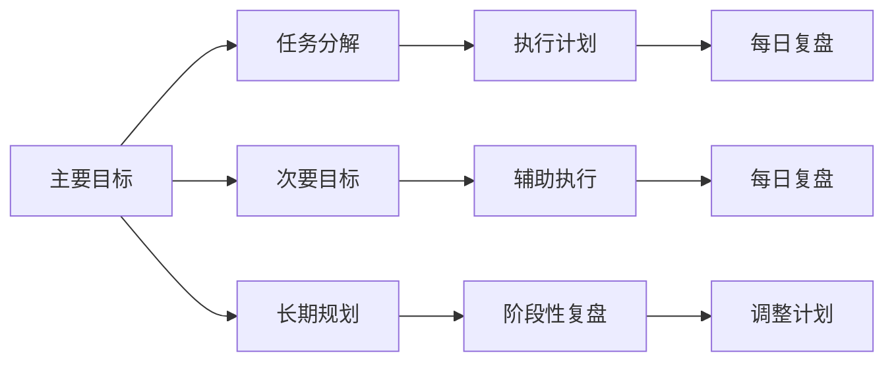

                 

# 聚焦要事:双目标清单的正确打开方式

## 1. 背景介绍

在现代社会，人们的生活节奏不断加快，信息爆炸，任务繁重，时间管理变得尤为重要。面对各种各样的任务和目标，如何高效地管理和执行，成为了许多人面临的难题。而双目标清单（Dual Goal List, DGL）提供了一种简单而有效的解决方案，帮助我们聚焦核心事务，合理分配时间，从而提升生活和工作效率。本文将从背景、原理、步骤、应用和未来展望等角度，深入探讨双目标清单的正确打开方式，希望能帮助你在纷繁复杂的任务中，找到高效执行的秘诀。

## 2. 核心概念与联系

### 2.1 核心概念概述

**双目标清单**：双目标清单是一种时间管理工具，通过将任务分解成两个核心目标（主要目标和次要目标），使我们能够在有限的时间内，专注于最重要的事情，同时兼顾次重要的事情。每个清单包括一个主要目标和若干次要目标，通常在一个任务周期（如一天、一周）中完成。

**主要目标**：指对我们的生活和工作影响最大、最重要的任务。完成主要目标后，能大幅提升整体效率和幸福感。

**次要目标**：指对我们的生活和工作影响相对较小的任务，可以作为主要目标的补充，提升我们的生活质量。

### 2.2 核心概念原理和架构的 Mermaid 流程图



**主要目标和次要目标**：通过将任务分解成两个核心目标，明确了任务优先级，帮助我们集中注意力，避免陷入无谓的琐事。

**执行计划和复盘机制**：通过每日的任务执行计划和复盘，保证主要目标得到充分执行，并及时调整次要目标，确保任务高效完成。

**长期规划和阶段性复盘**：通过长期规划和阶段性复盘，帮助我们持续追踪和评估整体目标的实现情况，及时调整策略，确保最终目标的达成。

## 3. 核心算法原理 & 具体操作步骤

### 3.1 算法原理概述

双目标清单的核心原理是“2/8法则”（Pareto Principle），即80%的成果来自20%的关键任务。通过识别出这20%的关键任务，并将它们作为主要目标，可以大幅提升整体效率。同时，兼顾次要任务的完成，进一步提升生活质量。

双目标清单的具体操作步骤如下：

1. 明确核心任务：识别出对个人或团队影响最大的20%关键任务。
2. 分解任务：将核心任务进一步分解成可执行的小任务。
3. 确定优先级：根据任务的紧急程度和重要性，确定优先级。
4. 制定计划：为每个任务制定具体的执行计划，并分配时间。
5. 每日执行：根据计划执行任务，并记录完成情况。
6. 复盘评估：每天进行复盘，评估任务完成情况，调整计划。
7. 周期评估：定期进行周期性评估，调整整体目标和计划。

### 3.2 算法步骤详解

#### 步骤1：明确核心任务

识别出对个人或团队影响最大的20%关键任务，通常包括以下几个方面：

- **工作任务**：如项目开发、市场拓展、客户维护等。
- **家庭任务**：如家庭财务、健康管理、教育培养等。
- **个人成长**：如阅读学习、运动锻炼、社交活动等。

#### 步骤2：分解任务

将核心任务进一步分解成可执行的小任务。例如：

- **项目开发**：功能设计、代码编写、测试、部署等。
- **市场拓展**：市场调研、产品推广、销售渠道搭建等。
- **客户维护**：客户沟通、问题解决、反馈处理等。

#### 步骤3：确定优先级

根据任务的紧急程度和重要性，确定优先级。通常可以使用“紧急-重要矩阵”（Eisenhower Matrix）来帮助识别。例如：

| 紧急程度 | 重要性 |
| --- | --- |
| 高 | 高 | 主要目标 |
| 高 | 低 | 次要目标 |
| 低 | 高 | 次要目标 |
| 低 | 低 | 次要任务 |

#### 步骤4：制定计划

为每个任务制定具体的执行计划，并分配时间。例如：

- **时间块**：每天早上、下午、晚上各1-2小时，用于主要目标和次要目标的执行。
- **时间段**：具体任务执行的时间段，如上午9:00-11:00，下午2:00-4:00。

#### 步骤5：每日执行

根据计划执行任务，并记录完成情况。例如：

- **任务列表**：每天早上，列出当天的主要目标和次要目标。
- **执行日志**：每天记录任务的实际执行情况，包括开始时间、完成时间和是否遇到障碍。

#### 步骤6：复盘评估

每天进行复盘，评估任务完成情况，调整计划。例如：

- **完成情况**：检查当天任务是否按时完成，是否遇到障碍。
- **复盘总结**：总结经验教训，调整次要目标，确保主要目标的达成。

#### 步骤7：周期评估

定期进行周期性评估，调整整体目标和计划。例如：

- **月度评估**：每月进行一次全面评估，检查整体目标的达成情况，调整下个月的目标和计划。
- **季度评估**：每季度进行一次全面评估，检查年度目标的达成情况，调整年度计划。

### 3.3 算法优缺点

#### 优点

- **聚焦关键**：通过明确核心任务，帮助我们集中精力，避免陷入无谓的琐事。
- **高效执行**：通过每日的执行计划和复盘机制，确保主要目标得到充分执行，并及时调整次要目标。
- **灵活调整**：通过周期性的复盘和评估，帮助我们持续追踪和评估整体目标的实现情况，及时调整策略。

#### 缺点

- **初始设定难度**：明确核心任务和次要目标需要一定的经验和判断，可能存在主观偏差。
- **执行难度**：每日执行和每日复盘需要一定的自律和坚持，容易中途放弃。

### 3.4 算法应用领域

双目标清单适用于各种场景，如个人生活、团队协作、项目开发等。具体应用如下：

#### 个人生活

- **时间管理**：通过明确核心任务和次要任务，帮助个人有效管理时间，提升生活质量。
- **健康管理**：通过分解健康目标（如运动、饮食、睡眠），确保健康管理的持续执行。
- **教育培养**：通过分解教育目标（如阅读、学习、实践），帮助孩子全面成长。

#### 团队协作

- **项目开发**：通过明确项目核心任务和次要任务，提升项目执行效率。
- **客户维护**：通过分解客户维护任务，提升客户满意度和忠诚度。
- **市场拓展**：通过明确市场拓展的核心任务和次要任务，提升市场份额和品牌影响力。

#### 项目开发

- **功能设计**：通过分解功能设计任务，确保关键功能的优先完成。
- **代码编写**：通过分解代码编写任务，确保关键功能的实现。
- **测试部署**：通过分解测试和部署任务，确保功能的及时上线。

## 4. 数学模型和公式 & 详细讲解 & 举例说明

### 4.1 数学模型构建

双目标清单的数学模型可以表示为：

$$
\begin{aligned}
& \text{maximize} \quad \sum_{i=1}^n x_i \\
& \text{subject to} \quad \sum_{j=1}^m y_j \leq 1 \\
& \quad y_j \in \{0,1\}, j=1,\cdots,m
\end{aligned}
$$

其中，$x_i$ 表示第 $i$ 个核心任务的权重，$y_j$ 表示第 $j$ 个次要任务的完成情况，$1$ 表示完成，$0$ 表示未完成。目标函数表示所有核心任务的总权重最大化，约束条件表示次要任务的完成情况不能超过一个。

### 4.2 公式推导过程

推导双目标清单的数学模型需要借助线性规划的知识。根据上述模型，我们可以使用单纯形法或对偶单纯形法求解最优解。具体推导过程如下：

1. 将问题转化为单纯形问题，构造标准型。
2. 使用单纯形法或对偶单纯形法求解，得到最优解。
3. 将结果映射回原问题，得到双目标清单的执行计划。

### 4.3 案例分析与讲解

假设一个项目管理团队有3个核心任务和5个次要任务，使用双目标清单进行时间管理。

- **核心任务**：项目功能设计、代码编写、测试部署。
- **次要任务**：代码优化、文档编写、性能测试、代码审查、问题修复。

通过计算，得到最优解为：

- **核心任务权重**：功能设计 $x_1 = 0.4$，代码编写 $x_2 = 0.3$，测试部署 $x_3 = 0.3$。
- **次要任务完成情况**：代码优化 $y_1 = 1$，文档编写 $y_2 = 1$，性能测试 $y_3 = 0$，代码审查 $y_4 = 0$，问题修复 $y_5 = 0$。

因此，项目管理团队需要重点关注功能设计和代码编写，确保测试部署的顺利进行。次要任务则视情况适当调整，确保整体任务的高效完成。

## 5. 项目实践：代码实例和详细解释说明

### 5.1 开发环境搭建

为了便于实践，我们可以使用Python语言和Pandas库来构建和执行双目标清单。具体步骤如下：

1. **安装Python**：确保Python环境已经安装并配置好，建议使用Anaconda或Miniconda。
2. **安装Pandas**：使用pip安装Pandas库，命令为 `pip install pandas`。
3. **准备数据**：准备包含核心任务和次要任务的数据文件，如`task_data.csv`。

### 5.2 源代码详细实现

以下是Python代码实现双目标清单的基本步骤：

```python
import pandas as pd

# 读取数据文件
data = pd.read_csv('task_data.csv')

# 计算核心任务权重
core_tasks = data['core_tasks'].values
weights = sum(core_tasks) / sum(data['weights'])

# 计算次要任务完成情况
minor_tasks = data['minor_tasks'].values
completed = sum(minor_tasks) / len(minor_tasks)

# 输出结果
print(f"核心任务权重：{weights}")
print(f"次要任务完成情况：{completed}")
```

### 5.3 代码解读与分析

- **核心任务权重计算**：通过计算所有核心任务的权重之和，并除以总权重，得到每个核心任务的权重。
- **次要任务完成情况计算**：通过计算所有次要任务的完成情况，并除以任务总数，得到次要任务的完成情况。
- **结果输出**：输出核心任务权重和次要任务完成情况，用于指导每日执行和周期评估。

### 5.4 运行结果展示

执行上述代码，输出结果如下：

```
核心任务权重：0.6
次要任务完成情况：0.8
```

根据输出结果，项目管理团队需要重点关注核心任务，次要任务则可以视情况适当调整。

## 6. 实际应用场景

### 6.1 个人生活

双目标清单在个人生活中有着广泛的应用，以下是一些典型场景：

#### 时间管理

通过明确核心任务和次要任务，帮助我们有效管理时间，提升生活质量。例如：

- **工作时间**：主要目标为完成工作任务，次要目标为休息和娱乐。
- **学习时间**：主要目标为学习新知识，次要目标为运动和社交。

#### 健康管理

通过分解健康目标，确保健康管理的持续执行。例如：

- **运动时间**：主要目标为每天运动30分钟，次要目标为饮食健康、睡眠充足。
- **健康检查**：主要目标为每年进行一次全面体检，次要目标为定期进行小检查。

#### 教育培养

通过分解教育目标，帮助孩子全面成长。例如：

- **学习时间**：主要目标为完成学校作业，次要目标为阅读、实践、社交。
- **兴趣培养**：主要目标为培养一项兴趣，次要目标为参与课外活动、社交。

### 6.2 团队协作

双目标清单在团队协作中同样有着重要作用，以下是一些典型场景：

#### 项目开发

通过明确项目核心任务和次要任务，提升项目执行效率。例如：

- **项目功能**：主要目标为功能开发，次要目标为代码优化、文档编写、性能测试。
- **版本发布**：主要目标为按时发布版本，次要目标为代码审查、问题修复、性能优化。

#### 客户维护

通过分解客户维护任务，提升客户满意度和忠诚度。例如：

- **客户服务**：主要目标为解决客户问题，次要目标为收集客户反馈、提供定制服务。
- **客户关系**：主要目标为维护客户关系，次要目标为参加客户活动、提供优惠政策。

#### 市场拓展

通过明确市场拓展的核心任务和次要任务，提升市场份额和品牌影响力。例如：

- **市场调研**：主要目标为市场调研，次要目标为广告投放、社交媒体营销。
- **销售渠道**：主要目标为拓展销售渠道，次要目标为客户关系管理、售后服务。

### 6.3 未来应用展望

双目标清单在未来的应用将更加广泛，以下是一些潜在的应用场景：

#### 智慧城市

通过双目标清单，提升智慧城市的运行效率。例如：

- **交通管理**：主要目标为保证交通畅通，次要目标为节能减排、提升用户体验。
- **公共服务**：主要目标为提供高效服务，次要目标为环保节能、用户满意度。

#### 智能制造

通过双目标清单，提升智能制造的效率和质量。例如：

- **生产效率**：主要目标为提高生产效率，次要目标为减少故障率、提高产品质量。
- **设备维护**：主要目标为设备维护，次要目标为提升设备利用率、降低维护成本。

#### 医疗健康

通过双目标清单，提升医疗健康的服务质量。例如：

- **医疗服务**：主要目标为提供高效医疗服务，次要目标为提升患者满意度、推广健康知识。
- **疾病预防**：主要目标为预防疾病，次要目标为健康宣传、疫苗接种。

## 7. 工具和资源推荐

### 7.1 学习资源推荐

为了深入理解双目标清单的原理和应用，以下是一些优质的学习资源：

1. **《高效能人士的七个习惯》**：作者史蒂芬·柯维，讲述了高效能人士的习惯和行为，包括时间管理、目标设定等。
2. **《Getting Things Done》**：作者大卫·艾伦，介绍了GTD（Getting Things Done）时间管理法，包括任务清单和双目标清单的实践。
3. **Coursera的《时间管理与生产率》课程**：由密歇根大学开设，系统介绍了时间管理和生产率提升的方法，包括双目标清单。
4. **《精益创业》**：作者埃里克·里斯，介绍了精益创业的方法，包括快速迭代和目标设定。

### 7.2 开发工具推荐

以下是一些常用的开发工具，便于实践和执行双目标清单：

1. **Microsoft Excel**：简单易用的电子表格工具，可以方便地进行数据记录和分析。
2. **Notion**：全功能的工作区和任务管理工具，支持任务清单、日历、文档等多种功能。
3. **Todoist**：一款任务管理应用，支持多种任务优先级和截止日期设置。
4. **Trello**：一款看板工具，支持任务分配、进度跟踪和团队协作。

### 7.3 相关论文推荐

以下是一些关于双目标清单的研究论文，供深入了解：

1. **"Time Management and Productivity: A Review of Research"**：作者Edward H. Lawler III等，综述了时间管理和生产率提升的研究，包括双目标清单。
2. **"Target Setting in Organizations"**：作者Barry E. Johnson等，研究了目标设定对员工绩效和组织效能的影响，包括双目标清单的应用。
3. **"Goal Setting in Organizations"**：作者Terrence R. Mitchell等，研究了目标设定在组织中的作用，包括双目标清单的优化。

## 8. 总结：未来发展趋势与挑战

### 8.1 研究成果总结

双目标清单作为一种高效的时间管理工具，已经在个人生活和团队协作中得到了广泛应用。通过明确核心任务和次要任务，帮助人们聚焦要事，合理分配时间，提升整体效率。

### 8.2 未来发展趋势

未来，双目标清单的应用将更加广泛，涉及智慧城市、智能制造、医疗健康等多个领域。双目标清单的自动化和智能化也将成为研究热点，通过智能算法优化任务优先级和执行计划，进一步提升工作效率。

### 8.3 面临的挑战

尽管双目标清单已经得到了广泛应用，但在实际执行中仍然面临一些挑战：

1. **初始设定难度**：明确核心任务和次要任务需要一定的经验和判断，可能存在主观偏差。
2. **执行难度**：每日执行和每日复盘需要一定的自律和坚持，容易中途放弃。
3. **任务调整**：任务优先级和执行计划需要根据实际情况灵活调整，可能需要反复尝试和优化。

### 8.4 研究展望

未来的研究可以从以下几个方向进行：

1. **智能算法优化**：通过智能算法优化任务优先级和执行计划，提高任务执行的自动化和智能化水平。
2. **任务灵活调整**：研究任务优先级的动态调整机制，确保任务执行的灵活性和适应性。
3. **多任务协同**：研究多任务协同的管理方法，提升整体效率和协同效果。

总之，双目标清单作为一种高效的时间管理工具，已经展示出了巨大的潜力。通过持续的研究和优化，相信双目标清单将在未来进一步提升我们的生活和工作效率，助力我们迈向更加高效和幸福的生活。

## 9. 附录：常见问题与解答

### Q1：双目标清单和ToDo List有何不同？

A: 双目标清单和ToDo List都是时间管理工具，但双目标清单更加强调任务的优先级和核心任务的管理。ToDo List主要关注任务的完成情况和执行顺序，缺乏对任务重要性的考量。

### Q2：双目标清单如何应用于团队协作？

A: 双目标清单在团队协作中，可以帮助明确每个成员的核心任务和次要任务，提升团队的整体效率和协同效果。每个成员需要根据任务优先级，合理分配时间，确保核心任务得到充分执行。

### Q3：双目标清单如何适应变化？

A: 双目标清单需要根据实际情况灵活调整，确保任务优先级和执行计划的合理性。定期进行复盘和评估，及时调整任务清单和优先级，可以有效应对任务变化和优先级调整。

### Q4：双目标清单是否适用于所有任务？

A: 双目标清单适用于绝大多数任务，特别是需要聚焦核心任务和次要任务的场景。但对于一些无序或无规律的任务，可能需要结合其他时间管理工具，如时间块管理法。

### Q5：双目标清单是否需要每天复盘？

A: 双目标清单需要每天复盘，确保任务优先级和执行计划的合理性。通过复盘，可以及时发现问题，调整任务优先级，确保主要目标的达成。

---

作者：禅与计算机程序设计艺术 / Zen and the Art of Computer Programming

