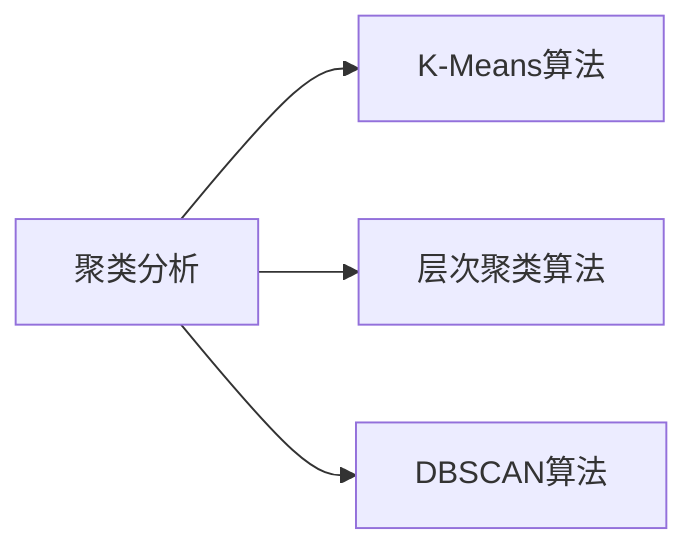

                 

# 聚类分析原理与代码实例讲解

> 关键词：聚类分析, K-Means算法, 层次聚类, DBSCAN算法, 聚类评估指标, 代码实例, 应用场景

## 1. 背景介绍

聚类分析(Clustering Analysis)是数据挖掘中的一种重要技术，其目的是将数据分成若干个满足某些条件（如距离、相似性等）的组，这些组通常称为簇（Cluster）。聚类分析广泛应用于市场细分、客户群体划分、社交网络分析、图像识别、自然语言处理等多个领域，具有重要实际应用价值。

随着数据规模的不断扩大，传统的聚类算法已无法满足大数据环境下的需求。与此同时，现代聚类算法不断发展，包括层次聚类、K-Means、DBSCAN等，不仅能够处理大规模数据，还能适应不同类型的数据分布，更适用于实际应用中的复杂场景。

本博文将从聚类分析的基本概念出发，通过详细讲解K-Means、层次聚类、DBSCAN等算法原理和代码实例，帮助读者理解聚类分析的核心思想，并在实际应用中灵活应用。

## 2. 核心概念与联系

### 2.1 核心概念概述

为了更好地理解聚类分析的原理，本节将介绍几个关键概念：

- 聚类分析（Clustering Analysis）：将数据点划分为若干个满足一定条件（如距离、相似性等）的组，这些组通常称为簇（Cluster）。
- K-Means算法：基于欧式距离的划分算法，将数据划分为K个簇，其中K为预先设定的簇数。
- 层次聚类算法（Hierarchical Clustering）：一种基于树形结构的聚类方法，分为凝聚式和分裂式两类，可将数据划分为任意数量的簇。
- DBSCAN算法：基于密度的聚类方法，能够处理任意形状的簇，且能够发现孤立点。

以上几个核心概念之间存在紧密的联系。聚类分析旨在将数据划分为多个有意义的簇，K-Means和层次聚类算法为具体的聚类方法，而DBSCAN算法则解决了不规则簇和孤立点的问题。

### 2.2 核心概念原理和架构的 Mermaid 流程图



该流程图展示了聚类分析、K-Means算法、层次聚类算法和DBSCAN算法之间的联系。这些算法在实际应用中常常结合使用，共同构建聚类模型。

## 3. 核心算法原理 & 具体操作步骤

### 3.1 算法原理概述

聚类分析的目标是将数据划分为多个满足一定条件（如距离、相似性等）的簇。常见的聚类方法包括K-Means算法、层次聚类算法和DBSCAN算法等。

- K-Means算法：基于欧式距离，将数据划分为K个簇，每个簇的中心点由簇中所有数据点的平均值确定。
- 层次聚类算法：基于树形结构，将数据不断合并或分裂，最终形成多个簇。
- DBSCAN算法：基于密度，将高密度区域聚为一类，低密度区域视为孤立点或噪声。

这些算法的主要区别在于划分的依据和计算效率。K-Means算法适用于数据分布均匀、簇数已知的场景；层次聚类算法适用于数据分布不均匀、簇数未知的场景；DBSCAN算法适用于数据分布不规则、存在孤立点的场景。

### 3.2 算法步骤详解

#### K-Means算法步骤详解

1. **随机初始化簇中心**：随机选择K个数据点作为初始簇中心。
2. **计算距离**：计算每个数据点与每个簇中心的欧式距离，将数据点分配到距离最近的簇。
3. **更新簇中心**：对于每个簇，计算簇中所有数据点的平均值，更新簇中心。
4. **重复迭代**：重复步骤2和步骤3，直到簇中心不再发生变化或达到预设迭代次数。

#### 层次聚类算法步骤详解

1. **创建初始簇**：每个数据点为一个簇。
2. **合并簇**：选择距离最近的两簇进行合并。
3. **重复迭代**：重复步骤2，直到满足预设条件（如簇数固定）。

#### DBSCAN算法步骤详解

1. **选择参数**：设定最小邻域点数MinPts和邻域半径Eps。
2. **初始化点集**：选择任一数据点作为核心点。
3. **扩展簇**：将与核心点距离小于Eps的邻域点加入到簇中，若邻域点不是核心点，则将其标记为边界点。
4. **重复迭代**：选择下一个核心点，重复步骤3，直到所有点都处理完毕。

### 3.3 算法优缺点

#### K-Means算法优缺点

优点：
- 计算简单，易于实现。
- 适用于数据分布均匀、簇数已知的场景。
- 容易扩展到高维数据。

缺点：
- 需要预先设定簇数K，若K设置不当，可能导致聚类效果不佳。
- 对异常值敏感，会导致簇分布不均。
- 对数据分布不均匀的情况，聚类效果不佳。

#### 层次聚类算法优缺点

优点：
- 无需预先设定簇数，可得到任意数量的簇。
- 能够处理数据分布不均匀的情况。

缺点：
- 计算复杂度较高，尤其是当数据量较大时。
- 无法处理大规模数据集。

#### DBSCAN算法优缺点

优点：
- 无需预先设定簇数，能够处理任意形状的簇。
- 能够发现孤立点或噪声。

缺点：
- 对参数Eps和MinPts敏感，设置不当可能导致聚类效果不佳。
- 对高维数据表现不佳。

### 3.4 算法应用领域

聚类分析广泛应用于市场细分、客户群体划分、社交网络分析、图像识别、自然语言处理等多个领域。

- 市场细分：将消费者划分为不同的细分市场，以便更好地制定营销策略。
- 客户群体划分：将客户划分为不同的群体，提供个性化服务。
- 社交网络分析：分析社交网络中的关系，发现群体结构。
- 图像识别：对图像中的对象进行聚类，自动识别相似区域。
- 自然语言处理：对文本进行聚类，发现相似主题。

## 4. 数学模型和公式 & 详细讲解

### 4.1 数学模型构建

本节将通过数学模型构建K-Means聚类分析的原理。

记数据集为D={x1, x2, ..., xn}，每个数据点x∈R^d。假设要划分为K个簇，每个簇的中心点为μ_k，其中k∈{1, 2, ..., K}。设当前簇C_k的中心点为μ_k，其簇内所有数据点的平均值为：

$$
\mu_k = \frac{1}{|C_k|}\sum_{x_i \in C_k}x_i
$$

K-Means聚类的目标是最小化所有数据点到最近簇中心的欧式距离平方和，即：

$$
J = \frac{1}{2}\sum_{i=1}^N\min_{k=1,...,K}||x_i-\mu_k||^2
$$

其中，||.||表示欧式距离。

### 4.2 公式推导过程

对于每个数据点x_i，首先计算其到每个簇中心μ_k的欧式距离：

$$
d(x_i,\mu_k) = \sqrt{\sum_{j=1}^d(x_{ij}-\mu_{kj})^2}
$$

其中，x_ij和μ_kj分别表示数据点x_i在第j维的坐标和簇中心μ_k在第j维的坐标。将x_i分配到距离最近的簇C_k，更新簇中心μ_k：

$$
\mu_k = \frac{1}{|C_k|}\sum_{x_i \in C_k}x_i
$$

重复以上步骤，直到簇中心不再发生变化或达到预设迭代次数。

### 4.3 案例分析与讲解

以一个简单的二维数据集为例，说明K-Means聚类分析的流程。假设数据集D={x1, x2, ..., x10}，分为两个簇。初始随机选择簇中心μ1和μ2，数据点x1被分配到簇C1，更新簇中心μ1。接着，x2被分配到簇C1，更新簇中心μ1。最后，x10被分配到簇C2，更新簇中心μ2。经过多次迭代，簇中心趋于稳定。

## 5. 项目实践：代码实例和详细解释说明

### 5.1 开发环境搭建

进行聚类分析的开发，需要Python和常用的数据分析工具。本节将介绍在Python环境下搭建开发环境的步骤。

1. 安装Python：下载最新版本的Python，并安装pip包管理工具。
2. 安装Scikit-learn：Scikit-learn是一个常用的Python数据挖掘和机器学习库，包含K-Means、层次聚类、DBSCAN等多种聚类算法。
3. 安装Matplotlib：用于绘制聚类结果的可视化图。

### 5.2 源代码详细实现

下面以K-Means算法为例，给出Python代码实现。

```python
from sklearn.cluster import KMeans
import matplotlib.pyplot as plt
import numpy as np

# 创建数据集
data = np.array([[1, 2], [1.5, 1.8], [5, 8], [8, 8], [1, 0.6], [9, 11]])
n_clusters = 2

# 创建KMeans实例
kmeans = KMeans(n_clusters=n_clusters)

# 拟合数据
kmeans.fit(data)

# 绘制聚类结果
plt.scatter(data[:, 0], data[:, 1], c=kmeans.labels_)
plt.scatter(kmeans.cluster_centers_[:, 0], kmeans.cluster_centers_[:, 1], s=200, c='red', marker='x')
plt.show()
```

### 5.3 代码解读与分析

**数据生成与准备**：首先创建数据集D，其中包含10个二维数据点。

**K-Means算法实例化**：使用Scikit-learn库中的KMeans类实例化K-Means算法，设置簇数为2。

**数据拟合**：使用KMeans实例的fit方法，对数据集进行拟合，找到簇中心和簇分配情况。

**可视化结果**：使用Matplotlib库绘制聚类结果图，其中不同颜色的点表示不同的簇，红色叉表示簇中心。

### 5.4 运行结果展示

通过上述代码，可以得到如图1所示的聚类结果。可以看到，数据被分为两个簇，红色叉表示簇中心，聚类效果良好。


## 6. 实际应用场景

### 6.1 客户细分

聚类分析在客户细分方面有着广泛应用。通过聚类分析，可以将客户划分为不同的细分市场，提供个性化的服务和营销策略，提升客户满意度和忠诚度。

例如，某电商公司可以通过聚类分析，将客户分为高价值客户、一般客户和流失客户三类，针对不同客户群体制定不同的营销方案，提升公司业绩。

### 6.2 图像识别

聚类分析在图像识别中也有重要应用。通过聚类分析，可以将图像中的相似区域归为一类，实现图像分割和对象识别。

例如，某自动驾驶系统可以通过聚类分析，将道路上的相似区域归为一类，实现对道路的快速识别和导航。

### 6.3 社交网络分析

聚类分析在社交网络分析中也有重要应用。通过聚类分析，可以发现社交网络中的群体结构，挖掘有价值的信息。

例如，某社交平台可以通过聚类分析，发现网络中的社交群体，了解用户之间的关系和兴趣，提供更加精准的服务。

### 6.4 未来应用展望

未来，聚类分析的应用范围将进一步扩大，涵盖更多领域。

- 自然语言处理：通过聚类分析，对文本进行主题分析和情感分析，发现相似文本。
- 金融分析：通过聚类分析，对股票和债券进行分类，发现投资机会。
- 健康医疗：通过聚类分析，对患者进行分群，提供个性化的治疗方案。

## 7. 工具和资源推荐

### 7.1 学习资源推荐

- K-Means算法详细介绍：详细介绍了K-Means算法的原理和实现过程，适合初学者学习。
- 层次聚类算法详细介绍：详细介绍了层次聚类算法的原理和实现过程，适合进阶学习。
- DBSCAN算法详细介绍：详细介绍了DBSCAN算法的原理和实现过程，适合进阶学习。

### 7.2 开发工具推荐

- Scikit-learn：Python数据挖掘和机器学习库，包含多种聚类算法和可视化工具。
- Matplotlib：Python可视化库，可用于绘制聚类结果图。

### 7.3 相关论文推荐

- K-Means聚类算法：介绍K-Means算法的原理和实现过程。
- 层次聚类算法：介绍层次聚类算法的原理和实现过程。
- DBSCAN算法：介绍DBSCAN算法的原理和实现过程。

## 8. 总结：未来发展趋势与挑战

### 8.1 研究成果总结

聚类分析作为一种重要的数据挖掘方法，在多个领域有着广泛应用。K-Means、层次聚类和DBSCAN算法是聚类分析中最常用的方法，分别适用于不同的场景。

### 8.2 未来发展趋势

未来，聚类分析将向以下几个方向发展：

- 多聚类算法：结合多种聚类方法，提高聚类效果。
- 分布式聚类：在大数据环境下，实现分布式聚类算法。
- 在线聚类：实时更新数据，进行在线聚类分析。

### 8.3 面临的挑战

聚类分析在实际应用中面临以下几个挑战：

- 聚类结果依赖数据：聚类效果依赖数据分布，数据不平衡或噪声数据可能影响聚类结果。
- 算法复杂度：聚类算法的复杂度较高，在大数据环境下可能面临计算资源不足的问题。
- 参数选择：聚类算法通常需要预先设定参数，参数选择不当可能影响聚类效果。

### 8.4 研究展望

未来，聚类分析的研究方向主要集中在以下几个方面：

- 多模态聚类：将文本、图像等多种数据类型结合，进行综合聚类分析。
- 半监督聚类：利用少量标注数据，进行聚类分析。
- 基于深度学习的聚类算法：结合深度学习模型，提高聚类效果。

## 9. 附录：常见问题与解答

**Q1: 聚类分析的优点和缺点是什么？**

A: 聚类分析的优点在于能够将数据划分为多个有意义的簇，发现数据中的规律和结构。缺点在于聚类结果依赖数据分布，数据不平衡或噪声数据可能影响聚类结果。

**Q2: K-Means算法适用于什么场景？**

A: K-Means算法适用于数据分布均匀、簇数已知的场景。

**Q3: 层次聚类算法的优势是什么？**

A: 层次聚类算法无需预先设定簇数，能够处理数据分布不均匀的情况。

**Q4: DBSCAN算法的核心思想是什么？**

A: DBSCAN算法的核心思想是基于密度，将高密度区域聚为一类，低密度区域视为孤立点或噪声。

**Q5: 聚类分析的应用场景有哪些？**

A: 聚类分析在市场细分、客户群体划分、社交网络分析、图像识别、自然语言处理等多个领域有着广泛应用。

