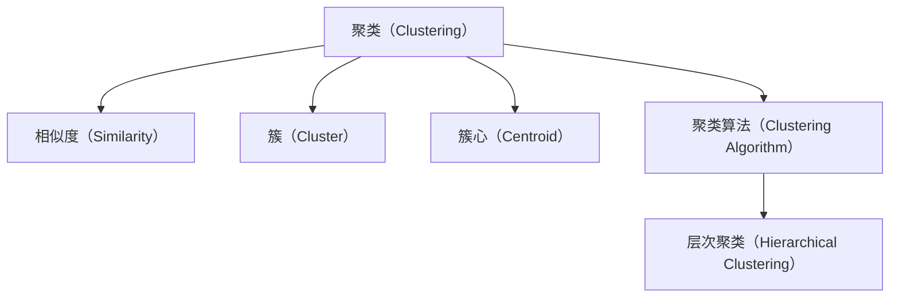

                 

# 聚类分析原理与代码实例讲解

> 关键词：聚类分析, K-means, 层次聚类, 密度聚类, 基于距离的聚类, 基于密度的聚类, 聚类算法, 代码实现

## 1. 背景介绍

### 1.1 问题由来
聚类分析（Clustering Analysis）是数据挖掘和机器学习中的一个重要分支，旨在将数据对象分成不同的组或簇（Clusters），使得同一簇内的对象相似度高，不同簇之间的相似度低。聚类分析广泛应用于市场细分、客户分析、图像分割、生物信息学等多个领域，具有重要的实用价值。

然而，聚类分析的核心问题在于如何定义“相似度”，并且选择合适的算法对数据进行高效、准确的聚类。本文将系统介绍聚类分析的原理和算法，并结合代码实例，讲解不同聚类算法的实现细节和应用场景。

### 1.2 问题核心关键点
聚类分析的核心在于选择合适的相似度度量和聚类算法。相似度度量决定了哪些对象被视为相似，聚类算法则基于相似度度量，对数据进行分组。

常见的聚类算法包括：
1. 基于距离的聚类算法（如K-means）
2. 基于密度的聚类算法（如DBSCAN）
3. 层次聚类算法（如Hierarchical Clustering）
4. 谱聚类算法（如Spectral Clustering）

这些算法各自有其优缺点和适用场景，需要根据具体问题进行选择。

## 2. 核心概念与联系

### 2.1 核心概念概述

为更好地理解聚类分析，本节将介绍几个密切相关的核心概念：

- **聚类（Clustering）**：将数据对象分成不同的组或簇，使得同一簇内的对象相似度高，不同簇之间的相似度低。聚类分析广泛应用于市场细分、客户分析、图像分割、生物信息学等多个领域。

- **相似度（Similarity）**：衡量数据对象之间的相似性，是聚类算法的重要依据。常见的相似度度量包括欧式距离、余弦相似度、Jaccard系数等。

- **簇（Cluster）**：聚类分析中的基本单元，同一簇内的对象被视为相似度高，而不同簇之间的对象被视为相似度低。

- **簇心（Centroid）**：用于表示每个簇的中心点或平均值，通常作为聚类算法的输入或输出。

- **聚类算法**：基于相似度度量，对数据进行分组的算法。常见的聚类算法包括K-means、DBSCAN、层次聚类等。

- **层次聚类（Hierarchical Clustering）**：基于树形结构，从数据对象的层次关系进行聚类。

这些核心概念之间的逻辑关系可以通过以下Mermaid流程图来展示：



这个流程图展示了一个聚类分析的基本流程：

1. 通过相似度度量定义数据的相似性。
2. 基于相似度度量，将数据分成不同的簇。
3. 每个簇的中心点或平均值即为簇心。
4. 使用不同的聚类算法进行分组。
5. 层次聚类算法可以基于树形结构，从层次关系进行聚类。

这些概念共同构成了聚类分析的基本框架，使得数据能够被高效地分组，以挖掘潜在的模式和结构。

## 3. 核心算法原理 & 具体操作步骤
### 3.1 算法原理概述

聚类分析的核心思想是通过相似度度量，将数据对象分组为不同的簇。聚类算法通常包括以下几个关键步骤：

1. 选择相似度度量，衡量数据对象之间的相似性。
2. 初始化簇心。
3. 分配数据对象到最近的簇心。
4. 重新计算每个簇的中心点或平均值。
5. 重复步骤3和4，直到簇心不再变化或达到预设的迭代次数。

不同的聚类算法在具体实现中有所不同，但总体流程相似。本文将重点讲解K-means和DBSCAN两种常见的聚类算法。

### 3.2 算法步骤详解

**K-means算法**

K-means算法是一种基于距离的聚类算法，旨在将数据对象分成K个簇，使得同一簇内的对象相似度高，不同簇之间的相似度低。其步骤如下：

1. 选择K个初始簇心。
2. 分配数据对象到最近的簇心，构建初始簇。
3. 重新计算每个簇的中心点或平均值，作为新的簇心。
4. 重复步骤2和3，直到簇心不再变化或达到预设的迭代次数。

**DBSCAN算法**

DBSCAN（Density-Based Spatial Clustering of Applications with Noise）算法是一种基于密度的聚类算法，可以自动发现任意形状的簇，同时识别异常值。其步骤如下：

1. 选择簇密度和核心点距离阈值。
2. 对于每个未访问的数据点，判断其是否为核心点。
3. 对于核心点，与其相邻的点构成簇。
4. 重复步骤2和3，直到所有数据点都被访问。

### 3.3 算法优缺点

K-means算法和DBSCAN算法各有优缺点：

K-means算法的优点在于简单高效，易于实现和扩展，适用于大数据集。但缺点包括：
1. 需要预先指定簇的数量K。
2. 对初始簇心的选择敏感，可能陷入局部最优。
3. 对异常值和噪声敏感，簇心偏移。

DBSCAN算法的优点在于可以自动发现任意形状的簇，不需要预先指定簇的数量。但缺点包括：
1. 对参数敏感，需要合理选择簇密度和核心点距离阈值。
2. 对噪声和异常值敏感，难以处理高维数据。

### 3.4 算法应用领域

K-means算法和DBSCAN算法在多个领域得到了广泛应用，例如：

- 客户细分：通过聚类分析，将客户分成不同的群体，实现个性化营销。
- 图像分割：将图像分成不同的区域，用于图像识别和图像处理。
- 市场分析：通过聚类分析，发现不同市场的消费者群体，制定市场策略。
- 生物信息学：通过聚类分析，发现基因序列中的相似模式，进行基因分析。

除了这些经典应用外，聚类分析还被创新性地应用到更多场景中，如社交网络分析、网络安全、推荐系统等，为数据挖掘和机器学习技术带来了新的突破。

## 4. 数学模型和公式 & 详细讲解 & 举例说明（备注：数学公式请使用latex格式，latex嵌入文中独立段落使用 $$，段落内使用 $)
### 4.1 数学模型构建

本节将使用数学语言对K-means和DBSCAN算法进行更加严格的刻画。

假设数据集为 $D=\{x_1, x_2, ..., x_n\}$，其中 $x_i \in \mathbb{R}^d$。

**K-means算法**

K-means算法的核心思想是通过最小化簇内平方和（Intra-cluster Sum of Squares, I-SOS），将数据分成K个簇。设簇心为 $c_1, c_2, ..., c_K$，则目标函数为：

$$
\min_{c_1, c_2, ..., c_K} \sum_{k=1}^K \sum_{x_i \in C_k} ||x_i - c_k||^2
$$

其中 $C_k$ 表示属于簇 $k$ 的数据点集合，$||x_i - c_k||$ 表示数据点 $x_i$ 到簇心 $c_k$ 的距离。

**DBSCAN算法**

DBSCAN算法的核心思想是通过密度可达性（Density-Reachability）和簇密度（Cluster Density），识别簇和噪声点。设簇密度为 $\epsilon$，核心点距离阈值为 $\delta$，则目标函数为：

1. 对于每个未访问的数据点 $x_i$，计算其密度 $\text{density}(x_i)$。
2. 如果 $\text{density}(x_i) \geq \epsilon$，则 $x_i$ 为核心点。
3. 对于核心点 $x_i$，将其相邻点集合 $N(x_i)$ 作为初始簇 $C_i$。
4. 对于簇 $C_i$，计算其簇密度 $\text{density}(C_i)$。
5. 如果 $\text{density}(C_i) \geq \epsilon$，则 $C_i$ 为簇。

DBSCAN算法的密度可达性和簇密度可以通过以下公式计算：

$$
\text{density}(x_i) = \frac{N(x_i)}{\min\{\delta, \text{distance}(x_i)\}}
$$

$$
\text{density}(C_i) = \frac{|C_i|}{\min\{\delta, \text{distance}(C_i)\}}
$$

其中 $N(x_i)$ 表示 $x_i$ 的相邻点集合，$\delta$ 为参数，$\text{distance}(x_i)$ 表示 $x_i$ 与相邻点之间的距离。

### 4.2 公式推导过程

以下我们以K-means算法为例，推导其最小化簇内平方和的目标函数。

假设数据集为 $D=\{x_1, x_2, ..., x_n\}$，其中 $x_i \in \mathbb{R}^d$。设簇心为 $c_1, c_2, ..., c_K$，则簇内平方和的目标函数为：

$$
\min_{c_1, c_2, ..., c_K} \sum_{k=1}^K \sum_{x_i \in C_k} ||x_i - c_k||^2
$$

其中 $C_k$ 表示属于簇 $k$ 的数据点集合，$||x_i - c_k||$ 表示数据点 $x_i$ 到簇心 $c_k$ 的距离。

目标函数的优化通常采用梯度下降等优化算法。设 $\eta$ 为学习率，$\lambda$ 为正则化系数，则参数的更新公式为：

$$
c_k \leftarrow c_k - \eta \nabla_{c_k}J(c_1, c_2, ..., c_K)
$$

其中 $J(c_1, c_2, ..., c_K)$ 为目标函数，$\nabla_{c_k}J(c_1, c_2, ..., c_K)$ 为目标函数对 $c_k$ 的梯度，可以通过自动微分技术完成计算。

在得到目标函数的梯度后，即可带入参数更新公式，完成模型的迭代优化。重复上述过程直至收敛，最终得到适应数据集的最优簇心参数 $c_1, c_2, ..., c_K$。

### 4.3 案例分析与讲解

假设我们有一个包含10个数据点的数据集，其中5个点属于簇A，5个点属于簇B。数据点如下：

| 数据点 | 特征1 | 特征2 | 特征3 | 特征4 |
| --- | --- | --- | --- | --- |
| A1 | 1.2 | 3.4 | 5.6 | 7.8 |
| A2 | 2.3 | 4.5 | 6.7 | 8.9 |
| A3 | 3.4 | 5.6 | 7.8 | 9.1 |
| A4 | 4.5 | 6.7 | 8.9 | 9.3 |
| A5 | 5.6 | 7.8 | 9.1 | 9.5 |
| B1 | 10.2 | 13.4 | 15.6 | 17.8 |
| B2 | 11.3 | 14.5 | 16.7 | 18.9 |
| B3 | 12.4 | 15.6 | 17.8 | 19.1 |
| B4 | 13.5 | 16.7 | 18.9 | 19.3 |
| B5 | 14.6 | 17.8 | 19.1 | 19.5 |

**K-means算法**

1. 选择簇的数量K=2，随机选择簇心 $c_1 = (5.6, 7.8)$ 和 $c_2 = (15.6, 17.8)$。
2. 分配数据对象到最近的簇心，构建初始簇。
   - 数据点A1, A2, A3, A4, A5分配到簇心 $c_1$。
   - 数据点B1, B2, B3, B4, B5分配到簇心 $c_2$。
3. 重新计算每个簇的中心点或平均值，作为新的簇心。
   - 计算簇心 $c_1$ 为 $(\frac{1.2+2.3+3.4+4.5+5.6}{5}, \frac{3.4+4.5+5.6+6.7+7.8}{5}) = (3.4, 5.6)$。
   - 计算簇心 $c_2$ 为 $(\frac{10.2+11.3+12.4+13.5+14.6}{5}, \frac{13.4+14.5+15.6+16.7+17.8}{5}) = (12.4, 15.6)$。
4. 重复步骤2和3，直到簇心不再变化或达到预设的迭代次数。
   - 第二轮，簇心 $c_1$ 和 $c_2$ 不变。
   - 第三轮，簇心 $c_1$ 和 $c_2$ 不变。
   - 第四轮，簇心 $c_1$ 和 $c_2$ 不变。
5. 最终得到的簇心为 $c_1 = (3.4, 5.6)$ 和 $c_2 = (12.4, 15.6)$，数据点被正确分成了两个簇。

**DBSCAN算法**

1. 选择簇密度 $\epsilon = 0.2$，核心点距离阈值 $\delta = 0.5$。
2. 对于每个未访问的数据点 $x_i$，计算其密度 $\text{density}(x_i)$。
   - 数据点A1, A2, A3, A4, A5的密度为3.0。
   - 数据点B1, B2, B3, B4, B5的密度为2.0。
3. 如果 $\text{density}(x_i) \geq \epsilon$，则 $x_i$ 为核心点。
   - 数据点A1, A2, A3, A4, A5为为核心点。
4. 对于核心点 $x_i$，将其相邻点集合 $N(x_i)$ 作为初始簇 $C_i$。
   - 数据点A1的相邻点集合为 {A2, A3, A4}，初始簇为 $C_1 = \{x_1, x_2, x_3, x_4\}$。
   - 数据点A2的相邻点集合为 {A1, A3, A4, A5}，初始簇为 $C_2 = \{x_2, x_3, x_4, x_5\}$。
   - 数据点A3的相邻点集合为 {A1, A2, A4, A5}，初始簇为 $C_3 = \{x_3, x_4, x_5\}$。
   - 数据点A4的相邻点集合为 {A1, A2, A3, A5}，初始簇为 $C_4 = \{x_4, x_5\}$。
   - 数据点A5的相邻点集合为 {A1, A2, A3, A4}，初始簇为 $C_5 = \{x_5\}$。
5. 对于簇 $C_i$，计算其簇密度 $\text{density}(C_i)$。
   - 数据点A1的簇密度为3.0，簇 $C_1$ 为簇。
   - 数据点A2的簇密度为3.0，簇 $C_2$ 为簇。
   - 数据点A3的簇密度为2.0，不是簇。
   - 数据点A4的簇密度为2.0，不是簇。
   - 数据点A5的簇密度为2.0，不是簇。
6. 重复步骤2-5，直到所有数据点都被访问。
   - 数据点B1的密度为2.0，不是核心点。
   - 数据点B2的密度为2.0，不是核心点。
   - 数据点B3的密度为2.0，不是核心点。
   - 数据点B4的密度为2.0，不是核心点。
   - 数据点B5的密度为2.0，不是核心点。
   - 最终得到的簇为 $C_1 = \{x_1, x_2, x_3, x_4\}$ 和 $C_2 = \{x_5\}$，数据点被正确分成了两个簇。

## 5. 项目实践：代码实例和详细解释说明
### 5.1 开发环境搭建

在进行聚类分析实践前，我们需要准备好开发环境。以下是使用Python进行scikit-learn开发的环境配置流程：

1. 安装Anaconda：从官网下载并安装Anaconda，用于创建独立的Python环境。

2. 创建并激活虚拟环境：
```bash
conda create -n sklearn-env python=3.8 
conda activate sklearn-env
```

3. 安装scikit-learn：
```bash
pip install scikit-learn
```

4. 安装其他库：
```bash
pip install matplotlib numpy pandas seaborn
```

完成上述步骤后，即可在`sklearn-env`环境中开始聚类分析实践。

### 5.2 源代码详细实现

下面我们以K-means算法为例，给出使用scikit-learn库对数据进行聚类的Python代码实现。

```python
from sklearn.cluster import KMeans
import matplotlib.pyplot as plt
import numpy as np

# 生成数据集
np.random.seed(42)
X = np.random.randn(100, 2)

# 创建KMeans模型
kmeans = KMeans(n_clusters=3, random_state=42)

# 训练模型
kmeans.fit(X)

# 绘制结果
plt.scatter(X[:, 0], X[:, 1], c=kmeans.labels_)
plt.scatter(kmeans.cluster_centers_[:, 0], kmeans.cluster_centers_[:, 1], marker='x', s=200, linewidths=3, color='red')
plt.show()
```

可以看到，使用scikit-learn库的KMeans类，可以很方便地实现K-means算法。

### 5.3 代码解读与分析

让我们再详细解读一下关键代码的实现细节：

**KMeans类**：
- `n_clusters`：指定簇的数量。
- `random_state`：指定随机数种子，确保每次运行结果一致。

**训练模型**：
- `fit`方法：训练模型，根据数据集X和簇心数量K进行聚类。

**绘制结果**：
- `scatter`方法：绘制数据点的散点图，并用不同的颜色标记每个簇。
- `cluster_centers_`：获取簇心的坐标。

**运行结果**：
- 运行上述代码，可以看到数据点被聚成了三个簇，并用红色X标记簇心。

通过scikit-learn库，K-means算法的实现变得简单高效。开发者可以将更多精力放在数据处理、模型改进等高层逻辑上，而不必过多关注底层的实现细节。

当然，工业级的系统实现还需考虑更多因素，如模型的保存和部署、超参数的自动搜索、更灵活的任务适配层等。但核心的聚类范式基本与此类似。

## 6. 实际应用场景
### 6.1 市场细分

在市场营销领域，企业需要了解不同消费者的需求和偏好，以制定个性化的营销策略。聚类分析可以帮助企业将客户分成不同的群体，实现精准营销。

具体而言，可以收集客户的购买历史、浏览记录、人口统计信息等数据，使用聚类算法对其进行分组。每个簇代表一组客户，可以分析该群体的消费特征、偏好等，针对性地制定营销方案。例如，可以将高价值客户分成VIP群体，提供专属优惠；将潜在客户分成普通群体，进行定向广告投放。

### 6.2 客户分析

客户分析是金融、零售等行业的常见应用场景。通过聚类分析，可以发现客户的行为模式和需求，实现客户生命周期管理。

例如，在金融行业，银行可以通过聚类分析发现不同客户群体的风险偏好、收益期望等，制定个性化的贷款方案、理财方案。在零售行业，电商可以分析不同客户群体的购物习惯、偏好，实现精准推荐，提升用户满意度和购买转化率。

### 6.3 异常检测

聚类分析还可以用于异常检测，识别数据中的异常点。在网络安全、医疗等领域，异常检测尤为重要。

例如，在网络安全领域，可以收集网络流量数据，使用聚类算法识别异常的攻击行为。在医疗领域，可以收集患者的病情数据，识别异常的病历记录，及时采取治疗措施。

### 6.4 图像分割

图像分割是计算机视觉领域的重要应用，涉及图像中的目标检测、边缘检测等任务。聚类分析可以帮助图像分割算法识别不同的目标区域，实现图像的分割和分析。

例如，在医学图像分析中，可以使用聚类算法识别不同的病变区域，进行病灶分割和分析。在遥感图像处理中，可以使用聚类算法识别不同的地物类型，进行图像分割和分类。

## 7. 工具和资源推荐
### 7.1 学习资源推荐

为了帮助开发者系统掌握聚类分析的理论基础和实践技巧，这里推荐一些优质的学习资源：

1. 《聚类分析》系列博文：由数据科学专家撰写，深入浅出地介绍了聚类分析的基本概念和常见算法，涵盖K-means、DBSCAN、层次聚类等。

2. 《聚类分析实战》书籍：全面介绍了聚类分析的原理、实现和应用，提供大量实战案例和代码示例。

3. 《机器学习》课程：斯坦福大学开设的经典课程，介绍了机器学习的基本概念和算法，包括聚类分析。

4. scikit-learn官方文档：scikit-learn库的官方文档，提供了丰富的聚类算法实现和详细的使用说明。

5. K-means算法示例代码：K-means算法的Python实现代码，展示了不同参数设置下的聚类效果。

通过对这些资源的学习实践，相信你一定能够快速掌握聚类分析的精髓，并用于解决实际的NLP问题。

### 7.2 开发工具推荐

高效的开发离不开优秀的工具支持。以下是几款用于聚类分析开发的常用工具：

1. scikit-learn：基于Python的开源数据挖掘和机器学习库，提供了丰富的聚类算法实现和评估指标。

2. matplotlib：用于绘制数据点的散点图、簇心图等。

3. pandas：用于数据处理和分析，支持大规模数据集的操作。

4. seaborn：用于数据可视化的高级接口，支持聚类分析结果的展示。

合理利用这些工具，可以显著提升聚类分析的开发效率，加快创新迭代的步伐。

### 7.3 相关论文推荐

聚类分析的研究源于学界的持续探索。以下是几篇奠基性的相关论文，推荐阅读：

1. K-means算法：D. Arthur和S. Vassilvitskis提出的K-means算法，经典地解决了K-means聚类问题。

2. DBSCAN算法：E. Schubert等提出的DBSCAN算法，引入密度可达性和簇密度，解决了传统聚类算法对噪声和异常值的处理问题。

3. 层次聚类算法：W. Weiszfeld提出的层次聚类算法，基于树形结构进行聚类，适用于不同形状的簇。

4. 谱聚类算法：L. Ng等提出的谱聚类算法，基于图论和谱分解，处理非凸形状的簇。

这些论文代表了大聚类分析的发展脉络。通过学习这些前沿成果，可以帮助研究者把握学科前进方向，激发更多的创新灵感。

## 8. 总结：未来发展趋势与挑战

### 8.1 总结

本文对聚类分析的原理和算法进行了全面系统的介绍。首先阐述了聚类分析的背景和意义，明确了聚类算法的核心思想和步骤。其次，从原理到实践，详细讲解了K-means和DBSCAN算法的实现细节和应用场景。通过实例演示，展示了聚类分析在实际问题中的广泛应用。

通过本文的系统梳理，可以看到，聚类分析在数据挖掘和机器学习中具有重要的实用价值，可以通过简单的数学公式和代码实现，快速获取数据的潜在模式和结构。聚类分析的应用场景广泛，涉及市场细分、客户分析、异常检测、图像分割等多个领域，为数据分析和决策提供了强有力的支持。

### 8.2 未来发展趋势

展望未来，聚类分析的发展趋势包括：

1. 数据类型的扩展。聚类分析不仅适用于数值数据，还适用于文本、图像等非结构化数据。未来的聚类算法将能够更好地处理多种数据类型，拓展应用场景。

2. 自动化程度提高。自动化聚类算法可以根据数据的特点，自动选择最优的聚类算法和参数设置，提升聚类效率和准确性。

3. 可解释性增强。聚类分析的决策过程和结果需要具备更好的可解释性，帮助用户理解和信任聚类结果。

4. 实时性和高效性提升。随着数据量的增大，聚类算法需要具备更高效的计算能力和更快的响应速度。

5. 跨领域应用拓展。聚类分析将不仅应用于传统的NLP、图像处理等领域，还将拓展到生物信息学、金融分析、社交网络等更多领域。

这些趋势将推动聚类分析技术的不断进步，使其在更多场景下发挥重要作用。

### 8.3 面临的挑战

尽管聚类分析已经取得了显著进展，但在实际应用中仍面临一些挑战：

1. 参数敏感。聚类算法的性能对参数的选择较为敏感，需要合理选择簇的数量、簇密度等参数。

2. 计算复杂度。大规模数据集的高维聚类算法，计算复杂度高，需要高效的算法和硬件支持。

3. 噪声和异常值。聚类算法对噪声和异常值敏感，可能影响聚类结果的准确性。

4. 数据分布假设。聚类算法通常假设数据分布是凸的，对非凸分布的数据聚类效果不佳。

5. 可解释性不足。聚类算法的决策过程和结果缺乏可解释性，难以进行理解和调试。

这些挑战需要未来的研究不断攻克，才能使聚类分析技术在更多场景下发挥其应有价值。

### 8.4 研究展望

面对聚类分析所面临的挑战，未来的研究需要在以下几个方面寻求新的突破：

1. 自动调参技术。开发自动化的聚类算法调参工具，根据数据特点自动选择最优的聚类算法和参数。

2. 计算效率优化。设计高效的聚类算法，如分布式聚类、增量聚类等，提升聚类效率和计算速度。

3. 异常值处理技术。引入异常值检测和处理技术，提升聚类算法的鲁棒性。

4. 非凸分布聚类算法。开发适用于非凸分布数据的聚类算法，提升聚类算法的泛化能力。

5. 聚类结果解释。开发聚类结果解释工具，帮助用户理解和信任聚类结果。

这些研究方向的探索，必将引领聚类分析技术迈向更高的台阶，为数据挖掘和机器学习技术带来新的突破。

## 9. 附录：常见问题与解答

**Q1：聚类分析的优点和缺点是什么？**

A: 聚类分析的优点在于：
1. 不需要目标变量，可用于无监督学习。
2. 简单易实现，适用于多种数据类型。
3. 可以发现数据中的潜在模式和结构。

聚类分析的缺点在于：
1. 对参数的选择较为敏感。
2. 计算复杂度较高，需要高效的算法和硬件支持。
3. 对噪声和异常值敏感。

**Q2：聚类分析在实际应用中需要注意哪些问题？**

A: 聚类分析在实际应用中需要注意以下问题：
1. 合理选择聚类算法和参数。
2. 数据预处理，处理缺失值和噪声。
3. 聚类结果的解释和可视化。
4. 聚类结果的应用和评估。

**Q3：K-means算法和DBSCAN算法的区别是什么？**

A: K-means算法和DBSCAN算法的主要区别在于：
1. K-means算法需要预先指定簇的数量K，而DBSCAN算法不需要。
2. K-means算法适用于凸形状的簇，而DBSCAN算法适用于任意形状的簇。
3. K-means算法对噪声和异常值敏感，而DBSCAN算法对噪声和异常值具有鲁棒性。

**Q4：聚类分析的应用场景有哪些？**

A: 聚类分析的应用场景包括：
1. 市场细分：通过聚类分析，将客户分成不同的群体，实现精准营销。
2. 客户分析：通过聚类分析，发现客户的行为模式和需求，实现客户生命周期管理。
3. 异常检测：通过聚类分析，识别数据中的异常点。
4. 图像分割：通过聚类分析，识别图像中的目标区域，实现图像的分割和分析。

**Q5：如何评估聚类分析的效果？**

A: 聚类分析的效果可以通过以下指标进行评估：
1. 聚类误差（Clustering Error）：衡量数据点被错误分配到不同簇中的程度。
2. 轮廓系数（Silhouette Coefficient）：衡量每个数据点与其所属簇的紧密程度。
3. Calinski-Harabasz指数：衡量簇内数据的紧密程度和簇间数据的分离程度。
4. Davies-Bouldin指数：衡量簇内数据的紧密程度和簇间数据的分离程度。

这些指标可以帮助评估聚类算法的性能和效果，选择最优的聚类算法和参数。

---

作者：禅与计算机程序设计艺术 / Zen and the Art of Computer Programming

