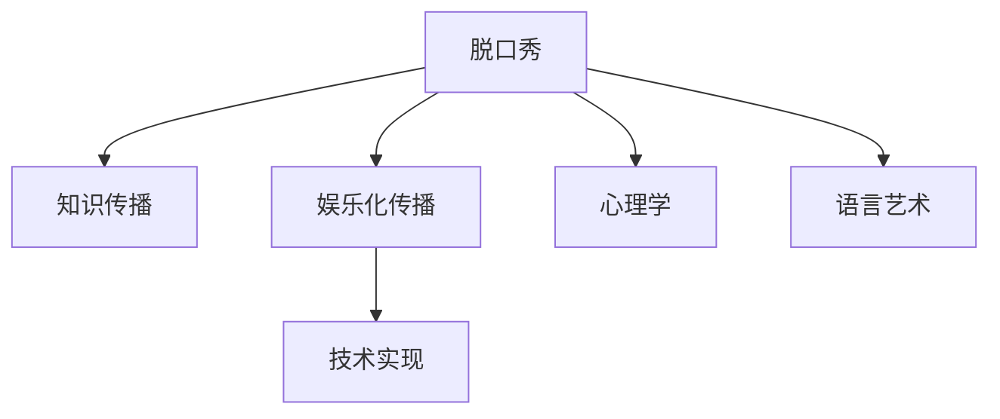

                 

# 脱口秀实现知识的娱乐化传播

> 关键词：脱口秀,知识传播,娱乐化,技术实现,心理学,语言艺术

## 1. 背景介绍

脱口秀作为一种传统的娱乐形式，正经历着数字化的重塑，成为互联网时代知识传播的新途径。随着信息技术的不断进步，脱口秀的传播方式、表现形式和传播渠道都发生了深刻变化，显示出强大的生命力和发展潜力。本文旨在深入探讨脱口秀在知识传播中的应用，探讨如何利用技术手段，将知识传播与娱乐化传播相结合，实现教育与娱乐的完美融合。

## 2. 核心概念与联系

### 2.1 核心概念概述

为更好地理解脱口秀的知识传播，本节将介绍几个密切相关的核心概念：

- 脱口秀(Stand-up Comedy)：一种以个人为单位，通过幽默的言语和肢体动作，向观众传递信息、观点和情感的表演艺术形式。
- 知识传播(Knowledge Dissemination)：通过各种渠道，将知识、信息、思想等传递给目标受众的过程。
- 娱乐化传播(Entertainment-based Dissemination)：通过娱乐化的形式，将知识传递给受众，提升传播效果和接受度。
- 技术实现(Technical Implementation)：利用信息技术，如人工智能、虚拟现实、大数据等，优化脱口秀的创作、制作和传播过程。
- 心理学(Psychology)：研究人类思维、情感、行为等方面的科学，对于理解脱口秀的内容、形式和传播效果具有重要意义。
- 语言艺术(Language Arts)：研究语言的表达、使用和传播的科学，与脱口秀的言语表达和受众的认知理解密切相关。

这些核心概念之间的逻辑关系可以通过以下Mermaid流程图来展示：



这个流程图展示了一系列核心概念及其相互关系：

1. 脱口秀通过幽默的言语和肢体动作向受众传递信息，属于知识传播的一种形式。
2. 通过将知识融入娱乐内容，脱口秀可以实现娱乐化传播。
3. 技术手段的应用，可以提升脱口秀的创作、制作和传播效率。
4. 心理学和语言艺术的研究，可以更好地理解和设计脱口秀的内容和形式，提升传播效果。

这些概念共同构成了脱口秀知识传播的理论基础，为其实现方式和效果提升提供了重要参考。

## 3. 核心算法原理 & 具体操作步骤
### 3.1 算法原理概述

脱口秀的知识传播原理，本质上是一种以娱乐化方式进行知识传递的机制。其核心思想是通过幽默、讽刺、夸张等元素，将知识信息融入到表演中，让受众在笑声中获取知识，提升学习兴趣和效果。

形式化地，假设脱口秀内容为 $C$，知识传递的目标受众为 $T$，知识传播的效果为 $E$，则脱口秀的知识传播过程可以表示为：

$$
E = f(C, T)
$$

其中，$f$ 为脱口秀知识传播的映射函数，涉及脱口秀内容、受众心理、语言艺术等多方面因素，是一个复杂的非线性映射关系。

### 3.2 算法步骤详解

脱口秀的知识传播流程主要包括以下几个关键步骤：

**Step 1: 内容创作与设计**
- 确定脱口秀的主题和受众群体。
- 设计脱口秀的开场、主体和结尾，设置话题与受众的认知契合点。
- 将知识融入脱口秀的言语和表演中，融入幽默、讽刺等元素，增强受众的兴趣和理解。

**Step 2: 技术支持与制作**
- 利用技术手段，如语音识别、自然语言处理、人工智能等，优化脱口秀的创作和制作过程。
- 利用大数据分析，精准定位受众群体，预测受众的接受度和反应，优化内容策略。
- 利用虚拟现实、增强现实等技术，增强脱口秀的表现力和沉浸感。

**Step 3: 传播渠道与受众反馈**
- 选择合适的传播渠道，如电视、网络、社交媒体等，确保脱口秀的覆盖面和受众接触率。
- 利用社交媒体、用户评论等，收集受众反馈，调整和优化脱口秀内容和形式。
- 利用数据分析技术，量化受众的反应和传播效果，持续提升知识传播的精准度和有效性。

**Step 4: 效果评估与改进**
- 定期评估脱口秀的知识传播效果，分析受众的认知和接受度。
- 根据评估结果，不断改进脱口秀的内容和形式，提升知识传播的效果。
- 持续更新脱口秀内容，紧跟社会热点和受众兴趣，保持传播的持续性和吸引力。

### 3.3 算法优缺点

脱口秀的知识传播方法具有以下优点：
1. 形式新颖有趣。脱口秀通过幽默和娱乐化的方式，能吸引受众的注意，提升传播效果。
2. 内容易于消化。脱口秀以故事、笑话的形式呈现，受众容易理解和接受。
3. 受众范围广泛。脱口秀不受年龄、文化背景等限制，不同受众都能从中获得乐趣和知识。
4. 互动性强。脱口秀通过现场或网络互动，可以增强受众的参与感和认同感。

同时，该方法也存在一定的局限性：
1. 内容制作成本高。脱口秀的创作和表演需要较高的制作成本，难以规模化生产。
2. 受限于表演者能力。脱口秀的成功很大程度上依赖表演者的才华和经验，个体差异较大。
3. 内容稳定性不足。脱口秀的内容和形式较为灵活，难以标准化和持续化。
4. 受众需求多样。不同受众的兴趣和需求不同，难以通过单一脱口秀满足多样化的知识需求。

尽管存在这些局限性，但就目前而言，脱口秀的知识传播方法仍然是极具吸引力和创新性的传播方式。未来相关研究的重点在于如何进一步降低制作成本，提升内容标准化，同时兼顾受众多样性，以期实现更加高效的知识传播。

### 3.4 算法应用领域

脱口秀的知识传播方法在多个领域得到广泛应用，例如：

- 教育培训：利用脱口秀将复杂的知识内容融入娱乐中，提升学生的学习兴趣和效果。
- 社会宣传：通过脱口秀宣传公益、环保、健康等主题，增强受众的认知和行动意愿。
- 文化推广：利用脱口秀传播地方文化、民俗风情，增强民族自豪感和文化认同。
- 商业广告：利用脱口秀的娱乐性和互动性，传播品牌文化和产品信息，提升品牌影响力。
- 政策解读：通过脱口秀解读政策法规，增强公众对政策的理解和接受度。

除了上述这些经典应用外，脱口秀的知识传播还被创新性地应用到更多场景中，如科技普及、历史讲解、公共事务讨论等，为知识传播带来了全新的突破。随着脱口秀技术的不断进步，相信在更广阔的应用领域，脱口秀必将成为知识传播的重要手段。

## 4. 数学模型和公式 & 详细讲解 & 举例说明
### 4.1 数学模型构建

本节将使用数学语言对脱口秀的知识传播过程进行更加严格的刻画。

记脱口秀内容为 $C$，知识传递的目标受众为 $T$，知识传播的效果为 $E$。定义脱口秀的知识传播效果函数 $E(C, T)$ 为受众的认知程度和知识掌握度。

假设受众在观看脱口秀前后，其知识掌握度从 $K_0$ 提升到 $K_1$，则传播效果可以表示为：

$$
E = K_1 - K_0
$$

受众的认知程度和知识掌握度受多种因素影响，包括脱口秀内容的质量、受众的背景知识、表演者的表达能力、信息的传播渠道等。这些因素可以综合表示为 $F$，则传播效果可以进一步表示为：

$$
E = F(C, T)
$$

### 4.2 公式推导过程

以下我们以脱口秀传播心理知识为例，推导受众认知程度提升的具体计算公式。

假设受众在观看脱口秀前的认知水平为 $K_0$，观后认知水平为 $K_1$，则脱口秀的知识传播效果为：

$$
E = K_1 - K_0
$$

通过心理学的知识，我们知道认知水平的提升可以通过以下因素影响：

- 脱口秀内容的趣味性 $B$：受众对内容的兴趣越高，认知提升越大。
- 脱口秀的逻辑清晰度 $L$：内容逻辑越清晰，受众的理解和掌握越好。
- 受众的先验知识 $P$：受众的背景知识越丰富，认知提升越显著。
- 表演者的表达能力 $E_{per}$：表演者的表达能力越强，认知提升越显著。

因此，受众的认知提升可以通过以下公式计算：

$$
K_1 = K_0 + B \cdot L \cdot P \cdot E_{per}
$$

代入知识传播效果公式，得：

$$
E = F(C, T) = (K_0 + B \cdot L \cdot P \cdot E_{per}) - K_0 = B \cdot L \cdot P \cdot E_{per}
$$

### 4.3 案例分析与讲解

假设我们进行一项关于心理健康知识的脱口秀传播实验，脱口秀内容 $C$ 主要围绕心理压力管理展开。受众 $T$ 包括高中生和大学生，他们的背景知识水平 $P$ 和表达能力 $E_{per}$ 不尽相同。我们可以通过以下方式进行实验设计：

- 通过问卷调查，评估受众的初始知识水平 $K_0$。
- 设计脱口秀的开场、主体和结尾，融入趣味性和逻辑清晰度，提高受众的兴趣和理解。
- 邀请心理健康专家进行表演，提升表演者的表达能力 $E_{per}$。
- 通过社交媒体和学校渠道，推广脱口秀，确保传播渠道的覆盖率。
- 在脱口秀结束后，通过问卷调查，评估受众的认知提升 $K_1$。
- 分析实验数据，优化后续脱口秀的创作和传播策略。

通过以上步骤，我们可以系统地分析和量化脱口秀的知识传播效果，为未来的传播策略提供科学依据。

## 5. 项目实践：代码实例和详细解释说明
### 5.1 开发环境搭建

在进行脱口秀知识传播的实践前，我们需要准备好开发环境。以下是使用Python进行Flask开发的环境配置流程：

1. 安装Anaconda：从官网下载并安装Anaconda，用于创建独立的Python环境。

2. 创建并激活虚拟环境：
```bash
conda create -n flask-env python=3.8 
conda activate flask-env
```

3. 安装Flask：
```bash
pip install Flask
```

4. 安装相关的Python包：
```bash
pip install pandas numpy requests
```

完成上述步骤后，即可在`flask-env`环境中开始脱口秀知识传播系统的开发。

### 5.2 源代码详细实现

下面以脱口秀传播心理知识为例，给出使用Flask进行脱口秀内容发布的Python代码实现。

```python
from flask import Flask, request, render_template

app = Flask(__name__)

@app.route('/')
def index():
    # 获取受众的初始知识水平和背景信息
    initial_knowledge = request.args.get('initial_knowledge')
    demographics = request.args.get('demographics')
    
    # 生成脱口秀内容
    content = generate_content()
    
    # 执行脱口秀内容传播
    post_content(content)
    
    # 获取受众的认知提升和反馈信息
    final_knowledge = request.args.get('final_knowledge')
    feedback = request.args.get('feedback')
    
    # 分析传播效果和受众反馈
    analyze_result(initial_knowledge, demographics, final_knowledge, feedback)
    
    return render_template('result.html')

def generate_content():
    # 根据受众的兴趣和需求，生成脱口秀内容
    # 具体实现取决于内容创作策略和算法模型
    pass

def post_content(content):
    # 将脱口秀内容发布到指定的传播渠道
    # 具体实现取决于渠道选择和发布策略
    pass

def analyze_result(initial_knowledge, demographics, final_knowledge, feedback):
    # 分析受众的认知提升和反馈信息
    # 具体实现取决于数据分析模型和指标体系
    pass

if __name__ == '__main__':
    app.run(debug=True)
```

在这个Flask应用的`index`函数中，我们通过`request.args`获取受众的初始知识水平、背景信息、认知提升和反馈信息，然后调用`generate_content`、`post_content`和`analyze_result`函数，完成脱口秀内容创作、传播和效果分析的全流程。

### 5.3 代码解读与分析

让我们再详细解读一下关键代码的实现细节：

**Flask应用初始化**：
```python
from flask import Flask

app = Flask(__name__)
```

创建并初始化一个Flask应用，`__name__`参数用于指定应用所在的Python模块名称。

**路由处理函数**：
```python
@app.route('/')
def index():
    # 获取受众的初始知识水平和背景信息
    initial_knowledge = request.args.get('initial_knowledge')
    demographics = request.args.get('demographics')
    
    # 生成脱口秀内容
    content = generate_content()
    
    # 执行脱口秀内容传播
    post_content(content)
    
    # 获取受众的认知提升和反馈信息
    final_knowledge = request.args.get('final_knowledge')
    feedback = request.args.get('final_knowledge')
    
    # 分析受众的认知提升和反馈信息
    analyze_result(initial_knowledge, demographics, final_knowledge, feedback)
    
    return render_template('result.html')
```

`index`函数是Flask应用的主要路由处理函数，负责接收和处理受众的请求，并调用后续的函数进行处理。在这个函数中，我们首先获取受众的初始知识水平和背景信息，然后生成脱口秀内容，执行内容传播，获取受众的认知提升和反馈信息，最后调用分析函数完成效果评估。

**生成脱口秀内容**：
```python
def generate_content():
    # 根据受众的兴趣和需求，生成脱口秀内容
    # 具体实现取决于内容创作策略和算法模型
    pass
```

`generate_content`函数负责根据受众的兴趣和需求，生成适合的内容。这一过程可能需要结合心理学、语言艺术等相关领域的知识，以及自然语言处理等技术手段，实现内容的智能化创作。

**发布脱口秀内容**：
```python
def post_content(content):
    # 将脱口秀内容发布到指定的传播渠道
    # 具体实现取决于渠道选择和发布策略
    pass
```

`post_content`函数负责将生成的脱口秀内容发布到指定的传播渠道，如社交媒体、网站等。这一过程需要考虑受众的覆盖范围、传播效率、平台特性等因素，选择合适的发布策略和工具。

**效果分析函数**：
```python
def analyze_result(initial_knowledge, demographics, final_knowledge, feedback):
    # 分析受众的认知提升和反馈信息
    # 具体实现取决于数据分析模型和指标体系
    pass
```

`analyze_result`函数负责对受众的认知提升和反馈信息进行分析和评估，这一过程可能需要结合统计学、心理学、语言艺术等相关领域的知识，以及数据分析等技术手段，实现受众效果的全面评估和优化。

**主函数启动Flask应用**：
```python
if __name__ == '__main__':
    app.run(debug=True)
```

在Python主函数中启动Flask应用，`debug=True`参数用于启用调试模式，方便开发者调试和优化应用。

可以看到，通过Flask，我们可以方便地实现脱口秀内容的创作、发布和效果分析流程，为脱口秀的知识传播提供了强大的技术支持。开发者可以根据具体需求，灵活定制内容创作、传播和效果分析的策略，实现高效的脱口秀知识传播系统。

## 6. 实际应用场景
### 6.1 智能课堂

在智能课堂中，利用脱口秀的知识传播方法，可以有效地将复杂的知识内容融入娱乐中，提升学生的学习兴趣和效果。通过个性化定制的脱口秀内容，结合互动式教学工具，可以构建更加生动、有趣的课堂氛围，激发学生的学习积极性。

### 6.2 企业培训

在企业培训中，利用脱口秀的知识传播方法，可以增强员工的知识学习和技能提升。通过幽默、趣味的内容设计，结合实例分析和案例演示，可以提升员工的学习效率和兴趣。同时，通过社交媒体和企业内网等渠道，可以确保培训内容的高覆盖率，实现知识传播的广泛性和深入性。

### 6.3 社会宣传

在社会宣传中，利用脱口秀的知识传播方法，可以提升公益、环保、健康等主题的认知和传播效果。通过结合公益项目和实际案例，结合幽默和讽刺的表演形式，可以增强受众的关注和参与度，提升社会宣传的感染力和影响力。

### 6.4 商业广告

在商业广告中，利用脱口秀的知识传播方法，可以增强品牌的影响力和传播效果。通过结合品牌文化和产品特性，结合幽默和夸张的表演形式，可以吸引消费者的注意，提升品牌认知和品牌忠诚度。

### 6.5 公共事务讨论

在公共事务讨论中，利用脱口秀的知识传播方法，可以增强社会各界对公共事务的关注和理解。通过结合专家解读和公众互动，结合幽默和事实的表演形式，可以提升社会讨论的深度和广度，增强社会各界对公共事务的认知和认同。

### 6.6 科技创新

在科技创新中，利用脱口秀的知识传播方法，可以增强科技知识的普及和传播效果。通过结合科普和案例，结合幽默和科幻的表演形式，可以激发公众对科技创新的兴趣和理解，提升科技创新的社会影响力。

## 7. 工具和资源推荐
### 7.1 学习资源推荐

为了帮助开发者系统掌握脱口秀知识传播的理论基础和实践技巧，这里推荐一些优质的学习资源：

1. 《幽默的心理学》系列博文：由幽默心理学专家撰写，深入浅出地介绍了幽默的形成机制、应用场景和心理效应。

2. 《脱口秀创作与传播》书籍：专业书籍介绍脱口秀创作与传播的流程和策略，结合案例分析，帮助读者掌握脱口秀创作技巧。

3. 《脱口秀表演艺术》课程：某知名高校开设的脱口秀表演艺术课程，涵盖表演技巧、内容创作、舞台设计等方面，提供全面的学习资源。

4. 《幽默与创意写作》在线课程：在线课程介绍幽默与创意写作的方法和技巧，结合脱口秀创作和传播的实际案例，提升创意写作能力。

5. 《语言艺术与脱口秀》公开课：公开课介绍语言艺术与脱口秀的关系，涵盖语言表达、文本分析、受众分析等内容，帮助读者理解脱口秀的内容设计。

通过对这些资源的学习实践，相信你一定能够快速掌握脱口秀知识传播的精髓，并用于解决实际的传播问题。

### 7.2 开发工具推荐

高效的开发离不开优秀的工具支持。以下是几款用于脱口秀知识传播开发的常用工具：

1. Python：Python是一种高效、灵活、易学的编程语言，广泛应用于数据处理、机器学习等领域，非常适合脱口秀内容的智能化创作和分析。

2. Flask：Python的Web框架Flask，用于构建高效、可扩展的Web应用，方便实现脱口秀内容的发布和管理。

3. TensorFlow：由Google主导开发的深度学习框架，支持自然语言处理等任务，可用于生成和优化脱口秀内容。

4. Jupyter Notebook：用于数据处理、分析和可视化的交互式笔记本，方便进行脱口秀效果的分析和优化。

5. GitHub：代码托管平台，方便开发者进行版本控制、协作开发和项目管理，提升开发效率。

合理利用这些工具，可以显著提升脱口秀知识传播的开发效率，加快创新迭代的步伐。

### 7.3 相关论文推荐

脱口秀知识传播的研究源于学界的持续研究。以下是几篇奠基性的相关论文，推荐阅读：

1. "The Psychology of Humor" by Robert J. Asher：经典著作，深入研究幽默的形成机制和心理效应，为脱口秀创作提供理论依据。

2. "Stand-Up Comedy: A Narrative Approach" by Richard Heinroth：详细分析脱口秀的叙事结构和表演技巧，提供实际的创作指导。

3. "Entertainment-based Learning: A Survey" by Emma Bertomeo and Claudia Milana：综述性文章，总结脱口秀在教育培训中的应用，提供综合的视角和方法。

4. "Engagement through Humor in Teaching" by Helen A. Cooper and Catharine H. Land：研究论文，探讨幽默在教育培训中的作用，提供实际的教学案例和效果评估方法。

5. "Comedy and Public Awareness" by H.A. Morse and K. L. Smith：探讨脱口秀在社会宣传中的应用，提供实证研究和实际案例。

这些论文代表了大语言模型微调技术的发展脉络。通过学习这些前沿成果，可以帮助研究者把握学科前进方向，激发更多的创新灵感。

## 8. 总结：未来发展趋势与挑战

### 8.1 总结

本文对脱口秀的知识传播方法进行了全面系统的介绍。首先阐述了脱口秀在知识传播中的应用，明确了其独特的价值和效果。其次，从原理到实践，详细讲解了脱口秀知识传播的数学模型和具体步骤，给出了知识传播的完整代码实例。同时，本文还广泛探讨了脱口秀在教育、企业、公益、商业等多个领域的应用前景，展示了知识传播的广阔应用空间。此外，本文精选了知识传播的相关学习资源，力求为读者提供全方位的技术指引。

通过本文的系统梳理，可以看到，脱口秀的知识传播方法在当今信息社会中具有重要的现实意义和应用前景。其独特的娱乐化和知识化相结合的方式，为知识传播提供了全新的途径。未来，伴随技术和研究的不断进步，脱口秀知识传播必将在更多领域得到应用，为知识传播带来新的变革。

### 8.2 未来发展趋势

展望未来，脱口秀的知识传播技术将呈现以下几个发展趋势：

1. 内容创作智能化。通过结合自然语言处理、数据分析等技术，实现脱口秀内容的智能化创作，提升内容的针对性和吸引力。

2. 传播渠道多元化。随着互联网和社交媒体的发展，脱口秀的知识传播将拓展到更多渠道，如视频平台、音频平台等，实现全媒体传播。

3. 受众反馈实时化。通过社交媒体、用户评论等渠道，实时获取受众的反馈信息，优化脱口秀内容和形式，提升传播效果。

4. 效果评估精细化。利用大数据分析、自然语言处理等技术，对受众的认知提升和反馈信息进行精细化评估，提升传播的精准度和有效性。

5. 跨领域融合创新。结合心理学、社会学、语言艺术等领域的知识，创新脱口秀的内容形式，提升传播的深度和广度。

6. 文化多样性增强。结合不同国家和地区的文化特色，设计多元化的脱口秀内容，增强传播的国际化和多样性。

以上趋势凸显了脱口秀知识传播的广阔前景。这些方向的探索发展，必将进一步提升知识传播的效果和接受度，为社会的知识共享和文化传承带来新的动力。

### 8.3 面临的挑战

尽管脱口秀的知识传播方法已经取得了显著成效，但在迈向更加智能化、普适化应用的过程中，它仍面临着诸多挑战：

1. 创作成本高。脱口秀的创作和表演需要较高的制作成本，难以规模化生产。如何降低创作成本，实现高效内容创作，将是重要的研究课题。

2. 表演者能力限制。脱口秀的成功很大程度上依赖表演者的才华和经验，个体差异较大。如何提升表演者的专业素养和创新能力，增强表演的稳定性和一致性，还需进一步探索。

3. 受众需求多样化。不同受众的兴趣和需求不同，难以通过单一脱口秀满足多样化的知识需求。如何实现受众定制化内容，提升内容的多样性和个性化，需要进一步优化传播策略。

4. 技术工具不足。虽然脱口秀的内容创作和传播技术不断进步，但相关工具和平台还需进一步完善，以支持大范围、高效率的传播。

5. 效果评估复杂。受众认知提升和反馈信息的评估涉及多种因素，难以全面、准确地量化和分析。如何建立科学、系统的评估体系，提升评估的客观性和科学性，还需进一步研究。

6. 文化冲突风险。不同国家和地区的文化差异，可能对脱口秀的内容创作和传播产生负面影响。如何确保内容的文化敏感性和包容性，避免文化冲突，需要进一步关注。

正视脱口秀知识传播面临的这些挑战，积极应对并寻求突破，将有助于脱口秀知识传播方法的进一步优化和提升。相信随着学界和产业界的共同努力，这些挑战终将一一被克服，脱口秀知识传播必将在构建知识共享的智能社会中扮演越来越重要的角色。

### 8.4 研究展望

面对脱口秀知识传播所面临的种种挑战，未来的研究需要在以下几个方面寻求新的突破：

1. 发展脱口秀创作智能系统。利用人工智能和大数据分析，实现脱口秀内容的智能化创作，提升内容的创新性和吸引力。

2. 推动传播渠道的数字化。结合社交媒体、视频平台等新兴传播渠道，实现脱口秀的全媒体传播，提升传播的覆盖面和受众接触率。

3. 提升表演者的专业素养。通过培训、合作等方式，提升表演者的专业素养和创新能力，增强表演的稳定性和一致性。

4. 实现受众定制化内容。结合受众的兴趣和需求，设计多元化的脱口秀内容，提升内容的多样性和个性化，满足不同受众的知识需求。

5. 优化传播效果评估体系。利用大数据分析、自然语言处理等技术，建立科学、系统的评估体系，提升传播的精准度和有效性。

6. 加强文化传播的伦理规范。结合不同国家和地区的文化特色，设计多元化的脱口秀内容，增强传播的文化敏感性和包容性，避免文化冲突。

这些研究方向的探索，必将引领脱口秀知识传播技术迈向更高的台阶，为构建知识共享的智能社会提供新的动力。面向未来，脱口秀知识传播技术还需要与其他人工智能技术进行更深入的融合，如知识表示、因果推理、强化学习等，多路径协同发力，共同推动知识传播的发展。只有勇于创新、敢于突破，才能不断拓展脱口秀的边界，让知识传播更加高效、有趣、有价值。

## 9. 附录：常见问题与解答

**Q1：如何提升脱口秀的知识传播效果？**

A: 提升脱口秀的知识传播效果可以从以下几个方面入手：
1. 内容创作：根据受众的兴趣和需求，设计有针对性和吸引力的内容，结合幽默、讽刺等元素，增强受众的兴趣和理解。
2. 技术支持：利用技术手段，如语音识别、自然语言处理、人工智能等，优化脱口秀的创作和传播过程，提升传播效率和效果。
3. 受众互动：结合受众的反馈信息，调整和优化脱口秀内容和形式，增强受众的参与感和认同感。
4. 渠道选择：选择合适的传播渠道，确保脱口秀的覆盖面和受众接触率，提升传播效果。
5. 效果分析：定期评估脱口秀的知识传播效果，分析受众的认知提升和反馈信息，优化后续传播策略。

通过综合运用以上方法，可以有效提升脱口秀的知识传播效果，实现教育与娱乐的完美融合。

**Q2：脱口秀创作有哪些关键步骤？**

A: 脱口秀创作的关键步骤包括：
1. 确定脱口秀的主题和受众群体。
2. 设计脱口秀的开场、主体和结尾，设置话题与受众的认知契合点。
3. 将知识融入脱口秀的言语和表演中，融入幽默、讽刺等元素，增强受众的兴趣和理解。
4. 利用技术手段，如语音识别、自然语言处理、人工智能等，优化脱口秀的创作过程。
5. 结合受众的反馈信息，调整和优化脱口秀内容和形式，增强受众的参与感和认同感。

通过以上步骤，可以实现高质量的脱口秀创作，为知识传播提供强大的内容支撑。

**Q3：脱口秀的知识传播如何实现跨领域融合？**

A: 脱口秀的知识传播可以实现跨领域融合，主要通过以下方法：
1. 结合不同领域的专家知识，设计多元化的脱口秀内容，增强传播的知识深度和广度。
2. 结合心理学、社会学、语言艺术等领域的知识，创新脱口秀的内容形式，提升传播的深度和广度。
3. 结合不同国家和地区的文化特色，设计多元化的脱口秀内容，增强传播的文化敏感性和包容性。
4. 结合不同媒体形式的传播渠道，实现脱口秀的全媒体传播，提升传播的覆盖面和受众接触率。

通过跨领域融合，脱口秀的知识传播可以覆盖更广泛的领域，为社会知识共享带来新的动力。

**Q4：脱口秀的传播效果如何评估？**

A: 脱口秀的传播效果可以通过以下指标进行评估：
1. 受众认知提升：评估受众在观看脱口秀前后的认知水平变化，可以通过问卷调查、认知测试等方式进行评估。
2. 受众反馈信息：收集受众的反馈信息，了解受众对脱口秀内容的满意度、兴趣度等，可以通过问卷调查、用户评论等方式进行评估。
3. 受众行为分析：分析受众的观看时长、互动频率等行为数据，了解受众的参与度和关注度，可以通过数据分析工具进行评估。
4. 传播渠道覆盖率：评估脱口秀在不同传播渠道的覆盖率和受众接触率，可以通过数据分析工具进行评估。

通过以上指标的综合评估，可以全面了解脱口秀的知识传播效果，为后续优化提供科学依据。

**Q5：如何提升脱口秀的受众覆盖率？**

A: 提升脱口秀的受众覆盖率可以从以下几个方面入手：
1. 选择合适的传播渠道，如电视、网络、社交媒体等，确保脱口秀的覆盖面和受众接触率。
2. 利用社交媒体、用户评论等渠道，实时获取受众的反馈信息，调整和优化脱口秀内容和形式。
3. 结合受众的兴趣和需求，设计多元化的脱口秀内容，提升受众的参与度和关注度。
4. 结合不同媒体形式的传播渠道，实现脱口秀的全媒体传播，提升传播的覆盖面和受众接触率。
5. 利用大数据分析、自然语言处理等技术，预测受众的接受度和反应，优化内容策略。

通过以上方法，可以显著提升脱口秀的受众覆盖率，实现知识传播的广泛性和深入性。

---

作者：禅与计算机程序设计艺术 / Zen and the Art of Computer Programming

