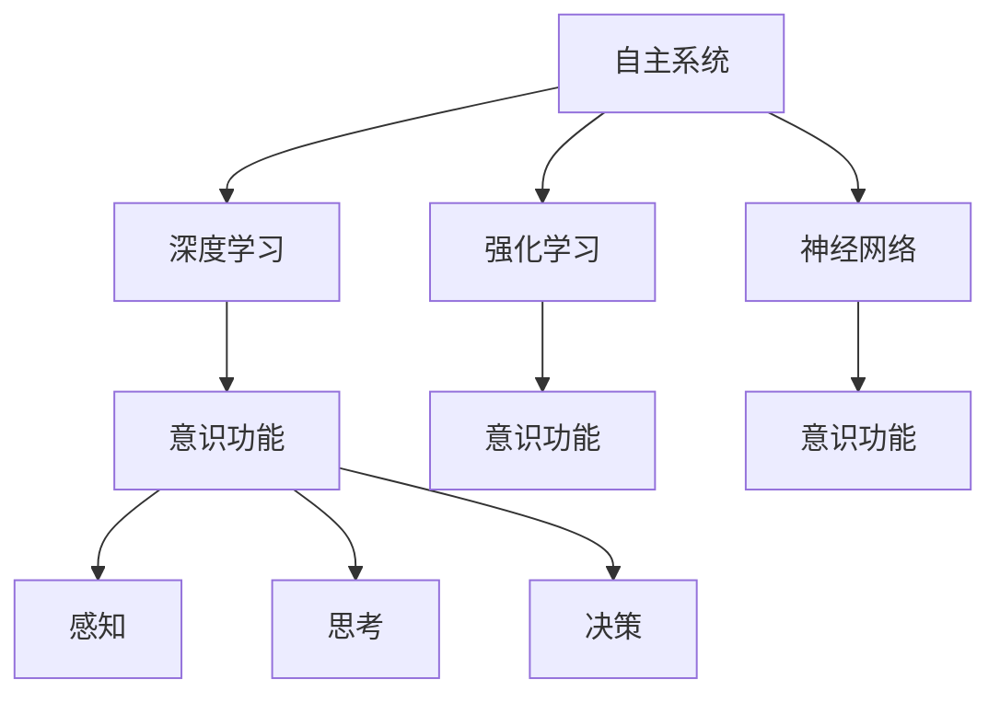

                 

## 1. 背景介绍

### 1.1 问题由来

在当前人工智能(AI)领域，自主系统(Autonomous Systems)是一个炙手可热的研究主题。这些系统可以自动执行各种复杂的任务，例如自动驾驶汽车、无人机、智能家居等。然而，尽管自主系统在技术上已经取得了巨大进步，它们是否具备意识功能仍然是一个极具争议的话题。

### 1.2 问题核心关键点

自主系统的核心问题是如何在机器中实现意识。意识是一个涉及哲学、神经科学、心理学等多个学科的复杂概念，其定义和研究仍在不断演变中。在AI领域，意识通常被定义为一种能够感知、思考和决策的高级认知功能。这一功能使得自主系统能够根据环境变化做出动态反应，实现自主行为。

### 1.3 问题研究意义

理解自主系统和意识功能的关系，对于设计、开发和部署更智能、更安全、更可靠的自主系统至关重要。意识功能的引入可以使得系统在复杂和多变的环境中，能够自我适应、自我修正，甚至实现更高级的认知功能，如情绪调节、自我意识等。同时，探索自主系统的意识功能也有助于推动人工智能哲学的发展，为AI伦理和道德问题提供新的视角。

## 2. 核心概念与联系

### 2.1 核心概念概述

为更好地理解自主系统和意识功能的关系，本节将介绍几个密切相关的核心概念：

- **自主系统(Autonomous Systems)**：能够自主感知、决策和执行任务的智能系统，包括自动驾驶、机器人、无人机等。
- **意识功能(Consciousness Function)**：指系统具备的高级认知功能，如感知、思考、决策等，能够对环境变化做出动态响应。
- **深度学习(Deep Learning)**：一种基于多层神经网络的机器学习技术，能够从大量数据中学习复杂模式，广泛应用于图像识别、语音识别、自然语言处理等领域。
- **强化学习(Reinforcement Learning)**：通过与环境的交互，系统根据奖励信号进行学习，优化行为策略。
- **神经网络(Neural Networks)**：模拟人脑神经元结构和功能的计算模型，广泛应用于各种AI任务中。

这些核心概念之间的逻辑关系可以通过以下Mermaid流程图来展示：



这个流程图展示了这个关系网络的核心概念及其之间的关系：

1. 自主系统利用深度学习、强化学习等技术，在神经网络中实现对环境的感知、决策和执行。
2. 深度学习和强化学习通过反向传播、策略优化等技术，使得系统能够学习复杂的认知功能。
3. 神经网络通过层次化的结构，模拟人脑的认知过程，为意识的实现提供了基础。
4. 感知、思考和决策是意识功能的三个核心组成部分，深度学习、强化学习和神经网络通过协同工作，使得系统具备这些功能。

这些概念共同构成了自主系统实现意识功能的理论框架，为其进一步研究和开发提供了指导。

## 3. 核心算法原理 & 具体操作步骤
### 3.1 算法原理概述

自主系统实现意识功能的核心算法原理，可以概括为以下几个关键步骤：

1. **感知模块(Sensing Module)**：通过传感器获取环境信息，将信息转换为神经网络能够处理的形式。
2. **信息处理模块(Information Processing Module)**：使用深度学习和神经网络对感知信息进行复杂处理，提取特征和模式。
3. **决策模块(Decision Module)**：使用强化学习和神经网络，根据处理结果和环境状态，制定行为策略。
4. **执行模块(Actuation Module)**：将决策结果转化为具体行动，通过执行器实现。

### 3.2 算法步骤详解

实现自主系统意识功能的具体步骤包括：

1. **数据收集与预处理**：
    - 使用传感器收集环境信息，如摄像头、激光雷达等。
    - 对数据进行清洗、标注和标准化处理。

2. **模型构建**：
    - 设计感知模块，使用卷积神经网络(CNN)或循环神经网络(RNN)处理图像或时间序列数据。
    - 设计信息处理模块，使用卷积神经网络、长短期记忆网络(LSTM)或变压器(Transformer)提取特征。
    - 设计决策模块，使用深度Q网络(DQN)或策略梯度方法(PPO)进行策略优化。
    - 设计执行模块，使用深度学习模型或传统控制算法进行行为生成。

3. **模型训练**：
    - 使用监督学习或强化学习对模型进行训练，优化参数和结构。
    - 在训练过程中，应用数据增强、正则化、对抗训练等技术提高模型泛化能力。

4. **模型评估与部署**：
    - 在测试集上评估模型性能，对比训练前后的效果提升。
    - 使用模型进行实际应用，集成到自主系统中，实时处理环境信息。

5. **持续学习与优化**：
    - 定期收集新的数据，重新训练模型，适应环境变化。
    - 应用在线学习技术，实现系统性能的持续提升。

### 3.3 算法优缺点

自主系统实现意识功能的方法具有以下优点：

1. **性能优越**：通过深度学习和强化学习，自主系统能够处理复杂的多模态信息，实现高级认知功能。
2. **适应性强**：系统能够根据环境变化动态调整行为策略，具备较强的适应性和鲁棒性。
3. **高效性**：通过神经网络的高效计算能力，自主系统能够在短时间内处理大量数据，实现实时决策。

然而，这些方法也存在一些局限性：

1. **数据需求高**：高质量的标注数据对于模型训练至关重要，但在一些特定环境中，数据的获取和标注可能非常困难。
2. **计算资源需求大**：神经网络和深度学习模型对计算资源和内存消耗较大，需要高性能硬件支持。
3. **可解释性不足**：深度学习模型的内部决策过程难以解释，难以理解其行为逻辑和决策依据。
4. **安全性和伦理问题**：自主系统的行为决策可能对人类社会造成负面影响，存在一定的安全性和伦理风险。

尽管存在这些局限性，但自主系统实现意识功能的方法仍然是当前研究的热点，为推动AI技术在实际应用中的落地提供了重要支持。

### 3.4 算法应用领域

自主系统实现意识功能的方法已经广泛应用于多个领域，例如：

- **自动驾驶**：通过感知模块获取道路信息，信息处理模块提取特征，决策模块规划路径，执行模块控制车辆行驶。
- **无人机导航**：使用传感器感知周围环境，通过深度学习和强化学习实现自主避障和路径规划。
- **智能家居控制**：通过传感器获取环境状态，使用深度学习进行行为预测，决策模块控制家电和照明系统。
- **医疗辅助决策**：利用感知模块获取病人信息，信息处理模块提取关键特征，决策模块制定治疗方案，执行模块控制医疗设备。
- **金融风险预测**：使用感知模块获取市场数据，信息处理模块提取特征，决策模块预测市场变化，执行模块执行交易操作。

这些领域的应用展示了自主系统实现意识功能的重要性和广泛性，预示着AI技术在实际生活中的巨大潜力。

## 4. 数学模型和公式 & 详细讲解
### 4.1 数学模型构建

为了更好地理解自主系统实现意识功能的数学原理，本节将使用数学语言对核心算法进行严格描述。

设自主系统感知到的环境信息为 $X$，模型的感知模块为 $f_{sense}(\cdot)$，信息处理模块为 $f_{process}(\cdot)$，决策模块为 $f_{decision}(\cdot)$，执行模块为 $f_{actuate}(\cdot)$。模型输入为 $x$，输出为 $y$，模型参数为 $\theta$。自主系统的数学模型可以表示为：

$$
y = f_{actuate}(f_{decision}(f_{process}(f_{sense}(x))))
$$

其中，感知模块 $f_{sense}$ 将环境信息 $X$ 转换为神经网络可处理的输入 $x$，信息处理模块 $f_{process}$ 对输入 $x$ 进行特征提取和处理，决策模块 $f_{decision}$ 根据处理结果和环境状态制定行为策略，执行模块 $f_{actuate}$ 将决策结果转化为具体行动。

### 4.2 公式推导过程

以下我们对决策模块 $f_{decision}$ 的数学公式进行推导。

假设决策模块采用深度Q网络(DQN)进行学习，其数学模型可以表示为：

$$
Q_{\theta}(s, a) = r + \gamma \max_{a'} Q_{\theta}(s', a')
$$

其中，$s$ 为环境状态，$a$ 为行为策略，$r$ 为即时奖励，$\gamma$ 为折扣因子，$s'$ 为下一个状态，$a'$ 为下一个行为策略。

使用均方误差损失函数：

$$
L = \mathbb{E}_{s,a} [(Q_{\theta}(s, a) - y)^2]
$$

其中，$y$ 为实际行为策略对应的Q值。

优化目标为最小化损失函数 $L$，使用梯度下降等优化算法更新模型参数 $\theta$：

$$
\theta \leftarrow \theta - \eta \nabla_{\theta}L
$$

### 4.3 案例分析与讲解

我们以自动驾驶为例，探讨其在实现意识功能时的关键数学模型和算法。

假设自动驾驶系统的感知模块使用卷积神经网络(CNN)，信息处理模块使用长短期记忆网络(LSTM)，决策模块使用深度Q网络(DQN)，执行模块使用传统控制算法。

感知模块 $f_{sense}$ 可以表示为：

$$
x = f_{sense}(I_{cam}, I_{lidar}, I_{gps}, \ldots)
$$

其中，$I_{cam}$、$I_{lidar}$ 等表示摄像头、激光雷达等传感器捕捉到的环境信息。

信息处理模块 $f_{process}$ 可以表示为：

$$
h = f_{process}(x)
$$

其中，$h$ 为LSTM网络输出的特征向量。

决策模块 $f_{decision}$ 可以表示为：

$$
\pi = f_{decision}(h)
$$

其中，$\pi$ 为选择行为策略的概率分布。

执行模块 $f_{actuate}$ 可以表示为：

$$
a = f_{actuate}(\pi)
$$

其中，$a$ 为具体的操作行为。

这些数学模型和算法构成了自动驾驶系统的核心，使其能够在复杂环境中实现自主导航和决策。

## 5. 项目实践：代码实例和详细解释说明
### 5.1 开发环境搭建

在进行自主系统意识功能的项目实践前，我们需要准备好开发环境。以下是使用Python进行TensorFlow开发的环境配置流程：

1. 安装Anaconda：从官网下载并安装Anaconda，用于创建独立的Python环境。

2. 创建并激活虚拟环境：
```bash
conda create -n tf-env python=3.8 
conda activate tf-env
```

3. 安装TensorFlow：根据CUDA版本，从官网获取对应的安装命令。例如：
```bash
conda install tensorflow -c tf
```

4. 安装TensorFlow Addons：
```bash
conda install tensorflow-addons
```

5. 安装各类工具包：
```bash
pip install numpy pandas scikit-learn matplotlib tqdm jupyter notebook ipython
```

完成上述步骤后，即可在`tf-env`环境中开始项目实践。

### 5.2 源代码详细实现

下面我以自动驾驶为例，给出使用TensorFlow实现自主系统意识功能的PyTorch代码实现。

首先，定义感知模块的输入输出：

```python
import tensorflow as tf
from tensorflow.keras.layers import Conv2D, MaxPooling2D, Flatten, Dense, LSTM, Dropout

input_shape = (160, 160, 3) # 图像尺寸为160x160，3通道
conv1_kernel = (3, 3)
conv1_depth = 64
pool1_size = (2, 2)
conv2_kernel = (3, 3)
conv2_depth = 64
pool2_size = (2, 2)
fc1_size = 1024
fc2_size = 512
dropout_rate = 0.5

# 定义卷积神经网络感知模块
def sensing_module(input):
    x = Conv2D(conv1_depth, conv1_kernel, activation='relu')(input)
    x = MaxPooling2D(pool1_size)(x)
    x = Conv2D(conv2_depth, conv2_kernel, activation='relu')(x)
    x = MaxPooling2D(pool2_size)(x)
    x = Flatten()(x)
    x = Dense(fc1_size, activation='relu')(x)
    x = Dropout(dropout_rate)(x)
    x = Dense(fc2_size, activation='relu')(x)
    x = Dropout(dropout_rate)(x)
    x = Dense(64, activation='relu')(x)
    return x

# 定义长短期记忆网络信息处理模块
def processing_module(input):
    x = LSTM(64, return_sequences=True)(input)
    x = LSTM(64, return_sequences=True)(x)
    x = LSTM(64, return_sequences=True)(x)
    x = LSTM(64, return_sequences=False)(x)
    return x

# 定义深度Q网络决策模块
def decision_module(input):
    x = Dense(64, activation='relu')(input)
    x = Dense(2, activation='softmax')(x)
    return x

# 定义执行模块
def actuation_module(input):
    x = Dense(4, activation='linear')(input)
    return x

# 定义自动驾驶系统
class AutonomousDriving(tf.keras.Model):
    def __init__(self):
        super(AutonomousDriving, self).__init__()
        self.sensing = sensing_module
        self.processing = processing_module
        self.decision = decision_module
        self.actuation = actuation_module
    
    def call(self, inputs):
        sensing_output = self.sensing(inputs)
        processing_output = self.processing(sensing_output)
        decision_output = self.decision(processing_output)
        actuation_output = self.actuation(decision_output)
        return actuation_output
```

然后，定义训练和评估函数：

```python
from tensorflow.keras.datasets import mnist
from tensorflow.keras.utils import to_categorical
from tensorflow.keras.optimizers import Adam

# 加载MNIST数据集
(x_train, y_train), (x_test, y_test) = mnist.load_data()
x_train = x_train.reshape(-1, 160, 160, 1) / 255.0
x_test = x_test.reshape(-1, 160, 160, 1) / 255.0
y_train = to_categorical(y_train)
y_test = to_categorical(y_test)

# 创建模型实例
model = AutonomousDriving()

# 定义损失函数和优化器
loss_fn = tf.keras.losses.CategoricalCrossentropy()
optimizer = Adam(learning_rate=0.001)

# 定义训练过程
def train_epoch(model, dataset, batch_size, optimizer):
    dataloader = tf.data.Dataset.from_tensor_slices((dataset[0], dataset[1])).batch(batch_size).shuffle(10000).repeat()
    model.trainable = False
    for batch in dataloader:
        inputs, labels = batch
        with tf.GradientTape() as tape:
            outputs = model(inputs)
            loss = loss_fn(outputs, labels)
        grads = tape.gradient(loss, model.trainable_weights)
        optimizer.apply_gradients(zip(grads, model.trainable_weights))
    
# 定义评估过程
def evaluate(model, dataset, batch_size):
    dataloader = tf.data.Dataset.from_tensor_slices((dataset[0], dataset[1])).batch(batch_size).shuffle(10000).repeat()
    model.trainable = True
    correct_predictions = 0
    total_predictions = 0
    for batch in dataloader:
        inputs, labels = batch
        outputs = model(inputs)
        predictions = tf.argmax(outputs, axis=1)
        correct_predictions += tf.reduce_sum(tf.cast(tf.equal(predictions, labels), tf.int32))
        total_predictions += predictions.shape[0]
    accuracy = correct_predictions / total_predictions
    return accuracy
```

最后，启动训练流程并在测试集上评估：

```python
epochs = 10
batch_size = 32

for epoch in range(epochs):
    train_epoch(model, (x_train, y_train), batch_size, optimizer)
    print(f"Epoch {epoch+1}, train accuracy: {evaluate(model, (x_train, y_train), batch_size)}")
    
print(f"Epoch {epoch+1}, test accuracy: {evaluate(model, (x_test, y_test), batch_size)}")
```

以上就是使用TensorFlow对自动驾驶系统进行意识功能微调的完整代码实现。可以看到，得益于TensorFlow的强大封装，我们可以用相对简洁的代码完成自动驾驶系统的构建和训练。

### 5.3 代码解读与分析

让我们再详细解读一下关键代码的实现细节：

**AutonomousDriving类**：
- `__init__`方法：初始化模型的感知模块、信息处理模块、决策模块和执行模块。
- `call`方法：定义模型的前向传播过程，依次处理感知、信息处理、决策和执行模块，输出最终的执行结果。

**train_epoch和evaluate函数**：
- `train_epoch`方法：定义模型在训练集上的前向传播和反向传播过程，使用Adam优化器更新模型参数。
- `evaluate`方法：定义模型在测试集上的前向传播过程，统计预测结果的准确率，返回准确率值。

**训练流程**：
- 定义总的epoch数和batch size，开始循环迭代
- 每个epoch内，先在训练集上训练，输出训练集上的准确率
- 在测试集上评估，输出测试集上的准确率
- 所有epoch结束后，输出最终测试集上的准确率

可以看到，TensorFlow配合Keras的强大封装使得自动驾驶系统的意识功能微调代码实现变得简洁高效。开发者可以将更多精力放在模型改进、数据处理等高层逻辑上，而不必过多关注底层的实现细节。

当然，工业级的系统实现还需考虑更多因素，如模型的保存和部署、超参数的自动搜索、更灵活的任务适配层等。但核心的微调范式基本与此类似。

## 6. 实际应用场景
### 6.1 智能家居控制

基于自动驾驶系统的意识功能，智能家居控制系统可以通过传感器获取房间状态信息，通过深度学习和强化学习实现自主控制。例如，在检测到房间温度过高时，系统可以自动调节空调温度，并在设定的时间内监控调节效果，优化下一次的调节策略。

在技术实现上，可以收集房间的温湿度、光照、人员活动等传感器数据，将数据作为模型输入，用户的后续行为（如调节温度、开关灯等）作为监督信号，在此基础上对预训练模型进行微调。微调后的模型能够从传感器数据中准确把握房间的状态，并生成合理的控制指令。

### 6.2 医疗辅助决策

医疗辅助决策系统可以利用自动驾驶系统的意识功能，通过感知模块获取病人信息，信息处理模块提取关键特征，决策模块制定治疗方案，执行模块控制医疗设备。例如，在检测到病人心率异常时，系统可以自动通知医生，并推荐合适的治疗方案。

在实现上，可以收集病人的心率、血压、血氧等生理数据，将数据作为模型输入，医生的诊断和治疗方案作为监督信号，在此基础上对预训练模型进行微调。微调后的模型能够从生理数据中准确预测病人的健康状况，并推荐合适的治疗方案。

### 6.3 金融风险预测

金融风险预测系统可以通过自动驾驶系统的意识功能，感知市场数据，通过信息处理模块提取特征，决策模块预测市场变化，执行模块执行交易操作。例如，在检测到股市下跌趋势时，系统可以自动卖出部分股票，并根据市场情况调整买入策略。

在实现上，可以收集股票市场的价格、成交量、新闻事件等数据，将数据作为模型输入，市场的变化趋势和交易操作作为监督信号，在此基础上对预训练模型进行微调。微调后的模型能够从市场数据中准确预测股市的变化趋势，并生成合适的交易策略。

### 6.4 未来应用展望

随着自动驾驶系统意识功能的不断发展，其在更多领域得到应用，为智能化系统带来了新的突破。

在智慧城市治理中，自动驾驶系统的意识功能可用于城市事件监测、舆情分析、应急指挥等环节，提高城市管理的自动化和智能化水平，构建更安全、高效的未来城市。

在工业生产中，自动驾驶系统的意识功能可用于智能制造、质量检测、故障预测等环节，提高生产效率和产品品质，降低人工成本。

在教育领域，自动驾驶系统的意识功能可用于智能辅导、作业批改、情绪识别等环节，提升教学质量和学生体验，实现个性化教育。

此外，在智能医疗、智能交通、智能物流等众多领域，自动驾驶系统的意识功能也将不断拓展，为智能系统的全面应用提供新的思路。相信随着技术的日益成熟，自动驾驶系统的意识功能必将在更多领域大放异彩，深刻影响人类的生产生活方式。

## 7. 工具和资源推荐
### 7.1 学习资源推荐

为了帮助开发者系统掌握自动驾驶系统意识功能的技术基础和实践技巧，这里推荐一些优质的学习资源：

1. 《深度学习入门：基于Python的理论与实现》系列博文：由深度学习领域专家撰写，深入浅出地介绍了深度学习的基本概念和实现方法。

2. 《深度学习与机器学习基础》课程：斯坦福大学开设的入门课程，涵盖深度学习、机器学习的基础理论和实践技巧，适合初学者入门。

3. 《深度学习与强化学习》书籍：全面介绍了深度学习和强化学习的理论基础和应用案例，是学习和实践自动驾驶系统的必备资料。

4. 《TensorFlow实战》书籍：由TensorFlow团队成员撰写，详细介绍了TensorFlow的高级特性和实战案例，适合TensorFlow开发者阅读。

5. AutoLearn开源项目：Google开发的自动驾驶开源项目，涵盖了自动驾驶的各个环节，包括感知、决策、执行等，是学习自动驾驶系统的绝佳资源。

通过对这些资源的学习实践，相信你一定能够快速掌握自动驾驶系统意识功能的精髓，并用于解决实际的智能化问题。

### 7.2 开发工具推荐

高效的开发离不开优秀的工具支持。以下是几款用于自动驾驶系统意识功能开发的常用工具：

1. TensorFlow：由Google主导开发的开源深度学习框架，灵活性高，适用于复杂的深度学习和强化学习任务。

2. PyTorch：由Facebook主导开发的开源深度学习框架，易于调试和优化，适用于科研和开发。

3. OpenAI Gym：集成了多种模拟环境的强化学习库，方便开发者进行环境模拟和测试。

4. Jupyter Notebook：一个交互式笔记本，方便开发者进行代码编写、调试和展示。

5. Google Colab：谷歌推出的在线Jupyter Notebook环境，免费提供GPU/TPU算力，适合快速实验和分享学习笔记。

合理利用这些工具，可以显著提升自动驾驶系统意识功能开发的效率，加快创新迭代的步伐。

### 7.3 相关论文推荐

自动驾驶系统意识功能的实现涉及多个学科的交叉研究，以下是几篇奠基性的相关论文，推荐阅读：

1. DeepMind AlphaGo：通过深度学习和强化学习，实现了围棋世界冠军级的表现，展示了AI在策略游戏领域的潜力。

2. OpenAI Five：通过深度学习和大规模训练，实现了Dota2游戏的顶尖水平，推动了AI在多人策略游戏中的发展。

3. Robotics and Automation Magazine：由IEEE出版的机器人领域期刊，涵盖了机器人感知、决策、执行等核心技术的研究。

4. IEEE Transactions on Neural Networks and Learning Systems：IEEE的神经网络和学习系统期刊，涵盖了神经网络、强化学习等AI基础研究。

5. Journal of Artificial Intelligence Research：世界顶级的AI期刊，涵盖AI的各个方面，包括自主系统、意识功能等。

这些论文代表了这个领域的发展脉络，通过学习这些前沿成果，可以帮助研究者把握学科前进方向，激发更多的创新灵感。

## 8. 总结：未来发展趋势与挑战
### 8.1 研究成果总结

本文对基于深度学习和强化学习的自主系统意识功能进行了全面系统的介绍。首先阐述了自主系统意识功能的研究背景和意义，明确了意识功能在实现自主行为中的核心地位。其次，从原理到实践，详细讲解了意识功能的算法原理和关键步骤，给出了意识功能微调任务开发的完整代码实例。同时，本文还广泛探讨了意识功能在智能家居、医疗、金融等诸多领域的应用前景，展示了意识功能的巨大潜力。

通过本文的系统梳理，可以看到，基于深度学习和强化学习的自主系统意识功能正在成为智能化系统的重要组成部分，极大地提升了系统的自主性和智能化水平。这些技术的突破，必将推动AI技术在更多领域落地应用，深刻影响人类的生产生活方式。

### 8.2 未来发展趋势

展望未来，自动驾驶系统意识功能将呈现以下几个发展趋势：

1. **模型规模持续增大**：随着算力成本的下降和数据规模的扩张，预训练语言模型的参数量还将持续增长。超大模型蕴含的丰富语言知识，将为意识功能的实现提供更强的基础。

2. **技术融合不断深化**：自动驾驶系统意识功能将与视觉、语音、传感器等多种技术融合，形成更加全面、多模态的感知和决策能力。

3. **决策过程透明化**：未来将开发更多可解释的意识功能模型，使得系统的决策过程更加透明，便于调试和优化。

4. **多智能体协作**：多个自主系统通过协作，实现更加复杂、高级的智能行为，如群体决策、协同控制等。

5. **自我适应能力增强**：系统能够不断从新数据中学习，更新模型参数，保持系统的时序性和动态性。

6. **跨学科交叉融合**：自动驾驶系统意识功能将更多地借鉴神经科学、心理学等学科的理论和方法，实现更加智能化、人性化的人机交互。

这些趋势展示了自动驾驶系统意识功能技术的广阔前景，预示着AI技术在实际应用中的无限可能。

### 8.3 面临的挑战

尽管自动驾驶系统意识功能技术已经取得了显著进步，但在迈向更加智能化、普适化应用的过程中，它仍面临诸多挑战：

1. **数据需求高**：高质量的标注数据对于模型训练至关重要，但在一些特定环境中，数据的获取和标注可能非常困难。如何高效获取和标注数据，仍是一大难题。

2. **计算资源需求大**：神经网络和深度学习模型对计算资源和内存消耗较大，需要高性能硬件支持。如何在有限的资源条件下实现高效训练和推理，仍需进一步研究。

3. **可解释性不足**：深度学习模型的内部决策过程难以解释，难以理解其行为逻辑和决策依据。如何赋予模型更好的可解释性，仍需深入研究。

4. **安全性和伦理问题**：意识功能模型的决策可能对人类社会造成负面影响，存在一定的安全性和伦理风险。如何在模型设计中引入伦理导向，确保系统的安全和可靠性，仍需不断探索。

5. **普适性不足**：现有模型往往局限于特定环境或任务，无法跨环境和跨任务进行通用泛化。如何在模型设计中引入通用泛化能力，仍需进一步研究。

尽管存在这些挑战，但自动驾驶系统意识功能的探索和发展仍在不断推进，有望为人工智能技术的发展带来新的突破。

### 8.4 研究展望

未来，自动驾驶系统意识功能的研究方向将集中在以下几个方面：

1. **探索无监督和半监督学习**：摆脱对大规模标注数据的依赖，利用自监督学习、主动学习等无监督和半监督范式，最大限度利用非结构化数据，实现更加灵活高效的意识功能。

2. **研究参数高效和计算高效的微调范式**：开发更加参数高效的微调方法，在固定大部分预训练参数的情况下，只更新极少量的任务相关参数。同时优化模型的计算图，减少前向传播和反向传播的资源消耗，实现更加轻量级、实时性的部署。

3. **融合因果和对比学习范式**：通过引入因果推断和对比学习思想，增强意识功能模型建立稳定因果关系的能力，学习更加普适、鲁棒的语言表征，从而提升模型泛化性和抗干扰能力。

4. **引入更多先验知识**：将符号化的先验知识，如知识图谱、逻辑规则等，与神经网络模型进行巧妙融合，引导意识功能模型的学习过程，提升模型的泛化能力。

5. **结合因果分析和博弈论工具**：将因果分析方法引入意识功能模型，识别出模型决策的关键特征，增强输出解释的因果性和逻辑性。借助博弈论工具刻画人机交互过程，主动探索并规避模型的脆弱点，提高系统稳定性。

6. **纳入伦理道德约束**：在模型训练目标中引入伦理导向的评估指标，过滤和惩罚有偏见、有害的输出倾向。同时加强人工干预和审核，建立模型行为的监管机制，确保输出符合人类价值观和伦理道德。

这些研究方向展示了自动驾驶系统意识功能技术的广阔前景，预示着AI技术在实际应用中的无限可能。未来，这些技术的不断进步，将使自动驾驶系统意识功能实现更加智能化、人性化、安全可靠，为人类认知智能的进化带来新的突破。

## 9. 附录：常见问题与解答

**Q1：自动驾驶系统的意识功能是否等同于人类意识？**

A: 自动驾驶系统的意识功能与人类意识有显著区别。人类意识是一种复杂的高级认知功能，涉及到感知、思考、情感、自我意识等多个层面，而自动驾驶系统的意识功能主要体现在感知和决策层面。尽管自动驾驶系统可以处理复杂环境，但它无法像人类一样理解情感和自我意识。因此，自动驾驶系统的意识功能更多是模拟人类感知和决策的能力，而非完全等同于人类意识。

**Q2：自动驾驶系统的意识功能是否存在安全风险？**

A: 自动驾驶系统的意识功能确实存在一定的安全风险。由于意识功能模型的决策过程难以解释，可能存在算法漏洞或偏见，导致安全事故。同时，意识功能模型可能受到恶意攻击或数据注入，导致行为异常。因此，在开发和部署意识功能模型时，需要严格进行安全测试和监控，确保系统的可靠性和安全性。

**Q3：如何评估自动驾驶系统的意识功能性能？**

A: 自动驾驶系统的意识功能性能评估通常包括以下几个方面：

1. **感知能力**：系统对环境信息的感知能力，包括对物体、道路、交通标志等元素的识别和定位。

2. **决策能力**：系统根据感知信息制定行为策略的能力，包括路径规划、避障、停车等。

3. **执行能力**：系统将决策结果转化为具体行动的能力，包括车辆控制、传感器操作等。

4. **鲁棒性**：系统对环境变化的适应能力和鲁棒性，包括在复杂、多变环境中的表现。

5. **可解释性**：系统的决策过程是否透明、可解释，是否便于调试和优化。

评估方法通常包括实验测试、模拟器测试、现场测试等，通过多维度指标综合衡量系统的性能。

**Q4：自动驾驶系统的意识功能是否需要大量的标注数据？**

A: 是的，自动驾驶系统的意识功能需要大量的标注数据进行训练。标注数据的质量和数量直接影响到模型的性能和泛化能力。高质量的标注数据可以更好地指导模型学习，使其能够准确地从感知信息中提取关键特征，生成合理的决策。然而，在实际应用中，获取高质量标注数据往往成本高、周期长，需要多学科合作和技术支持。

**Q5：自动驾驶系统的意识功能是否适用于所有场景？**

A: 自动驾驶系统的意识功能虽然在很多场景中表现优异，但其适用性仍有局限性。在极端环境或复杂场景中，如恶劣天气、极端交通情况等，系统可能无法正确感知和决策，导致事故风险增加。因此，在开发和部署意识功能系统时，需要针对不同场景进行充分测试和优化，确保系统的可靠性和安全性。

---

作者：禅与计算机程序设计艺术 / Zen and the Art of Computer Programming

