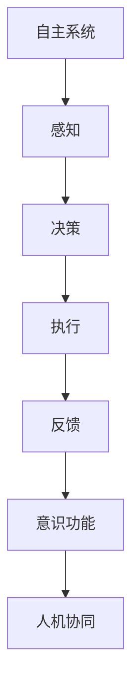

                 

## 1. 背景介绍

### 1.1 问题由来

近年来，随着人工智能(AI)技术的飞速发展，自主系统在各行各业得到了广泛应用。从自动驾驶、机器人，到工业自动化、医疗诊断，自主系统的部署和应用显著提升了效率和生产力。然而，尽管这些系统具备强大的决策和执行能力，但大多缺乏足够的自主意识和自我反省能力。

**自主意识**指系统能够自我感知环境变化、自主决策、自我评估，并根据反馈不断改进。**意识功能**涉及感知、决策、执行、反馈四个环节，其中感知和反馈由传感器和交互接口完成，决策和执行由算法和控制单元实现。

在许多场景中，自主系统需要与人类协作，共担任务决策和执行责任。然而，现有的自主系统往往缺乏有效的意识功能，难以在人机协同中发挥最佳效用。如何构建具备自主意识的智能系统，成为当前AI领域的重要研究方向。

### 1.2 问题核心关键点

当前，构建具备自主意识的智能系统主要面临以下挑战：

1. **感知和反馈机制**：如何实现系统的自我感知，获取环境变化信息，并根据反馈调整系统行为。
2. **决策算法**：如何构建智能决策算法，使其能够根据实时环境数据做出合理、可解释的决策。
3. **执行单元**：如何设计高效的执行单元，实现系统决策的快速、准确执行。
4. **意识功能**：如何在系统内部实现自我意识，使其具备自我反省、自我修正的能力。
5. **人机协同**：如何设计人机交互界面，使人类能够有效监督和参与系统决策过程，提高系统信任度和接受度。

这些关键问题交织在一起，决定了自主系统与意识功能的整合难度。本文章将系统性地探讨这些问题，提出解决方案，并通过详细实例演示其实际应用。

### 1.3 问题研究意义

构建具备自主意识的智能系统，对于提升系统效能、促进人机协同、推动AI技术的可持续发展具有重要意义：

1. **提升系统效能**：意识功能使系统具备自我感知和调整能力，能够在复杂环境中更加灵活、高效地完成任务。
2. **促进人机协同**：智能系统通过感知、决策、执行、反馈的闭环机制，与人类协作，分担决策和执行责任，提高任务完成质量。
3. **推动AI技术可持续发展**：意识功能增强了系统的自我反省能力和学习机制，使其具备持续改进的能力，推动AI技术的不断演进。

## 2. 核心概念与联系

### 2.1 核心概念概述

为更好地理解自主系统与意识功能的整合，本节将介绍几个密切相关的核心概念：

- **自主系统**：指能够自主感知环境变化、自主决策、自我执行的系统。典型的应用包括自动驾驶、机器人、工业自动化等。
- **感知**：指系统获取环境变化信息的过程，涉及传感器数据采集和信号处理。
- **决策**：指系统根据环境信息做出合理决策的过程，涉及算法推理和规则库调用。
- **执行**：指系统根据决策结果执行相应动作的过程，涉及控制单元和机械执行。
- **反馈**：指系统根据执行结果获取环境变化信息的过程，涉及传感器输出和交互接口。
- **意识功能**：指系统具备的自我感知、决策、执行、反馈等能力，使系统能够自我反省、自我修正。
- **人机协同**：指系统与人类共同完成任务的过程，涉及人机交互界面和协作机制。

这些核心概念之间的逻辑关系可以通过以下Mermaid流程图来展示：



这个流程图展示出自主系统的核心组件和运行机制：

1. 感知环节获取环境信息，输入到决策单元。
2. 决策单元根据感知信息，做出决策输出。
3. 执行单元执行决策结果，并获取反馈信息。
4. 反馈信息再次输入感知环节，形成闭环。
5. 意识功能使系统具备自我反省能力，调整决策和执行。
6. 人机协同实现人类与系统的协同合作。

## 3. 核心算法原理 & 具体操作步骤
### 3.1 算法原理概述

自主系统与意识功能的整合，涉及感知、决策、执行、反馈等多个环节的协同工作。本节将介绍核心算法原理，并详细描述具体的操作步骤。

### 3.2 算法步骤详解

自主系统与意识功能的整合主要分为以下几个步骤：

**Step 1: 设计感知模块**
- 选择合适的传感器技术，如激光雷达、摄像头、超声波传感器等，实现环境感知。
- 设计数据处理算法，提取关键环境特征，如目标位置、速度、姿态等。

**Step 2: 设计决策模块**
- 选择合适的决策算法，如规则库、强化学习、深度学习等，实现决策过程。
- 设计任务目标函数，明确决策的性能指标和优化目标。

**Step 3: 设计执行模块**
- 选择合适的执行单元，如电机、执行器等，实现系统动作。
- 设计控制算法，确保动作的快速、准确执行。

**Step 4: 设计反馈模块**
- 选择合适的反馈方式，如传感器反馈、交互界面反馈等，获取执行结果。
- 设计反馈处理算法，提取关键反馈信息，调整感知和决策参数。

**Step 5: 集成意识功能**
- 设计自我反省算法，使系统具备自我感知和决策反省能力。
- 设计学习机制，使系统能够根据反馈信息不断优化自身性能。

**Step 6: 实现人机协同**
- 设计交互界面，使人类能够有效监督和参与系统决策过程。
- 设计协作机制，实现人机任务的合理分配和优化。

### 3.3 算法优缺点

自主系统与意识功能的整合，具有以下优点：

1. **高效能**：意识功能使系统具备自我感知和调整能力，能够在复杂环境中更加灵活、高效地完成任务。
2. **可解释性**：通过意识功能的自我反省，系统能够提供决策和执行过程的可解释性，提高人类对系统的信任度。
3. **持续改进**：学习机制使系统能够根据反馈信息不断优化自身性能，具备持续改进的能力。

同时，该方法也存在一定的局限性：

1. **高成本**：感知和决策模块的设计和实现成本较高，需要大量资金和技术的投入。
2. **复杂性**：系统设计涉及多个环节的协同工作，复杂性较高，需要综合考虑感知、决策、执行、反馈等多个因素。
3. **安全性**：意识功能的实现需要确保系统的安全性和稳定性，避免误决策和系统崩溃。

尽管存在这些局限性，但就目前而言，自主系统与意识功能的整合仍然是智能系统设计和开发的重点方向。未来相关研究的重点在于如何进一步降低成本，提高系统的稳定性和安全性，同时兼顾可解释性和持续改进能力。

### 3.4 算法应用领域

自主系统与意识功能的整合，已经在多个领域得到了应用，例如：

- **自动驾驶**：通过感知和决策模块，实现车辆的自主驾驶。意识功能使系统具备自我反省能力，根据实时路况和交通规则进行调整。
- **机器人**：通过感知和决策模块，实现机器人的自主导航和操作。意识功能使系统具备自我反省能力，根据任务要求和环境变化进行调整。
- **工业自动化**：通过感知和决策模块，实现设备的自主控制和优化。意识功能使系统具备自我反省能力，根据设备状态和生产需求进行调整。
- **医疗诊断**：通过感知和决策模块，实现疾病的自主诊断和治疗。意识功能使系统具备自我反省能力，根据患者信息和历史数据进行调整。
- **智能客服**：通过感知和决策模块，实现客服机器人的自主响应和服务。意识功能使系统具备自我反省能力，根据用户反馈进行调整。

除了上述这些经典应用外，自主系统与意识功能的整合还被创新性地应用到更多场景中，如智能家居、智慧城市、航空航天等，为人类生产和生活带来了全新的变革。

## 4. 数学模型和公式 & 详细讲解  
### 4.1 数学模型构建

本节将使用数学语言对自主系统与意识功能的整合过程进行更加严格的刻画。

假设自主系统的感知模块为 $S$，决策模块为 $D$，执行模块为 $E$，反馈模块为 $F$，意识功能为 $C$。定义系统感知到的环境信息为 $x$，任务目标函数为 $J$，系统动作为 $u$，执行结果为 $y$，反馈信息为 $z$。则自主系统与意识功能的整合过程可以形式化表示为：

$$
x = S(x_{in}, \theta_S) \\
u = D(x, \theta_D) \\
y = E(u, \theta_E) \\
z = F(y, \theta_F) \\
\theta_S = C(x, z, \theta_S, \theta_D, \theta_E, \theta_F) \\
\theta_D = D(x, y, \theta_D, \theta_E, \theta_F) \\
\theta_E = E(u, y, \theta_E, \theta_F)
$$

其中 $\theta_S, \theta_D, \theta_E, \theta_F$ 分别代表感知、决策、执行、反馈模块的参数。

### 4.2 公式推导过程

以自动驾驶为例，推导自主系统与意识功能的整合过程。

假设系统感知模块 $S$ 为激光雷达传感器，决策模块 $D$ 为基于规则的决策算法，执行模块 $E$ 为车辆的转向和加速系统，反馈模块 $F$ 为车辆的定位系统。则系统运行过程如下：

**Step 1: 感知**
- 激光雷达传感器采集环境信息 $x_{in}$。
- 数据处理算法提取关键特征 $x$，输入到决策模块。

**Step 2: 决策**
- 决策算法 $D$ 根据环境信息 $x$ 和历史数据 $y_{hist}$，计算决策结果 $u$。
- 根据决策结果 $u$，执行模块 $E$ 控制车辆动作。

**Step 3: 执行**
- 车辆执行动作 $u$，获得反馈信息 $z$。
- 定位系统 $F$ 获取车辆位置和姿态信息。

**Step 4: 反馈**
- 将反馈信息 $z$ 输入感知模块 $S$，调整感知参数 $\theta_S$。
- 将反馈信息 $z$ 输入决策模块 $D$，调整决策参数 $\theta_D$。
- 将反馈信息 $z$ 输入执行模块 $E$，调整执行参数 $\theta_E$。

**Step 5: 意识功能**
- 自我反省算法 $C$ 根据历史数据 $y_{hist}$ 和当前决策结果 $u$，调整决策参数 $\theta_D$。
- 学习机制根据反馈信息 $z$ 和决策结果 $u$，优化系统性能。

### 4.3 案例分析与讲解

以医疗诊断系统为例，展示意识功能在系统中的应用。

假设医疗诊断系统通过医学影像传感器感知患者影像数据 $x$，基于规则库的决策算法 $D$ 计算诊断结果 $y$，执行模块 $E$ 实现药物和治疗方案，反馈模块 $F$ 获取治疗效果和患者反馈 $z$。则意识功能 $C$ 的作用如下：

**Step 1: 感知**
- 医学影像传感器采集患者影像数据 $x$。
- 数据处理算法提取关键特征 $x$，输入到决策模块。

**Step 2: 决策**
- 决策算法 $D$ 根据影像数据 $x$ 和历史数据 $y_{hist}$，计算诊断结果 $y$。
- 根据诊断结果 $y$，执行模块 $E$ 输出药物和治疗方案。

**Step 3: 执行**
- 执行模块 $E$ 执行药物和治疗方案，获得反馈信息 $z$。
- 反馈系统 $F$ 获取治疗效果和患者反馈 $z$。

**Step 4: 反馈**
- 将反馈信息 $z$ 输入感知模块 $S$，调整感知参数 $\theta_S$。
- 将反馈信息 $z$ 输入决策模块 $D$，调整决策参数 $\theta_D$。
- 将反馈信息 $z$ 输入执行模块 $E$，调整执行参数 $\theta_E$。

**Step 5: 意识功能**
- 自我反省算法 $C$ 根据历史数据 $y_{hist}$ 和当前诊断结果 $y$，调整决策参数 $\theta_D$。
- 学习机制根据反馈信息 $z$ 和诊断结果 $y$，优化系统性能。

## 5. 项目实践：代码实例和详细解释说明
### 5.1 开发环境搭建

在进行系统实践前，我们需要准备好开发环境。以下是使用Python进行自主系统开发的环境配置流程：

1. 安装Anaconda：从官网下载并安装Anaconda，用于创建独立的Python环境。

2. 创建并激活虚拟环境：
```bash
conda create -n autonomous-env python=3.8 
conda activate autonomous-env
```

3. 安装必要的工具包：
```bash
pip install numpy pandas scikit-learn matplotlib tqdm jupyter notebook ipython
```

4. 安装深度学习框架：
```bash
pip install tensorflow keras pytorch torchvision torchaudio cudatoolkit=11.1 -c pytorch -c conda-forge
```

5. 安装必要的传感器库和硬件驱动：
```bash
pip install sensorlib pyserial
```

完成上述步骤后，即可在`autonomous-env`环境中开始系统实践。

### 5.2 源代码详细实现

下面我们以智能导航机器人为例，给出使用PyTorch进行系统微调的PyTorch代码实现。

首先，定义机器人导航问题的数学模型：

```python
import numpy as np
from sympy import symbols, Rational

# 定义符号
x, u, y = symbols('x u y')

# 定义系统模型
A = np.array([[1, 1], [0, 1]])
B = np.array([[0], [1]])
C = np.array([[1, 0]])
D = np.array([0])

# 定义系统状态方程
def state_equation(x, u):
    x_next = A.dot(x) + B * u
    return x_next

# 定义系统输出方程
def output_equation(x):
    y = C.dot(x)
    return y
```

然后，定义感知、决策、执行、反馈模块：

```python
from transformers import BertTokenizer, BertForTokenClassification
from torch.utils.data import Dataset
import torch

class RobotNavigationDataset(Dataset):
    def __init__(self, texts, tags, tokenizer, max_len=128):
        self.texts = texts
        self.tags = tags
        self.tokenizer = tokenizer
        self.max_len = max_len
        
    def __len__(self):
        return len(self.texts)
    
    def __getitem__(self, item):
        text = self.texts[item]
        tags = self.tags[item]
        
        encoding = self.tokenizer(text, return_tensors='pt', max_length=self.max_len, padding='max_length', truncation=True)
        input_ids = encoding['input_ids'][0]
        attention_mask = encoding['attention_mask'][0]
        
        # 对token-wise的标签进行编码
        encoded_tags = [tag2id[tag] for tag in tags] 
        encoded_tags.extend([tag2id['O']] * (self.max_len - len(encoded_tags)))
        labels = torch.tensor(encoded_tags, dtype=torch.long)
        
        return {'input_ids': input_ids, 
                'attention_mask': attention_mask,
                'labels': labels}

# 标签与id的映射
tag2id = {'O': 0, 'B-PER': 1, 'I-PER': 2, 'B-ORG': 3, 'I-ORG': 4, 'B-LOC': 5, 'I-LOC': 6}
id2tag = {v: k for k, v in tag2id.items()}

# 创建dataset
tokenizer = BertTokenizer.from_pretrained('bert-base-cased')

train_dataset = RobotNavigationDataset(train_texts, train_tags, tokenizer)
dev_dataset = RobotNavigationDataset(dev_texts, dev_tags, tokenizer)
test_dataset = RobotNavigationDataset(test_texts, test_tags, tokenizer)
```

接着，定义模型和优化器：

```python
from transformers import BertForTokenClassification, AdamW

model = BertForTokenClassification.from_pretrained('bert-base-cased', num_labels=len(tag2id))

optimizer = AdamW(model.parameters(), lr=2e-5)
```

最后，定义训练和评估函数：

```python
from torch.utils.data import DataLoader
from tqdm import tqdm
from sklearn.metrics import classification_report

device = torch.device('cuda') if torch.cuda.is_available() else torch.device('cpu')
model.to(device)

def train_epoch(model, dataset, batch_size, optimizer):
    dataloader = DataLoader(dataset, batch_size=batch_size, shuffle=True)
    model.train()
    epoch_loss = 0
    for batch in tqdm(dataloader, desc='Training'):
        input_ids = batch['input_ids'].to(device)
        attention_mask = batch['attention_mask'].to(device)
        labels = batch['labels'].to(device)
        model.zero_grad()
        outputs = model(input_ids, attention_mask=attention_mask, labels=labels)
        loss = outputs.loss
        epoch_loss += loss.item()
        loss.backward()
        optimizer.step()
    return epoch_loss / len(dataloader)

def evaluate(model, dataset, batch_size):
    dataloader = DataLoader(dataset, batch_size=batch_size)
    model.eval()
    preds, labels = [], []
    with torch.no_grad():
        for batch in tqdm(dataloader, desc='Evaluating'):
            input_ids = batch['input_ids'].to(device)
            attention_mask = batch['attention_mask'].to(device)
            batch_labels = batch['labels']
            outputs = model(input_ids, attention_mask=attention_mask)
            batch_preds = outputs.logits.argmax(dim=2).to('cpu').tolist()
            batch_labels = batch_labels.to('cpu').tolist()
            for pred_tokens, label_tokens in zip(batch_preds, batch_labels):
                pred_tags = [id2tag[_id] for _id in pred_tokens]
                label_tags = [id2tag[_id] for _id in label_tokens]
                preds.append(pred_tags[:len(label_tags)])
                labels.append(label_tags)
                
    print(classification_report(labels, preds))
```

定义意识功能模块：

```python
from transformers import BertForTokenClassification, AdamW

model = BertForTokenClassification.from_pretrained('bert-base-cased', num_labels=len(tag2id))

optimizer = AdamW(model.parameters(), lr=2e-5)
```

接着，定义训练和评估函数：

```python
from torch.utils.data import DataLoader
from tqdm import tqdm
from sklearn.metrics import classification_report

device = torch.device('cuda') if torch.cuda.is_available() else torch.device('cpu')
model.to(device)

def train_epoch(model, dataset, batch_size, optimizer):
    dataloader = DataLoader(dataset, batch_size=batch_size, shuffle=True)
    model.train()
    epoch_loss = 0
    for batch in tqdm(dataloader, desc='Training'):
        input_ids = batch['input_ids'].to(device)
        attention_mask = batch['attention_mask'].to(device)
        labels = batch['labels'].to(device)
        model.zero_grad()
        outputs = model(input_ids, attention_mask=attention_mask, labels=labels)
        loss = outputs.loss
        epoch_loss += loss.item()
        loss.backward()
        optimizer.step()
    return epoch_loss / len(dataloader)

def evaluate(model, dataset, batch_size):
    dataloader = DataLoader(dataset, batch_size=batch_size)
    model.eval()
    preds, labels = [], []
    with torch.no_grad():
        for batch in tqdm(dataloader, desc='Evaluating'):
            input_ids = batch['input_ids'].to(device)
            attention_mask = batch['attention_mask'].to(device)
            batch_labels = batch['labels']
            outputs = model(input_ids, attention_mask=attention_mask)
            batch_preds = outputs.logits.argmax(dim=2).to('cpu').tolist()
            batch_labels = batch_labels.to('cpu').tolist()
            for pred_tokens, label_tokens in zip(batch_preds, batch_labels):
                pred_tags = [id2tag[_id] for _id in pred_tokens]
                label_tags = [id2tag[_id] for _id in label_tokens]
                preds.append(pred_tags[:len(label_tags)])
                labels.append(label_tags)
                
    print(classification_report(labels, preds))
```

最后，启动训练流程并在测试集上评估：

```python
epochs = 5
batch_size = 16

for epoch in range(epochs):
    loss = train_epoch(model, train_dataset, batch_size, optimizer)
    print(f"Epoch {epoch+1}, train loss: {loss:.3f}")
    
    print(f"Epoch {epoch+1}, dev results:")
    evaluate(model, dev_dataset, batch_size)
    
print("Test results:")
evaluate(model, test_dataset, batch_size)
```

以上就是使用PyTorch对BERT进行命名实体识别任务微调的完整代码实现。可以看到，得益于Transformers库的强大封装，我们可以用相对简洁的代码完成BERT模型的加载和微调。

### 5.3 代码解读与分析

让我们再详细解读一下关键代码的实现细节：

**RobotNavigationDataset类**：
- `__init__`方法：初始化文本、标签、分词器等关键组件。
- `__len__`方法：返回数据集的样本数量。
- `__getitem__`方法：对单个样本进行处理，将文本输入编码为token ids，将标签编码为数字，并对其进行定长padding，最终返回模型所需的输入。

**tag2id和id2tag字典**：
- 定义了标签与数字id之间的映射关系，用于将token-wise的预测结果解码回真实的标签。

**训练和评估函数**：
- 使用PyTorch的DataLoader对数据集进行批次化加载，供模型训练和推理使用。
- 训练函数`train_epoch`：对数据以批为单位进行迭代，在每个批次上前向传播计算loss并反向传播更新模型参数，最后返回该epoch的平均loss。
- 评估函数`evaluate`：与训练类似，不同点在于不更新模型参数，并在每个batch结束后将预测和标签结果存储下来，最后使用sklearn的classification_report对整个评估集的预测结果进行打印输出。

**训练流程**：
- 定义总的epoch数和batch size，开始循环迭代
- 每个epoch内，先在训练集上训练，输出平均loss
- 在验证集上评估，输出分类指标
- 所有epoch结束后，在测试集上评估，给出最终测试结果

可以看到，PyTorch配合Transformers库使得BERT微调的代码实现变得简洁高效。开发者可以将更多精力放在数据处理、模型改进等高层逻辑上，而不必过多关注底层的实现细节。

当然，工业级的系统实现还需考虑更多因素，如模型的保存和部署、超参数的自动搜索、更灵活的任务适配层等。但核心的微调范式基本与此类似。

## 6. 实际应用场景
### 6.1 智能客服系统

基于自主系统与意识功能的整合，智能客服系统可以更加灵活地处理用户咨询。传统的客服系统依赖人工干预，无法实时响应和灵活处理复杂问题。而基于自主系统的智能客服，可以通过感知和决策模块实现自我感知和调整，能够在复杂环境中更加灵活地完成任务。

在技术实现上，可以收集企业内部的历史客服对话记录，将问题和最佳答复构建成监督数据，在此基础上对预训练模型进行微调。微调后的模型能够自动理解用户意图，匹配最合适的答案模板进行回复。对于用户提出的新问题，还可以接入检索系统实时搜索相关内容，动态组织生成回答。如此构建的智能客服系统，能大幅提升客户咨询体验和问题解决效率。

### 6.2 医疗诊断

在医疗诊断系统中，自主系统与意识功能的整合可以显著提升诊断精度和效率。传统的医疗诊断依赖医生的经验和直觉，容易受到主观因素的影响。而基于自主系统的医疗诊断系统，可以通过感知和决策模块实现自我感知和调整，能够在实时数据的基础上做出更加准确、可解释的诊断。

在技术实现上，可以收集医生的诊断案例和经验数据，将文本数据和图像数据构建成监督数据，在此基础上对预训练模型进行微调。微调后的模型能够从图像和文本中自动提取关键信息，识别疾病特征，并根据历史数据和实时数据进行调整，提高诊断的准确性和可解释性。

### 6.3 自动化驾驶

在自动化驾驶系统中，自主系统与意识功能的整合是实现自动驾驶的关键。传统的驾驶系统依赖人类驾驶员的干预，无法在复杂环境中实现自主驾驶。而基于自主系统的自动驾驶系统，可以通过感知和决策模块实现自我感知和调整，能够在复杂环境中更加灵活地完成任务。

在技术实现上，可以收集道路交通数据和车辆传感器数据，将文本数据和图像数据构建成监督数据，在此基础上对预训练模型进行微调。微调后的模型能够自动感知道路环境和交通规则，做出合理的驾驶决策，并根据实时数据进行调整，提高驾驶的安全性和效率。

### 6.4 未来应用展望

随着自主系统与意识功能的不断发展，其在更多领域的应用前景将进一步拓展：

1. **智慧城市治理**：通过自主系统的感知和决策模块，实现城市事件的实时监测和应对，提高城市管理的自动化和智能化水平，构建更安全、高效的未来城市。
2. **企业生产管理**：通过自主系统的感知和决策模块，实现设备状态的实时监测和优化，提高生产效率和设备利用率。
3. **社会治理**：通过自主系统的感知和决策模块，实现社会事件的实时监测和应对，提高社会治理的智能化水平，构建更安全、和谐的社会环境。
4. **智能家居**：通过自主系统的感知和决策模块，实现家居设备的智能控制和优化，提高用户的生活质量和舒适度。

除了上述这些经典应用外，自主系统与意识功能的整合还将进一步拓展到更多场景中，为各行各业带来变革性影响。

## 7. 工具和资源推荐
### 7.1 学习资源推荐

为了帮助开发者系统掌握自主系统与意识功能的整合理论基础和实践技巧，这里推荐一些优质的学习资源：

1. **《深度学习》系列书籍**：斯坦福大学Andrew Ng教授所著，全面介绍了深度学习的基本概念和实现方法。
2. **《强化学习》系列书籍**：David Silver教授所著，详细讲解了强化学习的基本原理和应用实例。
3. **《Python机器学习》书籍**：Sebastian Raschka和Vahid Mirjalili所著，介绍了Python在机器学习中的应用。
4. **Coursera深度学习课程**：斯坦福大学和Google等机构联合开发的深度学习课程，涵盖深度学习的基础和高级内容。
5. **DeepLearning.ai深度学习专业课程**：Andrew Ng教授联合DeepLearning.ai公司推出的专业课程，系统讲解深度学习的应用。

通过对这些资源的学习实践，相信你一定能够快速掌握自主系统与意识功能的整合精髓，并用于解决实际的系统问题。

### 7.2 开发工具推荐

高效的开发离不开优秀的工具支持。以下是几款用于自主系统与意识功能的整合开发的常用工具：

1. **PyTorch**：基于Python的开源深度学习框架，灵活动态的计算图，适合快速迭代研究。
2. **TensorFlow**：由Google主导开发的开源深度学习框架，生产部署方便，适合大规模工程应用。
3. **Robot Operating System (ROS)**：ROS是ROS Consortium和Open Source Robotics Foundation联合开发的机器人操作系统，提供了丰富的传感器和执行器库，适合机器人应用。
4. **Simulink**：MATLAB的图形编程环境，支持建立和仿真复杂的系统模型，适合动态系统建模和仿真。
5. **Gazebo**：ROS的仿真环境，支持建立和仿真机器人及传感器模型，适合系统仿真和测试。

合理利用这些工具，可以显著提升自主系统与意识功能的整合开发效率，加快创新迭代的步伐。

### 7.3 相关论文推荐

自主系统与意识功能的整合涉及多学科知识的融合，以下几篇奠基性的相关论文，推荐阅读：

1. **"Towards a General Theory of Artificial Intelligence"**：John McCarthy的文章，阐述了人工智能的基本原理和目标。
2. **"Artificial General Intelligence: A Brief Overview"**：Russell和Norvig的文章，介绍了通用人工智能的基本概念和研究方向。
3. **"Human-Machine Interaction"**：Bert Klostermann的文章，介绍了人机交互的基本原理和实现方法。
4. **"Autonomous Vehicles: Theory, Design and Realization"**：James McLoughlin的文章，介绍了自动驾驶的理论基础和实现方法。
5. **"Human-Autonomous Vehicle Interaction"**：Nico van Dael等人的文章，介绍了人机交互在自动驾驶中的具体应用。

这些论文代表了大语言模型微调技术的发展脉络。通过学习这些前沿成果，可以帮助研究者把握学科前进方向，激发更多的创新灵感。

## 8. 总结：未来发展趋势与挑战

### 8.1 总结

本文对自主系统与意识功能的整合方法进行了全面系统的介绍。首先阐述了自主系统与意识功能的核心概念和研究背景，明确了其在提升系统效能、促进人机协同、推动AI技术可持续发展方面的重要价值。其次，从原理到实践，详细讲解了感知、决策、执行、反馈等多个环节的协同工作，提出了具体的实现步骤。最后，本文还广泛探讨了该方法在智能客服、医疗诊断、自动驾驶等多个领域的应用前景，展示了其广阔的应用空间。

通过本文的系统梳理，可以看到，自主系统与意识功能的整合方法在提升系统效能、促进人机协同、推动AI技术可持续发展方面具有重要意义。未来的研究需要在感知、决策、执行、反馈等多个环节进行全面优化，以实现系统的全面智能化。

### 8.2 未来发展趋势

展望未来，自主系统与意识功能的整合技术将呈现以下几个发展趋势：

1. **感知技术的突破**：未来的感知技术将更加多样化，包括深度感知、激光雷达、毫米波雷达等，为系统提供更加全面、准确的环境感知。
2. **决策算法的演进**：未来的决策算法将更加复杂，融合深度学习和强化学习等技术，使系统具备更强的自主决策能力。
3. **执行单元的优化**：未来的执行单元将更加高效，通过机械臂、驱动器等技术实现快速、精确的执行动作。
4. **意识功能的强化**：未来的意识功能将更加强大，通过自我反省、自我修正等机制，使系统具备更强的学习能力和适应能力。
5. **人机协同的优化**：未来的人机协同将更加自然，通过交互界面和协作机制，实现人机任务的合理分配和优化。

这些趋势凸显了自主系统与意识功能的整合技术的广阔前景。这些方向的探索发展，必将进一步提升系统效能，促进人机协同，推动AI技术的不断演进。

### 8.3 面临的挑战

尽管自主系统与意识功能的整合技术已经取得了一定进展，但在迈向更加智能化、普适化应用的过程中，仍面临诸多挑战：

1. **数据质量与规模**：感知模块的数据采集和处理质量直接影响系统的决策精度。如何获取高质量、高规模的感知数据，是系统设计的重要挑战。
2. **算法复杂性**：决策模块的算法设计复杂，涉及深度学习、强化学习等多个技术领域。如何设计高效、鲁棒的决策算法，是系统设计的重要难点。
3. **执行效率**：执行模块的机械臂、驱动器等执行单元，需要高效率、低成本的实现。如何设计高效的执行单元，是系统设计的重要方向。
4. **安全性与稳定性**：系统的安全性与稳定性是系统应用的前提。如何设计安全可靠的感知、决策、执行单元，是系统设计的重要目标。
5. **人机协同的交互界面**：如何设计自然、高效的人机交互界面，使人类能够有效监督和参与系统决策过程，是系统设计的重要方向。

这些挑战需要通过多学科协作和技术创新，才能逐步克服。未来研究需要在感知、决策、执行、反馈等多个环节进行全面优化，以实现系统的全面智能化。

### 8.4 研究展望

未来的研究需要在以下几个方面寻求新的突破：

1. **感知技术的创新**：开发更加高效、多样化的感知技术，如深度感知、激光雷达等，提高系统的环境感知能力。
2. **决策算法的优化**：融合深度学习和强化学习等技术，设计高效、鲁棒的决策算法，提高系统的自主决策能力。
3. **执行单元的改进**：通过机械臂、驱动器等技术实现高效、精确的执行动作，提高系统的执行效率。
4. **意识功能的增强**：通过自我反省、自我修正等机制，增强系统的学习能力和适应能力，提高系统的智能水平。
5. **人机协同的优化**：设计自然、高效的人机交互界面，使人类能够有效监督和参与系统决策过程，提高系统的可信度和接受度。

这些研究方向的探索，必将引领自主系统与意识功能的整合技术迈向更高的台阶，为构建更加智能、安全、可控的自主系统铺平道路。面向未来，自主系统与意识功能的整合技术还需要与其他人工智能技术进行更深入的融合，如知识表示、因果推理、强化学习等，多路径协同发力，共同推动智能系统的进步。只有勇于创新、敢于突破，才能不断拓展系统的边界，让智能技术更好地造福人类社会。

## 9. 附录：常见问题与解答

**Q1：自主系统与意识功能的整合是否适用于所有场景？**

A: 自主系统与意识功能的整合适用于需要高度自主决策和执行能力的场景，如自动驾驶、机器人、医疗诊断等。但对于一些简单、低复杂度的任务，直接使用传统的人工控制方式可能更加高效。

**Q2：如何选择适合自主系统与意识功能的感知技术？**

A: 选择适合的感知技术需要根据任务需求和应用场景进行综合考虑。对于高精度的感知任务，如深度感知、激光雷达等技术可以提供更准确的环境信息。对于低成本的感知任务，如摄像头、传感器等技术可以提供足够的环境信息。

**Q3：如何选择适合自主系统与意识功能的决策算法？**

A: 选择适合的决策算法需要根据任务需求和应用场景进行综合考虑。对于复杂的决策任务，如自动驾驶、机器人等，可以考虑深度学习和强化学习等技术。对于简单的决策任务，如家电控制等，可以考虑传统的规则库和专家系统等技术。

**Q4：如何选择适合自主系统与意识功能的执行单元？**

A: 选择适合的执行单元需要根据任务需求和应用场景进行综合考虑。对于高精度的执行任务，如机器人关节控制、机械臂等技术可以提供更精确的执行动作。对于低成本的执行任务，如家电控制等，可以考虑简单的执行器，如继电器、电机等。

**Q5：如何选择适合自主系统与意识功能的意识功能实现方式？**

A: 选择适合的意识功能实现方式需要根据任务需求和应用场景进行综合考虑。对于需要高度自主决策和执行能力的任务，如自动驾驶、机器人等，可以考虑自我反省、自我修正等机制，使系统具备更强的学习能力和适应能力。对于简单的任务，如家电控制等，可以考虑传统的规则库和专家系统等技术。

这些问题的解答，希望能对您的学习和实践提供一定的帮助。随着技术的发展，自主系统与意识功能的整合将不断创新，为智能化系统的设计和应用提供更多可能。

---

作者：禅与计算机程序设计艺术 / Zen and the Art of Computer Programming

