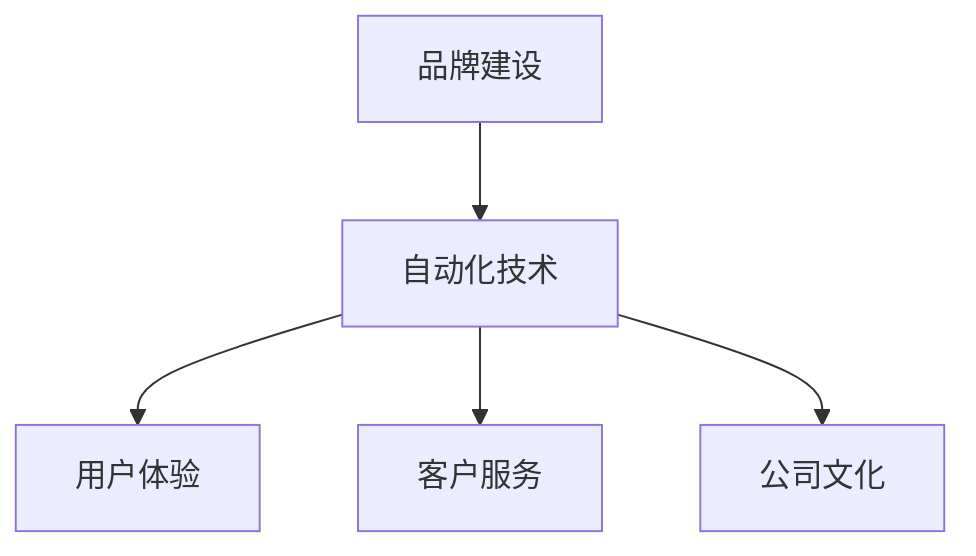

                 

## 1. 背景介绍

随着科技的发展，创业不再是一个纯粹的技术挑战，而是一个多维度、多领域的综合性问题。在技术快速迭代、市场需求日益多样化的今天，品牌建设与维护成为创业者必须面对的重要课题。

自动化创业，即利用自动化技术提高工作效率，降低运营成本，提升用户体验，从而在市场竞争中占据有利位置。然而，品牌建设不仅涉及到产品设计、市场营销，还涵盖了用户体验、客户服务、公司文化等多个层面。在这篇文章中，我们将探讨自动化创业中品牌建设与维护的策略，以及如何通过技术手段来支持品牌价值的持续提升。

## 2. 核心概念与联系

### 2.1 核心概念概述

- **品牌建设**：指通过一系列有策略的活动，塑造品牌形象，增强市场认知度和用户忠诚度。品牌建设是自动化创业成功与否的关键因素之一。

- **自动化技术**：利用计算机软件和算法，自动执行原本需要人类操作的繁琐任务。自动化技术可以显著提高效率，降低成本，提升用户体验。

- **用户体验**：用户在使用产品或服务时的感受和体验。优秀的用户体验是品牌成功的基石，也是自动化技术应用的核心目标。

- **客户服务**：通过及时、有效的沟通，解决用户问题，提升用户满意度。高效的客户服务体系是品牌维护的重要环节。

- **公司文化**：公司内部员工的价值观念、行为准则和工作氛围。良好的公司文化可以吸引和留住优秀人才，提升品牌形象。

这些核心概念通过自动化技术的应用，彼此联系紧密，共同支撑品牌价值的实现。

### 2.2 核心概念原理和架构的 Mermaid 流程图



这个图表展示了品牌建设与自动化技术的紧密联系，以及用户体验、客户服务和公司文化在品牌建设中的重要角色。自动化技术通过提升效率、优化服务、塑造文化，支持品牌价值的持续提升。

## 3. 核心算法原理 & 具体操作步骤

### 3.1 算法原理概述

品牌建设与维护的算法原理主要包括以下几个方面：

- **数据驱动**：通过收集和分析用户行为数据，洞察用户需求和偏好，从而指导品牌策略的制定。
- **个性化推荐**：利用机器学习算法，根据用户的历史行为和当前需求，个性化推荐相关产品或服务，提升用户体验。
- **情感分析**：通过自然语言处理技术，分析用户对品牌或产品的情感倾向，及时调整品牌策略。
- **客户服务自动化**：利用聊天机器人、智能客服等技术，提高客户服务效率，提升用户满意度。

这些算法原理通过自动化技术的应用，形成了一个闭环，不断优化品牌价值。

### 3.2 算法步骤详解

#### 3.2.1 数据收集与预处理

自动化创业中，品牌建设的首要步骤是收集和预处理数据。这包括：

- **用户行为数据**：通过网站、应用等平台，收集用户的使用习惯、浏览记录、购买历史等数据。
- **用户反馈数据**：通过问卷调查、社交媒体、客户服务记录等渠道，收集用户对产品或服务的反馈和评价。

收集到的数据需要进行清洗和预处理，去除噪声和无关信息，确保数据的准确性和可靠性。

#### 3.2.2 数据分析与洞察

通过数据分析工具和算法，从收集到的数据中提取有价值的信息：

- **用户画像**：根据用户行为数据，构建用户画像，了解用户的基本特征和需求。
- **情感分析**：使用自然语言处理技术，对用户反馈数据进行情感分析，了解用户对品牌或产品的情感倾向。
- **行为模式**：通过时间序列分析和聚类算法，发现用户的潜在需求和行为模式。

这些洞察结果将指导品牌策略的制定和优化。

#### 3.2.3 个性化推荐

利用机器学习算法，根据用户画像和行为模式，进行个性化推荐：

- **协同过滤**：通过分析用户的历史行为和偏好，推荐相似用户喜欢的产品或服务。
- **内容推荐**：根据用户浏览的内容，推荐相关的文章、视频或商品。
- **交叉销售**：基于用户购买历史，推荐相关或互补的产品，增加用户消费。

个性化推荐需要实时更新和优化，以适应用户需求的变化。

#### 3.2.4 客户服务自动化

通过聊天机器人、智能客服等技术，提高客户服务效率，提升用户满意度：

- **自然语言处理**：利用自然语言处理技术，理解用户的问题和需求，提供准确的答案。
- **情感识别**：通过情感分析，判断用户情绪，提供合适的回应。
- **多渠道支持**：在网站、应用、社交媒体等多个渠道，提供一致的服务体验。

客户服务自动化需要不断优化算法，提高服务质量和用户满意度。

### 3.3 算法优缺点

#### 3.3.1 优点

- **高效性**：自动化技术可以大幅提升品牌建设与维护的效率，降低人力成本。
- **个性化**：通过个性化推荐和情感分析，提升用户体验和满意度，增强用户忠诚度。
- **实时性**：利用数据驱动的方法，可以实时调整品牌策略，快速响应市场变化。

#### 3.3.2 缺点

- **数据隐私**：在数据收集和分析过程中，可能涉及用户隐私和数据安全问题。
- **算法偏见**：机器学习算法可能存在偏见，影响推荐结果和用户体验。
- **技术复杂度**：自动化技术的应用需要较高的技术门槛，对团队能力要求较高。

### 3.4 算法应用领域

品牌建设与维护的算法应用领域非常广泛，包括但不限于以下几个方面：

- **电商**：通过个性化推荐和客户服务自动化，提升用户购买体验，提高销售额。
- **金融**：利用情感分析，监测市场情绪，调整投资策略，保护用户资产。
- **医疗**：通过数据分析，了解用户健康需求，推荐健康产品，提升用户健康水平。
- **教育**：利用个性化推荐和智能客服，提升教育质量和用户体验。

自动化技术在各个领域的应用，展示了其在品牌建设与维护中的巨大潜力。

## 4. 数学模型和公式 & 详细讲解 & 举例说明

### 4.1 数学模型构建

品牌建设与维护的数学模型可以概括为以下几个部分：

- **用户画像模型**：用于描述用户的基本特征和行为模式，公式如下：
  $$
  P(u) = \sum_{i=1}^{n} a_i f_i(u)
  $$
  其中，$P(u)$ 表示用户画像，$a_i$ 为权重系数，$f_i(u)$ 为特征函数。

- **情感分析模型**：用于分析用户情感倾向，公式如下：
  $$
  E = \sum_{i=1}^{m} b_i S_i
  $$
  其中，$E$ 表示情感倾向，$S_i$ 为情感特征，$b_i$ 为权重系数。

- **推荐模型**：用于个性化推荐产品或服务，公式如下：
  $$
  R = \sum_{i=1}^{k} c_i F_i(x)
  $$
  其中，$R$ 表示推荐结果，$F_i(x)$ 为推荐函数，$c_i$ 为权重系数。

### 4.2 公式推导过程

以用户画像模型为例，推导其计算过程：

- **特征工程**：根据用户行为数据，提取有用的特征，如浏览记录、购买历史、兴趣爱好等。
- **特征选择**：通过特征选择算法，筛选出最具代表性的特征，减少计算复杂度。
- **权重计算**：利用数据驱动的方法，计算每个特征的权重系数，公式如下：
  $$
  a_i = \frac{\sum_{j=1}^{N} (y_j - \bar{y}) f_i(x_j)}{\sum_{j=1}^{N} (f_i(x_j) - \bar{f_i(x)})^2}
  $$
  其中，$y_j$ 为标注标签，$N$ 为样本数量，$\bar{y}$ 和 $\bar{f_i(x)}$ 分别为标签和特征的平均值。

- **用户画像生成**：将用户画像与预定义的标签进行匹配，生成最终的用户画像。

### 4.3 案例分析与讲解

以电商网站为例，分析品牌建设与维护的算法应用：

- **数据收集**：通过网站浏览记录、购买历史、评价反馈等渠道，收集用户行为数据。
- **数据分析**：利用机器学习算法，生成用户画像，分析情感倾向。
- **个性化推荐**：根据用户画像和情感倾向，推荐相关商品，提升用户体验。
- **客户服务**：通过智能客服，提供24小时在线支持，解决用户问题。

## 5. 项目实践：代码实例和详细解释说明

### 5.1 开发环境搭建

自动化创业中的品牌建设与维护，需要借助多种技术和工具。以下是开发环境搭建的基本步骤：

1. **环境配置**：安装Python、R、SQL数据库、Jupyter Notebook等开发工具。
2. **数据采集**：利用爬虫工具，采集用户行为数据和反馈数据。
3. **数据存储**：使用MySQL、MongoDB等数据库，存储和管理数据。
4. **数据处理**：使用Pandas、NumPy等工具，进行数据清洗和预处理。
5. **数据分析**：使用Scikit-Learn、TensorFlow等工具，进行机器学习模型训练和预测。
6. **可视化**：使用Matplotlib、Seaborn等工具，展示数据分析结果。

### 5.2 源代码详细实现

以下是一个简单的电商网站个性化推荐系统的代码实现：

```python
import pandas as pd
from sklearn.model_selection import train_test_split
from sklearn.ensemble import RandomForestRegressor
from sklearn.metrics import mean_squared_error

# 加载数据
data = pd.read_csv('user_behavior_data.csv')

# 特征工程
X = data[['浏览记录', '购买历史', '兴趣爱好']]
y = data['消费金额']

# 划分训练集和测试集
X_train, X_test, y_train, y_test = train_test_split(X, y, test_size=0.2, random_state=42)

# 模型训练
model = RandomForestRegressor()
model.fit(X_train, y_train)

# 模型评估
y_pred = model.predict(X_test)
mse = mean_squared_error(y_test, y_pred)
print('均方误差：', mse)
```

### 5.3 代码解读与分析

- **数据加载**：使用Pandas库，从CSV文件中加载用户行为数据。
- **特征工程**：选择有用的特征，如浏览记录、购买历史、兴趣爱好等。
- **模型训练**：使用随机森林回归模型，对用户消费金额进行预测。
- **模型评估**：计算均方误差，评估模型性能。

### 5.4 运行结果展示

- **模型训练**：使用训练集训练随机森林回归模型，生成用户画像。
- **模型预测**：使用测试集进行预测，输出用户画像。
- **可视化**：使用Matplotlib库，绘制用户画像与实际消费金额的对比图。

## 6. 实际应用场景

自动化创业中的品牌建设与维护，已经在多个领域得到广泛应用。以下是几个典型案例：

### 6.1 电商领域

电商网站通过个性化推荐和客户服务自动化，显著提升了用户购买体验和满意度。例如，亚马逊利用机器学习算法，分析用户行为数据，生成个性化推荐商品列表，显著提高了转化率和销售额。

### 6.2 金融领域

金融公司通过情感分析，监测市场情绪，及时调整投资策略，保护用户资产。例如，支付宝利用自然语言处理技术，分析用户对金融产品的评价，优化产品设计和用户体验。

### 6.3 医疗领域

医疗机构通过数据分析，了解用户健康需求，推荐健康产品，提升用户健康水平。例如，Fitbit利用机器学习算法，分析用户运动数据，推荐健身计划和健康产品，提升用户健康水平和生活质量。

## 7. 工具和资源推荐

### 7.1 学习资源推荐

- **《数据驱动的品牌建设》**：介绍数据驱动品牌建设的原理和方法，提供详细的案例分析。
- **《机器学习算法与实战》**：讲解机器学习算法的应用，结合实际项目进行讲解，适合初学者。
- **《自然语言处理入门》**：介绍自然语言处理技术的基本概念和应用，适合初学者。

### 7.2 开发工具推荐

- **Jupyter Notebook**：适用于数据分析和机器学习模型的开发与调试。
- **TensorFlow**：支持深度学习算法的开发和训练，适用于复杂的机器学习项目。
- **Scikit-Learn**：简单易用的机器学习库，适用于数据分析和模型训练。

### 7.3 相关论文推荐

- **《数据驱动的品牌建设策略》**：详细分析数据驱动品牌建设的应用，提供丰富的案例和分析。
- **《机器学习在品牌管理中的应用》**：讨论机器学习技术在品牌建设与维护中的应用，提供最新的研究成果和实践经验。

## 8. 总结：未来发展趋势与挑战

### 8.1 研究成果总结

自动化创业中的品牌建设与维护，已经取得了显著的成果。通过自动化技术的应用，提高了品牌建设与维护的效率和效果，提升了用户体验和满意度，增强了用户忠诚度。

### 8.2 未来发展趋势

- **数据智能化**：随着数据量的增加和数据技术的进步，品牌建设与维护将更加智能化，能够实时响应市场变化。
- **个性化推荐**：个性化推荐算法将更加精准，能够更好地满足用户需求，提升用户体验。
- **多渠道融合**：品牌建设将实现多渠道融合，提升品牌形象和用户粘性。

### 8.3 面临的挑战

- **数据隐私**：在数据收集和处理过程中，可能存在数据隐私和数据安全问题。
- **算法偏见**：机器学习算法可能存在偏见，影响推荐结果和用户体验。
- **技术复杂度**：品牌建设与维护的技术复杂度较高，对团队能力要求较高。

### 8.4 研究展望

未来，品牌建设与维护将进一步结合自动化技术和数据技术，提升品牌的智能化和个性化水平，实现多渠道融合，满足用户多样化需求。同时，研究者需要解决数据隐私、算法偏见等技术挑战，提升品牌的可信任度和可持续性。

## 9. 附录：常见问题与解答

**Q1：自动化创业中的品牌建设与维护与传统品牌建设有哪些不同？**

A: 自动化创业中的品牌建设与维护，更加依赖于数据驱动和智能化手段，能够实时响应市场变化，提升用户体验和满意度，增强用户忠诚度。与传统品牌建设相比，自动化创业更加注重技术的创新和应用，能够更高效地实现品牌价值的提升。

**Q2：如何评估品牌建设与维护的效果？**

A: 品牌建设与维护的效果评估，可以从以下几个方面进行：
- **用户满意度**：通过用户反馈和评价，了解用户对品牌和产品的满意度。
- **用户粘性**：分析用户的行为数据，了解用户对品牌和产品的忠诚度。
- **销售额**：通过销售数据，评估品牌建设与维护对销售额的提升效果。
- **品牌知名度**：通过市场调研和媒体报道，评估品牌知名度的提升情况。

**Q3：自动化创业中如何平衡数据隐私和用户体验？**

A: 在数据收集和处理过程中，需要严格遵守数据隐私保护法规，如GDPR、CCPA等。同时，可以通过以下方法平衡数据隐私和用户体验：
- **匿名化处理**：在数据处理过程中，对用户数据进行匿名化处理，保护用户隐私。
- **透明度**：向用户明确说明数据收集和使用目的，增强用户信任。
- **用户授权**：在数据收集和处理过程中，获取用户的明确授权，保障用户权益。

**Q4：自动化创业中如何避免算法偏见？**

A: 避免算法偏见，可以从以下几个方面进行：
- **数据多样性**：在数据收集和处理过程中，确保数据的多样性和代表性，避免数据偏见。
- **模型公平性**：在模型训练过程中，加入公平性约束，避免模型偏见。
- **多样化的团队**：组建多样化的团队，确保团队的决策过程和算法开发过程中避免偏见。

**Q5：自动化创业中如何提升品牌价值？**

A: 提升品牌价值，可以从以下几个方面进行：
- **用户体验**：通过个性化推荐和客户服务自动化，提升用户体验，增强用户忠诚度。
- **数据驱动**：利用数据分析和机器学习算法，了解用户需求和市场变化，及时调整品牌策略。
- **多渠道融合**：实现多渠道融合，提升品牌形象和用户粘性。
- **持续创新**：不断创新和优化品牌建设与维护的方法和技术，提升品牌竞争力和市场影响力。

