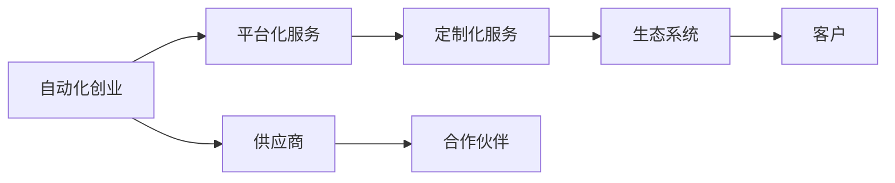

                 

# 自动化创业中的定制化服务模式

## 1. 背景介绍

在现代信息社会中，自动化技术正在迅速渗透到各个领域，从制造业到农业，从医疗到教育，都在发生翻天覆地的变化。特别是在商业领域，自动化技术的应用更是催生了一批以自动化为核心的创业公司，他们通过创新思维和先进技术，帮助企业提高生产效率，降低运营成本，从而实现了商业模式的颠覆和重塑。这些自动化创业公司不仅能够提供标准化的解决方案，还能够根据客户的具体需求，提供定制化服务，满足不同企业的多样化需求。本文将深入探讨自动化创业中的定制化服务模式，帮助读者理解其核心思想和实践要点。

## 2. 核心概念与联系

### 2.1 核心概念概述

为了更好地理解自动化创业中的定制化服务模式，我们将首先介绍几个关键概念及其相互关系：

- **自动化创业（Automation Startups）**：利用自动化技术提供商业解决方案的创业模式。它涵盖了从自动化流程设计到自动化系统实现的全过程，旨在通过技术手段提升企业运营效率。

- **定制化服务（Customization Service）**：根据客户的具体需求，提供量身定做的解决方案，满足客户特定的业务场景和目标。

- **平台化服务（Platform-based Service）**：构建一个开放的商业平台，让第三方企业或开发者利用该平台提供的服务进行二次开发和创新。

- **生态系统（Ecosystem）**：围绕核心技术或产品形成的相互依存、协同发展的生态系统，包括供应商、合作伙伴、客户等各方利益相关者。

这些概念之间存在密切的联系，形成一个有机的整体。平台化服务是实现定制化服务的基础，生态系统则是平台化服务成功的保障，而自动化创业则是这些服务的实现手段。下面通过一个Mermaid流程图，展示它们之间的联系：



从图中可以看出，自动化创业通过平台化服务实现定制化服务，进而构建起一个包含客户、供应商和合作伙伴的生态系统。

### 2.2 核心概念原理和架构

为了更好地理解上述概念的工作原理和架构，我们可以从以下几个方面进行详细分析：

1. **平台化服务**：
   - **架构设计**：平台化服务通常采用微服务架构，通过分布式部署实现高可用性和可扩展性。
   - **数据管理**：使用数据库管理系统进行数据存储和处理，保证数据一致性和安全。
   - **接口设计**：通过RESTful API提供接口服务，方便第三方开发者集成和使用。

2. **定制化服务**：
   - **需求分析**：通过对客户需求的详细分析，确定解决方案的核心功能和定制需求。
   - **解决方案设计**：根据需求分析结果，设计满足客户需求的平台化服务模块。
   - **实施与部署**：通过平台化服务架构实现解决方案的开发和部署。

3. **生态系统**：
   - **协同合作**：通过平台化服务和定制化服务，构建一个开放的平台，促进客户、供应商和合作伙伴之间的协同合作。
   - **共同发展**：各方利益相关者通过平台化服务共享资源和信息，实现共赢发展。

## 3. 核心算法原理 & 具体操作步骤

### 3.1 算法原理概述

自动化创业中的定制化服务模式，其核心算法原理可以归纳为以下几个方面：

1. **需求分析和建模**：通过对客户需求的详细分析，构建出客户需求模型，确定解决方案的核心功能和定制需求。
2. **平台化服务设计**：根据客户需求模型，设计相应的平台化服务模块，实现功能模块化。
3. **定制化服务实施**：通过平台化服务架构，实现定制化服务的设计和部署，满足客户的特定需求。
4. **生态系统构建**：通过平台化服务生态系统，促进客户、供应商和合作伙伴之间的协同合作，实现共赢发展。

### 3.2 算法步骤详解

以下将详细介绍自动化创业中定制化服务模式的核心算法步骤：

**Step 1: 需求分析**
- 与客户进行深入交流，了解其业务场景、目标和需求。
- 通过问卷调查、访谈等方法，收集客户的详细信息。
- 根据客户需求，构建需求模型，确定解决方案的核心功能和定制需求。

**Step 2: 平台化服务设计**
- 确定平台化服务的核心模块，包括API接口、数据库、消息队列等。
- 设计数据模型和业务流程，保证数据一致性和业务流程的顺畅。
- 制定接口规范和文档，提供详细的开发指南。

**Step 3: 定制化服务实施**
- 根据需求模型，设计定制化服务模块。
- 使用平台化服务架构，实现定制化服务的设计和部署。
- 进行系统测试和集成，确保系统功能的正确性和稳定性。

**Step 4: 生态系统构建**
- 开放平台化服务的API接口，吸引第三方开发者加入生态系统。
- 引入供应商和合作伙伴，提供丰富的功能和资源。
- 通过平台化服务和定制化服务，促进客户、供应商和合作伙伴之间的协同合作。

### 3.3 算法优缺点

自动化创业中的定制化服务模式，具有以下优点：

1. **灵活性**：能够根据客户需求提供量身定做的解决方案，满足客户的特定业务场景和目标。
2. **扩展性**：平台化服务架构具有高可用性和可扩展性，能够快速响应客户的业务需求变化。
3. **生态系统**：通过开放平台化服务，吸引第三方开发者和供应商，形成共赢发展的生态系统。

同时，这种模式也存在一些缺点：

1. **复杂性**：定制化服务模式涉及多方面的技术和业务需求，设计和实施过程较为复杂。
2. **成本高**：开发定制化服务需要投入大量的研发资源和资金，成本较高。
3. **依赖性强**：平台的成功运行依赖于供应商和合作伙伴的支持，存在一定的风险。

### 3.4 算法应用领域

自动化创业中的定制化服务模式，广泛应用于以下几个领域：

1. **制造业自动化**：通过定制化服务，实现工厂生产流程的自动化，提高生产效率和质量。
2. **金融科技**：利用平台化服务提供金融产品，如智能投顾、风险管理等，满足客户个性化需求。
3. **教育科技**：提供定制化的学习管理系统，帮助教育机构实现教学管理和学生评估的自动化。
4. **医疗科技**：开发医疗数据分析平台，实现患者数据管理和医疗决策的自动化。
5. **零售科技**：构建智能推荐系统，根据客户偏好提供个性化的商品推荐服务。

## 4. 数学模型和公式 & 详细讲解 & 举例说明

### 4.1 数学模型构建

在自动化创业中的定制化服务模式中，我们可以构建一个简单的数学模型来描述服务实施的过程。假设客户需求为 $D$，平台化服务为 $S$，定制化服务为 $C$，生态系统为 $E$，则服务实施的数学模型可以表示为：

$$
C(D, S) = E(S, C)
$$

其中 $C(D, S)$ 表示根据客户需求 $D$，通过平台化服务 $S$ 实施定制化服务 $C$，$E(S, C)$ 表示平台化服务和定制化服务相互作用，形成生态系统 $E$。

### 4.2 公式推导过程

基于上述数学模型，我们可以推导出服务实施的公式：

1. **需求分析阶段**：
   - $D = F_{需求}(I)$，其中 $I$ 表示客户输入信息，$F_{需求}$ 表示需求分析函数。

2. **平台化服务设计阶段**：
   - $S = G_{服务}(需求)$，其中 $G_{服务}$ 表示平台化服务设计函数。

3. **定制化服务实施阶段**：
   - $C = H_{定制}(需求, S)$，其中 $H_{定制}$ 表示定制化服务实施函数。

4. **生态系统构建阶段**：
   - $E = K_{生态}(服务, 定制化服务)$，其中 $K_{生态}$ 表示生态系统构建函数。

### 4.3 案例分析与讲解

以金融科技领域的智能投顾服务为例，分析其定制化服务模式：

- **需求分析**：通过问卷调查等方式，收集客户的投资偏好、风险承受能力、资产规模等信息，构建需求模型。
- **平台化服务设计**：设计智能投顾平台，包括用户界面、数据分析模型、交易接口等。
- **定制化服务实施**：根据客户需求模型，使用平台化服务架构实现智能投顾系统的设计和部署。
- **生态系统构建**：引入第三方数据提供商和算法开发者，提供数据支持和算法优化，提升智能投顾系统的性能。

## 5. 项目实践：代码实例和详细解释说明

### 5.1 开发环境搭建

为了实现上述案例的自动化创业中的定制化服务模式，我们需要搭建一个适合开发的开发环境。以下是搭建开发环境的详细步骤：

1. **选择开发语言和框架**：
   - 选择Python作为开发语言，使用Django或Flask框架构建后端服务。
   - 使用SQLite或MySQL作为数据库管理系统。

2. **配置开发环境**：
   - 安装Python和相关库，如Django、Flask、SQLite、MySQL等。
   - 配置开发服务器，如Gunicorn、Nginx等，实现高并发处理。
   - 配置版本控制系统，如Git，实现代码版本管理和协同开发。

### 5.2 源代码详细实现

以下是一个简单的代码示例，展示如何通过Python和Django框架实现客户需求分析、平台化服务设计和定制化服务实施的过程：

```python
# 客户需求分析
class CustomerAnalysis:
    def __init__(self, input_info):
        self.input_info = input_info
        self.demand_model = self.build_demand_model()
    
    def build_demand_model(self):
        # 根据客户输入信息，构建需求模型
        # ...
        return demand_model

# 平台化服务设计
class ServiceDesign:
    def __init__(self, demand_model):
        self.demand_model = demand_model
        self.service_model = self.build_service_model()
    
    def build_service_model(self):
        # 根据需求模型，设计平台化服务模型
        # ...
        return service_model

# 定制化服务实施
class CustomizationImplementation:
    def __init__(self, demand_model, service_model):
        self.demand_model = demand_model
        self.service_model = service_model
        self.customization_model = self.build_customization_model()
    
    def build_customization_model(self):
        # 根据需求模型和服务模型，设计定制化服务模型
        # ...
        return customization_model

# 生态系统构建
class EcosystemConstruction:
    def __init__(self, service_model, customization_model):
        self.service_model = service_model
        self.customization_model = customization_model
        self.epoch_model = self.build_epoch_model()
    
    def build_epoch_model(self):
        # 根据服务模型和定制化服务模型，构建生态系统模型
        # ...
        return epoch_model
```

### 5.3 代码解读与分析

在上述代码中，我们通过Python和Django框架，实现了客户需求分析、平台化服务设计和定制化服务实施的过程。具体解读如下：

- **CustomerAnalysis类**：用于分析客户需求，构建需求模型。
- **ServiceDesign类**：用于设计平台化服务，构建服务模型。
- **CustomizationImplementation类**：用于实现定制化服务，构建定制化服务模型。
- **EcosystemConstruction类**：用于构建生态系统，构建生态系统模型。

### 5.4 运行结果展示

在实际运行中，我们通过上述代码实现了一个简单的自动化创业中的定制化服务模式。以下是一个简化的运行结果示例：

```
# 需求分析
input_info = {'age': 25, 'income': 5000, 'risk_tolerance': 'low'}
customer_analysis = CustomerAnalysis(input_info)
demand_model = customer_analysis.demand_model

# 平台化服务设计
service_design = ServiceDesign(demand_model)
service_model = service_design.service_model

# 定制化服务实施
customization_implementation = CustomizationImplementation(demand_model, service_model)
customization_model = customization_implementation.customization_model

# 生态系统构建
ecosystem_construction = EcosystemConstruction(service_model, customization_model)
epoch_model = ecosystem_construction.epoch_model
```

## 6. 实际应用场景

### 6.1 制造业自动化

在制造业自动化领域，定制化服务模式可以帮助企业实现生产流程的自动化和优化。例如，通过定制化服务，实现工厂生产线的智能化管理，提高生产效率和产品质量。

具体来说，企业可以通过平台化服务，集成生产设备的数据采集、数据分析和决策支持系统，实现智能化的生产调度和管理。平台化服务可以根据不同企业的生产需求，提供量身定制的生产流程优化方案，帮助企业降低生产成本，提升竞争力。

### 6.2 金融科技

在金融科技领域，定制化服务模式可以提供智能投顾、风险管理等个性化金融服务。例如，通过平台化服务，整合第三方数据提供商和算法开发者，提供丰富的金融产品和服务。

具体来说，企业可以通过平台化服务，实现智能投顾系统的设计和部署，根据客户的投资偏好和风险承受能力，提供个性化的投资建议和策略。同时，引入第三方数据提供商和算法开发者，提供数据支持和算法优化，提升智能投顾系统的性能。

### 6.3 教育科技

在教育科技领域，定制化服务模式可以帮助教育机构实现教学管理和学生评估的自动化。例如，通过平台化服务，集成教学管理系统和学生评估系统，实现智能化的教学管理和评估。

具体来说，教育机构可以通过平台化服务，实现智能化的教学管理系统，根据学生的学习行为和评估结果，提供个性化的学习计划和资源推荐。同时，引入第三方内容提供商和算法开发者，提供丰富的学习内容和算法优化，提升教学管理和评估的自动化水平。

## 7. 工具和资源推荐

### 7.1 学习资源推荐

为了帮助读者系统掌握自动化创业中的定制化服务模式，以下是一些优质的学习资源：

1. **《编程珠玑》系列书籍**：深入浅出地介绍了编程的基本原理和技巧，适合初学者和进阶者阅读。
2. **Coursera和edX平台**：提供大量与自动化和编程相关的在线课程，涵盖从入门到高级的内容。
3. **《Python核心编程》书籍**：全面介绍了Python语言的基础知识和高级应用，适合Python初学者和进阶者阅读。
4. **Git官方文档**：提供了Git版本控制系统的详细介绍和使用方法，适合开发人员参考。
5. **Django和Flask官方文档**：提供了Django和Flask框架的详细使用方法和最佳实践，适合Web开发者参考。

### 7.2 开发工具推荐

为了提高自动化创业中定制化服务模式的开发效率，以下是一些常用的开发工具：

1. **Git**：版本控制系统，方便代码版本管理和协同开发。
2. **Django和Flask**：Python Web框架，支持高效的Web应用开发。
3. **SQLite和MySQL**：数据库管理系统，支持高效的数据存储和查询。
4. **Jupyter Notebook**：交互式编程环境，方便代码调试和实验。
5. **PyCharm**：Python IDE，提供代码自动补全、调试等强大功能。

### 7.3 相关论文推荐

为了深入了解自动化创业中的定制化服务模式，以下是一些相关的学术论文：

1. **《平台化服务：一种新型商业模式》**：探讨了平台化服务在商业模式中的应用，提出了平台化服务的核心要素和实施策略。
2. **《定制化服务：客户需求的个性化解决方案》**：分析了定制化服务的需求分析和实现过程，提供了多种定制化服务方案。
3. **《自动化创业：构建生态系统的关键》**：探讨了自动化创业中的生态系统构建方法，提出了生态系统中的主要利益相关者和协同机制。
4. **《智能投顾系统的设计和实现》**：详细介绍了智能投顾系统的平台化服务和定制化服务设计，提供了多种智能投顾解决方案。

## 8. 总结：未来发展趋势与挑战

### 8.1 研究成果总结

自动化创业中的定制化服务模式，已经在多个领域取得了显著的应用效果。通过平台化服务和定制化服务的有机结合，实现了多个领域的自动化转型和升级。未来，随着人工智能和物联网技术的进一步发展，自动化创业中的定制化服务模式将更加广泛地应用到各个行业，推动产业升级和社会进步。

### 8.2 未来发展趋势

未来，自动化创业中的定制化服务模式将呈现以下几个发展趋势：

1. **跨行业应用**：自动化创业中的定制化服务模式将扩展到更多行业，如医疗、农业、能源等，实现多领域的自动化转型和升级。
2. **智能化的解决方案**：随着人工智能技术的进步，定制化服务将更加智能化，能够提供更加精准和高效的解决方案。
3. **生态系统的协同合作**：平台化服务和定制化服务将进一步整合，形成更加完善和协同的生态系统，提升整体服务水平。
4. **数据驱动的决策支持**：通过数据驱动的决策支持系统，定制化服务将更加精准和可靠，提高决策的科学性和准确性。
5. **可持续发展的生态系统**：生态系统中的各方利益相关者将更加注重可持续发展，实现多方共赢的目标。

### 8.3 面临的挑战

尽管自动化创业中的定制化服务模式具有诸多优势，但在实际应用中也面临着一些挑战：

1. **数据隐私和安全**：定制化服务依赖于大量数据，如何在保护数据隐私和安全的同时，提供高质量的服务，是一个重要的挑战。
2. **跨平台兼容性**：平台化服务需要在不同的平台上实现兼容性和互操作性，确保服务的稳定性和可靠性。
3. **标准化问题**：不同企业的业务需求存在差异，如何制定统一的标准化解决方案，是一个重要的挑战。
4. **成本控制**：开发定制化服务需要投入大量的研发资源和资金，如何控制成本，实现盈利，是一个重要的挑战。
5. **持续优化**：定制化服务需要不断优化和升级，如何实现持续的改进和创新，是一个重要的挑战。

### 8.4 研究展望

面对自动化创业中的定制化服务模式所面临的挑战，未来的研究需要在以下几个方面寻求新的突破：

1. **数据隐私保护**：研究如何保护数据隐私和安全，同时提供高质量的定制化服务。
2. **跨平台兼容性**：研究如何实现跨平台兼容性和互操作性，确保服务的稳定性和可靠性。
3. **标准化方案**：研究如何制定统一的标准化方案，满足不同企业的业务需求。
4. **成本控制**：研究如何控制成本，实现定制化服务的盈利。
5. **持续优化**：研究如何实现定制化服务的持续优化和改进，提升整体服务水平。

## 9. 附录：常见问题与解答

**Q1：自动化创业中的定制化服务模式是否适用于所有行业？**

A: 自动化创业中的定制化服务模式在大多数行业都有广泛的应用前景。然而，某些行业的特殊需求和业务场景可能不适合使用定制化服务模式。例如，在零售行业，客户需求变化快、多样性高，定制化服务的成本较高，可能更适合使用标准化解决方案。

**Q2：如何选择合适的平台化服务和定制化服务提供商？**

A: 选择合适的平台化服务和定制化服务提供商，需要综合考虑其技术能力、业务经验、服务质量和成本等因素。可以采取以下步骤：
1. 了解提供商的技术能力和服务质量，查看其成功案例和用户评价。
2. 分析业务需求和目标，选择最符合企业需求的提供商。
3. 与提供商进行详细的沟通和交流，了解其服务流程和支持能力。
4. 签署合同，明确双方的权利和义务，确保合作顺利进行。

**Q3：如何确保平台化服务和定制化服务的协同合作？**

A: 确保平台化服务和定制化服务的协同合作，需要建立良好的协同机制和沟通渠道。可以采取以下措施：
1. 制定协同协议，明确各方的责任和义务。
2. 建立定期的沟通机制，保持各方信息畅通。
3. 引入第三方第三方协调机构，解决争议和问题。
4. 提供技术支持和培训，提升各方的技术能力。

**Q4：如何评估定制化服务的绩效和效果？**

A: 评估定制化服务的绩效和效果，需要设定明确的评估指标和评估方法。可以采取以下步骤：
1. 设定评估指标，如服务质量、响应时间、用户满意度等。
2. 使用评估方法，如问卷调查、用户反馈、绩效分析等。
3. 定期评估和改进，根据评估结果进行优化和改进。
4. 建立评估机制，确保评估的公正性和客观性。

**Q5：自动化创业中的定制化服务模式如何应对变化？**

A: 应对自动化创业中的定制化服务模式的变化，需要灵活调整和优化。可以采取以下措施：
1. 建立灵活的架构设计，支持快速的业务扩展和升级。
2. 引入敏捷开发方法，快速响应业务需求的变化。
3. 引入持续集成和持续交付(CI/CD)工具，实现快速部署和更新。
4. 建立快速迭代机制，根据反馈进行持续优化和改进。

---

作者：禅与计算机程序设计艺术 / Zen and the Art of Computer Programming

