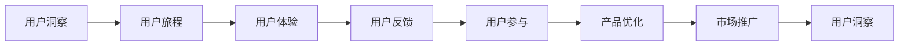

                 

## 1. 背景介绍

在过去几十年中，自动化创业一直是一个备受关注的话题。随着技术的不断进步，自动化技术被广泛应用于各个领域，包括制造业、医疗、金融和教育等。然而，尽管自动化技术带来了巨大的效率提升，但它也引发了一些新的挑战。在自动化创业中，如何更好地理解用户需求，以及如何将这些需求转化为创新产品，成为了一个关键问题。

本文将探讨自动化创业中的用户洞察与创新，旨在帮助创业者更好地理解用户需求，并在此基础上提出创新的解决方案。

## 2. 核心概念与联系

### 2.1 核心概念概述

在进行用户洞察与创新的过程中，我们需要关注以下几个核心概念：

- **用户洞察（User Insight）**：通过深入了解用户的行为、需求和痛点，发现潜在的市场机会和创新方向。
- **用户旅程（User Journey）**：描述用户在使用产品或服务时的一系列行为和情感体验，帮助企业更好地理解用户的期望和需求。
- **用户体验（User Experience, UX）**：指用户在使用产品或服务时的整体感受和满意度，是衡量产品或服务质量的重要指标。
- **用户反馈（User Feedback）**：用户在产品或服务使用过程中提供的意见和建议，对于产品迭代和改进具有重要价值。
- **用户参与（User Engagement）**：指用户在使用产品或服务时的互动程度和活跃度，是衡量产品成功与否的重要指标。

这些核心概念之间的关系可以通过以下Mermaid流程图来展示：



这个流程图展示了一个完整的用户洞察与创新的循环过程：从用户洞察开始，通过用户旅程深入了解用户行为和需求，根据用户体验和反馈不断优化产品，最终通过市场推广再次获取用户洞察，形成持续改进的循环。

## 3. 核心算法原理 & 具体操作步骤

### 3.1 算法原理概述

在自动化创业中，用户洞察与创新过程可以抽象为一个多阶段的循环，每个阶段都依赖于前一个阶段的结果。这个循环通常包括以下几个步骤：

1. **用户洞察**：通过数据分析、市场调研和用户访谈等方式，获取关于用户行为、需求和痛点的信息。
2. **用户旅程**：将用户的完整体验过程可视化，识别其中的关键触点和痛点。
3. **用户体验设计**：根据用户旅程和洞察结果，设计用户界面和交互流程，优化用户体验。
4. **用户反馈收集**：在产品上线后，通过在线调查、A/B测试等方式收集用户反馈，了解用户满意度和改进需求。
5. **用户参与**：通过社区建设、用户教育等方式，提高用户参与度和产品活跃度。
6. **产品优化**：根据用户反馈和参与度数据，不断迭代和优化产品。

### 3.2 算法步骤详解

#### 3.2.1 用户洞察

用户洞察的获取可以通过以下几种方式：

- **数据分析**：利用大数据分析工具，对用户行为数据进行挖掘，发现用户的兴趣和需求。
- **市场调研**：通过问卷调查、深度访谈等方式，直接获取用户意见和建议。
- **用户访谈**：与目标用户进行一对一的深入访谈，了解他们的真实需求和痛点。

#### 3.2.2 用户旅程

用户旅程的绘制可以采用以下步骤：

- **识别触点**：列出用户在使用产品或服务时的所有行为和决策点，包括注册、登录、浏览、购买等。
- **描述体验**：详细记录用户在每个触点上的行为和感受，包括成功和失败的情况。
- **绘制旅程**：将用户行为和感受以流程图的形式展示出来，突出关键触点和痛点。

#### 3.2.3 用户体验设计

用户体验设计通常包括以下几个步骤：

- **用户研究**：通过用户洞察和旅程分析，确定用户的关键需求和期望。
- **原型设计**：根据用户研究结果，设计初步的用户界面和交互流程。
- **测试优化**：通过用户测试和反馈，不断迭代和优化设计方案。

#### 3.2.4 用户反馈收集

用户反馈的收集可以通过以下几种方式：

- **在线调查**：通过问卷、投票等方式，直接收集用户的意见和建议。
- **A/B测试**：在产品上推出多个版本，通过对比实验收集用户反馈。
- **用户访谈**：与用户进行深入交流，了解他们的使用体验和改进建议。

#### 3.2.5 用户参与

用户参与的提升可以通过以下几种方式：

- **社区建设**：建立在线社区，让用户互相交流和分享经验。
- **用户教育**：通过培训和教程等方式，提高用户对产品的理解和使用能力。
- **奖励机制**：设计激励机制，鼓励用户积极参与和贡献。

#### 3.2.6 产品优化

产品优化的过程可以采用以下步骤：

- **数据分析**：利用用户反馈和参与度数据，分析用户需求和痛点。
- **功能迭代**：根据数据分析结果，设计新的功能和改进方案。
- **测试发布**：通过A/B测试等方式，验证新功能的有效性。
- **持续改进**：根据用户反馈和新数据，不断迭代和优化产品。

### 3.3 算法优缺点

用户洞察与创新的算法具有以下优点：

- **数据驱动**：通过数据分析和用户调研，获取精准的用户需求和痛点。
- **用户体验优化**：通过用户体验设计和用户反馈收集，不断优化产品的界面和交互流程，提升用户满意度。
- **快速迭代**：通过持续的用户参与和产品优化，快速迭代和改进产品，满足用户不断变化的需求。

然而，用户洞察与创新的算法也存在一些缺点：

- **成本高**：获取用户洞察和反馈通常需要较高的成本和时间投入。
- **数据隐私**：用户数据的收集和使用可能涉及到隐私问题，需要严格遵守相关法律法规。
- **用户参与度低**：部分用户可能对参与调研和反馈不感兴趣，导致数据样本代表性不足。

### 3.4 算法应用领域

用户洞察与创新算法在以下领域中具有广泛的应用：

- **电子商务**：通过用户行为分析，优化推荐算法，提升用户购物体验。
- **金融科技**：利用用户反馈数据，优化金融产品和服务，提升用户满意度和信任度。
- **医疗健康**：通过用户调研和反馈，优化医疗健康服务，提升患者体验和治疗效果。
- **教育科技**：通过用户数据，改进教育内容和教学方法，提升学习效果和用户参与度。
- **智能制造**：利用用户反馈和参与度数据，优化生产流程和产品设计，提升生产效率和用户满意度。

## 4. 数学模型和公式 & 详细讲解 & 举例说明

### 4.1 数学模型构建

用户洞察与创新的数学模型可以抽象为一个多层网络结构，其中每个层次代表一个用户洞察或创新的步骤。这个网络结构通常包括用户洞察层、用户旅程层、用户体验设计层、用户反馈收集层、用户参与层和产品优化层。每个层次的输出都是下一层次的输入。

### 4.2 公式推导过程

假设用户洞察层表示为 $U$，用户旅程层表示为 $J$，用户体验设计层表示为 $E$，用户反馈收集层表示为 $F$，用户参与层表示为 $P$，产品优化层表示为 $O$。则用户洞察与创新的数学模型可以表示为：

$$
O = f(O_{prev}, P)
$$

$$
P = g(J, F)
$$

$$
F = h(E, U)
$$

$$
E = k(J, U)
$$

$$
J = l(U)
$$

其中，$f, g, h, k, l$ 分别表示每个层次的映射函数。

### 4.3 案例分析与讲解

假设某电子商务平台希望通过用户洞察与创新来提升用户购物体验。以下是各个层次的详细分析和计算过程：

- **用户洞察层 $U$**：通过数据分析工具，发现用户对产品的搜索功能不满足，希望有更好的搜索排序和推荐。
- **用户旅程层 $J$**：绘制用户旅程图，发现用户在使用搜索功能时，主要关注搜索结果的排序、相关性和加载速度。
- **用户体验设计层 $E$**：根据用户旅程图和洞察结果，设计新的搜索界面和排序算法，并进行了用户测试和优化。
- **用户反馈收集层 $F$**：通过A/B测试，收集用户对新搜索功能的反馈，发现大部分用户对排序和推荐效果满意。
- **用户参与层 $P$**：通过社区建设和奖励机制，鼓励用户分享使用体验，提升平台的用户活跃度。
- **产品优化层 $O$**：根据用户反馈和参与度数据，优化搜索算法和界面设计，提升了平台的整体用户满意度。

## 5. 项目实践：代码实例和详细解释说明

### 5.1 开发环境搭建

在进行用户洞察与创新的项目实践中，我们需要搭建一个完整的开发环境。以下是搭建开发环境的步骤：

1. **数据收集和预处理**：收集用户数据，并进行清洗、去重、归一化等预处理工作。
2. **数据分析工具选择**：选择合适的数据分析工具，如Python的Pandas、NumPy、Scikit-learn等。
3. **用户调研和访谈**：设计问卷和访谈大纲，进行用户调研和访谈。
4. **用户旅程绘制**：使用工具如Lucidchart或Visio，绘制用户旅程图。
5. **用户体验设计**：使用工具如Sketch、Figma或Adobe XD，进行原型设计和用户测试。
6. **用户反馈收集**：使用工具如SurveyMonkey或Google Forms，收集用户反馈和意见。
7. **用户社区建设**：使用工具如Discourse或Slack，建立用户社区和交流平台。
8. **持续优化和迭代**：根据用户反馈和参与度数据，持续优化和迭代产品。

### 5.2 源代码详细实现

以下是一个简单的代码实现示例，展示如何使用Python进行用户数据收集和分析：

```python
import pandas as pd
import numpy as np

# 用户数据收集和预处理
data = pd.read_csv('user_data.csv')
data = data.dropna().reset_index(drop=True)

# 数据分析和建模
X = data[['age', 'gender', 'location']]
y = data['purchase_frequency']

# 使用线性回归模型进行预测
from sklearn.linear_model import LinearRegression
model = LinearRegression()
model.fit(X, y)

# 预测用户购买频率
predictions = model.predict(data[['age', 'gender', 'location']])
```

### 5.3 代码解读与分析

在上述代码中，我们首先使用Pandas和NumPy进行用户数据的收集和预处理。接着，使用Scikit-learn的线性回归模型进行数据分析和建模，最后使用预测模型对用户购买频率进行预测。

在实际应用中，数据分析和建模过程可能更加复杂，需要考虑更多的因素，如数据可视化、特征工程、模型选择等。此外，代码实现中还需要考虑数据隐私和安全问题，确保用户数据的安全性和合规性。

### 5.4 运行结果展示

运行上述代码后，可以得到用户购买频率的预测结果。我们可以根据这些结果，优化产品设计和功能，提升用户满意度和体验。

## 6. 实际应用场景

### 6.1 电子商务

在电子商务领域，用户洞察与创新尤为重要。通过分析用户行为数据，优化推荐算法和搜索功能，可以显著提升用户购物体验和满意度。例如，某电商平台通过用户数据挖掘，发现用户对个性化推荐的效果不理想，于是引入深度学习模型进行推荐优化，大幅提升了推荐准确率和用户留存率。

### 6.2 金融科技

金融科技领域也离不开用户洞察与创新的支持。通过用户反馈和参与度数据，优化金融产品和服务，可以提升用户信任度和满意度。例如，某银行通过用户调研，发现用户在办理业务时，流程繁琐、耗时长，于是引入自动化流程和智能客服，大大提升了用户体验和满意度。

### 6.3 医疗健康

在医疗健康领域，用户洞察与创新同样重要。通过用户调研和反馈，优化医疗服务和健康管理，可以提升患者体验和治疗效果。例如，某医疗平台通过用户数据，发现患者在使用预约系统时存在诸多不便，于是引入智能预约系统和虚拟健康助手，提升了预约效率和患者满意度。

### 6.4 教育科技

教育科技领域也需要不断进行用户洞察与创新。通过用户数据，改进教育内容和教学方法，可以提升学习效果和用户参与度。例如，某在线教育平台通过用户反馈，优化了课程内容和教学方式，提升了用户的学习体验和参与度。

### 6.5 智能制造

在智能制造领域，用户洞察与创新同样具有重要意义。通过用户反馈和参与度数据，优化生产流程和产品设计，可以提升生产效率和用户满意度。例如，某智能制造企业通过用户调研，发现用户在使用生产设备时存在诸多不便，于是引入智能设备管理系统和远程维护服务，提升了生产效率和用户满意度。

## 7. 工具和资源推荐

### 7.1 学习资源推荐

为了帮助创业者更好地掌握用户洞察与创新的方法，以下是一些推荐的学习资源：

- **《用户故事地图》**：这本书深入介绍了用户旅程图的绘制和应用，帮助企业更好地理解用户需求。
- **《用户体验设计》**：这本书系统介绍了用户体验设计的基本原理和实践方法，帮助设计师更好地优化用户界面和交互流程。
- **《数据分析实战》**：这本书提供了数据分析的实用技巧和工具，帮助创业者更好地处理和分析用户数据。
- **《用户反馈分析》**：这本书介绍了用户反馈的收集和分析方法，帮助企业更好地理解用户需求和痛点。
- **《社区管理》**：这本书提供了社区建设的实用技巧和工具，帮助企业更好地建立和维护用户社区。

### 7.2 开发工具推荐

在进行用户洞察与创新的项目实践中，以下工具可以帮助我们提高效率和效果：

- **数据分析工具**：Python的Pandas、NumPy、Scikit-learn等，用于数据收集、清洗和建模。
- **用户体验设计工具**：Sketch、Figma、Adobe XD等，用于原型设计和用户测试。
- **用户调研工具**：SurveyMonkey、Google Forms等，用于问卷调查和用户访谈。
- **用户社区工具**：Discourse、Slack等，用于社区建设和用户交流。
- **自动化测试工具**：Jest、Selenium等，用于自动化测试和质量保证。

### 7.3 相关论文推荐

用户洞察与创新的研究已经取得了不少成果，以下是一些推荐的论文：

- **《用户行为分析》**：这篇论文介绍了用户行为分析的基本方法和技术，帮助企业更好地理解用户需求。
- **《用户体验设计》**：这篇论文介绍了用户体验设计的基本原理和实践方法，帮助设计师更好地优化用户界面和交互流程。
- **《用户反馈分析》**：这篇论文介绍了用户反馈的收集和分析方法，帮助企业更好地理解用户需求和痛点。
- **《社区管理》**：这篇论文介绍了社区建设的实用技巧和工具，帮助企业更好地建立和维护用户社区。

## 8. 总结：未来发展趋势与挑战

### 8.1 总结

本文对自动化创业中的用户洞察与创新进行了全面系统的介绍。首先阐述了用户洞察与创新的研究背景和意义，明确了用户洞察与创新在自动化创业中的重要性。其次，从原理到实践，详细讲解了用户洞察与创新的数学模型和操作步骤，给出了用户洞察与创新的代码实现示例。同时，本文还广泛探讨了用户洞察与创新在电子商务、金融科技、医疗健康、教育科技和智能制造等多个行业领域的应用前景，展示了用户洞察与创新的巨大潜力。此外，本文还精选了用户洞察与创新的各类学习资源、开发工具和相关论文，力求为读者提供全方位的技术指引。

通过本文的系统梳理，可以看到，用户洞察与创新在自动化创业中具有广泛的应用场景和巨大的价值。它帮助创业者更好地理解用户需求，并通过持续优化和迭代，提升产品和服务的质量和用户满意度。未来，伴随技术的不断进步和应用场景的不断拓展，用户洞察与创新必将发挥更大的作用，成为自动化创业的重要驱动力。

### 8.2 未来发展趋势

展望未来，用户洞察与创新将呈现以下几个发展趋势：

1. **智能化提升**：随着人工智能技术的发展，用户洞察与创新将更多地依赖于智能化算法，如深度学习、自然语言处理等，提升数据分析和建模的效率和精度。
2. **多模态融合**：用户洞察与创新将更多地融合多模态数据，如文本、图像、视频等，提供更全面、精准的用户洞察和创新方向。
3. **自动化增强**：用户洞察与创新的各个环节将更多地依赖于自动化工具和算法，减少人力成本和误差，提升效率和效果。
4. **实时化扩展**：用户洞察与创新将更多地关注实时数据，实现快速响应和优化，提升用户体验和满意度。
5. **跨领域应用**：用户洞察与创新将更多地应用于跨领域场景，如医疗、金融、制造等，实现全面、多维的用户洞察和创新。

### 8.3 面临的挑战

尽管用户洞察与创新已经取得了不小的进展，但在迈向更加智能化、普适化应用的过程中，它仍面临着诸多挑战：

1. **数据隐私和安全**：用户数据的收集和使用可能涉及到隐私问题，需要严格遵守相关法律法规，确保数据安全和用户隐私。
2. **数据质量问题**：用户数据的收集和预处理过程可能存在数据噪音和缺失，影响数据分析和建模的精度和效果。
3. **用户参与度低**：部分用户可能对参与调研和反馈不感兴趣，导致数据样本代表性不足，影响洞察结果的准确性和可靠性。
4. **模型复杂性**：用户洞察与创新涉及的数据量和维度可能很大，模型复杂度较高，需要高效的算法和工具进行优化和处理。
5. **跨领域应用难度**：不同领域的数据和用户需求存在差异，用户洞察与创新需要更多跨领域的知识和经验，才能实现有效的应用和创新。

### 8.4 研究展望

为了应对用户洞察与创新面临的挑战，未来的研究需要在以下几个方面寻求新的突破：

1. **数据隐私保护**：开发更加安全、高效的数据隐私保护技术，确保用户数据的安全性和合规性。
2. **数据质量提升**：研究和开发更加高效、准确的数据清洗和预处理技术，提升数据质量和模型精度。
3. **用户参与激励**：设计和实施更加有效的用户参与激励机制，提高用户参与度和数据样本的代表性。
4. **模型自动化优化**：开发自动化算法和工具，提升用户洞察与创新各个环节的效率和效果。
5. **跨领域应用拓展**：研究和开发更多跨领域的用户洞察与创新方法，提升其在不同领域的应用效果和创新能力。

总之，用户洞察与创新是自动化创业中的重要环节，需要在数据、算法、工程、业务等多个维度协同发力，才能真正实现用户需求和创新的双赢。未来，用户洞察与创新还将伴随技术的不断进步和应用场景的不断拓展，成为推动自动化创业的重要驱动力。

## 9. 附录：常见问题与解答

**Q1：如何进行用户洞察与创新？**

A: 用户洞察与创新的过程包括以下几个步骤：
1. 数据收集和预处理。收集用户行为数据，并进行清洗、去重、归一化等预处理工作。
2. 数据分析和建模。选择合适的算法和工具，进行数据分析和建模。
3. 用户调研和访谈。设计问卷和访谈大纲，进行用户调研和访谈。
4. 用户旅程绘制。使用工具如Lucidchart或Visio，绘制用户旅程图。
5. 用户体验设计。使用工具如Sketch、Figma或Adobe XD，进行原型设计和用户测试。
6. 用户反馈收集。使用工具如SurveyMonkey或Google Forms，收集用户反馈和意见。
7. 用户社区建设。使用工具如Discourse、Slack等，建立用户社区和交流平台。
8. 持续优化和迭代。根据用户反馈和参与度数据，持续优化和迭代产品。

**Q2：用户洞察与创新的算法优缺点是什么？**

A: 用户洞察与创新的算法具有以下优点：
1. 数据驱动：通过数据分析和用户调研，获取精准的用户需求和痛点。
2. 用户体验优化：通过用户体验设计和用户反馈收集，不断优化产品的界面和交互流程，提升用户满意度。
3. 快速迭代：通过持续的用户参与和产品优化，快速迭代和改进产品，满足用户不断变化的需求。

然而，用户洞察与创新的算法也存在一些缺点：
1. 成本高：获取用户洞察和反馈通常需要较高的成本和时间投入。
2. 数据隐私：用户数据的收集和使用可能涉及到隐私问题，需要严格遵守相关法律法规。
3. 用户参与度低：部分用户可能对参与调研和反馈不感兴趣，导致数据样本代表性不足。

**Q3：用户洞察与创新在自动化创业中的重要性是什么？**

A: 用户洞察与创新在自动化创业中具有重要意义：
1. 提升用户满意度：通过用户洞察与创新，可以更好地理解用户需求和痛点，提升产品和服务质量，提升用户满意度。
2. 提高用户参与度：通过用户参与和反馈，可以提升用户对产品的信任和满意度，提高用户参与度和忠诚度。
3. 优化产品设计和功能：通过数据分析和用户调研，可以优化产品设计和功能，提升用户体验和效果。
4. 快速响应市场变化：通过持续的用户洞察与创新，可以实时响应市场变化和用户需求，提升产品竞争力。
5. 降低开发成本：通过用户调研和反馈，可以提前发现产品问题和用户需求，降低开发成本和风险。

**Q4：用户洞察与创新在实际应用中需要注意哪些问题？**

A: 用户洞察与创新在实际应用中需要注意以下几个问题：
1. 数据隐私和安全：确保用户数据的安全性和合规性，防止数据泄露和滥用。
2. 数据质量问题：确保数据收集和预处理过程的准确性和完整性，提升数据分析和建模的精度和效果。
3. 用户参与度低：设计和实施有效的用户参与激励机制，提高用户参与度和数据样本的代表性。
4. 模型复杂性：选择高效的算法和工具，优化用户洞察与创新的各个环节，提升效率和效果。
5. 跨领域应用难度：研究和开发更多跨领域的用户洞察与创新方法，提升其在不同领域的应用效果和创新能力。

---

作者：禅与计算机程序设计艺术 / Zen and the Art of Computer Programming

