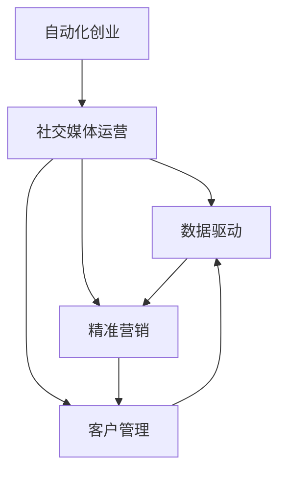

                 

# 自动化创业中的社交媒体运营

> 关键词：自动化创业, 社交媒体运营, 数据驱动, 精准营销, 客户管理, 社交媒体分析

## 1. 背景介绍

### 1.1 问题由来

在自动化创业中，社交媒体运营是一个关键环节，它不仅可以帮助企业提升品牌知名度，还能吸引和转化潜在客户。然而，由于社交媒体平台的复杂性和用户行为的多样性，传统的运营模式往往效率低下、效果难以衡量。因此，利用数据驱动的方式，实现精准营销和客户管理，成为了自动化创业中的重要课题。

### 1.2 问题核心关键点

社交媒体运营的核心在于：如何高效地收集、分析和利用社交媒体数据，实现对用户的精准定位、内容推荐和客户转化。这涉及到数据采集、处理、分析等多个环节，需要借助先进的算法和技术手段，才能实现自动化、高效化的运营目标。

## 2. 核心概念与联系

### 2.1 核心概念概述

为更好地理解自动化创业中的社交媒体运营，本节将介绍几个关键概念：

- **自动化创业(Automated Ventures)**：利用先进技术（如AI、大数据等），实现企业运营的自动化和智能化，提高运营效率和效果。
- **社交媒体(Social Media)**：通过网络平台（如Facebook、Twitter、Instagram等），与用户进行互动和信息传播的渠道。
- **运营管理(Operational Management)**：企业管理中对人员、设备、流程等资源的调配和控制，以实现业务目标。
- **数据驱动(Data-Driven)**：以数据为核心，通过数据分析和机器学习等技术，优化决策和运营过程。
- **精准营销(Precision Marketing)**：基于用户行为数据和预测模型，实现对目标用户的精准定位和有效沟通。
- **客户管理(Customer Management)**：通过CRM系统等工具，对客户数据进行收集、分析和利用，提升客户满意度和忠诚度。
- **社交媒体分析(Social Media Analytics)**：利用数据分析技术，从社交媒体数据中提取有价值的信息，指导运营策略的制定。

这些核心概念之间通过以下Mermaid流程图展现其联系：



通过这个流程图，我们可以清晰地看到，自动化创业中的社交媒体运营是一个多层次、多环节的复杂系统，涉及数据驱动、精准营销和客户管理等多个方面。

## 3. 核心算法原理 & 具体操作步骤

### 3.1 算法原理概述

自动化创业中的社交媒体运营，通过数据驱动的方式，实现对社交媒体数据的深入分析，从而指导精准营销和客户管理。其核心算法原理如下：

1. **数据采集与处理**：通过API接口、爬虫等技术，从社交媒体平台获取用户互动数据（如点赞、评论、分享等）。
2. **特征提取与选择**：从采集到的数据中，提取与营销相关的特征（如用户兴趣、行为偏好等），并选择最具代表性的特征。
3. **用户画像构建**：通过机器学习算法（如K-means、LDA等），将用户特征聚类为不同的群体，构建用户画像。
4. **内容推荐**：利用推荐系统算法（如协同过滤、基于内容的推荐等），为不同用户群体推荐个性化的内容。
5. **客户转化分析**：通过数据分析模型（如回归分析、分类模型等），预测用户转化的可能性，指导营销策略的制定。

### 3.2 算法步骤详解

自动化创业中的社交媒体运营，一般包括以下几个关键步骤：

**Step 1: 数据收集与处理**

- 使用API接口或爬虫技术，从Facebook、Twitter、Instagram等社交媒体平台获取用户互动数据。
- 数据清洗和预处理，去除噪声和冗余信息，确保数据的质量和可用性。
- 将数据存储到数据库或数据仓库中，便于后续分析。

**Step 2: 用户画像构建**

- 对收集到的用户互动数据进行分析，提取用户特征（如兴趣、行为、地理位置等）。
- 利用聚类算法（如K-means、LDA等），将用户特征聚类为不同的群体，构建用户画像。
- 分析不同用户群体在社交媒体上的行为和偏好，识别出高价值用户。

**Step 3: 内容推荐**

- 对不同用户群体进行特征选择和降维处理，得到最具代表性的特征。
- 利用推荐系统算法（如协同过滤、基于内容的推荐等），为不同用户群体推荐个性化的内容。
- 实时监控推荐效果，根据反馈数据调整推荐策略，提高推荐精准度。

**Step 4: 客户转化分析**

- 收集用户转化的数据，包括点击率、转化率、复购率等指标。
- 利用数据分析模型（如回归分析、分类模型等），预测用户转化的可能性。
- 根据分析结果，优化营销策略，提高客户转化率。

**Step 5: 运营优化与策略制定**

- 对数据分析结果进行可视化展示，帮助决策者理解数据和趋势。
- 根据数据分析结果，制定和调整社交媒体运营策略，实现精准营销和客户管理。
- 持续监控和优化运营效果，确保策略的有效性和可持续性。

### 3.3 算法优缺点

自动化创业中的社交媒体运营算法具有以下优点：

1. **高效性**：通过数据驱动的方式，可以显著提高运营效率，实现精准营销和客户管理。
2. **可扩展性**：算法可以应用于不同规模的社交媒体平台，适应各种业务需求。
3. **动态性**：算法可以实时分析数据，根据用户行为的变化动态调整策略，提高运营效果。
4. **精准性**：利用用户画像和推荐系统，可以实现对用户的精准定位和个性化内容推荐。

同时，该算法也存在一些缺点：

1. **数据质量依赖**：算法的精度和效果取决于数据的质量和全面性，数据收集和处理需要较高的技术门槛。
2. **模型复杂性**：算法涉及多种机器学习技术，模型构建和优化较为复杂，需要较强的技术背景。
3. **隐私问题**：社交媒体数据的采集和分析可能涉及用户隐私，需要遵守相关法律法规。
4. **冷启动问题**：新用户或新领域的用户画像构建较难，算法效果可能不佳。

## 4. 数学模型和公式 & 详细讲解 & 举例说明

### 4.1 数学模型构建

本节将使用数学语言对自动化创业中的社交媒体运营算法进行更加严格的刻画。

假设收集到的社交媒体数据为 $D=\{(x_i,y_i)\}_{i=1}^N$，其中 $x_i$ 为社交媒体行为数据，$y_i$ 为相应的用户转化标签。

定义用户特征矩阵 $X \in \mathbb{R}^{N \times D}$，其中 $D$ 为特征维度。

用户转化的概率模型为 $p(y_i|x_i) = \sigma(\theta^T f(x_i))$，其中 $\sigma$ 为激活函数，$f(\cdot)$ 为特征提取函数，$\theta$ 为模型参数。

目标是最小化预测误差 $L(y_i, \hat{y_i})$，得到模型参数 $\theta$。

### 4.2 公式推导过程

以二分类问题为例，推导线性回归和逻辑回归模型的数学公式。

1. **线性回归模型**

$$
\theta = \arg\min_{\theta} \frac{1}{N} \sum_{i=1}^N (y_i - \theta^T x_i)^2
$$

通过梯度下降法求解 $\theta$，得到：

$$
\theta = (X^T X)^{-1} X^T y
$$

2. **逻辑回归模型**

$$
p(y_i|x_i) = \frac{1}{1 + e^{-\theta^T x_i}}
$$

通过最大似然估计法求解 $\theta$，得到：

$$
\theta = \arg\max_{\theta} \sum_{i=1}^N \log p(y_i|x_i)
$$

推导过程如下：

$$
\log p(y_i|x_i) = y_i \log p(y_i|x_i) + (1-y_i) \log (1-p(y_i|x_i))
$$

$$
\theta = \arg\min_{\theta} \frac{1}{N} \sum_{i=1}^N \log p(y_i|x_i)
$$

对 $\theta$ 求导，得：

$$
\nabla_{\theta} \log p(y_i|x_i) = y_i - p(y_i|x_i)
$$

通过梯度下降法求解 $\theta$，得到：

$$
\theta = (X^T X)^{-1} X^T y
$$

### 4.3 案例分析与讲解

**案例一：电商平台推荐系统**

假设某电商平台希望通过社交媒体数据，提升用户转化率。平台收集到用户的点赞、评论、购物车等行为数据，构建用户画像，并为每个用户推荐个性化的商品。

首先，通过数据清洗和预处理，将行为数据转化为特征向量 $x_i$。然后，利用聚类算法（如K-means），将用户分为不同的群体，构建用户画像。

接着，利用推荐系统算法（如协同过滤、基于内容的推荐等），为不同用户群体推荐个性化的商品。最后，通过数据分析模型（如逻辑回归），预测用户转化的概率，指导营销策略的制定。

## 5. 项目实践：代码实例和详细解释说明

### 5.1 开发环境搭建

在进行社交媒体运营项目开发前，我们需要准备好开发环境。以下是使用Python进行PyTorch开发的环境配置流程：

1. 安装Anaconda：从官网下载并安装Anaconda，用于创建独立的Python环境。

2. 创建并激活虚拟环境：
```bash
conda create -n pytorch-env python=3.8 
conda activate pytorch-env
```

3. 安装PyTorch：根据CUDA版本，从官网获取对应的安装命令。例如：
```bash
conda install pytorch torchvision torchaudio cudatoolkit=11.1 -c pytorch -c conda-forge
```

4. 安装相关库：
```bash
pip install pandas scikit-learn numpy matplotlib torch
```

5. 安装PyTorch Transformers库：
```bash
pip install transformers
```

完成上述步骤后，即可在`pytorch-env`环境中开始社交媒体运营项目的开发。

### 5.2 源代码详细实现

这里以推荐系统为例，给出使用PyTorch和Transformers库实现社交媒体推荐代码的实现。

首先，定义推荐系统的数据处理函数：

```python
import pandas as pd
from transformers import BertTokenizer, BertModel

def preprocess_data(train_path, test_path):
    train_df = pd.read_csv(train_path)
    test_df = pd.read_csv(test_path)
    
    tokenizer = BertTokenizer.from_pretrained('bert-base-uncased')
    
    def encode_data(data):
        features = []
        for _, row in data.iterrows():
            text = row['item_name']
            feature = tokenizer.encode_plus(text, truncation=True, max_length=256, padding='max_length', return_tensors='pt')
            features.append(feature)
        return features
    
    train_features = encode_data(train_df)
    test_features = encode_data(test_df)
    
    return train_features, test_features
```

然后，定义模型和优化器：

```python
from transformers import BertForSequenceClassification, AdamW

model = BertForSequenceClassification.from_pretrained('bert-base-uncased', num_labels=2)

optimizer = AdamW(model.parameters(), lr=2e-5)
```

接着，定义训练和评估函数：

```python
from torch.utils.data import DataLoader
from tqdm import tqdm

device = torch.device('cuda') if torch.cuda.is_available() else torch.device('cpu')
model.to(device)

def train_epoch(model, train_features, train_labels, batch_size, optimizer):
    dataloader = DataLoader(train_features, batch_size=batch_size, shuffle=True)
    model.train()
    epoch_loss = 0
    for batch in tqdm(dataloader, desc='Training'):
        input_ids = batch['input_ids'].to(device)
        attention_mask = batch['attention_mask'].to(device)
        labels = batch['labels'].to(device)
        model.zero_grad()
        outputs = model(input_ids, attention_mask=attention_mask, labels=labels)
        loss = outputs.loss
        epoch_loss += loss.item()
        loss.backward()
        optimizer.step()
    return epoch_loss / len(dataloader)

def evaluate(model, test_features, test_labels, batch_size):
    dataloader = DataLoader(test_features, batch_size=batch_size)
    model.eval()
    preds, labels = [], []
    with torch.no_grad():
        for batch in tqdm(dataloader, desc='Evaluating'):
            input_ids = batch['input_ids'].to(device)
            attention_mask = batch['attention_mask'].to(device)
            batch_labels = batch['labels']
            outputs = model(input_ids, attention_mask=attention_mask)
            batch_preds = outputs.logits.argmax(dim=1).to('cpu').tolist()
            batch_labels = batch_labels.to('cpu').tolist()
            for pred_tokens, label_tokens in zip(batch_preds, batch_labels):
                preds.append(pred_tokens)
                labels.append(label_tokens)
                
    print(classification_report(labels, preds))
```

最后，启动训练流程并在测试集上评估：

```python
epochs = 5
batch_size = 16

for epoch in range(epochs):
    loss = train_epoch(model, train_features, train_labels, batch_size, optimizer)
    print(f"Epoch {epoch+1}, train loss: {loss:.3f}")
    
    print(f"Epoch {epoch+1}, dev results:")
    evaluate(model, test_features, test_labels, batch_size)
    
print("Test results:")
evaluate(model, test_features, test_labels, batch_size)
```

以上就是使用PyTorch和Transformers库实现社交媒体推荐系统的完整代码实现。可以看到，借助PyTorch的动态计算图和Transformers库的强大封装，社交媒体推荐系统的开发变得简洁高效。

### 5.3 代码解读与分析

让我们再详细解读一下关键代码的实现细节：

**数据处理函数**：
- 使用Pandas库读取训练集和测试集的数据。
- 定义`encode_data`函数，将文本数据转化为特征向量。
- 对特征向量进行定长padding和截断处理，确保模型输入一致性。

**模型和优化器**：
- 使用`BertForSequenceClassification`定义推荐模型，设置标签数量为2（二分类问题）。
- 使用AdamW优化器，设置学习率为2e-5。

**训练和评估函数**：
- 使用PyTorch的DataLoader对数据进行批次化加载，供模型训练和推理使用。
- 定义`train_epoch`函数，对模型进行训练，并记录每个epoch的平均损失。
- 定义`evaluate`函数，对模型进行评估，输出分类报告。

**训练流程**：
- 定义总的epoch数和batch size，开始循环迭代。
- 每个epoch内，先在训练集上训练，输出平均损失。
- 在验证集上评估，输出分类报告。
- 所有epoch结束后，在测试集上评估，给出最终测试结果。

可以看到，PyTorch和Transformers库使得社交媒体推荐系统的代码实现变得简洁高效。开发者可以将更多精力放在数据处理、模型改进等高层逻辑上，而不必过多关注底层的实现细节。

当然，工业级的系统实现还需考虑更多因素，如模型的保存和部署、超参数的自动搜索、更灵活的任务适配层等。但核心的推荐系统范式基本与此类似。

## 6. 实际应用场景

### 6.1 智能客服系统

在智能客服系统中，社交媒体运营可以帮助企业提高客户满意度，降低运营成本。通过分析客户在社交媒体上的互动数据，可以识别出潜在客户，并提供个性化的服务。

例如，某电商平台利用社交媒体运营技术，对用户评论和反馈进行情感分析，识别出对某个产品不满意的用户。通过将这些用户与客服团队对接，可以及时解决问题，提高用户满意度。

### 6.2 品牌管理

社交媒体运营还可以帮助企业维护品牌形象，提升品牌影响力。通过分析品牌在社交媒体上的声誉数据，可以及时发现负面评论和恶意攻击，并采取措施进行回应和解决。

例如，某知名品牌通过社交媒体运营，实时监控品牌在各大平台上的声誉变化，及时应对负面信息，保护品牌声誉。

### 6.3 客户关系管理

社交媒体运营还可以应用于客户关系管理（CRM）系统，帮助企业更好地了解客户需求和行为，提升客户忠诚度。

例如，某金融公司利用社交媒体运营技术，对客户在社交媒体上的行为数据进行分析，发现客户对某项服务的兴趣。通过推送个性化的金融产品，提升客户转化率和满意度。

### 6.4 未来应用展望

随着社交媒体运营技术的不断发展，未来的应用场景将更加广泛。除了上述应用外，还有以下几个方向值得探索：

1. **事件监控与舆情分析**：通过分析社交媒体上的事件数据，实时监控热点事件和舆情变化，帮助企业快速应对突发情况。

2. **广告投放优化**：利用社交媒体运营技术，对广告投放效果进行分析和优化，提高广告的点击率和转化率。

3. **内容生成与推荐**：利用社交媒体运营技术，生成和推荐高质量的内容，提升用户参与度和品牌影响力。

4. **市场趋势分析**：通过分析社交媒体上的用户行为和评论数据，预测市场趋势和用户需求，指导企业制定营销策略。

5. **跨平台数据分析**：通过整合不同平台的数据，实现跨平台的综合分析，提供更全面的运营支持。

随着社交媒体运营技术的不断进步，未来的应用前景将更加广阔，为企业的数字化转型和创新发展提供新的动力。

## 7. 工具和资源推荐

### 7.1 学习资源推荐

为了帮助开发者系统掌握社交媒体运营的理论基础和实践技巧，这里推荐一些优质的学习资源：

1. **《社交媒体分析与运营》系列博文**：由社交媒体运营专家撰写，深入浅出地介绍了社交媒体数据分析和运营的核心概念和实践技巧。

2. **Coursera《社交媒体分析》课程**：Coursera提供的社交媒体分析课程，由知名教授授课，涵盖社交媒体数据采集、处理、分析和应用等多个环节。

3. **Kaggle《社交媒体数据挖掘》竞赛**：Kaggle平台上提供的社交媒体数据挖掘竞赛，通过实战项目，提升社交媒体运营的实战能力。

4. **《社交媒体运营手册》书籍**：一本系统介绍社交媒体运营的实用书籍，涵盖社交媒体策略、数据分析、客户管理等多个方面。

5. **《数据驱动的社交媒体营销》文章**：一篇深入探讨数据驱动社交媒体营销策略的文章，介绍了各种数据驱动的社交媒体营销技术。

通过对这些资源的学习实践，相信你一定能够快速掌握社交媒体运营的精髓，并用于解决实际的运营问题。

### 7.2 开发工具推荐

高效的开发离不开优秀的工具支持。以下是几款用于社交媒体运营开发的常用工具：

1. **Python**：作为数据科学和机器学习的通用语言，Python拥有丰富的第三方库和框架，如Pandas、Scikit-learn、TensorFlow等。

2. **PyTorch**：基于Python的开源深度学习框架，灵活动态的计算图，适合快速迭代研究。

3. **Transformers**：HuggingFace开发的NLP工具库，集成了众多SOTA语言模型，支持PyTorch和TensorFlow，是进行社交媒体运营开发的利器。

4. **Jupyter Notebook**：支持Python代码的交互式开发和展示，方便数据处理、模型训练和结果展示。

5. **Tableau**：用于数据可视化的商业智能工具，能够将复杂的数据结果转化为直观的图表和报表，帮助决策者理解数据。

6. **Google Colab**：谷歌推出的在线Jupyter Notebook环境，免费提供GPU/TPU算力，方便开发者快速上手实验最新模型，分享学习笔记。

合理利用这些工具，可以显著提升社交媒体运营任务的开发效率，加快创新迭代的步伐。

### 7.3 相关论文推荐

社交媒体运营技术的发展源于学界的持续研究。以下是几篇奠基性的相关论文，推荐阅读：

1. **《社交媒体情感分析综述》论文**：综述了社交媒体情感分析的研究现状和应用前景，介绍了各种情感分析算法和技术。

2. **《社交媒体用户行为分析》论文**：介绍了社交媒体用户行为分析的方法和工具，涵盖了用户特征提取、行为建模等多个环节。

3. **《基于社交媒体的舆情分析技术》论文**：介绍了社交媒体舆情分析的技术方法和应用场景，探讨了舆情监控和应对策略。

4. **《社交媒体推荐系统的设计与实现》论文**：介绍了社交媒体推荐系统的设计思路和实现方法，提出了基于协同过滤和深度学习的推荐算法。

5. **《社交媒体客户关系管理》论文**：介绍了社交媒体客户关系管理的方法和工具，探讨了客户画像构建和客户价值评估。

这些论文代表了大数据技术在社交媒体运营中的发展脉络。通过学习这些前沿成果，可以帮助研究者把握学科前进方向，激发更多的创新灵感。

## 8. 总结：未来发展趋势与挑战

### 8.1 总结

本文对基于数据驱动的社交媒体运营算法进行了全面系统的介绍。首先阐述了社交媒体运营的核心概念和应用意义，明确了数据驱动在精准营销和客户管理中的独特价值。其次，从原理到实践，详细讲解了社交媒体运营的数学模型和核心算法，给出了社交媒体推荐系统的完整代码实现。同时，本文还广泛探讨了社交媒体运营技术在智能客服、品牌管理、客户关系管理等多个行业领域的应用前景，展示了数据驱动在业务运营中的巨大潜力。此外，本文精选了社交媒体运营技术的各类学习资源，力求为读者提供全方位的技术指引。

通过本文的系统梳理，可以看到，数据驱动的社交媒体运营算法正在成为企业数字化转型的重要手段，极大地提升了运营效率和效果。未来，伴随数据驱动技术的不断演进，社交媒体运营将为企业的智能化转型带来新的机遇和挑战。

### 8.2 未来发展趋势

展望未来，社交媒体运营技术将呈现以下几个发展趋势：

1. **多平台整合**：随着社交媒体平台的多样化，未来的运营技术将支持跨平台的整合和分析，提供更全面的数据支持。

2. **实时数据分析**：通过实时数据流处理技术，社交媒体运营将能够实现实时分析和决策，提高运营的动态性和响应速度。

3. **智能推荐系统**：未来的社交媒体推荐系统将更加智能和个性化，能够根据用户行为变化动态调整推荐策略。

4. **深度学习与强化学习结合**：结合深度学习和强化学习技术，社交媒体运营将能够实现更精准的用户行为预测和智能策略制定。

5. **跨领域应用**：社交媒体运营技术将逐步应用于更多领域，如医疗、教育、金融等，为企业数字化转型提供新的方向。

以上趋势凸显了数据驱动在社交媒体运营中的广阔前景。这些方向的探索发展，必将进一步提升社交媒体运营的精准度和智能化水平，为企业的数字化转型和创新发展提供新的动力。

### 8.3 面临的挑战

尽管数据驱动的社交媒体运营技术已经取得了瞩目成就，但在迈向更加智能化、普适化应用的过程中，它仍面临着诸多挑战：

1. **数据质量问题**：社交媒体数据的多样性和复杂性，可能导致数据质量不高，影响分析结果的准确性。

2. **隐私与合规问题**：社交媒体数据的采集和使用，可能涉及用户隐私和法律法规，需要谨慎处理。

3. **技术门槛高**：社交媒体运营技术涉及多种机器学习算法和技术手段，对技术背景和能力要求较高。

4. **跨平台数据整合**：不同平台的数据格式和结构不同，跨平台的整合和分析需要解决多个技术难题。

5. **动态环境下的稳定运营**：社交媒体数据变化快，如何保持系统的稳定性和鲁棒性，需要不断优化和迭代。

6. **用户隐私保护**：在运营过程中，如何保护用户隐私，避免数据泄露和滥用，需要加强数据安全和隐私保护。

这些挑战需要研究者不断探索和突破，才能实现数据驱动的社交媒体运营技术的广泛应用和持续发展。

### 8.4 研究展望

面对社交媒体运营技术所面临的挑战，未来的研究需要在以下几个方面寻求新的突破：

1. **多平台数据采集与整合**：研究跨平台数据的采集和整合技术，实现多平台数据的统一管理和分析。

2. **实时数据分析与处理**：研究实时数据流处理技术，提高社交媒体运营的响应速度和动态性。

3. **智能推荐系统优化**：研究智能推荐算法，提高推荐的个性化和精准度。

4. **跨领域应用扩展**：将社交媒体运营技术应用于更多领域，推动企业数字化转型和创新发展。

5. **隐私保护与合规**：研究数据隐私保护技术，确保用户数据的安全和合规。

6. **自动化与智能化**：探索自动化技术在社交媒体运营中的应用，提高运营效率和效果。

这些研究方向将引领社交媒体运营技术的进一步发展，为企业的数字化转型和智能化运营提供新的思路和工具。相信随着技术的不断进步，数据驱动的社交媒体运营将成为企业数字化转型的重要手段，为企业带来新的机遇和挑战。

## 9. 附录：常见问题与解答

**Q1：如何进行跨平台社交媒体数据整合？**

A: 跨平台社交媒体数据整合的关键在于数据格式和结构的标准化。具体步骤如下：

1. 确定各平台的标准数据格式，如JSON、CSV等。
2. 对不同平台的数据进行清洗和预处理，确保数据的一致性和完整性。
3. 利用数据清洗工具（如Python Pandas库）进行数据转换和整合。
4. 利用ETL工具（如Apache Nifi）实现数据管道和自动化整合。
5. 建立数据仓库，集中存储和管理整合后的数据。

通过以上步骤，可以实现跨平台社交媒体数据的有效整合和统一管理，为后续分析和应用提供数据支持。

**Q2：如何优化社交媒体推荐系统？**

A: 社交媒体推荐系统的优化可以从以下几个方面入手：

1. **特征工程**：利用先进的数据挖掘和特征提取技术，提取出更具代表性的用户特征。
2. **模型选择与优化**：选择合适的推荐算法（如协同过滤、基于内容的推荐等），并利用超参数调优和模型集成等技术，提升推荐效果。
3. **数据动态更新**：实时更新用户行为数据，动态调整推荐策略，提高推荐的时效性和精准度。
4. **个性化推荐**：结合用户画像和历史行为，实现个性化的推荐。
5. **多模态融合**：融合用户的多模态数据（如文本、图像、行为等），提升推荐的全面性和准确性。

通过以上优化手段，可以显著提升社交媒体推荐系统的推荐效果，满足不同用户的多样化需求。

**Q3：社交媒体运营中的数据隐私保护有哪些措施？**

A: 在社交媒体运营中，数据隐私保护至关重要。以下是一些常见的措施：

1. **匿名化处理**：对用户数据进行匿名化处理，去除或替换敏感信息。
2. **数据脱敏**：对敏感数据进行脱敏处理，如对身份证号进行替换。
3. **访问控制**：限制对用户数据的访问权限，确保数据的安全性和隐私性。
4. **加密技术**：采用加密技术对数据进行加密存储和传输，防止数据泄露和滥用。
5. **合规审查**：遵守相关法律法规，进行数据合规审查和风险评估。
6. **用户同意**：获取用户同意，明确告知数据的使用目的和范围，保障用户隐私权。

通过以上措施，可以有效地保护用户隐私，确保社交媒体运营技术的合规性和安全性。

**Q4：社交媒体运营中的数据质量如何评估？**

A: 社交媒体运营中的数据质量评估可以从以下几个方面进行：

1. **数据完整性**：评估数据的完整性和完整性，检查数据是否缺失或重复。
2. **数据准确性**：检查数据是否存在错误或偏差，如错别字、数据格式错误等。
3. **数据一致性**：检查不同数据源之间的数据一致性，确保数据的统一性。
4. **数据时效性**：评估数据的更新频率和时间间隔，确保数据的实时性和时效性。
5. **数据量级**：检查数据的规模和量级，确保数据能够满足分析需求。

通过以上评估手段，可以全面了解数据质量，确保数据驱动的社交媒体运营技术的效果和可靠性。

---

作者：禅与计算机程序设计艺术 / Zen and the Art of Computer Programming

