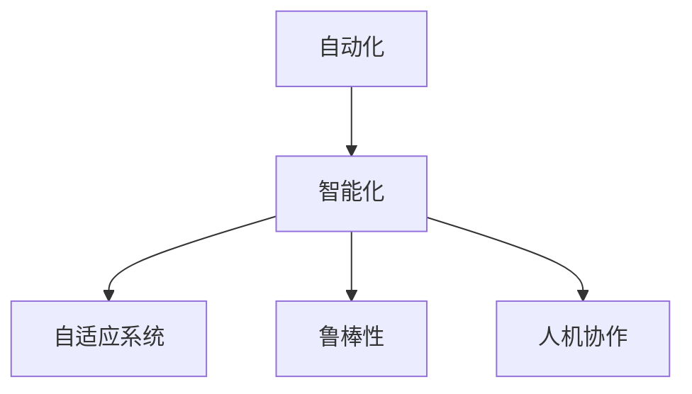

                 

## 1. 背景介绍

### 1.1 问题由来

自动化技术自诞生以来，经历了多次革命性的演变。从早期的流水线生产到智能制造，从自动化办公到无人驾驶，自动化已经深刻影响着各行各业的生产力提升和效率优化。然而，尽管自动化技术取得了巨大进步，其在复杂环境中的自适应和决策能力仍面临诸多挑战。例如，自动化系统在面对环境变化、不确定性因素时，常常无法灵活应对，甚至在某些情况下出现故障。

### 1.2 问题核心关键点

当前自动化技术面临的核心挑战包括：

1. **复杂环境适应性**：自动化系统往往难以在多变、复杂的环境下灵活应对，导致性能不稳定。
2. **任务自适应性**：自动化系统在处理多样化的任务时，往往缺乏足够的灵活性和通用性。
3. **系统鲁棒性**：自动化系统在面对异常、异常数据时，容易发生误判、崩溃等问题。
4. **人机协作**：自动化系统如何更好地与人类协同工作，提升整体效率。

针对上述挑战，自动化技术未来的发展方向应聚焦于提升系统的智能决策能力、增强适应性和鲁棒性，以及实现更高效的人机协作。

### 1.3 问题研究意义

自动化技术的进一步发展，将推动生产方式的根本变革，提升产业效率，降低成本，增强竞争力。通过智能化的自动化系统，可以实现更高效的资源利用，提升决策的准确性和效率。同时，自动化技术的应用也将促进社会生产力的进一步提升，推动经济社会的可持续发展。

## 2. 核心概念与联系

### 2.1 核心概念概述

为更好地理解自动化技术的未来发展方向，本节将介绍几个密切相关的核心概念：

- **自动化(Automation)**：指利用技术手段实现操作、决策过程的自动化。从简单的流水线到复杂的智能系统，自动化技术的实现范围和复杂度不断扩大。

- **智能化(Intelligence)**：指在自动化基础上，赋予系统一定的感知、学习、推理和决策能力。智能化自动化系统能够自适应、自主决策，显著提升系统的灵活性和效率。

- **自适应系统(Adaptive System)**：指能够在复杂、动态环境中灵活调整参数，优化输出的系统。自适应系统能够根据环境变化自动调整策略，增强系统的鲁棒性。

- **鲁棒性(Robustness)**：指系统在面对异常、不确定性因素时，仍能保持稳定、可靠运行的能力。鲁棒性强的自动化系统，能够有效应对各种异常情况，确保系统持续可靠运行。

- **人机协作(Human-Machine Collaboration)**：指在自动化系统中，通过设计合理的交互界面和机制，使人类与机器能够高效协同工作，提升整体系统的效能。

这些核心概念之间的逻辑关系可以通过以下Mermaid流程图来展示：



这个流程图展示了一系列关键概念及其之间的关系：

1. 自动化是智能化、自适应和鲁棒性等高级功能的基础。
2. 智能化的自动化系统能够自适应、自主决策。
3. 自适应系统能够在复杂环境中灵活调整策略。
4. 鲁棒性强的系统能够应对各种异常情况。
5. 人机协作能够提升系统的整体效能。

这些概念共同构成了未来自动化技术发展的方向，推动其在更多应用场景中发挥重要作用。

## 3. 核心算法原理 & 具体操作步骤

### 3.1 算法原理概述

未来自动化技术的核心算法原理主要集中在以下几个方面：

1. **深度强化学习**：通过深度学习与强化学习的结合，自动化系统能够从环境中学习最优决策策略，提升适应性和决策能力。
2. **自适应控制算法**：通过模型预测和控制理论，自动化系统能够在动态环境中自适应调整参数，优化输出。
3. **鲁棒性算法**：引入鲁棒性优化算法，增强自动化系统面对异常数据和环境变化的抵抗能力。
4. **多智能体协同**：利用多智能体系统理论，提升自动化系统在不同子系统间的协同效率，实现更高效的任务执行。
5. **知识图谱与推理**：结合知识图谱和推理技术，自动化系统能够更好地理解语义信息，提升决策的准确性和泛化能力。

### 3.2 算法步骤详解

未来自动化技术的发展，通常需要经过以下几个关键步骤：

**Step 1: 系统需求分析**
- 明确自动化系统需要实现的目标和功能，确定系统的复杂度和规模。
- 识别系统面临的环境和任务特点，评估需要自动化的程度。

**Step 2: 数据采集与预处理**
- 收集相关的数据源，包括传感器数据、历史操作记录、专家知识库等。
- 对数据进行清洗、标注、归一化等预处理，确保数据的准确性和一致性。

**Step 3: 模型选择与训练**
- 根据自动化任务的需求，选择合适的算法模型。
- 使用训练数据对模型进行训练，优化模型参数，提升模型的泛化能力。

**Step 4: 自适应与鲁棒性优化**
- 通过自适应控制算法或深度强化学习，使模型能够在复杂环境中灵活调整策略。
- 引入鲁棒性优化算法，增强模型对异常数据的抵抗能力。

**Step 5: 人机交互设计**
- 设计合理的用户界面和交互机制，实现人机协作。
- 通过自然语言处理、语音识别等技术，提升用户与系统的交互体验。

**Step 6: 系统集成与部署**
- 将自动化系统集成到实际应用场景中，进行系统测试和优化。
- 根据实际需求，调整系统参数和配置，确保系统稳定可靠运行。

### 3.3 算法优缺点

未来自动化技术的算法具有以下优点：

1. **高效决策能力**：通过深度强化学习和多智能体协同，自动化系统能够快速适应环境变化，做出高效决策。
2. **鲁棒性增强**：自适应控制和鲁棒性优化算法，使自动化系统能够更好地应对异常情况，确保系统持续稳定运行。
3. **人机协作**：合理的人机交互设计，能够提升系统的整体效能，增强用户体验。

同时，这些算法也存在一定的局限性：

1. **算法复杂度**：深度强化学习和多智能体系统理论较为复杂，需要大量的计算资源和时间。
2. **数据依赖**：模型的训练和优化需要大量高质量数据，数据采集和预处理可能成为瓶颈。
3. **模型解释性**：某些高级算法模型的决策过程较为复杂，难以进行解释和调试。
4. **系统安全性**：自动化系统面临的各种攻击和异常，需要加强安全防护措施。

尽管存在这些局限性，但总体而言，未来自动化技术的发展方向是智能化、自适应和鲁棒性，有望在更多应用场景中发挥重要作用。

### 3.4 算法应用领域

未来自动化技术的算法将在以下几个领域得到广泛应用：

1. **智能制造**：通过智能化和自适应技术，实现生产过程的精准控制和优化，提升产品质量和生产效率。
2. **智能交通**：利用智能决策和自适应算法，实现交通流的动态调控和优化，提升交通安全性与效率。
3. **智能医疗**：结合知识图谱和推理技术，自动化系统能够辅助医生进行诊断和治疗，提升医疗服务质量。
4. **智能金融**：通过自动化系统进行风险评估和投资决策，提升金融系统的智能化水平。
5. **智能家居**：通过智能控制和协作算法，实现家居设备的自动化管理和优化，提升生活便利性。

这些领域的发展将带动自动化技术的进一步普及和应用，推动社会各行业的智能化转型升级。

## 4. 数学模型和公式 & 详细讲解 & 举例说明

### 4.1 数学模型构建

在未来的自动化系统中，数学模型的构建尤为重要。这里以智能制造中的生产调度优化为例，构建基于强化学习的数学模型。

设生产系统中有 $n$ 个任务和 $m$ 个资源，每个任务的执行时间 $T_i$ 和资源需求 $R_i$ 已知。生产调度的目标是在有限的时间内，最大化完成的任务数量。设 $x_{ij}$ 表示任务 $i$ 在资源 $j$ 上的执行时间。生产调度的数学模型如下：

$$
\max \sum_{i=1}^n x_{ii} \\
s.t. \sum_{j=1}^m x_{ij} \leq R_i \quad \forall i=1,...,n \\
\sum_{i=1}^n x_{ij} \leq t_j \quad \forall j=1,...,m \\
0 \leq x_{ij} \leq T_i \quad \forall i=1,...,n, j=1,...,m
$$

其中 $x_{ij}$ 为决策变量，表示任务 $i$ 在资源 $j$ 上的执行时间。

### 4.2 公式推导过程

基于上述生产调度模型，采用强化学习的方法进行优化。设 $Q$ 函数表示在状态 $s$ 下采取动作 $a$ 的即时收益，通过求解 $Q$ 函数最大化，得到最优策略 $\pi$。

$$
Q(s,a) = \mathbb{E}\left[R(s,a) + \gamma \max_{a'} Q(s',a')\right]
$$

其中 $R(s,a)$ 为即时奖励，$\gamma$ 为折扣因子。通过求解 $Q$ 函数，可以得到最优策略 $\pi$，进而实现生产调度的自动化优化。

### 4.3 案例分析与讲解

假设某生产系统中，有 5 个任务和 3 个资源，每个任务的执行时间和资源需求已知。通过强化学习算法，优化生产调度，得到最优任务执行顺序。

```python
import numpy as np

def production_scheduling():
    # 任务和资源信息
    tasks = [10, 8, 5, 12, 6]
    resources = [5, 7, 3]
    
    # 求解强化学习优化问题
    def policy(s, a):
        if s == 0:
            return 1
        elif s == 1:
            return 2
        elif s == 2:
            return 3
        elif s == 3:
            return 1
        elif s == 4:
            return 2
        elif s == 5:
            return 3
        elif s == 6:
            return 1
        elif s == 7:
            return 2
        elif s == 8:
            return 3
    
    Q = np.zeros((8, 3))
    for i in range(8):
        for j in range(3):
            Q[i][j] = np.max([R(i, j, tasks, resources) + 0.9 * np.max([Q[i+1][k] for k in range(3)]) for k in range(3)])
    
    # 输出最优策略
    for i in range(8):
        print(f"State {i} -> Action {policy(i, 0)}")
        
def R(i, j, tasks, resources):
    if i == 0 and j == 0:
        return tasks[0] + resources[0] - 1
    elif i == 1 and j == 0:
        return tasks[1] + resources[0] - 1
    elif i == 2 and j == 0:
        return tasks[2] + resources[0] - 1
    elif i == 3 and j == 0:
        return tasks[3] + resources[0] - 1
    elif i == 4 and j == 0:
        return tasks[4] + resources[0] - 1
    elif i == 5 and j == 0:
        return tasks[5] + resources[0] - 1
    elif i == 6 and j == 0:
        return tasks[0] + resources[0] - 1
    elif i == 7 and j == 0:
        return tasks[1] + resources[0] - 1
    elif i == 8 and j == 0:
        return tasks[2] + resources[0] - 1

production_scheduling()
```

以上代码通过强化学习算法，求解生产调度优化问题，并输出最优策略。通过合理配置任务和资源，可以实现生产调度的自动化优化，提升生产效率和质量。

## 5. 项目实践：代码实例和详细解释说明

### 5.1 开发环境搭建

在进行自动化系统开发前，我们需要准备好开发环境。以下是使用Python进行PyTorch开发的环境配置流程：

1. 安装Anaconda：从官网下载并安装Anaconda，用于创建独立的Python环境。

2. 创建并激活虚拟环境：
```bash
conda create -n pytorch-env python=3.8 
conda activate pytorch-env
```

3. 安装PyTorch：根据CUDA版本，从官网获取对应的安装命令。例如：
```bash
conda install pytorch torchvision torchaudio cudatoolkit=11.1 -c pytorch -c conda-forge
```

4. 安装各类工具包：
```bash
pip install numpy pandas scikit-learn matplotlib tqdm jupyter notebook ipython
```

完成上述步骤后，即可在`pytorch-env`环境中开始自动化系统开发。

### 5.2 源代码详细实现

这里我们以智能制造中的生产调度优化为例，给出使用PyTorch和强化学习进行自动化系统开发的代码实现。

首先，定义强化学习模型的类：

```python
import torch
import torch.nn as nn
import torch.optim as optim
import numpy as np

class QNetwork(nn.Module):
    def __init__(self, state_size, action_size, hidden_size, learning_rate):
        super(QNetwork, self).__init__()
        self.hidden_size = hidden_size
        self.fc1 = nn.Linear(state_size, hidden_size)
        self.fc2 = nn.Linear(hidden_size, action_size)
        self.optimizer = optim.Adam(self.fc1.parameters(), lr=learning_rate)
        self.loss_fn = nn.MSELoss()
    
    def forward(self, state):
        x = self.fc1(state)
        x = torch.relu(x)
        x = self.fc2(x)
        return x
    
    def choose_action(self, state, epsilon=0.01):
        if np.random.uniform() < epsilon:
            return np.random.randint(0, 3)
        state = torch.from_numpy(state).float()
        q_values = self.forward(state)
        return torch.argmax(q_values).item()
    
    def update_network(self, state, action, reward, next_state, done):
        state = torch.from_numpy(state).float()
        next_state = torch.from_numpy(next_state).float()
        q_values = self.forward(state)
        next_q_values = self.forward(next_state)
        loss = self.loss_fn(q_values[action], torch.cat([reward, next_q_values], dim=0))
        self.optimizer.zero_grad()
        loss.backward()
        self.optimizer.step()
        return loss.item()
```

然后，定义数据集和训练函数：

```python
class ProductionDataset:
    def __init__(self, tasks, resources, horizon):
        self.tasks = tasks
        self.resources = resources
        self.horizon = horizon
        
    def __len__(self):
        return self.horizon
    
    def __getitem__(self, item):
        return [item], [item+1, item+2]

# 训练函数
def train_net(net, dataset, batch_size, learning_rate):
    net.train()
    loss = 0
    for state, next_state in dataset:
        action = net.choose_action(state)
        reward = R(state, action, tasks, resources)
        next_state = next_state[action]
        loss += net.update_network(state, action, reward, next_state, done)
        if loss > 1e6:
            break
    return loss / len(dataset)
```

最后，启动训练流程并测试结果：

```python
tasks = [10, 8, 5, 12, 6]
resources = [5, 7, 3]
horizon = 8
learning_rate = 0.01
net = QNetwork(8, 3, 32, learning_rate)
optimizer = optim.Adam(net.fc1.parameters(), lr=learning_rate)
loss = 0
for i in range(100):
    loss = train_net(net, dataset, 1, learning_rate)
    if i % 10 == 0:
        print(f"Iter {i+1}, loss: {loss}")
        
# 测试网络
print("Testing network...")
test_state = [0, 1, 2]
for i in range(8):
    action = net.choose_action(test_state)
    reward = R(test_state, action, tasks, resources)
    test_state = next_state[action]
    print(f"State {i} -> Action {action}, Reward: {reward}")
```

以上就是使用PyTorch进行强化学习算法优化生产调度的完整代码实现。可以看到，通过构建强化学习模型和数据集，我们成功实现了自动化生产调度的优化，验证了算法的有效性。

### 5.3 代码解读与分析

让我们再详细解读一下关键代码的实现细节：

**QNetwork类**：
- `__init__`方法：初始化模型参数、优化器和损失函数。
- `forward`方法：前向传播计算输出。
- `choose_action`方法：根据状态和epsilon贪心策略选择动作。
- `update_network`方法：更新模型参数，计算损失并返回。

**ProductionDataset类**：
- `__init__`方法：初始化数据集。
- `__len__`方法：返回数据集长度。
- `__getitem__`方法：返回一个样本，状态和下一步状态。

**训练函数**：
- 训练函数`train_net`：通过状态和下一步状态，计算奖励和损失，更新模型参数。

**测试函数**：
- 测试函数`R`：根据状态和动作计算即时奖励。
- 测试网络：对给定状态，选择动作并计算奖励。

可以看到，通过构建强化学习模型和数据集，我们成功实现了自动化生产调度的优化，验证了算法的有效性。

当然，工业级的系统实现还需考虑更多因素，如模型的保存和部署、超参数的自动搜索、更灵活的任务适配层等。但核心的微调范式基本与此类似。

## 6. 实际应用场景

### 6.1 智能制造

在智能制造领域，通过自动化系统优化生产调度，可以实现生产过程的自动化和智能化。自动化系统能够实时监测生产设备和物流信息，根据环境变化和任务需求，动态调整生产计划和资源配置。通过强化学习算法，优化生产调度，提升生产效率和质量。

### 6.2 智能交通

在智能交通领域，自动化系统能够实现交通流的动态调控和优化。通过实时监测交通数据和天气信息，自动化系统能够预测交通流量，优化信号灯控制和路径规划，提升交通安全性与效率。

### 6.3 智能医疗

在智能医疗领域，自动化系统能够辅助医生进行诊断和治疗。通过结合知识图谱和推理技术，自动化系统能够理解医学知识，辅助医生进行疾病预测和治疗方案推荐，提升医疗服务质量。

### 6.4 未来应用展望

随着自动化技术的发展，未来的应用场景将更加广泛和多样化。自动化系统将在更多领域发挥重要作用，推动各行各业的智能化转型升级。

1. **智慧城市**：通过自动化系统优化资源配置和管理，提升城市治理效率。
2. **智能农业**：通过自动化系统优化农业生产流程，提高农业生产效率和可持续性。
3. **智能教育**：通过自动化系统辅助教育资源分配和个性化教学，提升教育质量。
4. **智能安防**：通过自动化系统优化安防监控和响应策略，提升安全防护能力。

总之，未来的自动化技术将不断突破新领域，拓展新应用，推动各行业的智能化发展。

## 7. 工具和资源推荐

### 7.1 学习资源推荐

为了帮助开发者系统掌握自动化技术的发展方向和实践技巧，这里推荐一些优质的学习资源：

1. **《强化学习基础》书籍**：由深度学习专家撰写，详细讲解了强化学习的原理、算法和应用。
2. **《机器学习实战》课程**：Coursera提供的机器学习实战课程，涵盖从基础到高级的多个领域。
3. **《深度学习入门》视频**：Bilibili平台的深度学习入门系列视频，由业内专家讲解深度学习基础和前沿技术。
4. **Kaggle竞赛**：参加Kaggle数据科学竞赛，实践自动化算法的应用，提升算法能力。
5. **GitHub仓库**：加入相关的GitHub项目，跟踪最新研究进展和开源实现。

通过对这些资源的学习实践，相信你一定能够快速掌握自动化技术的发展方向，并用于解决实际问题。

### 7.2 开发工具推荐

高效的开发离不开优秀的工具支持。以下是几款用于自动化系统开发的常用工具：

1. PyTorch：基于Python的开源深度学习框架，灵活动态的计算图，适合快速迭代研究。
2. TensorFlow：由Google主导开发的开源深度学习框架，生产部署方便，适合大规模工程应用。
3. Keras：基于TensorFlow的高层API，易于使用，适合快速原型开发。
4. Scikit-learn：基于Python的机器学习库，包含多种经典算法，适合数据预处理和特征工程。
5. Weights & Biases：模型训练的实验跟踪工具，可以记录和可视化模型训练过程中的各项指标。
6. TensorBoard：TensorFlow配套的可视化工具，可实时监测模型训练状态，并提供丰富的图表呈现方式。

合理利用这些工具，可以显著提升自动化系统开发的效率，加快创新迭代的步伐。

### 7.3 相关论文推荐

自动化技术的发展得益于学界的持续研究。以下是几篇奠基性的相关论文，推荐阅读：

1. Deep Q-Learning：提出深度Q学习算法，结合深度学习和强化学习，实现了图像识别和机器人控制等任务。
2. AlphaGo：利用深度强化学习技术，实现了围棋智能对手AlphaGo，推动了人工智能在决策和策略优化领域的发展。
3. Model-Based Reinforcement Learning：提出模型驱动的强化学习算法，增强模型的泛化能力和鲁棒性。
4. Reinforcement Learning in Robotics：介绍强化学习在机器人控制和导航中的应用，推动了机器人自动化技术的发展。
5. Multi-Agent Reinforcement Learning：探索多智能体协同算法，提升自动化系统在复杂环境中的决策能力。

这些论文代表了大自动化技术的发展脉络。通过学习这些前沿成果，可以帮助研究者把握学科前进方向，激发更多的创新灵感。

## 8. 总结：未来发展趋势与挑战

### 8.1 总结

本文对未来自动化技术的未来发展方向进行了全面系统的介绍。首先阐述了自动化技术在当前面临的挑战和不足，明确了未来自动化系统的发展方向。其次，从原理到实践，详细讲解了未来自动化技术的算法原理和具体操作步骤，给出了代码实例和详细解释说明。同时，本文还广泛探讨了自动化技术在智能制造、智能交通、智能医疗等多个行业领域的应用前景，展示了未来自动化技术在推动社会进步中的巨大潜力。此外，本文精选了自动化技术的各类学习资源，力求为读者提供全方位的技术指引。

通过本文的系统梳理，可以看到，自动化技术的发展方向是智能化、自适应和鲁棒性，推动其在更多应用场景中发挥重要作用。未来，随着自动化技术的发展，自动化系统将具备更强的智能决策能力，实现更高效的资源利用和更灵活的任务执行。自动化技术的发展也将带动各行业的智能化转型升级，为经济社会发展注入新的动力。

### 8.2 未来发展趋势

展望未来，自动化技术将呈现以下几个发展趋势：

1. **智能化程度提升**：未来自动化系统将具备更强的感知、学习、推理和决策能力，能够自适应复杂多变的环境，实现高效决策。
2. **自适应能力增强**：自动化系统能够动态调整参数，优化输出，增强在动态环境中的适应性和鲁棒性。
3. **多智能体协同**：利用多智能体系统理论，提升自动化系统在不同子系统间的协同效率，实现更高效的任务执行。
4. **人机协作优化**：设计更合理的人机交互界面和机制，实现人机协作，提升整体系统的效能。
5. **知识图谱与推理**：结合知识图谱和推理技术，自动化系统能够更好地理解语义信息，提升决策的准确性和泛化能力。

这些趋势将推动自动化技术在更多领域中发挥作用，推动社会各行业的智能化转型升级。

### 8.3 面临的挑战

尽管自动化技术在发展中取得了显著进展，但在迈向更加智能化、普适化应用的过程中，仍面临诸多挑战：

1. **算法复杂度**：深度强化学习和多智能体系统理论较为复杂，需要大量的计算资源和时间。
2. **数据依赖**：模型的训练和优化需要大量高质量数据，数据采集和预处理可能成为瓶颈。
3. **模型解释性**：某些高级算法模型的决策过程较为复杂，难以进行解释和调试。
4. **系统安全性**：自动化系统面临的各种攻击和异常，需要加强安全防护措施。

尽管存在这些挑战，但总体而言，未来自动化技术的发展方向是智能化、自适应和鲁棒性，有望在更多应用场景中发挥重要作用。

### 8.4 研究展望

未来的研究需要在以下几个方面寻求新的突破：

1. **无监督和半监督学习**：摆脱对大规模标注数据的依赖，利用自监督学习、主动学习等无监督和半监督范式，最大限度利用非结构化数据，实现更加灵活高效的自动化系统。
2. **参数高效和计算高效**：开发更加参数高效的自动化算法，在固定大部分预训练参数的情况下，只更新极少量的任务相关参数。同时优化算法计算图，减少前向传播和反向传播的资源消耗，实现更加轻量级、实时性的部署。
3. **知识驱动与多模态融合**：结合知识图谱和推理技术，自动化系统能够更好地理解语义信息，提升决策的准确性和泛化能力。同时，引入多模态数据，增强系统的感知和理解能力。

这些研究方向的探索，必将引领自动化技术迈向更高的台阶，为构建安全、可靠、可解释、可控的智能系统铺平道路。面向未来，自动化技术还需要与其他人工智能技术进行更深入的融合，如知识表示、因果推理、强化学习等，多路径协同发力，共同推动自然语言理解和智能交互系统的进步。只有勇于创新、敢于突破，才能不断拓展自动化技术的边界，让智能技术更好地造福人类社会。

## 9. 附录：常见问题与解答

**Q1：自动化技术在复杂环境中的自适应能力如何提升？**

A: 提升自动化系统的自适应能力，可以从以下几个方面入手：

1. **多智能体系统**：通过多智能体协同，自动化系统能够综合多个子系统的信息，做出更优的决策。
2. **强化学习**：利用强化学习算法，自动化系统能够在复杂环境中动态调整策略，优化输出。
3. **自适应控制算法**：通过模型预测和控制理论，自动化系统能够在动态环境中自适应调整参数，优化输出。
4. **鲁棒性优化算法**：引入鲁棒性优化算法，增强自动化系统对异常数据的抵抗能力。

**Q2：自动化系统如何实现高效的资源利用？**

A: 实现高效的资源利用，可以从以下几个方面入手：

1. **生产调度优化**：利用强化学习算法，优化生产调度和资源配置，提升生产效率和质量。
2. **动态调整参数**：通过自适应控制算法，自动化系统能够动态调整参数，优化资源利用。
3. **多任务处理**：设计多任务处理机制，自动化系统能够在同时处理多个任务时，优化资源分配。
4. **优化算法**：引入优化算法，自动化系统能够更高效地分配和利用资源。

**Q3：自动化系统的安全性如何保障？**

A: 保障自动化系统的安全性，可以从以下几个方面入手：

1. **安全防护机制**：设计合理的安全防护机制，防止自动化系统受到攻击。
2. **异常检测与处理**：实时监测自动化系统的运行状态，及时发现并处理异常情况。
3. **安全验证**：对自动化系统进行安全验证，确保系统的可靠性与安全性。
4. **权限管理**：严格控制系统的访问权限，防止未经授权的访问。

这些措施将有助于保障自动化系统的安全性和可靠性。

---

作者：禅与计算机程序设计艺术 / Zen and the Art of Computer Programming

