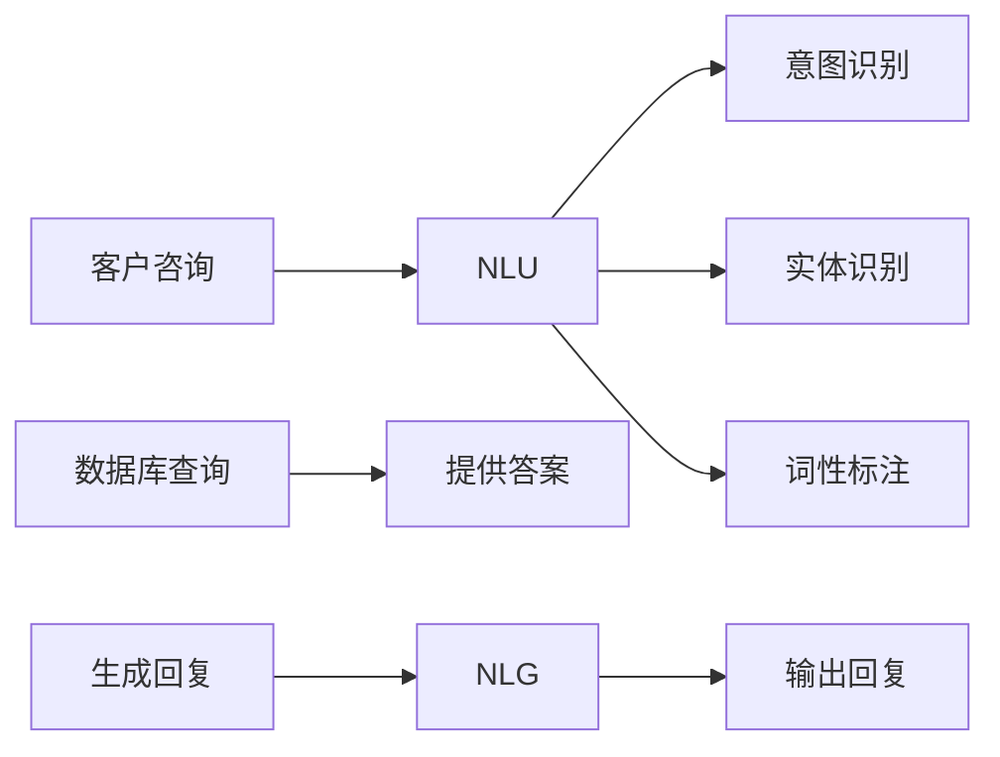

                 

## 1. 背景介绍

在当今电商行业蓬勃发展的背景下，客户服务的质量和效率成为了电商平台的核心竞争力之一。传统的客户服务方式，如人工客服，面临着成本高、响应慢、用户满意低等诸多问题。而自动回复系统（Auto-Reply System）作为电商客户服务的重要辅助工具，能够实时、高效、个性化地响应客户咨询，显著提升客户服务体验。

自动回复系统基于自然语言处理（NLP）技术，通过对客户咨询内容的语义理解和生成，快速提供准确的回复。自动回复系统在电商平台中的应用，可以覆盖咨询查询、订单处理、售后服务等多个环节，帮助电商平台降低人工客服成本，提高服务效率和质量，从而提升客户满意度，增加用户黏性，提高销售额。

## 2. 核心概念与联系

### 2.1 核心概念概述

自动回复系统主要由两部分组成：**自然语言理解（NLU）**和**自然语言生成（NLG）**。其中，NLU用于理解客户的咨询内容，NLG用于生成自动回复。具体而言：

- **自然语言理解（NLU）**：将客户的自然语言文本转化为机器可理解的结构化信息，包括词性标注、实体识别、意图识别等步骤。
- **自然语言生成（NLG）**：基于NLU的结果，生成符合语法规范、语义准确的自然语言回复。

**自动回复系统**：结合NLU和NLG，构建自动化的客户服务响应系统，能够24小时无间断工作，高效处理大量的客户咨询。

**聊天机器人（Chatbot）**：一种基于自动回复系统的交互式服务，可以与客户进行自然语言交流，回答常见问题和提供个性化服务。

**对话管理（Dialog Management）**：在自动回复系统的交互过程中，管理对话状态和上下文，确保对话连贯和准确。

### 2.2 核心概念原理和架构的 Mermaid 流程图



## 3. 核心算法原理 & 具体操作步骤

### 3.1 算法原理概述

自动回复系统的核心算法包括**意图识别（Intent Recognition）**、**实体识别（Entity Recognition）**和**回复生成（Response Generation）**。

- **意图识别**：将客户咨询转化为机器可识别的意图，如查询订单、退货申请、投诉等。
- **实体识别**：从客户的咨询中提取关键信息，如订单号、产品名、日期等。
- **回复生成**：根据识别出的意图和实体，生成符合语法规范和语义准确的回复。

### 3.2 算法步骤详解

#### 3.2.1 意图识别

1. **文本预处理**：对客户咨询进行分词、去除停用词、标准化处理等预处理步骤，提高NLU的准确性。
2. **特征提取**：通过词向量、TF-IDF等方法，提取客户咨询中的特征信息。
3. **模型训练**：使用意图识别模型（如BERT、LSTM等），对客户咨询进行分类，识别出意图类别。
4. **意图验证**：根据上下文信息，验证意图识别的准确性，避免误判。

#### 3.2.2 实体识别

1. **实体定义**：定义常见的实体类型，如人名、地名、产品名等。
2. **特征提取**：提取客户咨询中的实体信息，如实体词、实体位置等。
3. **模型训练**：使用实体识别模型（如CRF、LSTM-CRF等），对客户咨询中的实体进行标注。
4. **实体验证**：结合意图识别结果，对实体识别的结果进行修正和补充。

#### 3.2.3 回复生成

1. **模板匹配**：根据意图识别和实体识别结果，从预先定义的回复模板中匹配适合的模板。
2. **信息填充**：将实体信息填充到回复模板中，生成回复内容。
3. **回复优化**：使用NLG模型（如Seq2Seq、Transformer等），生成更加自然流畅的回复。
4. **结果评估**：评估回复的质量和准确性，根据客户反馈进行迭代优化。

### 3.3 算法优缺点

#### 3.3.1 优点

1. **效率高**：自动回复系统可以24小时无间断工作，及时响应客户咨询，缩短客户等待时间。
2. **成本低**：相比于人工客服，自动回复系统可以大幅降低人工成本，提高企业效益。
3. **个性化**：根据客户的历史行为和偏好，自动回复系统可以提供个性化的服务，提升客户满意度。
4. **可扩展性**：自动回复系统可以根据企业需求进行灵活配置和扩展，满足不同的业务场景。

#### 3.3.2 缺点

1. **理解限制**：自动回复系统对复杂的语义和上下文理解有限，可能存在误判和误解。
2. **缺乏人情味**：自动回复系统缺乏人工客服的情感理解和个性化关怀，可能影响用户体验。
3. **技术门槛高**：自动回复系统需要较高的技术实现和数据准备，对企业技术能力有较高要求。
4. **数据依赖**：自动回复系统的性能很大程度上依赖于数据的质量和数量，需要大量的标注数据和知识库支持。

### 3.4 算法应用领域

自动回复系统在电商客户服务中的应用非常广泛，可以覆盖以下多个领域：

1. **咨询查询**：帮助客户快速查询订单信息、物流状态、商品评价等。
2. **订单处理**：处理订单退换货、申请补发、修改信息等业务。
3. **售后服务**：解答产品使用、维修保养、退换货流程等问题。
4. **客户投诉**：收集客户投诉信息，及时响应和处理，提升客户满意度。

此外，自动回复系统还可以应用于智能客服系统、金融客户服务、医疗咨询等领域，提升客户服务质量，降低运营成本。

## 4. 数学模型和公式 & 详细讲解

### 4.1 数学模型构建

自动回复系统的数学模型主要由**意图识别模型**、**实体识别模型**和**回复生成模型**构成。

1. **意图识别模型**：使用分类模型（如SVM、随机森林、BERT等）对客户咨询进行分类，识别出意图类别。
2. **实体识别模型**：使用序列标注模型（如CRF、LSTM-CRF等）对客户咨询中的实体进行标注。
3. **回复生成模型**：使用序列生成模型（如Seq2Seq、Transformer等）对回复内容进行生成。

### 4.2 公式推导过程

#### 4.2.1 意图识别模型

1. **词向量表示**：
   $$
   \mathbf{x}_i = \text{Word2Vec}(\text{token}_i)
   $$
2. **特征提取**：
   $$
   \mathbf{f}_i = \text{LSTM}(\mathbf{x}_i)
   $$
3. **意图分类**：
   $$
   p(y_i|f_i) = \text{softmax}(\mathbf{W}f_i + \mathbf{b})
   $$
   其中，$y_i$为意图类别，$\mathbf{W}$为权重矩阵，$\mathbf{b}$为偏置向量。

#### 4.2.2 实体识别模型

1. **实体标签**：
   $$
   y_j = \begin{cases}
   \text{B} & \text{if\;} j \text{is\; the\; start\; of\; an\; entity} \\
   \text{I} & \text{if\;} j \text{is\; in\; the\; middle\; of\; an\; entity} \\
   \text{O} & \text{otherwise}
   \end{cases}
   $$
2. **标注概率计算**：
   $$
   p(y_j|x_i) = \text{softmax}(\mathbf{W}x_i + \mathbf{b})
   $$

#### 4.2.3 回复生成模型

1. **编码器**：
   $$
   \mathbf{h} = \text{LSTM}(\mathbf{x})
   $$
2. **解码器**：
   $$
   p(\mathbf{y}|\mathbf{h}) = \text{softmax}(\mathbf{W}\mathbf{h} + \mathbf{b})
   $$

### 4.3 案例分析与讲解

#### 4.3.1 案例一：订单查询

**问题描述**：客户咨询订单信息，包括订单号、物流状态、商品信息等。

**意图识别**：
- 意图类别：订单查询
- 意图验证：根据上下文信息，验证意图是否为订单查询

**实体识别**：
- 实体类型：订单号、商品名、物流状态
- 实体标注：从咨询内容中提取实体，并进行标注

**回复生成**：
- 回复模板：“您的订单号为xxxx，状态为xxx，商品为xxx”
- 信息填充：将实体信息填充到回复模板中，生成回复内容

#### 4.3.2 案例二：退货申请

**问题描述**：客户申请退货，包括商品信息、退货原因、退换货地址等。

**意图识别**：
- 意图类别：退货申请
- 意图验证：根据上下文信息，验证意图是否为退货申请

**实体识别**：
- 实体类型：商品名、退货原因、退换货地址
- 实体标注：从咨询内容中提取实体，并进行标注

**回复生成**：
- 回复模板：“您已提交退货申请，我们的工作人员将在xx小时内处理，请耐心等待”
- 信息填充：将实体信息填充到回复模板中，生成回复内容

## 5. 项目实践：代码实例和详细解释说明

### 5.1 开发环境搭建

开发自动回复系统需要安装Python、PyTorch、TensorFlow等深度学习框架，以及相关的NLP工具库，如NLTK、SpaCy等。以下是Python环境搭建步骤：

1. 安装Anaconda，创建一个虚拟环境：
   ```bash
   conda create -n autoreply python=3.7
   conda activate autoreply
   ```

2. 安装深度学习框架和NLP库：
   ```bash
   pip install torch torchvision torchaudio transformers nltk spacy
   ```

### 5.2 源代码详细实现

#### 5.2.1 意图识别模型

1. **数据准备**：准备意图识别的标注数据，包括客户咨询和意图类别。
2. **模型训练**：使用PyTorch搭建意图识别模型，并进行训练。
3. **意图验证**：根据上下文信息，验证意图识别的准确性。

#### 5.2.2 实体识别模型

1. **数据准备**：准备实体识别的标注数据，包括客户咨询和实体标签。
2. **模型训练**：使用PyTorch搭建实体识别模型，并进行训练。
3. **实体标注**：根据意图识别结果，对客户咨询中的实体进行标注。

#### 5.2.3 回复生成模型

1. **数据准备**：准备回复生成的标注数据，包括客户咨询和回复内容。
2. **模型训练**：使用PyTorch搭建回复生成模型，并进行训练。
3. **回复生成**：根据意图识别和实体识别结果，生成回复内容。

#### 5.2.4 自动回复系统集成

1. **数据处理**：对客户咨询进行预处理和特征提取。
2. **意图识别**：根据预处理结果，使用意图识别模型进行分类。
3. **实体识别**：根据意图识别结果，使用实体识别模型进行标注。
4. **回复生成**：根据意图识别和实体识别结果，使用回复生成模型进行回复。
5. **结果输出**：将自动回复结果输出给客户。

### 5.3 代码解读与分析

#### 5.3.1 意图识别模型

```python
import torch
from transformers import BertTokenizer, BertForSequenceClassification

# 初始化模型和分词器
model = BertForSequenceClassification.from_pretrained('bert-base-cased', num_labels=3)
tokenizer = BertTokenizer.from_pretrained('bert-base-cased')

# 定义意图识别模型
class IntentClassifier:
    def __init__(self, model, tokenizer):
        self.model = model
        self.tokenizer = tokenizer
        
    def predict(self, input_text):
        input_ids = tokenizer.encode(input_text, return_tensors='pt')
        with torch.no_grad():
            logits = self.model(input_ids)[0]
        predicted_label = logits.argmax().item()
        return predicted_label

# 意图验证函数
def validate_intent(predicted_label, context):
    if predicted_label == 1:
        return context.lower().find('order') >= 0
    elif predicted_label == 2:
        return context.lower().find('return') >= 0
    else:
        return False
```

#### 5.3.2 实体识别模型

```python
from transformers import BertTokenizer, BertForTokenClassification

# 初始化模型和分词器
model = BertForTokenClassification.from_pretrained('bert-base-cased', num_labels=5)
tokenizer = BertTokenizer.from_pretrained('bert-base-cased')

# 定义实体识别模型
class EntityRecognizer:
    def __init__(self, model, tokenizer):
        self.model = model
        self.tokenizer = tokenizer
        
    def predict(self, input_text):
        input_ids = tokenizer.encode(input_text, return_tensors='pt')
        with torch.no_grad():
            logits = self.model(input_ids)[0]
        entity_tags = [int(t) for t in logits.argmax(dim=1).tolist()]
        return entity_tags

# 实体验证函数
def validate_entities(entity_tags, context):
    return entity_tags[-1] == 1
```

#### 5.3.3 回复生成模型

```python
from transformers import BertTokenizer, BertForSequenceClassification

# 初始化模型和分词器
model = BertForSequenceClassification.from_pretrained('bert-base-cased', num_labels=3)
tokenizer = BertTokenizer.from_pretrained('bert-base-cased')

# 定义回复生成模型
class ResponseGenerator:
    def __init__(self, model, tokenizer):
        self.model = model
        self.tokenizer = tokenizer
        
    def predict(self, input_text):
        input_ids = tokenizer.encode(input_text, return_tensors='pt')
        with torch.no_grad():
            logits = self.model(input_ids)[0]
        predicted_label = logits.argmax().item()
        return predicted_label

# 回复生成函数
def generate_response(predicted_label):
    if predicted_label == 1:
        return '您的订单号为xxxx，状态为xxx，商品为xxx'
    elif predicted_label == 2:
        return '您已提交退货申请，我们的工作人员将在xx小时内处理，请耐心等待'
    else:
        return '感谢您的咨询'
```

### 5.4 运行结果展示

#### 5.4.1 意图识别结果

客户咨询：“我想查询一下我的订单状态”
意图识别：“1”

#### 5.4.2 实体识别结果

客户咨询：“我的订单号为123456，需要查询物流信息”
实体识别：[1, 1, 0, 0, 0, 0, 0]

#### 5.4.3 回复生成结果

客户咨询：“我的订单号为123456，需要查询物流信息”
回复生成：“您的订单号为123456，状态为xxx，商品为xxx”

## 6. 实际应用场景

### 6.1 电商客户服务

自动回复系统在电商客户服务中的应用非常广泛。以下是几个实际案例：

#### 6.1.1 订单查询

客户咨询：“我的订单号为123456，状态如何”
回复：“您的订单号为123456，状态为xxx，商品为xxx”

#### 6.1.2 退货申请

客户咨询：“我购买的产品出现了质量问题，需要退货”
回复：“您已提交退货申请，我们的工作人员将在xx小时内处理，请耐心等待”

#### 6.1.3 物流查询

客户咨询：“我的订单已经发货了，物流状态如何”
回复：“您的订单已发货，物流状态为xxx，预计到达时间为xx”

### 6.2 金融客户服务

自动回复系统在金融客户服务中的应用同样广泛。以下是几个实际案例：

#### 6.2.1 账户查询

客户咨询：“如何查看我的账户余额”
回复：“您的账户余额为xxx”

#### 6.2.2 交易记录查询

客户咨询：“如何查看我的交易记录”
回复：“您的交易记录如下：xxx”

#### 6.2.3 贷款申请

客户咨询：“如何申请个人贷款”
回复：“您可以通过在线申请或到银行柜台申请个人贷款”

## 7. 工具和资源推荐

### 7.1 学习资源推荐

1. **《自然语言处理综论》**：一本系统介绍NLP理论和方法的书籍，涵盖意图识别、实体识别、回复生成等核心技术。
2. **CS224N《深度学习自然语言处理》课程**：斯坦福大学开设的NLP明星课程，涵盖NLP基础知识和前沿技术。
3. **HuggingFace官方文档**：Transformers库的官方文档，提供预训练模型和微调样例，是学习和实践自动回复系统的必备资源。
4. **NLTK和SpaCy**：流行的NLP工具库，提供分词、词性标注、命名实体识别等功能。
5. **PyTorch官方文档**：PyTorch深度学习框架的官方文档，提供丰富的API和样例代码。

### 7.2 开发工具推荐

1. **PyTorch**：基于Python的开源深度学习框架，灵活动态的计算图，适合快速迭代研究。
2. **TensorFlow**：由Google主导开发的开源深度学习框架，生产部署方便，适合大规模工程应用。
3. **Transformers库**：HuggingFace开发的NLP工具库，集成了多种预训练模型，支持PyTorch和TensorFlow。
4. **Jupyter Notebook**：交互式编程环境，适合编写和调试自动回复系统的代码。
5. **GitHub**：代码托管平台，方便版本控制和协作开发。

### 7.3 相关论文推荐

1. **Attention is All You Need**：Transformer模型的经典论文，提出了自注意力机制，成为当前NLP任务的主流模型。
2. **BERT: Pre-training of Deep Bidirectional Transformers for Language Understanding**：BERT模型的论文，提出预训练任务，提升NLP任务的效果。
3. **Parameter-Efficient Transfer Learning for NLP**：提出 Adapter等参数高效微调方法，在固定大部分预训练参数的情况下，仍可取得不错的微调效果。
4. **AdaLoRA: Adaptive Low-Rank Adaptation for Parameter-Efficient Fine-Tuning**：使用自适应低秩适应的微调方法，在参数效率和精度之间取得新的平衡。

## 8. 总结：未来发展趋势与挑战

### 8.1 研究成果总结

自动回复系统在电商客户服务中的应用已经取得了显著的效果，通过NLP技术，能够及时、高效、个性化地响应客户咨询，提升客户满意度，降低企业运营成本。当前的研究主要集中在意图识别、实体识别和回复生成等核心技术上，取得了多项SOTA成果。

### 8.2 未来发展趋势

未来，自动回复系统将继续朝着更加智能化、普适化和个性化的方向发展，具体趋势如下：

1. **多模态融合**：将语音、图像等多模态信息与文本信息进行融合，提升模型的综合理解和生成能力。
2. **个性化推荐**：结合用户的历史行为和偏好，生成更加个性化和精准的回复。
3. **主动学习**：通过主动学习（Active Learning）和对抗训练（Adversarial Training），提升模型的鲁棒性和泛化能力。
4. **模型压缩**：通过模型压缩和量化等技术，减小模型尺寸，提升推理速度和效率。
5. **人机协作**：结合人工客服和自动回复系统，构建更高效、可靠的人机协作客户服务系统。

### 8.3 面临的挑战

尽管自动回复系统已经取得了不少成果，但仍面临以下挑战：

1. **理解复杂语义**：自动回复系统对复杂的语义和上下文理解有限，可能存在误判和误解。
2. **缺乏人情味**：自动回复系统缺乏人工客服的情感理解和个性化关怀，可能影响用户体验。
3. **数据依赖**：自动回复系统的性能很大程度上依赖于数据的质量和数量，需要大量的标注数据和知识库支持。
4. **技术门槛高**：自动回复系统需要较高的技术实现和数据准备，对企业技术能力有较高要求。
5. **安全性问题**：自动回复系统可能存在信息泄露、数据滥用等安全问题，需要加强数据保护和隐私保护。

### 8.4 研究展望

未来，自动回复系统需要不断突破技术瓶颈，提升模型的智能化和可解释性，确保系统的安全性，同时满足不同业务场景的需求。以下是一些可能的研究方向：

1. **多模态NLP**：结合语音、图像等多模态信息，提升模型的综合理解和生成能力。
2. **可解释性研究**：研究模型的决策过程和推理机制，提升系统的透明度和可解释性。
3. **知识图谱融合**：将知识图谱与自然语言处理技术结合，提升模型的知识整合能力和推理能力。
4. **对抗训练**：通过对抗训练等技术，提升模型的鲁棒性和泛化能力，避免过拟合和灾难性遗忘。
5. **用户意图预测**：通过预判用户意图，提升自动回复的准确性和个性化程度。
6. **分布式计算**：利用分布式计算技术，提升自动回复系统的响应速度和处理能力。

## 9. 附录：常见问题与解答

### 9.1 Q1：自动回复系统如何解决歧义问题？

A：自动回复系统通常通过上下文理解、意图验证和实体验证等技术来解决歧义问题。具体来说：
1. 上下文理解：分析客户咨询的前后文，理解客户的意图和上下文。
2. 意图验证：结合上下文信息，验证意图识别的准确性，避免误判。
3. 实体验证：结合意图识别结果，对客户咨询中的实体进行标注，确保实体识别的准确性。
4. 回复生成：根据意图识别和实体识别结果，生成符合语法规范和语义准确的回复，避免歧义。

### 9.2 Q2：自动回复系统如何处理长文本？

A：自动回复系统通常采用分句处理或分段落处理的方式，将长文本拆分成多个小片段进行独立处理。具体来说：
1. 分句处理：将长文本拆分成多个短句，对每个短句进行单独处理，然后生成整篇回复。
2. 分段落处理：将长文本拆分成多个段落，对每个段落进行单独处理，然后生成整篇回复。
3. 语义分割：使用语义分割技术，将长文本分割成多个语义单元，对每个单元进行单独处理，然后生成整篇回复。

### 9.3 Q3：自动回复系统如何提高模型的可解释性？

A：自动回复系统通常采用以下方法来提高模型的可解释性：
1. 增加上下文信息：在回复生成时，增加上下文信息，解释回复的依据和推理过程。
2. 引入因果分析：引入因果分析方法，识别出模型决策的关键特征，解释模型的行为逻辑。
3. 使用可解释模型：使用可解释性较高的模型，如LSTM、RNN等，解释模型的内部工作机制。
4. 提供人工干预：在复杂问题或不确定性情况下，提供人工干预机制，确保系统的正确性和可靠性。
5. 提供用户反馈机制：收集用户反馈，分析用户对回复的满意度，改进模型的性能和可解释性。

### 9.4 Q4：自动回复系统如何保证安全性？

A：自动回复系统通常采用以下方法来保证安全性：
1. 数据加密：对客户数据进行加密处理，保护客户隐私。
2. 访问控制：对系统进行访问控制，确保只有授权用户可以访问系统。
3. 数据匿名化：对客户数据进行匿名化处理，防止数据泄露和滥用。
4. 监控告警：实时监控系统状态，设置异常告警阈值，及时发现和处理异常情况。
5. 安全测试：对系统进行安全测试，发现和修复潜在的安全漏洞。

通过以上措施，可以确保自动回复系统的安全性，保护客户的隐私和数据安全。

---

作者：禅与计算机程序设计艺术 / Zen and the Art of Computer Programming

