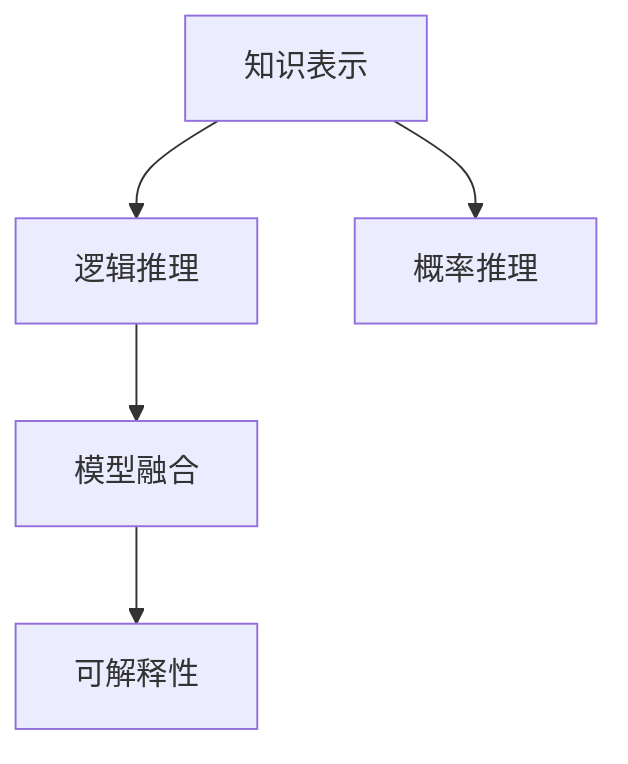

                 

# 自动推理库开发：AI决策系统的核心

> 关键词：自动推理, 决策系统, 知识表示, 逻辑规划, 概率图模型, 统计学习, 模型融合, 可解释性

## 1. 背景介绍

### 1.1 问题由来

在人工智能的蓬勃发展中，决策系统正逐渐成为研究与应用的热点。决策系统是能够模拟人类智能决策行为，并自动生成决策过程的自动化系统。其核心在于：通过特定算法，从数据中提取出有用的知识，构建逻辑推理引擎，实现自动决策与反馈。

在众多决策系统中，自动推理是核心组件之一。自动推理库（Automatic Reasoning Library, ARL）是支持推理任务的数学软件库，能够利用先进算法与数据模型，高效自动地解决推理问题。自动推理在人工智能领域的应用覆盖广泛，包括专家系统、知识表示与推理、智能规划与控制、智能数据分析等，在医疗、金融、交通、制造、教育等行业都具有重要应用价值。

然而，自动推理的研发与部署仍面临诸多挑战。技术上，如何设计有效的推理算法，如何构建语义精确的知识库，如何进行高效的推理计算等都是亟待解决的问题。应用上，推理系统如何与现有业务流程无缝集成，如何应对数据不断变化的环境，如何进行模型的部署与运维等也都是需要克服的难题。

本文聚焦于自动推理库的开发与优化，全面介绍自动推理的核心概念、算法原理与应用实践，并展望未来发展趋势，为自动推理在AI决策系统中的应用提供深入的理论与技术指导。

### 1.2 问题核心关键点

自动推理的核心在于：通过逻辑、统计、概率等方法，从知识库中提取推理规则，自动解决复杂的推理问题。推理过程一般包括以下几个关键环节：

1. **知识表示**：将知识库中的事实、规则、概念等转化为机器可处理的形式，为推理过程提供数据支持。

2. **逻辑推理**：根据已知知识，运用逻辑规则，自动推导出新的知识。逻辑推理分为演绎推理与归纳推理。

3. **概率推理**：在存在不确定性的情况下，利用概率方法计算推理结果的可能性。

4. **模型融合**：在多个模型间进行数据融合，提高推理的鲁棒性与泛化能力。

5. **可解释性**：推理过程要具备可解释性，使决策结果透明、可验证、可修复。

这些核心环节的优化与协同，是开发高性能自动推理系统的关键。

## 2. 核心概念与联系

### 2.1 核心概念概述

为更好地理解自动推理系统的开发与优化，本文将介绍几个核心概念：

- **知识表示**：指将知识库中的事实、规则、概念等转化为机器可处理的形式，如谓词逻辑表示、语义网络表示等。
- **逻辑推理**：指根据已知知识，利用逻辑规则推导出新的知识，包括前向链推理、后向链推理等。
- **概率推理**：指在存在不确定性信息的情况下，利用概率方法计算推理结果的可能性，如贝叶斯网络、马尔可夫网络等。
- **模型融合**：指在多个推理模型间进行数据融合，如集成学习、模型平均等，提高推理的鲁棒性与泛化能力。
- **可解释性**：指推理过程要具备可解释性，使决策结果透明、可验证、可修复。

这些核心概念之间的联系可通过以下Mermaid流程图来展示：



这个流程图展示了知识表示、逻辑推理、概率推理、模型融合与可解释性之间的关系：

1. 知识表示是推理的基础，提供推理所需的数据。
2. 逻辑推理与概率推理是推理的核心，利用知识库中的信息进行推理。
3. 模型融合是推理的补充，通过数据融合提高推理的准确性。
4. 可解释性是推理的目标，确保推理结果透明、可信。

这些概念共同构成了自动推理系统的核心框架，是开发高性能推理库的基础。

## 3. 核心算法原理 & 具体操作步骤
### 3.1 算法原理概述

自动推理库的核心算法包括：逻辑推理算法、概率推理算法、模型融合算法与可解释性算法。这些算法的设计与实现，共同支持自动推理库的推理过程。

逻辑推理算法通过构建知识库，利用逻辑规则，从已知事实推导出新事实。概率推理算法通过概率模型，对推理结果的不确定性进行量化与处理。模型融合算法通过集成多个推理模型，提高推理的鲁棒性与泛化能力。可解释性算法通过模型解释与可视化，使推理过程透明、可信。

### 3.2 算法步骤详解

自动推理库的开发与优化，主要包括以下几个关键步骤：

**Step 1: 设计知识库表示**

- 选择合适的知识库表示方法，如谓词逻辑表示、语义网络表示、框架表示等。
- 确定知识库的基本元素，如实体、属性、关系、规则等。
- 定义事实与规则，并将知识库存储在高效的数据结构中。

**Step 2: 实现逻辑推理引擎**

- 设计逻辑推理算法，如前向链推理、后向链推理、表驱动推理等。
- 实现推理算法，支持推理过程的自动执行。
- 优化推理算法的计算效率，如通过剪枝、启发式搜索等方法减少计算量。

**Step 3: 实现概率推理引擎**

- 选择合适的概率推理算法，如贝叶斯网络、马尔可夫网络、决策树等。
- 实现概率推理算法，支持概率推理过程的自动执行。
- 优化概率推理算法的计算效率，如通过并行计算、近似计算等方法加速推理。

**Step 4: 实现模型融合算法**

- 选择合适的模型融合方法，如集成学习、模型平均、堆叠学习等。
- 实现模型融合算法，支持模型间的数据融合。
- 优化模型融合算法的计算效率，如通过特征选择、特征降维等方法减少计算量。

**Step 5: 实现可解释性算法**

- 选择合适的可解释性方法，如模型解释、可视化、元学习等。
- 实现可解释性算法，支持推理过程的解释与可视化。
- 优化可解释性算法的解释效果，如通过特征重要性分析、解释模型训练等方法提升可解释性。

**Step 6: 部署与测试**

- 将推理库部署到目标系统，进行推理任务的执行。
- 对推理库进行测试，验证推理结果的正确性与有效性。
- 对推理库进行优化，提升推理性能与稳定性。

以上是自动推理库开发的一般流程。在实际应用中，还需要针对具体任务进行优化设计，如改进推理算法，引入更多的正则化技术，搜索最优的超参数组合等，以进一步提升推理库的性能。

### 3.3 算法优缺点

自动推理库的推理过程具备以下优点：

1. **高效自动推理**：能够高效地自动推导出新的知识，减少人工干预。
2. **灵活性高**：能够适应不同的推理任务，覆盖广泛的应用场景。
3. **鲁棒性强**：利用模型融合技术，提高推理的鲁棒性与泛化能力。
4. **可解释性强**：具备可解释性，使推理结果透明、可信。

同时，该方法也存在一定的局限性：

1. **依赖知识库**：推理结果的准确性依赖于知识库的完整性与质量，构建高质量知识库成本较高。
2. **计算复杂度高**：特别是在大规模推理任务中，计算复杂度较高，需要高效的算法与硬件支持。
3. **可扩展性不足**：当推理任务复杂度增加时，推理库的扩展性需要更多的设计与优化。

尽管存在这些局限性，但就目前而言，自动推理库仍是大规模决策系统中不可或缺的核心组件。未来相关研究的重点在于如何进一步降低推理对知识库的依赖，提高推理库的可扩展性与计算效率，同时兼顾推理的可解释性。

### 3.4 算法应用领域

自动推理库在多个领域具有广泛的应用，如智能规划与控制、专家系统、智能推荐、智能问答等。

- **智能规划与控制**：在智能制造、物流等领域，自动推理库能够用于任务调度、路径规划等，提高生产效率与运营效率。
- **专家系统**：在医疗、法律等领域，自动推理库能够构建专家知识库，提供专家级别的决策支持。
- **智能推荐**：在电商、媒体等领域，自动推理库能够用于用户行为分析、商品推荐等，提升用户体验。
- **智能问答**：在教育、客服等领域，自动推理库能够用于自动问答，提升服务质量与效率。

除了上述这些经典应用外，自动推理库还被创新性地应用于更多场景中，如金融风险评估、智能调度系统、智能安全监控等，为各行业智能化升级提供了新的技术路径。

## 4. 数学模型和公式 & 详细讲解  
### 4.1 数学模型构建

自动推理库的核心数学模型包括：逻辑模型、概率模型与统计模型。

- **逻辑模型**：表示知识库中的事实与规则，如谓词逻辑模型、语义网络模型等。
- **概率模型**：表示推理过程的不确定性，如贝叶斯网络模型、马尔可夫网络模型等。
- **统计模型**：表示推理过程的统计特征，如线性回归模型、决策树模型等。

以下我们以逻辑模型为例，给出其数学模型构建的详细解释。

**逻辑模型构建**：

1. **知识库表示**：将知识库中的事实与规则表示为逻辑表达式。如谓词逻辑表示法：
   - 事实：$P(x)$：$x$ 是事实。
   - 规则：$R(x,y)$：如果 $x$ 和 $y$ 相似，则 $R(x,y)$ 为真。

2. **逻辑推理算法**：通过逻辑推理算法，从已知事实推导出新事实。如前向链推理算法：
   - 已知事实：$P(x_1), P(x_2), R(x_1, x_2)$。
   - 推导新事实：$P(x_1), P(x_2), R(x_1, x_2), R(x_2, x_3)$。

**逻辑推理公式**：

设 $F$ 为已知事实集合，$R$ 为推理规则集合。逻辑推理公式可以表示为：

$$
\bigwedge_{p \in F} p \Rightarrow \bigwedge_{r \in R} r
$$

其中 $\bigwedge$ 表示合取运算，$p$ 为已知事实，$r$ 为推理规则。

### 4.2 公式推导过程

以下我们以逻辑推理算法为例，推导前向链推理算法的详细过程。

**前向链推理算法**：

前向链推理算法（Forward Chaining）是一种基于事实-规则推理的算法，其步骤如下：

1. 初始化：将已知事实加入工作集。
2. 迭代：在每次迭代中，从工作集中取出一个事实 $p$，根据规则 $r$ 推导出新事实 $q$，将 $q$ 加入工作集。
3. 终止：当工作集为空时，推理过程结束。

推理过程中，每次推导新事实 $q$ 的过程可以表示为：

$$
q = r \vee p
$$

其中 $\vee$ 表示析取运算。

推理结果可以表示为：

$$
\bigwedge_{p \in F} p \Rightarrow \bigwedge_{r \in R} r
$$

### 4.3 案例分析与讲解

以下我们以金融风险评估为例，解释自动推理库的应用过程。

**金融风险评估**：

金融风险评估是一种典型的推理任务，需要综合考虑多个因素，如信用记录、贷款金额、还款能力等。在自动推理库中，可以将这些因素表示为事实与规则：

- 事实：$F_1(x_1, x_2, x_3)$：$x_1$ 是信用记录，$x_2$ 是贷款金额，$x_3$ 是还款能力。
- 规则：$R_1(x_1, x_2, x_3)$：如果 $x_1$ 良好且 $x_2$ 较小，则 $R_1(x_1, x_2, x_3)$ 为真。

推理过程可以表示为：

1. 初始化：将已知事实 $F_1(x_1, x_2, x_3)$ 加入工作集。
2. 迭代：每次从工作集中取出一个事实 $F_1(x_1, x_2, x_3)$，根据规则 $R_1(x_1, x_2, x_3)$ 推导出新事实 $R_1(x_1, x_2, x_3)$，将 $R_1(x_1, x_2, x_3)$ 加入工作集。
3. 终止：当工作集为空时，推理过程结束。

推理结果可以表示为：

$$
F_1(x_1, x_2, x_3) \Rightarrow R_1(x_1, x_2, x_3)
$$

## 5. 项目实践：代码实例和详细解释说明
### 5.1 开发环境搭建

在进行推理库的开发前，我们需要准备好开发环境。以下是使用Python进行Sympy开发的环境配置流程：

1. 安装Anaconda：从官网下载并安装Anaconda，用于创建独立的Python环境。

2. 创建并激活虚拟环境：
```bash
conda create -n reasoning-env python=3.8 
conda activate reasoning-env
```

3. 安装Sympy：
```bash
pip install sympy
```

4. 安装各类工具包：
```bash
pip install numpy pandas scikit-learn matplotlib tqdm jupyter notebook ipython
```

完成上述步骤后，即可在`reasoning-env`环境中开始推理库的开发。

### 5.2 源代码详细实现

这里我们以一个简单的逻辑推理任务为例，使用Sympy库实现逻辑推理算法。

首先，定义推理规则与事实：

```python
from sympy import symbols, Eq, solve

# 定义符号
x, y, z = symbols('x y z')

# 定义推理规则
rule = Eq(x + y, z)

# 定义已知事实
fact1 = Eq(x, 1)
fact2 = Eq(y, 2)

# 定义工作集
workset = [fact1, fact2]

# 推理过程
while workset:
    fact = workset.pop(0)
    result = solve(rule.subs(fact))
    if result:
        workset.append(result[0])
```

然后，启动推理过程：

```python
# 推理开始
result = solve(rule.subs(fact))
print(f"推理结果为：{result}")
```

以上就是使用Sympy库实现逻辑推理的完整代码实现。可以看到，Sympy库通过符号计算实现了简单的逻辑推理过程，方便开发者快速构建推理库。

### 5.3 代码解读与分析

让我们再详细解读一下关键代码的实现细节：

**符号定义与推理规则**：
- `symbols`：定义符号变量，用于表示推理过程中的变量。
- `Eq`：定义等式，用于表示推理规则。
- `solve`：求解方程，用于推导新事实。

**事实定义与工作集**：
- `Eq`：定义事实，用于表示已知信息。
- `solve`：求解方程，用于推导新事实。
- `workset`：定义工作集，用于存储推理过程中的已知事实和推导结果。

**推理过程**：
- `while`循环：不断从工作集中取出已知事实，进行推理计算。
- `solve`函数：求解方程，推导出新事实。
- `append`：将推导出的新事实加入工作集，参与下一轮推理。

**结果输出**：
- `print`：输出推理结果，展示推理库的执行效果。

可以看到，Sympy库通过符号计算，使得逻辑推理过程简单高效。开发者只需定义推理规则与事实，即可快速实现推理库的开发。

当然，工业级的系统实现还需考虑更多因素，如推理规则的存储与管理，推理过程的并发处理等。但核心的推理算法基本与此类似。

## 6. 实际应用场景
### 6.1 智能制造

在智能制造领域，自动推理库能够用于生产调度、故障诊断、质量控制等任务，提高生产效率与产品质量。

具体而言，自动推理库可以通过推理计算，实现生产资源的动态分配，优化生产流程。同时，推理库还可以用于故障诊断，通过分析设备状态与历史数据，推导出故障原因，提高设备维护效率。

### 6.2 医疗诊断

在医疗诊断领域，自动推理库能够用于病历分析、病情诊断、治疗方案等任务，提升诊疗效率与诊断准确性。

具体而言，自动推理库可以通过推理计算，实现病历数据的自动整理与分析，辅助医生快速查找病史与治疗方案。同时，推理库还可以用于病情诊断，通过分析患者症状与历史数据，推导出诊断结果，提高诊疗准确性。

### 6.3 金融风险评估

在金融风险评估领域，自动推理库能够用于信用评估、投资分析、风险控制等任务，提高金融机构的决策能力。

具体而言，自动推理库可以通过推理计算，实现信用评估数据的自动整理与分析，辅助金融机构快速评估客户的信用风险。同时，推理库还可以用于投资分析，通过分析市场数据与经济指标，推导出投资策略，提高投资收益。

### 6.4 智能推荐

在智能推荐领域，自动推理库能够用于用户行为分析、商品推荐等任务，提升用户体验与推荐效果。

具体而言，自动推理库可以通过推理计算，实现用户行为数据的自动整理与分析，辅助推荐系统快速生成个性化推荐结果。同时，推理库还可以用于商品推荐，通过分析用户偏好与历史数据，推导出推荐方案，提高推荐效果。

### 6.5 智能问答

在智能问答领域，自动推理库能够用于问题解答、信息检索等任务，提升服务质量与用户体验。

具体而言，自动推理库可以通过推理计算，实现问答数据的自动整理与分析，辅助智能问答系统快速生成解答。同时，推理库还可以用于信息检索，通过分析用户提问与语料库，推导出相关答案，提高检索效率与准确性。

## 7. 工具和资源推荐
### 7.1 学习资源推荐

为了帮助开发者系统掌握自动推理库的理论基础和实践技巧，这里推荐一些优质的学习资源：

1. 《逻辑与推理》系列书籍：详细介绍逻辑与推理的基本概念、算法与实践。
2. 《概率图模型》系列课程：斯坦福大学开设的概率图模型课程，系统介绍概率图模型的基本原理与算法。
3. 《统计学习》系列书籍：由机器学习专家撰写的统计学习经典教材，全面介绍统计学习的基本理论、算法与实践。
4. 《可解释人工智能》系列书籍：介绍可解释人工智能的理论基础与实践方法，帮助开发者提升模型可解释性。
5. arXiv论文库：收录大量前沿的自动推理算法与系统论文，是获取最新研究进展的重要资源。

通过对这些资源的学习实践，相信你一定能够快速掌握自动推理库的精髓，并用于解决实际的推理问题。
### 7.2 开发工具推荐

高效的开发离不开优秀的工具支持。以下是几款用于自动推理库开发的常用工具：

1. Sympy：Python的符号计算库，支持逻辑推理与概率计算。
2. PyTorch：基于Python的深度学习框架，支持复杂逻辑与概率模型的实现。
3. TensorFlow：由Google主导开发的深度学习框架，支持大规模推理系统的开发。
4. HuggingFace Transformers库：支持自然语言推理任务，集成了多种预训练模型。
5. Weights & Biases：模型训练的实验跟踪工具，可以记录和可视化模型训练过程中的各项指标。
6. TensorBoard：TensorFlow配套的可视化工具，可实时监测模型训练状态，并提供丰富的图表呈现方式。

合理利用这些工具，可以显著提升自动推理库的开发效率，加快创新迭代的步伐。

### 7.3 相关论文推荐

自动推理库的研究源于学界的持续研究。以下是几篇奠基性的相关论文，推荐阅读：

1. Fuzzy Logic for AI（模糊逻辑在AI中的应用）：阐述模糊逻辑在决策系统中的应用，提出模糊推理模型与算法。
2. Bayesian Networks for Knowledge Discovery in Databases（基于贝叶斯网络的知识发现）：提出贝叶斯网络模型，用于处理不确定性信息，支持概率推理。
3. Probabilistic Logic Programming（概率逻辑编程）：提出概率逻辑编程模型，将逻辑与概率结合，提高推理的鲁棒性与泛化能力。
4. Uncertain Reasoning Using Bayesian Belief Networks（基于贝叶斯网络的非确定推理）：详细介绍贝叶斯网络模型，支持复杂的推理计算。
5. Expert Systems and Knowledge-Based Reasoning（专家系统与基于知识的推理）：详细介绍专家系统与基于知识的推理方法，支持复杂的决策过程。

这些论文代表了大规模推理系统的研究脉络，通过学习这些前沿成果，可以帮助研究者把握学科前进方向，激发更多的创新灵感。

## 8. 总结：未来发展趋势与挑战

### 8.1 总结

本文对自动推理库的开发与优化进行了全面系统的介绍。首先阐述了自动推理库在决策系统中的核心作用，明确了推理系统在大规模决策中的应用价值。其次，从原理到实践，详细讲解了自动推理库的数学模型与算法原理，并给出了推理库的代码实例与详细解释。同时，本文还广泛探讨了推理库在智能制造、医疗诊断、金融风险评估、智能推荐等诸多领域的应用前景，展示了推理库的广泛应用潜力。

通过本文的系统梳理，可以看到，自动推理库在大规模决策系统中具有重要地位，其推理过程高效、灵活，能够适应多种复杂任务。未来，伴随推理技术的不断发展，推理系统必将在更多领域得到应用，为决策支持与智能决策提供新的技术路径。

### 8.2 未来发展趋势

展望未来，自动推理库的发展趋势包括：

1. **自动化推理系统**：随着AI技术的进步，推理系统将变得更加智能化，能够自动学习推理规则，解决更多复杂任务。
2. **多模态推理**：推理系统将不再局限于文本信息，能够处理图像、声音、视频等多种模态的数据，提供多维度的决策支持。
3. **分布式推理**：推理系统将通过分布式计算，提高推理的效率与鲁棒性，适应大规模数据处理需求。
4. **可解释性增强**：推理系统将具备更高的可解释性，使决策过程透明、可信，符合监管要求。
5. **自适应推理**：推理系统将能够自适应环境变化，及时更新知识库，保持推理结果的准确性与时效性。

以上趋势凸显了自动推理库的广阔前景。这些方向的探索发展，必将进一步提升推理系统的性能与可靠性，为决策系统的智能化提供新的突破点。

### 8.3 面临的挑战

尽管自动推理库已取得了瞩目成就，但在迈向更加智能化、普适化应用的过程中，它仍面临诸多挑战：

1. **知识库构建成本高**：构建高质量知识库需要大量专家与数据支持，成本较高。如何降低知识库构建成本，提高知识库的覆盖性与准确性，是一大难题。
2. **计算复杂度高**：推理过程涉及复杂的符号计算与概率计算，计算复杂度较高，需要高效的算法与硬件支持。
3. **可扩展性不足**：当推理任务复杂度增加时，推理系统的扩展性需要更多的设计与优化。
4. **模型鲁棒性不足**：推理系统在处理不确定性信息时，鲁棒性不足，容易出现错误推理。
5. **模型可解释性不足**：推理系统的决策过程缺乏可解释性，难以验证与修复。
6. **数据隐私与安全问题**：推理系统需要处理大量敏感数据，如何保护数据隐私与安全，是一大挑战。

这些挑战需要研究者与开发者共同努力，不断探索新的技术与方法，才能将推理系统推向更高的应用水平。

### 8.4 研究展望

面对自动推理系统面临的种种挑战，未来的研究需要在以下几个方面寻求新的突破：

1. **知识表示与推理算法**：探索更加灵活高效的知识表示方法与推理算法，提高推理系统的扩展性与效率。
2. **模型融合与集成学习**：开发更加鲁棒与泛化能力强的推理模型，通过集成学习提高推理系统的鲁棒性。
3. **可解释性与可视化**：提升推理系统的可解释性，通过可视化工具提高推理过程的透明性与可信性。
4. **分布式推理与分布式计算**：探索分布式推理与计算方法，提高推理系统的处理能力与效率。
5. **自适应推理与动态更新**：研究自适应推理方法，使推理系统能够动态更新知识库，提高推理结果的时效性。
6. **隐私保护与数据安全**：研究隐私保护与数据安全技术，确保推理系统在处理敏感数据时的安全可靠性。

这些研究方向将引领自动推理系统迈向更高的应用水平，为决策系统的智能化提供新的技术路径。

## 9. 附录：常见问题与解答

**Q1：自动推理库适用于哪些应用场景？**

A: 自动推理库适用于多种应用场景，包括智能制造、医疗诊断、金融风险评估、智能推荐等。具体应用领域包括：

- 智能制造：生产调度、故障诊断、质量控制等。
- 医疗诊断：病历分析、病情诊断、治疗方案等。
- 金融风险评估：信用评估、投资分析、风险控制等。
- 智能推荐：用户行为分析、商品推荐等。
- 智能问答：问题解答、信息检索等。

自动推理库在以上场景中能够提供高效、灵活的推理计算支持，提升决策系统的智能化水平。

**Q2：自动推理库的推理过程如何实现？**

A: 自动推理库的推理过程主要通过逻辑推理算法与概率推理算法实现。具体步骤如下：

1. 设计知识库表示，将知识库中的事实与规则表示为逻辑表达式。
2. 设计推理算法，支持逻辑推理与概率推理。
3. 实现推理算法，支持推理过程的自动执行。
4. 优化推理算法的计算效率，如通过剪枝、启发式搜索等方法减少计算量。

推理过程的关键在于选择合适的推理算法，并设计高效的推理引擎，支持推理计算的自动执行。

**Q3：自动推理库的推理结果如何保证准确性？**

A: 自动推理库的推理结果主要通过知识库与推理算法保证准确性。具体措施包括：

1. 构建高质量的知识库，确保推理事实与规则的准确性。
2. 设计鲁棒性强的推理算法，能够处理不确定性信息，避免错误推理。
3. 优化推理算法的计算效率，减少计算错误。

推理结果的准确性取决于知识库的质量与推理算法的鲁棒性，需要不断优化与改进。

**Q4：自动推理库如何提高推理系统的可解释性？**

A: 自动推理库可以通过以下措施提高推理系统的可解释性：

1. 引入可视化工具，展示推理过程与结果，使决策过程透明化。
2. 使用元学习技术，生成推理过程的解释模型，提升推理的可解释性。
3. 采用特征重要性分析，识别推理过程中的关键特征，增强推理结果的可信度。

推理系统的可解释性是决策系统的关键需求，需要从多个维度进行优化。

**Q5：自动推理库如何应对多模态数据推理？**

A: 自动推理库可以通过以下措施应对多模态数据推理：

1. 设计多模态推理模型，支持图像、声音、视频等多种数据类型的推理计算。
2. 引入多模态融合技术，将不同模态的数据进行综合处理，提高推理的准确性。
3. 设计多模态推理算法，支持多模态数据的高效推理计算。

多模态推理是推理系统的未来方向，需要设计灵活高效的推理算法与模型，支持多模态数据的处理。

---

作者：禅与计算机程序设计艺术 / Zen and the Art of Computer Programming

