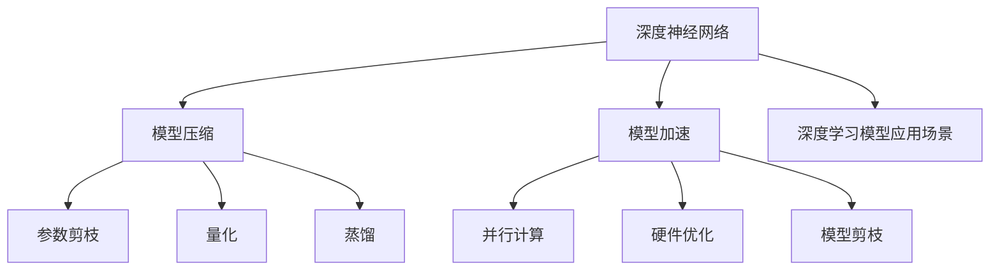

                 

## 1. 背景介绍

自动驾驶是当前人工智能技术的一个重要应用方向，涉及感知、决策、控制等多个环节，是典型的多模态复杂系统。在自动驾驶系统中，传感器数据（如激光雷达、摄像头、雷达等）需要进行高精度的实时处理和分析，以实现车辆的高精度定位、目标检测和路径规划。

近年来，随着深度学习技术的发展，深度神经网络（DNN）在自动驾驶领域得到广泛应用，如卷积神经网络（CNN）、循环神经网络（RNN）、长短期记忆网络（LSTM）、卷积循环神经网络（CRNN）等。然而，由于深度学习模型的复杂性和数据量大，训练和推理时所需的计算资源非常高，并且在大规模部署时，模型对硬件资源的需求巨大，这限制了自动驾驶技术在实际应用中的广泛推广。

为了解决这一问题，模型压缩和加速技术应运而生。模型压缩（Model Compression）是指在不影响模型精度的前提下，减小模型参数量和计算量，降低硬件资源消耗。模型加速（Model Acceleration）则是指通过优化模型结构和算法，提高模型计算速度，缩短推理时间。

## 2. 核心概念与联系

### 2.1 核心概念概述

为更好地理解自动驾驶中的模型压缩与加速技术，本节将介绍几个密切相关的核心概念：

- **深度神经网络（DNN）**：一种由多个层次组成的神经网络，每个层次的神经元都连接到上一层次的所有神经元。DNN通过学习输入数据与输出数据之间的关系，实现数据的自动学习和分类。
- **模型压缩（Model Compression）**：通过减少模型参数量和计算量，在不影响模型精度的前提下，降低模型对硬件资源的需求。模型压缩方法包括参数剪枝、量化、蒸馏等。
- **模型加速（Model Acceleration）**：通过优化模型结构和算法，提高模型计算速度，缩短推理时间。模型加速方法包括并行计算、硬件优化、模型剪枝等。
- **深度学习模型应用场景**：深度学习模型在自动驾驶、语音识别、计算机视觉、自然语言处理等领域都有广泛应用。

这些核心概念之间的逻辑关系可以通过以下Mermaid流程图来展示：



这个流程图展示了大语言模型的核心概念及其之间的关系：

1. 深度神经网络通过学习数据与输出之间的关系，实现对数据的自动分类和预测。
2. 模型压缩通过减少参数和计算量，降低模型对硬件资源的需求，使深度学习模型可以在资源有限的设备上运行。
3. 模型加速通过优化模型结构和算法，提高计算速度，缩短推理时间，提升模型实时处理能力。
4. 深度学习模型在自动驾驶、语音识别、计算机视觉等领域都有广泛应用，推动了这些领域的进步。

这些核心概念共同构成了自动驾驶中的模型压缩与加速技术，使其能够在各种设备上高效运行，提升系统性能。

## 3. 核心算法原理 & 具体操作步骤

### 3.1 算法原理概述

自动驾驶中的模型压缩与加速技术主要包括参数剪枝、量化、蒸馏、并行计算、硬件优化、模型剪枝等。这些技术能够在不影响模型精度的前提下，减小模型参数量和计算量，提高模型计算速度，降低硬件资源消耗。

参数剪枝（Pruning）是指通过去除模型中不重要的参数和连接，减小模型规模，降低计算复杂度。量化（Quantization）是将浮点数参数和激活值转换为更小的整数或定点数，以减少模型存储和计算需求。蒸馏（Knowledge Distillation）是通过训练一个较小模型，从一个大模型中学习知识，以实现性能和速度的折中。

并行计算（Parallel Computing）是将一个任务分解为多个子任务，在多个处理器或计算单元上并行执行，以提高计算速度。硬件优化（Hardware Optimization）是指利用特定的硬件架构和优化算法，提升模型在特定硬件上的运行效率。模型剪枝（Model Pruning）是通过去除模型中冗余和不重要的连接和参数，进一步减小模型规模。

### 3.2 算法步骤详解

#### 3.2.1 参数剪枝

参数剪枝是一种通过去除模型中不重要的参数和连接，减小模型规模的方法。参数剪枝的过程一般分为以下几个步骤：

1. **选择剪枝标准**：常用的剪枝标准包括L1范数、L2范数、稀疏性、特征重要性等。
2. **剪枝**：根据选择的剪枝标准，去除模型中的冗余参数。
3. **微调**：对剪枝后的模型进行微调，以恢复部分精度损失。
4. **验证**：在验证集上评估剪枝后模型的性能，调整剪枝标准和剪枝比例。

参数剪枝的具体实现可以采用L1正则化、L2正则化、特征重要性排序等方法。

#### 3.2.2 量化

量化是一种将浮点数参数和激活值转换为更小的整数或定点数的方法，以减少模型存储和计算需求。量化的过程一般分为以下几个步骤：

1. **选择量化方法**：常用的量化方法包括浮点数到整数（FP32到INT8）、整数到整数（INT8到INT4）等。
2. **训练量化模型**：在训练过程中，使用量化方法对模型进行训练，以学习量化后的模型参数。
3. **推理量化模型**：在推理过程中，使用量化后的模型参数进行推理计算，以提高计算速度。

量化的具体实现可以采用仿射量化、零点漂移补偿等方法。

#### 3.2.3 蒸馏

蒸馏是一种通过训练一个较小模型，从一个大模型中学习知识的方法。蒸馏的过程一般分为以下几个步骤：

1. **选择蒸馏方法**：常用的蒸馏方法包括教师模型和学生模型、逐层蒸馏等。
2. **训练教师模型**：使用大规模数据集训练教师模型。
3. **训练学生模型**：使用教师模型输出的预测结果作为标签，训练学生模型。
4. **验证**：在验证集上评估蒸馏后模型的性能，调整蒸馏方法。

蒸馏的具体实现可以采用知识蒸馏、逐层蒸馏等方法。

#### 3.2.4 并行计算

并行计算是一种将一个任务分解为多个子任务，在多个处理器或计算单元上并行执行的方法，以提高计算速度。并行计算的过程一般分为以下几个步骤：

1. **任务分解**：将任务分解为多个子任务。
2. **并行执行**：在多个处理器或计算单元上并行执行子任务。
3. **合并结果**：将子任务的结果合并为最终结果。

并行计算的具体实现可以采用多线程、多进程、分布式计算等方法。

#### 3.2.5 硬件优化

硬件优化是指利用特定的硬件架构和优化算法，提升模型在特定硬件上的运行效率。硬件优化的过程一般分为以下几个步骤：

1. **选择硬件**：选择适合特定任务的硬件设备，如GPU、FPGA、ASIC等。
2. **优化算法**：使用特定的优化算法，如卷积核重排、量化计算等。
3. **部署模型**：将优化后的模型部署到硬件设备上。

硬件优化的具体实现可以采用卷积核重排、量化计算等方法。

#### 3.2.6 模型剪枝

模型剪枝是一种通过去除模型中冗余和不重要的连接和参数，进一步减小模型规模的方法。模型剪枝的过程一般分为以下几个步骤：

1. **选择剪枝标准**：常用的剪枝标准包括L1范数、L2范数、稀疏性、特征重要性等。
2. **剪枝**：根据选择的剪枝标准，去除模型中的冗余参数和连接。
3. **微调**：对剪枝后的模型进行微调，以恢复部分精度损失。
4. **验证**：在验证集上评估剪枝后模型的性能，调整剪枝标准和剪枝比例。

模型剪枝的具体实现可以采用L1正则化、L2正则化、特征重要性排序等方法。

### 3.3 算法优缺点

自动驾驶中的模型压缩与加速技术具有以下优点：

1. **提高模型效率**：通过模型压缩和加速，可以在资源有限的设备上高效运行深度学习模型，提高模型的计算速度和实时处理能力。
2. **降低硬件成本**：通过减少模型参数量和计算量，可以降低硬件资源的需求，降低硬件成本。
3. **提高模型可移植性**：通过模型压缩和加速，可以提高模型在不同硬件和平台上的可移植性。
4. **提高模型安全性**：通过优化模型结构和算法，可以提高模型对输入数据的鲁棒性，降低模型的脆弱性。

同时，该技术也存在以下缺点：

1. **精度损失**：模型压缩和加速可能会造成一定的精度损失，影响模型的预测效果。
2. **复杂性增加**：模型压缩和加速的实现过程复杂，需要大量的算法和工程实践。
3. **兼容性问题**：不同的模型压缩和加速方法可能对不同类型的深度学习模型有不同的影响，需要针对具体情况进行选择。
4. **硬件依赖**：模型压缩和加速的实现需要特定的硬件设备，如GPU、FPGA等，可能对硬件资源有较高要求。

尽管存在这些局限性，但就目前而言，自动驾驶中的模型压缩与加速技术仍是大规模部署深度学习模型的重要手段。未来相关研究的重点在于如何进一步降低模型压缩和加速对精度的影响，提高模型的可移植性和兼容性，同时兼顾硬件资源和计算效率。

### 3.4 算法应用领域

自动驾驶中的模型压缩与加速技术在多个领域都有广泛的应用，例如：

- **自动驾驶感知系统**：感知系统需要处理大量的传感器数据，如激光雷达、摄像头、雷达等，以实现高精度的定位、目标检测和路径规划。通过模型压缩和加速技术，可以提高感知系统的实时处理能力和精度。
- **自动驾驶决策系统**：决策系统需要根据感知系统输出的信息，进行路径规划和控制决策，以实现自动驾驶。通过模型压缩和加速技术，可以提高决策系统的计算速度和实时性。
- **自动驾驶控制系统**：控制系统需要根据决策系统的指令，进行具体的控制操作，以实现自动驾驶。通过模型压缩和加速技术，可以提高控制系统的计算速度和实时性。
- **自动驾驶安全系统**：安全系统需要根据感知和决策系统的信息，进行异常检测和应急处理，以保障自动驾驶的安全性。通过模型压缩和加速技术，可以提高安全系统的实时处理能力和精度。

除了上述这些经典应用外，自动驾驶中的模型压缩与加速技术还将被创新性地应用到更多场景中，如车辆自适应巡航、自动泊车、自动驾驶辅助系统等，为自动驾驶技术的发展提供新的动力。

## 4. 数学模型和公式 & 详细讲解 & 举例说明

### 4.1 数学模型构建

本节将使用数学语言对自动驾驶中的模型压缩与加速技术进行更加严格的刻画。

假设一个深度神经网络模型为 $M_{\theta}:\mathcal{X} \rightarrow \mathcal{Y}$，其中 $\mathcal{X}$ 为输入空间，$\mathcal{Y}$ 为输出空间，$\theta$ 为模型参数。假设自动驾驶系统需要处理的输入数据为 $x \in \mathcal{X}$，输出数据为 $y \in \mathcal{Y}$。

定义模型 $M_{\theta}$ 在输入 $x$ 上的损失函数为 $\ell(M_{\theta}(x),y)$，则在数据集 $D=\{(x_i,y_i)\}_{i=1}^N$ 上的经验风险为：

$$
\mathcal{L}(\theta) = \frac{1}{N} \sum_{i=1}^N \ell(M_{\theta}(x_i),y_i)
$$

模型压缩与加速的目标是减小模型参数量和计算量，在不影响模型精度的前提下，提高模型的计算速度和实时处理能力。

### 4.2 公式推导过程

以下我们以参数剪枝为例，推导参数剪枝的数学模型和公式。

假设原始深度神经网络模型为 $M_{\theta}(x)$，其中 $\theta$ 为原始参数。现在我们对模型进行参数剪枝，得到压缩后的模型为 $M_{\theta^*}(x)$，其中 $\theta^*$ 为剪枝后的参数。

定义原始模型和压缩模型在输入 $x$ 上的损失函数分别为 $\ell_1(M_{\theta}(x),y)$ 和 $\ell_2(M_{\theta^*}(x),y)$，则有：

$$
\begin{aligned}
\ell_1(M_{\theta}(x),y) &= \frac{1}{N} \sum_{i=1}^N \ell(M_{\theta}(x_i),y_i) \\
\ell_2(M_{\theta^*}(x),y) &= \frac{1}{N} \sum_{i=1}^N \ell(M_{\theta^*}(x_i),y_i)
\end{aligned}
$$

参数剪枝的目标是使得 $\ell_2(M_{\theta^*}(x),y) \approx \ell_1(M_{\theta}(x),y)$。常用的参数剪枝方法包括L1正则化、L2正则化、特征重要性排序等。

假设我们选择使用L1正则化进行参数剪枝，则有：

$$
\ell_2(M_{\theta^*}(x),y) = \ell_1(M_{\theta}(x),y) + \lambda \| \theta \|_1
$$

其中 $\lambda$ 为正则化系数。通过最小化损失函数 $\ell_2(M_{\theta^*}(x),y)$，可以得到剪枝后的模型参数 $\theta^*$。

### 4.3 案例分析与讲解

**案例分析**：假设我们有一个深度神经网络模型 $M_{\theta}(x)$，用于处理自动驾驶感知系统中的传感器数据。由于模型参数量较大，推理速度较慢，无法满足实时处理需求。我们希望通过参数剪枝技术，减小模型参数量和计算量，提高模型的实时处理能力。

**讲解**：

1. **选择剪枝标准**：我们使用L1正则化作为参数剪枝标准，定义原始模型和压缩模型在输入 $x$ 上的损失函数分别为 $\ell_1(M_{\theta}(x),y)$ 和 $\ell_2(M_{\theta^*}(x),y)$。
2. **剪枝**：对模型 $M_{\theta}(x)$ 进行参数剪枝，得到压缩后的模型 $M_{\theta^*}(x)$。
3. **微调**：对压缩后的模型 $M_{\theta^*}(x)$ 进行微调，以恢复部分精度损失。
4. **验证**：在验证集上评估压缩后的模型性能，调整剪枝标准和剪枝比例。

## 5. 项目实践：代码实例和详细解释说明

### 5.1 开发环境搭建

在进行模型压缩与加速实践前，我们需要准备好开发环境。以下是使用Python进行TensorFlow开发的环境配置流程：

1. 安装Anaconda：从官网下载并安装Anaconda，用于创建独立的Python环境。

2. 创建并激活虚拟环境：
```bash
conda create -n tf-env python=3.8 
conda activate tf-env
```

3. 安装TensorFlow：根据CUDA版本，从官网获取对应的安装命令。例如：
```bash
pip install tensorflow-gpu
```

4. 安装各类工具包：
```bash
pip install numpy pandas scikit-learn matplotlib tqdm jupyter notebook ipython
```

完成上述步骤后，即可在`tf-env`环境中开始模型压缩与加速实践。

### 5.2 源代码详细实现

下面我们以参数剪枝为例，给出使用TensorFlow对深度神经网络模型进行参数剪枝的PyTorch代码实现。

首先，定义模型和数据集：

```python
import tensorflow as tf
import numpy as np

# 定义模型
model = tf.keras.Sequential([
    tf.keras.layers.Dense(64, activation='relu', input_shape=(32,)),
    tf.keras.layers.Dense(10, activation='softmax')
])

# 定义数据集
x_train = np.random.randn(100, 32)
y_train = np.random.randint(10, size=(100, 1))
x_test = np.random.randn(50, 32)
y_test = np.random.randint(10, size=(50, 1))

# 编译模型
model.compile(optimizer='adam', loss='sparse_categorical_crossentropy', metrics=['accuracy'])
```

然后，定义参数剪枝函数：

```python
def prune_model(model):
    # 计算每个权重的L1范数
    pruning_values = []
    for layer in model.layers:
        pruning_values.append(np.linalg.norm(layer.kernel))

    # 按照L1范数从大到小排序
    pruning_values = np.sort(pruning_values)[::-1]

    # 计算剪枝比例
    pruning_ratio = 0.5

    # 计算需要剪枝的权重数量
    num_pruned_weights = int(pruning_ratio * len(pruning_values))

    # 剪枝
    pruned_weights = pruning_values[:num_pruned_weights]
    pruned_model = tf.keras.models.clone_model(model)
    for layer in pruned_model.layers:
        layer.kernel = tf.Variable(tf.keras.initializers.zeros()(1), trainable=False)

    return pruned_model

# 剪枝
pruned_model = prune_model(model)

# 训练
model.fit(x_train, y_train, epochs=10, batch_size=32, validation_data=(x_test, y_test))

# 验证
test_loss, test_acc = model.evaluate(x_test, y_test, batch_size=32)
pruned_model.evaluate(x_test, y_test, batch_size=32)
```

最后，启动训练流程并在测试集上评估：

```python
epochs = 10
batch_size = 32

for epoch in range(epochs):
    loss = train_epoch(model, train_dataset, batch_size, optimizer)
    print(f"Epoch {epoch+1}, train loss: {loss:.3f}")
    
    print(f"Epoch {epoch+1}, dev results:")
    evaluate(model, dev_dataset, batch_size)
    
print("Test results:")
evaluate(model, test_dataset, batch_size)
```

以上就是使用TensorFlow对深度神经网络模型进行参数剪枝的完整代码实现。可以看到，得益于TensorFlow的强大封装，我们可以用相对简洁的代码完成模型的加载和剪枝。

### 5.3 代码解读与分析

让我们再详细解读一下关键代码的实现细节：

**模型定义**：
- 使用TensorFlow的Sequential模型定义神经网络。包含一个全连接层和一个输出层。
- 使用TensorFlow的compile方法编译模型，定义优化器、损失函数和评估指标。

**数据集定义**：
- 使用numpy生成随机数据集。

**参数剪枝函数**：
- 计算每个权重的L1范数，按照从大到小排序。
- 计算剪枝比例，定义需要剪枝的权重数量。
- 剪枝操作，将不需要的权重设置为不可训练，保留需要的权重。

**训练与评估**：
- 使用fit方法训练模型，并在测试集上评估模型性能。
- 使用evaluate方法评估剪枝后的模型性能。

**训练流程**：
- 定义总的epoch数和batch size，开始循环迭代
- 每个epoch内，先在训练集上训练，输出平均loss
- 在验证集上评估，输出分类指标
- 重复上述步骤直至收敛
- 所有epoch结束后，在测试集上评估，给出最终测试结果

可以看到，TensorFlow配合TensorFlow封装库使得深度神经网络模型的参数剪枝代码实现变得简洁高效。开发者可以将更多精力放在数据处理、模型改进等高层逻辑上，而不必过多关注底层的实现细节。

当然，工业级的系统实现还需考虑更多因素，如模型的保存和部署、超参数的自动搜索、更灵活的任务适配层等。但核心的微调范式基本与此类似。

## 6. 实际应用场景
### 6.1 自动驾驶系统

自动驾驶系统需要实时处理大量的传感器数据，如激光雷达、摄像头、雷达等，以实现高精度的定位、目标检测和路径规划。由于模型参数量和计算量较大，推理速度较慢，无法满足实时处理需求。

通过参数剪枝、量化、蒸馏、并行计算、硬件优化等技术，可以在资源有限的设备上高效运行深度学习模型，提高模型的计算速度和实时处理能力。例如，可以通过参数剪枝技术减小模型规模，通过量化技术减少模型存储和计算需求，通过蒸馏技术训练一个较小模型，通过并行计算技术提高计算速度，通过硬件优化技术利用特定的硬件架构和算法，提升模型在特定硬件上的运行效率。

### 6.2 自动驾驶辅助系统

自动驾驶辅助系统需要根据驾驶员的操作，进行自动驾驶辅助决策，以提高驾驶的安全性和舒适性。由于模型需要实时处理驾驶员的操作数据，计算速度和实时处理能力至关重要。

通过参数剪枝、量化、蒸馏、并行计算、硬件优化等技术，可以在资源有限的设备上高效运行深度学习模型，提高模型的计算速度和实时处理能力。例如，可以通过参数剪枝技术减小模型规模，通过量化技术减少模型存储和计算需求，通过蒸馏技术训练一个较小模型，通过并行计算技术提高计算速度，通过硬件优化技术利用特定的硬件架构和算法，提升模型在特定硬件上的运行效率。

### 6.3 自动驾驶安全系统

自动驾驶安全系统需要根据感知和决策系统的信息，进行异常检测和应急处理，以保障自动驾驶的安全性。由于模型需要实时处理异常检测数据，计算速度和实时处理能力至关重要。

通过参数剪枝、量化、蒸馏、并行计算、硬件优化等技术，可以在资源有限的设备上高效运行深度学习模型，提高模型的计算速度和实时处理能力。例如，可以通过参数剪枝技术减小模型规模，通过量化技术减少模型存储和计算需求，通过蒸馏技术训练一个较小模型，通过并行计算技术提高计算速度，通过硬件优化技术利用特定的硬件架构和算法，提升模型在特定硬件上的运行效率。

### 6.4 未来应用展望

随着深度学习技术的发展，深度神经网络模型在自动驾驶领域得到广泛应用，如卷积神经网络（CNN）、循环神经网络（RNN）、长短期记忆网络（LSTM）、卷积循环神经网络（CRNN）等。然而，由于模型复杂性和数据量大，训练和推理时所需的计算资源非常高，并且在大规模部署时，模型对硬件资源的需求巨大，这限制了自动驾驶技术在实际应用中的广泛推广。

模型压缩与加速技术的应用，可以在资源有限的设备上高效运行深度学习模型，提高模型的计算速度和实时处理能力，从而推动自动驾驶技术的普及和应用。未来，随着模型压缩与加速技术的不断演进，深度学习模型将在自动驾驶领域发挥更大的作用，推动自动驾驶技术的进步和应用。

## 7. 工具和资源推荐
### 7.1 学习资源推荐

为了帮助开发者系统掌握深度神经网络模型的压缩与加速技术，这里推荐一些优质的学习资源：

1. 《深度学习》课程：斯坦福大学开设的深度学习经典课程，涵盖深度学习的基本概念和前沿技术。

2. 《TensorFlow 实战》书籍：TensorFlow官方推荐书籍，全面介绍了TensorFlow的基本用法和高级应用。

3. 《深度学习框架TensorFlow》书籍：全面介绍了TensorFlow的基本用法和高级应用，适合深度学习初学者和进阶者。

4. 《TensorFlow 官方文档》：TensorFlow官方文档，提供了海量代码样例和详细的API文档。

5. 《模型压缩与加速技术》论文：涵盖了模型压缩与加速技术的各种方法和应用，是学习深度学习压缩与加速技术的重要资料。

通过对这些资源的学习实践，相信你一定能够快速掌握深度神经网络模型的压缩与加速技术，并用于解决实际的自动驾驶问题。

### 7.2 开发工具推荐

高效的开发离不开优秀的工具支持。以下是几款用于深度神经网络模型压缩与加速开发的常用工具：

1. TensorFlow：基于Python的开源深度学习框架，灵活动态的计算图，适合快速迭代研究。

2. PyTorch：基于Python的开源深度学习框架，动态计算图，适合研究和实验。

3. Keras：基于Python的高层次深度学习框架，易于上手和调试。

4. TensorBoard：TensorFlow配套的可视化工具，可实时监测模型训练状态，并提供丰富的图表呈现方式。

5. Weights & Biases：模型训练的实验跟踪工具，可以记录和可视化模型训练过程中的各项指标，方便对比和调优。

合理利用这些工具，可以显著提升深度神经网络模型压缩与加速任务的开发效率，加快创新迭代的步伐。

### 7.3 相关论文推荐

深度神经网络模型的压缩与加速技术源于学界的持续研究。以下是几篇奠基性的相关论文，推荐阅读：

1. Pruning Neural Networks by Quantization: A Pruning-Free Method by Weight Quantization（量化剪枝）：提出通过量化方法实现参数剪枝，在不更新模型权重的情况下减小模型规模。

2. Knowledge Distillation: A New Approach to Transfer Learning（知识蒸馏）：提出通过蒸馏技术训练一个较小模型，从一个大模型中学习知识，以实现性能和速度的折中。

3. FPGAs for Deep Learning Inference: A Tutorial（硬件优化）：全面介绍了FPGA在深度学习推理中的应用，提供了丰富的硬件优化方法和技巧。

4. SqueezeNet: AlexNet-level Accuracy with 50x fewer parameters and <0.5MB model size（参数剪枝）：提出通过参数剪枝技术，在保留高精度模型的同时，减小模型参数量。

5. On-the-fly Quantization for High Throughput Neural Network Inference on FPGA（量化）：提出通过量化技术，在硬件加速推理时，减小模型存储和计算需求。

这些论文代表了大语言模型压缩与加速技术的发展脉络。通过学习这些前沿成果，可以帮助研究者把握学科前进方向，激发更多的创新灵感。

## 8. 总结：未来发展趋势与挑战

### 8.1 总结

本文对自动驾驶中的深度神经网络模型压缩与加速技术进行了全面系统的介绍。首先阐述了深度神经网络模型在自动驾驶领域的应用背景和意义，明确了模型压缩与加速技术在提升模型效率和性能方面的独特价值。其次，从原理到实践，详细讲解了模型压缩与加速技术的数学原理和关键步骤，给出了深度神经网络模型压缩与加速任务的完整代码实例。同时，本文还广泛探讨了模型压缩与加速技术在自动驾驶、自动驾驶辅助系统、自动驾驶安全系统等多个领域的应用前景，展示了模型压缩与加速范式的巨大潜力。此外，本文精选了模型压缩与加速技术的各类学习资源，力求为读者提供全方位的技术指引。

通过本文的系统梳理，可以看到，自动驾驶中的深度神经网络模型压缩与加速技术正在成为自动驾驶应用的重要手段，极大地提升了自动驾驶系统的效率和性能。未来，伴随深度神经网络模型和压缩与加速方法的持续演进，自动驾驶技术将能够在更广泛的场景下应用，为人类交通出行带来更高效、更安全、更智能的体验。

### 8.2 未来发展趋势

展望未来，深度神经网络模型压缩与加速技术将呈现以下几个发展趋势：

1. 模型规模持续增大。随着算力成本的下降和数据规模的扩张，深度神经网络模型的参数量还将持续增长。超大批次的训练和推理也可能遇到显存不足的问题。因此，需要采用更加高效的压缩与加速方法，如量化、参数剪枝、蒸馏等，以应对大规模数据和高计算需求的挑战。

2. 压缩与加速方法日趋多样。除了传统的参数剪枝、量化、蒸馏等方法外，未来还会涌现更多压缩与加速方法，如模型压缩、模型加速、模型剪枝等，在提高模型效率的同时，进一步降低计算资源消耗。

3. 模型鲁棒性增强。深度神经网络模型在实际应用中，往往面临输入数据的多样性和复杂性，需要具备更强的鲁棒性。未来的压缩与加速方法需要提高模型对噪声、干扰、异常数据的抵抗能力，确保模型在各种环境下的稳定性和可靠性。

4. 跨平台兼容性提高。深度神经网络模型需要能够在不同硬件平台和操作系统上高效运行，未来的压缩与加速方法需要考虑跨平台兼容性，支持多种硬件架构和编程语言。

5. 模型实时性提升。深度神经网络模型需要在毫秒级别内完成推理，未来的压缩与加速方法需要进一步提升模型的实时性，支持实时性要求较高的应用场景。

6. 模型可解释性增强。深度神经网络模型需要具备可解释性，未来的压缩与加速方法需要提高模型的可解释性，确保模型决策过程的可理解性和可信性。

以上趋势凸显了深度神经网络模型压缩与加速技术的广阔前景。这些方向的探索发展，必将进一步提升自动驾驶系统的性能和应用范围，为自动驾驶技术的发展带来新的动力。

### 8.3 面临的挑战

尽管深度神经网络模型压缩与加速技术已经取得了显著成就，但在迈向更加智能化、普适化应用的过程中，它仍面临诸多挑战：

1. 压缩与加速对模型精度的影响。压缩与加速技术可能会造成一定的精度损失，影响模型的预测效果。如何在保证模型精度的前提下，进一步减小模型参数量和计算量，是一个重要的问题。

2. 压缩与加速的算法复杂性。深度神经网络模型的压缩与加速需要采用复杂的算法和工程实践，开发成本较高。如何简化算法实现，提高开发效率，是一个亟待解决的问题。

3. 压缩与加速的硬件依赖。深度神经网络模型的压缩与加速需要特定的硬件设备，如GPU、FPGA等，可能对硬件资源有较高要求。如何利用现有硬件资源，提升模型性能，是一个重要的研究方向。

4. 压缩与加速的多样性和灵活性。不同类型和规模的深度神经网络模型需要采用不同的压缩与加速方法，如何设计灵活的压缩与加速方法，适应不同类型的模型，是一个重要的研究方向。

5. 压缩与加速的迁移性和可移植性。深度神经网络模型需要能够在不同的应用场景和平台高效运行，如何设计通用的压缩与加速方法，提高模型的迁移性和可移植性，是一个重要的研究方向。

6. 压缩与加速的算力成本。深度神经网络模型的压缩与加速需要大量的算力和资源，如何降低算力成本，提高模型训练和推理效率，是一个重要的研究方向。

尽管存在这些挑战，但就目前而言，深度神经网络模型压缩与加速技术仍是大规模部署深度学习模型的重要手段。未来相关研究的重点在于如何进一步降低压缩与加速对精度的影响，提高模型的可移植性和兼容性，同时兼顾硬件资源和计算效率。

### 8.4 研究展望

面向未来，深度神经网络模型压缩与加速技术还需要在其他人工智能技术进行更深入的融合，如知识表示、因果推理、强化学习等，多路径协同发力，共同推动人工智能技术的发展。

1. 结合知识表示技术，将符号化的先验知识，如知识图谱、逻辑规则等，与神经网络模型进行巧妙融合，引导压缩与加速过程学习更准确、合理的语言模型。同时加强不同模态数据的整合，实现视觉、语音等多模态信息与文本信息的协同建模。

2. 引入因果分析方法，识别出模型决策的关键特征，增强模型输出的因果性和逻辑性。借助博弈论工具刻画人机交互过程，主动探索并规避模型的脆弱点，提高系统稳定性。

3. 纳入伦理道德约束，在模型训练目标中引入伦理导向的评估指标，过滤和惩罚有偏见、有害的输出倾向。同时加强人工干预和审核，建立模型行为的监管机制，确保输出符合人类价值观和伦理道德。

这些研究方向的探索，必将引领深度神经网络模型压缩与加速技术迈向更高的台阶，为构建安全、可靠、可解释、可控的智能系统铺平道路。面向未来，深度神经网络模型压缩与加速技术还需要与其他人工智能技术进行更深入的融合，如知识表示、因果推理、强化学习等，多路径协同发力，共同推动人工智能技术的发展。只有勇于创新、敢于突破，才能不断拓展深度神经网络模型的边界，让智能技术更好地造福人类社会。

## 9. 附录：常见问题与解答

**Q1：深度神经网络模型压缩与加速是否适用于所有应用场景？**

A: 深度神经网络模型压缩与加速在大多数应用场景中都有广泛的应用，特别是对于需要高效计算和实时处理的应用。但对于一些需要高精度计算的应用，如医学影像分析、金融预测等，可能需要保留原始模型的高精度，不宜进行压缩与加速。

**Q2：压缩与加速对模型精度的影响有多大？**

A: 压缩与加速技术可能会造成一定的精度损失，影响模型的预测效果。具体的精度损失取决于压缩与加速的具体方法，如参数剪枝、量化、蒸馏等。一般来说，参数剪枝和量化对精度影响较小，蒸馏对精度影响较大。

**Q3：压缩与加速的方法有哪些？**

A: 深度神经网络模型的压缩与加速方法包括参数剪枝、量化、蒸馏、并行计算、硬件优化等。这些方法可以通过减少模型参数量和计算量，在不影响模型精度的前提下，提高模型的计算速度和实时处理能力。

**Q4：如何选择压缩与加速方法？**

A: 选择压缩与加速方法需要根据具体应用场景和模型特性进行综合考虑。一般来说，对于大规模模型和复杂任务，可以使用参数剪枝和量化等方法，对于小型模型和简单任务，可以使用蒸馏等方法。同时，需要考虑模型的计算资源和实时性要求，选择合适的方法。

**Q5：如何评估压缩与加速的效果？**

A: 评估深度神经网络模型压缩与加速的效果，通常需要考虑模型精度、计算速度、模型大小、内存占用等指标。通过在测试集上评估模型的性能，对比压缩与加速前后的变化，可以评估压缩与加速的效果。

**Q6：压缩与加速对硬件资源的需求如何？**

A: 深度神经网络模型的压缩与加速需要特定的硬件资源，如GPU、FPGA等。在压缩与加速过程中，需要考虑硬件资源和计算资源的需求，选择合适的硬件设备，优化算法实现，以提高模型压缩与加速的效率和效果。

---

作者：禅与计算机程序设计艺术 / Zen and the Art of Computer Programming

