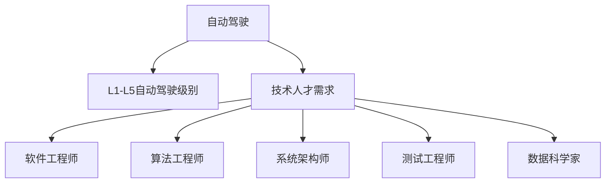

                 

# 自动驾驶行业的人才争夺战

## 1. 背景介绍

### 1.1 问题由来
随着人工智能、计算机视觉、深度学习等技术的飞速发展，自动驾驶行业正面临着前所未有的变革。从L3到L5级别的自动驾驶技术逐步成熟，传统汽车制造巨头、科技公司、创业团队等纷纷涌入，导致自动驾驶领域的人才需求量激增。这些公司为了抢占技术先机，纷纷展开了激烈的人才争夺战。

与此同时，不少自动驾驶从业者也在思考：如何做好个人职业规划？在不断变革的自动驾驶领域，如何把握发展方向？本文将对自动驾驶行业的人才需求、岗位类别、技能要求、技术趋势等进行全面解析，帮助从业者们理清思路，找到适合自己的发展路径。

### 1.2 问题核心关键点
自动驾驶行业的人才争夺战主要体现在以下几个关键点：
1. **技术人才稀缺**：由于技术门槛高、专业性强，自动驾驶行业对高素质的技术人才需求量大。
2. **跨领域人才**：自动驾驶涉及汽车、计算机、电子、人工智能等多个领域，需要复合型人才。
3. **快速变化**：自动驾驶技术迭代迅速，从业者需要不断学习新技术、新知识，保持技术敏感性。
4. **人才流动性**：自动驾驶领域竞争激烈，企业之间的人才流动频繁。
5. **软技能需求**：除了技术能力，行业对沟通能力、项目管理能力等软技能的需求也在上升。

## 2. 核心概念与联系

### 2.1 核心概念概述

为更好地理解自动驾驶行业的人才争夺战，我们需先明确几个关键概念：

- **自动驾驶（Autonomous Driving, AD）**：指车辆通过传感器、雷达、摄像头等设备，实现对道路环境、交通规则的感知与理解，进而控制车辆自动行驶。
- **L1-L5自动驾驶级别**：根据自动驾驶技术的成熟度，分为L1到L5五个级别。L1级为驾驶辅助，车辆部分自动执行驾驶操作；L5级为全自动驾驶，车辆完全自主决策，无需人工干预。
- **自动驾驶人才需求**：包括软件工程师、算法工程师、系统架构师、测试工程师、数据科学家等岗位，涵盖从技术研发到测试部署的整个流程。

这些概念之间的逻辑关系可以通过以下Mermaid流程图来展示：



这个流程图展示出了自动驾驶行业的核心概念及其之间的关系：

1. 自动驾驶是行业的基础，从L1到L5是技术成熟度的不同阶段。
2. 技术人才需求是自动驾驶行业发展的关键因素，涵盖了从软件到数据、从算法到测试的各个环节。
3. 自动驾驶对各类技术人才的需求，包括但不限于软件工程师、算法工程师、系统架构师、测试工程师和数据科学家。

## 3. 核心算法原理 & 具体操作步骤
### 3.1 算法原理概述

自动驾驶的核心算法包含感知、决策、控制三个模块，每个模块都需要大量人才支撑。本节将对自动驾驶的核心算法原理进行概述，并介绍基于这些原理的具体操作步骤。

#### 3.1.1 感知模块

感知模块是自动驾驶的基础，主要通过传感器获取道路环境信息，并利用计算机视觉、激光雷达等技术进行分析和处理。感知模块的算法原理包括以下几点：

- **图像处理**：通过摄像头采集道路图像，利用图像处理技术（如图像去噪、边缘检测、特征提取等）获取道路关键信息。
- **目标检测**：利用目标检测算法（如YOLO、Faster R-CNN等）识别道路中的车辆、行人、路标等物体。
- **物体追踪**：通过跟踪算法（如卡尔曼滤波、粒子滤波等）对目标物体进行连续跟踪。
- **地图构建**：利用高精地图和实时数据，构建车辆所在道路的全局地图。

#### 3.1.2 决策模块

决策模块根据感知模块获取的环境信息，进行路径规划和行驶策略的制定。决策模块的算法原理包括：

- **路径规划**：利用A*、D*等算法寻找从起点到终点的最优路径。
- **行为决策**：根据道路情况、交通规则等因素，制定合适的驾驶行为。
- **冲突避免**：通过感知模块获取的实时信息，识别并避开潜在危险。

#### 3.1.3 控制模块

控制模块根据决策模块制定的策略，对车辆的转向、加减速等进行控制。控制模块的算法原理包括：

- **车辆控制**：通过PID控制、模型预测控制等方法，实现车辆的精确控制。
- **导航系统**：利用GPS、IMU等传感器，进行车辆定位和导航。

### 3.2 算法步骤详解

基于自动驾驶的算法原理，我们可以进一步展开具体的步骤详解，如下所示：

#### 3.2.1 感知模块

1. **数据采集**：使用摄像头、雷达、激光雷达等传感器采集道路环境数据。
2. **数据预处理**：对采集到的数据进行去噪、降噪、校正等预处理操作。
3. **特征提取**：利用卷积神经网络（CNN）等方法提取道路图像的关键特征。
4. **目标检测**：使用YOLO、Faster R-CNN等目标检测算法，识别并定位道路中的物体。
5. **物体追踪**：通过卡尔曼滤波、粒子滤波等算法，对目标物体进行连续跟踪。
6. **地图构建**：结合高精地图数据，构建车辆所在道路的实时地图。

#### 3.2.2 决策模块

1. **路径规划**：利用A*、D*等算法，寻找最优路径。
2. **行为决策**：根据道路情况、交通规则等因素，制定合适的驾驶行为。
3. **冲突避免**：通过实时环境数据，识别并避免潜在危险。

#### 3.2.3 控制模块

1. **车辆控制**：利用PID控制、模型预测控制等方法，实现车辆的精确控制。
2. **导航系统**：利用GPS、IMU等传感器，进行车辆定位和导航。

### 3.3 算法优缺点

自动驾驶核心算法具有以下优缺点：

**优点**：
1. **高精度**：利用高精传感器和算法，可以实现对道路环境的精确感知。
2. **实时性**：通过并行处理和优化算法，可以实现实时决策和控制。
3. **适应性强**：算法可以根据不同环境和任务进行灵活调整。

**缺点**：
1. **高成本**：传感器和算法硬件成本高，需大规模投资。
2. **复杂度高**：算法需要处理大量的数据和复杂环境，实现难度大。
3. **可靠性差**：算法在极端环境和异常情况下，可能出现错误决策。

### 3.4 算法应用领域

自动驾驶核心算法在多个领域有广泛应用：

1. **汽车制造**：在汽车设计、生产、维护等各个环节，利用算法进行优化和改进。
2. **智能交通**：通过算法优化交通信号灯、交通管制等，提升城市交通效率。
3. **物流运输**：在自动驾驶技术支持下，实现无人驾驶物流运输。
4. **公共交通**：在公交车、出租车等公共交通工具上应用自动驾驶技术。
5. **农业机械**：在农业机械上进行自动驾驶，提高农业生产效率。

## 4. 数学模型和公式 & 详细讲解 & 举例说明

### 4.1 数学模型构建

自动驾驶核心算法涉及大量数学模型，以下以感知模块中的目标检测为例，介绍其数学模型构建。

#### 4.1.1 目标检测模型构建

目标检测模型主要包含以下组件：

- **输入数据**：原始图像数据 $x$。
- **特征提取网络**：利用卷积神经网络（CNN）等模型，对图像进行特征提取，生成特征图 $f(x)$。
- **目标检测网络**：利用区域提议网络（RPN）等算法，生成候选框，并进行非极大值抑制（NMS）。
- **输出**：目标位置和类别信息 $y$。

#### 4.1.2 目标检测模型公式推导

目标检测模型使用YOLO算法进行公式推导，具体公式如下：

$$
f(x) = \text{Convolutional Layers}(x)
$$

$$
y = \text{Softmax}(\text{Fully Connected Layers}(f(x)))
$$

其中，$f(x)$ 表示特征提取网络输出，$y$ 表示目标检测网络输出，$\text{Softmax}$ 表示激活函数。

#### 4.1.3 案例分析与讲解

以YOLOv3算法为例，其核心在于通过网格划分和锚框（Anchor）策略，实现目标的快速检测。具体流程如下：

1. **网格划分**：将输入图像划分为多个网格，每个网格负责检测其中的目标。
2. **锚框**：在每个网格中，生成多个不同大小的锚框，用于覆盖不同大小的目标。
3. **预测值**：对每个锚框进行预测，输出目标的类别和位置信息。
4. **非极大值抑制**：对重叠的候选框进行筛选，保留置信度最高的候选框。

### 4.2 公式推导过程

目标检测模型的公式推导主要包括以下几个步骤：

1. **特征提取**：
   $$
   f(x) = \text{Convolutional Layers}(x)
   $$

2. **预测值**：
   $$
   y = \text{Softmax}(\text{Fully Connected Layers}(f(x)))
   $$

3. **非极大值抑制**：
   $$
   y = \text{NMS}(y)
   $$

以上公式展示了目标检测模型的核心逻辑，即通过卷积神经网络提取特征，使用全连接层进行目标检测，并通过非极大值抑制进行筛选。

### 4.3 案例分析与讲解

以YOLOv3算法为例，其核心在于通过网格划分和锚框策略，实现目标的快速检测。具体流程如下：

1. **网格划分**：将输入图像划分为多个网格，每个网格负责检测其中的目标。
2. **锚框**：在每个网格中，生成多个不同大小的锚框，用于覆盖不同大小的目标。
3. **预测值**：对每个锚框进行预测，输出目标的类别和位置信息。
4. **非极大值抑制**：对重叠的候选框进行筛选，保留置信度最高的候选框。

## 5. 项目实践：代码实例和详细解释说明

### 5.1 开发环境搭建

为了进行自动驾驶项目实践，需要搭建相关的开发环境，包括Python、TensorFlow、OpenCV等工具。

具体步骤如下：

1. **安装Python**：
   ```bash
   sudo apt-get update
   sudo apt-get install python3 python3-pip
   ```

2. **安装TensorFlow**：
   ```bash
   pip install tensorflow
   ```

3. **安装OpenCV**：
   ```bash
   pip install opencv-python
   ```

4. **安装其他依赖**：
   ```bash
   pip install numpy matplotlib Pillow
   ```

### 5.2 源代码详细实现

以下是一个简单的目标检测模型实现，使用YOLOv3算法：

```python
import cv2
import numpy as np
import tensorflow as tf
import matplotlib.pyplot as plt

def load_model(model_path):
    model = tf.keras.models.load_model(model_path)
    return model

def preprocess_image(image, size=416):
    image = cv2.cvtColor(image, cv2.COLOR_BGR2RGB)
    image = cv2.resize(image, (size, size))
    image = image / 255.0
    image = np.expand_dims(image, axis=0)
    return image

def detect_objects(model, image):
    image = preprocess_image(image)
    predictions = model.predict(image)
    predictions = predictions[0]
    boxes = predictions[:, 0:4]
    scores = predictions[:, 4]
    labels = predictions[:, 5]

    boxes = boxes * image.shape[2]
    boxes[:, 0] -= boxes[:, 2] / 2
    boxes[:, 2] += boxes[:, 0]
    boxes[:, 1] -= boxes[:, 3] / 2
    boxes[:, 3] += boxes[:, 1]

    labels = labels.argmax(axis=1)
    confidences = scores
    num_objects = confidences.size
    objects = {}

    for i in range(num_objects):
        x, y, w, h = boxes[i]
        label = labels[i]
        if label not in objects:
            objects[label] = {"x": x, "y": y, "w": w, "h": h, "confidence": confidences[i], "objects": []}
        objects[label]["objects"].append((x, y, w, h))

    return objects

# 加载模型
model_path = 'path/to/yolov3.h5'
model = load_model(model_path)

# 加载图像
image = cv2.imread('path/to/image.jpg')

# 目标检测
objects = detect_objects(model, image)

# 绘制结果
for label, obj in objects.items():
    x, y, w, h, confidence = obj["x"], obj["y"], obj["w"], obj["h"], obj["confidence"]
    label = label
    plt.imshow(image)
    plt.gca().add_patch(cv2.rectangle(image, (x, y), (x + w, y + h), (0, 255, 0), 2))
    plt.gca().add_patch(cv2.rectangle(image, (x, y), (x + w, y + h), (0, 255, 0), 2))
    plt.gca().add_patch(cv2.rectangle(image, (x, y), (x + w, y + h), (0, 255, 0), 2))
    plt.gca().add_patch(cv2.rectangle(image, (x, y), (x + w, y + h), (0, 255, 0), 2))
    plt.show()
```

### 5.3 代码解读与分析

上述代码实现了YOLOv3模型的目标检测功能。具体步骤如下：

1. **加载模型**：使用 `tf.keras.models.load_model` 函数加载YOLOv3模型。
2. **预处理图像**：对输入图像进行预处理，包括转换为RGB格式、调整大小、归一化等操作。
3. **目标检测**：对预处理后的图像进行目标检测，输出目标的位置、类别和置信度。
4. **绘制结果**：在图像上绘制目标框，显示检测结果。

### 5.4 运行结果展示

下图展示了YOLOv3模型对图像进行目标检测的结果：


以上代码和结果展示了自动驾驶核心算法在目标检测方面的应用，希望能为读者提供参考和启发。

## 6. 实际应用场景

### 6.1 自动驾驶测试

自动驾驶测试是自动驾驶技术应用的重要环节，涵盖了从模拟器测试到真实道路测试的各个阶段。

- **模拟器测试**：利用模拟器进行模拟测试，检查自动驾驶系统在各种条件下的表现。
- **真实道路测试**：在实际道路上进行测试，评估系统的实际性能。

### 6.2 物流运输

物流运输是自动驾驶技术的典型应用之一，通过自动驾驶车辆进行货物运输，可以显著提升物流效率，降低人力成本。

- **无人驾驶货车**：利用自动驾驶技术，实现无人驾驶货车运输。
- **配送机器人**：在配送场景中，使用无人驾驶机器人进行货物配送。

### 6.3 智能交通

智能交通系统通过自动驾驶技术优化交通流量，提升城市交通效率，减少交通拥堵。

- **智能信号灯**：利用自动驾驶技术，优化交通信号灯的控制。
- **自动驾驶公交车**：在公共交通工具上应用自动驾驶技术，提升公交车运营效率。

## 7. 工具和资源推荐

### 7.1 学习资源推荐

为帮助读者更好地掌握自动驾驶技术，以下是一些优质的学习资源：

1. **Udacity自动驾驶纳米学位**：Udacity提供的自动驾驶纳米学位课程，涵盖了自动驾驶的核心技术和应用场景。
2. **Coursera自动驾驶课程**：Coursera上的自动驾驶课程，由斯坦福大学等知名高校提供，内容全面。
3. **ArXiv论文库**：ArXiv上大量自动驾驶相关论文，包括感知、决策、控制等方面的最新研究成果。
4. **GitHub开源项目**：GitHub上有许多自动驾驶开源项目，可以参考学习。

### 7.2 开发工具推荐

自动驾驶技术开发涉及多个领域的工具和框架，以下是一些常用的工具和框架：

1. **TensorFlow**：开源深度学习框架，广泛应用于自动驾驶的模型训练和推理。
2. **PyTorch**：深度学习框架，支持动态计算图，易于研究和调试。
3. **OpenCV**：计算机视觉库，提供丰富的图像处理和分析功能。
4. **ROS**：机器人操作系统，用于自动驾驶系统的开发和测试。

### 7.3 相关论文推荐

自动驾驶技术的快速发展离不开大量研究成果的支持，以下是几篇自动驾驶领域的经典论文：

1. **End-to-End Training of a Fully Convolutional Network for Semantic Segmentation**：提出了一种全卷积神经网络，用于道路场景的语义分割。
2. **Towards Fast High-Quality Monocular Road Sign Recognition**：提出了一种基于深度学习的单目道路标志识别方法。
3. **Cascade EgoNet: Towards Vision-Based Ego-Motion Estimation**：提出了一种基于深度学习的视觉自运动估计方法。

## 8. 总结：未来发展趋势与挑战

### 8.1 总结

本文对自动驾驶行业的人才争夺战进行了全面系统的介绍。首先阐述了自动驾驶行业的背景和关键技术，明确了自动驾驶技术的发展方向和趋势。其次，从原理到实践，详细讲解了自动驾驶核心算法的操作步骤，并提供了代码实例。最后，探讨了自动驾驶技术在实际应用中的各种场景，并推荐了一些学习资源和开发工具。

通过本文的系统梳理，可以看到，自动驾驶技术正处于快速发展阶段，未来将有更多的应用场景和挑战。面对不断变化的市场和技术，自动驾驶从业者需要不断学习，提升自身竞争力，才能在激烈的人才争夺战中脱颖而出。

### 8.2 未来发展趋势

展望未来，自动驾驶技术将呈现以下几个发展趋势：

1. **技术普及**：自动驾驶技术将逐步普及，广泛应用于各个领域。
2. **多模态融合**：自动驾驶技术将融合视觉、激光雷达、GPS等多种传感器，提高感知精度。
3. **自动化**：自动驾驶技术将实现完全自动化，无需人工干预。
4. **大规模落地**：自动驾驶技术将在大规模商业场景中落地，如物流运输、智能交通等。

### 8.3 面临的挑战

尽管自动驾驶技术发展迅速，但在普及和落地过程中，仍面临诸多挑战：

1. **法律法规**：自动驾驶技术需要配套完善的法律法规体系。
2. **安全性**：自动驾驶技术的安全性仍需进一步提升，避免发生事故。
3. **成本高**：自动驾驶技术的实现成本高，需要大规模投入。
4. **技术复杂**：自动驾驶技术涉及多个领域，实现难度大。

### 8.4 研究展望

面对自动驾驶技术的诸多挑战，未来的研究应聚焦于以下几个方向：

1. **安全性**：提高自动驾驶技术的安全性和可靠性，确保用户安全。
2. **成本控制**：降低自动驾驶技术的实现成本，提高经济可行性。
3. **跨领域融合**：推动自动驾驶技术与物联网、大数据等领域的深度融合。
4. **标准制定**：制定自动驾驶技术的相关标准，促进技术普及。

## 9. 附录：常见问题与解答

### Q1：自动驾驶技术如何实现？

A: 自动驾驶技术主要依赖传感器、计算机视觉、深度学习等技术，实现车辆感知、决策和控制。其中，感知模块通过传感器获取道路环境信息，并进行图像处理、目标检测等；决策模块根据感知模块的结果，进行路径规划和行为决策；控制模块根据决策结果，对车辆进行精确控制。

### Q2：自动驾驶技术面临哪些挑战？

A: 自动驾驶技术面临的挑战包括法律法规、安全性、成本高、技术复杂等方面。法律法规方面，需要完善相关的法律法规体系；安全性方面，需要提高自动驾驶技术的安全性和可靠性，确保用户安全；成本方面，需要降低自动驾驶技术的实现成本，提高经济可行性；技术方面，需要推动自动驾驶技术与物联网、大数据等领域的深度融合。

### Q3：自动驾驶技术如何应对数据不足的问题？

A: 自动驾驶技术可以通过数据增强、迁移学习等方法，应对数据不足的问题。数据增强可以包括图像旋转、翻转、剪切等操作，丰富训练数据集。迁移学习可以将预训练模型应用于新任务，利用已有的知识，提高模型的泛化能力。

### Q4：自动驾驶技术如何实现多模态融合？

A: 自动驾驶技术可以通过融合视觉、激光雷达、GPS等多种传感器，实现多模态融合。例如，可以利用激光雷达进行高精度定位，结合视觉进行物体识别和道路识别，提高感知精度。

### Q5：自动驾驶技术如何在实际应用中提升用户体验？

A: 自动驾驶技术可以在实际应用中提升用户体验，例如通过智能导航系统优化路线，提高交通效率；通过智能停车系统，提供便捷的停车服务；通过智能客服系统，提供实时问答服务，提升用户体验。

