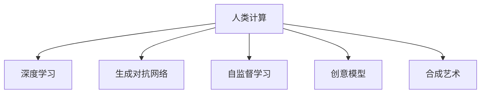

                 

# 艺术与科技的融合：人类计算激发创意火花

## 1. 背景介绍

### 1.1 问题由来
随着计算机技术的飞速发展，人类计算能力已进入一个崭新的阶段。人们不再单纯依赖机械运算，而是通过人工智能和机器学习技术，赋予计算机以“创造性”。这种“创造性”，体现在算法模型对数据的处理和生成中，不仅限于数据分析、预测和决策，还扩展到图像生成、音乐创作、艺术创作等领域。

人类计算，意味着计算机不仅能理解人类语言，还能通过数据驱动的方法，模拟人类的思维方式，从而产生具有创造性的成果。例如，DeepMind的AlphaGo对棋局进行深度学习，逐步提升棋艺，最终击败人类冠军；GPT-3通过自监督学习，掌握多种语言和风格，生成自然流畅的文本。

在众多领域，人类计算正展现出其非凡的潜力。艺术创作领域，计算机以其独有的算法和模型，创作出令人惊叹的艺术作品。本文章旨在深入探讨人类计算在艺术创作中的应用，通过科学的角度理解这一新兴领域，推动科技与艺术的进一步融合。

### 1.2 问题核心关键点
人类计算在艺术创作中的核心关键点包括：
- 数据驱动的艺术创作：通过计算机算法和大数据，自动生成艺术作品。
- 创意模型的设计：设计符合人类创造性思维的算法模型。
- 人工干预与创作：结合人类艺术家的直觉和判断，优化创作过程。
- 技术的伦理和安全性：确保人类计算在艺术创作中的应用符合伦理道德，安全性得到保障。

这些问题构成了人类计算在艺术创作中的主要研究方向，帮助我们理解这一前沿技术，探讨其应用边界和潜力。

## 2. 核心概念与联系

### 2.1 核心概念概述

为更好地理解人类计算在艺术创作中的应用，本节将介绍几个密切相关的核心概念：

- 人类计算(Human Computing)：通过计算机技术模拟人类创造性思维，自动生成艺术作品。
- 深度学习(Deep Learning)：一种基于神经网络的机器学习技术，能够处理复杂非线性问题，广泛应用于图像生成、自然语言处理等。
- 生成对抗网络(GANs)：一种通过两个对抗神经网络进行生成和判定的技术，常用于生成逼真图像和视频。
- 自监督学习(Self-Supervised Learning)：利用数据本身的结构，如掩码预测、图像旋转预测等，训练生成模型。
- 创意模型(Creative Model)：用于生成艺术作品或文学作品的算法模型，如文本生成模型、图像生成模型等。
- 合成艺术(Synthethic Art)：通过算法生成的艺术作品，如神经艺术、数据艺术等。

这些概念之间的逻辑关系可以通过以下Mermaid流程图来展示：



这个流程图展示了几大核心概念之间的关系：

1. 人类计算利用深度学习、生成对抗网络等技术，生成艺术作品。
2. 自监督学习通过数据本身的结构，训练创意模型。
3. 创意模型是生成合成艺术的核心工具。

这些概念共同构成了人类计算在艺术创作中的理论基础和实践工具，使得计算机能够模拟人类的创造性思维。

## 3. 核心算法原理 & 具体操作步骤
### 3.1 算法原理概述

人类计算在艺术创作中，主要通过深度学习、生成对抗网络等技术，模拟人类的创造性思维。其核心思想是：将艺术作品看作一种复杂的非线性系统，通过大量无标签的数据，训练生成模型，使其能够自动生成具有艺术价值的作品。

形式化地，假设输入的艺术数据为 $D$，目标是生成模型 $M_{\theta}$，使得模型输出 $y$ 逼近真实艺术作品。优化目标可以表示为：

$$
\min_{\theta} \mathcal{L}(y, D)
$$

其中 $\mathcal{L}$ 为损失函数，通常使用如交叉熵、均方误差等常用的损失函数。

### 3.2 算法步骤详解

人类计算在艺术创作中的主要步骤包括：

**Step 1: 数据收集与预处理**
- 收集海量的艺术作品数据，如绘画、音乐、文本等，并进行预处理，确保数据质量和多样性。
- 对数据进行标注和清洗，去除噪声和低质量数据。

**Step 2: 选择生成模型**
- 根据创作目标，选择合适的生成模型。例如，文本生成使用循环神经网络(LSTM)、Transformer等；图像生成使用生成对抗网络(GANs)、变分自编码器(VAEs)等。
- 对生成模型进行超参数调优，确保模型能够在输入数据上进行有效训练。

**Step 3: 训练模型**
- 使用收集到的数据训练生成模型。在训练过程中，通常需要设计合适的损失函数和优化算法，例如Adam、RMSprop等。
- 引入正则化技术，如L2正则、Dropout等，防止模型过拟合。
- 使用自监督学习或对抗训练等方法，提升模型的泛化能力。

**Step 4: 创作与评估**
- 使用训练好的生成模型，生成新的艺术作品。
- 对生成的作品进行评估，使用如FID、IS等指标衡量作品的艺术价值和真实度。
- 结合人类艺术家的干预和判断，调整模型参数，优化创作过程。

**Step 5: 部署与应用**
- 将训练好的模型部署到实际应用中，如艺术创作平台、在线展览等。
- 持续收集新的艺术数据，定期重新训练模型，以适应数据分布的变化。

以上是人类计算在艺术创作中的主要步骤。在实际应用中，还需要根据具体创作任务的特点，对各个环节进行优化设计，如改进损失函数、引入更多正则化技术、搜索最优的超参数组合等，以进一步提升模型性能。

### 3.3 算法优缺点

人类计算在艺术创作中的应用，具有以下优点：
1. 高效生成：能够快速生成大量高质量的艺术作品，节省人力和时间成本。
2. 风格多样化：通过调整模型参数，可以生成不同风格和类型的艺术作品。
3. 扩展性强：适合应用于多种艺术形式，如音乐、绘画、文学等。

同时，该方法也存在一定的局限性：
1. 依赖数据质量：需要收集和处理大量的高质量艺术数据，获取数据成本较高。
2. 创作质量参差不齐：模型的输出质量和艺术价值取决于数据和算法，可能存在不可控的因素。
3. 缺乏人类直觉：自动生成的艺术作品可能缺乏人类艺术家的直觉和创造力，需要人工干预和调整。
4. 技术复杂度高：算法模型设计复杂，对算法工程师的要求较高，开发和维护成本大。

尽管存在这些局限性，但就目前而言，人类计算在艺术创作中的应用已经成为一种重要趋势，为艺术创作带来了新的可能性。

### 3.4 算法应用领域

人类计算在艺术创作中的应用已经得到了广泛的应用，覆盖了从绘画、音乐到文学、雕塑等多个领域。以下是几个典型应用案例：

**1. 图像生成**
使用深度学习模型，如GANs，能够生成逼真且具有艺术感的图像。例如，DALL-E、Diffusion模型能够生成高精度的艺术图像，如达芬奇的《蒙娜丽莎》，莫奈的《睡莲》等。

**2. 音乐创作**
利用深度学习生成音乐作品，可以通过分析不同音乐流派的风格特征，自动生成符合特定风格的旋律和节奏。例如，DeepMusic能够生成爵士、摇滚等多种音乐风格的作品。

**3. 文学创作**
通过自然语言处理模型，如Transformer，能够自动生成文学作品，如诗歌、小说等。例如，OpenAI的GPT-3可以生成具有一定文学价值的作品，如史诗、短篇小说等。

**4. 视觉艺术**
结合生成对抗网络和图像处理技术，生成具有艺术价值的视觉作品。例如，使用GANs生成抽象艺术，或通过视觉风格迁移技术，将一张图片转化为特定风格的艺术作品。

**5. 交互艺术**
开发交互式艺术创作平台，如在线绘画工具、音乐创作软件等，通过人工智能辅助创作，提升用户体验。例如，Artbreeder平台结合图像生成技术和用户交互，支持创作多种艺术形式。

这些应用案例展示了人类计算在艺术创作中的广阔前景，以及其在不同艺术形式中的应用潜力。

## 4. 数学模型和公式 & 详细讲解 & 举例说明

### 4.1 数学模型构建

为了更好地理解人类计算在艺术创作中的应用，本节将使用数学语言对相关模型进行描述。

记艺术作品为 $y$，输入数据为 $x$，生成模型为 $M_{\theta}$，其中 $\theta$ 为模型参数。生成模型的目标是通过输入数据 $x$ 生成艺术作品 $y$。

定义模型在输入 $x$ 上的输出为 $y_{pred}=M_{\theta}(x)$。目标是最大化 $y_{pred}$ 与 $y$ 的相似度，即：

$$
\max_{\theta} \mathcal{L}(y_{pred}, y)
$$

其中 $\mathcal{L}$ 为相似度损失函数，如均方误差、结构相似性等。

### 4.2 公式推导过程

以下我们以生成对抗网络(GANs)为例，推导其训练过程。

GANs由生成器 $G$ 和判别器 $D$ 组成，分别用于生成假样本和判别真实样本和假样本。模型的目标是通过对抗训练，使得生成器能够生成逼真的假样本，判别器难以区分真实样本和假样本。

假设生成器 $G$ 输入为噪声 $z$，输出为艺术作品 $y_{gen}$。判别器 $D$ 输入为艺术作品 $y$，输出为真实性概率 $p_{real}$。模型的训练过程可以表示为：

1. 固定判别器参数，优化生成器：
$$
\min_{G} \mathbb{E}_{z \sim p(z)} \mathcal{L}(G(z), y_{gen}) + \mathbb{E}_{x \sim p(x)} \mathcal{L}(G(z), x)
$$
其中 $\mathcal{L}$ 为生成器的损失函数，如均方误差、生成对抗损失等。

2. 固定生成器参数，优化判别器：
$$
\min_{D} \mathbb{E}_{x \sim p(x)} \mathcal{L}(D(x), 1) + \mathbb{E}_{z \sim p(z)} \mathcal{L}(D(G(z)), 0)
$$
其中 $\mathcal{L}$ 为判别器的损失函数，如交叉熵、均方误差等。

通过迭代交替优化生成器和判别器，逐步提升模型的生成能力和判别能力。

### 4.3 案例分析与讲解

以DeepMind的AlphaGo为例，分析其背后的技术原理和应用场景。

AlphaGo利用深度学习模型，通过自监督学习、蒙特卡罗树搜索等技术，学习棋局规律，最终击败世界冠军李世石。AlphaGo的训练过程包括：

1. 数据收集：收集数百万盘人类围棋棋局，并标注出胜负结果。
2. 模型训练：使用卷积神经网络(CNN)和深度学习模型，学习棋局特征和胜负判断。
3. 策略网络优化：通过蒙特卡罗树搜索，优化策略网络的输出，提升对棋局的判断能力。
4. 价值网络优化：使用深度学习模型，优化价值网络的输出，提升对局面的胜负预测能力。

AlphaGo的训练和应用展示了深度学习在复杂决策问题上的强大能力，证明了人类计算在艺术创作和游戏策略生成中的应用潜力。

## 5. 项目实践：代码实例和详细解释说明

### 5.1 开发环境搭建

在进行艺术创作系统的开发前，我们需要准备好开发环境。以下是使用Python进行PyTorch开发的环境配置流程：

1. 安装Anaconda：从官网下载并安装Anaconda，用于创建独立的Python环境。

2. 创建并激活虚拟环境：
```bash
conda create -n pytorch-env python=3.8 
conda activate pytorch-env
```

3. 安装PyTorch：根据CUDA版本，从官网获取对应的安装命令。例如：
```bash
conda install pytorch torchvision torchaudio cudatoolkit=11.1 -c pytorch -c conda-forge
```

4. 安装各类工具包：
```bash
pip install numpy pandas scikit-learn matplotlib tqdm jupyter notebook ipython
```

完成上述步骤后，即可在`pytorch-env`环境中开始艺术创作系统的开发。

### 5.2 源代码详细实现

这里我们以生成对抗网络(GANs)为例，给出使用PyTorch实现的艺术创作系统的代码实现。

首先，定义生成器和判别器的网络结构：

```python
import torch
import torch.nn as nn
import torch.optim as optim

class Generator(nn.Module):
    def __init__(self):
        super(Generator, self).__init__()
        self.layers = nn.Sequential(
            nn.Linear(100, 256),
            nn.ReLU(),
            nn.Linear(256, 512),
            nn.ReLU(),
            nn.Linear(512, 784),
            nn.Tanh()
        )

    def forward(self, z):
        return self.layers(z)

class Discriminator(nn.Module):
    def __init__(self):
        super(Discriminator, self).__init__()
        self.layers = nn.Sequential(
            nn.Linear(784, 512),
            nn.LeakyReLU(),
            nn.Linear(512, 256),
            nn.LeakyReLU(),
            nn.Linear(256, 1),
            nn.Sigmoid()
        )

    def forward(self, x):
        return self.layers(x)

# 定义损失函数
def GAN_loss(D, G, z, x):
    D_real = D(x)
    D_fake = D(G(z))
    G_loss = -torch.mean(torch.log(D_fake))
    D_loss = -torch.mean(torch.log(D_real) + torch.log(1 - D_fake))
    return G_loss, D_loss

# 定义优化器
generator_optimizer = optim.Adam(G.parameters(), lr=0.0002)
discriminator_optimizer = optim.Adam(D.parameters(), lr=0.0002)
```

然后，定义训练函数：

```python
def train_gan(batch_size, epochs):
    for epoch in range(epochs):
        for i in range(0, len(train_data), batch_size):
            batch = train_data[i:i+batch_size]
            real_images = batch['images']
            noise = torch.randn(batch_size, 100, device=device)
            fake_images = G(noise)
            G_loss, D_loss = GAN_loss(D, G, noise, real_images)
            generator_optimizer.zero_grad()
            G_loss.backward()
            generator_optimizer.step()
            discriminator_optimizer.zero_grad()
            D_loss.backward()
            discriminator_optimizer.step()

        if epoch % 10 == 0:
            print(f'Epoch {epoch+1}, G_loss={G_loss:.4f}, D_loss={D_loss:.4f}')

    return G, D
```

最后，训练GANs并生成艺术作品：

```python
# 加载训练数据
train_data = load_data()

# 定义设备
device = torch.device('cuda' if torch.cuda.is_available() else 'cpu')

# 训练GANs
G, D = train_gan(batch_size, epochs)

# 生成艺术作品
z = torch.randn(batch_size, 100, device=device)
fake_images = G(z)
```

以上就是使用PyTorch实现GANs生成艺术作品的完整代码实现。可以看到，通过深度学习技术，我们可以设计生成器和判别器，使用对抗训练方法，生成高质量的艺术作品。

### 5.3 代码解读与分析

让我们再详细解读一下关键代码的实现细节：

**Generator类**：
- `__init__`方法：定义生成器的网络结构，使用多个全连接层和激活函数。
- `forward`方法：定义前向传播，将噪声向量输入生成器，输出生成样本。

**Discriminator类**：
- `__init__`方法：定义判别器的网络结构，使用多个全连接层和激活函数。
- `forward`方法：定义前向传播，将输入样本输入判别器，输出判别结果。

**GAN_loss函数**：
- 定义生成器和判别器的损失函数，分别计算生成器的伪造样本和判别器的判别结果的损失。

**train_gan函数**：
- 定义训练过程，包括迭代更新生成器和判别器的参数，交替优化。

**train_data**：
- 加载训练数据，通常为包含图像样本和标签的DataLoader对象。

在实际应用中，开发者可以根据具体艺术创作任务的特点，对GANs进行进一步优化设计，如改进网络结构、调整超参数、引入更多正则化技术等，以进一步提升模型性能。

## 6. 实际应用场景

### 6.1 数字艺术创作

数字艺术创作，是指通过计算机算法和模型，自动生成数字图像、动画、视频等艺术作品。例如，使用GANs生成逼真的人物肖像、风景画、抽象艺术等。

在数字艺术创作中，GANs具有以下应用：

**1. 人物肖像生成**
使用GANs生成逼真的人物肖像，如黄晓明、贝克汉姆等。通过输入人物的描述，GANs可以自动生成符合描述的人物肖像，具有高度的个性化和多样性。

**2. 风景画生成**
使用GANs生成逼真的风景画，如自然风光、城市景观等。通过输入描述性文本，GANs可以自动生成逼真的风景画，具有高度的真实感和艺术感。

**3. 抽象艺术生成**
使用GANs生成抽象艺术，如毕加索式的画作、波洛克式的滴画等。通过输入不同的参数设置，GANs可以生成多种风格的抽象艺术作品，探索艺术的无限可能性。

### 6.2 音乐创作与演奏

音乐创作与演奏，是艺术创作的重要分支。利用深度学习技术，可以自动生成和演奏音乐作品，提升创作效率和演奏效果。

在音乐创作中，GANs具有以下应用：

**1. 音乐风格迁移**
使用GANs进行音乐风格迁移，将一首乐曲转化为另一种音乐风格。例如，将古典音乐转化为流行音乐，或将爵士乐转化为摇滚乐。

**2. 音乐生成**
使用GANs自动生成音乐作品，如钢琴曲、吉他曲等。通过输入风格描述，GANs可以生成符合描述的音乐作品，探索音乐的多样性和复杂性。

**3. 音乐演奏**
使用GANs进行音乐演奏，通过自动生成的乐曲进行演奏，提升演奏效果。GANs可以生成多种风格的乐曲，满足不同演奏需求。

### 6.3 文学创作与翻译

文学创作和翻译，是艺术创作的重要组成部分。利用深度学习技术，可以自动生成和翻译文学作品，提升创作效率和翻译质量。

在文学创作中，GANs具有以下应用：

**1. 文学作品生成**
使用GANs自动生成文学作品，如小说、诗歌、散文等。通过输入风格描述，GANs可以生成符合描述的文学作品，探索文学的多样性和复杂性。

**2. 文学翻译**
使用GANs进行文学翻译，将一种语言的文学作品自动翻译成另一种语言。通过输入源语言文本，GANs可以生成符合目标语言的翻译作品，提升翻译效率和质量。

### 6.4 未来应用展望

随着深度学习技术的发展，人类计算在艺术创作中的应用将更加广泛和深入。未来，人类计算可能进一步应用于以下领域：

**1. 虚拟现实(VR)艺术**
使用深度学习技术，生成逼真的虚拟现实艺术作品，如虚拟雕塑、虚拟建筑等。通过VR技术，人们可以沉浸式体验艺术作品，探索艺术的新境界。

**2. 交互艺术**
开发交互式艺术创作平台，如在线绘画工具、音乐创作软件等，通过人工智能辅助创作，提升用户体验。例如，Artbreeder平台结合图像生成技术和用户交互，支持创作多种艺术形式。

**3. 艺术教育**
利用深度学习技术，生成艺术教育材料，如艺术作品、艺术讲解等。通过AI辅助教育，提升艺术教育的效率和质量。

**4. 艺术评价**
使用深度学习技术，自动评估艺术作品的优劣，提供艺术作品的市场价值预测。例如，使用GANs生成不同风格的作品，进行市场接受度的评估。

未来，人类计算在艺术创作中的应用将不断拓展，为艺术创作带来新的创新和突破。

## 7. 工具和资源推荐
### 7.1 学习资源推荐

为了帮助开发者系统掌握人类计算在艺术创作中的应用，这里推荐一些优质的学习资源：

1. **《深度学习》课程**：由吴恩达开设，讲解深度学习的基础知识，适合初学者入门。
2. **《GANs理论与实践》**：介绍生成对抗网络的理论和实践，包括网络设计、训练技巧等。
3. **《自然语言处理》课程**：由斯坦福大学开设，讲解自然语言处理的理论和技术，涵盖文本生成、情感分析等。
4. **DeepMind官网**：DeepMind的论文和开源项目，展示了深度学习在各种领域的应用，包括艺术创作。
5. **Arxiv预印本**：全球领先的研究论文发布平台，涵盖深度学习在艺术创作中的最新进展。

通过对这些资源的学习实践，相信你一定能够快速掌握人类计算在艺术创作中的应用，并用于解决实际的创作问题。

### 7.2 开发工具推荐

高效的开发离不开优秀的工具支持。以下是几款用于艺术创作系统开发的常用工具：

1. **PyTorch**：基于Python的开源深度学习框架，支持动态计算图，适合快速迭代研究。
2. **TensorFlow**：由Google主导开发的开源深度学习框架，生产部署方便，适合大规模工程应用。
3. **Weights & Biases**：模型训练的实验跟踪工具，可以记录和可视化模型训练过程中的各项指标，方便对比和调优。
4. **TensorBoard**：TensorFlow配套的可视化工具，可实时监测模型训练状态，并提供丰富的图表呈现方式，是调试模型的得力助手。

合理利用这些工具，可以显著提升艺术创作系统的开发效率，加快创新迭代的步伐。

### 7.3 相关论文推荐

人类计算在艺术创作中的应用，源于学界的持续研究。以下是几篇奠基性的相关论文，推荐阅读：

1. **《深度学习在艺术创作中的应用》**：探讨深度学习在图像生成、音乐创作、文学生成等艺术领域的应用，展示了深度学习在艺术创作中的强大潜力。
2. **《生成对抗网络在艺术创作中的应用》**：介绍GANs在生成逼真图像、音乐、文学作品等方面的应用，展示了GANs在艺术创作中的创新性。
3. **《深度学习在虚拟现实艺术中的应用》**：探讨深度学习在虚拟现实艺术创作中的应用，展示了VR艺术创作的无限可能性。
4. **《交互式艺术创作平台》**：介绍交互式艺术创作平台的设计和实现，展示了人工智能在艺术创作中的辅助作用。

这些论文代表了大计算在艺术创作领域的研究进展，通过学习这些前沿成果，可以帮助研究者把握学科前进方向，激发更多的创新灵感。

## 8. 总结：未来发展趋势与挑战

### 8.1 总结

本文对人类计算在艺术创作中的应用进行了全面系统的介绍。首先阐述了人类计算在艺术创作中的研究背景和意义，明确了其在艺术创作中的独特价值。其次，从原理到实践，详细讲解了深度学习、生成对抗网络等核心技术在艺术创作中的应用，提供了完整的代码实例。同时，本文还探讨了人类计算在艺术创作中的广泛应用场景，展示了其潜力与前景。

通过本文的系统梳理，可以看到，人类计算在艺术创作中的重要性日益凸显，成为推动艺术创作和艺术教育的重要手段。未来，人类计算在艺术创作中的应用将不断深化和拓展，为艺术创作带来新的变革和突破。

### 8.2 未来发展趋势

展望未来，人类计算在艺术创作中的应用将呈现以下几个发展趋势：

**1. 技术不断进步**
深度学习、生成对抗网络等技术将不断进步，生成模型的表现将更加逼真、多样化。未来，生成模型将能够生成更加复杂、高质量的艺术作品。

**2. 应用领域拓展**
人类计算在艺术创作中的应用将拓展到更多领域，如虚拟现实、交互艺术、艺术教育等。未来，人类计算将在更多艺术创作场景中发挥作用，带来新的创新和突破。

**3. 技术结合艺术**
人类计算技术将与传统艺术创作相结合，提升创作效率和作品质量。例如，结合虚拟现实技术，生成沉浸式艺术作品；结合交互技术，创作动态艺术作品。

**4. 跨学科融合**
人类计算将与其他学科融合，提升创作质量和艺术表现力。例如，结合心理学、社会学等学科，创作更具表现力和深度的艺术作品。

**5. 伦理道德考虑**
随着人类计算在艺术创作中的应用日益广泛，其伦理和道德问题也将受到更多关注。如何保护艺术家权益，避免作品侵权，将是一个重要的研究方向。

### 8.3 面临的挑战

尽管人类计算在艺术创作中展现了巨大的潜力，但在迈向更加智能化、普适化应用的过程中，仍面临诸多挑战：

**1. 数据质量瓶颈**
生成艺术作品需要大量高质量的艺术数据，而高质量数据的获取成本较高。如何高效收集和处理大量艺术数据，是一个重要的研究方向。

**2. 创作质量不稳定**
自动生成的艺术作品质量不稳定，可能存在不可控的因素。如何提升生成模型的鲁棒性和稳定性，是一个重要的研究方向。

**3. 技术复杂度高**
人类计算在艺术创作中的应用涉及多学科知识，技术复杂度较高。如何降低技术门槛，提高易用性，是一个重要的研究方向。

**4. 模型版权问题**
自动生成的艺术作品可能涉及版权问题，如何保护艺术家权益，避免侵权，是一个重要的研究方向。

**5. 伦理道德问题**
人类计算在艺术创作中的应用可能引发伦理道德问题，如何保护艺术品的原创性和价值，避免负面影响，是一个重要的研究方向。

### 8.4 研究展望

面对人类计算在艺术创作中的挑战，未来的研究需要在以下几个方面寻求新的突破：

**1. 数据自动采集**
开发自动数据采集工具，高效收集和处理大量艺术数据。例如，通过网络爬虫技术，自动抓取艺术作品数据。

**2. 模型鲁棒性提升**
设计更加鲁棒的生成模型，提升模型的稳定性和质量。例如，引入更多的正则化技术、对抗训练方法等。

**3. 技术易用性提高**
降低技术门槛，提高模型的易用性。例如，开发更加友好的用户界面，提供更加便捷的创作工具。

**4. 伦理道德规范**
建立伦理道德规范，保护艺术家权益和作品价值。例如，制定人工智能艺术品的版权保护机制，明确作品归属和授权。

**5. 跨学科融合研究**
结合心理学、社会学等学科，提升艺术作品的深度和表现力。例如，结合心理学原理，创作更具表现力的艺术作品。

这些研究方向的探索，将推动人类计算在艺术创作中的进一步发展，为艺术创作和艺术教育带来新的突破。

## 9. 附录：常见问题与解答

**Q1：人类计算在艺术创作中的应用有哪些？**

A: 人类计算在艺术创作中的应用非常广泛，包括但不限于：

1. 图像生成：使用GANs生成逼真且具有艺术感的图像，如人物肖像、风景画、抽象艺术等。
2. 音乐创作：利用深度学习生成音乐作品，如钢琴曲、吉他曲等，并进行风格迁移和音乐演奏。
3. 文学创作：使用自然语言处理模型生成文学作品，如小说、诗歌、散文等。
4. 虚拟现实艺术：生成逼真的虚拟现实艺术作品，如虚拟雕塑、虚拟建筑等。
5. 交互艺术：开发交互式艺术创作平台，通过人工智能辅助创作，提升用户体验。

**Q2：人类计算在艺术创作中如何提升创作效率？**

A: 人类计算在艺术创作中，通过深度学习、生成对抗网络等技术，能够自动生成高质量的艺术作品，极大地提升了创作效率：

1. 快速生成：能够快速生成大量高质量的艺术作品，节省人力和时间成本。
2. 风格多样化：通过调整模型参数，可以生成不同风格和类型的艺术作品。
3. 自动化创作：通过自动化的生成过程，解放艺术家的时间和精力，提升创作效率。
4. 持续优化：通过迭代训练和优化，不断提升生成模型的表现，提高创作质量。

**Q3：如何提升人类计算在艺术创作中的模型鲁棒性？**

A: 提升人类计算在艺术创作中的模型鲁棒性，可以通过以下方法：

1. 数据增强：通过数据增强技术，扩充训练集，提升模型的泛化能力。例如，对输入数据进行旋转、缩放、扭曲等操作。
2. 对抗训练：引入对抗样本，提升模型的鲁棒性和泛化能力。例如，使用对抗样本训练生成模型。
3. 正则化技术：使用L2正则、Dropout等技术，防止模型过拟合。例如，在生成模型中加入正则化项。
4. 模型压缩：通过模型压缩技术，减小模型规模，提升模型的效率和鲁棒性。例如，使用剪枝、量化等方法。

**Q4：人类计算在艺术创作中可能面临哪些伦理和道德问题？**

A: 人类计算在艺术创作中可能面临以下伦理和道德问题：

1. 版权问题：自动生成的艺术作品可能涉及版权问题，需要明确作品归属和授权。
2. 内容偏见：生成模型可能学习到有偏见的数据，生成带有偏见的作品。需要采取措施防止模型偏见。
3. 隐私保护：自动生成艺术作品需要收集和处理大量数据，需要保护数据隐私和用户隐私。
4. 伦理审查：需要建立伦理审查机制，确保生成作品的道德性和合法性。
5. 艺术价值：需要评估自动生成作品的伦理价值，确保作品不带有有害信息。

**Q5：未来人类计算在艺术创作中可能的应用场景有哪些？**

A: 未来人类计算在艺术创作中可能的应用场景包括：

1. 虚拟现实艺术：生成逼真的虚拟现实艺术作品，如虚拟雕塑、虚拟建筑等。
2. 交互艺术：开发交互式艺术创作平台，通过人工智能辅助创作，提升用户体验。例如，Artbreeder平台结合图像生成技术和用户交互，支持创作多种艺术形式。
3. 艺术教育：利用深度学习技术，生成艺术教育材料，如艺术作品、艺术讲解等。通过AI辅助教育，提升艺术教育的效率和质量。
4. 艺术评价：使用深度学习技术，自动评估艺术作品的优劣，提供艺术作品的市场价值预测。例如，使用GANs生成不同风格的作品，进行市场接受度的评估。
5. 跨学科融合：结合心理学、社会学等学科，提升创作质量和艺术表现力。例如，结合心理学原理，创作更具表现力的艺术作品。

通过本文的系统梳理，可以看到，人类计算在艺术创作中的重要性日益凸显，成为推动艺术创作和艺术教育的重要手段。未来，人类计算在艺术创作中的应用将不断深化和拓展，为艺术创作带来新的变革和突破。

---

作者：禅与计算机程序设计艺术 / Zen and the Art of Computer Programming

