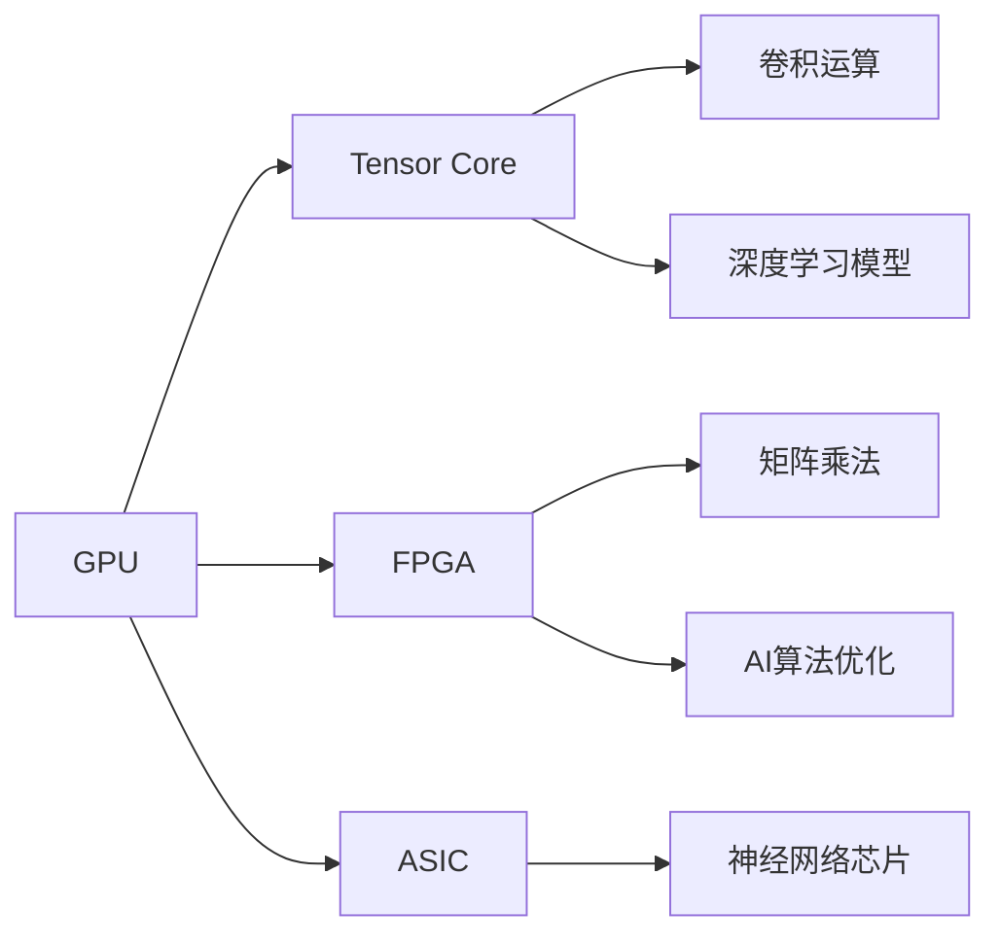

                 

## 1. 背景介绍

### 1.1 问题由来

随着人工智能（AI）技术的迅猛发展，计算效率与模型复杂度之间的矛盾日益加剧。传统的通用计算硬件已难以满足AI算法对性能、功耗和成本的需求，这极大地限制了AI创新的步伐。在此背景下，芯片技术在AI领域的应用愈发重要，成为推动AI创新发展的关键突破口。

### 1.2 问题核心关键点

为了在AI领域实现性能突破，研究人员和工程师们纷纷将目光投向芯片技术，希望能通过专用硬件加速提升AI算法的运行效率。其中，GPU（图形处理器）、FPGA（可编程门阵列）、ASIC（专用集成电路）等加速芯片，以及新兴的AI芯片，如神经网络芯片（Neuromorphic Chips），成为AI创新的重要工具。这些芯片通过对算法特定操作的优化，实现了算法执行效率的显著提升。

## 2. 核心概念与联系

### 2.1 核心概念概述

为了更好地理解芯片技术在AI创新中的作用，本节将介绍几个与芯片技术紧密相关的核心概念：

- **芯片技术**：硬件加速芯片技术的总称，包括GPU、FPGA、ASIC、神经网络芯片等。
- **AI算法优化**：通过特定硬件架构设计优化AI算法的执行效率。
- **深度学习模型**：如卷积神经网络（CNN）、循环神经网络（RNN）、变压器（Transformer）等，是当前AI领域最常用的模型。
- **卷积运算**：图像识别、计算机视觉等任务中常用的计算类型，通过硬件加速可大幅提升效率。
- **矩阵乘法**：深度学习中常用的运算类型，是优化算法的重点。
- **GPU与Tensor Core**：GPU硬件中的并行计算单元，通过Tensor Core优化矩阵乘法运算。
- **AI芯片设计**：针对AI算法特点设计的专用集成电路，如TPU、GPU、FPGA等。

### 2.2 核心概念原理和架构的 Mermaid 流程图



这个流程图展示了芯片技术在AI创新中的主要应用场景和架构关系：

1. **GPU**：通过其Tensor Core加速矩阵乘法运算，提升深度学习模型的训练和推理效率。
2. **FPGA**：通过可编程特性，实现高度定制的AI算法加速。
3. **ASIC**：专为AI算法设计的专用芯片，提供最高效率的计算支持。
4. **神经网络芯片**：如Google的TPU，专为深度神经网络设计的芯片。
5. **深度学习模型**：利用特定芯片进行优化，提升训练和推理速度。
6. **AI算法优化**：通过硬件架构设计，提升深度学习模型的执行效率。

这些概念共同构成了芯片技术在AI创新中的基础架构，展示了AI算法和硬件加速之间的紧密联系。

## 3. 核心算法原理 & 具体操作步骤

### 3.1 算法原理概述

芯片技术在AI创新中的作用主要体现在以下几个方面：

- **并行计算**：利用芯片中的并行计算单元，如GPU的Tensor Core、FPGA的并行逻辑单元等，提升深度学习模型的计算效率。
- **硬件优化**：通过专用硬件电路设计，如神经网络芯片的优化电路，提升特定AI算法的执行效率。
- **算法适应性**：硬件加速芯片对AI算法的特定操作进行了优化，提高了算法的适应性。

这些原理通过芯片技术，将传统软件算法加速转化为硬件加速，极大提升了AI算法的运行效率。

### 3.2 算法步骤详解

以下是利用GPU加速深度学习模型的具体操作步骤：

1. **模型定义**：定义深度学习模型，如卷积神经网络（CNN）、循环神经网络（RNN）或Transformer。
2. **数据准备**：准备训练和测试数据集，并进行预处理。
3. **模型编译**：将模型编译为可在GPU上运行的程序，包括GPU驱动程序和库的安装。
4. **数据传输**：将训练数据从CPU传输到GPU，并进行预加载。
5. **模型训练**：在GPU上进行模型训练，利用Tensor Core加速矩阵乘法。
6. **模型测试**：在GPU上进行模型测试，验证训练效果。

### 3.3 算法优缺点

利用芯片技术加速AI算法的主要优点包括：

- **高效计算**：硬件加速提升了AI算法的执行速度，大幅缩短训练和推理时间。
- **低能耗**：专用硬件芯片通常设计得更加节能，相对于通用CPU可显著降低能耗。
- **高性价比**：虽然初期投资较大，但长期来看，硬件加速芯片的能效比使总体成本更经济。

然而，芯片技术也存在一些缺点：

- **定制难度高**：定制化硬件加速芯片设计复杂，需要丰富的专业知识。
- **灵活性差**：专用硬件芯片在灵活性上不如通用硬件，难以适应多样化的应用场景。
- **初期成本高**：硬件加速芯片的初期投入较大，包括芯片购买、安装调试等环节。

### 3.4 算法应用领域

芯片技术在AI领域的应用范围非常广泛，主要包括：

- **计算机视觉**：图像识别、物体检测、人脸识别等任务，利用GPU加速卷积运算。
- **自然语言处理**：语言模型训练、文本分类、机器翻译等任务，通过FPGA或ASIC加速特定算法。
- **语音识别**：语音转文本、语音合成等任务，利用神经网络芯片加速语音信号处理。
- **推荐系统**：用户行为分析、物品推荐等任务，利用GPU或FPGA加速模型训练和推理。

## 4. 数学模型和公式 & 详细讲解 & 举例说明

### 4.1 数学模型构建

假设深度学习模型为 $M(x)$，其中 $x$ 为输入数据，$y$ 为输出结果。考虑在GPU上加速该模型的计算。

### 4.2 公式推导过程

以卷积神经网络为例，其前向传播中的卷积运算 $c(x)$ 可以表示为：

$$
c(x) = \sum_{i=0}^{n-1} w_i \cdot x_i
$$

其中，$w_i$ 为卷积核权重，$x_i$ 为输入数据，$n$ 为卷积核大小。利用GPU的Tensor Core，可以将该运算并行化，提升计算效率：

$$
c(x) = \sum_{i=0}^{n-1} w_i \cdot x_i \rightarrow c(x) = \frac{1}{N} \sum_{i=0}^{N-1} c_i(x)
$$

其中，$N$ 为卷积核个数，$c_i(x)$ 为并行计算的单个卷积运算结果。

### 4.3 案例分析与讲解

假设一个卷积神经网络有 $C$ 层卷积层，每层包含 $n$ 个卷积核，输入数据的维度为 $H \times W \times N$，则总计算量为：

$$
Total_{GPU} = C \times n \times H \times W \times N \times \text{Op/cycle}
$$

其中，$\text{Op/cycle}$ 为每秒执行的操作数。假设GPU有 $G$ 个Tensor Core，每个Tensor Core每秒可执行的操作数为 $O_{\text{GPU}}$，则：

$$
Total_{GPU} = C \times n \times H \times W \times N \times \frac{G \times O_{\text{GPU}}}{2}
$$

这表明，通过GPU的Tensor Core，计算效率可提升至原始计算量的 $\frac{G \times O_{\text{GPU}}}{2}$ 倍。

## 5. 项目实践：代码实例和详细解释说明

### 5.1 开发环境搭建

在开始实际项目前，需要配置好开发环境，包括安装所需的芯片硬件和软件工具。以下是一个基本的开发环境搭建步骤：

1. **安装芯片硬件**：如NVIDIA GPU、FPGA开发板、神经网络芯片等。
2. **安装编译器**：如CUDA、FPGA的Vivado等。
3. **安装深度学习框架**：如TensorFlow、PyTorch等，支持对芯片硬件的访问。
4. **安装工具链**：如Python、C++等，用于编写和调试AI算法。

### 5.2 源代码详细实现

下面以使用TensorFlow进行卷积神经网络训练为例，展示在GPU上加速模型训练的代码实现：

```python
import tensorflow as tf
from tensorflow.keras import layers

# 定义卷积神经网络模型
model = tf.keras.Sequential([
    layers.Conv2D(32, (3, 3), activation='relu', input_shape=(28, 28, 1)),
    layers.MaxPooling2D((2, 2)),
    layers.Flatten(),
    layers.Dense(10, activation='softmax')
])

# 编译模型
model.compile(optimizer='adam', loss='sparse_categorical_crossentropy', metrics=['accuracy'])

# 使用GPU加速模型训练
device = tf.device('/device:GPU:0')
model.compile(optimizer='adam', loss='sparse_categorical_crossentropy', metrics=['accuracy'])
model.fit(train_images, train_labels, epochs=5, validation_data=(val_images, val_labels), callbacks=[tf.keras.callbacks.TensorBoard(log_dir='/tmp/tensorboard/')])

# 在GPU上进行模型推理
test_loss, test_acc = model.evaluate(test_images, test_labels, verbose=2)
print('\nTest accuracy:', test_acc)
```

### 5.3 代码解读与分析

上述代码实现了卷积神经网络模型的定义、编译、训练和推理，并使用GPU加速训练过程。

- **模型定义**：使用Keras API定义了一个包含卷积层、池化层和全连接层的卷积神经网络模型。
- **编译模型**：指定优化器、损失函数和评估指标，并使用GPU加速训练过程。
- **模型训练**：在GPU上训练模型，利用Tensor Core加速卷积运算。
- **模型推理**：在GPU上对测试集进行推理，评估模型性能。

通过这些步骤，我们可以快速地搭建并训练一个卷积神经网络模型，并利用GPU加速其计算过程。

### 5.4 运行结果展示

运行上述代码后，TensorBoard工具将自动生成训练过程中的日志，并展示模型在GPU上的训练曲线和性能指标。训练完成后，模型在GPU上的推理速度相较于CPU将有显著提升。

## 6. 实际应用场景

### 6.1 智能交通系统

智能交通系统利用芯片技术，提升交通数据处理和分析的速度，实现高效的交通管理和优化。通过在边缘计算设备上部署芯片加速算法，智能交通系统可以实时处理大量的车辆、路况数据，优化交通流量，减少拥堵。

例如，在路口布置的交通监测设备，可以利用神经网络芯片加速视频流处理，实现实时路况分析和交通信号控制。利用FPGA加速实时数据处理，可以提升交通指挥中心的决策效率，及时应对突发事件。

### 6.2 医疗影像分析

医疗影像分析是AI在医疗领域的重要应用，涉及图像识别、分割、分类等多个任务。通过芯片技术，可以显著提升这些任务的计算效率和处理速度。

例如，使用神经网络芯片加速图像处理算法，可以实时处理医疗影像数据，快速发现异常情况，辅助医生诊断。利用FPGA加速实时数据流处理，可以支持多模态数据的融合，提升诊断的准确性。

### 6.3 工业自动化

工业自动化需要处理大量的传感器数据，以实现智能生产。通过芯片技术加速AI算法，可以显著提升工业自动化系统的响应速度和处理能力。

例如，在机器人臂的控制系统中，使用GPU加速深度学习算法，可以实现快速的目标检测和跟踪，提升机器人臂的定位精度和作业效率。利用神经网络芯片加速模型训练，可以实时优化生产流程，提高生产效率。

### 6.4 未来应用展望

未来，芯片技术在AI创新中将有更大的发展空间：

- **边缘计算**：随着5G等通信技术的发展，边缘计算将更加普及，智能终端设备将越来越多地使用芯片技术进行AI算法加速。
- **量子计算**：量子计算有望进一步提升AI算法的计算效率，未来芯片技术将更多地与量子计算结合，推动AI创新发展。
- **混合计算**：传统计算和量子计算的混合使用，将进一步提升计算效率和能效比，推动AI技术在更多领域的应用。

## 7. 工具和资源推荐

### 7.1 学习资源推荐

为了帮助开发者系统掌握芯片技术在AI创新中的使用方法，以下是一些推荐的学习资源：

1. **TensorFlow官方文档**：详细介绍了TensorFlow在GPU、TPU等硬件上的使用方法。
2. **CUDA官方文档**：NVIDIA提供的GPU编程开发指南，涵盖CUDA和CUDA-PPC等加速技术。
3. **FPGA加速教程**：Xilinx提供的FPGA加速教程，介绍FPGA在深度学习中的具体应用。
4. **神经网络芯片论文**：如Google的TPU论文、Intel的Loihi论文，深入了解AI芯片的设计和优化方法。
5. **AI芯片设计书籍**：如《AI芯片设计与实现》，系统介绍AI芯片的设计、优化和应用。

通过对这些资源的学习实践，相信你一定能够快速掌握芯片技术在AI创新中的使用方法，并用于解决实际的AI问题。

### 7.2 开发工具推荐

高效的开发离不开优秀的工具支持。以下是几款用于AI芯片开发的常用工具：

1. **TensorFlow**：基于数据流图模型的深度学习框架，支持GPU、TPU等硬件加速。
2. **PyTorch**：基于动态图模型的深度学习框架，支持CUDA等硬件加速。
3. **Xilinx Vivado**：FPGA开发工具，提供丰富的设计、调试和仿真功能。
4. **Google Cloud TPU**：Google提供的云TPU服务，支持分布式训练和推理。
5. **Intel Compute Library**：包含各种数学运算库，支持GPU、CPU等硬件加速。

合理利用这些工具，可以显著提升AI芯片开发的效率，加速创新迭代的步伐。

### 7.3 相关论文推荐

芯片技术在AI创新中发展迅速，以下是几篇奠基性的相关论文，推荐阅读：

1. **Caffe2论文**：介绍了Caffe2在GPU、TPU等硬件上的优化和加速技术。
2. **TensorFlow-TPU论文**：Google发布的TensorFlow-TPU论文，详细介绍了TPU硬件和TensorFlow的结合使用。
3. **Xavier网络芯片论文**：Xilinx发表的Xavier网络芯片论文，介绍了FPGA在深度学习中的具体应用。
4. **TPU论文**：Google发布的TPU论文，详细介绍了TPU芯片的设计和优化方法。
5. **Loihi芯片论文**：Intel发布的Loihi芯片论文，介绍了神经网络芯片的设计和优化方法。

这些论文代表了芯片技术在AI创新中的最新进展，值得深入学习和研究。

## 8. 总结：未来发展趋势与挑战

### 8.1 研究成果总结

本文详细介绍了芯片技术在AI创新中的应用，展示了芯片技术在提高计算效率、降低能耗等方面的优势。通过对芯片加速算法的深入理解，可以更好地推动AI算法的发展和应用。

### 8.2 未来发展趋势

芯片技术在AI创新中将呈现以下几个发展趋势：

1. **硬件加速普及**：随着芯片硬件价格的下降，更多企业将采用芯片加速AI算法，提升计算效率。
2. **混合计算技术**：传统计算和量子计算的结合使用，将进一步提升计算效率和能效比，推动AI技术在更多领域的应用。
3. **芯片定制化**：为特定AI算法设计定制化芯片，提升计算效率和能效比。
4. **边缘计算应用**：随着5G等通信技术的发展，边缘计算将更加普及，智能终端设备将越来越多地使用芯片技术进行AI算法加速。

### 8.3 面临的挑战

尽管芯片技术在AI创新中取得了显著进展，但仍面临诸多挑战：

1. **硬件成本高**：芯片硬件的初期投资较大，对中小企业构成较大压力。
2. **开发难度大**：芯片设计和优化需要丰富的专业知识，对开发者的技术水平要求较高。
3. **跨平台兼容性**：不同厂商的芯片硬件和开发工具之间兼容性问题，增加了开发复杂度。
4. **算力不足**：某些复杂任务需要大规模算力支持，单一芯片硬件难以满足需求。

### 8.4 研究展望

未来的研究需要在以下几个方面寻求新的突破：

1. **跨平台优化**：开发跨平台的芯片优化工具，降低芯片开发难度。
2. **硬件加速融合**：将芯片硬件与深度学习框架更好地融合，提升算法执行效率。
3. **异构计算优化**：利用异构计算提升算法的执行效率和能效比。
4. **新型芯片设计**：研究新型芯片设计方法，如神经网络芯片、量子计算芯片等，提升计算效率。

## 9. 附录：常见问题与解答

**Q1: 芯片技术在AI创新中如何提升计算效率？**

A: 芯片技术在AI创新中主要通过并行计算和硬件优化提升计算效率。例如，GPU的Tensor Core加速了矩阵乘法运算，FPGA通过可编程逻辑实现高度定制的AI算法加速，神经网络芯片则针对深度神经网络优化了电路设计，极大提升了AI算法的执行速度。

**Q2: 芯片技术在AI创新中是否适用于所有AI算法？**

A: 芯片技术在AI创新中适用于大多数AI算法，但不同算法对芯片硬件的需求和优化方式有所不同。例如，图像识别、自然语言处理等任务可以利用GPU加速卷积运算和矩阵乘法，而推荐系统、语音识别等任务则需要FPGA或ASIC的特定算法优化。

**Q3: 芯片技术在AI创新中面临哪些挑战？**

A: 芯片技术在AI创新中面临的挑战主要包括硬件成本高、开发难度大、跨平台兼容性问题以及算力不足。其中，硬件成本和开发难度较高，跨平台兼容性问题增加了开发复杂度，算力不足则限制了复杂任务的处理能力。

**Q4: 芯片技术在AI创新中未来的发展方向是什么？**

A: 芯片技术在AI创新中的未来发展方向主要包括硬件加速普及、混合计算技术、芯片定制化和边缘计算应用。随着芯片硬件价格的下降和技术的进步，硬件加速将更加普及，混合计算技术将进一步提升计算效率和能效比，芯片定制化将为特定AI算法提供更高的计算效率，边缘计算应用则将提升智能终端设备的计算能力。

**Q5: 芯片技术在AI创新中的学习资源有哪些？**

A: 芯片技术在AI创新中的学习资源主要包括TensorFlow官方文档、CUDA官方文档、FPGA加速教程、神经网络芯片论文以及AI芯片设计书籍。这些资源涵盖了芯片硬件、加速技术和AI算法优化等方面的内容，是学习芯片技术在AI创新中的重要参考。

---

作者：禅与计算机程序设计艺术 / Zen and the Art of Computer Programming

