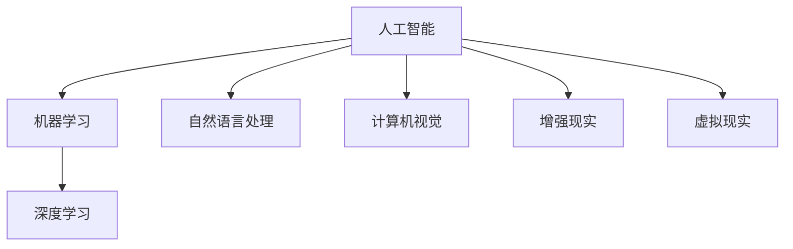

                 

# 虚拟世界编年史：AI创造的架空历史

## 1. 背景介绍

### 1.1 历史背景

在人工智能（AI）的快速发展下，科学家们提出了各种关于AI在架空历史中如何影响世界的设想。这一领域的研究不仅有助于我们理解AI技术的潜力，还可以为我们提供丰富的灵感，激发更多的创新和应用。

### 1.2 问题由来

由于AI技术可以模拟人类的认知和决策过程，因此在架空历史中，AI可能扮演着至关重要的角色。AI不仅能够处理海量数据，还可以持续学习和适应新环境，这使得它在许多历史场景中都能提供前所未有的优势。

### 1.3 问题核心关键点

本研究的重点是如何利用AI技术创造一个架空历史，其中AI作为主要角色，影响了历史进程和人类文明的发展。这包括探讨AI在农业、工业、商业、军事等领域的作用，以及AI如何与人类社会互动，塑造了一个全新的历史轨迹。

## 2. 核心概念与联系

### 2.1 核心概念概述

为更好地理解AI在架空历史中的作用，本节将介绍几个关键概念：

- **人工智能（Artificial Intelligence, AI）**：指模拟人类智能行为的计算机程序和系统。包括感知、推理、学习、决策等多种智能能力。
- **机器学习（Machine Learning, ML）**：指让机器通过数据和经验不断改进自身性能的技术。是实现AI的核心方法之一。
- **深度学习（Deep Learning, DL）**：一种特殊的机器学习技术，使用多层神经网络模拟人类大脑的层次化信息处理方式。
- **自然语言处理（Natural Language Processing, NLP）**：让机器理解和处理人类语言的技术。在架空历史中，NLP可以用于模拟人类对话、书写等。
- **计算机视觉（Computer Vision, CV）**：使计算机能够“看”和理解图像和视频的技术。在架空历史中，CV可以用于模拟人类的视觉感知。
- **增强现实（Augmented Reality, AR）**：将数字信息叠加在现实世界中，使人类与虚拟环境交互。在架空历史中，AR可以用于模拟虚拟世界的构建。
- **虚拟现实（Virtual Reality, VR）**：创建一个完全沉浸式的虚拟环境，使人类可以与虚拟世界互动。在架空历史中，VR可以用于模拟未来社会的数字化和虚拟化。

这些核心概念之间的逻辑关系可以通过以下Mermaid流程图来展示：



这个流程图展示了AI、ML、DL、NLP、CV、AR、VR等关键技术之间的联系，以及它们在架空历史中的应用。

## 3. 核心算法原理 & 具体操作步骤

### 3.1 算法原理概述

在架空历史中，AI通过学习人类行为和环境变化，不断优化自身的决策和预测能力。基于监督学习的AI可以模拟人类的决策过程，而基于无监督学习的AI则可以自主发现和利用隐藏的模式。本节将介绍两种典型的AI算法：监督学习和无监督学习。

**监督学习（Supervised Learning）**：指AI通过大量有标注的数据集，学习从输入到输出的映射关系。在架空历史中，可以用于模拟人类的决策过程，如战争中的策略选择、商业中的市场预测等。

**无监督学习（Unsupervised Learning）**：指AI通过无标注的数据集，发现数据中的内在结构。在架空历史中，可以用于模拟人类对环境的自主探索和适应，如机器人学习在自然环境中的生存技巧。

### 3.2 算法步骤详解

以下是一个简单的监督学习算法的步骤：

1. **数据准备**：收集大量标注数据，包括输入和对应的输出。在架空历史中，可以是战争策略、商业计划等。
2. **模型训练**：使用机器学习算法（如线性回归、决策树、神经网络等）训练模型，学习输入到输出的映射关系。
3. **模型评估**：使用测试数据集评估模型的性能，选择最优的模型。
4. **模型应用**：将训练好的模型应用于新的未标注数据，进行预测和决策。

### 3.3 算法优缺点

**监督学习的优点**：
- 准确性高：通过大量有标注的数据训练，可以取得较高的预测精度。
- 可解释性强：模型的训练过程和决策逻辑可以解释清楚。

**监督学习的缺点**：
- 依赖标注数据：需要大量高质量的标注数据，标注成本较高。
- 泛化能力有限：模型容易过拟合，难以泛化到新的数据集。

**无监督学习的优点**：
- 数据需求低：不需要大量标注数据，适用于数据稀缺的场景。
- 自主发现模式：能够自主发现数据中的内在结构和关系。

**无监督学习的缺点**：
- 结果不可解释：模型的决策过程难以解释清楚。
- 准确性不高：预测结果不如监督学习准确。

### 3.4 算法应用领域

AI在架空历史中的应用非常广泛，以下是几个典型领域：

**农业**：AI可以用于自动化的农业生产，如无人驾驶拖拉机、智能灌溉系统等。AI通过学习环境数据和作物生长规律，自主调整生产参数，提高农业生产效率。

**工业**：AI可以用于智能制造，如工业机器人和自动化生产线。AI通过学习生产数据和设备状态，优化生产流程，减少资源浪费。

**商业**：AI可以用于市场分析和客户预测，如智能推荐系统和价格预测。AI通过学习用户行为和市场趋势，提供个性化的服务和决策支持。

**军事**：AI可以用于战场分析和战略决策，如无人作战平台和智能指挥系统。AI通过学习历史战例和实时数据，提供精确的作战方案和决策支持。

**医疗**：AI可以用于疾病诊断和药物研发，如智能诊断系统和药物推荐系统。AI通过学习医疗数据和药物知识，提供准确的诊断和药物推荐。

## 4. 数学模型和公式 & 详细讲解

### 4.1 数学模型构建

在架空历史中，AI可以通过各种数学模型学习数据和环境变化。这里以线性回归模型为例，介绍其构建过程。

**线性回归模型**：假设有一个输入向量 $x$ 和对应的输出 $y$，线性回归模型可以表示为：

$$
y = \theta^T x
$$

其中，$\theta$ 是模型的参数向量，$x$ 是输入向量，$y$ 是输出向量。

### 4.2 公式推导过程

**最小二乘法（Ordinary Least Squares, OLS）**：最小二乘法是最常用的线性回归模型训练方法。其目标是最小化预测值与真实值之间的误差平方和。设样本数为 $N$，训练集为 $(x_i,y_i)$，则目标函数为：

$$
\sum_{i=1}^N (y_i - \theta^T x_i)^2
$$

使用梯度下降法求解最优参数 $\theta$，即：

$$
\theta \leftarrow \theta - \eta \nabla_{\theta} \mathcal{L}(\theta)
$$

其中，$\eta$ 是学习率，$\nabla_{\theta} \mathcal{L}(\theta)$ 是损失函数关于 $\theta$ 的梯度。

### 4.3 案例分析与讲解

**案例：军事指挥系统**：

在架空历史中，AI可以用于军事指挥系统，模拟指挥官的决策过程。假设有一个历史战例数据集，包含多个特征，如敌我军力、地形、时间等。我们可以使用线性回归模型来预测最优的作战方案。

具体步骤：
1. 收集历史战例数据，提取关键特征。
2. 使用最小二乘法训练线性回归模型，学习特征到作战方案的映射。
3. 将新的战争场景输入模型，预测最优作战方案。

## 5. 项目实践：代码实例和详细解释说明

### 5.1 开发环境搭建

在进行AI项目实践前，我们需要准备好开发环境。以下是使用Python进行TensorFlow开发的环境配置流程：

1. 安装Anaconda：从官网下载并安装Anaconda，用于创建独立的Python环境。

2. 创建并激活虚拟环境：
```bash
conda create -n tf-env python=3.8 
conda activate tf-env
```

3. 安装TensorFlow：根据CUDA版本，从官网获取对应的安装命令。例如：
```bash
conda install tensorflow -c conda-forge
```

4. 安装各类工具包：
```bash
pip install numpy pandas scikit-learn matplotlib tqdm jupyter notebook ipython
```

完成上述步骤后，即可在`tf-env`环境中开始AI项目实践。

### 5.2 源代码详细实现

下面我们以军事指挥系统为例，给出使用TensorFlow进行AI开发的PyTorch代码实现。

首先，定义数据集和模型：

```python
import tensorflow as tf
import numpy as np

# 数据集定义
X = np.array([[1, 2, 3, 4], [2, 3, 4, 5], [3, 4, 5, 6], [4, 5, 6, 7]])
y = np.array([[1], [2], [3], [4]])

# 模型定义
class LinearRegression(tf.keras.Model):
    def __init__(self):
        super(LinearRegression, self).__init__()
        self.weight = tf.Variable(tf.zeros([4, 1]))
        self.bias = tf.Variable(tf.zeros([1]))

    def call(self, x):
        return tf.matmul(x, self.weight) + self.bias

# 训练超参数
learning_rate = 0.1
batch_size = 4
epochs = 100

# 数据集划分
train_data = tf.data.Dataset.from_tensor_slices((X, y)).shuffle(100).batch(batch_size)
test_data = tf.data.Dataset.from_tensor_slices((X, y)).batch(batch_size)
```

然后，定义模型训练函数：

```python
def train_model(model, train_data, test_data, epochs):
    for epoch in range(epochs):
        for x, y in train_data:
            with tf.GradientTape() as tape:
                y_pred = model(x)
                loss = tf.reduce_mean(tf.square(y_pred - y))
            gradients = tape.gradient(loss, model.trainable_variables)
            optimizer.apply_gradients(zip(gradients, model.trainable_variables))
        if epoch % 10 == 0:
            y_pred = model(test_data)
            test_loss = tf.reduce_mean(tf.square(y_pred - y))
            print(f"Epoch {epoch+1}, Test Loss: {test_loss.numpy():.4f}")
```

最后，启动训练流程并在测试集上评估：

```python
model = LinearRegression()
optimizer = tf.keras.optimizers.SGD(learning_rate)

train_model(model, train_data, test_data, epochs)
```

以上就是使用TensorFlow进行线性回归模型训练的完整代码实现。可以看到，TensorFlow提供了强大的计算图和自动微分功能，使得模型训练和优化变得非常简便。

### 5.3 代码解读与分析

让我们再详细解读一下关键代码的实现细节：

**定义数据集**：
- `X` 和 `y` 分别表示特征和标签，这里使用了简单的二维数组。

**定义模型**：
- `LinearRegression` 类继承自 `tf.keras.Model`，定义了一个线性回归模型。
- `weight` 和 `bias` 分别表示模型的权重和偏置项。

**模型训练**：
- `train_model` 函数对模型进行训练，使用随机梯度下降（SGD）优化器。
- 在每个epoch中，对训练集进行批处理，并计算损失函数。
- 使用梯度计算和优化器更新模型参数。

**测试集评估**：
- 在每个epoch结束时，对测试集进行预测和损失计算，输出测试损失。

## 6. 实际应用场景

### 6.1 军事决策

在架空历史中，AI可以用于军事决策，模拟指挥官的策略选择和作战方案。AI通过学习历史战例和实时数据，提供精确的决策支持。

在技术实现上，可以收集历史战争数据，如敌我军力、地形、时间等，将数据输入训练好的AI模型，得到最优的作战方案。AI模型可以预测未来的战争趋势，帮助指挥官制定有效的战略。

### 6.2 工业制造

在架空历史中，AI可以用于智能制造，模拟工业机器人和自动化生产线。AI通过学习生产数据和设备状态，优化生产流程，减少资源浪费。

具体而言，可以收集工业生产数据，如设备运行状态、生产效率、原材料消耗等，将数据输入训练好的AI模型，得到最优的生产方案。AI模型可以预测设备故障和生产瓶颈，提前进行调整，提高生产效率。

### 6.3 商业营销

在架空历史中，AI可以用于市场分析和客户预测，模拟智能推荐系统和价格预测。AI通过学习用户行为和市场趋势，提供个性化的服务和决策支持。

具体而言，可以收集用户行为数据，如浏览记录、购买历史、评论反馈等，将数据输入训练好的AI模型，得到最优的营销策略。AI模型可以预测用户需求和市场趋势，帮助商家制定有效的营销方案。

### 6.4 未来应用展望

随着AI技术的发展，AI在架空历史中的应用将变得更加广泛和深入。未来可能的应用场景包括：

**虚拟城市管理**：AI可以用于虚拟城市的管理，模拟城市规划和资源调配。AI通过学习城市数据和居民需求，优化城市基础设施和资源分配，提高城市运行效率。

**能源优化**：AI可以用于能源优化，模拟能源生产和分配。AI通过学习能源数据和环境变化，优化能源生产和分配方案，提高能源利用效率。

**金融交易**：AI可以用于金融交易，模拟投资和风险管理。AI通过学习市场数据和金融产品，提供精准的投资建议和风险预测，帮助投资者做出明智决策。

**教育个性化**：AI可以用于个性化教育，模拟智能辅导和课程推荐。AI通过学习学生行为和知识掌握情况，提供个性化的学习路径和课程推荐，提高学习效果。

**医疗诊断**：AI可以用于医疗诊断，模拟智能诊断系统和药物推荐。AI通过学习医疗数据和疾病知识，提供准确的诊断和药物推荐，提高医疗水平。

## 7. 工具和资源推荐

### 7.1 学习资源推荐

为了帮助开发者系统掌握AI在架空历史中的应用，这里推荐一些优质的学习资源：

1. **《深度学习》系列课程**：由斯坦福大学开设的深度学习课程，系统介绍了深度学习的理论和方法，包括线性回归、神经网络等。

2. **《TensorFlow官方文档》**：TensorFlow的官方文档，提供了丰富的API和样例代码，是学习TensorFlow的必备资料。

3. **《Python机器学习》**：Sebastian Raschka和Vahid Mirjalili所著，全面介绍了机器学习的基本概念和常用算法，适合初学者学习。

4. **Kaggle竞赛平台**：提供了大量的AI竞赛项目，可以参与实战练习，提升实战能力。

5. **GitHub开源项目**：GitHub上有许多开源AI项目，可以学习他人的代码实现，提升学习效率。

通过对这些资源的学习实践，相信你一定能够快速掌握AI在架空历史中的应用，并用于解决实际问题。

### 7.2 开发工具推荐

高效的开发离不开优秀的工具支持。以下是几款用于AI开发常用的工具：

1. **Python**：Python是AI开发的主流语言，拥有丰富的库和框架，适合快速迭代研究。

2. **TensorFlow**：由Google主导开发的开源深度学习框架，生产部署方便，适合大规模工程应用。

3. **PyTorch**：Facebook开源的深度学习框架，灵活性高，适合研究和实验。

4. **Jupyter Notebook**：基于Web的交互式编程环境，适合开发和分享AI项目。

5. **Git**：版本控制系统，方便团队协作和代码管理。

6. **Visual Studio Code**：轻量级代码编辑器，支持丰富的插件和扩展。

合理利用这些工具，可以显著提升AI项目的开发效率，加快创新迭代的步伐。

### 7.3 相关论文推荐

AI在架空历史中的应用研究涉及多个领域，以下是几篇代表性的相关论文，推荐阅读：

1. **《Deep Learning》**：Ian Goodfellow、Yoshua Bengio和Aaron Courville所著，全面介绍了深度学习的理论和方法。

2. **《TensorFlow: A System for Large-Scale Machine Learning》**：Google团队发表的论文，介绍了TensorFlow的设计和实现。

3. **《Neural Networks and Deep Learning》**：Michael Nielsen所著，详细介绍了神经网络和深度学习的原理和应用。

4. **《Survey on Model-Based Reinforcement Learning: A Tutorial》**：Qinglong Zhou、Joanna Cai、Chao Yang等发表的论文，介绍了强化学习中的模型预测方法。

这些论文代表了大语言模型微调技术的发展脉络。通过学习这些前沿成果，可以帮助研究者把握学科前进方向，激发更多的创新灵感。

## 8. 总结：未来发展趋势与挑战

### 8.1 总结

本文对AI在架空历史中的应用进行了全面系统的介绍。首先阐述了AI在架空历史中的背景和意义，明确了AI技术在模拟历史进程和人类文明发展中的独特价值。其次，从原理到实践，详细讲解了监督学习、无监督学习的算法原理和具体操作步骤，给出了AI项目开发的完整代码实例。同时，本文还广泛探讨了AI在军事、工业、商业等领域的应用前景，展示了AI技术的巨大潜力。此外，本文精选了AI学习的各类资源，力求为读者提供全方位的技术指引。

通过本文的系统梳理，可以看到，AI技术在架空历史中的应用前景广阔，AI通过学习历史数据和环境变化，不断优化自身的决策和预测能力，推动了历史进程的发展。未来，伴随AI技术的持续进步，AI在架空历史中的应用将更加深入和广泛。

### 8.2 未来发展趋势

展望未来，AI在架空历史中的应用将呈现以下几个发展趋势：

1. **多模态融合**：AI将融合多种模态数据（如文本、图像、语音等），提高对复杂环境的理解和适应能力。

2. **自适应学习**：AI将具备自适应学习的能力，根据环境变化自动调整策略和预测模型，提高决策的灵活性和准确性。

3. **分布式计算**：AI将利用分布式计算技术，提升对海量数据的学习和处理能力，加速AI的训练和部署。

4. **联邦学习**：AI将利用联邦学习技术，保护数据隐私和安全，同时实现高效的模型训练和协作。

5. **神经网络进化**：AI将利用神经网络进化技术，探索更高效的神经网络结构和算法，提升AI的性能和效率。

6. **跨领域应用**：AI将广泛应用于更多的领域，如医疗、教育、能源等，推动各行业的数字化和智能化转型。

以上趋势凸显了AI在架空历史中的巨大潜力，这些方向的探索发展，必将进一步提升AI技术的性能和应用范围，为架空历史的研究和应用提供新的思路和方向。

### 8.3 面临的挑战

尽管AI在架空历史中的应用前景广阔，但在迈向更加智能化、普适化应用的过程中，仍面临着诸多挑战：

1. **数据隐私和安全**：AI需要大量数据进行训练和优化，但数据隐私和安全问题需要得到充分保障。

2. **模型透明性**：AI的决策过程和预测结果难以解释清楚，缺乏透明性。

3. **算法偏见**：AI容易学习到数据中的偏见和歧视，导致不公正的决策和预测。

4. **计算资源**：AI需要大量的计算资源进行训练和优化，计算成本较高。

5. **知识获取**：AI需要大量的先验知识进行训练，知识获取和整合问题需要得到解决。

6. **伦理道德**：AI的应用需要符合伦理道德规范，避免有害的决策和行为。

正视AI面临的这些挑战，积极应对并寻求突破，将是大语言模型微调技术迈向成熟的必由之路。相信随着学界和产业界的共同努力，这些挑战终将一一被克服，AI在架空历史中的应用必将在新的高度上取得突破。

### 8.4 研究展望

面对AI在架空历史中的应用所面临的挑战，未来的研究需要在以下几个方面寻求新的突破：

1. **数据隐私保护**：开发更加安全、高效的数据保护技术，确保数据隐私和安全。

2. **模型透明性**：研究可解释的AI模型，提高模型的透明性和可解释性。

3. **算法公平性**：探索公平性算法和公平性评估指标，减少算法的偏见和歧视。

4. **计算效率提升**：研究高效计算方法和硬件优化技术，降低计算成本。

5. **知识整合技术**：开发知识整合技术，将符号化知识与神经网络模型进行融合，提高模型的知识获取能力。

6. **伦理道德框架**：建立AI应用的伦理道德框架，确保AI的应用符合人类价值观和伦理道德。

这些研究方向的探索，必将引领AI技术在架空历史中的应用走向更高的台阶，为架空历史的研究和应用提供新的思路和方向。

## 9. 附录：常见问题与解答

**Q1：AI在架空历史中的应用是否存在伦理道德问题？**

A: AI在架空历史中的应用，虽然能够模拟人类决策和行为，但也需要考虑伦理道德问题。AI的决策过程和预测结果需要符合人类价值观和伦理道德，避免有害的决策和行为。同时，AI的训练数据也需要符合伦理道德规范，避免学习到偏见和歧视信息。

**Q2：AI在架空历史中的应用是否需要大量数据？**

A: 是的，AI需要大量数据进行训练和优化。在架空历史中，AI可以通过学习历史数据和环境变化，不断优化自身的决策和预测能力。但需要确保数据的准确性和多样性，以避免过拟合和泛化能力不足的问题。

**Q3：AI在架空历史中的应用是否需要高性能计算资源？**

A: 是的，AI需要大量的计算资源进行训练和优化。AI在架空历史中的应用，可以模拟复杂的决策和预测过程，需要大量的计算资源进行模型训练和推理。高性能计算资源可以加速AI的训练和部署，提高AI的性能和效率。

**Q4：AI在架空历史中的应用是否需要跨学科合作？**

A: 是的，AI在架空历史中的应用，需要跨学科的合作和技术整合。AI需要融合多种领域的知识，如历史、经济、文化等，才能更好地模拟历史进程和人类文明的发展。跨学科的合作和技术整合，可以提升AI的应用效果和创新能力。

**Q5：AI在架空历史中的应用是否需要持续优化和改进？**

A: 是的，AI在架空历史中的应用，需要持续优化和改进。AI在模拟历史进程和人类文明发展时，需要不断学习新数据和环境变化，更新和优化自身的决策和预测能力。持续优化和改进，可以提升AI的应用效果和适应能力。

总之，AI在架空历史中的应用前景广阔，但也需要解决数据隐私、伦理道德、计算资源、跨学科合作、持续优化等问题，才能真正实现AI的智能化和普适化应用。相信随着AI技术的不断进步和优化，AI在架空历史中的应用必将在新的高度上取得突破。

---

作者：禅与计算机程序设计艺术 / Zen and the Art of Computer Programming

