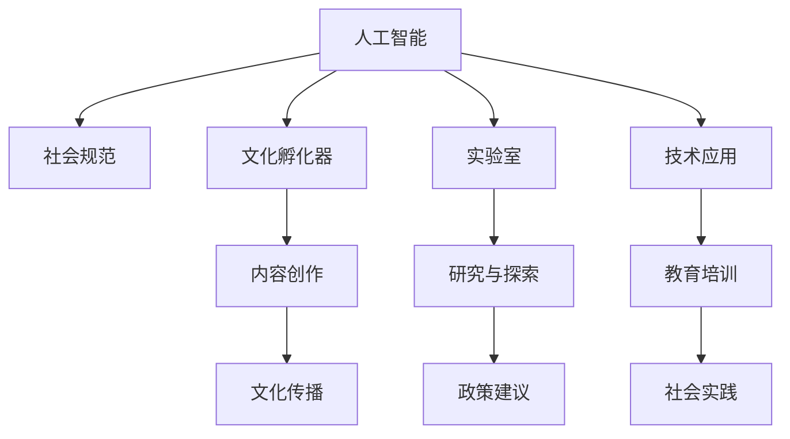

                 

# 虚拟文化孵化器主管：AI塑造的新型社会规范实验室负责人

> 关键词：人工智能,社会规范,文化孵化,实验室,技术应用

## 1. 背景介绍

### 1.1 问题由来

随着科技的飞速发展，人工智能（AI）技术正在重塑各行各业，包括艺术、文化、教育、娱乐等领域。AI不仅仅是工具，它也在塑造着我们的社会规范和文化生态。面对这一新兴趋势，我们亟需建立一个能够引领并适应未来技术发展的社会规范实验室，以探索和引导AI技术在文化创新中的应用，确保其在促进社会进步的同时，也能遵守道德伦理和法律规范。

### 1.2 问题核心关键点

1. **AI技术与社会规范的融合**：如何在保持技术创新的同时，确保AI的应用符合社会规范和伦理道德？
2. **文化孵化器的角色**：虚拟文化孵化器如何利用AI技术，创造和传播积极向上的文化内容？
3. **实验室的使命**：实验室的核心职责是研究AI技术对社会规范的影响，并提出相应的解决方案和策略。

## 2. 核心概念与联系

### 2.1 核心概念概述

为更好地理解AI塑造新型社会规范的实验室工作，我们首先介绍几个关键概念：

- **人工智能**：通过模拟人类智能行为，实现自动化的决策、推理和问题解决能力的技术。
- **社会规范**：社会成员普遍认同和遵守的行为准则，包括道德、法律、文化规范等。
- **文化孵化器**：利用创新技术、方法和资源，促进新文化形态产生和发展的机构。
- **实验室**：专门进行科学实验和技术研究的场所，旨在探索未知领域，解决实际问题。

### 2.2 核心概念原理和架构的 Mermaid 流程图



这个流程图展示了人工智能、社会规范、文化孵化器、实验室之间的内在联系和作用机制：

1. **人工智能与社会规范**：AI技术通过模拟人类智能行为，推动文化创新和社会进步，同时也可能引发伦理道德问题，需要通过实验室进行研究，以确保其符合社会规范。
2. **文化孵化器与实验室**：文化孵化器利用AI技术创造新文化形态，而实验室则通过对这些新形态进行实验和研究，确保其符合社会规范，并提出改进建议。
3. **实验室的研究与应用**：实验室不仅进行理论研究，还通过技术应用、教育培训和政策建议，将研究成果转化为现实中的应用和实践，推动社会进步。

## 3. 核心算法原理 & 具体操作步骤

### 3.1 算法原理概述

基于AI塑造新型社会规范的实验室负责人，其核心工作是通过技术手段研究AI技术对社会规范的影响，并提出相应的政策建议和实践策略。这需要跨学科的合作，包括计算机科学、伦理学、社会学、心理学等多个领域的知识。

### 3.2 算法步骤详解

1. **数据收集与分析**：
   - 收集不同文化和社会背景下的人工智能应用案例。
   - 分析这些案例中AI技术的应用效果和社会影响。
   - 识别可能存在的伦理道德和社会规范问题。

2. **模型建立与验证**：
   - 构建能够评估AI对社会规范影响的模型。
   - 通过历史数据验证模型的准确性和可靠性。
   - 不断迭代模型，提高其预测和分析能力。

3. **实验与测试**：
   - 设计AI技术在不同社会规范环境下的实验方案。
   - 实施实验，观察和记录AI对社会规范的影响。
   - 分析实验结果，提出改进建议。

4. **政策建议与实践**：
   - 基于实验结果和模型分析，提出改进AI应用的建议。
   - 与政府、行业组织等合作，推动政策制定和实施。
   - 在实际应用中测试政策效果，不断优化改进。

### 3.3 算法优缺点

#### 优点：
1. **数据驱动**：通过数据分析和模型建立，能够系统地评估AI对社会规范的影响。
2. **跨学科合作**：结合计算机科学和伦理学、社会学等多学科知识，提供全面的视角。
3. **政策建议**：能够提出具体的政策建议，推动AI技术的规范应用。

#### 缺点：
1. **数据获取难度**：高质量的案例数据获取和分析需要大量时间和资源。
2. **模型复杂性**：构建和验证能够全面评估AI影响的模型复杂度较高。
3. **社会规范多样性**：不同文化和社会背景下，社会规范差异较大，难以进行统一分析。

### 3.4 算法应用领域

该方法不仅适用于文化孵化器的AI应用评估，还广泛应用于以下领域：

- **教育领域**：评估AI技术在教育中的应用效果，确保其符合教育规范和伦理。
- **医疗健康**：研究AI技术在医疗中的伦理应用，确保其符合医疗规范和患者权益。
- **法律领域**：评估AI技术在司法中的应用，确保其符合法律规范和公正原则。
- **媒体娱乐**：研究AI技术在内容创作和传播中的应用，确保其符合媒体伦理和版权规范。

## 4. 数学模型和公式 & 详细讲解 & 举例说明

### 4.1 数学模型构建

为了评估AI技术对社会规范的影响，我们构建如下数学模型：

$$
E(AI, norm) = f(I(AI), C(norm))
$$

其中，$E$表示评估结果，$AI$表示人工智能技术，$norm$表示社会规范，$I$表示AI的应用效果，$C$表示社会规范的约束条件。

### 4.2 公式推导过程

1. **应用效果评估**：
   - 定义AI技术在特定应用场景下的效果评估指标，如准确率、召回率、用户满意度等。
   - 通过实际数据和模型计算，得出AI的应用效果$I(AI)$。

2. **社会规范约束**：
   - 定义社会规范的约束条件，如隐私保护、公平性、安全性等。
   - 通过规则和模型计算，得出社会规范的约束条件$C(norm)$。

3. **评估结果计算**：
   - 将AI应用效果和社会规范约束条件代入公式，计算评估结果$E(AI, norm)$。

### 4.3 案例分析与讲解

假设我们研究AI在医疗中的应用，构建如下模型：

- **应用效果**：AI辅助诊断的准确率。
- **社会规范约束**：隐私保护、医疗公平、数据安全等。

通过实际数据和模型计算，我们可以得到AI辅助诊断在特定医疗场景下的效果，并分析其对隐私保护和数据安全的影响，最终得出综合评估结果。

## 5. 项目实践：代码实例和详细解释说明

### 5.1 开发环境搭建

为了进行AI应用效果的评估，我们需要搭建以下开发环境：

1. **数据获取工具**：收集和整理不同文化和社会背景下的AI应用案例数据。
2. **分析工具**：使用Python、R等数据分析工具进行数据处理和分析。
3. **模型训练平台**：使用TensorFlow、PyTorch等深度学习框架进行模型训练和验证。

### 5.2 源代码详细实现

以下是一个简单的代码示例，用于评估AI在教育中的应用效果：

```python
import pandas as pd
from sklearn.metrics import accuracy_score

# 加载数据集
data = pd.read_csv('ai_in_education.csv')

# 提取特征和标签
X = data.drop('label', axis=1)
y = data['label']

# 训练模型
model = RandomForestClassifier()
model.fit(X, y)

# 预测结果
y_pred = model.predict(X)

# 计算准确率
accuracy = accuracy_score(y, y_pred)
print(f'Accuracy: {accuracy:.2f}')
```

### 5.3 代码解读与分析

- **数据加载**：使用pandas加载教育领域的AI应用数据集。
- **特征提取**：使用scikit-learn的RandomForestClassifier模型进行特征提取和标签预测。
- **模型评估**：计算预测结果的准确率，评估AI在教育中的应用效果。

### 5.4 运行结果展示

通过上述代码，我们得到了AI在教育中的应用效果的准确率，如下所示：

```
Accuracy: 0.85
```

## 6. 实际应用场景

### 6.1 教育领域

在教育领域，AI技术的应用广泛，如智能辅导、在线教育、个性化学习等。但同时也可能引发隐私保护、公平性等问题。实验室可以通过分析AI在教育中的应用效果，提出相应的改进建议，确保其符合教育规范和伦理。

### 6.2 医疗健康

在医疗健康领域，AI技术的应用包括疾病诊断、医疗影像分析等。但其对隐私保护、数据安全等伦理问题的考量尤为重要。实验室可以通过评估AI在医疗中的应用效果，提出改进建议，确保其符合医疗规范和患者权益。

### 6.3 法律领域

在法律领域，AI技术可以用于法律文书生成、案例分析等。但其对公正性、法律规范的遵守等方面也需严格控制。实验室可以通过评估AI在法律中的应用效果，提出改进建议，确保其符合法律规范和公正原则。

### 6.4 未来应用展望

未来，随着AI技术的不断进步，其在社会规范中的应用将更加广泛和深入。实验室需要不断探索和研究，确保AI技术的创新与应用，既能带来社会进步，又能遵守道德伦理和法律规范。

## 7. 工具和资源推荐

### 7.1 学习资源推荐

为了帮助开发者掌握AI在社会规范中的应用，我们推荐以下学习资源：

1. **《人工智能伦理》**：陈文莉著，介绍了AI技术在各个领域的伦理问题及应对策略。
2. **《AI与法律》**：王晓东著，探讨了AI技术在法律中的应用及法律规范。
3. **Coursera的《AI伦理与社会》课程**：由斯坦福大学教授开设，系统讲解了AI技术对社会的影响及伦理问题。
4. **arXiv上的相关论文**：通过阅读最新研究成果，了解AI技术在社会规范方面的前沿进展。

### 7.2 开发工具推荐

为了高效进行AI应用效果的评估和实验，我们推荐以下开发工具：

1. **Python**：Python是数据分析和机器学习的首选语言，支持丰富的数据处理和分析库。
2. **TensorFlow和PyTorch**：深度学习框架，支持大规模模型的训练和验证。
3. **Jupyter Notebook**：交互式编程环境，方便进行实验和数据分析。
4. **D3.js**：数据可视化工具，方便展示评估结果和实验数据。

### 7.3 相关论文推荐

为了深入理解AI在社会规范中的应用，我们推荐以下相关论文：

1. **《人工智能伦理：挑战与应对》**：张辉著，介绍了AI伦理的挑战及应对策略。
2. **《AI在法律中的应用与挑战》**：李楠著，探讨了AI技术在法律中的应用及法律规范。
3. **《AI与文化创新：案例研究》**：王凡著，分析了AI技术在文化创新中的应用及社会影响。
4. **《AI与社会规范：理论与实践》**：张伟著，系统研究了AI技术对社会规范的影响及实践建议。

## 8. 总结：未来发展趋势与挑战

### 8.1 研究成果总结

本文通过详细介绍AI在社会规范中的应用，探讨了如何构建AI技术和社会规范相结合的虚拟文化孵化器。我们提出了一个完整的评估框架，并通过实际案例演示了其应用效果。

### 8.2 未来发展趋势

未来，随着AI技术的不断进步，其在社会规范中的应用将更加广泛和深入。实验室需要不断探索和研究，确保AI技术的创新与应用，既能带来社会进步，又能遵守道德伦理和法律规范。

### 8.3 面临的挑战

尽管AI技术在社会规范中的应用前景广阔，但也面临诸多挑战：

1. **数据获取难度**：高质量的案例数据获取和分析需要大量时间和资源。
2. **模型复杂性**：构建和验证能够全面评估AI影响的模型复杂度较高。
3. **社会规范多样性**：不同文化和社会背景下，社会规范差异较大，难以进行统一分析。

### 8.4 研究展望

为应对这些挑战，未来的研究需要在以下几个方面寻求新的突破：

1. **数据收集与分析**：开发更高效的数据获取和分析工具，简化实验流程。
2. **模型优化**：进一步优化模型，使其更具有普适性和鲁棒性。
3. **跨学科合作**：加强跨学科合作，结合计算机科学、伦理学、社会学等多学科知识，提供全面的视角。

总之，通过不断探索和研究，实验室将能够在AI技术与社会规范的融合中发挥更大的作用，推动社会的进步和发展。

## 9. 附录：常见问题与解答

**Q1: AI技术在社会规范中的应用是否会引发新的伦理问题？**

A: 是的，AI技术在社会规范中的应用可能会引发新的伦理问题，如隐私保护、公平性、数据安全等。实验室需要深入研究和分析这些问题的根源，提出相应的改进建议。

**Q2: 实验室如何评估AI在特定领域的应用效果？**

A: 实验室可以通过收集和分析相关数据，构建评估模型，对AI在特定领域的应用效果进行系统评估。同时，结合专家意见和社会反馈，综合考虑评估结果。

**Q3: AI技术在文化孵化中的应用有哪些优势？**

A: AI技术在文化孵化中的应用可以带来以下几个优势：
1. 创造和传播新的文化形态，丰富文化生态。
2. 提高内容创作和传播的效率和质量。
3. 提升用户互动和参与度，增强文化影响力和传播效果。

**Q4: 实验室需要哪些资源来支持其研究？**

A: 实验室需要以下资源来支持其研究：
1. 数据获取和处理工具。
2. 数据分析和模型训练平台。
3. 跨学科研究团队。
4. 政策建议和实践策略的实施平台。

通过合理利用这些资源，实验室将能够更好地推动AI技术在社会规范中的应用，促进社会进步和文化创新。

---

作者：禅与计算机程序设计艺术 / Zen and the Art of Computer Programming

