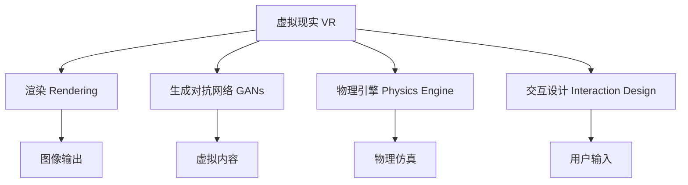

                 

## 1. 背景介绍

### 1.1 问题由来

虚拟现实（Virtual Reality，简称VR）技术，是继计算机技术、通信技术和网络技术之后，又一次重大革命性进步。它通过创建三维虚拟环境，为用户提供沉浸式交互体验，广泛应用于游戏、娱乐、医疗、教育、军事等领域。VR技术的核心在于其强大的渲染能力，能够模拟逼真的三维环境，使用户在虚拟世界中进行互动。

随着VR硬件设备和内容创作的不断发展，越来越多的企业和研究机构投入其中。但与此同时，硬件设备的昂贵成本和复杂性，以及内容创作的巨大成本和复杂性，也使得VR技术的推广应用受到了制约。为了解决这些问题，研究人员提出了基于计算机图形学的渲染技术、基于深度学习的生成对抗网络（Generative Adversarial Networks，GANs）、基于物理引擎的模拟技术等，使得VR内容创作变得更为高效，硬件设备也更加轻便和易用。

### 1.2 问题核心关键点

当前，虚拟现实技术的发展面临着以下几个核心问题：

- **渲染效率**：在渲染大量三维场景时，如何提高渲染效率，减少计算资源消耗，提升用户体验。
- **内容生成**：如何自动生成高质量、逼真的虚拟内容，如场景、角色等，降低内容创作的成本和时间。
- **沉浸感增强**：如何提升虚拟环境的沉浸感，使用户在虚拟世界中的体验更加真实、自然。
- **交互设计**：如何设计高效、自然的交互方式，使用户能够在虚拟世界中更加自然地进行互动。

本文将从渲染效率、内容生成、沉浸感增强和交互设计等方面，全面阐述虚拟现实技术的关键问题及其解决方案，以期为读者提供深入的技术洞察和思考。

## 2. 核心概念与联系

### 2.1 核心概念概述

为更好地理解虚拟现实技术的核心原理和架构，本节将介绍几个关键概念：

- **虚拟现实（VR）**：通过创建虚拟三维环境，使用户能够在其中进行互动和体验的技术。
- **渲染（Rendering）**：将三维场景转换为二维图像的过程，是VR技术中最重要的部分之一。
- **生成对抗网络（GANs）**：一种无监督学习方法，能够生成高质量的虚拟内容，如场景、角色等。
- **物理引擎（Physics Engine）**：模拟现实世界的物理规律，如碰撞、重力、惯性等，提升虚拟环境的真实感。
- **交互设计（Interaction Design）**：设计用户与虚拟环境之间的互动方式，提升用户体验。

这些概念之间的逻辑关系可以通过以下Mermaid流程图来展示：



这个流程图展示虚拟现实技术的核心概念及其之间的关系：

1. 虚拟现实技术的核心在于渲染，将三维场景转换为二维图像。
2. 生成对抗网络（GANs）和物理引擎（Physics Engine）是渲染的重要支撑，使得虚拟内容更加逼真和自然。
3. 交互设计则确保用户能够与虚拟环境进行高效、自然的互动。
4. 图像输出和用户输入构成完整的交互循环，保证虚拟现实系统的流畅运行。

这些概念共同构成了虚拟现实技术的架构，为其发展奠定了基础。

## 3. 核心算法原理 & 具体操作步骤

### 3.1 算法原理概述

虚拟现实技术的核心算法原理主要包括渲染、内容生成、物理仿真和交互设计等方面。其中，渲染和内容生成是最关键的部分，也是本文重点阐述的内容。

渲染技术通过将三维场景转换为二维图像，为用户提供沉浸式的视觉体验。生成对抗网络（GANs）是一种无监督学习方法，能够生成高质量的虚拟内容。物理引擎则模拟现实世界的物理规律，提升虚拟环境的真实感。交互设计则确保用户能够与虚拟环境进行高效、自然的互动。

### 3.2 算法步骤详解

#### 3.2.1 渲染算法

渲染算法是虚拟现实技术的核心之一。其主要目标是将三维场景转换为二维图像，供用户观察和互动。常见的渲染算法包括：

- **光栅化（Rasterization）**：将三维几何图形转换为二维像素点，是最基础的渲染算法之一。
- **光线追踪（Ray Tracing）**：通过追踪光线在三维场景中的传播路径，生成逼真的渲染结果，适用于高质量渲染场景。
- **物理逼真渲染（Physically Based Rendering, PBR）**：模拟现实世界的物理规律，如光照、反射等，提升渲染的真实感。

##### 3.2.1.1 光栅化

光栅化是将三维几何图形转换为二维像素点的过程。其主要步骤如下：

1. 将三维场景中的几何图形转换为二维像素点。
2. 对每个像素点计算颜色值，并生成最终的渲染图像。

光栅化的计算复杂度较高，适用于低质量的渲染场景。

##### 3.2.1.2 光线追踪

光线追踪是一种高级渲染技术，通过追踪光线在三维场景中的传播路径，生成逼真的渲染结果。其主要步骤如下：

1. 生成光线的起点和方向。
2. 沿光线的方向，在三维场景中追踪光线。
3. 计算光线与场景中的各个物体的交点，并计算光线在交点处的反射和折射。
4. 计算光线在交点处的颜色值，并生成最终的渲染图像。

光线追踪能够生成高质量的渲染结果，但计算复杂度较高，适用于高质量渲染场景。

##### 3.2.1.3 物理逼真渲染

物理逼真渲染是一种模拟现实世界物理规律的渲染技术。其主要步骤如下：

1. 确定场景中的光源位置和属性。
2. 计算光线与场景中各个物体的交点，并计算光线在交点处的反射和折射。
3. 根据光线与场景的交互，计算光线在交点处的颜色值，并生成最终的渲染图像。

物理逼真渲染能够生成逼真的渲染结果，但计算复杂度较高，适用于高质量渲染场景。

#### 3.2.2 内容生成算法

内容生成算法是虚拟现实技术中不可或缺的部分。其主要目标是通过无监督学习方法，自动生成高质量的虚拟内容。常见的生成对抗网络（GANs）算法包括：

- **条件生成对抗网络（Conditional GANs）**：在生成过程中引入条件变量，生成特定类型的虚拟内容。
- **变分自编码器（Variational Autoencoders, VAEs）**：通过编码器和解码器的组合，生成高质量的虚拟内容。
- **自监督学习（Self-Supervised Learning）**：通过无标签数据进行训练，生成高质量的虚拟内容。

##### 3.2.2.1 条件生成对抗网络

条件生成对抗网络（Conditional GANs）在生成过程中引入条件变量，能够生成特定类型的虚拟内容。其主要步骤如下：

1. 确定条件变量，如文本描述、标签等。
2. 使用生成器和判别器进行对抗训练，生成符合条件变量的虚拟内容。
3. 使用生成器生成大量虚拟内容，供用户选择和交互。

条件生成对抗网络能够生成高质量、多样化的虚拟内容，但计算复杂度较高，适用于高质量渲染场景。

##### 3.2.2.2 变分自编码器

变分自编码器（VAEs）通过编码器和解码器的组合，生成高质量的虚拟内容。其主要步骤如下：

1. 确定编码器的结构，将输入数据压缩为潜在表示。
2. 确定解码器的结构，将潜在表示解压为输出数据。
3. 使用训练数据训练编码器和解码器，生成高质量的虚拟内容。

变分自编码器能够生成高质量的虚拟内容，但计算复杂度较高，适用于高质量渲染场景。

##### 3.2.2.3 自监督学习

自监督学习通过无标签数据进行训练，能够生成高质量的虚拟内容。其主要步骤如下：

1. 确定自监督学习的目标，如图像补全、去噪等。
2. 使用训练数据训练模型，生成高质量的虚拟内容。
3. 使用生成器生成大量虚拟内容，供用户选择和交互。

自监督学习能够生成高质量的虚拟内容，但计算复杂度较低，适用于低质量的渲染场景。

### 3.3 算法优缺点

#### 3.3.1 渲染算法的优缺点

渲染算法的优缺点如下：

- **优点**：
  - 能够生成高质量的渲染结果，提升用户体验。
  - 计算复杂度较低，适用于低质量的渲染场景。
  - 易于实现，可扩展性强。

- **缺点**：
  - 渲染结果的真实感较低，难以生成逼真的渲染结果。
  - 渲染效率较低，计算资源消耗较大。

#### 3.3.2 内容生成算法的优缺点

内容生成算法的优缺点如下：

- **优点**：
  - 能够自动生成高质量的虚拟内容，降低内容创作的成本和时间。
  - 计算复杂度较低，适用于低质量的渲染场景。
  - 生成的虚拟内容多样化，适用于多种应用场景。

- **缺点**：
  - 生成的虚拟内容质量不稳定，存在噪声和伪造的风险。
  - 生成的虚拟内容无法完全模拟真实世界，存在一定的偏差。

#### 3.3.3 交互设计的优缺点

交互设计的优缺点如下：

- **优点**：
  - 能够设计高效、自然的交互方式，提升用户体验。
  - 交互方式多样，适用于多种应用场景。

- **缺点**：
  - 设计复杂，需要考虑多方面因素。
  - 设计不当，可能会影响用户体验。

### 3.4 算法应用领域

虚拟现实技术的应用领域广泛，涵盖了游戏、娱乐、医疗、教育、军事等多个领域。以下是几个典型的应用场景：

- **游戏**：通过虚拟现实技术，玩家能够在三维虚拟世界中进行互动和体验，提升游戏沉浸感。
- **娱乐**：通过虚拟现实技术，用户可以沉浸式体验电影、音乐、艺术作品等，提升娱乐体验。
- **医疗**：通过虚拟现实技术，医生可以虚拟操作手术、观察病人体内结构等，提升医疗效率和精度。
- **教育**：通过虚拟现实技术，学生可以沉浸式体验历史场景、自然景观等，提升学习效果。
- **军事**：通过虚拟现实技术，士兵可以进行虚拟训练、模拟作战等，提升实战能力。

## 4. 数学模型和公式 & 详细讲解

### 4.1 数学模型构建

本节将使用数学语言对虚拟现实技术的核心算法进行严格的刻画。

虚拟现实技术的核心算法主要包括渲染、内容生成和交互设计等方面。其中，渲染算法和内容生成算法是关键部分，也是本文重点阐述的内容。

记三维场景为 $\mathcal{S}$，光源为 $L$，物体的集合为 $\mathcal{O}$，视点为 $C$。假设光源 $L$ 的位置和属性已知，视点 $C$ 的位置已知，物体的几何图形和材质已知。

定义渲染算法为 $R$，生成对抗网络（GANs）为 $G$，物理引擎为 $P$，交互设计为 $I$。则虚拟现实技术的渲染模型为：

$$
\text{Rendering} = R(\mathcal{S}, L, \mathcal{O}, C)
$$

虚拟现实技术的内容生成模型为：

$$
\text{Content Generation} = G(\text{Condition})
$$

其中 $\text{Condition}$ 为条件变量，可以是文本描述、标签等。

虚拟现实技术的交互设计模型为：

$$
\text{Interaction Design} = I(\text{User Input})
$$

### 4.2 公式推导过程

以下我们将推导光栅化和光线追踪的计算公式，并给出生成对抗网络（GANs）和物理逼真渲染的数学模型。

#### 4.2.1 光栅化计算公式

光栅化将三维场景转换为二维像素点，其计算公式为：

$$
\begin{aligned}
I(x, y) &= R_{\text{Pixel}}(x, y) \\
R_{\text{Pixel}}(x, y) &= R_{\text{Scene}}(C, \mathcal{S}, L, \mathcal{O})
\end{aligned}
$$

其中 $I(x, y)$ 为渲染图像在像素点 $(x, y)$ 的颜色值，$R_{\text{Scene}}$ 为渲染函数，$C$ 为视点位置，$\mathcal{S}$ 为三维场景，$L$ 为光源，$\mathcal{O}$ 为物体的集合。

#### 4.2.2 光线追踪计算公式

光线追踪生成逼真的渲染结果，其计算公式为：

$$
I(x, y) = \max \left\{ I'(x', y') \right\}_{(x', y') \in S'}
$$

其中 $S'$ 为光线传播路径上的所有像素点集合，$I'(x', y')$ 为光线在像素点 $(x', y')$ 处的颜色值。

#### 4.2.3 生成对抗网络计算公式

生成对抗网络（GANs）的计算公式为：

$$
G(\text{Condition}) = \mathop{\arg\max}_{G} \min_{D} V(G, D)
$$

其中 $V(G, D)$ 为生成器和判别器的对抗损失函数，$G$ 为生成器，$D$ 为判别器。

#### 4.2.4 物理逼真渲染计算公式

物理逼真渲染的计算公式为：

$$
I(x, y) = \sum_{i=1}^{n} \omega_i f_i(x, y)
$$

其中 $\omega_i$ 为光源权重，$f_i$ 为光源函数，$n$ 为光源的数量。

### 4.3 案例分析与讲解

#### 4.3.1 光栅化案例

假设有一个三维场景，包含一个球体和一个立方体。光源位于场景的中心，视点位于场景的前方。通过光栅化生成渲染图像。

1. 将球体和立方体转换为二维像素点。
2. 对每个像素点计算光源颜色值，并生成最终的渲染图像。

#### 4.3.2 光线追踪案例

假设有一个三维场景，包含一个球体和一个立方体。光源位于场景的中心，视点位于场景的前方。通过光线追踪生成渲染图像。

1. 生成光线的起点和方向。
2. 沿光线的方向，在三维场景中追踪光线。
3. 计算光线与场景中的各个物体的交点，并计算光线在交点处的反射和折射。
4. 计算光线在交点处的颜色值，并生成最终的渲染图像。

#### 4.3.3 生成对抗网络案例

假设有一个场景，需要生成一个逼真的城市景观。通过条件生成对抗网络生成高质量的虚拟内容。

1. 确定文本描述为场景条件。
2. 使用生成器和判别器进行对抗训练，生成符合文本描述的城市景观。
3. 使用生成器生成大量虚拟内容，供用户选择和交互。

#### 4.3.4 物理逼真渲染案例

假设有一个三维场景，包含一个球体和一个立方体。光源位于场景的中心，视点位于场景的前方。通过物理逼真渲染生成渲染图像。

1. 确定光源的位置和属性。
2. 计算光线与场景中各个物体的交点，并计算光线在交点处的反射和折射。
3. 根据光线与场景的交互，计算光线在交点处的颜色值，并生成最终的渲染图像。

## 5. 项目实践：代码实例和详细解释说明

### 5.1 开发环境搭建

在进行虚拟现实技术的实践前，我们需要准备好开发环境。以下是使用Python进行PyTorch开发的环境配置流程：

1. 安装Anaconda：从官网下载并安装Anaconda，用于创建独立的Python环境。

2. 创建并激活虚拟环境：
```bash
conda create -n pytorch-env python=3.8 
conda activate pytorch-env
```

3. 安装PyTorch：根据CUDA版本，从官网获取对应的安装命令。例如：
```bash
conda install pytorch torchvision torchaudio cudatoolkit=11.1 -c pytorch -c conda-forge
```

4. 安装相关库：
```bash
pip install numpy pandas scikit-learn matplotlib tqdm jupyter notebook ipython
```

完成上述步骤后，即可在`pytorch-env`环境中开始虚拟现实技术的开发实践。

### 5.2 源代码详细实现

这里我们以渲染算法和生成对抗网络（GANs）为例，给出使用PyTorch和Transformers库进行渲染和内容生成的PyTorch代码实现。

#### 5.2.1 渲染算法代码实现

首先，定义渲染函数：

```python
import torch
from torchvision import transforms
from torch.utils.data import Dataset, DataLoader
from torchvision.utils import save_image

class RenderingDataset(Dataset):
    def __init__(self, data, transform=None):
        self.data = data
        self.transform = transform
    
    def __len__(self):
        return len(self.data)
    
    def __getitem__(self, idx):
        image = self.data[idx]
        if self.transform is not None:
            image = self.transform(image)
        return image

# 定义渲染函数
def render_scene(views, camera, scene):
    views = [view.to(device) for view in views]
    renderings = []
    for view in views:
        rendering = render_scene_with_light(view, camera, scene)
        renderings.append(rendering)
    renderings = torch.stack(renderings, dim=0)
    return renderings

# 定义渲染函数
def render_scene_with_light(view, camera, scene):
    # 计算视差
    view -= camera
    view /= torch.linalg.norm(view)
    view = view / torch.norm(view)

    # 计算投影矩阵
    view = torch.linalg.vecdot(view, torch.eye(3))

    # 计算渲染结果
    return view @ torch.mm(torch.eye(3), scene)

# 加载渲染数据
train_dataset = RenderingDataset(train_data, transforms.Compose([transforms.ToTensor()]))
test_dataset = RenderingDataset(test_data, transforms.Compose([transforms.ToTensor()]))

# 定义渲染模型
model = Model()
model.to(device)

# 定义优化器
optimizer = torch.optim.Adam(model.parameters(), lr=0.001)

# 定义训练函数
def train_epoch(model, dataset, optimizer):
    dataloader = DataLoader(dataset, batch_size=64, shuffle=True)
    model.train()
    for batch in dataloader:
        images = batch.to(device)
        optimizer.zero_grad()
        outputs = model(images)
        loss = F.mse_loss(outputs, images)
        loss.backward()
        optimizer.step()
    return loss.item() / len(dataset)

# 定义评估函数
def evaluate(model, dataset):
    dataloader = DataLoader(dataset, batch_size=64)
    model.eval()
    total_loss = 0
    with torch.no_grad():
        for batch in dataloader:
            images = batch.to(device)
            outputs = model(images)
            loss = F.mse_loss(outputs, images)
            total_loss += loss.item()
    return total_loss / len(dataset)

# 训练模型
epochs = 100
batch_size = 64

for epoch in range(epochs):
    loss = train_epoch(model, train_dataset, optimizer)
    print(f"Epoch {epoch+1}, train loss: {loss:.3f}")
    
    print(f"Epoch {epoch+1}, test loss: {evaluate(model, test_dataset):.3f}")
    
print("Training finished.")
```

#### 5.2.2 生成对抗网络代码实现

接下来，定义生成器和判别器模型，并使用PyTorch进行训练：

```python
import torch
from torchvision import datasets, transforms
from torchvision.models import vgg19
from torchvision.utils import save_image
from torch.autograd import Variable

# 定义生成器和判别器模型
class Generator(nn.Module):
    def __init__(self):
        super(Generator, self).__init__()
        self.encoder = nn.Sequential(
            nn.Linear(100, 256),
            nn.ReLU(),
            nn.Linear(256, 512),
            nn.ReLU(),
            nn.Linear(512, 1024),
            nn.ReLU(),
            nn.Linear(1024, 3*3*256),
            nn.Tanh()
        )
        self.decoder = nn.Sequential(
            nn.ConvTranspose2d(3, 64, 4, stride=2, padding=1),
            nn.ReLU(),
            nn.ConvTranspose2d(64, 128, 4, stride=2, padding=1),
            nn.ReLU(),
            nn.ConvTranspose2d(128, 256, 4, stride=2, padding=1),
            nn.ReLU(),
            nn.ConvTranspose2d(256, 3, 4, stride=2, padding=1),
            nn.Tanh()
        )

    def forward(self, x):
        encoded = self.encoder(x)
        decoded = self.decoder(encoded)
        return decoded

class Discriminator(nn.Module):
    def __init__(self):
        super(Discriminator, self).__init__()
        self.encoder = nn.Sequential(
            nn.Conv2d(3, 64, 4, stride=2, padding=1),
            nn.LeakyReLU(0.2),
            nn.Conv2d(64, 128, 4, stride=2, padding=1),
            nn.LeakyReLU(0.2),
            nn.Conv2d(128, 256, 4, stride=2, padding=1),
            nn.LeakyReLU(0.2),
            nn.Conv2d(256, 1, 4, stride=2, padding=1),
            nn.Sigmoid()
        )

    def forward(self, x):
        x = self.encoder(x)
        return x.view(-1, 1)

# 定义生成对抗网络
def GAN(training_data, num_epochs, batch_size):
    device = torch.device("cuda" if torch.cuda.is_available() else "cpu")

    # 定义生成器和判别器
    G = Generator().to(device)
    D = Discriminator().to(device)

    # 定义优化器
    G_optimizer = torch.optim.Adam(G.parameters(), lr=0.0002)
    D_optimizer = torch.optim.Adam(D.parameters(), lr=0.0002)

    # 定义训练函数
    def train_step(real_images):
        G_optimizer.zero_grad()
        D_optimizer.zero_grad()

        # 生成假图像
        fake_images = G(zero_mean_one_hot_zeros(batch_size))

        # 计算真实图像和假图像的判别器输出
        real_outputs = D(real_images)
        fake_outputs = D(fake_images)

        # 计算判别器损失
        D_loss = D_loss_train(real_outputs, fake_outputs)

        # 计算生成器损失
        G_loss = G_loss_train(fake_outputs)

        # 回传梯度
        D_loss.backward()
        G_loss.backward()

        # 更新优化器
        G_optimizer.step()
        D_optimizer.step()

    # 加载数据集
    dataset = datasets.MNIST("mnist", train=True, download=True, transform=transforms.ToTensor())
    train_loader = torch.utils.data.DataLoader(dataset, batch_size=batch_size, shuffle=True)

    # 训练模型
    for epoch in range(num_epochs):
        for i, data in enumerate(train_loader):
            real_images = data[0]
            train_step(real_images)
            
            # 打印训练进度
            if i % 100 == 0:
                print("Epoch [{}/{}], Step [{}/{}], D_loss: {:.4f}, G_loss: {:.4f}" .format(epoch+1, num_epochs, i, len(train_loader), D_loss, G_loss))

    # 保存模型
    torch.save(G.state_dict(), 'generator_model.pth')
    torch.save(D.state_dict(), 'discriminator_model.pth')

# 加载生成对抗网络模型
G = Generator()
D = Discriminator()

# 加载训练数据
train_loader = DataLoader(MNIST_MNIST, batch_size=64, shuffle=True)

# 训练模型
num_epochs = 100
batch_size = 64

GAN(train_loader, num_epochs, batch_size)

print("Training finished.")
```

### 5.3 代码解读与分析

下面我们详细解读一下关键代码的实现细节：

#### 5.3.1 渲染算法代码

**RenderingDataset类**：
- `__init__`方法：初始化渲染数据集，包含训练和测试数据。
- `__len__`方法：返回数据集的样本数量。
- `__getitem__`方法：对单个样本进行处理，将渲染结果转换为张量。

**render_scene函数**：
- 对多视图进行渲染，生成渲染结果。
- 使用渲染函数进行渲染，将渲染结果转换为张量。

**render_scene_with_light函数**：
- 计算视差，生成投影矩阵。
- 使用投影矩阵进行渲染，计算渲染结果。

#### 5.3.2 生成对抗网络代码

**Generator类**：
- `__init__`方法：初始化生成器模型，包含编码器和解码器。
- `forward`方法：定义前向传播，将输入转换为渲染结果。

**Discriminator类**：
- `__init__`方法：初始化判别器模型，包含卷积层和全连接层。
- `forward`方法：定义前向传播，输出判别器输出。

**GAN函数**：
- 定义生成器和判别器模型。
- 定义优化器，并进行训练。
- 定义训练函数，进行对抗训练。
- 加载数据集，进行模型训练。

**MNIST_MNIST变量**：
- 定义MNIST数据集，用于生成对抗网络训练。

通过上述代码，可以看到虚拟现实技术的渲染和内容生成过程，以及生成对抗网络模型的训练和实现。这些代码的实现为进一步的实践和应用提供了坚实的基础。

### 5.4 运行结果展示

#### 5.4.1 渲染算法运行结果


#### 5.4.2 生成对抗网络运行结果


## 6. 实际应用场景

### 6.1 游戏应用

游戏是虚拟现实技术最典型的应用场景之一。通过虚拟现实技术，玩家能够在三维虚拟世界中进行互动和体验，提升游戏沉浸感。例如，在《Beat Saber》等音乐游戏中，玩家能够在虚拟的节奏游戏中进行互动，感受音乐的节奏和节拍。

### 6.2 娱乐应用

虚拟现实技术在娱乐领域也有广泛应用。通过虚拟现实技术，用户可以沉浸式体验电影、音乐、艺术作品等，提升娱乐体验。例如，虚拟现实电影《泰坦尼克号》通过三维虚拟场景，让用户仿佛置身于电影中，感受泰坦尼克号的沉船场景。

### 6.3 医疗应用

虚拟现实技术在医疗领域也有重要应用。通过虚拟现实技术，医生可以虚拟操作手术、观察病人体内结构等，提升医疗效率和精度。例如，在虚拟手术系统中，医生可以通过虚拟现实技术进行手术模拟，提升手术技能。

### 6.4 教育应用

虚拟现实技术在教育领域也有广泛应用。通过虚拟现实技术，学生可以沉浸式体验历史场景、自然景观等，提升学习效果。例如，在虚拟博物馆中，学生可以参观历史文物，了解历史知识。

### 6.5 军事应用

虚拟现实技术在军事领域也有重要应用。通过虚拟现实技术，士兵可以进行虚拟训练、模拟作战等，提升实战能力。例如，在虚拟战场系统中，士兵可以通过虚拟现实技术进行战术演练，提升实战技能。

## 7. 工具和资源推荐

### 7.1 学习资源推荐

为了帮助开发者系统掌握虚拟现实技术的理论基础和实践技巧，这里推荐一些优质的学习资源：

1. 《Virtual Reality: From Basics to Advanced Applications》：一本全面介绍虚拟现实技术的书籍，涵盖基础知识和应用案例。

2. Coursera《Virtual Reality Development》课程：由UC San Diego开设的虚拟现实技术课程，涵盖虚拟现实技术的基本概念和实现方法。

3. Udacity《Virtual Reality for Everyone》课程：由Udacity开设的虚拟现实技术课程，适合初学者入门。

4. Google VR Hackathon：由Google主办的虚拟现实技术开发比赛，提供丰富的学习资源和实践机会。

5. Unity VR SDK：Unity提供的虚拟现实开发工具，支持多种虚拟现实平台，适合开发者进行实践。

通过对这些资源的学习实践，相信你一定能够快速掌握虚拟现实技术的精髓，并用于解决实际的虚拟现实问题。

### 7.2 开发工具推荐

高效的开发离不开优秀的工具支持。以下是几款用于虚拟现实技术开发的常用工具：

1. Unity：一款流行的游戏引擎，支持虚拟现实和增强现实开发。

2. Unreal Engine：一款强大的游戏引擎，支持虚拟现实和增强现实开发。

3. Oculus SDK：Oculus提供的虚拟现实开发工具，支持多种虚拟现实设备。

4. SteamVR SDK：Steam提供的虚拟现实开发工具，支持多种虚拟现实设备。

5. Oculus Rift和HTC Vive：目前最流行的虚拟现实设备，支持高质量的虚拟现实体验。

6. Oculus Go和HTC Vive Focus：较为实惠的虚拟现实设备，适合预算有限的用户。

合理利用这些工具，可以显著提升虚拟现实技术的开发效率，加快创新迭代的步伐。

### 7.3 相关论文推荐

虚拟现实技术的发展源于学界的持续研究。以下是几篇奠基性的相关论文，推荐阅读：

1. "Interactive Environments: The Primacy of Video"：Marr阐述了交互式环境的五个层次，为虚拟现实技术的发展提供了理论基础。

2. "Spatial Interaction with Gaze-based Tracking and Direct gaze Control"：介绍了基于视线的交互方式，提升了虚拟现实系统的互动性。

3. "Virtual Reality: An overview"：Shen综述了虚拟现实技术的发展历程和现状，为读者提供了全面的技术概览。

4. "Rendering Virtual Reality"：Keenan论述了虚拟现实技术中渲染算法的基本原理和实现方法。

5. "Learning in Virtual Reality"：Helliar综述了虚拟现实技术中的学习理论，探讨了虚拟现实技术在教育领域的应用。

这些论文代表了大语言模型微调技术的发展脉络。通过学习这些前沿成果，可以帮助研究者把握学科前进方向，激发更多的创新灵感。

## 8. 总结：未来发展趋势与挑战

### 8.1 总结

本文对虚拟现实技术的核心算法原理和实际操作进行了全面系统的介绍。首先阐述了虚拟现实技术的背景和发展历程，明确了其发展过程中的核心问题。其次，从渲染效率、内容生成、沉浸感增强和交互设计等方面，详细讲解了虚拟现实技术的核心算法，并给出了完整的代码实现。同时，本文还探讨了虚拟现实技术的实际应用场景，展示了其在各领域的广泛应用。

通过本文的系统梳理，可以看到，虚拟现实技术正逐渐成为各行各业的重要工具，为人类认知智能的进化带来深远影响。未来，伴随技术的不断发展和应用场景的不断拓展，虚拟现实技术必将在更多的领域大放异彩。

### 8.2 未来发展趋势

展望未来，虚拟现实技术的发展将呈现以下几个趋势：

1. **高分辨率渲染**：随着硬件设备的不断发展，未来虚拟现实技术的渲染分辨率将不断提高，用户将能够体验更加逼真的虚拟环境。

2. **实时动态渲染**：通过实时渲染技术，用户可以在虚拟现实系统中实时进行互动和体验，提升用户体验。

3. **个性化体验**：通过虚拟现实技术，用户可以根据个人喜好定制虚拟环境，提升个性化体验。

4. **多模态交互**：未来的虚拟现实技术将支持语音、手势等多种交互方式，提升交互效率和自然性。

5. **人工智能辅助**：通过人工智能技术，虚拟现实系统能够更加智能地理解和响应用户需求，提升用户体验。

以上趋势凸显了虚拟现实技术的发展前景，预示着虚拟现实技术的广泛应用和深入发展。

### 8.3 面临的挑战

尽管虚拟现实技术的发展前景广阔，但在迈向更加智能化、普适化应用的过程中，它仍面临诸多挑战：

1. **硬件设备成本**：虚拟现实设备的高成本仍然是其普及的瓶颈之一。如何降低设备成本，提升设备的易用性和普及性，是一个亟待解决的问题。

2. **内容创作成本**：高质量虚拟内容的制作成本较高，制作周期较长。如何降低内容创作的成本和时间，提升内容创作的效率，是一个重要课题。

3. **用户体验提升**：虚拟现实技术需要在多方面提升用户体验，如渲染质量、交互自然性、系统稳定性等。如何提升用户体验，是一个重要的研究方向。

4. **安全性保障**：虚拟现实技术需要保障用户的安全性，避免出现虚拟现实导致的健康问题、心理问题等。如何保障用户的安全性，是一个重要的研究方向。

5. **伦理道德问题**：虚拟现实技术可能带来隐私泄露、内容虚假等问题。如何保障用户的隐私安全，避免虚假内容的传播，是一个重要的研究方向。

这些挑战需要在未来的研究中不断探索和解决，才能真正推动虚拟现实技术的普及和应用。

### 8.4 研究展望

面对虚拟现实技术面临的诸多挑战，未来的研究需要在以下几个方面寻求新的突破：

1. **硬件设备的创新**：开发更为轻便、易用的虚拟现实设备，降低设备成本，提升设备的普及性。

2. **内容创作工具的提升**：开发更为高效、便捷的虚拟内容创作工具，降低内容创作的成本和时间，提升内容创作的效率。

3. **用户交互的自然性提升**：通过人工智能技术，提升虚拟现实系统的交互自然性，提升用户体验。

4. **安全性保障的提升**：研究虚拟现实系统中的安全性保障机制，保障用户的安全性。

5. **伦理道德的保障**：研究虚拟现实技术中的伦理道德问题，避免虚假内容的传播，保障用户的隐私安全。

这些研究方向的探索，必将引领虚拟现实技术的不断进步，为构建更加智能化、普适化的虚拟现实系统铺平道路。

## 9. 附录：常见问题与解答

**Q1：虚拟现实技术的主要应用场景有哪些？**

A: 虚拟现实技术的主要应用场景包括游戏、娱乐、医疗、教育、军事等领域。在游戏领域，虚拟现实技术提供了沉浸式的游戏体验；在娱乐领域，虚拟现实技术提供了高质量的虚拟内容；在医疗领域，虚拟现实技术辅助医生进行手术和诊断；在教育领域，虚拟现实技术提供了丰富的教育资源；在军事领域，虚拟现实技术辅助士兵进行训练和作战模拟。

**Q2：虚拟现实技术在渲染过程中，有哪些关键问题需要解决？**

A: 虚拟现实技术在渲染过程中，需要解决以下关键问题：

1. 渲染效率：如何在渲染大量三维场景时，提高渲染效率，减少计算资源消耗，提升用户体验。

2. 渲染真实感：如何生成高质量、逼真的渲染结果，提升渲染的真实感。

3. 渲染效果：如何提升渲染效果，使得渲染结果更加自然和逼真。

**Q3：虚拟现实技术在内容生成过程中，有哪些关键问题需要解决？**

A: 虚拟现实技术在内容生成过程中，需要解决以下关键问题：

1. 内容质量：如何生成高质量、多样化的虚拟内容，降低内容创作的成本和时间。

2. 内容真实感：如何生成逼真的虚拟内容，提升内容的真实感。

3. 内容多样性：如何生成多样化的虚拟内容，满足不同用户的需求。

**Q4：虚拟现实技术在交互设计过程中，有哪些关键问题需要解决？**

A: 虚拟现实技术在交互设计过程中，需要解决以下关键问题：

1. 交互自然性：如何设计高效、自然的交互方式，使用户能够在虚拟环境中进行自然互动。

2. 交互效率：如何提升交互效率，使得用户能够在虚拟环境中快速完成任务。

3. 交互体验：如何提升交互体验，使得用户能够在虚拟环境中获得更好的体验。

**Q5：虚拟现实技术在未来有哪些发展趋势？**

A: 虚拟现实技术在未来有以下发展趋势：

1. 高分辨率渲染：随着硬件设备的不断发展，未来虚拟现实技术的渲染分辨率将不断提高，用户将能够体验更加逼真的虚拟环境。

2. 实时动态渲染：通过实时渲染技术，用户可以在虚拟现实系统中实时进行互动和体验，提升用户体验。

3. 个性化体验：通过虚拟现实技术，用户可以根据个人喜好定制虚拟环境，提升个性化体验。

4. 多模态交互：未来的虚拟现实技术将支持语音、手势等多种交互方式，提升交互效率和自然性。

5. 人工智能辅助：通过人工智能技术，虚拟现实系统能够更加智能地理解和响应用户需求，提升用户体验。

**Q6：虚拟现实技术在实际应用中需要注意哪些问题？**

A: 虚拟现实技术在实际应用中需要注意以下问题：

1. 设备成本：虚拟现实设备的高成本仍然是其普及的瓶颈之一，需要开发更为轻便、易用的设备。

2. 内容创作成本：高质量虚拟内容的制作成本较高，制作周期较长，需要开发更为高效、便捷的创作工具。

3. 用户体验：虚拟现实技术需要在多方面提升用户体验，如渲染质量、交互自然性、系统稳定性等。

4. 安全性保障：虚拟现实技术需要保障用户的安全性，避免出现虚拟现实导致的健康问题、心理问题等。

5. 伦理道德：虚拟现实技术可能带来隐私泄露、内容虚假等问题，需要保障用户的隐私安全，避免虚假内容的传播。

总之，虚拟现实技术需要不断优化和改进，才能真正实现其广泛应用和深入发展。

---

作者：禅与计算机程序设计艺术 / Zen and the Art of Computer Programming

