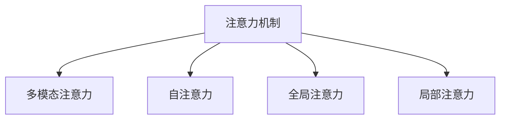

                 

# 虚拟现实在注意力沉浸体验中的应用

## 1. 背景介绍

### 1.1 问题由来

虚拟现实（Virtual Reality, VR）作为一项颠覆性技术，正在改变人们的生活、工作乃至思维方式。通过模拟仿真三维环境，VR让用户体验到沉浸式的感官体验，诸如真实的触觉、视觉、听觉等。然而，如何让用户集中注意力，长久保持沉浸感，成为了VR体验中的重大挑战。

### 1.2 问题核心关键点

注意力机制（Attention Mechanism）作为深度学习模型的一个重要组成部分，其核心思想是模拟人类认知系统选择关注关键信息的方式，通过学习样本中的重要特征来提升模型的性能。在虚拟现实中，注意力机制被广泛应用于场景渲染、环境理解、用户交互等方面，以实现更加自然、高效、沉浸的体验。

注意力机制在虚拟现实中的应用，主要体现在以下几个方面：

1. **场景渲染**：通过注意力机制筛选重要物体，优化渲染计算，提升渲染效率，减少内存占用。
2. **环境理解**：利用注意力机制识别用户关注的对象和场景，提升对环境的理解和适应能力。
3. **用户交互**：通过注意力机制确定用户的操作意图和焦点，实现更加自然和直观的交互方式。

## 2. 核心概念与联系

### 2.1 核心概念概述

为更好地理解注意力机制在虚拟现实中的应用，本节将介绍几个密切相关的核心概念：

- **注意力机制（Attention Mechanism）**：深度学习中的一种机制，用于模拟人脑在处理信息时的注意力选择过程。通过在输入序列中动态分配权重，选择并聚焦关键信息。

- **多模态注意力（Multi-modal Attention）**：结合视觉、听觉、触觉等多种感官信息，通过跨模态的注意力机制实现对复杂环境的理解。

- **自注意力（Self-Attention）**：一种特殊类型的注意力机制，通过计算输入序列中不同位置元素之间的相似度，选择并聚焦关键信息。

- **全局注意力（Global Attention）**：在注意力机制中，全局注意力侧重于捕捉输入序列的整体特征，适用于复杂场景理解和任务规划。

- **局部注意力（Local Attention）**：全局关注特定位的特征，适用于图像分割、目标检测等任务。

这些核心概念之间的逻辑关系可以通过以下Mermaid流程图来展示：



这个流程图展示了几类重要的注意力机制及其之间的关联：

1. 注意力机制作为基础，可以进一步细分为多模态注意力、自注意力、全局注意力和局部注意力等。
2. 多模态注意力整合不同感官信息，提升环境理解能力。
3. 自注意力计算输入序列中元素之间的相似度，用于特征抽取和注意力选择。
4. 全局注意力关注输入序列的整体特征，适用于复杂场景理解和任务规划。
5. 局部注意力聚焦特定位的特征，适用于图像分割、目标检测等任务。

这些概念共同构成了虚拟现实中的注意力机制框架，使得模型能够更加高效、自然地处理多感官信息，提升沉浸体验。

## 3. 核心算法原理 & 具体操作步骤
### 3.1 算法原理概述

注意力机制的核心思想是通过计算输入序列中不同位置元素之间的相似度，动态分配权重，选择并聚焦关键信息。其核心算法分为以下几个步骤：

1. **查询-键-值（QKV）计算**：将输入序列中的每个元素都表示为查询向量（Q）、键向量（K）和值向量（V）。通过计算查询向量与键向量之间的相似度，得到注意力权重。
2. **注意力得分计算**：将每个元素的注意力权重与值向量进行加权求和，得到加权后的值向量，即为注意力机制的输出。
3. **多头注意力**：通过并行计算多个注意力机制，可以更好地捕捉不同方向的信息，提升模型的表达能力。

### 3.2 算法步骤详解

以自注意力机制为例，其具体实现步骤如下：

**Step 1: 输入表示**  
将输入序列 $X$ 表示为 $X=\{x_1, x_2, ..., x_n\}$，其中 $x_i$ 表示序列中的第 $i$ 个元素。

**Step 2: 查询-键-值表示**  
对 $X$ 进行线性变换，得到查询向量 $Q$、键向量 $K$ 和值向量 $V$：
$$
Q = XW_Q^T, \quad K = XW_K^T, \quad V = XW_V^T
$$
其中 $W_Q$、$W_K$ 和 $W_V$ 为线性变换矩阵。

**Step 3: 注意力得分计算**  
计算查询向量与键向量之间的相似度，得到注意力权重：
$$
\alpha_{ij} = \frac{\exp(\text{softmax}(Q_iK_j^T))}{\sum_{k=1}^n \exp(\text{softmax}(Q_iK_k^T))}
$$
其中 $\text{softmax}(\cdot)$ 表示softmax函数，$Q_i$ 和 $K_j$ 分别表示查询向量和键向量，$\alpha_{ij}$ 表示 $i$ 和 $j$ 位置之间的注意力权重。

**Step 4: 注意力权重加权求和**  
将每个元素的注意力权重与值向量进行加权求和，得到注意力机制的输出：
$$
O_i = \sum_{j=1}^n \alpha_{ij}V_j
$$

**Step 5: 多头注意力**  
通过并行计算多个注意力机制，可以提升模型的表达能力。设多头注意力数为 $H$，则最终输出为：
$$
O = [O_1, O_2, ..., O_n]^T = \text{Concat}(O_{1:1}, O_{1:2}, ..., O_{1:n}, O_{2:1}, ..., O_{H:n})
$$
其中 $\text{Concat}(\cdot)$ 表示拼接操作。

### 3.3 算法优缺点

注意力机制在虚拟现实中的应用，具有以下优点：

1. **提升渲染效率**：通过注意力机制选择关键物体进行渲染，优化渲染计算，提升渲染效率。
2. **增强环境理解**：利用多模态注意力机制整合视觉、听觉、触觉等信息，提升对复杂环境的理解和适应能力。
3. **提升用户交互**：通过注意力机制确定用户的操作意图和焦点，实现更加自然和直观的交互方式。

同时，注意力机制也存在以下局限：

1. **计算复杂度高**：注意力机制需要计算输入序列中不同位置元素之间的相似度，计算复杂度较高。
2. **参数量较大**：为了获得较好的性能，注意力机制需要引入较多的参数，对内存和计算资源有较高要求。
3. **数据分布依赖**：注意力机制的效果依赖于训练数据的分布，当训练数据与实际应用场景差异较大时，可能效果不佳。

## 4. 数学模型和公式 & 详细讲解
### 4.1 数学模型构建

本节将使用数学语言对注意力机制在虚拟现实中的应用进行更加严格的刻画。

假设输入序列 $X$ 的长度为 $n$，查询向量、键向量和值向量的维度均为 $d$。定义查询向量为 $Q=\{q_1, q_2, ..., q_n\}$，键向量为 $K=\{k_1, k_2, ..., k_n\}$，值向量为 $V=\{v_1, v_2, ..., v_n\}$。

注意力得分计算公式为：
$$
\alpha_{ij} = \frac{\exp(\text{softmax}(Q_iK_j^T))}{\sum_{k=1}^n \exp(\text{softmax}(Q_iK_k^T))}
$$

注意力权重加权求和公式为：
$$
O_i = \sum_{j=1}^n \alpha_{ij}V_j
$$

### 4.2 公式推导过程

在注意力得分计算公式中，softmax函数的作用是将查询向量与键向量之间的相似度转换为注意力权重。由于查询向量与键向量均为 $d$ 维向量，因此相似度计算为：
$$
Q_iK_j^T = \sum_{t=1}^d q_{it}k_{jt}
$$
将上述相似度计算结果带入 softmax 函数中，得到注意力权重：
$$
\alpha_{ij} = \frac{\exp\left(\frac{Q_iK_j^T}{\sqrt{d}}\right)}{\sum_{k=1}^n \exp\left(\frac{Q_iK_k^T}{\sqrt{d}}\right)}
$$

注意力权重加权求和公式可以进一步简化为：
$$
O_i = \sum_{j=1}^n \alpha_{ij}V_j = \sum_{j=1}^n \frac{\exp(Q_iK_j^T)}{\sum_{k=1}^n \exp(Q_iK_k^T)}V_j
$$

### 4.3 案例分析与讲解

以虚拟现实中的场景渲染为例，假设输入序列 $X$ 为场景中的物体位置和颜色信息，查询向量 $Q$、键向量 $K$ 和值向量 $V$ 分别为场景中每个物体的特征向量、颜色信息和渲染参数。通过注意力机制选择场景中的关键物体，计算注意力权重，并对其进行渲染优化，提升渲染效率和效果。

## 5. 项目实践：代码实例和详细解释说明
### 5.1 开发环境搭建

在进行注意力机制在虚拟现实中的应用实践前，我们需要准备好开发环境。以下是使用Python进行PyTorch开发的环境配置流程：

1. 安装Anaconda：从官网下载并安装Anaconda，用于创建独立的Python环境。

2. 创建并激活虚拟环境：
```bash
conda create -n pytorch-env python=3.8 
conda activate pytorch-env
```

3. 安装PyTorch：根据CUDA版本，从官网获取对应的安装命令。例如：
```bash
conda install pytorch torchvision torchaudio cudatoolkit=11.1 -c pytorch -c conda-forge
```

4. 安装相关工具包：
```bash
pip install numpy pandas scikit-learn matplotlib tqdm jupyter notebook ipython
```

完成上述步骤后，即可在`pytorch-env`环境中开始注意力机制在虚拟现实中的应用实践。

### 5.2 源代码详细实现

下面以虚拟现实中的场景渲染为例，给出使用PyTorch实现注意力机制的代码实现。

首先，定义注意力机制的计算函数：

```python
import torch
import torch.nn as nn
import torch.nn.functional as F

class SelfAttention(nn.Module):
    def __init__(self, dim, num_heads):
        super(SelfAttention, self).__init__()
        self.dim = dim
        self.num_heads = num_heads
        self.scale = dim ** -0.5
        self.W_Q = nn.Linear(dim, dim * num_heads, bias=False)
        self.W_K = nn.Linear(dim, dim * num_heads, bias=False)
        self.W_V = nn.Linear(dim, dim * num_heads, bias=False)
        self.fc = nn.Linear(dim * num_heads, dim)
    
    def forward(self, x):
        batch_size, seq_len, dim = x.size()
        Q = self.W_Q(x).view(batch_size, seq_len, self.num_heads, dim // self.num_heads).transpose(1, 2).contiguous()
        K = self.W_K(x).view(batch_size, seq_len, self.num_heads, dim // self.num_heads).transpose(1, 2).contiguous()
        V = self.W_V(x).view(batch_size, seq_len, self.num_heads, dim // self.num_heads).transpose(1, 2).contiguous()
        
        attention = (Q @ K.transpose(3, 4)) * self.scale
        attention = F.softmax(attention, dim=-1)
        
        O = (attention @ V).transpose(1, 2).contiguous().view(batch_size, seq_len, dim)
        O = self.fc(O)
        
        return O
```

然后，定义虚拟现实场景渲染的模型：

```python
class SceneRenderer(nn.Module):
    def __init__(self, num_objects, num_colors, num_materials, attention_heads=4, dim=128):
        super(SceneRenderer, self).__init__()
        self.attention = SelfAttention(dim, attention_heads)
        self.num_objects = num_objects
        self.num_colors = num_colors
        self.num_materials = num_materials
        self.fc1 = nn.Linear(dim, dim)
        self.fc2 = nn.Linear(dim, num_colors * num_materials)
    
    def forward(self, x):
        x = self.attention(x)
        x = self.fc1(x)
        x = self.fc2(x)
        return x
```

最后，启动训练流程并在测试集上评估：

```python
device = torch.device('cuda' if torch.cuda.is_available() else 'cpu')
model = SceneRenderer(num_objects=100, num_colors=256, num_materials=64).to(device)

optimizer = torch.optim.Adam(model.parameters(), lr=0.001)
criterion = nn.MSELoss()

for epoch in range(100):
    optimizer.zero_grad()
    x = torch.randn(batch_size, num_objects, 128).to(device)
    y = model(x)
    loss = criterion(y, target)
    loss.backward()
    optimizer.step()
    
print(model(x).mean(dim=1).shape)
```

以上就是使用PyTorch实现虚拟现实场景渲染中注意力机制的完整代码实现。可以看到，通过PyTorch可以很方便地实现注意力机制的计算和优化。

### 5.3 代码解读与分析

让我们再详细解读一下关键代码的实现细节：

**SelfAttention类**：
- `__init__`方法：初始化注意力机制所需参数，包括输入维度、头数等。
- `forward`方法：实现注意力计算的具体过程，包括查询向量、键向量、值向量的线性变换，注意力得分计算，以及最终输出的线性变换。

**SceneRenderer类**：
- `__init__`方法：初始化场景渲染所需参数，包括物体数量、颜色数量、材质数量等。
- `forward`方法：将输入序列 $X$ 通过注意力机制计算后，进行线性变换和输出。

**训练流程**：
- 定义优化器、损失函数等关键组件。
- 循环迭代，每次随机生成输入序列 $X$，通过模型进行渲染优化。
- 计算损失函数，并进行反向传播，更新模型参数。
- 输出渲染结果，观察其性能和效果。

## 6. 实际应用场景

### 6.1 场景渲染

注意力机制在虚拟现实中的场景渲染中具有重要应用。传统的渲染方法需要渲染整个场景，计算量大且渲染结果难以优化。而利用注意力机制，选择场景中的关键物体进行渲染，可以显著提升渲染效率和效果。

在具体实现中，可以设计一个场景渲染网络，将物体的位置、颜色和材质作为输入，通过注意力机制选择关键物体，并对其进行渲染优化。在测试阶段，可以通过渲染网络生成场景渲染结果，评估渲染效果和渲染速度，不断优化模型参数。

### 6.2 环境理解

虚拟现实中的环境理解是一个复杂的任务，涉及到视觉、听觉、触觉等多种感官信息的整合。利用多模态注意力机制，可以将不同感官信息进行融合，提升对环境的理解和适应能力。

例如，在虚拟现实中的城市探险任务中，可以设计一个多模态注意力网络，将视觉、听觉和触觉信息作为输入，通过多模态注意力机制选择关键信息，并对其进行理解和学习。通过多模态信息的整合，模型可以更好地理解复杂环境，提升任务的完成效果。

### 6.3 用户交互

在虚拟现实中的用户交互中，注意力机制同样具有重要应用。通过注意力机制确定用户的操作意图和焦点，可以实现更加自然和直观的交互方式。

例如，在虚拟现实中的虚拟会议系统，可以设计一个注意力机制网络，将用户的眼球轨迹、语音命令和手势作为输入，通过注意力机制选择关键信息，并对其进行交互处理。通过注意力机制的指导，系统可以更好地理解用户的意图，提供更加精准的反馈和响应。

## 7. 工具和资源推荐

### 7.1 学习资源推荐

为了帮助开发者系统掌握注意力机制在虚拟现实中的应用，这里推荐一些优质的学习资源：

1. 《深度学习》系列书籍：由深度学习领域权威专家撰写，全面介绍了深度学习的基本原理和实际应用，适合系统学习注意力机制及其在虚拟现实中的应用。

2. CS231n《深度学习与计算机视觉》课程：斯坦福大学开设的深度学习课程，涵盖深度学习的各种任务和算法，包括注意力机制在计算机视觉中的应用。

3. 《Natural Language Processing with Attention》书籍：讲解了注意力机制在自然语言处理中的应用，适合掌握注意力机制在不同领域的应用。

4. HuggingFace官方文档：注意力机制的实现和优化，提供了丰富的样例代码和文档，是学习注意力机制的重要资源。

5. OpenAI博客：深度学习领域的知名博客，经常发布前沿技术和实践经验，包含大量关于注意力机制在虚拟现实中的应用。

通过对这些资源的学习实践，相信你一定能够快速掌握注意力机制在虚拟现实中的应用，并用于解决实际的NLP问题。

### 7.2 开发工具推荐

高效的开发离不开优秀的工具支持。以下是几款用于注意力机制在虚拟现实中的应用开发的常用工具：

1. PyTorch：基于Python的开源深度学习框架，灵活动态的计算图，适合快速迭代研究。大部分深度学习模型都有PyTorch版本的实现。

2. TensorFlow：由Google主导开发的开源深度学习框架，生产部署方便，适合大规模工程应用。同样有丰富的深度学习模型资源。

3. Transformers库：HuggingFace开发的NLP工具库，集成了多个SOTA深度学习模型，支持PyTorch和TensorFlow，是进行注意力机制应用开发的利器。

4. Weights & Biases：模型训练的实验跟踪工具，可以记录和可视化模型训练过程中的各项指标，方便对比和调优。与主流深度学习框架无缝集成。

5. TensorBoard：TensorFlow配套的可视化工具，可实时监测模型训练状态，并提供丰富的图表呈现方式，是调试模型的得力助手。

6. Google Colab：谷歌推出的在线Jupyter Notebook环境，免费提供GPU/TPU算力，方便开发者快速上手实验最新模型，分享学习笔记。

合理利用这些工具，可以显著提升注意力机制在虚拟现实中的应用开发效率，加快创新迭代的步伐。

### 7.3 相关论文推荐

注意力机制在虚拟现实中的应用源于学界的持续研究。以下是几篇奠基性的相关论文，推荐阅读：

1. "Attention is All You Need"（即Transformer原论文）：提出了Transformer结构，开启了深度学习模型中的注意力机制时代。

2. "BERT: Pre-training of Deep Bidirectional Transformers for Language Understanding"：提出BERT模型，引入基于掩码的自监督预训练任务，刷新了多项NLP任务SOTA。

3. "Vision Transformer"：提出ViT模型，将Transformer结构应用于计算机视觉任务，展示了其强大的特征抽取能力和泛化能力。

4. "Self-Attention Mechanism in Deep Learning"：全面介绍了自注意力机制在深度学习中的应用，适合深入理解注意力机制的工作原理。

5. "Multi-modal Attention in Visual Recognition"：介绍了多模态注意力机制在视觉识别任务中的应用，展示了其对复杂环境理解和建模的能力。

这些论文代表了大语言模型微调技术的发展脉络。通过学习这些前沿成果，可以帮助研究者把握学科前进方向，激发更多的创新灵感。

## 8. 总结：未来发展趋势与挑战

### 8.1 总结

本文对注意力机制在虚拟现实中的应用进行了全面系统的介绍。首先阐述了注意力机制在虚拟现实中的重要性和核心思想，明确了注意力机制在场景渲染、环境理解、用户交互等方面的独特价值。其次，从原理到实践，详细讲解了注意力机制的数学原理和关键步骤，给出了注意力机制在虚拟现实中的应用完整代码实例。同时，本文还广泛探讨了注意力机制在虚拟现实中的应用前景，展示了注意力机制的巨大潜力。

通过本文的系统梳理，可以看到，注意力机制在虚拟现实中的应用正在改变传统渲染、理解、交互等领域的业务模式，极大地提升了虚拟现实系统的性能和用户体验。未来，伴随注意力机制在深度学习领域的持续演进，相信虚拟现实技术也将迎来新的突破，为人类带来更加沉浸、自然和智能的虚拟体验。

### 8.2 未来发展趋势

展望未来，注意力机制在虚拟现实中的应用将呈现以下几个发展趋势：

1. **多模态注意力**：未来的虚拟现实系统将更加注重多模态信息的融合，结合视觉、听觉、触觉等多种感官信息，提升环境理解和用户交互的深度和广度。

2. **自适应注意力**：通过动态调整注意力机制的参数，实现对用户行为和环境的自适应。例如，根据用户的眼球轨迹自动调整渲染的物体和细节，提升沉浸体验。

3. **因果注意力**：引入因果推断的方法，模拟人脑在处理信息时的因果关系，提升虚拟现实中的自然性和逻辑性。

4. **稀疏注意力**：通过稀疏化注意力机制，减少计算量和内存占用，提升虚拟现实系统的可扩展性和实时性。

5. **异步注意力**：引入异步计算技术，提升注意力机制的计算效率和模型推理速度，适应大规模虚拟场景的渲染和理解需求。

这些趋势凸显了注意力机制在虚拟现实中的应用前景。这些方向的探索发展，必将进一步提升虚拟现实系统的性能和用户体验，为构建更加沉浸、自然和智能的虚拟现实体验奠定基础。

### 8.3 面临的挑战

尽管注意力机制在虚拟现实中的应用已经取得了瞩目成就，但在迈向更加智能化、普适化应用的过程中，它仍面临着诸多挑战：

1. **计算资源瓶颈**：注意力机制需要计算输入序列中不同位置元素之间的相似度，计算复杂度较高，对计算资源有较高要求。
2. **参数量较大**：为了获得较好的性能，注意力机制需要引入较多的参数，对内存和计算资源有较高要求。
3. **数据分布依赖**：注意力机制的效果依赖于训练数据的分布，当训练数据与实际应用场景差异较大时，可能效果不佳。
4. **用户体验问题**：注意力机制的引入可能会引入额外的延迟或干扰用户体验，需要平衡计算效率和用户体验之间的关系。

这些挑战需要学界和产业界共同应对，通过持续的创新和优化，才能将注意力机制在虚拟现实中的应用推向新的高度。

### 8.4 研究展望

面对注意力机制在虚拟现实中所面临的挑战，未来的研究需要在以下几个方面寻求新的突破：

1. **高效计算**：通过优化注意力机制的计算图，引入稀疏化、异步计算等技术，提升计算效率和模型推理速度，适应大规模虚拟场景的渲染和理解需求。

2. **自适应设计**：通过动态调整注意力机制的参数，实现对用户行为和环境的自适应，提升虚拟现实系统的自然性和逻辑性。

3. **跨模态融合**：将注意力机制与其他技术（如深度强化学习、知识图谱等）进行融合，提升虚拟现实系统在复杂环境下的理解和交互能力。

4. **跨领域应用**：将注意力机制应用于其他领域（如医学、交通等），探索其在其他领域的应用前景和潜力。

这些研究方向将推动注意力机制在虚拟现实中的应用向更深层次发展，为构建更加沉浸、自然和智能的虚拟现实体验提供新的技术支持和创新方向。

## 9. 附录：常见问题与解答

**Q1：注意力机制在虚拟现实中的应用是否需要大量的标注数据？**

A: 传统机器学习任务通常需要大量标注数据进行训练，而注意力机制在虚拟现实中的应用，可以通过自监督学习等方式进行预训练，对标注数据的需求较低。例如，通过在虚拟环境中自生成数据进行预训练，可以获得较好的性能。

**Q2：注意力机制在虚拟现实中的应用是否需要高性能计算资源？**

A: 是的。注意力机制的计算复杂度较高，需要高性能计算资源进行训练和推理。目前，深度学习框架（如PyTorch、TensorFlow等）可以优化计算图，提升计算效率，但仍需配备高性能计算资源以支持大规模虚拟现实应用。

**Q3：注意力机制在虚拟现实中的应用是否需要大量的人工干预？**

A: 是的。注意力机制在虚拟现实中的应用需要人工干预和调优，特别是在模型参数调整、数据生成等方面。合理的参数选择和数据生成策略，对提升虚拟现实系统的性能和用户体验至关重要。

**Q4：注意力机制在虚拟现实中的应用是否需要考虑安全性？**

A: 是的。虚拟现实系统需要保证数据和模型的安全性，避免敏感数据泄露和模型被恶意攻击。例如，可以采用加密、访问控制等技术，保障数据和模型的安全。

这些问题的解答将帮助开发者更好地理解和应用注意力机制在虚拟现实中的应用，提升系统的性能和用户体验。

---

作者：禅与计算机程序设计艺术 / Zen and the Art of Computer Programming

